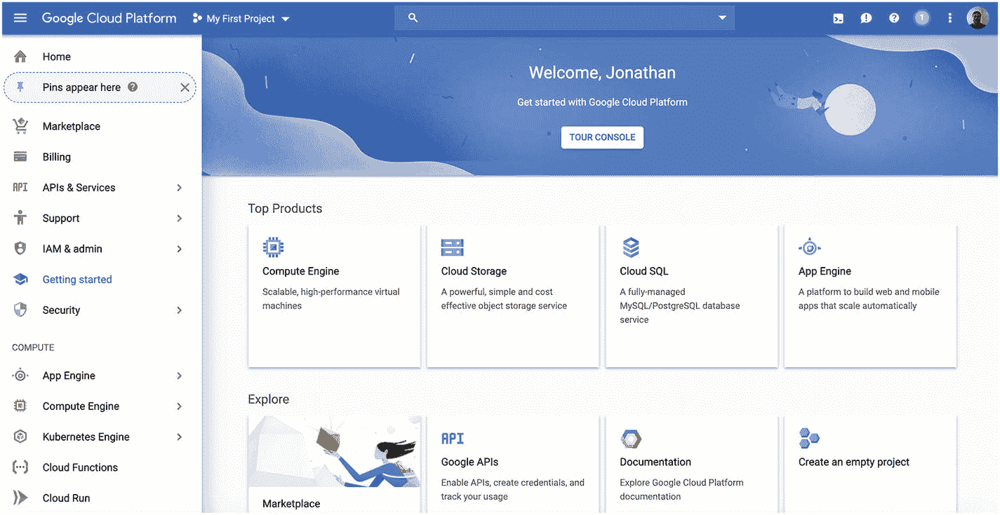
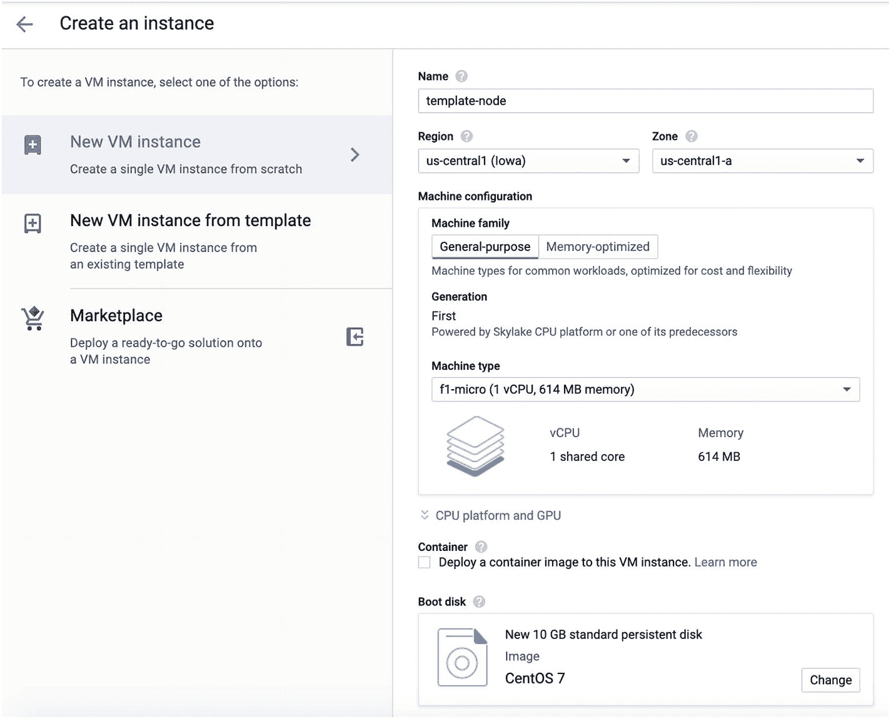
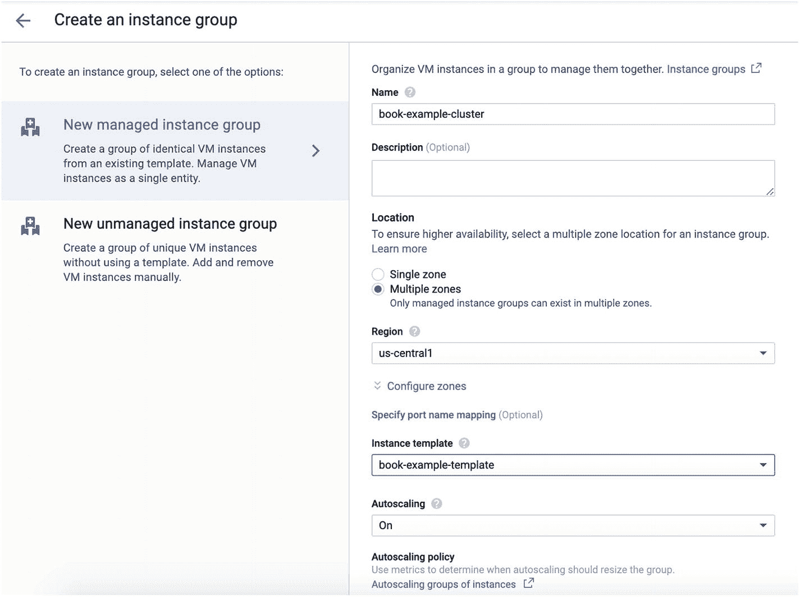

# 11. 使用谷歌云平台

既然您已经对多家云服务商有了一定的经验，我希望您能意识到，不同云服务商提供的基本组件并没有太大差异。每个服务商可能会用不同的名称、在设置过程中有细微差别，或者相比其他服务商拥有一些额外的功能或限制。然而，其核心，即 IaaS 云托管的基本要素在不同服务商之间是相当相似的。这本身就是 IaaS 的一个优势。这意味着，如果你想从一个 IaaS 迁移到另一个，过程实际上相当直接。虽然需要规划和执行时间，但由于节点本身在你的控制之下，你可以使各个环境彼此非常相似。

我们要看的下一家服务商是谷歌云平台（GCP）。GCP 是后起之秀，成立于 2008 年（Linode 始于 2003 年，AWS 于 2006 年上线）。GCP 与 AWS 非常相似，尽管配置起来稍微复杂一些。你可以通过注册 [`https://cloud.google.com`](https://cloud.google.com) 来开始使用 GCP。



图 11-1 GCP 欢迎界面

## 11.1 设置模板节点

关于 GCP，首先要了解的是，所有内容都组织在“项目”中。每个项目有点像自己的账户，拥有各自的资源、服务等，但都可以在同一个登录账户下访问。当你登录谷歌云平台时，界面应该类似于图 11-1。注意顶部栏中，“Google Cloud Platform”文字旁边列出了你当前项目的名称。你可以点击当前项目来切换项目或创建一个新项目。在本例中，我将创建一个名为 `Book Examples Project` 的新项目。

屏幕左侧列出了 GCP 的服务。要创建新机器，请前往服务的“计算”部分，点击“Compute Engine”，然后点击“VM 实例”。GCP 将其机器（或 Linode 所称的节点）称为“VM 实例”。要创建新机器，请点击“创建实例”按钮。这将弹出一个类似于图 11-2 的屏幕。

我们将这台机器命名为 `template-node`，并选择最小的机器类型（本例中为 `f1-micro`）。对于启动磁盘，我们选择 CentOS 7。向下滚动时，有一个“防火墙”部分。请确保“允许 HTTP 流量”和“允许 HTTPS 流量”都已启用。其余默认设置可以保持不变。一切设置完成后，点击“创建”，GCP 将为您创建一台新机器，并返回到 VM 列表屏幕。



图 11-2 创建 GCP VM 实例

创建机器后，您可以使用“连接”选项登录。在“连接”列的下拉菜单中，选择“在浏览器窗口中打开”，它将在您的浏览器中为您提供一个 `ssh` 会话。

此 CentOS 安装与 Linode 安装非常相似，不同之处在于：(a) 它不包含 `nano`（您可以通过简单的命令 `yum install -y nano` 修复），以及 (b) 它会自动为您创建一个用户并以该用户身份登录。您可以通过运行以下命令轻松切换到 root：

```
sudo su -
```

从那时起，您可以安装 `nano` 并执行第 3 章和第 4 章中概述的所有配置步骤，这些步骤本质上是相同的。


### 公网与私有 IP 地址

GCP 和 Linode 之间的一个有趣区别是，在 Linode 上，节点的公网 IP 地址是物理连接到节点的。也就是说，当你执行 `ip addr show` 时，它会显示公网 IP 地址。当你添加一个私有 IP 地址时，它会将该私有 IP 地址添加到你的节点。

然而，在 GCP 中，您的节点*初始*就同时拥有私有地址和公有地址。但是，只有私有地址是物理映射到设备的。公网 IP 地址是在网络设备上配置的，用于将这些请求转发到您的机器。

因此，在您机器上的所有配置中，您将使用机器上的私有 IP 地址。此外，您无需担心仅监听私有 IP 地址的问题，因为您实际拥有的也只有它。GCP 网络控制着哪些服务可以从外部访问您的机器（这就是为什么在设置 VM 实例时勾选了 HTTP 和 HTTPS 复选框——以告知 GCP 将这些类型的请求路由到您的私有 IP 地址）。

基本上，除非另有指定，GCP 中的所有内容都限制在本地网络中。

## 11.2 设置数据库服务器以实现远程访问

为了将我们的 `template-node` 用作数据库服务器，我们需要准备该机器以实现数据库的远程访问。为此，我们需要执行以下操作：

1.  修改 `/var/lib/pgsql/data/postgresql.conf` 并设置 `listen_addresses='*'`。我们*不必*将其专门设置为私有 IP 地址，因为这是我们仅有的 IP 地址，而且除非我们配置 GCP 允许，否则它无法从互联网访问。使用 `systemctl restart postgresql` 重启 PostgreSQL 以使更改生效。

2.  更改防火墙，以便允许连接到 PostgreSQL 服务器。这需要使用命令 `firewall-cmd --add-port 5432/tcp` ，以及带有 `--permanent` 标志的相同命令。

3.  修改 PHP 代码 `getReadOnlyConnection()` 和 `getReadWriteConnection()`，使其连接到正确的私有 IP 地址。

现在，该服务器已准备好供负载均衡集群使用。


## 11.3 创建副本映像

在 GCP 中创建副本映像是一个略显繁琐的三步流程。首先，你需要为实例创建一个“快照”；然后，基于该快照创建一个“映像”；最后，你需要创建一个“实例模板”。快照本质上是机器的一个备份。映像则是一种专门用于为机器创建新启动盘的快照。实例模板则将映像与机器设置（大小、配置等）结合在一起，可用于快速部署相同的机器。

创建快照是一个相当直接的过程。从主菜单（点击“Google Cloud Platform”旁边的三条横线图标）进入“计算”部分，选择“Compute Engine”，然后选择“快照”。点击“创建快照”按钮。系统会要求你提供快照名称、源磁盘和位置。你可以随意命名，选择现有的 VM 实例作为源磁盘，位置可以保持默认（“多区域”是最灵活的选择）。点击“创建”，GCP 就会为你创建一个新的快照。

现在，GCP 确实允许你直接从快照创建实例。但是，为了能使用 GCP 的更多功能，最好基于你的快照创建一个 GCP 所谓的“映像”。为此，请进入主菜单，然后进入“计算”部分，选择“Compute Engine”，再选择“映像”。页面会加载一个包含大量预配置映像的列表。你可以忽略它们。我们要创建自己的映像。点击“创建映像”按钮开始操作。

为映像命名（例如 `template-image`），并将“来源”设置为“快照”。这会弹出一个菜单，询问你要基于哪个快照创建映像。选择你刚刚创建的那个快照。如果需要，你可以添加一个“系列”名称。这将允许你创建具有相同“系列”名称的该实例的更新版本。

现在点击“创建”。至此，你就可以从这个映像创建新的机器了。在创建新机器时，在“启动磁盘”下的“自定义映像”标签页中，就可以找到你的映像。

最后，我们需要将这个映像打包到一个实例模板中。实例模板可以在主菜单下的“Compute Engine” -> “实例模板”中找到。创建实例模板的过程与创建普通 VM 实例相同。区别在于，它不会立即创建任何实例，而是可以稍后用于快速部署完全预配置好的机器。请确保在创建实例模板时，将启动映像设置为你上一步刚刚创建的映像。


### 更谨慎地对待模板

请注意，因为我们在成为模板的机器上设置了数据库，所以集群中的每个新 Web 服务器实际上都会有一个未使用的数据库副本，并且其上运行着 PostgreSQL。这本身不是问题，但如果你要进行生产部署，你可能需要确保在模板上关闭 PostgreSQL。由于 GCP 的步骤已经很多，本章的目标是简化获得运行配置所需执行的步骤。

## 11.4 创建负载均衡组

然而，你也可以创建一个可自动扩展、负载均衡的机器组，称为“实例组”。这类似于我们在第 5 章中所做的，但 GCP 会实际为你管理应用程序的扩展。换句话说，当机器负载增加时，GCP 会自动启动新的、相同的机器，并将它们添加到负载均衡器下。



*图 11-3 创建实例组*

你可以在主菜单的“Compute Engine”下找到实例组。点击“创建实例组”开始该过程。图 11-3 显示了该过程的界面。

为你的实例组命名。为了增强容错能力，请在“位置”下选择“多个可用区”。选择我们在 11.3 节中创建的实例模板。确保“自动扩展”设置为“开启”。如果你愿意，可以将最小实例数设置为大于 1，以确保 GCP 在多个服务器之间对你的应用进行负载均衡。点击“创建”来构建你的实例组。

默认情况下，实例组几乎不做任何事。我们需要一种将流量引入实例组的方法。这可以通过负载均衡器实现。

要创建负载均衡器，在主菜单下，找到“网络服务”，然后选择“负载均衡”。点击“创建负载均衡器”开始操作。接下来选择“HTTP(S) 负载均衡”。然后选择“从互联网到我的虚拟机”，因为我们希望此负载均衡器充当互联网与机器之间的网关。

下一个屏幕提供了主要的配置区域。首先，为你的负载均衡器命名。接下来，在“后端配置”下，选择“后端服务”，然后选择“创建后端服务”。你需要为你的后端服务命名（名称无关紧要），然后选择你的实例组，再创建一个健康检查（健康检查只需设置为 TCP 端口 80）。然后点击“创建”，它将创建你的后端服务。你可以将“主机和路径规则”以及“前端配置”保留为默认值。点击“检查并最终确定”查看所有设置。最后，点击“创建”来构建你的负载均衡器。你可以访问生成的 IP 地址，它将平衡机器之间的负载。

请记住，GCP 实际完成负载均衡器的创建需要相当长的时间。即使 GCP 在其界面中“认为”全部创建完成，并告诉你所有实例都已添加到负载均衡器，实际生效仍需要几分钟时间。因此，在负载均衡器激活后的最初几分钟内，访问 URL 时 GCP 可能会报告错误。


### 移除负载均衡器

移除 GCP 负载均衡器比看起来要困难。要移除我们以这种方式创建的负载均衡器，需要执行以下步骤：

1. 从负载均衡器列表中删除负载均衡器本身。
2. 在负载均衡器列表页面，有一个名为“后端”的标签页。点击该标签页查看你的后端服务。
3. 在“后端”标签页下，点击你为负载均衡器创建的后端服务，并将其删除。
4. 现在你的负载均衡器已被移除，但你还需要处理你的实例组，否则你将持续为你的机器付费（在其他步骤完成之前，你无法移除你的实例或实例组）。
5. 如果你希望不为你的映像付费，你还必须删除你的实例模板，然后删除你的映像以及你的快照。

## 11.5 其他 GCP 服务

与 AWS 一样，GCP 也提供许多其他在创建云应用时可能有用的服务。几个类似的服务包括：

*   Cloud SQL（类似于 RDS）
*   Storage（类似于 S3）
*   Memorystore（类似于 ElastiCache）


另外，GCP 也通过名为 Google App Engine 的服务提供 PaaS 服务。总的来说，GCP 拥有许多与 Linode 和 AWS 相同的服务，但使用起来稍微复杂一些。在某些极端情况下，这种复杂性可能会带来额外的可配置性，但通常并不需要。例如，GCP 使得将不同的子目录映射到不同的实例组变得相对简单。这使得在同一个主机名下托管多个应用程序，并将每个应用程序放在不同的实例组中变得更加容易。对于大多数应用程序来说，GCP 的复杂性超过了它所提供的可配置性。

## 12. 服务器管理技术

到目前为止，每当我们需要向云端推送更新时，都必须重新镜像所有服务器。这并非不可接受，但也不是最佳方案。想象一下，如果你运营着一个拥有 20 台不同服务器的服务器集群，你真的愿意每次重新部署代码时都去重新镜像它们吗？很可能不愿意。如果你想安装一个服务器补丁，你愿意去重新镜像所有服务器吗？同样，很可能不愿意。

幸运的是，有许多工具可以帮助管理大量机器。它们各有不同的侧重点——有些专注于简化重复性任务，而另一些则是完整的管理解决方案。我是一个简单的人，通常更喜欢简单的工具，而不是庞大、包罗万象的解决方案。

## 12.1 在多个服务器上运行命令

假设我们想在集群中的每台机器上安装一个新的软件包。`ImageMagick` 是一个流行的图像处理软件包。如果我们想在所有节点上安装 `ImageMagick`，过程相当简单。我们只需通过 `ssh` 登录到每台机器，运行 `yum install -y ImageMagick`，然后退出。

幸运的是，有一种软件可以帮我们完成这项工作，叫做 `pssh`，它是 Parallel SSH 的缩写。你不需要在服务器上安装任何新东西。`pssh` 安装在你本地的机器上，然后仅通过常规的 `ssh` 机制，就能在所有远程机器上运行相同的命令。

然而，将 `pssh` 安装在你的 `template_node` 机器上可能更简单，这样你就可以从任何地方使用它（即，你可以登录到你的模板节点，然后在那里运行 `pssh`）。`pssh` 在 EPEL 软件包中可用，因此我们可以通过以下方式将其安装到 `template_node` 上：

```
yum install -y pssh
```

要使用它，我们需要创建一个文件（我们将其命名为 `servers.txt`），其中列出我们正在管理的所有服务器。使用 `nano` 创建该文件，并将每台服务器的*公网* IP 地址放入文件中。要使用 `pssh`，你只需输入：

```
pssh -A -h servers.txt --user root COMMAND
```

只需将 `COMMAND` 替换为你要运行的命令。因此，我们可以发出以下命令来为每台服务器安装 `ImageMagick`：

```
pssh -A -h servers.txt --user root yum install -y ImageMagick
```

`pssh` 会询问我们密码（这就是 `-A` 的作用），然后它会通知我们何时完成任务。现在，你只需确保 `servers.txt` 文件保持最新，你就可以从单台机器上轻松地执行大多数管理任务。

当命令运行时，它会告诉你每台服务器的状态，如果出现故障，它会告诉你命令给出的错误代码。例如，对于三台服务器，输出可能如下所示：

```
[1] 23:00:32 [SUCCESS] 45.79.7.179
[2] 23:00:32 [SUCCESS] 45.79.7.180
[3] 23:00:32 [FAILURE] 45.79.7.181 Exited with error code 1
```

然后你需要检查命令执行失败的机器，并确定哪里出了问题。

## 12.2 在多个服务器上同步文件

既然在每台服务器上运行命令现在很容易了，那么能够将一组文件复制到每台服务器上也将非常方便。幸运的是，`pssh` 自带两个文件复制工具，名为 `pscp` 和 `prsync`，因此你可以轻松地将文件复制到远程服务器。这样，当你部署新版本的软件时，就不必重新镜像每台服务器了。`pscp` 程序有时被称为 `pscp.pssh`，因此如果在安装 `pssh` 后找不到 `pscp` 命令，请尝试使用 `pscp.pssh`。

假设你有一个文件 `testme.html`，并且你想以用户 `fred` 的身份将其复制到每台服务器的 `/var/www/html` 目录下。要执行此任务，只需输入以下命令（全部在一行内）：

```
pscp -A -h servers.txt --user fred testme.html /var/www/html/testme.html
```

如果你想复制整个目录，可以使用相同的过程，但需要添加 `-r` 参数进行递归复制。然而，`pscp` 的一个问题是它不会为你删除文件。如果你想保持两个目录完全同步（包括添加和删除），你可以使用 `prsync`，尽管它的语法稍微复杂一些。

如果我想将本地目录 `mirror_me` 镜像到服务器的 `/var/www/html/mirror_me` 目录下，我会发出以下命令（全部在一行内）：

```
prsync -A -a -x --delete --user fred -h hosts.txt mirror_me /var/www/html/
```

通过使用 `pssh` 执行命令，使用 `pscp` 处理单个文件，以及使用 `prsync` 处理整个目录，就可以相当轻松地完成一组服务器的基本管理工作。

此外，还有一些专门用于在多个服务器上进行应用程序部署的工具。其中比较流行的一个是 Capistrano。Capistrano 使用 Ruby 编写和定制，但它可以部署任何语言的应用程序。Capistrano 自动化了许多与文件部署相关的任务，包括：

*   与 `git` 仓库同步
*   在服务器上维护应用程序的先前版本，以便快速回滚
*   使用符号链接管理部署，使整个部署瞬间切换
*   运行与部署相关的自定义任务和脚本

随着你的应用程序变得越来越复杂，你对工具的需求也会越来越复杂，而拥有像 Capistrano 这样的工具可以满足许多此类需求。

## 12.3 全服务解决方案

虽然 `pssh` 允许你向一组机器发出命令，Capistrano 允许你以更稳健的方式自动化部署，但还有一些更进一步的解决方案，它们可以为你完全管理目标系统。这些解决方案被称为“配置管理系统”。这些系统虽然能处理各种情况，但也带来了复杂性。对于大多数系统来说，我认为配置管理系统有些大材小用，它们增加的复杂性比解决的问题还多。然而，它们做得很好的一件事是，迫使你记录你的配置是什么（并且希望也能记录为什么这样设置）。仅仅拥有一台配置正确的服务器，并不能向未来的管理员（或未来的你自己）传达哪些配置部分是默认设置的，哪些部分是为特定目的而专门配置的。使用配置管理工具，你的系统配置既可以记录在案，也可以进行版本控制。

作为一个喜欢极简方法的人，在系统配置方面，我真的很欣赏 Ansible 系统，它甚至不需要在远程服务器上安装任何东西。Ansible 通过 `ssh` 完成所有配置，并且很容易上手和运行。在 [`http://ansible.com/`](http://ansible.com/) 上有一个不错的用户界面，但它需要额外的费用（尽管也有开源的 GUI 可用）。然而，如果你只需要一个命令行工具，那么开源版本拥有所有配置管理工具中最小的占用空间之一。

你甚至可以通过一个简单的命令从 EPEL 仓库安装它：


`yum install -y ansible`

然而，如果你想进行大规模部署，虽然还有其他几种选择可供参考，但许多开发者会选择 Chef。Chef 基于 Ruby 编程语言，允许开发者根据需求创建任意复杂度的配置。Chef 还提供多种反馈机制，让你能查看所有受管服务器的状态。使用 Chef，你不仅可以随心所欲地配置服务器，还可以收集相关数据并进行分析。

对于刚起步的应用程序，我建议只保留一份手动的配置变更日志。随着你的应用成长和成熟（并希望最终拥有数百万用户），明确你的配置管理就变得愈发重要，此时可能值得转向一个更全面的解决方案。

我们已讨论过的某些云系统内置了一定程度的配置管理功能。GCP 的实例模板/实例组系统可以被视为一个极简的配置管理系统。简而言之，当你保持实例模板为最新时，GCP 会将其部署到整个实例组中。而 Elastic Beanstalk 允许你使用名为“EB Extensions”的环境自定义设置，来定制部署应用的机器。尽管 Elastic Beanstalk 技术上是一个 PaaS，但这些扩展允许你在部署目标平台上执行配置管理。

## 13. Linux 安全基础

本章并非旨在成为一份云安全完整指南，而仅仅是为你指明正确的方向。安全与其说是一系列步骤，不如说是一个过程和一种思维方式。因此，本章将重点介绍你需要如何思考，以保护服务器的完整性和数据的完整性。

## 13.1 基本考量

对于系统管理员来说，最重要的安全考量如下：

*   如何降低连接到互联网的风险？
*   在保证系统正常运行的前提下，可以运行的最少服务集是什么？
*   如何限制对那些并非所有人都需要的服务的服务器访问？
*   我所有的软件是否都已更新最新的安全补丁？
*   他人可能以何种方式滥用部署在服务器上的服务，以及如何减轻这种风险？

安全的关键在于明确服务器的用途，然后移除任何不直接服务于该用途的部分，以防止意外后果。你运行的每一个服务都是一个潜在的安全漏洞——某天可能会有人找到利用它的方法。因此，你不想暴露那些不直接贡献于核心功能的点。

## 13.2 检查当前服务器

检查服务器上当前正在运行并监听的服务的最佳工具是 `ss`（socket statistics）。要查找每个正在监听连接的 TCP 服务，请以 root 身份运行以下命令：

```
ss -plnt
```

每一行显示 `LISTEN` 的条目都是一个正在监听 IP 连接的服务。如果“Local Address”是 `127.0.0.1`、`::1`（对于 IPv6 地址）或节点的私有 IP 地址，这意味着该服务是受保护的——只有*机器本身上的应用程序*（或者在私有网络的情况下，私有网络上的程序）才能看到该服务。但是，如果本地地址是 `*`、`0.0.0.0` 或 `::`（对于 IPv6 地址），则意味着任何人都可以连接到该服务。

类似地，对于 UDP 连接，你可以执行：

```
ss -plnu
```

对于每个可供连接的服务（TCP 或 UDP），除非你完全确定希望他人连接，否则应确保它没有被防火墙允许。要获取防火墙允许的服务列表，请执行以下命令：

```
firewall-cmd –list-all
```

列在“services”和“ports”下的项目就是防火墙放行的内容。你应该允许的服务包括 `dhcpv6-client`（用于云配置网络）、`ssh`（以便你能登录）、`http`（用于非 SSL 的 HTTP 连接）和 `https`（用于启用 SSL 的 HTTP 连接）。

即使防火墙会阻止对未列出的任何内容的连接，如果你运行了任何监听连接但并非特别需要运行的服务，也应该禁用该服务。此外，你应该定期检查防火墙，确保其配置正确。

此外，你应该盘点所有正在运行的进程，即使它们没有在监听连接。在 Linux 上，最好的方法是使用命令 `ps -afxww`。请注意，每个人调用 `ps` 都有自己偏爱的方式，但这是我的做法。

我无法给你一个应该/不应该运行的所有内容的列表。不过，最好的做法是了解每个组件的功能，并关闭你不需要的组件。运行的服务越少越好。

你还可以使用命令 `rpm -qa` 列出你已安装的所有软件包。随着你经验的积累，你应该能够卸载不需要的程序。

## 13.3 Root 用户

Linux 系统中最危险的部分是 root 用户。它之所以危险，有两个原因。首先，它是超级用户，因此拥有对其他一切的完全控制权。其次，每个人都知道它的用户名，这使得自动化的黑客工具更容易入侵。

有几种方法可以缓解与 root 用户相关的问题，包括：

1.  root 口令应该是安全的（即，即使是计算机也难以猜测）。实际上，*每个*用户的口令都应该是安全的。
2.  服务器不应允许远程直接 root 登录。要阻止通过 `ssh` 的直接 root 登录，请修改 `/etc/ssh/sshd_config`。如果已存在一行 `PermitRootLogin`，请将值从 `yes` 改为 `no`。如果没有这一行，则添加一行 `PermitRootLogin no`。保存文件后，执行 `systemctl restart sshd`，更改将生效。此后，你将需要以普通用户身份登录，并使用 `su` 命令切换到 `root` 用户。
3.  服务应尽量避免以 root 用户身份运行，除非有压倒性的理由这样做。如果某个服务必须以 root 身份执行某些操作，那么该服务中直接与远程计算机通信的部分不应是 root。
4.  用户不应长时间以 root 用户身份操作。在本书中，我们大部分时间都是以 root 用户身份操作的。实际上，用户应以自己的账户登录，然后使用 `su` 或 `sudo` 临时切换到 root 用户以获取 root 权限。
5.  你应该安装某种服务拒绝程序，例如 `fail2ban`，它会在特定 IP 地址经过一定次数的失败尝试后禁止其登录。

通过防止他人成为 root 用户、运行不以 root 用户身份运行的服务，以及保护 root 账户免受外部访问，入侵者造成破坏的能力将大大降低。

大多数管理员使用 `sudo` 来管理对 root 用户的访问。`sudo` 命令允许用户*使用自己的密码*临时获得 root 用户的访问权限，或者登录后无需密码即可获得。它已经安装在你的机器上，并允许任何属于 `wheel` 组的用户以 root 身份运行任何命令。要将用户（例如 `fred`）添加到 `wheel` 组，请执行以下命令：

```
usermod -a -G wheel fred
```


现在，`fred`用户只需在命令前加上`sudo`，就能以 root 用户身份运行任何命令。例如，如果`fred`想要显示`/etc/sudoers`文件（`sudo`命令的配置文件），Linux 通常不会允许他这么做。如果他执行`cat /etc/sudoers`，操作系统会报错。但是，如果`fred`属于`wheel`组，并且他执行`sudo cat /etc/sudoers`命令，操作系统会要求他输入密码，并在重新验证身份后替他执行该命令。

要在`PermitRootLogin=no`的情况下使用`pssh`，你需要使用`sudo`来切换用户。然而，`pssh`不支持交互式操作，当系统要求用户输入密码时会导致问题。因此，你需要修改`sudo`的默认配置，允许用户在不提供密码的情况下使用`sudo`（他们仍然需要密码来登录系统）。为此，请以 root 用户身份在`/etc/sudoers`文件中添加以下一行：

```
%wheel ALL=(ALL) NOPASSWD: ALL
```

现在，使用`pssh`时，你可以以`fred`用户身份登录，然后通过`sudo`执行系统管理命令，如下所示：

```
pssh -A -h servers.txt --user fred sudo put_your_command_here
```

## 13.4 安装 Web 应用防火墙

Web 应用防火墙是一种位于你的 Web 应用与互联网之间的软件。它的目的是检查传入流量中是否包含已知的恶意意图模式，并阻止这些请求。Web 应用防火墙并不能弥补 Web 应用本身编程不良的问题，但它通常能阻止自动化黑客工具发现漏洞。

Apache 有一个易于安装的 Web 应用防火墙可用。要安装它，只需以 root 身份执行以下操作：

```
yum install -y mod_security mod_security_crs
systemctl restart httpd
```

然而，对于我们的测试站点，Web 应用防火墙很可能会阻止那些在 URL 中使用 IP 地址的请求，因为这是许多黑客攻击尝试的特征！事实上，我发现对于许多生产系统，我不得不禁用几个单独的规则，才能让 Web 应用防火墙与我的应用配合工作。这可能会很麻烦，但总体上是值得的。Web 应用防火墙会将拒绝请求的规则记录在日志文件`/var/log/httpd/error_log`中。因此，你可以在日志中找到规则 ID 号，然后在配置中禁用它。只需在文件`/etc/httpd/conf.d/mod_security.conf`中添加一行`SecRuleRemoveById IDNUM`，即可禁用不需要的规则。

## 13.5 检查 Rootkit

Rootkit 是由入侵你服务器的人安装的一种软件，它能使控制你的服务器进行恶意行为变得更加容易。如果你的服务器是安全的，那么被入侵的可能性很小，但定期检查仍然是个好习惯。

用于检查 rootkit 的两个标准软件是`rkhunter`和`chkrootkit`。`rkhunter`目前是 EPEL 的一部分，可以通过以下命令安装：

```
yum install -y rkhunter
```

要运行该程序，只需执行`rkhunter --check`。请注意，它可能产生错误的警告和误报，因此务必检查日志，了解它在检查某个问题时具体发现了什么。

## 13.6 其他安全软件

还有大量的其他安全软件包可供你安装和使用。重要的是要了解有哪些可用的措施，并判断它们是否对你的需求具有成本效益。

Linux 上其他一些常见的安全软件包包括：

*   **logwatch**：该工具分析日志文件，并在记录到可疑活动时通过电子邮件通知管理员。
*   **fail2ban**：该程序会查找重复的登录失败和其他可疑行为，并会阻止那些看起来试图入侵的 IP 地址。


- **SELinux**：安全增强型 Linux 是一种操作模式，Linux 内核在此模式下对程序进行非常精细的访问控制，与普通模式相比，它能显著限制每个程序和用户的权限。SELinux 可以降低大量风险，但配置起来相当复杂，并且很容易意外阻止你自己的应用程序执行其所需的操作。由于涉及大量配置问题，我们在本书中禁用了 SELinux。

- **FirewallD**：这是本书中使用的标准防火墙管理应用程序。

- **AuditD**：此程序会查找并记录应用程序的可疑活动。

- **远程 Syslog**：这不是一个程序，但系统日志记录器可以配置为将日志记录到远程服务器，这样入侵者就无法通过修改日志文件来掩盖其踪迹。

## 13.7 应用程序安全

最难保护的就是应用程序本身。实际上，不写另一本书的话，我无法提供太多技巧。尽管如此，需要记住的最重要的事情是：

1.  防御性编程。
2.  验证来自用户的每一段数据。
3.  正确转义发送给用户的所有内容。
4.  在执行操作或显示数据之前，务必双重检查用户的权限。确保仅仅知道 URL 或参数不会自动赋予用户不当权限。
5.  对于发送到外部命令或程序的任何内容要非常小心。双重检查你是否已正确转义或过滤了所有内容。
6.  始终设想，如果某人恶意操控每一段数据和每一个请求，会发生什么。
7.  始终尝试使用“最佳实践”进行编码（例如，[`https://phptherightway.com/`](https://phptherightway.com/)）。在编码时使用最佳实践可以避免其他人引入的安全问题，也包括随着应用程序增长，代码库其他部分的更改可能使当前安全的代码变成不安全的代码时，你日后自己意外引入的问题。

另外，请务必查看 [`www.owasp.org`](http://www.owasp.org) 上的常见漏洞列表。

为了保护你的服务器和应用程序，还有许多其他你可以并且应该做的事情，但希望这已经为你提供了一个需要考虑的起点清单。PHP 有时会因其安全问题而背负不应有的恶名。然而，其原因并非语言本身，而是因为它往往是安全经验较少的网络编程新手学习的第一门语言。以下资源可帮助你入门：

1.  ***《保护 PHP 应用程序》* 作者：Ben Edmunds**：这是一本关于 PHP 安全实践的简明扼要指南。
2.  ***《专业 PHP 安全》* 作者：Chris Snyder, Thomas Myer 和 Michael Southwell**：这是一本更全面的、以 PHP 为重点的安全和安全原则指南。虽然是一本旧书，但核心安全原则并未改变。
3.  ***《精通 Linux 安全与加固》* 作者：Donald Tevault**：如果你的服务器配置不当，编写安全的 PHP 代码也无济于事。
4.  ***《实用信息安全管理》* 作者：Tony Campbell**：本书将帮助你从更高层面理解什么是被保护的、什么是受保护的、如何管理权衡以及安全的最终目标是什么。

然而，最重要的事情是，始终思考你的应用程序可能如何被滥用，并不断学习新的方法来主动防范这些情况。

