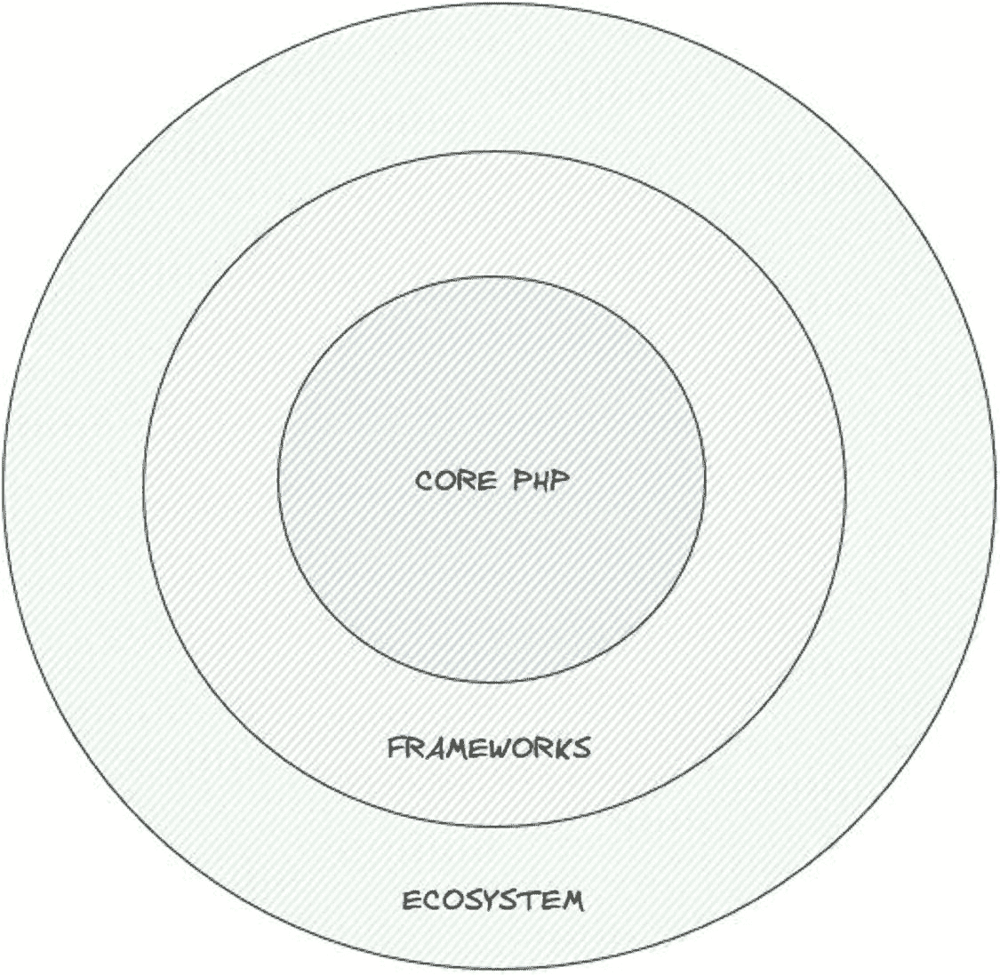

# 13. 测试与质量保证：参与渗透测试、漏洞扫描等安全测试活动，有助于开发人员发现并解决安全薄弱环节。

从一开始就将安全实践融入开发过程，对于构建健壮且安全的应用程序至关重要。具备安全意识并积极参与安全工作的开发人员，能够显著降低安全漏洞风险，确保应用程序及其用户的安全。

## 理解 PHP 安全格局

`PHP`作为一种流行的服务器端脚本语言，广泛应用于 Web 开发，用于创建动态网站和 Web 应用程序。然而，与任何技术一样，`PHP`也并非没有安全挑战。理解`PHP`安全格局对于开发人员、管理员以及所有负责构建和维护基于`PHP`的应用程序的人员来说都至关重要。

`PHP`作为一种编程语言，在安全生态系统中无法单独存在并做到万无一失。保护`PHP`应用程序需要一种多方面的方法，涵盖核心`PHP`安全实践、特定框架的安全考量以及更广泛的安全生态系统。理解并解决每个上下文中的漏洞和风险，对于构建稳健且有韧性的`PHP`应用程序至关重要。通过采用最佳实践并持续了解不断演进的安全威胁，开发人员可以增强其`PHP`应用程序的安全性，保护数据及用户免受潜在安全漏洞的侵害。

下面我们深入探讨一下如图 1-1 所示的这三个上下文。

**图 1-1** PHP 安全格局

### 核心 PHP 安全

我们可以仅使用核心`PHP`语言结构来构建整个应用程序，包括 Web 服务器。这些结构在各自的能力、局限性及用例方面都面临挑战。从历史上看，我们见过许多仅使用简单代码结构、没有任何框架辅助构建的`PHP`应用程序。采用这种做法，开发人员需要了解可用于不同方面（如身份验证、上传等）的各种攻击向量。随着数字世界的发展，跟上这些细节也变得极具挑战性。

### 特定框架的安全

框架的工作方式不同。它们通过配置来处理不同组件的某些安全方面，并针对新的安全问题提供补丁。此外，当集成不同组件时（例如您的`PHP`应用程序通过安全通道与数据库交互），框架也会处理随之而来的安全问题，我们将在后续章节中进一步探讨。

### 生态系统安全

虽然`PHP`及其支持的框架存在，但它们必须存在于更广阔的数字世界中，而这个世界本身有其动态特性。例如，`PHP`可以运行在像 Linux 这样的操作系统上，而 Linux 有其自身的安全问题需要处理。类似地，还有其他组件，如`HTTP 1/2/3`、`TCP`层，以及我们将在后续章节中讨论的各种其他组件。

## PHP 应用程序中安全漏洞的影响

当我们讨论`PHP`应用程序中安全漏洞的影响时，重要的是理解潜在后果的广度和深度。这些漏洞可能以多种方式影响组织，从数据泄露到运营效率低下。让我们通过丰富的现实世界示例来详细探讨这些影响，以使概念更加生动。

#### 数据泄露

数据泄露是`PHP`应用程序中安全漏洞最具破坏性的后果之一。当攻击者利用这些漏洞时，他们获得了对敏感数据的未授权访问。这些数据可能包括用户凭据、个人信息、财务数据和机密商业信息。

想想 2013 年和 2014 年臭名昭著的雅虎数据泄露事件，该事件暴露了超过 30 亿账户的个人信息。其后果包括用户信任的严重丧失、法律诉讼以及巨大的财务影响，最终影响了雅虎在 Verizon 收购过程中的出售价格。

### 财务损失

安全漏洞可能导致巨额财务损失。这些损失由多种因素造成，例如修复成本、应用程序停机以及因违反`GDPR`等法规而被处以的罚款。

例如，2013 年的塔吉特数据泄露事件导致该公司损失约 1.62 亿美元。这些成本包括对受影响客户的赔偿、法律费用以及实施增强安全措施的费用。

#### 声誉损害

安全漏洞会严重损害组织的声誉。在此类事件后重建信任可能既困难又耗时。

以 Equifax 为例，该公司在 2017 年遭遇大规模数据泄露，暴露了 1.47 亿人的敏感信息。此次泄露导致消费者信任度大幅下降，并对 Equifax 的声誉造成了长期损害，媒体广泛报道和严格审查凸显了这一点。

### 运营中断

安全漏洞可能扰乱正常运营。这些中断可能包括因攻击或利用而导致的应用程序不可用，以及为处理安全事件而需要调配资源。

一个显著的案例是 2017 年的`WannaCry`勒索软件攻击，该攻击影响了全球众多组织，包括英国国家医疗服务体系（`NHS`）。此次攻击造成了严重的运营中断，导致医疗服务和治疗被延误。

### 法律后果

安全漏洞可能导致组织面临严重的法律问题。这些问题包括监管罚款以及来自受影响个人或实体的诉讼。

例如，英国航空公司（British Airways）在 2018 年数据泄露后被处以`GDPR`罚款，拟议罚款金额为 1.83 亿英镑。这一事件凸显了遵守数据保护法以避免重大财务处罚的重要性。

### 用户影响

安全漏洞直接影响用户，可能导致身份盗窃、财务损失和隐私侵犯。

2013 年 Adobe 的数据泄露事件暴露了 3800 万用户的个人数据。该事件导致许多用户遭遇账户未授权访问和身份盗窃，这强调了强健安全措施的重要性。

### 缓解成本

组织必须投资以缓解安全漏洞，这包括实施安全措施、进行渗透测试以及提供安全培训。例如，在 2014 年索尼影业遭黑客攻击后，该公司大力投资以改善其网络安全基础设施并对员工进行培训，这是为防止未来发生泄密事件所付出的昂贵但必要的努力。

### 长期影响

安全事件的后果可能具有长期影响，例如市场份额损失、监管审查加强以及资源重新分配。数据泄露后，Equifax 等公司面临着更严格的审查和更严苛的合规要求，这促使它们必须在安全与合规措施上持续投入。

### 超出应用本身的损害

安全漏洞的影响可能超出应用程序本身，波及整个 IT 基础设施和供应链。2018 年针对软件公司 SolarWinds 的攻击表明，一家公司软件中的漏洞如何能够通过相互连接的系统，危及包括政府机构和私营企业在内的多个组织。

### 运营效率低下

不安全的应用程序会导致运营效率低下，因为需要持续的监控和应急响应来应对安全威胁。在 WannaCry 勒索软件攻击期间，英国国家医疗服务体系（NHS）就面临着运营效率低下的问题，当时应急响应优先于常规操作，导致了严重的业务中断和效率下降。

## 常见攻击向量与威胁

随着技术的发展，网络安全威胁和攻击向量也在不断演变。理解这些常见的攻击向量对于保护系统和数据至关重要。让我们通过结合真实案例和小标题，来更详细地审视这些威胁，构建一个既提供信息又引人入胜的叙述。

### 钓鱼攻击

钓鱼攻击通过欺骗手段诱使个人泄露敏感信息或点击恶意链接。攻击者使用具有欺骗性的电子邮件、网站或消息来冒充受信任的实体，例如银行或社交媒体平台。这种方法极其有效；例如，2016 年针对希拉里·克林顿竞选主席约翰·波德斯塔的钓鱼攻击，导致了成千上万封私人邮件的泄露，展示了此类攻击的深远影响。

### 恶意软件

恶意软件（Malware）是恶意软件（malicious software）的简称，包括病毒、蠕虫、特洛伊木马和勒索软件。这些程序会渗透系统以窃取数据或造成破坏。一个显著的例子是 2017 年的 WannaCry 勒索软件攻击，该攻击感染了 150 个国家的超过 20 万台计算机，通过加密数据并索要赎金，使医疗系统和各类企业陷入瘫痪。

### 拒绝服务攻击和分布式拒绝服务攻击

拒绝服务攻击（DoS）会使目标系统或网络不堪重负，导致合法用户无法访问。分布式拒绝服务攻击（DDoS）则利用多个受感染的设备来放大攻击的规模。2016 年对 Dyn DNS 服务的 DDoS 攻击导致 Twitter、Netflix 和 Reddit 等主要网站服务中断，突显了 DDoS 攻击如何瘫痪在线服务并造成广泛的破坏。

### SQL 注入

SQL 注入攻击利用对用户输入消毒不严的漏洞来操控 SQL 查询，允许攻击者访问、修改或删除数据库数据。2014 年 AT&T 网络遭到的入侵就是一个例子，攻击者利用 SQL 注入访问了敏感的客户信息，这突显了正确输入验证和使用参数化查询的重要性。

### 跨站脚本攻击

跨站脚本攻击（XSS）将恶意脚本注入 Web 应用程序，这些脚本会在不知情的用户浏览器中执行。这可能导致 cookie 窃取、会话劫持或网站篡改。2005 年发生在 MySpace 上的 Samy 蠕虫事件就是一个著名的例子，该蠕虫利用 XSS 迅速传播，并攻破了超过一百万个用户配置文件。

### 跨站请求伪造

跨站请求伪造攻击（CSRF）诱使用户在未经其同意的情况下对网站执行操作，通常导致未经授权的交易或数据篡改。实施反 CSRF 令牌和安全编码实践是关键的防御措施。2012 年针对 GitHub 的攻击就利用了 CSRF 漏洞删除了用户代码仓库，这突显了此类漏洞的潜在危害。

### 中间人攻击

中间人攻击（MitM）的攻击者拦截通信双方的数据，以窃听、修改数据或冒充其中一方。使用 HTTPS 和公钥基础设施（PKI）等安全通信协议对于保护数据至关重要。2013 年的 NSA（美国国家安全局）监听丑闻中涉及大量中间人攻击技术，揭示了强加密和安全通信的重要性。

### 社会工程学

社会工程学通过操纵个人来泄露机密信息，例如密码或访问码。常见技术包括假冒身份（借口）、诱饵攻击和尾随。2011 年的 RSA（美国信息安全公司）入侵事件中，攻击者利用社会工程学获得了安全数据的访问权限，这表明人性弱点也可能被利用。

### 内部威胁

内部威胁涉及员工、承包商或业务合作伙伴的恶意或疏忽行为。这些内部人员可能窃取数据、破坏系统或无意中造成安全事件。2013 年的斯诺登泄密事件中，爱德华·斯诺登曝光了 NSA 的监控活动，这充分说明了内部威胁带来的巨大风险。

### 零日漏洞

零日漏洞是尚未公开的软件缺陷，攻击者在开发者推出补丁或更新之前加以利用。定期进行软件更新和漏洞评估有助于防范此类威胁。2010 年被发现的震网病毒（Stuxnet）就利用了多个零日漏洞来破坏伊朗的核计划，展示了此类攻击的潜在影响。

### 凭证窃取

攻击者通过键盘记录器、暴力破解或密码猜测来窃取用户名和密码。多因素身份认证（MFA）和强密码策略是关键防御措施。2012 年的 LinkedIn 数据泄露事件暴露了超过 1.17 亿用户凭证，这突显了建立强大认证机制的迫切需求。

### 物联网漏洞

物联网（IoT）设备通常缺乏强大的安全措施，使其成为攻击者的主要目标。物联网设备的漏洞可能导致隐私泄露、网络被入侵或被用于发起分布式攻击。2016 年的 Mirai 僵尸网络攻击利用物联网设备发动了一场大规模 DDoS 攻击，凸显了这些风险。

### 加密货币劫持

加密货币劫持是指未经所有者同意，劫持设备来挖掘加密货币。攻击者利用被攻陷系统的处理能力来牟利。2018 年大规模爆发的加密货币劫持活动感染了成千上万的网站和服务器，展示了这种恶意行为日益增长的威胁。

### 供应链攻击

供应链攻击针对软件供应链，在产品或服务到达用户之前对其进行篡改。攻击者可能在软件更新中植入恶意软件或后门。2020 年的 SolarWinds 攻击就是一个典型例子，黑客将恶意软件插入软件更新中，影响了众多政府及私营机构，这充分展示了供应链妥协带来的严重影响。

### 高级持续性威胁（APT）

高级持续性威胁是由技术娴熟的攻击者发起的长期、定向攻击。这些攻击者会在受感染的网络中长期潜伏，窃取敏感数据或实施间谍活动。2014 年针对索尼影业的 APT 攻击（据称由朝鲜黑客实施）导致了严重的数据损失和业务中断，突显了此类复杂威胁的危害性。

理解这些常见的攻击向量和威胁对于实施有效的网络安全措施至关重要。组织必须采取主动策略，包括定期安全评估、员工培训以及部署安全工具，以降低风险并保护数字资产。通过保持信息更新和警惕性，开发人员和安全专业人员能够更好地保护系统免受不断演变的网络威胁。

## 安全 PHP 应用开发原则

在当今数字时代，开发安全的 PHP 应用不仅是最佳实践，更是一种必要。安全漏洞可能导致数据泄露、经济损失和组织声誉受损。作为开发者，我们有责任在整个开发生命周期中遵循安全最佳实践，构建稳健的应用程序。接下来，让我们探讨安全 PHP 应用开发的关键原则，并分享相关见解和实用示例。

### 安全设计

启动新项目时，必须从一开始就将安全融入应用设计。这种方法远比事后添加安全措施更有效且更具成本效益。

- **安全架构**：在编写代码之前，先退一步思考应用的整体结构。例如，设计电商网站时，需要考虑如何安全处理支付流程和客户数据。使用微服务可以帮助隔离应用的不同部分，降低安全漏洞的潜在影响。

- **威胁建模**：在规划阶段，我们需要识别应用的潜在威胁。假设你正在开发一个社交平台，威胁模型可能会揭示未授权数据访问或账户劫持等风险。通过早期识别这些风险，我们可以优先采取安全措施进行应对。

### 安全编码实践

编写安全的代码是 PHP 应用安全的基石。这就像用新鲜优质的食材烹饪——是获得良好结果的关键。

- **输入验证**：我们应始终验证和清理用户输入。例如，应用接收电子邮件地址时，应使用 PHP 的过滤函数确保输入为有效格式，从而防止恶意数据造成危害。

- **输出编码**：显示用户生成内容时，使用`htmlspecialchars()`等输出编码函数，将用户输入视为纯文本而非可执行代码，有助于防范 XSS 攻击。

- **参数化查询**：避免使用包含用户输入的动态 SQL 查询至关重要。相反，应使用预处理语句与数据库交互。这种方法能有效防御 SQL 注入攻击——此类攻击曾造成重大破坏，例如 2008 年 Heartland Payment Systems 遭到的入侵。

### 身份验证与授权

控制应用资源的访问权限至关重要。这就像给前门安装一把安全锁——只有授权人员才能进入。

- **强密码策略**：实施要求复杂密码和定期更新的强密码策略，有助于保护用户账户免遭轻易破解。

- **多因素认证**：添加多因素认证就像给门增加另一把锁。即使密码被盗，攻击者仍需第二重验证才能访问。谷歌采用多因素认证后，其账户的钓鱼攻击显著减少。

- **最小权限原则**：应仅授予用户所需权限。如果应用包含不同用户角色，确保每个角色拥有最低必要权限，可在账户被攻破时限制损失范围。

### 会话管理

正确的会话管理对确保用户会话安全至关重要。

- **安全会话令牌**：使用安全随机的会话令牌可防止会话劫持。登录时重新生成会话 ID 可增加额外安全层。

- **会话超时**：实施会话超时机制，在用户长时间无操作后自动注销，可防止他人使用无人值守的设备进行未授权访问。

- **会话存储**：将会话数据安全存储在服务器端而非客户端，可防止未授权访问。

### 文件上传

处理不当的情况下，允许用户上传文件可能带来安全风险。

- **文件类型验证**：确保上传文件符合预期格式至关重要。例如，应用接受图片上传时，需验证文件确实是图像而非伪装的执行文件。

- **文件存储**：将上传文件存放在 Web 无法直接访问的目录，并使用安全方法提供服务，可防止直接访问潜在有害内容。

### 错误处理与日志记录

错误处理方式对安全性影响重大。

- **自定义错误页面**：向用户显示通用错误消息，同时隐藏可能帮助攻击者了解应用内部信息的敏感数据，是最佳实践。

- **安全日志记录**：保留安全相关事件日志并定期监控，有助于在威胁造成重大损害前及时发现并响应。

### 安全更新与补丁管理

保持软件更新就像定期保养汽车——能确保系统平稳安全运行。

- **漏洞评估**：我们需要定期扫描应用及其依赖项中的已知漏洞。像`OWASP Dependency-Check`这样的工具可以帮助我们掌握最新情况。

- **安全资讯**：及时了解技术栈相关的安全公告和漏洞信息，有助于快速应对新威胁。

### 安全通信

确保客户端与 PHP 应用之间传输的数据安全至关重要。

- **HTTPS**：应始终使用`HTTPS`加密传输中的数据。这能保护登录凭证和个人数据等敏感信息免遭截获。

- **HTTP 安全头**：实施内容安全策略和严格传输安全等 HTTP 头部可增强安全性。这些头部能提供针对多种攻击向量的额外防护。

### 安全测试与代码审查

定期测试和审查是维护应用安全的关键。

- **渗透测试**：定期进行渗透测试以发现应用安全的漏洞和弱点，是一种主动方法，有助于在漏洞被利用前修复问题。

- **代码审查**：定期由同行或安全专家审查代码中的安全问题，有助于及早发现潜在安全缺陷，提升应用的整体安全水平。

### 应急响应计划

为意外情况制定应急预案至关重要。

- **计划文档**：记录安全事件发生时的应对步骤，包括通信和修复流程，确保快速高效的响应。

- **培训**：培训团队识别和应对安全事件，并定期进行应急演练，确保每个人明确自身职责，在实际事件中迅速行动。

## 总结

在本章中，我们探讨了保护 PHP 应用程序免受各种威胁和漏洞攻击的重要性。它强调了在开发过程中采用安全优先方法的必要性，从威胁建模和实现安全架构开始。本章重点介绍了安全的编码实践、身份验证、会话管理和文件上传处理等关键安全措施。同时还涵盖了通信安全、漏洞管理和事件响应规划的基本方面。主要结论是：构建安全的 PHP 应用程序需要采取主动措施、持续学习并适应不断出现的新型威胁。