# 2. PHP 核心安全

PHP 是全世界使用最广泛的编程语言之一，因此它也容易受到安全威胁。本章将涵盖与 PHP 核心相关的安全注意事项，并为保护 PHP 代码安全提供实用指导。因此，开发人员必须采取适当措施来确保其 PHP 应用程序的安全性。从安全的 PHP 配置到安全的文件处理，本章将涵盖构建安全可靠的 PHP 应用程序所需了解的所有内容。通过本章的学习，读者将打下坚实的 PHP 安全基础，并能够编写自己的安全代码。

如前一章所述，我们将重点讨论核心 PHP，之后会深入探讨框架和生态系统。图 2-1 展示了三个同心圆，说明了保护 Web 应用程序的分层安全方法。核心是 PHP 核心，代表了需要防范漏洞和攻击的代码基础。第二层，框架和库，通过提供额外的安全层（如输入验证、身份验证和授权）来支持 PHP 核心。最外层的圆代表生态系统，涵盖了 HTTP 协议、第三方集成和用户交互等外部因素。该生态系统需要防范常见的 Web 攻击，例如 SQL 注入、跨站脚本 (XSS) 和拒绝服务 (DoS) 攻击。

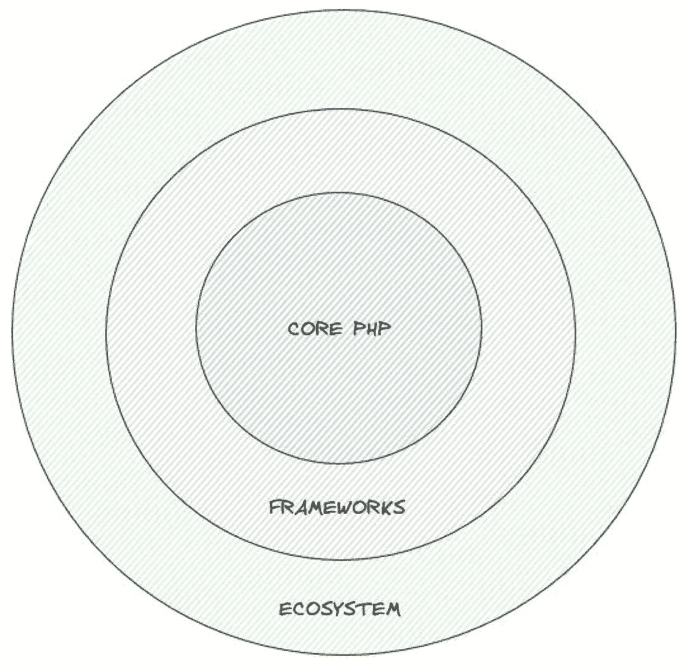

**图 2-1** Web 开发的分层结构：可视化呈现

## PHP 更新大讨论

想象一下，你经营一家很受欢迎的餐厅，但你一直使用十年前的食谱。你觉得它仍然不错，却不知道其中一些食材实际上是有毒的！当你的网站使用过时版本的 PHP 时，就是这种情况。

## 为什么 PHP 版本如此重要？

你正在使用的 PHP 版本从安全角度来看至关重要。PHP 开发团队持续发布新版本以解决安全漏洞并提高语言的整体安全性。让我们讨论一下保持 PHP 版本更新至关重要的几个原因。

### 安全更新

让我们深入探讨安全更新的重要性，尤其是在 PHP 版本的背景下。更新到更新的 PHP 版本的主要原因之一是其包含了安全补丁。这些补丁解决了在先前版本中发现的漏洞。运行过时的 PHP 版本，我们实际上是在让我们的 Web 应用程序暴露于这些已知的安全问题之下，这些问题可能会被恶意行为者利用。

可以这样理解：就像你知道附近发生过入室盗窃却不会不锁家门一样，你也不应该让你的 Web 服务器暴露在有已知解决方案的攻击之下。保持 PHP 最新就像加固门锁和添加安全摄像头；这是保护你的服务器免受已知威胁的重要措施。

此外，跟上 PHP 更新不仅能保护你免受现有漏洞的侵害；还有助于降低与新型攻击相关的风险。网络安全是一个不断发展的领域，攻击者一直在寻找利用软件的新方法。通过定期更新 PHP，你可以从社区和语言维护开发者所做的最新安全研究和改进中获益。

另外，更新 PHP 也有助于保持对行业标准和法规的合规性。许多合规框架要求你保持软件更新，以确保敏感数据的安全。忽视更新，你不仅会面临应用程序的安全风险，还可能面临潜在的法律和财务后果。

另一个需要考虑的因素是对你声誉的影响。如果你的 Web 应用程序因运行过时的 PHP 版本而被攻破，可能会导致数据泄露、客户信任度下降以及品牌声誉受损。在当今的数字时代，安全漏洞的消息传播迅速，客户对数据安全的重要性也越来越了解。通过保持软件更新来展示我们对安全的重视，可以提升你的可信度和可靠性。

### 生命周期终止 (EOL)

让我们探讨一下 PHP 版本的生命周期终止 (EOL) 概念，以及为什么了解我们所用软件的支持生命周期至关重要。像许多其他软件产品一样，PHP 具有有限的支持生命周期。这意味着每个 PHP 版本都会在一段特定时间内得到积极维护和支持，此后便会达到其生命周期终点 (EOL)。

当某个 PHP 版本达到 EOL 时，它将不再收到官方更新。这包括功能增强和错误修复，最关键的是，还包括安全补丁。安全补丁至关重要，因为它们可以解决在软件中发现的漏洞。如果我们继续使用 EOL 的 PHP 版本，我们将错过这些关键更新。

设想一下这个场景：我们为房子配备了一个强大的安全系统，但随着时间的推移，为了应对更先进的入室盗窃技术，新型锁和警报器被开发出来。如果我们不更新安全系统，窃贼就更容易闯入。同样，通过使用 EOL 的 PHP 版本，我们的应用程序仍然暴露于那些已被识别但尚未修补的漏洞之下，使其成为攻击者的容易目标。

此外，使用 EOL 版本可能对合规性和法律责任产生重大影响。许多监管框架要求组织使用受支持且最新的软件来保护敏感数据。通过运行不受支持的 PHP 版本，我们可能违反了这些要求，这可能导致罚款、处罚或法律诉讼。

依赖 EOL 的 PHP 版本还可能影响我们 Web 应用程序的性能和可靠性。随着新 PHP 版本的发布，它们通常包含优化和改进，以增强应用程序的性能和稳定性。坚持使用过时版本意味着我们无法从这些增强中受益，这可能会影响应用程序的效率和用户体验。

更广泛的 PHP 社区和第三方开发者在旧版本达到 EOL 后通常也会停止支持它们。这意味着我们可能会发现，在获取帮助、查找兼容的库或与其他现代软件解决方案集成方面变得越来越困难。


### 最佳实践

让我们探讨在使用 `PHP` 时遵循最佳实践的重要性，尤其是在安全性方面。新的 `PHP` 版本经常引入安全最佳实践方面的改进和变更。这些更新对于维护我们 Web 应用程序的安全性和完整性至关重要。

新的 `PHP` 版本通常包含默认设置的增强。这些默认设置旨在开箱即用地提供更好的安全性，从而减少我们手动调整配置以实现安全设置的需求。通过紧跟 `PHP` 更新，我们可以确保应用程序自动受益于这些改进的默认配置。

较新的 `PHP` 版本会弃用不安全的特性。弃用是一个关键过程，其中被认为不再安全或高效的功能会被逐步淘汰。继续使用过时的特性可能会使我们的应用程序容易受到利用这些弱点的攻击。通过更新到最新的 `PHP` 版本，我们避免依赖这些已弃用、不安全的特性，从而降低风险敞口。

现代安全机制会定期被纳入新的 `PHP` 版本中。这些机制可能包括加密算法的改进、更好的会话管理以及更强大的输入验证技术。使用最新的 `PHP` 版本可确保我们能够利用这些先进的安全措施来更有效地保护应用程序和数据。

通过保持 `PHP` 版本更新，我们能更好地遵守安全指南和标准。许多安全框架和合规性要求会随着时间推移而演变，以纳入最新的最佳实践。使用最新的 `PHP` 版本有助于我们跟上这些不断发展的标准，从而更容易实现并维持合规性。

### 性能与效率

让我们探讨使用最新 `PHP` 版本带来的性能与效率优势。除了安全增强之外，新 `PHP` 版本通常还会带来显著的性能提升。这些改进可以通过使应用程序更能抵抗某些类型的攻击来间接增强安全性。

更快、更高效的代码执行是更新 `PHP` 的关键好处之一。随着每个新版本的发布，`PHP` 开发团队都会优化核心引擎，使其运行代码更快、消耗资源更少。这可以显著提升 Web 应用程序的速度和响应能力。

提升的性能有助于减轻资源耗尽攻击的风险。这些攻击，例如拒绝服务（`DoS`）攻击，旨在通过消耗过多的 `CPU`、内存或带宽来压垮服务器。当你的 `PHP` 代码运行效率更高时，处理每个请求所需的资源就会更少。这意味着你的服务器可以处理更高流量的负载而不会过载，从而使攻击者更难成功实施资源耗尽企图。

更好的性能也有助于带来更流畅的用户体验。更快的页面加载速度和更迅速的响应率可以显著提高用户满意度和参与度。在当今快节奏的数字环境中，用户期望 Web 应用程序快速且响应灵敏。保持 `PHP` 版本更新可确保你能满足这些期望并提供积极的用户体验。

新 `PHP` 版本中的效率提升通常包括增强的内存管理和优化的函数。这些增强功能可以降低内存泄漏及其他可能随时间推移而降低性能的问题的发生概率。通过运行最新的 `PHP` 版本，你将从这些优化中受益，确保你的应用程序在不同负载下保持稳定并具有良好的性能。

### 兼容性

让我们考虑在升级 `PHP` 时可能出现的兼容性挑战，以及在安全性与兼容性之间保持平衡的必要性。虽然较新的 `PHP` 版本提供了诸多好处，但它们有时会与旧代码或已弃用的函数引入兼容性问题。解决这些问题对于确保 Web 应用程序的平稳运行至关重要。

升级 `PHP` 可能导致你的应用程序所依赖的某些函数或功能被弃用或移除。这可能会使你的应用程序部分失效或出现意外行为。在将新的 `PHP` 版本部署到生产环境之前，必须在测试环境中彻底测试你的应用程序。这个测试阶段使你能识别并解决可能出现的任何兼容性问题。

在安全性与兼容性之间保持平衡需要仔细规划和主动管理。虽然为了避免修复兼容性问题的麻烦而推迟更新很诱人，但出于兼容性考虑而依赖过时的 `PHP` 版本并非可持续的长期策略。过时的版本不仅会使你的应用程序容易受到安全威胁，还会错过性能改进和新功能。

一种可持续的方法涉及定期更新和重构你的代码库以支持较新的 `PHP` 版本。这可能包括用现代等效函数替换已弃用的函数、优化代码以获得更好的性能，并确保你的应用程序遵循当前的最佳实践。重构代码库可能是一项艰巨的任务，但它在安全性、性能和可维护性方面的改进是值得的。

对兼容性采取主动态度包括及时了解即将到来的 `PHP` 变更，并提前准备你的应用程序。`PHP` 的官方文档和社区资源为新的版本中引入的变更提供了宝贵的见解。通过关注这些资源，你可以预测潜在问题并相应地规划更新。此外，我们认为利用自动化测试有助于简化识别兼容性问题的过程。为你的应用程序编写单元测试和集成测试可确保你能在更新导致问题时快速发现。自动化测试提供了一个安全网，让你能够自信地进行更改，并降低引入新错误的风险。


### 供应商与应用程序支持

我们来探讨一下保持 PHP 版本更新的重要性，尤其是在供应商和应用程序支持的背景下。许多应用程序和内容管理系统（CMS）都有特定的 PHP 版本要求，以确保其正常运行和安全。保持 PHP 版本更新对于确保兼容性、利用最新功能和安全改进至关重要。

应用程序和 CMS 平台通常会为其软件指定最低和推荐的 PHP 版本。设定这些要求是为了确保软件能够高效、安全地运行。通过遵循这些版本要求，我们可以避免因使用不受支持的 PHP 版本而可能产生的问题。这可以确保应用程序或 CMS 的功能按预期工作，提供流畅的用户体验。

紧跟 PHP 版本更新也意味着我们可以利用新版本中引入的最新功能。这些功能可能包括性能、安全性和开发效率方面的改进。例如，新的 PHP 版本可能提供增强的语法、更好的错误处理或更高效的函数，所有这些都有助于编写更简洁、更易于维护的代码。

新 PHP 版本中的安全改进是另一个关键方面。供应商和应用程序开发者通常会发布依赖于最新 PHP 版本所提供安全增强功能的更新和补丁。通过保持 PHP 版本最新，我们可以确保应用程序受益于这些安全改进，从而降低漏洞和被利用的风险。

运行受支持的 PHP 版本可以确保我们能够及时获得所使用的应用程序和 CMS 平台供应商的支持与更新。如果我们遇到问题或需要帮助，只要我们的环境满足他们的版本要求，供应商就更有可能提供支持。使用过时的 PHP 版本可能会导致难以获得支持，因为供应商可能不会解决与不受支持版本相关的问题。

在 CMS 的背景下，使用最新的 PHP 版本可以增强我们网站的整体安全性和性能。像 WordPress、Joomla 和 Drupal 这样的内容管理系统会定期更新其平台，以利用最新的 PHP 特性和安全补丁。通过保持 PHP 更新，我们可以确保 CMS 以最佳状态、安全地运行，保护我们的网站及其数据。

保持 PHP 版本更新对于确保与我们使用的软件和应用程序的兼容性至关重要。它使我们能够利用最新的功能和安全改进，同时确保我们能从供应商那里获得及时支持。定期更新 PHP 应成为我们维护安全、高效且得到良好支持的应用环境策略中的关键部分。

## 安全的 PHP 配置

PHP 配置指的是控制 Web 服务器上 PHP 脚本语言行为和功能的设置与参数。作为一种常用于 Web 开发的服务器端脚本语言，PHP 可以根据 Web 应用程序的具体需求进行配置。这些配置设置通常定义在配置文件中，并且可以在服务器级别和应用程序级别进行调整。

理解和实施安全的 PHP 配置对于维护 Web 应用程序的安全性和性能至关重要。通过正确配置 PHP，我们可以减轻潜在的漏洞，并确保服务器高效运行。PHP 配置的一个重要方面是设置适当的错误报告级别。在生产服务器上显示错误可能会向攻击者泄露敏感信息。与其显示错误，不如将它们记录到日志中，这有助于在不危及安全的情况下进行故障排查。

例如，假设您有一个处理用户数据的 Web 应用程序。如果发生错误并且应用程序显示了错误信息，它可能会泄露您的数据库结构或其他敏感细节。通过将错误记录到日志，您可以将这些信息保密，同时仍然能够诊断和修复问题。

图 2-2 描述了围绕 PHP 配置的关键方面。

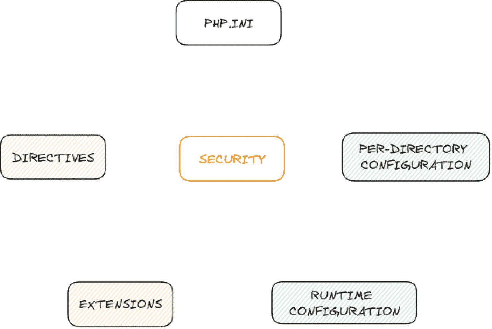

**图 2-2**：与安全性相关的 PHP 配置关键方面

### php.ini

我们来深入探讨安全的 PHP 配置，这是确保我们的 Web 应用程序平稳安全运行的一个关键方面。将 PHP 配置想象成我们给 PHP 服务器的指令，告诉它应该如何运作。PHP 的主要配置文件叫做 `php.ini`。这个文件包含了一系列影响 PHP 运行方式的设置，包括错误报告、资源限制、安全特性和扩展（模块）。您可以在 Web 服务器上找到 `php.ini` 文件，通常在 Linux 系统的 `/etc/php/` 目录下或 Windows 系统的 `C:\php\` 目录中。

### 指令

PHP 的配置设置被称为指令。这些指令控制着 PHP 的各个方面，例如内存限制、文件上传限制、错误显示、数据库连接等等。每个指令都有一个名称、一个值和一个作用域（例如，全局、按目录或按脚本）。您可以在 `php.ini` 文件中更改这些指令的值，或者在应用程序代码中使用 `ini_set()` 函数进行更改。

想象一下您正在经营一家柠檬水小摊，需要决定每加仑水用多少糖。指令就像是食谱中的一条说明：“每加仑水使用两杯糖。”如果您只想为某一批柠檬水做得更甜，您可以单独为那一批调整这个说明，就像为特定脚本使用 `ini_set()` 一样。

### 按目录配置

除了全局的 `php.ini` 文件，您还可以在 Apache Web 服务器的 `.htaccess` 文件中，或在某些环境下的 `.user.ini` 文件中，设置按目录的 PHP 配置。这些按目录的设置可以覆盖特定目录或应用程序的全局设置。

这就像为我们房子的不同房间制定不同的规则。厨房可能有“保持冰箱门关闭”的规则，而客厅则有“始终保持窗帘打开”的规则。类似地，按目录配置允许我们为应用程序的不同部分定制 PHP 设置。

### 运行时配置

我们还可以在运行时使用 `ini_set()` 等函数或通过修改配置数组 `$_SERVER['PHP_INI_USER']` 来动态调整 PHP 配置。想象一下您在玩一个电子游戏，您可以在游戏中途更改难度级别。使用 `ini_set()` 就像在游戏过程中即时更改设置，让游戏变得更简单或更困难。

### 扩展

PHP 可以通过各种模块和扩展进行扩展，以启用特定的功能。有些扩展是默认包含的，而另一些则需要显式启用或安装。这些扩展可能有它们自己的配置设置。

把扩展想象成给我们的厨房添加新工具。我们可能从一套基本的锅碗瓢盆（默认扩展）开始，但如果想要做意大利面，我们可能需要添加一台制面机（额外的扩展）。每个新工具都可能附带一套自己的使用说明。

### 安全

PHP 配置对于维护 Web 应用程序的安全性至关重要。我们可以控制 `register_globals`、`open_basedir` 等功能，并禁用危险函数来增强安全性。

例如，想象一下我们的柠檬水小摊有一个安全系统。我们制定了一些规则，比如“不要让陌生人进入柜台后面”（禁用危险函数）和“只在厨房里混合配料”（设置 `open_basedir`）。这些规则有助于保护我们的柠檬水小摊（以及我们的 PHP 应用程序）的安全。


### 通用设置

一些常见的 PHP 配置设置包括 `display_errors`（用于控制错误报告）、`max_execution_time`（用于限制脚本执行时间）、`memory_limit`（用于限制内存使用）等等。再次以我们的柠檬水摊位为例。`display_errors` 就像决定是否要在顾客面前放一个写着“哎呀，我们的柠檬用完了！”的牌子。`max_execution_time` 就像为搅拌柠檬水设置一个计时器。`memory_limit` 就像限制我们一次可以使用的柠檬数量。

理解 PHP 配置有助于我们优化 Web 应用程序的性能和安全性，确保它们按预期工作。然而，我们在修改配置设置时应保持谨慎，因为错误的配置可能导致安全漏洞或应用程序出现意外行为。现在，我们对 PHP 中的配置是什么以及它们如何工作有了基本的了解，接下来让我们重点了解其中一些配置如何帮助我们增强安全性。如需更全面地查看所有可用的配置，我们随时可以查阅 PHP 手册。

如需全面查看所有可用配置，可以参考 [PHP 手册](https://www.php.net/manual/en/ini.core.php)。

PHP 配置在增强 Web 应用程序的安全性方面发挥着重要作用。正确配置 PHP 设置有助于保护您的应用程序免受各种安全威胁和漏洞的侵害。让我们讨论一些具体的示例，说明 PHP 配置如何提高安全性。

### 错误报告（`display_errors`、`error_reporting`）

正确配置错误报告设置有助于防止敏感信息暴露给潜在的攻击者。通过将 `display_errors` 设置为 “Off”，并将 `error_reporting` 配置为仅报告必要的错误，您可以确保错误消息不会泄露有关应用程序的关键信息，例如数据库凭据或服务器路径。

例如：假设您的网站是一家带有后台办公室的商店，员工在其中工作。如果办公室的门（错误报告）大敞四开，任何人都能看见里面，那么顾客可能会无意中看到敏感信息，比如员工排班表或库存水平。通过关上门（将 `display_errors` 设置为 “Off”）并只允许必要的员工进入（明智地使用 `error_reporting`），您可以确保这些信息的安全。

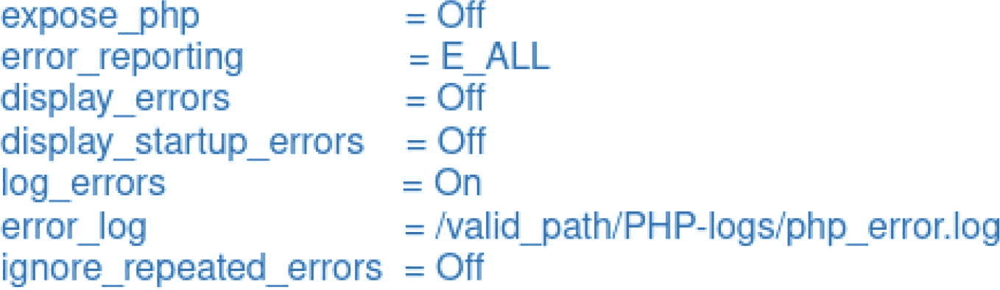

示例：

```php
display_errors = Off
error_reporting = E_ALL & ~E_NOTICE & ~E_WARNING
```

接下来，让我们从安全含义的角度，逐一审视图 2-3 中的每个 PHP 配置设置。

### `expose_php = Off`

将 `expose_php` 设置为 “Off” 是一项安全最佳实践。当暴露时，诸如 PHP 版本和服务器信息等 PHP 信息可能会在 HTTP 响应头中可见。攻击者可以利用这些信息来识别潜在的漏洞或过时的软件。通过关闭 PHP 的暴露，您可以增加攻击者收集服务器配置信息的难度。

例如：假设您的门牌号（PHP 版本）醒目地显示在前门上。如果一个小偷知道哪些房子根据门牌号配备了过时的安全系统，他们就会瞄准这些房子。通过隐藏您的门牌号（将 `expose_php` 设置为 “Off”），您可以让小偷更难搞清楚您的安全设置。

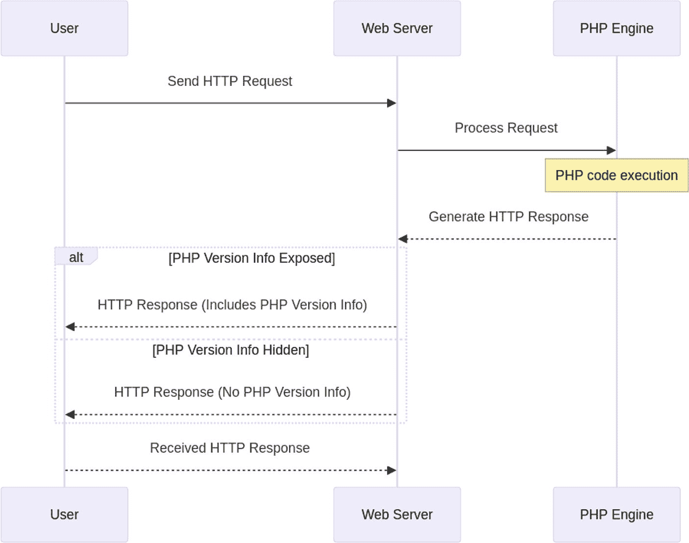

图 2-3

显示 PHP 版本信息暴露的请求-响应序列

### `error_reporting = E_ALL`

此设置配置错误报告的级别。将其设置为 `E_ALL` 是相当宽松的，它将报告所有类型的错误，包括通知和警告。虽然这对于开发和调试很有价值，但在生产环境中，您可能希望将错误报告降低到更低的级别（例如 `error_reporting = E_ERROR`），以避免泄露潜在的敏感信息。减少错误报告有助于防止披露详细的错误消息，这些消息可能被攻击者用来深入了解您的应用程序结构。

例如：假设您经营一家餐厅，在培训期间（开发环境），您允许员工公开讨论所有错误以改进服务（错误报告设置为 `E_ALL`）。然而，在有顾客在场的晚餐服务期间（生产环境），您只想处理需要立即关注的关键问题（错误报告设置为 `E_ERROR`），以维持专业和安全的环境，防止顾客无意中听到任何内部问题。

### `display_errors = Off`

此设置控制 PHP 是否在浏览器中显示错误消息。在生产环境中将 `display_errors` 设置为 “Off” 对安全性至关重要。当错误在浏览器中显示时，可能会泄露有关代码的敏感信息，例如文件路径和变量值。关闭错误显示可确保此类细节不会暴露给用户或攻击者。

例如：假设您的网站是一个餐厅厨房。在员工培训期间（开发环境），您可能会公开讨论错误以便从中学习。但在繁忙的晚餐服务期间（生产环境），您不希望顾客（用户）看到或听到这些讨论，因为这可能会泄露有关您操作的敏感信息。通过关闭错误显示（`display_errors = Off`），您可以将此类细节隐藏起来，维持一个专业且安全的环境。

### `display_startup_errors = Off`

与 `display_errors` 类似，`display_startup_errors` 控制 PHP 是否显示 PHP 脚本启动期间（例如在 PHP 配置文件中）发生的错误。出于安全考虑，建议将此设置保持为 “Off”，以防止暴露可能包含与服务器配置相关的敏感信息的错误。

例如：假设您的网站是一家餐厅，厨房的准备工作（PHP 启动）对于一天的运营至关重要。在准备阶段，可能会出错，但您不希望顾客（用户）看到厨房员工（服务器配置错误）在处理这些问题。通过将 `display_startup_errors` 设置为“Off”，您可以确保任何初始设置问题都不会暴露给公众，保持安全且专业的形象。

### `log_errors = On`

启用 `log_errors` 是一项安全最佳实践。当设置为 “On” 时，PHP 会将错误记录到 `error_log`（即下一个设置）指定的文件中。记录错误对于安全和故障排除至关重要，因为它允许您跟踪和审查错误，而无需向最终用户公开。它提供了问题的记录，可用于分析和调试，同时确保信息安全，远离窥探。

假设您的网站是一所学校，当出现问题时，老师会将其记录在一个私人笔记本（错误日志）中。这样，老师可以在事后回顾问题并找到解决方案，而学生（用户）则不会知晓这些问题。通过将 `log_errors` 设置为 “On”，您可以确保问题被安全地记录下来，以便日后分析和修复，同时不会向用户泄露敏感信息。


### `error_log = /valid_path/PHP-logs/php_error.log`

此设置决定了 PHP 错误日志文件的路径，PHP 的错误信息将被写入该文件。从安全角度来看，指定一个有效且安全的路径非常重要。指定的目录和文件应仅供授权人员访问。避免将错误日志放置在 Web 可访问的目录中，以防攻击者可能访问到它们。

可以把你的网站想象成一个图书馆，而错误日志则是一本特殊的书籍，图书管理员（即服务器）会在上面记录任何问题。你不会把这本日志簿放在任何人都能翻阅的公共桌子上，而是会把它保存在只有图书管理员（授权人员）才能进入的安全办公室里。通过将 `error_log` 设置到一个安全的路径，你就能确保只有值得信赖的人才能查看和审查这些问题。

### `ignore_repeated_errors = Off`

当设置为 `Off` 时，`ignore_repeated_errors` 表示 PHP 会报告重复出现的错误。这对于识别可能表明潜在安全问题的错误模式非常有价值。在安全上下文中，你可能希望将此设置保持为 `Off`，以确保重复的错误不会被忽略，从而允许你调查并解决潜在的安全漏洞。

可以把你的网站想象成一所学校，每次有学生反映相同的问题，老师都会将其记录在笔记本（即错误日志）中。如果老师忽略了重复的举报（将 `ignore_repeated_errors` 设置为 `On`），那么他们可能会错过一个更大的问题，比如操场上损坏的秋千。通过将此设置保持为 `Off`，老师就能看到同一个问题是否被多次报告，并采取行动进行修复，从而为每个人营造一个更安全的环境。

您提供的这些配置设置展示了增强 PHP 环境安全性的最佳实践。它们有助于减少敏感信息的暴露、记录错误以供审查和分析，并确保重要错误不会被忽略，这对于识别安全问题至关重要。

### 文件包含（`allow_url_fopen`, `allow_url_include`）

这些设置控制 PHP 是否可以通过 URL 从远程位置包含文件。允许远程文件包含可能是一个重大的安全风险，因为它可能被利用来在服务器上执行任意代码。通过将 `allow_url_fopen` 和 `allow_url_include` 都设置为 `Off`，你可以防止 PHP 从外部来源包含文件。

可以把你的网站想象成学校的计算机实验室。如果你允许学生下载并运行互联网上的任何软件（即允许远程文件包含），这可能会引入病毒或恶意程序。通过将 `allow_url_fopen` 和 `allow_url_include` 设置为 `Off`，你就能确保只能使用学校内部网络中经过批准且安全的软件，从而保护计算机的安全。

示例：

```php
allow_url_fopen = Off
allow_url_include = Off
```

### SQL 注入防护（`magic_quotes_gpc`, `mysqli`）

虽然在较新的 PHP 版本中已弃用 `magic_quotes_gpc`，但它过去常被用来自动转义来自外部来源（例如表单输入）的数据，以帮助防止 SQL 注入攻击。现代的 PHP 应用程序应使用预处理语句和参数化查询（配合 `mysqli` 或 `PDO`（PHP 数据对象）等扩展）来防止 SQL 注入。

可以把你的网站想象成一家餐厅，顾客（即用户）通过在纸条（即表单输入）上写下他们的选择来点餐。如果你只是接过这些纸条直接递给厨师（即数据库），有人可能会写下一些有害或误导性的内容（即 SQL 注入）。相反，你可以使用一个特殊的翻译员（即预处理语句）来阅读纸条，并在厨师看到它们之前确保一切安全且易于理解。这样一来，你就能防止任何有害或误导性的订单到达厨房。

示例（适用于较旧的 PHP 版本）：

```php
magic_quotes_gpc = Off
```

### 文件上传（`upload_max_filesize`, `post_max_size`）

配置最大文件大小和处理文件上传对于防止恶意文件上传至关重要。通过对 `upload_max_filesize` 和 `post_max_size` 设置适当的限制，你可以防止用户上传可能损害服务器或应用程序的超大文件。

可以把你的网站想象成一个社区艺术画廊，人们可以提交他们的艺术品（即文件上传）。如果你允许任何人带来巨大的雕塑（即超大文件），画廊可能会变得拥挤不堪并引发问题。通过为提交的作品设置尺寸限制，例如只允许提交特定尺寸以内的画作，你就能确保画廊保持有序和安全。同样，设置 `upload_max_filesize` 和 `post_max_size` 能确保上传的文件处于安全且可管理的尺寸范围内。

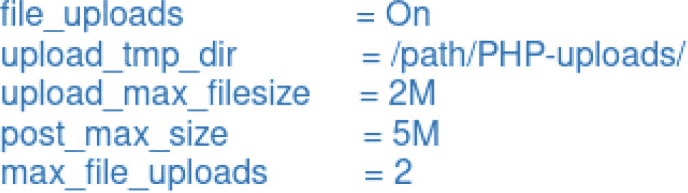

示例：

```php
upload_max_filesize = 5M
post_max_size = 8M
```

让我们从上图中逐一审视每个 PHP 配置设置的安全含义。

### `file_uploads = On`

此设置控制是否允许在你的 PHP 应用程序中进行文件上传。将其设置为 `On` 则启用文件上传，设置为 `Off` 则禁用。

如果没有适当的验证和控制就启用文件上传，可能会引入重大的安全风险。这会为潜在的文件上传漏洞打开大门，包括允许将恶意文件上传到你的服务器。

如果你的应用程序需要文件上传功能，则应实施强有力的验证措施，包括检查文件类型、限制文件大小，并将上传的文件存储在安全的位置。此外，请考虑使用 `move_uploaded_file()` 函数来安全地存储上传的文件。

例如，把你网站想象成学校举办的一场艺术比赛，学生可以提交他们的画作（即文件上传）。如果你允许提交任何类型的画作而不加检查，有人可能会提交不合适或有害的内容（即恶意文件）。为了确保比赛安全，你需要检查画作是否合适（验证文件类型）、尺寸是否过大（限制文件大小），并将其安全地存放在一个安全的画廊中（安全位置）。使用 `move_uploaded_file()` 函数就像拥有一个安全的过程，可以将画作移动并存储到只有授权员工才能访问的地方。

### `upload_tmp_dir = /path/PHP-uploads/`

此设置指定了临时目录，上传的文件在被移动到最终目的地之前会存储在此处。

如果指定的临时目录没有得到妥善保护，它就可能成为攻击者的潜在目标。恶意用户可能会上传文件，即使这些文件不被执行，也可能在临时目录中引发其他安全问题。

确保 `upload_tmp_dir` 目录配置正确且安全可靠。该目录不应通过 Web 访问，其访问权限应仅限于 PHP 进程进行读取和写入操作。

例如，把你的网站想象成一项快递服务，包裹（即文件）在送达最终目的地之前，会暂时存放在一个分拣区（即临时目录）。如果分拣区不安全，任何人都可能篡改包裹，从而引发问题。为了防止这种情况，你要确保分拣区的安全，只有授权员工（即 PHP 进程）才能接触和处理这些包裹，确保它们在到达最终目的地之前都是安全的。


### “upload_max_filesize = 2M”

你是否曾思考过，一个文件在网站上能占用多大空间？这就涉及 `upload_max_filesize` 设置的作用。它就像给用户上传到网站的文件大小设定了一个上限。

想象一下，如果你允许用户上传文件而不设任何大小限制。有人可能会尝试上传一个巨大的视频文件或超大图片，这将会占用你服务器的资源，拖慢一切运行速度。这就像允许某人带一个巨型行李箱上一艘小船——可能导致小船倾覆！

从安全角度来看，限制文件大小有助于防止服务器不堪重负。正如为了安全起见，我们不会允许有人携带超大行李上飞机一样，我们也不希望超大文件占满服务器所有资源。

我们可以根据网站的需求和可用资源，为 `upload_max_filesize` 设置一个合适的值。例如，常见的设置是 5MB（`upload_max_filesize = 5M`），这对大多数图片和文档来说足够，但又不会大到引发问题。

把你的网站想象成一场摄影比赛。如果你允许人们上传巨型海报而不是普通照片，可能会压垮你的系统。通过设定大小限制，你确保了每个人都能参与而不会造成任何问题。

### “post_max_size = 5M”

此设置指定了 PHP 愿意接收的 POST 数据的最大大小。这是维护应用程序安全性和性能的一项重要配置。

想象一下，如果有人试图一次性向你的网站发送海量数据。这可能会使你的服务器过载，拖慢网站速度，甚至导致其崩溃。限制 `post_max_size` 就像给卡车设定一个载货上限，以防止其超载。

通过限制 `post_max_size`，我们有助于防止潜在的拒绝服务（DoS）攻击。这种控制确保没有人能通过 POST 请求发送超大量数据，从而破坏你的应用程序。

我们可以根据应用程序的预期使用情况，将 `post_max_size` 设置为一个合适的值。找到一个平衡点很重要——限制值应足够高以处理合法请求，但又不能高到可能被滥用。例如，如果我们的应用程序涉及用户提交包含文本和图片的表单，那么像 8MB 这样的值可能是合适的。

把你的网站想象成一个竞赛的在线申请表。如果有人试图提交包含异常大量数据的条目，可能会堵塞系统。通过为人们可以提交的数据大小设定一个合理的限制，你可以保持系统平稳运行并防止滥用。

### “max_file_uploads = 2”

此设置控制单个表单可以上传的最大文件数量。它对于防止滥用和确保服务器保持响应至关重要。

想象一下，如果有人试图一次上传一百个文件。这可能会使你的服务器不堪重负，耗尽宝贵资源，并可能导致应用程序崩溃。限制文件上传数量就像设定一个人一次能通过机场安检的物品数量上限，以确保流程顺畅。

通过限制单个请求中能上传的文件数量，我们有助于防止潜在的滥用和资源耗尽攻击。这种控制确保没有人能一次上传太多文件而使系统过载。

我们可以根据应用程序的需求将 `max_file_uploads` 设置为一个合适的值。该限制应足够高以适应合法用例，但又不能高到可能被滥用。例如，如果我们的应用程序通常要求用户一次只上传几个文件，那么设置 `max_file_uploads = 2` 可能是一个很好的平衡。

把你的网站想象成一场人们可以上传最佳照片的摄影比赛。如果有人试图一次上传几十张照片，可能会压垮比赛系统。通过将上传数量限制在一个可控的范围内，你确保了每个人都能参与而不会引起问题。

这些与文件上传和文件处理相关的 PHP 配置设置，在你的应用程序安全性中扮演着重要角色。通过仔细配置它们，并在代码中应用适当的验证和安全控制，你可以减轻与文件上传和 POST 数据处理相关的潜在安全风险。

### 会话管理（`session.cookie_secure`、`session.cookie_httponly`）

正确配置会话设置对于防止会话劫持及相关攻击至关重要。通过启用 `session.cookie_secure` 和 `session.cookie_httponly`，我们可以确保会话 cookie 仅通过安全（HTTPS）连接发送，并且分别无法通过 JavaScript 访问。让我们逐一讨论这些设置及其安全影响。

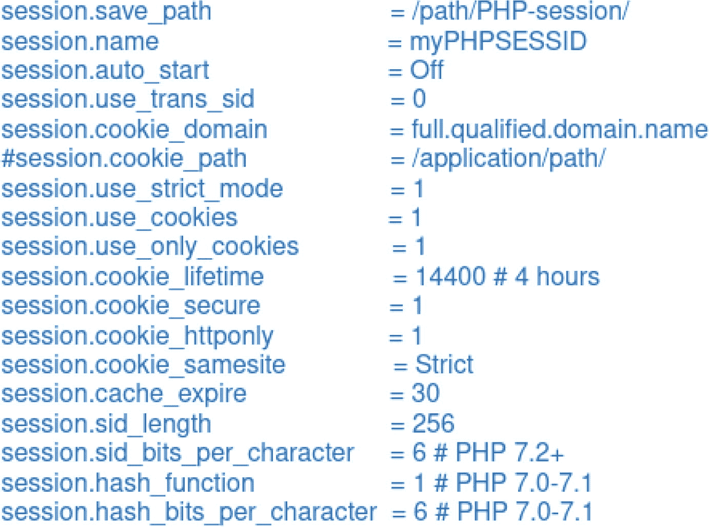

## 会话数据存储与管理

### session.save_path

此设置决定了会话数据在服务器上存储的目录。我们可以确保此目录得到充分保护，并且未经授权的用户无法访问，以防止敏感会话数据泄露。将此设置想象成一个存放会话信息的安全金库。只有授权人员才能拥有这个金库的钥匙，以确保内部数据的安全。

### session.name

通过将会话名称从默认值（`PHPSESSID`）更改，我们可以使我们的应用程序变得不那么可预测，并降低会话固定攻击的风险。想象一下，给每位访客一个独特、秘密的名字标签，而不是一个人人都知道的通用标签。这使得入侵者更难冒充合法用户。

## 会话初始化和处理

### session.auto_start

通常建议将此设置为 `Off`。我们可以避免在每个页面自动启动会话，以减少安全影响，尤其是当我们的应用程序不需要在所有页面使用会话时。这就像即使门没在用也让它一直开着。当不需要时，保持门锁着（关闭）可以增强安全性。

### session.use_trans_sid

通过禁用 trans-sid（将其设置为 `0`），我们可以防止会话 ID 暴露在 URL 中，使其不易受到会话固定攻击，并且在日志中更不可见。避免在明信片（URL）上书写敏感信息。相反，将其保存在信封（cookie）中。

## 会话 Cookie 配置

### session.cookie_domain

将其设置为完全限定域名有助于防止会话 cookie 在子域名上被访问，从而限制会话 cookie 的作用域。这就像确保你的家门钥匙（会话 cookie）只适用于你的房子（域名），而不适用于任何邻居的房子（子域名）。

### session.cookie_secure

通过启用此设置，我们可以确保会话 cookie 仅通过安全（HTTPS）连接传输，防止窃听会话数据。这就像通过安全、加密的渠道发送敏感信息，而不是开放渠道。

### session.cookie_httponly

通过启用此设置，我们可以阻止通过 JavaScript 访问会话 cookie，从而降低跨站脚本攻击（XSS）的风险。可以将其理解为确保只有服务器能读取密钥（cookie），而客户端脚本不能。

### session.cookie_samesite

为 SameSite 属性设置 `Strict` 值有助于防止跨站请求伪造（CSRF）攻击，它限制了在跨源请求中何时发送 cookie。这就像确保钥匙只在房子内部使用，而不会在外面传递。

## 会话安全增强


### `session.use_strict_mode`

通过启用严格模式，我们可以确保会话数据不会在 HTTP 和 HTTPS 之间共享，从而加强对会话劫持和数据泄露的防护。可以将其视为为不同的门使用不同的钥匙，确保用于安全性较低的门（HTTP）的钥匙无法打开安全性更高的门（HTTPS）。

### `session.use_cookies` 和 `session.use_only_cookies`

通过启用使用 Cookie 进行会话管理，与基于 URL 的会话相比，我们可以确保更安全地处理会话。仅使用 Cookie 可以确保会话无法通过其他方式被篡改。这就像是将钥匙存放在一个安全的、隐蔽的地方（Cookie），而不是公开携带（URL）。

### `session.cookie_lifetime`

设置较短的会话 Cookie 生存期，可以减少攻击者在设法窃取会话 ID 后进行会话劫持的机会窗口。这就像是为通行密钥设置有效期，以确保即使它被盗，也无法无限期使用。

## 其他安全措施

### `session.cache_expire`

通过设置合理的缓存过期时间，我们可以防止潜在敏感的会话数据长时间存储。可以将其视为定期更新安全代码，以确保旧的代码无法使用。

### `session.sid_length`

将会话 ID 长度增加到 256 个字符，通过使攻击者更难以猜测有效的会话 ID 来增强安全性。这就像使用一个长而复杂的密码，而不是一个短而简单的密码。

### `session.sid_bits_per_character`

在 PHP 7.2 及更高版本中，通过对会话 ID 使用每字符 6 位，我们可以增加会话 ID 的复杂性，从而提高安全性。这类似于让密码中的每个字符都更加复杂，使其更难以猜测。

### `session.hash_function` 和 `session.hash_bits_per_character`

在 PHP 7.0–7.1 中，配置用于生成会话 ID 的哈希函数和每字符位数可以增强会话 ID 生成算法的安全性。这就像选择一种更先进的加密方法来确保更好地保护密钥。

通过根据最佳实践配置这些 PHP 会话设置，我们可以显著降低会话劫持、会话固定和跨站脚本攻击的风险。这有助于增强我们应用程序的整体安全性，并保护敏感的用户数据。

示例：

```php
session.cookie_secure = 1
session.cookie_httponly = 1
```

### 访问控制（`open_basedir`，`disable_functions`）

PHP 允许您限制文件和函数访问。`open_basedir` 可以限制 PHP 脚本可以读取或写入文件的目录，而 `disable_functions` 可以阻止潜在危险函数的执行。

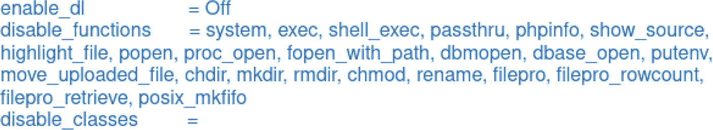

让我们从安全影响的角度逐一检查我们提供的每个 PHP 配置设置。

### `enable_dl = Off`

我们通常应将 `enable_dl` 设置为“Off”，这被认为是一种良好的安全实践。通过这样做，我们可以降低通过不受信任的扩展执行任意代码的风险。

通过在运行时禁用扩展的动态加载，我们可以防止与恶意用户上传或加载他们自己的扩展（可能包含有害代码）相关的潜在安全风险。

想象一下，您的网站是一个安全设施，而扩展就像工人可以带入的工具。允许动态加载扩展（工具）就像允许任何人带入自己的工具，这可能很危险。通过将 `enable_dl` 设置为“Off”，我们确保只有预先批准的安全工具（扩展）才能在此设施内使用。

### `disable_functions = `

此设置允许我们指定一个禁止执行的 PHP 函数列表。我们列出了几个可用于执行系统命令或可能危害服务器的函数。列出的函数有 `system`， `exec`， `shell_exec`， `passthru`， `phpinfo`， `show_source`， `highlight_file`， `popen`， `proc_open`， `fopen_with_path`， `dbmopen`， `dbase_open`， `putenv`， `move_uploaded_file`， `chdir`， `mkdir`， `rmdir`， `chmod`， `rename`， `filepro`， `filepro_rowcount`， `filepro_retrieve`， 和 `posix_mkfifo`。

通过禁用这些函数，我们可以阻止潜在危险操作的执行。例如，禁用 `system`、`exec` 和 `shell_exec` 等函数有助于防范命令注入漏洞。禁用 `move_uploaded_file` 可以防止未经授权的文件上传或重要文件的覆盖。然而，明智地使用此设置很重要，因为它可能会影响我们应用程序的功能。在禁用任何函数之前，我们应该清楚了解其影响。

想象一下，您的网站是一个安全实验室。允许 `system` 和 `exec` 等危险函数，好比允许不受限制地将潜在有害化学品带入实验室。通过禁用这些函数，我们确保只使用安全的、受控的物质，保护实验室免受意外或故意的伤害。类似地，禁用 `move_uploaded_file` 就像是确保只有授权人员才能移动和处理重要文件，以防止错放或未经授权的更改。

### `disable_classes = ...`

此设置允许我们指定一个禁止实例化的 PHP 类列表。这个概念与 `disable_functions` 类似，但针对的是类而非函数。

禁用特定类的安全影响取决于我们应用程序的上下文和目的。通过限制使用某些可能在被滥用时带来安全风险的类，我们可以增强应用程序的安全性。但是，在使用此设置时应谨慎，因为它可能会影响依赖这些类的应用程序或库的功能。

想象一下，您的网站是一个安全工厂，类就像工人可以使用的专用机器。允许不受限制地使用任何机器可能导致误用或事故。通过禁用那些被认定为危险或对工人不必要的特定机器（类），我们可以确保更安全的工作环境。然而，确保这些限制不会中断基本操作也很重要。

示例：

```php
open_basedir = /var/www/html
disable_functions = exec, shell_exec, system
```

## 其他 PHP 通用设置

下面分享了一些其他需要为 PHP 环境的安全性进行配置的重要通用设置。

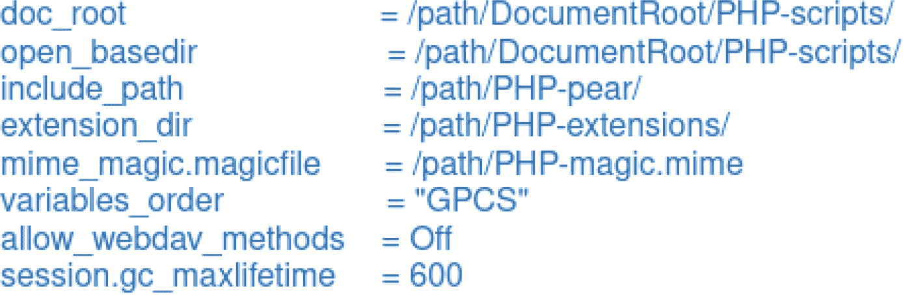

让我们从安全影响的角度讨论上述描述中的每个 PHP 配置设置。

### `doc_root` 和 `open_basedir`

`doc_root` 设置了 PHP 脚本允许访问文件的文档根目录，而 `open_basedir` 则将 PHP 脚本限制在特定目录内操作。

这些设置有助于将 PHP 脚本限制在特定的目录结构内，从而降低未授权文件访问的风险。如果配置不当，攻击者有可能利用目录遍历攻击访问敏感文件或在服务器上执行任意代码。正确设置 `open_basedir` 可以防止脚本访问指定路径之外的系统文件或目录，从而增强安全性。

想象一下，您的网站是一栋大型办公楼。`doc_root` 设置就像定义员工可以在大楼的哪些区域工作。没有这些限制，员工可能会游荡到他们不应该进入的敏感区域（例如服务器机房）。设置 `open_basedir` 就像在限制区域门口放置保安，确保员工只在其指定区域内操作。


### `include_path`

`include_path` 指定了 PHP 在查找被包含或必需文件时所搜索的目录。

如果包含路径中包含了存有敏感文件的目录，攻击者就可能利用它来包含恶意文件。我们应当注意避免包含那些不受我们控制的目录，因为这可能导致安全漏洞。

想象你的网站是一座图书馆。`include_path` 设置就像是规定管理员在找书时需要查看哪些书架。如果书架上含有有害的书籍（恶意文件）或不应被任何人随意访问的书籍（敏感文件），攻击者可能会滥用这种访问权限。确保管理员只搜索可信的书架（目录），有助于维护图书馆的安全。

### `extension_dir`

`extension_dir` 设置了 PHP 查找扩展（用于扩展 PHP 功能的共享库）的目录。

如果攻击者能够篡改此设置，他们就有可能加载并执行恶意扩展，从而危及服务器安全。确保此目录安全可靠且仅使用受信任的扩展至关重要。

想象你的网站是一个餐厅厨房，而 `extension_dir` 是厨师存放烹饪工具（扩展）的储藏室。如果任何人都可以把自己的工具放进储藏室，他们就有可能带入危险或不合规的物品（恶意扩展）。通过确保储藏室的安全，并只允许可信的厨师添加工具，我们就能维护一个安全的厨房环境。

### `mime_magic.magicfile`

`mime_magic.magicfile` 指定了用于 MIME 类型检测的 MIME 魔法文件的路径。

如果攻击者能够控制或篡改此文件，他们就有可能诱骗服务器错误识别文件类型，从而导致诸如代码执行等安全漏洞。

想象你的网站是一个工厂，而 `mime_magic.magicfile` 就像是指导工人如何识别不同材料的质量控制手册。如果有人篡改手册，他们可能会将有害物质错误地标记为安全物质，从而导致潜在事故。通过确保手册安全存放且仅限可信人员访问，我们就能维护工厂运营的安全性与准确性。

### `allow_webdav_methods`

`allow_webdav_methods` 控制是否允许在 PHP 脚本中使用 WebDAV 方法。

允许 WebDAV 方法可能会使你的应用程序面临与 WebDAV 相关的安全风险，例如未经授权的文件访问和操作。通常建议将其设置为“Off”，除非你确有使用 WebDAV 方法的特定需求。

想象你的网站是一个安全的文档存储设施。允许 WebDAV 方法就如同让外部人员能够直接访问和操作设施中存储的文档。这可能导致未经授权的访问和潜在的数据泄露。通过将 `allow_webdav_methods` 设置为“Off”，我们确保只有经过授权且必要的方法用于访问和操作文件。

### `session.gc_maxlifetime`

`session.gc_maxlifetime` 指定会话的最大存活时间，单位为秒。

将此值设置过高会导致会话存活时间过长，容易遭受会话劫持或会话固定攻击。正确配置此设置可确保会话在合理时间后过期，从而降低用户会话被未经授权访问的风险。

想象你的网站是一家酒店，而 `session.gc_maxlifetime` 就像客人无需续订即可在房间内停留的时长。如果允许客人无限期停留，未经授权的个人可能会利用这一点来占用房间（会话）而不经过适当授权。通过设置合理的退房时间，我们就能确保房间（会话）被清空，并最小化未经授权的访问。

更多安全配置：除了上述配置外，以下还有一些对于额外安全设置至关重要的选项。

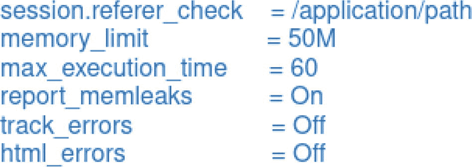

### `session.referer_check = /application/path`

此设置允许你为会话验证指定一个 referer 检查。它将会话的访问限制在 HTTP Referer 与指定值匹配的请求上。

使用 `session.referer_check` 可以作为一项安全措施，用于防范会话固定和会话劫持攻击。它将会话的访问限制在仅来自特定应用程序路径的请求上。这有助于保护会话免受来自外部的未经授权访问。

想象你的网站是一座安全的建筑，而 `session.referer_check` 就像一位安保人员在检查每个进入者的身份证件。这位安保人员只允许持有来自你建筑的有效身份证件的人进入，从而阻止外人获得未经授权的访问。

示例配置：

```
session.referer_check = /application/path
```

### `memory_limit`

`memory_limit` 设置了 PHP 脚本可以分配的最大内存量。它通常用于防止 PHP 脚本消耗过多服务器资源。

设置恰当的 `memory_limit` 对于安全至关重要，因为它有助于防止资源耗尽攻击。如果脚本无法分配无限内存，攻击者就难以通过消耗所有可用内存来轻易使服务器不堪重负。然而，设置过低会影响应用程序的正常运行，因此应结合应用程序的需求进行权衡。

想象你的网站是一个座位有限的餐厅（内存）。设置限额可以确保没有任何一个团体能占用所有座位，从而为所有顾客提供公平的用餐机会，并防止过度拥挤。

示例配置：

```
memory_limit = 128M
```

### `max_execution_time`

`max_execution_time` 决定了 PHP 脚本在被终止前允许运行的最长时间（以秒为单位）。

限制脚本执行时间有助于防止拒绝服务（DoS）攻击，因为攻击者可能会提交无限期运行的脚本以消耗服务器资源。然而，设置过低可能会干扰合法脚本的执行。应根据你的应用程序需求进行配置。

可以把你的网站想象成一个会议室。设置会议最长时间可以确保会议不会无限期进行，使其他人能够使用该房间，并防止单个会议垄断空间。

示例配置：

```
max_execution_time = 30 // 30 秒
```

### `report_memleaks = On`

此设置控制 PHP 是否在脚本结束时报告内存泄漏。

启用 `report_memleaks` 有助于调试与内存相关的问题，并识别代码中潜在的安全漏洞。它不会直接产生安全影响，但有助于识别和修复与内存使用相关的漏洞。

想象你的网站是一个工厂。报告内存泄漏就像是让检查员识别并报告机器中的泄漏，有助于维护工厂的效率和安全性。

示例配置：

```
report_memleaks = On
```

### `track_errors = Off`

`track_errors` 决定 PHP 是否在 `$php_errormsg` 变量中记录错误。

默认保持 `track_errors` 关闭通常是一个良好实践，因为它可以最大程度地减少应用程序中错误消息的暴露，降低信息泄露的风险。如果错误消息包含敏感信息或堆栈跟踪，将其排除在错误日志之外可以增强安全性。

可以把你的网站想象成一个安全的通信系统。关闭 `track_errors` 可以确保错误消息不会被广播出去，从而防止敏感信息被未经授权的人听到。

示例配置：

```
track_errors = Off
```


### `html_errors = Off`

当`html_errors`设置为关闭时，错误消息将以纯文本而非格式化 HTML 的形式显示。

从安全角度来看，禁用`html_errors`是一种良好实践，因为它降低了跨站脚本攻击（XSS）的风险。如果错误消息以 HTML 形式显示，攻击者可能会利用它向错误输出中注入恶意脚本。保持其关闭状态可确保错误消息不会作为 HTML 进行处理。

想象一下你的网站是一块公告板。禁用`html_errors`就像确保公告板上张贴的便条都是纯文本，防止任何人添加可能影响阅读公告板的其他人的有害代码。

配置示例：

```
html_errors = Off
```

正确配置这些 PHP 设置对于维护 Web 应用程序的安全性至关重要。理解潜在的安全影响并应用最小权限原则，将访问和操作限制在应用程序功能所必需的范围内非常重要。此外，定期的安全审计和测试有助于发现并解决与这些设置相关的漏洞。

以上仅是 PHP 配置设置如何增强 Web 应用程序安全性的几个示例。然而，必须牢记的是，安全性是一个多层面的问题，正确的编码实践、定期更新以及其他安全措施对于构建针对威胁的稳健防御同样至关重要，我们将在后续内容中进一步探讨这些主题。根据最佳实践和应用程序的具体要求，定期审查和调整 PHP 配置设置是 Web 应用程序安全的一个基本方面。

## 输入验证与净化技术

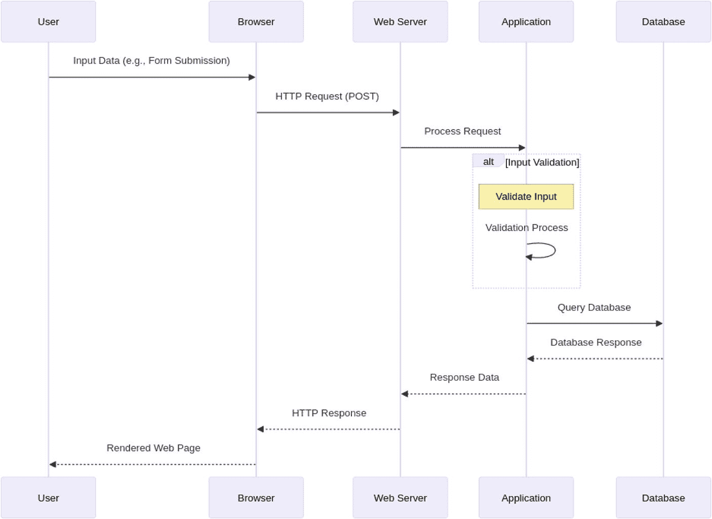

图 2-4

请求-响应周期中输入验证的上下文

输入验证在安全性中至关重要，尤其是在 PHP 中，因为它是抵御各种安全漏洞和攻击的关键防线。以下说明了为什么输入验证非常重要，尤其是在 PHP 的上下文中。

### 防止注入攻击

输入验证有助于防御注入攻击，例如 SQL 注入和跨站脚本攻击（XSS）。通过验证和净化用户输入，可以确保攻击者无法将恶意代码或有效载荷注入到应用程序中。

### 减少数据暴露

验证输入有助于控制进入应用程序的数据。这降低了敏感信息（例如数据库凭据）通过错误消息或漏洞泄露的风险。

### 防范参数篡改

正确的输入验证可以防范参数篡改攻击，攻击者会试图操纵查询参数，例如更改`user_id`的值以未经授权访问其他用户的数据。

### 防御跨站脚本攻击（XSS）

输入验证可以显著降低 XSS 攻击的风险，当不受信任的数据被包含在网页中时就会发生此类攻击。通过验证和转义输出，可以防止恶意脚本在用户的浏览器中执行。

### 阻止跨站请求伪造攻击（CSRF）

使用反 CSRF 令牌并验证请求有助于阻止 CSRF 攻击。经过正确验证的输入可确保请求来自可信来源。

### 增强数据完整性

输入验证通过确保应用程序处理的数据准确且符合预定义标准，从而提升数据完整性，防止数据损坏。

### 防止应用程序逻辑滥用

输入验证有助于防止攻击者利用应用程序逻辑，例如为购物车数量提交负值或绕过访问控制。

### 加强数据库安全

通过输入验证防御 SQL 注入，可以保护数据库和数据免受未经授权的访问和篡改。

### 确保合规性

在许多行业中，监管合规标准（如 GDPR 和 HIPAA）要求实施数据保护措施，包括正确的输入验证。忽视验证可能导致不合规以及潜在的法律后果。

### 最小化攻击面

通过验证和净化输入来减少应用程序的攻击面，可以降低攻击者利用漏洞的机会，使应用程序更能抵御攻击。

### 维护用户信任

一个安全的应用程序能够验证输入并保护用户数据，从而建立用户群的信任。安全漏洞和数据泄露可能会对声誉和财务造成严重影响。

### 促进未来发展

正确的输入验证通过确保应用程序接收到的数据可靠，简化了开发流程。它减少了意外行为和安全事件发生的可能性。

在 PHP 的上下文中，输入验证是 Web 安全的一个基本方面。PHP 应用程序通常处理大量用户输入，因此成为攻击者的主要目标。在 PHP 中进行正确的输入验证有助于防止可能导致数据泄露、未授权访问和其他安全事件的漏洞。因此，在你的 PHP 应用程序中，将全面有效的输入验证作为一项基本安全措施是至关重要的。

现在，我们将以更明确、更详细的方式深入探讨几种 PHP 输入验证技术，重点关注它们的安全影响。

### 数据过滤与验证函数

使用 PHP 内置的`filter_var()`和`filter_input()`函数来验证和过滤输入数据。这些函数允许你指定期望的数据类型，例如电子邮件地址或整数。如果输入与预期格式不匹配，它们会返回`false`。想象一下你在检查一个玩具是否能放进形状正确的孔中。这个函数确保电子邮件符合正确的形状。这些函数通过确保输入符合特定的格式和数据类型，有助于防止 SQL 注入和 XSS 等漏洞。

示例：

```php
$email = filter_var($_POST['email'], FILTER_VALIDATE_EMAIL);
if ($email === false) {
// 无效的电子邮件地址
}
```

### 正则表达式

正则表达式提供了强大的模式匹配能力。你可以使用它们来定义并根据复杂模式验证输入。例如，你可以使用正则表达式验证 YYYY-MM-DD 格式的日期。正则表达式允许你强制执行严格的输入模式，从而降低数据操纵和利用的风险。这就像使用一个模板来检查你的画是否匹配正确的图案，例如确保日期看起来像“2023-12-31”。

示例：

```php
if (preg_match('/^\d{4}-\d{2}-\d{2}$/', $_POST['date'])) {
// 有效日期
}
```

### 允许列表与拒绝列表

允许列表涉及明确指定允许的字符或模式，而拒绝列表则标识不允许的字符或模式。白名单是更安全的方法。允许列表确保只允许预期的字符，从而降低代码注入和其他攻击的风险。这就像老师只允许穿着合适校服（字母和数字）的学生进入教室。

示例（允许列表）：

```php
if (preg_match('/^[a-zA-Z0-9]+$/', $_POST['username'])) {
// 有效的用户名
}
```


### 转义输出

虽然输入验证很重要，但转义输出对于防止 XSS 攻击也至关重要。在将用户生成的内容显示到 HTML 之前，请使用 `htmlspecialchars()` 等函数对其进行转义，确保内容中的任何 HTML 或 JavaScript 都被视为纯文本。正确转义的输出可防止恶意脚本在你的 Web 应用上下文中执行。想象一下，你在把食物放进冰箱之前先把它包好，这样食物就能保持清洁和安全。这能让网站免受恶意内容的侵害。

示例：

```php
echo htmlspecialchars($_POST['user_input'], ENT_QUOTES, 'UTF-8');
```

### 参数化查询

与数据库交互时，请使用参数化查询或带有 PDO 或 MySQLi 的预处理语句。这可以将 SQL 代码与用户输入分离，有效防止 SQL 注入。参数化查询通过确保用户输入被视为数据而非可执行代码，消除了 SQL 注入的风险。这就像你的午餐盒里有专门放置食物和饮料的隔层，防止它们混在一起弄得一团糟。这能确保数据安全且隔离。

使用 PDO 的示例：

```php
$stmt = $pdo->prepare("SELECT * FROM users WHERE username = :username");
$stmt->bindParam(':username', $_POST['username']);
$stmt->execute();
```

### 跨站请求伪造 (CSRF) 令牌

跨站请求伪造 (CSRF) 是一种攻击，攻击者诱骗已认证的用户在不知情的情况下向 Web 应用发出非预期的请求。为了说明在 PHP 应用程序中的 CSRF 攻击，我们可以使用序列图来描绘攻击者利用受害者的会话执行非预期操作的场景。图 2-5 是一个简化的序列图。

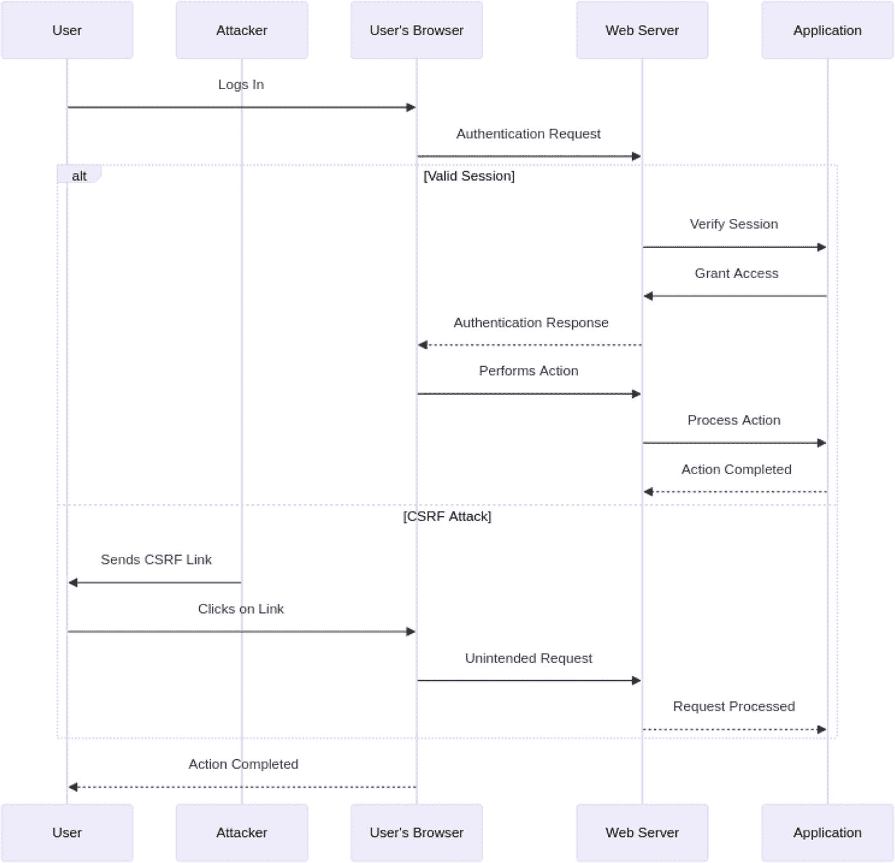

**图 2-5**
展示 CSRF 上下文的请求-响应周期

在表单中包含反 CSRF 令牌以验证请求来源。这通过确认请求来自预期来源，可以保护你的应用程序免受 CSRF 攻击。CSRF 令牌确保只有受信任的来源才能向你的应用程序发起请求，从而防止未授权的操作。这就像一个只有你的朋友才知道的秘密握手方式，这样只有他们才能在你的院子里玩耍。

示例：

```php
// 在 HTML 表单中
<form method="post" action="process.php">
    <input type="hidden" name="csrf_token" value="<?php echo $_SESSION['csrf_token']; ?>">
    <!-- 其他表单字段 -->
</form>

// 在 PHP 代码中
if ($_POST['csrf_token'] !== $_SESSION['csrf_token']) {
    // CSRF 令牌无效
}
```

### 内容安全策略 (CSP)

实施 CSP 头文件，指定允许加载内容（如脚本、样式和图像）的来源。这通过限制内容加载的域来降低 XSS 攻击的风险。CSP 通过控制可执行脚本的来源，帮助保护你的应用程序免受 XSS 攻击。想象你的父母只允许你吃自己厨房和一家可信商店的食物。这能让你远离有害食物。

示例：

```php
header("Content-Security-Policy: default-src 'self'; script-src 'self' cdn.example.com");
```

### HTTP 安全头文件

设置 HTTP 安全头文件，例如 `X-Content-Type-Options`、`X-Frame-Options` 和 `X-XSS-Protection`，以提高整体安全性。这些头文件可以防止内容类型嗅探、点击劫持和 XSS 攻击。这些头文件通过指示浏览器安全运行并抵御特定类型的攻击，从而增加了一层额外的保护。它们就像交通标志，告诉汽车（浏览器）安全驾驶并遵守规则。

示例：

```php
header("X-Content-Type-Options: nosniff");
header("X-Frame-Options: DENY");
header("X-XSS-Protection: 1; mode=block");
```

### 文件上传验证

如果你的应用程序允许文件上传，请验证文件类型并使用允许的文件扩展名白名单。将上传的文件存储在具有受限权限的单独目录中，以防止任意文件执行。验证文件上传可以防止恶意代码执行，并将上传限制为已知的安全格式。这就像只允许某些玩具进入你的游戏室，确保它们是安全且被允许的。

示例：

```php
$allowedExtensions = ['jpg', 'png', 'gif'];
$fileExtension = pathinfo($_FILES['file']['name'], PATHINFO_EXTENSION);
if (!in_array($fileExtension, $allowedExtensions)) {
    // 文件类型无效
}
```

这些明确且详细的输入验证技术是构建安全 PHP 应用程序的基础。它们有助于防止各种安全漏洞，并保护你的应用程序及其用户免受潜在的威胁和攻击。始终遵循最佳实践并及时了解安全标准，以保持对安全风险的有力防御。

### 输入清理

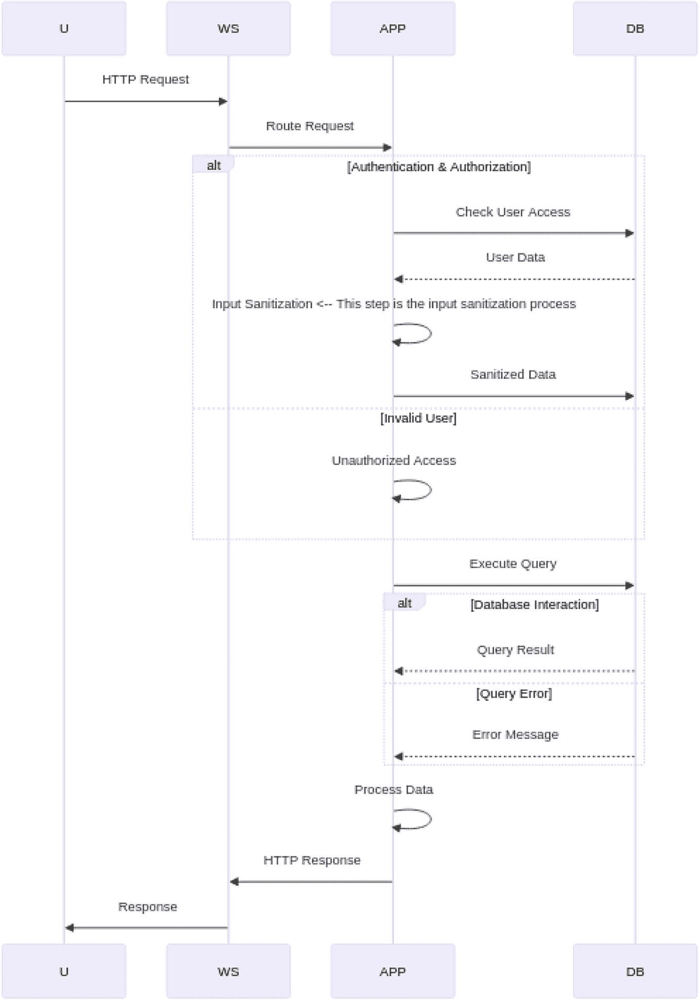

**图 2-6**
展示输入清理上下文的请求-响应周期

输入清理在 PHP Web 应用安全中至关重要，因为它是对抗各种安全威胁的关键防御机制。输入清理涉及清洗和验证用户提供的数据，以确保其符合预期的格式、数据类型和安全标准。以下是输入清理在 PHP 和 Web 应用安全中如此重要的一些原因。

### 防止 SQL 注入

最常见的严重安全威胁之一是 SQL 注入。攻击者试图通过向输入字段注入恶意代码来操纵 SQL 查询，如果未正确清理，这可能导致对数据库中数据的未授权访问、修改或删除。

参数化查询和数据过滤等输入清理技术可以通过确保用户输入被视为数据而非可执行代码来防止 SQL 注入。

### 缓解跨站脚本攻击 (XSS)

跨站脚本攻击涉及向网页注入恶意脚本，然后这些脚本会在毫无戒心的用户的浏览器中执行。接受未过滤用户输入的输入字段是 XSS 的常见攻击向量。输入清理（例如使用 `htmlspecialchars()` 等函数转义输出）有助于确保用户生成的内容被视为纯文本而非代码。这可以防止恶意脚本的执行。

### 防止跨站请求伪造 (CSRF)

CSRF 攻击诱骗用户在不知情或未经同意的情况下在网站上执行操作。这些攻击通常通过已授权的用户会话操纵数据。正确的输入验证和检查（包括在表单中添加反 CSRF 令牌）有助于确保仅接受来自可信来源的请求，从而降低 CSRF 攻击的风险。

### 防止数据篡改

用户可能尝试以各种方式操纵发送到服务器的输入数据。例如，他们可能尝试提交负值或未授权的数据。输入清理可确保接收到的数据有效且在预期范围内，从而维护应用程序数据的完整性。

### 防御文件上传漏洞

如果你的应用程序允许文件上传，正确的输入验证有助于防止恶意文件上传。用户可能尝试上传含有可执行代码或危险内容的文件。验证文件类型、检查文件扩展名并将上传的文件存储在安全位置，可以保护你的服务器免受与文件相关的漏洞攻击。

### 减少攻击面

Web 应用程序暴露于来自用户的各种输入，每个输入字段都代表一个潜在的攻击向量。输入清理通过确保只处理有效和预期的数据来减少攻击面，从而最大限度地减少攻击者的机会。

### 提升用户体验

虽然输入清理的主要焦点是安全性，但它也能有助于改善用户体验。验证输入数据并提供反馈可以帮助用户理解要求，从而带来更顺畅的应用程序交互。


### 遵循安全最佳实践

正确的输入清理是安全网页应用开发中的基本最佳实践。遵循这些最佳实践可确保您的应用程序符合行业标准和安全规范。

### 长期维护与安全保障

在应用程序架构中制定健壮的输入清理策略，能够简化维护工作并便于未来的安全更新。这为应对不断演变的安全威胁奠定了更易维护、更安全的基础。

输入清理是网页应用安全（包括 PHP 应用）的基石。它有助于防范多种安全威胁，包括 SQL 注入、XSS、CSRF、数据篡改以及与文件相关的漏洞。在 PHP 应用程序中纳入严格的输入验证与清理实践，对于保护数据、用户以及整体网页应用安全至关重要。

以下是在 PHP 中清理输入的几种技术。

### 去除 HTML 标签

我们可以使用 `strip_tags()` 函数来移除用户输入中的 HTML 和 PHP 标签。这通过消除任何潜在有害的 HTML 或脚本标签，有助于防范跨站脚本（XSS）攻击。想象我们在做一个三明治，`strip_tags()` 就像在吃之前去掉任何危险或有害的成分。

```
$cleanedInput = strip_tags($_POST['user_input']);
```

### 过滤特殊字符

我们可以使用带 `FILTER_SANITIZE_STRING` 过滤器的 `filter_var()` 函数来移除或转义输入中的特殊字符。这就像一个特殊的清洁器，在吃之前把食物上任何脏东西都擦洗干净。

```
$cleanedInput = filter_var($_POST['user_input'], FILTER_SANITIZE_STRING);
```

### 使用 `htmlspecialchars()` 进行输出转义

虽然严格来说这不属于输入清理，但必须提到的是，在 HTML 中显示用户生成的内容时，应使用 `htmlspecialchars()`。该函数会转义特殊字符以防止 XSS 攻击。这就像在把食物放到盘子里之前，用干净的纸把它包起来，确保安全和卫生。

```
echo htmlspecialchars($_POST['user_input'], ENT_QUOTES, 'UTF-8');
```

### 使用预处理语句防止 SQL 注入

在处理数据库查询中的用户输入时，应使用预处理语句（例如使用 PDO 或 MySQLi）。这些语句会自动转义和清理输入数据，以防止 SQL 注入。这就像拥有一个带独立隔间的特殊餐盒，食物不会混在一起造成混乱。

```
$stmt = $pdo->prepare("INSERT INTO users (username) VALUES (:username)");
$stmt->bindParam(':username', $_POST['username']);
$stmt->execute();
```

### 安全处理文件上传

当用户上传文件时，清理和验证文件名及扩展名至关重要，以防止目录遍历或任意文件执行。想象一下，我们允许朋友带玩具来一起玩，但我们会检查确认他们只带安全的玩具。

```
$allowedExtensions = ['jpg', 'png', 'gif'];
$fileExtension = pathinfo($_FILES['file']['name'], PATHINFO_EXTENSION);
$fileExtension = strtolower($fileExtension); // 确保为小写
if (!in_array($fileExtension, $allowedExtensions)) {
// 无效的文件类型
}
```

### 过滤用户生成的 URL

如果应用程序允许用户输入 URL，我们可以使用带 `FILTER_VALIDATE_URL` 过滤器的 `filter_var()` 函数，确保 URL 格式有效。这就像确认朋友给我们的地址是真实可去的地方。

```
$cleanedURL = filter_var($_POST['url'], FILTER_VALIDATE_URL);
if ($cleanedURL === false) {
// 无效的 URL
}
```

### 删除或转义控制字符

我们可以使用正则表达式来删除或转义用户输入中的控制字符。这就像从画作中去掉任何奇怪的符号，确保画面干净清晰。

```
$cleanedInput = preg_replace('/[[:cntrl:]]/', '', $_POST['user_input']);
```

## 安全处理会话和 Cookie

在深入探讨会话和 Cookie 的安全方面之前，我们先尝试理解它们在 PHP 网页应用上下文中的内部工作原理。

Cookie 和会话是网页应用中的基本概念，有助于维护用户状态并实现个性化体验。让我们来理解它们。

### Cookie

想象 Cookie 是当您访问网站时，网站存储在您计算机上的一些小信息片段。这些 Cookie 就像网站留在您计算机上的小纸条，可以包含各种细节，例如您的偏好或添加到购物车中的物品。

*   示例 1：将 Cookie 想象成您访问在线商店时使用的购物清单。您在清单上添加物品，当您再次返回商店时，清单仍然存在，显示您想要购买的物品。这与 Cookie 存储您的偏好并使您在网站上保持“登录状态”的方式类似。

*   示例 2：当您访问新闻网站时，它会记住您是否更喜欢先看体育新闻还是商业新闻。这就像网站说“哦，这个人更喜欢体育新闻”，然后向您展示相关内容。这是通过存储您偏好的 Cookie 实现的。


### 会话（Sessions）

会话就像虚拟房间，网站通过它在你使用过程中追踪你的活动。它能帮助网站在你点击浏览时记住你是谁、正在做什么。会话是临时的，只在你访问网站期间存在。

- **示例 1**：想象你在图书馆里读书。图书管理员给你一张专用卡片，只要持有这张卡片，你就能继续阅读并从上次停下的位置继续。这张卡片就像你的会话，允许网站记住你在站内的操作。

- **示例 2**：假设你正在使用网上银行网站。登录时，网站会为你创建一个会话。当你在不同页面间跳转时，它会持续跟踪你的账户余额、近期交易及其他信息。这样你无需每次重新登录，就能轻松管理财务。

Cookie 就像是网站留在你电脑上的小纸条，用于在更长时间内记住你的偏好和操作，即使你离开网站后也有效。而会话就像网站创建的临时房间，用于在你活跃使用网站时追踪你的行为。Cookie 与会话共同协作，让你的网页体验更加个性化和高效。

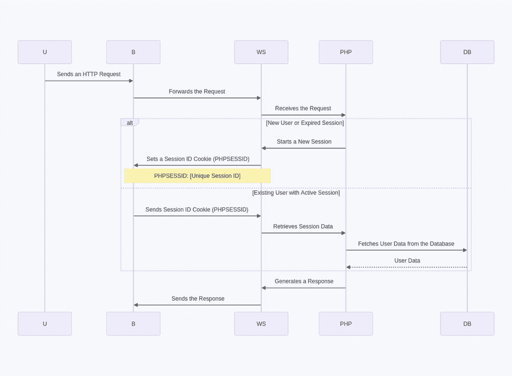

图 2-7 – 展示 Cookie 与会话使用的请求-响应周期

以下是图 2-7 中发生的几个步骤：

1. 用户（U）发起一个 HTTP 请求。
2. 浏览器（B）将请求转发至 Web 服务器（WS）。
3. Web 服务器（WS）将请求路由至 PHP 应用程序（PHP）。
4. 如果是新用户或会话已过期，PHP 应用程序会使用 `session_start()` 启动新会话。此函数会生成一个唯一的会话 ID（例如 `PHPSESSID`），并创建一个存储会话数据的服务器端数据结构。
5. Web 服务器在用户浏览器中设置一个名为 `PHPSESSID` 的会话 ID Cookie，以此作为响应。该 Cookie 持有唯一的会话 ID，使服务器能将用户的请求与其会话关联起来。
6. `PHPSESSID` 值是一个唯一标识符，可能类似于 `57fcb0843d4d7269c69b450f7f2c7853`。
7. 对于已有活跃会话的现有用户，浏览器会在用户请求中附带 `PHPSESSID` Cookie。PHP 应用程序（PHP）会利用此会话 ID 来检索用户的会话数据。
8. 为了获取更多用户数据，PHP 应用程序通过 SQL 查询与数据库（DB）通信。会话 ID 通常作为参数传递，用于在数据库中标识用户的会话数据。
9. 数据库返回请求的用户数据，例如用户偏好、购物车商品或登录状态。
10. PHP 应用程序根据用户的会话数据以及请求的页面或操作生成响应。
11. Web 服务器将响应发送回用户的浏览器。

PHP 提供了几个函数用于设置和管理会话：

1. `session_start()`：此函数用于初始化新会话或恢复现有会话。
2. `session_id()`：你可以使用此函数获取或设置当前会话 ID。
3. `setcookie()`：此函数用于设置 Cookie，包括 `PHPSESSID` 会话 Cookie。
4. `$_SESSION`：一个超全局数组，用于存储会话变量及其值。你可以使用此数组存储和检索与特定用户会话相关的数据。

现在我们已经复习了基础知识，接下来探讨一下安全处理 Cookie 和会话的方法。我们先从会话开始。

#### 安全处理会话

**重新生成会话 ID**

会话 ID 是用户在访问网站时分配给其会话的唯一标识符。它通常作为 Cookie 或 URL 的一部分存储。会话 ID 帮助服务器识别用户，并将其请求与特定会话关联。重新生成会话 ID 意味着生成一个新的、唯一的会话 ID，并将其与用户的会话数据关联起来。


#### 从安全角度的重要性

出于多种安全原因，重新生成会话 ID 至关重要：

1.  **防止会话固定攻击**
    *   会话固定是一种攻击手段，攻击者诱使用户使用一个已知的会话 ID。攻击者设置一个会话 ID（可能通过社会工程学获取），然后等待用户使用该会话 ID 进行身份验证。
    *   如果在登录时未重新生成会话 ID，攻击者就可能未经授权访问受害者的会话和敏感信息。

2.  **减少可利用的时间窗口**
    *   即使会话 ID 被恶意获取，重新生成它也能限制攻击者利用它的机会窗口。当会话被重新生成时，先前已知的会话 ID 就会失效。

3.  **缓解会话劫持**
    *   重新生成会话 ID 使得攻击者难以劫持活动会话。如果攻击者获取了用户的会话数据，但无法预测或控制新生成的会话 ID，他们就无法有效地冒充用户。

4.  **增强会话安全性**
    *   在许多情况下，会话 ID 是基于可预测的模式（例如，递增的数字或时间戳）生成的。通过重新生成会话 ID，你就能让攻击者难以预测未来的会话 ID。

在 PHP 中，你可以使用 `session_regenerate_id()` 函数来重新生成会话 ID。建议在用户登录或更改其安全上下文（例如，从未经身份验证状态变为经过身份验证状态）后重新生成会话 ID。以下是一个示例：

```php
session_start();
session_regenerate_id(true); // "true" 参数会删除旧的会话数据
```

这段代码启动会话，重新生成会话 ID，并删除旧的会话数据，以确保旧会话不再有效。这有助于缓解会话固定攻击并增强会话安全性。

重新生成会话 ID 是 PHP 中一项关键的安全实践，用于防御会话固定攻击并增强 Web 应用程序的整体安全性。通过频繁更改会话 ID，你可以降低用户会话被未授权访问的可能性。

#### 设置会话 Cookie 参数

在 PHP 中处理会话时，设置会话 Cookie 参数对于安全性至关重要。这些参数定义了会话 Cookie 如何在用户浏览器上传输和存储。让我们详细阐述这一点及其从安全角度的重要性。

在 PHP 中，你可以使用 `session_set_cookie_params()` 函数设置会话 Cookie 参数。这些参数包括：
*   `lifetime`：会话 Cookie 的有效时间（以秒为单位）
*   `path`：服务器上 Cookie 可用的路径
*   `domain`：Cookie 有效的域名
*   `secure`：指示 Cookie 是否应仅通过 HTTPS 传输的标志
*   `httponly`：指示 Cookie 是否应通过 JavaScript 访问的标志
*   `samesite`：指定跨站请求保护的 SameSite 属性的标志（例如，`Lax` 或 `Strict`）

#### 从安全角度的重要性

1.  **会话持续时间控制**：通过设置 `lifetime` 参数，你可以控制会话的有效时长。更短的生命周期更安全，因为它们减少了攻击者劫持会话的机会窗口。

2.  **路径和域名限制**：指定 `path` 和 `domain` 参数有助于限制会话 Cookie 的可用性。这至关重要，因为它可以防止 Cookie 被你网站中未经授权的部分访问。

3.  **Secure 标志**：设置 `secure` 标志可确保会话 Cookie 仅通过安全连接（HTTPS）传输。这对于保护用户浏览器和服务器之间传输的敏感数据至关重要。

4.  **HttpOnly 标志**：启用 `httponly` 标志可防止客户端 JavaScript 访问会话 Cookie。这是一项强大的安全措施，用于防御 XSS**（跨站脚本）**攻击，此类攻击中恶意脚本会试图窃取 Cookie。

5.  **SameSite 属性**：`samesite` 属性允许你定义浏览器应如何处理跨站请求中的 Cookie。它有助于防御 CSRF**（跨站请求伪造）**攻击。使用 `Strict` 作为值可确保 Cookie 仅在**第一方**请求中发送，从而增强安全性。

以下是在 PHP 中设置会话 Cookie 参数的示例：

```php
session_set_cookie_params([
    'lifetime' => 0,   // 浏览器关闭时过期
    'path'     => '/', // 对整个域名可用
    'domain'   => 'example.com',
    'secure'   => true, // 仅通过 HTTPS 传输
    'httponly' => true, // 无法通过 JavaScript 访问
    'samesite' => 'Strict' // 跨站请求保护
]);
session_start();
```

通过定义这些参数，你可以增强会话的安全性，并帮助你的应用程序防御各种常见的 Web 安全威胁，包括会话劫持、数据泄露和跨站攻击。

#### 保护会话数据

会话数据是存储在服务器上、与用户访问网站相关联的信息。它可以包含用户特定的信息，例如用户名、偏好设置、购物车内容以及在用户会话期间需要在多个网页间持久化的其他数据。

会话数据通常包含敏感信息和用户特定的设置。保护会话数据对于防止未授权访问、数据篡改和信息泄露至关重要。以下是其重要性的关键原因：
1.  **机密性**：会话数据可能包含用户标识符、电子邮件地址或其他个人信息。对这些数据的未授权访问可能导致隐私泄露和身份盗窃。

2.  **完整性**：如果会话数据被攻击者修改，可能导致意外行为、未授权操作甚至安全漏洞。确保会话数据的完整性至关重要。

3.  **身份验证与授权**：会话数据通常用于跟踪用户的**身份验证**状态并确定其在应用程序中的访问权限。保护会话数据对于维护安全的用户会话至关重要。

4.  **防止会话劫持**：恶意用户可能试图窃取有效的会话 ID 来冒充其他用户。通过保护会话数据，你可以降低会话劫持的风险。

避免在会话中存储敏感数据对于维护 Web 应用程序的安全性至关重要。敏感数据应以更安全的方式存储，例如存储在经过适当加密的数据库中。以下是一个示例，说明为什么应避免在会话中存储敏感数据以及应如何处理。

##### 为什么应避免在会话中存储敏感数据

1.  **会话数据持久性**：会话数据通常存储在服务器上，并与用户的会话相关联。但是，如果管理不当，其持久时间可能超过用户的活动会话期。敏感数据（如密码或信用卡号）不应留在服务器端的会话中。

2.  **安全风险**：如果服务器的会话数据被入侵，或者会话管理不安全，敏感数据可能会暴露给攻击者。例如，会话数据可能通过会话固定攻击或会话窃取被访问。

3.  **数据泄露**：如果会话数据处理不当，存在意外泄露的风险。开发人员可能会无意中在日志或调试输出中暴露敏感信息。


##### 避免在会话中存储敏感数据的示例

我们考虑一个用户登录 Web 应用程序的场景。你应该避免将其密码存储在会话数据中。相反，只应存储一个安全标识符（例如用户 ID 或用户名）来引用用户的账户：

```php
// Login process
if (user_credentials_are_valid($_POST['username'], $_POST['password'])) {
    // Don't store the password in the session
    $_SESSION['user_id'] = get_user_id_by_username($_POST['username']);
    // Other session variables like 'logged_in' can be set for authentication state
    $_SESSION['logged_in'] = true;
}
```

在此示例中，会话在成功认证后存储用户的 ID，而非密码。用户的密码绝不应存储在会话中。当你需要验证用户身份时，可以从安全的存储机制（例如数据库中哈希后的密码）中检索密码，并与提供的凭据进行比较。

遵循此做法，可以防止在会话中不必要地存储敏感数据，从而降低数据泄露的风险并增强 Web 应用程序的整体安全性。

### 1. 适当地销毁会话

适当地销毁会话是 PHP 会话管理中的关键方面，主要出于安全原因。我们从安全角度阐述其含义及重要性。

所谓适当地销毁会话，是指在不再需要时，以受控且安全的方式结束用户会话。此过程包括清理会话数据、取消设置会话变量，并通知服务器该会话已不再活跃。正确结束会话对于防止未经授权的访问和保护用户数据安全至关重要。

###### 从安全角度看其重要性

1.  **防止未经授权的访问**：会话通常包含敏感的用户数据，如登录凭据、权限和个人信息。如果用户忘记注销或会话无限期保持活跃，攻击者一旦获得用户设备的访问权限，就可能利用该会话。

2.  **保护用户隐私**：用户期望其数据得到安全处理。在不再需要时结束会话，可确保敏感信息不会暴露给可能通过物理或数字方式访问用户设备的未经授权人员。

3.  **防止会话劫持**：会话劫持指攻击者获取用户活跃会话的访问权限。适当地结束会话有助于缩短此类攻击的窗口期。当会话被销毁后，即使攻击者拥有会话 ID，也无法访问会话数据。

4.  **降低会话固定风险**：会话固定是一种漏洞，攻击者可在用户浏览器中设置已知的会话 ID。如果正确销毁会话，在登录后或经过一定时间后更改会话 ID，可降低会话固定风险。

5.  **减轻 CSRF 攻击风险**：当用户注销或经过一段不活动时间后结束会话，可降低跨站请求伪造（CSRF）攻击的风险。在注销时销毁会话，可保护用户免受恶意站点发起的潜在未经授权操作。

在 PHP 中，你可以使用`session_unset()`和`session_destroy()`函数来适当地结束会话。`session_unset()`函数会取消所有会话变量的设置，而`session_destroy()`函数会终止会话。这确保了会话数据在结束后不再可访问或可利用。

以下是在用户注销时销毁会话的示例：

```php
session_start(); // Start the session
session_unset();  // Unset all session variables
session_destroy(); // End the session
```

适当地销毁会话是一项关键的安全实践，有助于保护用户数据、隐私以及 Web 应用程序的完整性。它有助于最大限度地减少与会话相关的漏洞和未经授权的访问，从而为用户带来更安全的在线体验。

#### 6. 会话超时

会话超时是一种安全机制，定义了在用户一段时间不活动后自动终止其会话的时长。从安全角度看，这至关重要，原因如下：

1.  **防止未经授权的访问**：会话超时有助于在用户忘记注销或未明确结束会话而关闭浏览器时，防止其会话被未经授权访问。如果没有会话超时，获得活跃会话访问权限的攻击者（例如通过会话劫持）可能会无限期地代表用户执行操作。

2.  **减轻会话固定攻击**：会话固定是一种攻击，攻击者诱骗用户使用其控制的会话 ID。通过设置会话超时，服务器可以在经过一定不活动时间后使会话失效，从而缩短会话固定攻击的窗口期。

3.  **减少攻击暴露面**：如果用户不再与应用程序交互，活跃会话就代表一种安全风险。会话超时限制了攻击者可能利用用户会话的时间范围，从而最大限度地减少对会话盗窃和权限提升等攻击的暴露。

4.  **保护用户隐私**：在用户使用共享或公共计算机访问 Web 应用程序的场景中，会话超时可确保其会话自动终止，防止下一个用户访问同一会话。

5.  **增强用户体验**：会话超时还可以通过防止用户在离开或忘记注销时被锁定在活跃会话中，来改善用户体验。当用户返回应用程序时，可以重新进行身份验证。

以下是在 PHP 中实现会话超时的方法：

```php
session_start();
$_SESSION['last_activity'] = time();
$session_timeout = 1800;  // 30 minutes
if (isset($_SESSION['last_activity']) && (time() - $_SESSION['last_activity'] > $session_timeout)) {
    session_unset(); // Clear the session data
    session_destroy(); // Destroy the session
}
```

在此示例中，`$_SESSION['last_activity']`时间戳在用户每次与应用程序交互时都会更新。如果用户保持不活动状态超过 30 分钟（定义的会话超时时间），则会话数据被清除，会话被销毁。

通过设置适当的会话超时，可以确保会话在经过一段合理的不活动时间后自动终止，从而增强 Web 应用程序的安全性。这是会话管理的关键方面，有助于整体安全防护。

### 2. 安全地使用会话变量

安全地使用会话变量意味着正确处理和管理存储在 PHP 会话中的数据，以防止安全漏洞和数据泄露。它涉及确保敏感信息得到保护，并对用户输入进行验证和清理，以防止常见的安全威胁。

```php
session_start();
$user_input = $_SESSION['user_input'];
// Validate and sanitize $user_input to prevent injection attacks
```

### 3. 实现 CSRF 保护

CSRF（跨站请求伪造）是一种安全漏洞，允许攻击者诱骗用户在 Web 应用程序上执行未经其同意的操作。这些操作可包括更改账户设置、进行购买或执行用户有权执行的任何操作。

```php
session_start();
$token = bin2hex(random_bytes(32));
$_SESSION['csrf_token'] = $token;
```

在表单中：

```html
<input type="hidden" name="csrf_token" value="<?php echo $_SESSION['csrf_token']; ?>">
```

在提交表单时，验证令牌。

现在，我们来介绍安全地处理 Cookie：

### 1. 设置 Cookie 属性

#### 1.1 生命周期（Expires）

设置 Cookie 的生命周期允许你控制 Cookie 的有效期。以下示例将 Cookie 设置为在一小时后过期：

```php
setcookie('user', 'John', time() + 3600, '/', 'example.com', false, true);
```

在此示例中，`time() + 3600`将过期时间设置为当前时间后一小时。超过此时间后，Cookie 将从用户浏览器中自动删除。

#### 1.2 路径（Path）

`path`属性决定了 Cookie 有效的 URL 路径。以下示例将路径指定为`/secure`：

```php
setcookie('user', 'John', time() + 3600, '/secure', 'example.com', false, true);
```

通过此设置，Cookie 只能被`example.com`域名下`/secure`路径的页面访问。

#### 1.3 域名（Domain）

`domain`属性定义了可以访问 Cookie 的域名。以下示例允许`example.com`的子域名访问该 Cookie：

```php
setcookie('user', 'John', time() + 3600, '/', '.example.com', false, true);
```

域名前的点（`.`）表示诸如`sub.example.com`这样的子域名可以访问该 Cookie。

#### 1.4 安全（Secure）

`secure`属性确保 Cookie 仅通过安全（HTTPS）连接传输。示例如下：

```php
setcookie('user', 'John', time() + 3600, '/', 'example.com', true, true);
```

第四个参数设置为`true`时，Cookie 将通过安全方式发送。这对于在传输过程中保护敏感数据非常重要。

#### 1.5 HttpOnly

`HttpOnly`属性防止客户端脚本访问 Cookie 的值。以下是如何设置 HttpOnly Cookie：

```php
setcookie('user', 'John', time() + 3600, '/', 'example.com', true, true);
```

通过将最后一个参数设置为`true`，可以使 Cookie 成为 HttpOnly，通过防止 JavaScript 访问来增强安全性。

#### 1.6 SameSite

`SameSite`属性控制 Cookie 在跨源请求中何时发送。你可以将其设置为`Lax`或`Strict`以增强安全性。以下是使用`Strict`的示例：

```php
setcookie('user', 'John', time() + 3600, '/', 'example.com', true, true, 'Strict');
```

`Strict`值确保 Cookie 不会在跨源请求中发送，这使得它对于防范跨站请求伪造（CSRF）攻击更加安全。

适当使用这些 Cookie 属性，可以帮助你根据具体需求定制 PHP Web 应用程序中 Cookie 的行为和安全性。

### 2. 避免存储敏感数据

在 Cookie 中存储敏感数据是指将机密或个人身份信息放入浏览器 Cookie 的做法。敏感数据可包括密码、社会安全号码、信用卡号或任何一旦泄露可能导致身份盗窃、欺诈或其他安全漏洞的信息。

以下示例并非良好的安全实践：

```php
setcookie('password', 'hashed_password', time() + 3600, '/', 'example.com', true, true, 'Strict');
```

这些示例提供了 PHP 中安全会话和 Cookie 处理的实际实现。请记住，安全要求可能因应用程序而异，因此请根据你的具体用例调整这些实践。


## 安全文件处理与上传

在 PHP 中确保文件处理与上传的安全至关重要，这有助于防范各种安全漏洞和潜在攻击。

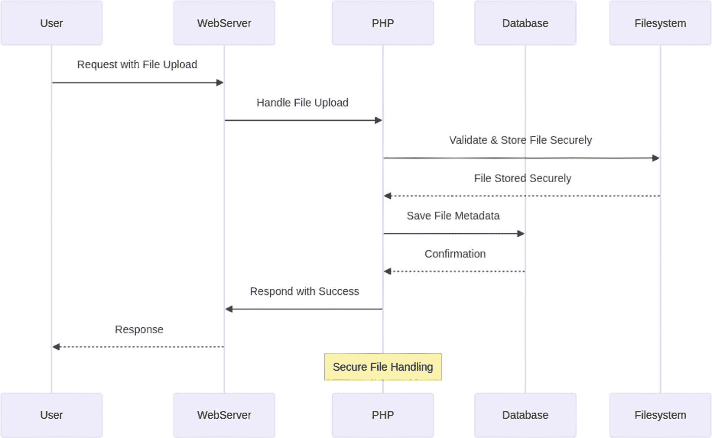

**图 2-8** 请求-响应周期，展示文件上传过程

如图 2-8 所示：

1.  用户发起一个包含文件上传的请求到 Web 服务器。
2.  Web 服务器将该请求转发给 PHP 脚本（PHP）进行文件处理。
3.  PHP 执行安全文件处理，验证文件并将其安全地存储到文件系统。此过程应包括对文件类型、大小的检查，并确保文件不可执行。
4.  文件处理成功后，文件系统确认文件已安全存储。
5.  PHP 将文件的元数据（如文件名、位置和所有者信息）保存到数据库。
6.  数据库返回确认信息。
7.  PHP 向 Web 服务器返回成功消息。
8.  Web 服务器向用户发送响应。

图中的“安全文件处理”部分被突出显示，代表了上传文件的安全处理与存储过程。

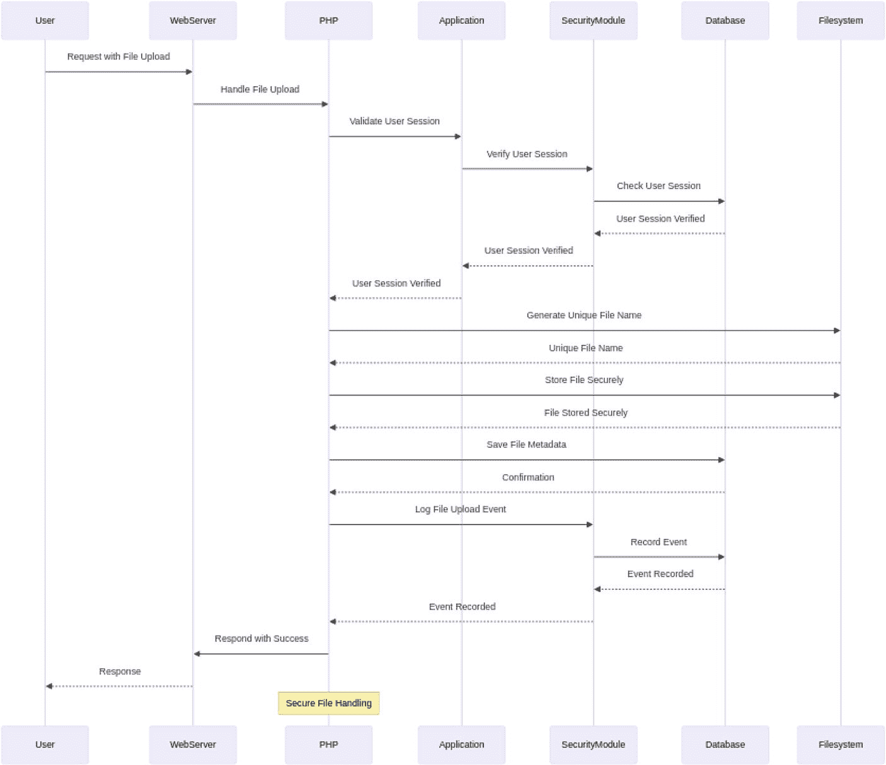

**图 2-9** 请求-响应周期，展示安全文件处理流程

如图 2-9 所示：

1.  用户发起一个包含文件上传的请求到 Web 服务器。
2.  Web 服务器将该请求转发给 PHP 脚本（PHP）进行文件处理。
3.  PHP 与应用层核对并验证用户的会话，确保用户已通过身份认证。
4.  应用层向安全模块验证用户的会话。
5.  安全模块查询数据库以确认用户的会话状态。
6.  会话验证通过后，流程继续。
7.  PHP 生成唯一的文件名，以防止覆盖现有文件。
8.  文件系统确认唯一文件名。
9.  PHP 将文件安全地存储到文件系统，包括对文件类型的检查以及防止恶意文件的安全措施。
10. 数据库存储上传文件的元数据。
11. PHP 将文件上传事件记录到安全模块。
12. 安全模块将事件记录到数据库，用于审计目的。
13. 响应通过 Web 服务器返回给用户。

图中的“安全文件处理”部分被突出显示，强调了安全检查、会话验证以及上传文件的安全存储。

以下提供了一些最佳实践和代码示例，用以演示如何在 PHP 中实现安全的文件处理与上传。

### 限制文件类型

仅允许上传特定类型的文件，并拒绝其他类型。你可以使用 `$_FILES` 数组来检查文件类型。

```php
$allowedExtensions = ['jpg', 'jpeg', 'png', 'pdf'];
$uploadedExtension = pathinfo($_FILES['file']['name'], PATHINFO_EXTENSION);
if (!in_array($uploadedExtension, $allowedExtensions)) {
    die("无效的文件类型。");
}
```

### 重命名上传文件

将上传的文件重命名为一个唯一名称。这可以防止覆盖现有文件，并有助于避免与可预测文件名相关的安全问题。

```php
$filename = uniqid() . '_' . $_FILES['file']['name'];
move_uploaded_file($_FILES['file']['tmp_name'], 'uploads/' . $filename);
```

### 使用安全目录

将上传的文件存储在 Web 根目录之外的目录中，以防止直接访问。明确指定文件路径。

```php
$uploadDirectory = '/var/www/myapp/uploads/';
move_uploaded_file($_FILES['file']['tmp_name'], $uploadDirectory . $filename);
```

### 设置恰当的权限

确保上传目录拥有适当的权限。它应对服务器可写，但不可执行。将目录权限限制在所需的最小范围内。

```shell
chmod 755 /var/www/myapp/uploads/
```

### 验证文件大小

限制可上传的最大文件大小，以防止服务器过载和拒绝服务攻击。

```php
$maxFileSize = 10 * 1024 * 1024; // 10MB
if ($_FILES['file']['size'] > $maxFileSize) {
    die("文件过大。");
}
```

### 使用随机化上传路径

为上传的文件创建随机化的目录结构，以防止可预测的路径。可以使用类似 `uniqid()` 的函数来实现。

```php
$randomPath = uniqid();
$uploadDirectory = '/var/www/myapp/uploads/' . $randomPath . '/';
mkdir($uploadDirectory);
move_uploaded_file($_FILES['file']['tmp_name'], $uploadDirectory . $filename);
```

### 防止双重扩展名

某些文件系统可能允许文件拥有双重扩展名（例如 `.php.jpg`）。为防止此问题，你可以检查并移除双重扩展名：

```php
$filename = preg_replace("/\.[.]+/", ".", $filename);
```

### 验证和清理文件名

验证并清理文件名，以移除潜在的危险字符。你可以使用 `preg_replace()` 来实现。

```php
$filename = preg_replace("/[^\w\-.]/", '', $_FILES['file']['name']);
```

### 定期清理上传目录

建立一个例行程序，清理上传目录中不再需要的文件。旧的、无用的文件可能带来安全风险。

### 实施身份验证与授权系统

确保只有授权用户才能上传文件，并根据用户角色和权限限制对文件上传部分的访问。

通过遵循这些实践来确保 PHP 中文件处理与上传的安全，我们可以显著降低安全漏洞的风险，例如文件包含攻击、任意代码执行以及对服务器的未授权访问。

## 保障 PHP 中的数据库操作安全

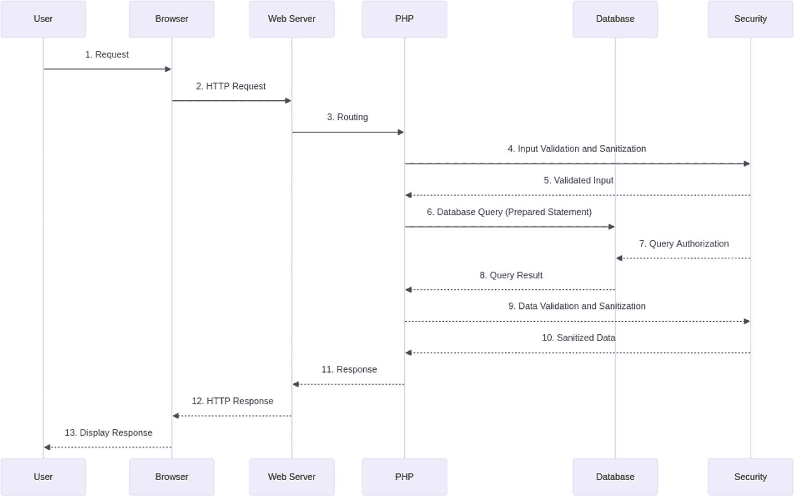

**图 2-10** 请求-响应周期，展示安全数据库访问

如图 2-10 所示：

1.  用户发起一个请求。
2.  浏览器向 Web 服务器发送一个 HTTP 请求。
3.  Web 服务器将请求路由到 PHP 应用程序。
4.  PHP 借助安全层执行输入验证和清理。
5.  验证后的输入被传递给 PHP 应用程序。
6.  PHP 使用预处理语句执行安全的数据库查询。
7.  安全层授权该数据库查询。
8.  数据库执行查询并将结果返回给 PHP。
9.  PHP 验证并清理从数据库接收到的数据。
10. 清理后的数据被传递给 Web 服务器。
11. PHP 生成响应并发送给 Web 服务器。
12. Web 服务器向浏览器发送 HTTP 响应。
13. 浏览器向用户显示响应。

“数据库安全”方面体现在步骤 6 和 7 中：执行安全的数据库查询，以及安全层授权该查询以确保仅执行授权操作。这些步骤突显了在典型 PHP 请求-响应周期中采取的数据库安全措施。

保障 PHP 中的数据库操作安全涉及多种最佳实践和技术，用以防范常见漏洞，如 SQL 注入和未授权访问。下面我们将讨论一些关键实践及代码示例，以保障 PHP 中的数据库操作安全。

### 使用预处理语句（参数化查询）

使用预处理语句来防止 SQL 注入。

```php
$pdo = new PDO('mysql:host=localhost;dbname=mydb', 'username', 'password');
$stmt = $pdo->prepare("SELECT * FROM users WHERE username = :username");
$stmt->bindParam(':username', $_POST['username']);
$stmt->execute();
```


### 输入验证与数据清洗

对用户输入进行验证和清洗。以下是一个使用 `filter_var` 的示例：

```php
$user_email = filter_var($_POST['email'], FILTER_VALIDATE_EMAIL);
if ($user_email === false) {
// 无效的电子邮件地址
} else {
// 使用已验证的电子邮件继续处理
}
```

### 身份认证与授权

在执行数据库操作之前，实现用户身份认证与授权检查，如前所述。

### 限制数据库权限

例如，创建 MySQL 用户时，仅授予必要权限。避免授予 `SUPER` 权限：

```sql
GRANT SELECT, INSERT, UPDATE, DELETE ON mydb.* TO 'username'@'localhost';
```

### 保护数据库凭据

将数据库凭据安全地存储在配置文件中，并使用 PHP 常量和环境变量来引用它们：

```php
define('DB_HOST', 'localhost');
define('DB_NAME', 'mydb');
define('DB_USER', 'username');
define('DB_PASS', 'password');
```

### 验证查询参数的用户输入

对查询参数的用户输入进行验证和清洗，以防止意外行为：

```php
$user_input = $_POST['user_input'];
if (strlen($user_input) > 100) {
$user_input = substr($user_input, 0, 100); // 限制输入长度
}
$user_input = htmlspecialchars($user_input, ENT_QUOTES, 'UTF-8'); // 清洗 HTML 输出
```

### 定期更新与修补

保持数据库软件和 PHP 的最新状态，以获取安全补丁和改进。

### 错误处理

使用自定义错误处理来防止敏感信息泄露。使用 `try-catch` 块的示例：

```php
try {
$pdo = new PDO('mysql:host=localhost;dbname=mydb', 'username', 'password');
// 在此执行数据库操作
} catch (PDOException $e) {
// 处理数据库错误
}
```

#### 日志记录与监控

实施日志记录与监控，用于检测和响应可疑活动。

### 保护环境安全

确保你的 Web 服务器、数据库服务器和网络都经过安全配置。防范常见漏洞，如 XSS 和 CSRF。

### 数据加密

使用 TLS/SSL 加密传输中的数据，并考虑对静态数据进行加密。

对于静态数据加密，例如，你可以使用 MySQL 的内置加密函数（如 `AES_ENCRYPT` 和 `AES_DECRYPT`）在将敏感数据存储到数据库之前进行加密。以下是一个插入和查询加密数据的示例：

```sql
-- 插入加密数据
INSERT INTO users (username, password) VALUES ('john', AES_ENCRYPT('secretpassword', 'encryption_key'));
-- 查询并解密数据
SELECT username, AES_DECRYPT(password, 'encryption_key') AS decrypted_password FROM users WHERE username = 'john';
```

## 总结

在本章中，我们深入探讨了 PHP 核心安全的关键方面，强调了加固 PHP 应用程序以防范潜在威胁所需的各种措施。从选择正确 PHP 版本的重要性入手，我们强调了如何通过保持最新版本发布来减轻漏洞风险。随后，我们探讨了安全的 PHP 配置实践，为建立稳固的安全基础提供了保障。

我们强调了输入验证与数据清洗技术的重要性，确保所有进入应用程序的数据都经过严格检查和清理。还讨论了安全处理会话和 Cookie，强调了正确管理以防止会话劫持及其他相关攻击的必要性。

我们涵盖了安全的文件处理和上传，提供了保护系统免受恶意文件和未授权访问的策略。最后，我们讨论了在 PHP 中保护数据库操作的安全性，概述了防范 SQL 注入及其他数据库相关漏洞的最佳实践。

通过实施本章讨论的指导和技术，你可以显著增强 PHP 应用程序的安全态势，确保其免受各种安全威胁的侵害。

