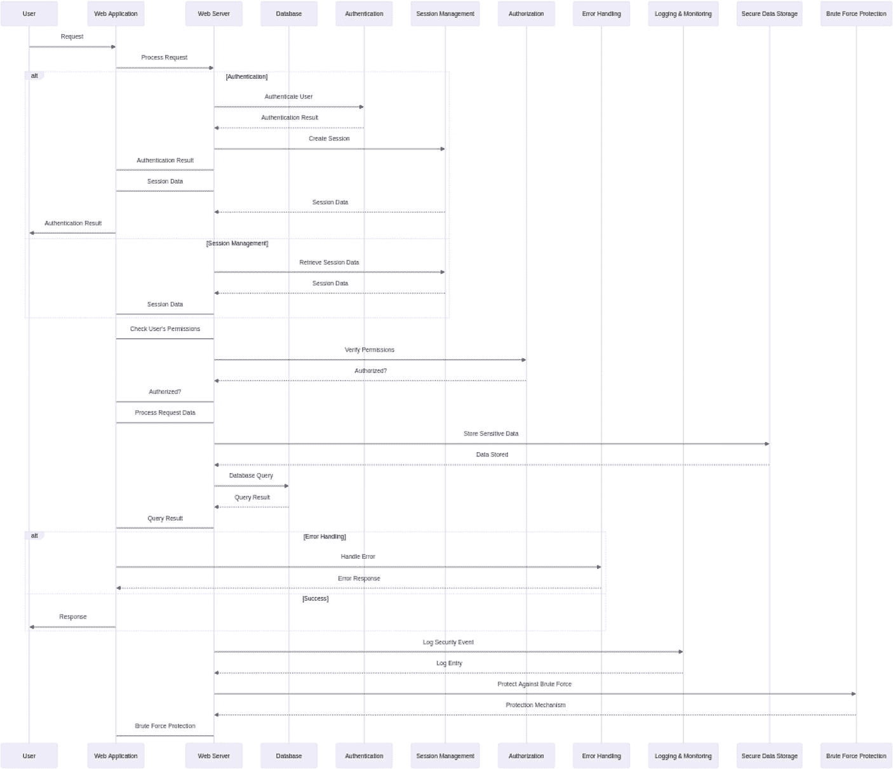
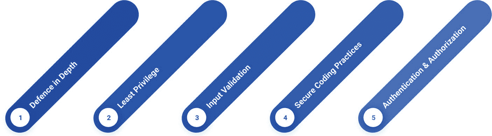
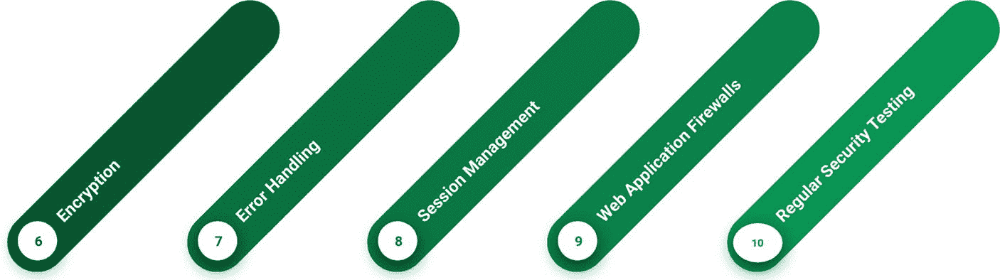
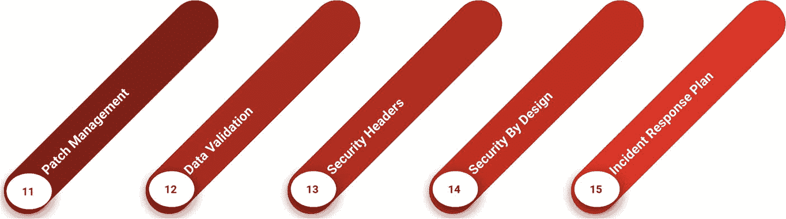
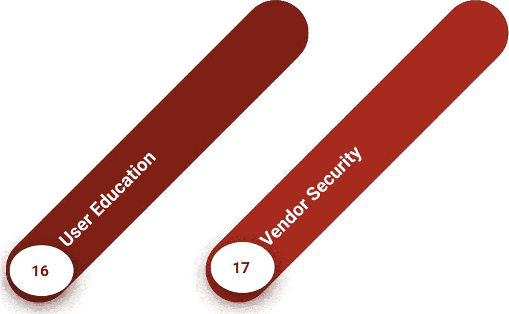
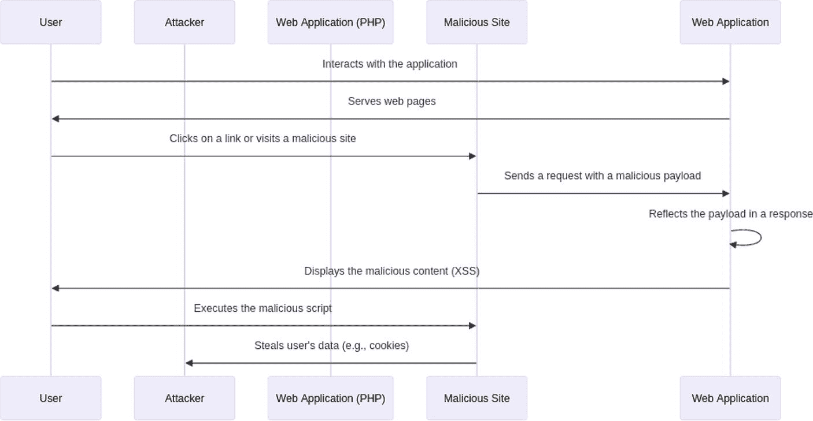
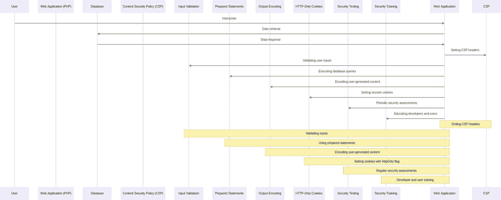
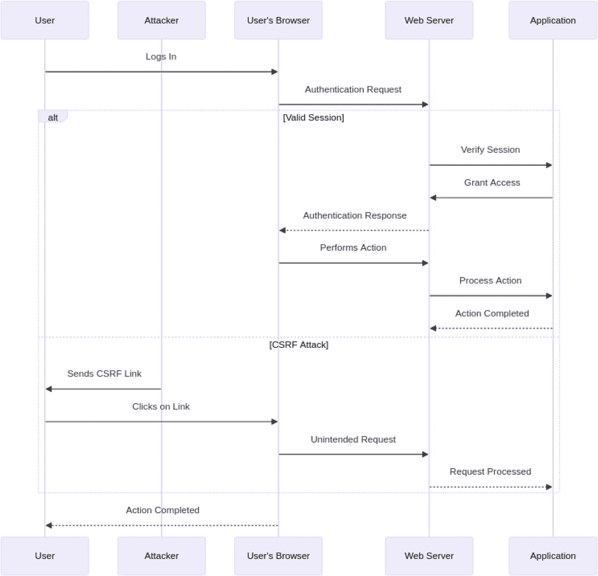

# 3. PHP 应用程序的 Web 安全

Web 安全已不再是 PHP 应用程序开发中事后才考虑的问题——它是一项基本要求。随着攻击者手段日益高明，Web 应用程序漏洞可能使最安全的网站暴露于恶意活动之下，如数据盗窃、未授权访问和声誉损害。在本章中，我们将深入探讨 Web 应用程序安全的关键原则，并研究它们如何具体应用于 PHP 应用程序。我们将考察三个关键关注领域：跨站脚本攻击（XSS）、SQL 注入和跨站请求伪造（CSRF）攻击——这些常见漏洞若不加处理，可能造成毁灭性后果。通过理解这些 Web 安全的基本方面，开发者可以采取主动措施来保护应用程序、保护用户数据，并维持强大的在线存在。

## Web 应用程序安全原则



Web 应用程序安全是现代 Web 开发的一个关键方面。遵循 Web 应用程序安全原则有助于保护你的应用程序及其用户免受各种威胁和漏洞的侵害。让我们讨论 Web 应用程序安全的关键原则。



### 深度防御

`深度防御`是一种安全策略，涉及部署多层安全机制和控制措施，以保护组织的信息系统和数据。`深度防御`的主要目标是提供一系列屏障或防护措施，这样即使某一层被突破，还有额外的安全层来阻止攻击者。这种方法旨在通过降低成功攻击的可能性并最小化潜在影响，来增强整体安全态势。

#### 实施多层安全机制

**网络安全**

`网络安全`涉及保护组织网络的基础设施。这可以包括充当屏障以阻止未授权访问的`防火墙`，以及监控网络流量以发现可疑活动的`入侵检测系统 (IDS)`。

示例：想象我们的组织就像一座城堡。城堡有一堵高墙（`防火墙`）来阻挡入侵者。卫兵（`入侵检测系统`）在城墙上巡逻，寻找任何试图潜入的人。

**服务器安全**

`服务器安全`涉及保护托管组织应用程序和数据的物理及虚拟服务器。这可以包括确保服务器定期更新和打补丁、使用强身份验证方法以及监控异常活动。

示例：在城堡内部，有一些存放重要宝藏（`数据`）的保险房间（`服务器`）。这些房间有坚固的锁（`身份验证方法`），并且我们确保锁始终处于良好状态（`更新和补丁`）。城堡内的卫兵（`监控系统`）也会留意任何试图破坏锁的人。

**应用安全**

`应用安全`涉及保护用户交互的软件应用程序。这可以包括输入验证、安全编码实践以及定期进行安全测试以发现漏洞。

示例：在保险房间内，有存放宝藏的特殊箱子（`应用程序`）。这些箱子有复杂的锁（`安全编码实践`），并且我们确保只有正确的钥匙（`输入验证`）才能打开。我们定期检查箱子，以确保它们没有隐藏的缺陷（`安全测试`）。

**使用防火墙、IDS 和安全策略**

`防火墙`充当屏障以防止未授权访问网络，`入侵检测系统 (IDS)` 监控网络流量并向管理员发出可疑活动警报，而`安全策略`则定义了组织如何管理和保护其信息的规则和程序。

让我们把组织想象成一个大型游乐场。

- `网络安全`——我们在游乐场周围竖起了一道大围栏（`防火墙`）以阻挡陌生人。我们有警惕的守卫（`IDS`）巡逻围栏，确保没人试图翻越。

- `服务器安全`——在游乐场内，我们有存放最爱玩具（`数据`）的特制上锁箱子（`服务器`）。我们确保锁很坚固且始终状态良好（`更新和补丁`）。游乐场内还有更多守卫（`监控系统`）看管这些箱子，确保没人试图撬锁。

- `应用安全`——每个玩具箱（`应用程序`）都有一个独特的锁（`安全编码实践`），只有正确的钥匙（`输入验证`）才能打开。我们定期检查这些玩具箱，确保没有裂缝或薄弱点（`安全测试`）。

### 最小权限

最小权限原则 (PoLP) 是一种安全概念，建议向个人、进程或系统仅授予执行其任务所需的最小访问和权限级别。其目标是在发生安全漏洞或意外事故时限制潜在损害。在 PHP 和 Web 应用开发中，实施最小权限原则涉及根据用户或进程的具体需求来限制对资源和功能的访问。

#### 实施最小权限原则

**确保最小必要权限：** 我们应确保用户、进程和组件只拥有执行其任务绝对所需的权限。这意味着不要给予超出必要的访问权限。例如，想象我们有一个图书馆。并非每个人都需要进入每一个房间。如果有人只是来阅读，他们只需要进入阅读区，而不是员工室或档案室。

想象一家大型玩具店。收银员只需要使用收银机，而不是储物间或经理办公室。这样，如果收银员犯错，也不会影响商店的其他部分。

在 PHP 中，我们通过在应用程序代码和数据库中仔细设置用户角色和权限，来确保用户和进程只拥有必要的权限。

示例：

```php
<?php
// 为用户角色设置权限
$userRole = 'reader'; // 这可以根据登录用户动态设置
// 在执行操作前检查用户是否拥有所需权限
if ($userRole == 'reader') {
    // 允许访问阅读区
} else {
    // 拒绝访问
}
```

**实施基于角色的访问控制 (RBAC)：** `基于角色的访问控制 (RBAC)` 是一种根据组织内的角色来分配访问权限的方法。每个角色都有一套定义的权限，而用户则根据其工作职责被分配角色。

示例 1：在我们的图书馆里，有不同的角色，如`图书管理员`、`读者`和`清洁工`。每个角色都有特定的访问权限：`图书管理员`可以访问所有房间，包括员工室和档案室。`读者`可以访问阅读区和公共目录。`清洁工`可以访问清洁用品和维修区域。

示例 2：在我们的玩具店里，有不同的角色。`收银员`只能使用收银机。`理货员`只能进入储物间。`经理`可以进入商店的任何地方。通过只给每个角色他们所需的权限，我们保持一切井井有条且安全。

在 PHP 中实现 RBAC 涉及定义角色及其权限，然后将这些角色分配给用户。

示例：

```php
<?php
// 定义角色及其权限
$roles = [
    'librarian' => ['access_all'],
    'reader' => ['access_reading_area'],
    'janitor' => ['access_maintenance']
];
// 为用户分配角色
$userRole = 'reader'; // 这可以从数据库中根据登录用户获取
// 检查用户是否拥有执行操作的权限
if (in_array('access_reading_area', $roles[$userRole])) {
    // 允许访问
} else {
    // 拒绝访问
}
```

通过实施最小权限原则，我们可以显著降低未授权访问的风险，并限制安全漏洞可能造成的潜在损害。这种方法有助于确保每个用户或进程仅能访问其所需资源，从而增强我们应用程序的整体安全性。

### 输入验证

我们之前曾提及输入验证的概念，在此将进行简要重申。输入验证对于维护 Web 应用程序的安全性和完整性至关重要。通过验证和清理用户输入，我们可以防止注入攻击和其他恶意活动。

`验证并清理用户输入以防止注入攻击`：验证和清理用户输入可确保只有格式正确的数据才能进入我们的应用程序。这有助于防止各种类型的注入攻击，例如 SQL 注入和跨站脚本（XSS）。例如，想象我们在烘焙饼干。我们需要确保所有原料都是正确的种类并且没有变质。在 PHP 中使用过滤函数，就像是混合之前检查糖是真正的糖而不是盐一样。

`使用 PHP 过滤器函数进行输入验证`：在 PHP 中，我们有内置的过滤函数，可以帮助我们高效地验证和清理用户输入。例如，我们可以使用 `filter_var()` 来验证电子邮件地址。将我们的 Web 应用程序想象成一场精致的茶会。我们希望确保每位入场者都穿着得体（有效输入）。例如，如果有人应该带水果（电子邮件地址），我们会检查它是否是真正的水果而不是石头。如果他们带花（文本），我们会确保没有可能伤害任何人的刺（有害字符）。

```php
$userInput = $_POST['input_field'];
if (filter_var($userInput, FILTER_VALIDATE_EMAIL)) {
// 有效的电子邮件地址
} else {
// 无效的电子邮件地址
}
```

### 安全编码实践

安全编码实践涉及在软件开发过程中遵循优先考虑安全性的指南和技术。这些实践旨在将漏洞风险降至最低，并保护应用程序免受各种安全威胁。遵循安全编码实践可确保我们开发的软件能够抵御攻击和漏洞。通过从一开始就注意安全性，我们可以降低应用程序被攻破的可能性。想象一下在海滩上建造沙堡。我们需要把它建造得坚固耐用，这样它才不会被海浪冲走。安全编码实践就像使用坚固可靠的材料来建造我们的沙堡，确保它能抵御任何威胁。

`遵循安全编码实践`：我们应避免使用已知不安全的函数，并始终验证用户输入，以防止恶意数据进入我们的系统。

`避免不安全的函数并始终验证输入`：避免使用已知不安全的函数，例如使用`md5()`进行密码哈希。相反，应使用更安全的替代方案，如`password_hash()`。想象我们有一个存放宝藏（密码）的盒子。我们不只是把它们放进盒子里，而是用一张只有我们能拆开的特殊纸张（哈希）将它们包裹起来。这确保了即使有人找到了盒子，他们也看不到我们的宝藏。

```
$password = $_POST['password'];
$hashedPassword = password_hash($password, PASSWORD_BCRYPT);
```

### 身份验证与授权

**身份验证**是验证试图访问资源的用户、系统或实体身份的过程。它回答了“你是谁？”这个问题。身份验证机制包括用户名和密码、生物识别（指纹、面部识别）、智能卡、令牌以及多因素身份验证（MFA）。身份验证的主要目标是确保只有合法且经授权的用户或实体才能访问系统或资源。**授权**是确定经过身份验证的用户或实体被允许执行哪些操作或访问哪些资源的过程。它回答了“你被允许做什么？”这个问题。

授权规则定义了与用户角色或身份相关联的特定权限和限制。这些规则规定了用户能否对数据或资源执行读取、写入、删除或其他操作。授权与访问控制密切相关，因为它强制限制了谁可以访问系统或数据的哪些部分。

在 PHP 中，你可以通过遵循某些最佳实践并利用 PHP 的内置功能或库来实现身份验证和授权。以下是关于如何实现身份验证和授权的高级概述。

#### 身份验证

身份验证涉及验证用户或实体的身份。你可以使用多种方法在 PHP 中实现身份验证。

### 用户名和密码

最常见的方法是使用用户名和密码进行用户身份验证。

以下是在 PHP 中实现用户名和密码身份验证的示例：

```
// 用户提交包含用户名和密码的登录表单
$username = $_POST['username'];
$password = $_POST['password'];
// 验证凭据（通常存储在数据库中）
if (verifyCredentials($username, $password)) {
    // 身份验证成功
    // 创建一个会话来保持用户登录状态
    session_start();
    $_SESSION['user'] = $username;
} else {
    // 身份验证失败
    // 显示错误消息
}
```

### 多因素身份验证 (MFA)

实施 MFA 通过要求用户提供额外的身份验证因素（例如发送到其移动设备的一次性代码）来增强安全性。可以使用像`PHPGangsta/GoogleAuthenticator`这样的 PHP 库来实现 MFA。

### 授权

授权涉及确定经过身份验证的用户被允许执行哪些操作或访问哪些资源。你可以通过定义用户角色和权限来实现授权。

#### 基于角色的访问控制 (RBAC)

实现授权的一种有效方法是通过基于角色的访问控制（RBAC）。RBAC 涉及创建不同的用户角色，例如管理员、编辑和访客，并为这些角色分配特定的权限。通过定义角色，我们可以简化管理用户权限的过程，并确保整个应用程序的一致性。

例如，管理员角色可能拥有创建、读取、更新和删除资源的权限，而编辑角色可能只有创建和读取资源的权限。访客角色可能仅限于只读访问。当用户尝试访问资源或执行操作时，应用程序会检查用户的角色并验证他们是否拥有所需的权限。

实施 RBAC 不仅简化了权限管理，而且通过确保用户无法访问或修改其授权之外的资源来增强安全性。这种方法最大限度地降低了未经授权操作的风险，并有助于维护应用程序数据的完整性和机密性。

```
function canEditContent($userRole) {
    // 定义权限
    $permissions = [
        'admin' => ['edit', 'delete'],
        'editor' => ['edit'],
        'guest' => []
    ];
    // 检查用户角色是否拥有 'edit' 权限
    return in_array('edit', $permissions[$userRole]);
}
$userRole = getUserRole(); // 获取用户角色
if (canEditContent($userRole)) {
    // 用户被授权编辑内容
} else {
    // 授权被拒绝
}
```

#### 基于数据库的授权机制

为了增强 RBAC，我们可以实施基于数据库的授权机制。在这种方法中，用户角色和权限存储在数据库中，从而能够根据用户的角色以及所请求的操作或资源，动态检索和验证权限。例如，一个`admin`角色可能拥有创建、读取、更新和删除资源的权限，而一个`editor`角色可能仅拥有创建和读取资源的权限。`guest`角色则可能仅限于只读访问。当用户尝试访问资源或执行操作时，应用程序会查询数据库以检查用户的角色，并验证其是否拥有所需的权限。

这种方法提供了灵活性和可扩展性，因为管理员无需修改应用程序代码即可轻松更新角色和权限。它还确保权限检查在应用程序中一致应用，降低了未授权访问的风险。实施基于数据库的 RBAC 不仅简化了权限管理，还通过确保用户无法访问或修改其授权范围之外的资源来增强安全性。这种方法最大限度地降低了未授权操作的风险，并有助于维护应用程序数据的完整性和机密性。

#### 安全的会话管理

安全的会话管理是 Web 应用程序安全的一个关键组成部分，它涉及维护用户会话并安全地存储用户角色。通过妥善管理会话，我们可以确保用户身份和权限在整个与应用程序的交互过程中得到安全处理。安全的会话管理包括为已认证用户创建和维护会话，并确保用户角色和权限被安全地存储。这有助于保护用户数据并维护应用程序的完整性。

例如，想象我们的 Web 应用程序是一个安全的图书馆。当用户（访客）登录时，他们会收到一张特殊的卡片（会话），这张卡片告诉图书馆工作人员他们是谁以及他们可以访问哪些区域（用户角色）。图书馆将所有卡片的记录保存在一个安全的数据库中。每次用户试图进入图书馆的某个区域时，工作人员都会检查卡片（会话），以验证该卡片是否允许他们进入该区域。如果访客没有卡片，或者试图进入一个他们不被允许进入的区域，他们会被引导回入口处（登录页面）进行身份验证。

下面是一个简单的 PHP 示例，通过启动会话、检查用户是否已认证以及检索其角色，来演示安全的会话管理：

```php
session_start();
if (isset($_SESSION['user'])) {
    $userRole = getUserRole($_SESSION['user']);
} else {
    // 如果未认证，则重定向到登录页面
}
```

#### 自定义中间件或访问控制列表（ACL）

除了安全的会话管理之外，实施自定义中间件或访问控制列表（ACL）对于在 Web 应用程序中强制实施授权规则也至关重要。这些技术对于管理复杂的授权逻辑以及确保用户只能访问其被允许的资源特别有用。

中间件是位于 HTTP 请求和应用程序逻辑之间的一层，允许您在请求到达应用程序之前对其进行拦截和处理。通过创建自定义中间件，您可以在整个应用程序中一致地强制实施授权规则。可以把中间件想象成建筑物中不同房间门口的保安。保安会检查您是否拥有进入房间的正确钥匙（权限）。如果您没有钥匙，保安会将您重定向到另一个房间（登录页面）。

ACL 用于定义哪些用户或用户组可以访问应用程序中的特定资源。ACL 本质上是一个表格，它将用户或角色与其对各种资源的权限映射起来。把 ACL 想象成一张显示哪些孩子可以玩哪些玩具的图表。例如，图表上显示只有大孩子（管理员）可以使用剪刀（删除文档），而每个人都可以使用蜡笔（读取文档）。

##### 示例

假设您有一个包含不同资源（如文档、项目和设置）的应用程序。一个 ACL 会指定哪些用户可以读取、写入或删除每个资源。

```php
// 定义 ACL
$acl = [
    'admin' => [
        'documents' => ['read', 'write', 'delete'],
        'projects' => ['read', 'write', 'delete'],
        'settings' => ['read', 'write'],
    ],
    'editor' => [
        'documents' => ['read', 'write'],
        'projects' => ['read', 'write'],
    ],
    'guest' => [
        'documents' => ['read'],
        'projects' => ['read'],
    ],
];
// 检查用户是否有权限执行某操作
function hasPermission($role, $resource, $action)
{
    global $acl;
    return in_array($action, $acl[$role][$resource]);
}
// 使用示例
$role = 'editor';
$resource = 'documents';
$action = 'write';
if (hasPermission($role, $resource, $action)) {
    // 执行操作
} else {
    // 拒绝访问
}
```



*图 3-3：Web 应用程序安全原则*

## 加密

加密是使用算法和密钥将纯文本数据转换为一种混乱的、不可读的格式（密文）的过程。加密的主要目的是保护敏感信息的机密性和隐私性。

它在安全性方面发挥着至关重要的作用，原因如下：

1.  **机密性**：加密确保只有授权方才能访问和读取数据。即使攻击者获得了对加密数据的访问权限，如果没有解密密钥，他们也看不懂这些数据。

2.  **数据保护**：它保护敏感数据（如个人信息、财务记录、商业秘密和知识产权）免受未经授权的访问和窃取。

3.  **隐私**：加密对于保护个人和组织的隐私至关重要。它可以防止对通信渠道（包括在线和离线）的窃听和未经授权的监控。

4.  **合规性**：许多数据保护法规，如《通用数据保护条例》（GDPR）和《健康保险携带和责任法案》（HIPAA），都强制要求使用加密来保护个人和敏感数据。遵守这些法规对于法律和道德原因至关重要。

5.  **数据完整性**：虽然加密的主要目标是机密性，但它也可用于验证数据的完整性。通过将加密数据与哈希值或数字签名进行比较，可以检测数据在传输过程中是否被篡改。

6.  **安全通信**：加密对于互联网上的安全通信至关重要，因为它可以保护通过网络传输的数据免遭拦截和窃听。诸如 SSL/TLS 之类的技术可以对 Web 浏览器和服务器之间的数据进行加密，确保在线交易的安全，并保护在线活动中的敏感信息。

7.  **保护密码**：以经过加盐哈希的格式存储密码是一种加密形式。对密码进行哈希处理使得攻击者难以进行逆向工程并恢复原始密码。

8.  **安全文件存储**：加密静态文件和可确保即使获得了对存储设备的物理访问权限，数据也仍受到保护。全盘加密通常用于保护笔记本电脑和移动设备上的数据。

9.  **安全电子商务**：加密对于电子商务中保护在线交易（包括信用卡支付）至关重要。没有加密，敏感的支付数据可能会被拦截和滥用。

10. **减轻内部威胁**：加密有助于保护数据免受内部威胁，例如有权访问敏感信息的员工或承包商。即使他们能够访问数据，如果没有适当的授权和解密密钥，也无法读取数据。

### 通过 TLS/SSL 加密传输和存储中的敏感数据

加密是数据安全的关键组成部分，确保敏感信息在传输（传输中）和存储（存储时）都得到保护。以下是使用 TLS/SSL 保护传输中的数据以及使用 PHP 的`openssl`函数保护存储数据的一些关键实践和示例。

为了保护数据在网络中传输，请使用传输层安全性（TLS）或安全套接字层（SSL）。这些协议在数据发送前对其进行加密，防止窃听者截获敏感信息。想象一下，你通过邮递员给朋友发送一封秘密信件。使用 TLS/SSL 就像在把信交给邮递员之前，把它放进一个上锁的盒子里，这样就没有人能中途读取它。

**示例：**

- **使用 HTTPS：** 确保你的网络服务器配置为使用 HTTPS，它利用 TLS/SSL 加密客户端和服务器之间的数据。

- **配置网络服务器：** 在网络服务器（例如 Apache，Nginx）上安装 SSL 证书。更新服务器配置以强制使用 HTTPS 连接。

### 使用 PHP 的`openssl`函数加密数据

为了保护存储在服务器上的数据，请使用 PHP 的`openssl`函数提供的加密算法。这确保了即使有人未经授权访问了你的存储，没有正确的解密密钥，数据仍然是不可读的。你可以把加密后的数据想象成一个用超级坚固挂锁（加密）锁上的玩具箱（数据）。IV 就像你在每个箱子上贴的独特贴纸，确保每个箱子都不同，即使它们装着同样的玩具。

```php
$encryptedData = openssl_encrypt($data, 'AES-256-CBC', $encryptionKey, 0, $iv);
```

**参数详解**

- **数据（`$data`）：** 这是你想要加密的明文数据。它可以是任何需要保密的字符串。

- **加密方法（`'AES-256-CBC'`）：** 这指定了要使用的加密方法。`'AES-256-CBC'`意味着该函数将使用 AES（高级加密标准）算法，采用 256 位密钥和 CBC（密码块链接）模式。这是一种常用于保护敏感数据的强加密方法。

- **加密密钥（`$encryptionKey`）：** 这是用于加密的密钥。它必须保密，因为任何拥有此密钥的人都可以解密数据。密钥长度必须匹配加密方法的要求（例如，AES-256 需要 256 位）。

- **选项（`0`）：** 此参数可用于指定加密过程的其他选项。`0`意味着没有设置特殊选项。通常，你使用`0`或`OPENSSL_RAW_DATA`来获取加密数据的原始二进制输出。

- **初始化向量（`$iv`）：** 初始化向量（IV）是一个随机值，用于确保用相同密钥加密的相同明文会产生不同的密文。IV 的长度应与加密方法的块大小相匹配（例如，AES-256-CBC 需要 16 字节）。

### 错误处理

错误处理是管理并响应软件应用中错误、异常和意外情况的做法。有效的错误处理对于应用程序的安全性和整体可靠性至关重要。它包含检测、报告和管理错误的各种实践和机制，确保应用程序保持健壮和安全。

- **避免向用户显示详细的错误信息：** 错误处理的一个重要方面是避免向用户显示详细的错误信息。详细的错误信息可能泄露应用程序内部工作的敏感信息，例如数据库结构、服务器配置或文件路径。攻击者可以利用这些信息来发现漏洞并发起攻击。相反，应向用户显示通用的错误信息，告知他们出了点问题，但不要透露技术细节。

- **实现自定义错误处理和日志记录：** 实现自定义错误处理和日志记录是有效错误管理的另一个关键组成部分。自定义错误处理器可以捕获异常和错误，使应用程序能够优雅地处理它们。这可以包括将用户重定向到自定义错误页面、记录错误以供进一步调查，以及通知管理员关键问题。

```php
error_reporting(0); // 禁用错误报告
```

### 会话管理

会话管理是 Web 应用程序开发的一个关键方面，涉及创建、维护和处理用户会话。会话是用户与 Web 应用程序之间的临时交互。在会话期间，应用程序可以识别并记住用户的身份和状态，从而提供个性化和连续的用户体验。会话管理对于用户身份验证、授权以及跨多个请求保存用户数据非常重要。然而，如果实现不当，它可能会带来安全风险。

- **实施安全的会话管理实践：** 为了确保会话管理的安全性和可靠性，必须遵循最佳实践。这包括使用安全的方法处理会话数据，保护会话 ID 不被截获或猜测，以及确保会话在不再需要时被正确终止。

- **使用 PHP 内置的`session_start()`和`$_SESSION`超级全局变量：** 在 PHP 中，会话管理可以通过使用内置的`session_start()`函数和`$_SESSION`超级全局变量轻松实现。以下是一个基本示例：

```php
session_start();
if (isset($_SESSION['user_id'])) {
// 用户已通过身份验证
}
```

### Web 应用防火墙（WAF）

Web 应用防火墙（WAF）是一种专门设计用于保护 Web 应用免受各种在线威胁、漏洞和攻击的安全解决方案。WAF 充当 Web 应用与潜在恶意用户之间的保护屏障，有助于过滤、监控和阻止可能构成安全风险的传入流量。实施 WAF 对于增强 Web 应用的安全性至关重要，确保它们能够抵御各种类型的网络威胁。

- **考虑使用 WAF 来过滤和阻止恶意流量：** 在考虑 Web 应用安全时，将 WAF 集成到你的安全策略中是必不可少的。WAF 会检查传入流量，并识别潜在的恶意活动，例如 SQL 注入、跨站脚本（XSS）和其他常见攻击向量。通过过滤和阻止恶意流量，WAF 有助于防止这些攻击到达你的 Web 应用。

- **与 PHP 应用集成的第三方 WAF：** 一个流行的第三方 WAF 是 ModSecurity，它可以与 PHP 应用程序集成，提供额外的安全层。ModSecurity 是一个开源 WAF，提供针对各种威胁的全面保护。它可以配置为监控 HTTP 流量、检测可疑模式，并采取诸如阻止或记录潜在有害请求等操作。

### 定期安全测试

定期安全测试是维护稳健的 Web 应用安全策略的重要组成部分。通过持续评估和测试应用程序的安全性，您可以在恶意行为者利用漏洞之前发现并加以解决。这种主动方法有助于确保 Web 应用的完整性、机密性和可用性。

执行安全测试涉及多种旨在识别和缓解应用程序安全弱点的活动。两种关键的安全测试类型是漏洞扫描和渗透测试。漏洞扫描使用自动化工具扫描您的 Web 应用以发现已知漏洞。这些扫描器能够快速识别常见的安全问题，例如软件过时、配置错误以及缺少安全补丁。另一方面，渗透测试（也称为道德黑客）模拟对应用程序的真实攻击，以识别可能被攻击者利用的漏洞。渗透测试人员结合使用自动化工具和手动技术来查找漏洞扫描器可能检测不到的安全缺陷。

为了有效执行这些测试，您可以利用诸如`OWASP ZAP`和`Nessus`之类的安全测试工具。`OWASP ZAP`（Zed 攻击代理）是一款开源 Web 应用安全扫描器，通过模拟各种攻击向量来帮助您发现安全漏洞。它可用于自动化和手动安全测试，提供爬取、扫描和模糊测试等功能。例如，您可以首先下载并安装`OWASP ZAP`，配置它以拦截并分析浏览器与 Web 应用之间的流量，然后使用其爬取功能来抓取您的应用程序并识别所有可访问的页面。运行自动化扫描器将检查常见漏洞，而查看扫描结果将帮助您解决任何已识别的安全问题。

`Nessus`是另一款广泛用于漏洞扫描的强大工具。它可以识别网络、系统和应用程序中的安全问题，提供详细的漏洞报告并建议修复步骤。要使用`Nessus`，您可以下载并安装它，通过指定目标 URL 或 IP 地址来配置其扫描您的 Web 应用，然后运行扫描以识别漏洞。查看详细的扫描报告将指导您根据结果采取纠正措施。

将您的 Web 应用想象成一座拥有许多房间和隐藏通道的城堡。定期安全测试就如同有一支检查员队伍，检查每一个房间和通道，确保没有隐藏的陷阱或坏人可能溜进来的薄弱点。漏洞扫描就像使用一张特殊地图来快速找到城堡墙壁上需要修补的已知弱点。渗透测试则像是雇佣友善的骑士试图攻入城堡，帮助您发现地图可能遗漏的弱点。



**图 3-4** Web 应用安全原理

### 补丁管理

补丁管理是构建 Web 应用和 IT 基础设施稳健安全策略的关键组成部分。它涉及识别、测试和安装软件更新、补丁及安全修复程序，以解决漏洞并使系统保持最新状态。确保所有软件组件都安装了最新的安全补丁，对于维护 Web 应用和 IT 环境的完整性与安全性至关重要。

保持所有软件组件通过安全补丁及时更新是一项基本实践。这不仅包括 Web 应用本身，还包括底层的服务器操作系统、Web 服务器软件、数据库系统以及应用程序所依赖的任何第三方库或框架。通过定期应用安全补丁，您可以保护系统免受攻击者可能利用的已知漏洞的侵害。

补丁管理中一个关键的关注领域是定期更新`PHP`及其库文件。`PHP`作为一种广泛使用的服务器端脚本语言，经常成为攻击者的目标。确保您的`PHP`安装始终包含最新的安全补丁，有助于降低安全漏洞的风险。此外，保持应用程序所使用的`PHP`库和扩展的更新同样重要。过时的库可能会引入危及应用程序安全的安全缺陷。

将补丁管理想象为维护一座堡垒。假设您的 Web 应用是一座需要抵御入侵者的城堡。城堡的防御工事包括它的城墙（软件组件）、守卫（安全补丁）和防御设施（库与框架）。需要定期维护以确保城墙坚固、守卫警惕、防御设施稳固。如果城堡的防御中发现了弱点，例如墙壁出现裂缝或守卫在睡觉，必须立即修复，以防止敌人利用这些漏洞攻破城堡。

### 数据验证

数据验证是 Web 应用安全和数据完整性中的一个关键方面。它涉及对数据的检查和验证，以确保数据满足特定标准、符合预期格式，并且不含恶意或意外内容。通过验证和清理来自外部来源和用户输入的数据，您可以预防各种安全漏洞，并确保应用程序能够可靠且安全地运行。

**验证和清理来自外部来源和用户输入的数据：** 验证和清理数据对于保护您的 Web 应用免受 SQL 注入、跨站脚本攻击（XSS）及其他注入攻击的威胁至关重要。当从外部来源（如用户输入、API 或第三方服务）接收数据时，应进行彻底检查，以确保其符合预期格式并且不包含有害内容。此过程包括验证（检查数据是否符合特定标准）和清理（移除或中和潜在的有害内容）。

例如，如果您的应用程序接受用户输入作为用户名，您将需要验证该用户名仅包含允许的字符（例如字母和数字）并且长度符合要求。清理可能涉及转义任何特殊字符以防止 XSS 攻击。

**使用诸如 Symfony 验证器组件之类的验证库：** 使用验证库可以简化数据验证的过程，并确保在整个应用程序中正确且一致地实施验证。其中一个库是 Symfony 的`Validator`组件，它提供了一种强大且灵活的方式来基于一组规则验证数据。

### 安全标头

`安全标头`是 Web 服务器用来增强 Web 应用程序安全性并保护其免受各种攻击的 HTTP 响应标头。它们是 Web 安全不可或缺的一部分，并在缓解常见安全风险方面发挥着关键作用。通过适当配置安全标头，您可以显著提升对 Web 应用程序的保护，以抵御跨站脚本攻击（`XSS`）、点击劫持及其他常见漏洞的威胁。

在您的 Web 服务器或应用程序中设置适当的安全标头，是保护 Web 应用程序安全的关键一步。这些标头会指示浏览器如何处理您网站的内容和交互，从而确保潜在的攻击途径被最小化。例如，标头可以规定您的应用程序只能通过`HTTPS`访问，禁止网站被嵌入到 iframe 中，并限制可以加载脚本的来源。

一个需要实施的重要安全标头是`内容安全策略`（`CSP`）。`CSP`通过指定允许加载哪些动态资源，有助于防止跨站脚本攻击（`XSS`）。通过定义一个`CSP`，您创建了一个受信任内容来源的白名单，从而有效阻止可能危害您应用程序的恶意脚本的执行。例如，一个`CSP`可以指定脚本只能从您自己的域名加载，并禁止内联脚本，从而降低`XSS`的风险。

```
header("Content-Security-Policy: default-src 'self'");
```

### 安全设计

`安全设计`是一种主动的方法，将安全考量整合到软件开发生命周期的每个阶段，从初始设计和架构到部署和维护。它强调将安全作为开发过程的内在组成部分，而不是事后的修补措施。这种方法确保了安全被嵌入到应用程序的基础之中，从而减少漏洞并增强整体稳健性。

从初始设计阶段就纳入安全考量至关重要。当您开始一个新项目时，从一开始就要考虑安全问题。这意味着要思考数据将如何被保护，用户身份验证和授权将如何管理，以及将采取哪些措施来防范像`SQL 注入`和跨站脚本攻击（`XSS`）这样的常见威胁。通过早期解决这些问题，您可以设计出支持强安全实践的架构，使得在整个开发过程中实施和维护安全措施变得更加容易。

在`安全设计`中，一种有效的实践是威胁建模。威胁建模涉及识别您的应用程序可能面临的潜在安全威胁，并制定策略来缓解这些威胁。这个过程有助于您理解应用程序可能在哪些方面存在弱点，并允许您采取措施保护这些区域。例如，您可以创建数据流图来可视化数据在系统中的流动方式，并识别出数据可能被拦截或篡改的点。然后，您可以实施诸如加密或访问控制之类的安全控制措施来保护这些点。

把`安全设计`想象成从一开始就考虑安全性的房屋建造。如果您要建造一栋房子，您不会等到建好之后才考虑安全问题。相反，您会规划安装安全的门窗，配备坚固的锁具系统，甚至可能在设计时集成一个安防系统。这样一来，房子从建成的那一刻起就是安全的，您也无需在后期进行昂贵或复杂的调整。

使用威胁建模来识别和缓解潜在风险，就像为您的房子规划可能的安全场景。您可能会考虑某人会如何试图闯入，是通过门、窗户，还是通过破解您的安防系统。通过预判这些威胁，您可以采取主动措施来防范它们，例如安装防碎玻璃、加固门，或使用更安全的安防系统。

### 事件响应计划

事件响应计划（`IRP`）是任何组织安全策略的重要组成部分，旨在有效且高效地处理和管控安全事件及漏洞。拥有一个`IRP`可以确保您的组织能够快速响应安全威胁，最大限度地减少潜在损害并促进更快恢复。该过程包括为潜在威胁做好准备、建立明确的角色和职责，以及创建事件发生时的应对流程。

制定事件响应计划从准备阶段开始。您需要识别可能影响您组织的事件类型，例如数据泄露、恶意软件感染或拒绝服务攻击。组建一个具有特定角色和职责的响应团队至关重要，以确保每个人在事件发生时都知道该做什么。建立沟通计划也很重要，以便所有利益相关者在事件期间能够知情并协调一致。

识别是下一步，您需要实施监控工具和流程来检测潜在的安全事件。定义何为事件并根据其严重性和影响进行优先级排序非常重要。一旦识别出事件，就需要制定遏制策略以防止进一步损害。这可能涉及隔离受影响的系统、禁用受损帐户或阻止恶意流量。

清除阶段包括找到事件的根本原因并将其从受影响的系统中移除。这可能包括删除恶意软件、修补漏洞或应用必要的补丁。威胁被清除后，恢复阶段是使受影响的系统恢复正常运行。这意味着从备份中恢复数据、重新配置系统，并确保一切安全且功能正常。

`IRP`的一个关键部分是经验教训阶段。解决事件后，回顾响应过程以识别哪些方面做得好、哪些方面可以改进非常重要。这次回顾有助于更新`IRP`并改进未来的响应。

在`IRP`中定义角色和职责对于有效的事件管理至关重要。例如，`事件响应协调员`领导响应工作，与团队成员协调并与利益相关者沟通。`IT 支持`负责遏制、清除和恢复的技术方面。`安全分析师`分析事件以确定其原因和影响，并就修复步骤提供指导。`通讯官`管理内部和外部沟通，确保所有人了解事件状态。`法律顾问`就法律和法规影响提供指导，以确保合规性。

将您的 Web 应用程序想象成一栋房子。事件响应计划就像为火灾或入室盗窃等突发事件准备一个详细的应急预案。房子里的每个人都知道该做什么：一些人拿起灭火器，另一些人拨打火警电话，还有人确保每个人的安全。有了计划，您就可以快速有效地处理紧急情况，将损失降到最低，并尽快让一切恢复正常。



图 3-5

Web 应用程序安全原则

### 用户教育

用户教育是 Web 应用程序安全的关键要素，也是构建安全网络环境不可或缺的组成部分。对用户进行安全最佳实践教育，能帮助他们做出更安全的选择，并有助于保护他们的个人信息以及您组织的数据。

*教育用户了解安全最佳实践：* 用户往往是抵御安全威胁的第一道防线。通过教育他们了解安全最佳实践，我们可以显著降低因人为失误或无知而导致的安全事件风险。

**需要重点关注的关键领域**

1.  **密码安全：** 鼓励用户为每个账户创建强大且唯一的密码。一个强密码通常包含字母、数字和特殊字符的组合。

2.  **识别网络钓鱼企图：** 教导用户如何识别钓鱼邮件和网站。这包括检查发件人的电子邮件地址、留意紧迫性或威胁性语言，以及避免点击可疑链接。

3.  **安全浏览习惯：** 倡导安全浏览习惯，例如仅在安全的（`HTTPS`）网站上输入个人信息，以及避免从不受信任的来源下载文件。

4.  **定期更新：** 鼓励用户保持其软件和设备更新至最新的安全补丁，以防已知漏洞。

*指导用户创建强密码和识别网络钓鱼企图：* 创建强密码对于维护 Web 应用程序的安全性至关重要。我们应该建议用户创建长度至少为 12 个字符的密码，并包含大小写字母、数字和特殊字符的混合。这种组合能显著增加密码的复杂性和安全性，使其更难以被攻击者破解。此外，用户应避免使用诸如`"password123"`或`"admin"`这类容易被猜到的单词或短语，这些常被黑客利用。相反，应鼓励使用更复杂和独特的组合。

为了管理密码的复杂性并确保其唯一性，建议使用密码管理器。这些工具可以为每个账户生成并安全存储强大且唯一的密码，减轻用户记忆多个密码的负担。例如，一个强密码可能看起来像这样：`5!bR5^%5@2f9Q#xP`。通过使用密码管理器，用户无需费心记忆复杂密码即可增强安全性。

识别网络钓鱼企图对于保护用户信息同样重要。鼓励用户始终检查发件人的电子邮件地址，以确保其真实性。这个简单的步骤有助于识别那些看似来自可信来源的欺诈邮件。教导用户留意危险信号，例如紧迫性语言、索要个人信息以及可疑链接，这些都是网络钓鱼企图的常见标志。此外，建议用户在点击链接前，将鼠标悬停在链接上以查看实际的 URL。这种做法有助于用户验证链接的目标地址，并对缩短的或不熟悉的 URL 保持警惕。

### 供应商安全

供应商安全是组织整体安全策略的关键方面，尤其是在当今互联互通的数字化商业环境中。供应商安全侧重于评估和管理与能够访问组织数据或基础设施的第三方供应商、供货商和服务提供商相关的安全风险。

*评估并信任您供应商的安全措施：* 在与第三方供应商合作时，评估其安全实践以确保其符合您组织的标准至关重要。这包括对其安全协议、行业标准合规性以及整体安全态势进行彻底评估。

**关键步骤**

1.  **执行安全审计：** 对您的供应商定期执行安全审计，以评估其安全措施。这可以包括审查其安全策略、事件响应计划以及是否符合`ISO 27001`或`SOC 2`等行业标准。

2.  **要求安全认证：** 向供应商索要能够证明其安全承诺的安全认证和审计报告。例如`ISO 27001`、`SOC 2`和`GDPR`合规性等认证，都是稳健安全实践的指标。

3.  **安全问卷：** 使用详细的安全问卷来收集有关供应商安全实践的信息。这有助于识别潜在的安全漏洞和值得关注的领域。

*确保第三方库和服务遵循安全最佳实践：* 在将第三方库和服务集成到您的应用程序中时，确保它们遵循安全最佳实践至关重要。这有助于降低通过外部代码引入漏洞的风险。

**关键步骤**

1.  **使用信誉良好的来源：** 仅使用来自拥有良好安全记录的信誉良好来源的库和服务。检查其是否得到积极维护、有更新和社区支持。

2.  **定期更新库：** 保持第三方库和服务的更新。定期检查并应用更新和补丁，以解决已知漏洞。

3.  **审查和测试代码：** 在将第三方库集成到应用程序之前，对其执行代码审查和安全测试。这有助于识别并缓解潜在的安全问题。

4.  **监控漏洞：** 使用能够监控第三方库漏洞并在发现安全风险时通知您的工具和服务。实施一个快速处理这些漏洞的流程。

在 Web 应用程序安全上下文中，各种攻击向量可能会针对基于 PHP 的应用程序的漏洞和弱点。如果处理不当，这些攻击向量可能会产生重大的安全影响。在接下来的几个章节中，我们将探讨 PHP Web 应用程序中一些常见的攻击向量：

1.  **SQL 注入（SQL Injection）：** 攻击者将恶意的 SQL 代码注入到用户输入字段中，以操纵数据库。这可能导致未授权的数据访问、数据修改甚至数据删除。

2.  **跨站脚本攻击（XSS）：** 攻击者将恶意脚本（通常是 JavaScript）注入到其他用户浏览的网页中。这些脚本可以窃取敏感信息、劫持用户会话或执行其他恶意操作。

3.  **跨站请求伪造（CSRF）：** 攻击者诱骗用户在不知情或未经同意的情况下在网站上执行操作。这可能导致诸如更改账户设置或进行未经授权的交易等行为。

4.  **远程文件包含（RFI）和本地文件包含（LFI）：** 攻击者试图通过操纵输入数据来包含外部或本地文件。RFI 可能导致从远程服务器执行任意代码，而 LFI 则可以访问并显示服务器上的敏感文件。

5.  **命令注入（Command Injection）：** 攻击者利用漏洞在服务器上执行系统命令。这可能导致远程代码执行和服务器被攻破。

### 6. 会话劫持

攻击者窃取会话标识符以冒充合法用户。这可能导致对用户账户和敏感数据的未授权访问。

### 7. 目录遍历

攻击者操纵输入以导航至本不应访问的目录，从而可能暴露敏感文件。

### 8. 暴力破解攻击

攻击者通过尝试各种用户名/密码组合反复尝试登录用户账户，旨在获得未授权访问。

### 9. 不安全反序列化

攻击者操纵序列化数据以在服务器上执行代码。这可能导致远程代码执行及其他漏洞。

### 10. 安全配置错误

服务器、数据库和应用设置配置不当可能暴露敏感信息或造成安全漏洞。

### 11. 不安全的文件上传

若应用允许上传文件但未进行适当验证，攻击者可上传恶意文件以危害服务器安全。

### 12. XML 外部实体（XXE）攻击

攻击者利用 XML 解析器漏洞读取服务器文件、获取系统信息，或发起拒绝服务等攻击。

### 13. 不安全的会话管理

会话处理中的弱点可能导致会话固定、会话劫持或会话数据泄露。

### 14. 点击劫持

攻击者通常通过隐藏或透明的 iframe 诱骗用户点击与其感知不同的内容。

### 15. 业务逻辑缺陷

攻击者可利用应用逻辑中的缺陷执行其未获授权的操作。

### 16. 数据暴露

数据泄露可能暴露敏感信息，例如用户数据或专有公司信息。

为在 PHP Web 应用中缓解这些攻击向量，必须遵循编码最佳实践、验证和清理用户输入、实施输入验证等安全机制、在数据库查询中使用预编译语句、维护适当的访问控制，并定期更新和修补软件以解决漏洞。此外，考虑使用 Web 应用防火墙（WAF）和安全测试来发现并修复潜在漏洞。

## 防范跨站脚本（XSS）攻击

跨站脚本（XSS）是一种常见且严重的 Web 安全漏洞，当 Web 应用在网页中包含不可信数据并由用户网页浏览器执行时就会发生。此漏洞允许攻击者将恶意脚本注入到其他用户浏览的网页中。XSS 具有重大的安全影响，包括以下方面：

1. **数据窃取**：攻击者可通过注入捕获信息并发送给攻击者的恶意脚本，从不知情的用户处窃取 cookie、会话令牌及个人信息等敏感数据。

2. **会话劫持**：XSS 可用于劫持用户会话。通过窃取会话 cookie 或令牌，攻击者可冒充合法用户并以其名义执行操作，从而可能危及用户账户安全。

3. **恶意软件分发**：攻击者可利用 XSS 向不知情的用户分发恶意软件。恶意脚本可触发下载或执行代码，使用户系统感染恶意软件。

4. **网页篡改**：XSS 可被用于篡改网站，用恶意或攻击性内容替换合法内容，损害网站所有者的声誉。

5. **钓鱼攻击**：攻击者常利用 XSS 创建令人信服的钓鱼页面，从认为自己在与合法网站交互的用户处窃取登录凭证和其他敏感信息。

6. **内网攻击**：在企业环境中，攻击者可利用 XSS 针对内部应用，获取对公司资源和敏感数据的未授权访问。

7. **声誉损害**：涉及 XSS 的安全事件可能损害组织声誉并削弱用户信任，特别是在敏感信息遭泄露的情况下。

8. **违规处罚**：由 XSS 导致的数据泄露可能引发法律和监管后果，包括经济处罚和合规违规。



图 3-6 — XSS 在请求-响应生命周期中的作用

在图 3-6 中：

1. 用户与 PHP Web 应用进行交互。

2. 用户被诱骗访问恶意站点（由攻击者控制）或点击导向恶意站点的链接。

3. 恶意站点向 PHP Web 应用发送包含 XSS 脚本负载的请求。

4. PHP 应用在响应中反射该负载，在用户浏览器上渲染恶意内容（XSS）。

5. 用户浏览器执行恶意脚本，该脚本可窃取 cookie 等敏感数据并将其发送至攻击者的服务器。

此流程说明了在 PHP Web 应用环境中 XSS 攻击如何导致数据窃取。防范 XSS 攻击需要实施安全措施，如输入验证、输出编码和内容安全策略，以保护用户及其数据免受此类漏洞侵害。

在 PHP 中防范跨站脚本（XSS）攻击涉及实施一系列安全技术。下面我们将讨论几种实用的技术。



### 输出编码

输出编码是指在网页中显示用户生成内容之前对其进行清理和转义处理。这可以防止浏览器将内容解释为可执行脚本。PHP 为此提供了`htmlspecialchars()`和`htmlentities()`等函数。

```php
$userInput = '<script>alert("XSS attack");</script>';
$safeOutput = htmlspecialchars($userInput, ENT_QUOTES, 'UTF-8');
echo $safeOutput;
```

### 内容安全策略（CSP）

CSP 是一项安全功能，允许您指定允许在网页上加载和执行哪些来源的内容。您可以在 PHP 应用的 HTTP 标头中设置 CSP 指令，以防止内联脚本和未经授权的脚本来源。

在 PHP 中设置 CSP 标头的示例：

```php
header("Content-Security-Policy: script-src 'self' 'unsafe-inline'");
```

### 输入验证

验证并清理用户输入，确保其符合预期格式。使用 PHP 内置函数、正则表达式或自定义验证函数，根据预定义规则检查输入内容。

使用 PHP 的`filter_var()`进行输入验证的示例：

```php
$email = $_POST['email'];
if (filter_var($email, FILTER_VALIDATE_EMAIL)) {
    // 有效的电子邮件
} else {
    // 无效的电子邮件
}
```

### 使用预编译语句（数据库查询）

与数据库交互时，使用预编译语句或参数化查询以防止 SQL 注入（这是 XSS 的一种形式）。这确保用户输入被视为数据而非可执行代码。

使用 PDO 进行预编译语句的示例：

```php
$pdo = new PDO("mysql:host=localhost;dbname=mydb", $username, $password);
$stmt = $pdo->prepare("SELECT * FROM users WHERE username = :username");
$stmt->execute(['username' => $userInput]);
```

### 避免动态生成 JavaScript

避免通过将用户输入与脚本代码拼接来动态生成 JavaScript。应使用 JSON 进行数据交换，并避免将用户生成的数据渲染为 JavaScript。

使用 JSON 进行数据交换的示例：

```php
$userData = ['name' => 'John', 'age' => 30];
echo json_encode($userData);
```

### HTTP-Only Cookies（仅限 HTTP 的 Cookie）

设置 Cookie 时，请使用 `HttpOnly` 标志以防止客户端 JavaScript 访问 Cookie 值。这有助于保护用户会话数据。

设置仅限 HTTP 的 Cookie 示例：

```php
setcookie("sessionCookie", "value", time() + 3600, '/', '', false, true);
```

`HttpOnly` 的最后一个参数指定该 Cookie 只能通过 HTTP 协议访问，使其无法被浏览器中运行的 JavaScript 访问。将其设置为 `true` 有助于降低跨站脚本攻击（XSS）的风险。

### 使用安全库

考虑使用内置了 XSS 攻击防护功能的安全库和框架。例如，使用 Symfony 或 Laravel 等 PHP 框架可以提供额外的安全层。

### 定期安全测试

使用安全扫描工具和渗透测试，定期测试您的 PHP 应用程序是否存在安全漏洞，包括 XSS 漏洞。

### 安全培训

对您的开发团队和用户进行安全编码实践及常见安全威胁（包括 XSS）意识方面的培训。

实施这些技术并结合强大的安全实践，将显著降低您的 PHP 应用程序中发生 XSS 攻击的风险，从而保护您的应用程序和用户免受潜在危害。

### 缓解跨站请求伪造（CSRF）攻击

让我们深入探讨跨站请求伪造（CSRF）这一主题，这是一种可能对 Web 应用程序产生重大影响的安全漏洞类型。当攻击者诱使用户在未经其同意的情况下在 Web 应用程序上执行操作时，就会发生 CSRF 攻击。这通常涉及在受害者可能与之交互的网页或电子邮件中嵌入恶意代码或链接。CSRF 攻击的后果可能非常严重，会影响到用户和组织。

#### 未经授权的操作

CSRF 攻击的一个主要风险是它可能导致在 Web 应用程序上执行未经授权的操作。例如，设想攻击者诱使用户在不知情的情况下更改其账户设置或发起金融交易。这可能简单到点击一个看似无害的链接，而该链接实际上执行了一个未经用户同意的操作。

#### 数据篡改

另一个危险是数据篡改。攻击者可以利用 CSRF 在 Web 应用程序内修改或删除用户的数据。这可能导致数据丢失、损坏或对敏感信息进行未经授权的更改。可以想象成有人在您不知情的情况下潜入您的房间，重新排列或毁坏您的物品。

#### 经济损失

对于涉及金融交易的应用程序，CSRF 攻击可能导致直接的经济损失。攻击者可能在未经受害者同意的情况下发起资金转账、购买商品或更改支付方式。这就像有人未经您许可使用您的信用卡进行购物。

#### 数据泄露

CSRF 也可能被用来泄露敏感数据。攻击者可能诱使用户泄露其私人信息或访问其本无权访问的数据。想象一下，有人诱骗您将机密文件发送给一个伪装成可信赖人士的人。

#### 绕过身份验证

CSRF 的一个尤其令人担忧的方面是它可能绕过身份验证。攻击者可以诱骗用户更改其密码或电子邮件地址，从而有效地接管其账户。这就像有人说服您交出房屋的钥匙，然后将您锁在门外。

#### 会话劫持

CSRF 可以与其他攻击结合，劫持用户的会话，从而未经授权地访问一个已认证的会话。这就像有人截获了您的对话并冒充您，以获取访问您私人讨论的权限。

#### 声誉损害

由于成功的 CSRF 攻击，组织可能会遭受严重的声誉损害。用户可能会对所提供服务失去信任和信心，认为该组织不安全且不可靠。这类似于一家餐馆因食物中毒事件而失去顾客。

#### 法律与合规问题

最后，CSRF 攻击可能导致法律与合规问题。如果此类攻击导致数据泄露或违反法规，组织可能面临法律后果和经济处罚。这就像因未遵守安全规定导致事故而被罚款。

为了减轻 CSRF 攻击的安全影响，Web 应用程序应实施安全措施，例如使用反 CSRF 令牌、设置同站点 Cookie 属性，并确保所有改变状态的请求（例如，修改数据或设置的操作）都要求用户身份验证并获得用户明确同意。通过采取这些措施，Web 应用程序可以显著降低 CSRF 漏洞及其相关安全后果的风险。



在 PHP 中防御 CSRF（跨站请求伪造）攻击对于确保您的 Web 应用程序安全至关重要。当攻击者诱使用户在已认证状态下，无意中向另一个站点发起一个非预期的请求时，就会发生 CSRF 攻击。为了防范 CSRF 攻击，我们可以在 PHP 中使用以下技术。

#### 使用反 CSRF 令牌

我们需要在表单中包含一个唯一的令牌，并在表单提交时进行验证。此令牌应为每个用户会话生成，并且必须包含在每个请求中。

代码示例：

```php
<?php
session_start();
$token = bin2hex(random_bytes(32));
$_SESSION['csrf_token'] = $token;
?>
<form method="post" action="process.php">
    <input type="hidden" name="csrf_token" value="<?php echo $token; ?>">
    <input type="text" name="data">
    <input type="submit" value="提交">
</form>
```

#### 检查 Referer 头

我们需要验证 HTTP `Referer` 头是否与我们的域名匹配，以确保请求来自预期的来源。请注意，此方法并非绝对可靠，因为某些客户端可能不会发送此头信息。

代码示例：

```markdown
# 防范 CSRF 攻击

## 验证 Referer 头

```php
$referer = $_SERVER['HTTP_REFERER'];
$allowedDomain = 'https://yourdomain.com';
if (strpos($referer, $allowedDomain) !== 0) {
    // 请求来源与预期域名不匹配
    exit('无效的请求来源');
}
```

## 验证 Origin 头（同站点 Cookie）

使用 Cookie 的 `SameSite` 属性可确保 Cookie 仅随来自我们域名的请求一起发送。这通过阻止浏览器向跨域请求发送 Cookie 来帮助防范 CSRF 攻击。

代码示例（在 `php.ini` 或 `.htaccess` 中）：

```php
// 为 Cookie 设置 SameSite 属性
ini_set('session.cookie_samesite', 'Lax');
```

## 对敏感操作使用 POST 请求

尽可能将敏感操作限制为 HTTP POST 请求。这使得攻击者更难创建恶意链接或表单来代表用户执行操作。

代码示例（HTML 表单）：

```html
<form method="post" action="sensitive-action.php">
    <input type="hidden" name="csrf_token" value="<?php echo $token; ?>">
    <button type="submit">执行操作</button>
</form>
```

## 检查并验证用户会话

始终在服务器端验证用户会话，以确保请求来自已认证的用户。确保敏感操作受到用户身份验证的保护。

代码示例：

```php
session_start();
if (!isset($_SESSION['user_id'])) {
    // 用户未通过身份验证，进行相应处理
    exit('需要身份验证');
}
```

## 总结

防范 CSRF 攻击对于确保 Web 应用程序的完整性和安全性至关重要。通过实施基于令牌的验证和安全 Cookie 管理等强有力的防御措施，开发人员可以防止攻击者利用用户会话。

为了抵御 CSRF 威胁，我们需要确保令牌具有有限的生命周期、安全生成并在每次请求时进行验证。请定期更新您的应用程序安全框架，以应对不断演变的威胁。

通过优先考虑 CSRF 防护，我们可以增强 Web 应用程序的整体安全态势，并为用户提供更安全的体验。请记住向用户普及与 CSRF 攻击相关的风险，并鼓励他们报告任何可疑活动。
```