# 4. 框架安全

在日新月异的 Web 开发领域，稳健安全措施的重要性不言而喻。当开发者利用 PHP 框架的强大功能和灵活性来加速应用开发时，也相应地肩负起加固这些框架以抵御潜在漏洞的责任。PHP 框架安全是一个多维度的概念，涵盖了旨在保护构建于 Laravel、Symfony 或 CodeIgniter 等框架之上的 Web 应用的各种实践、工具和协议。

PHP 框架的安全不仅对保护敏感用户数据至关重要，还能抵御诸如 SQL 注入、跨站脚本（XSS）、跨站请求伪造（CSRF）等各类网络威胁，以及其它恶意攻击。随着网络攻击手段日趋复杂，确保 PHP 框架的健壮性对于维护 Web 应用的完整性与可信度而言至关重要。

本章将深入探讨开发者可以运用的关键原则、最佳实践和工具，以充分利用 PHP 框架的安全特性。从输入验证和安全编码实践，到利用框架提供的内置安全功能，我们将探索可用的各类措施，以降低风险并巩固基于 PHP 的 Web 应用的基础。在研读本章的过程中，我们的目标是赋予开发者所需的知识和工具，使其能够在 PHP 框架生态系统中构建出弹性强、安全性高且可靠的 Web 应用。

## Laravel 安全特性简介

Laravel 是一个流行的 PHP 框架，它整合了一系列安全特性，以帮助开发者构建健壮且安全的 Web 应用。可以访问 [`https://laravel.com/`](https://laravel.com/)。接下来，我们将结合代码示例，在不同的 PHP 安全场景下探讨一些关键的 Laravel 安全特性。

### 跨站请求伪造（CSRF）防护

Laravel 包含了内置的 CSRF 防护功能，用于抵御跨站请求伪造攻击。`csrf` 中间件会自动生成并验证 CSRF 令牌。

```
@csrf
```

**详细说明**

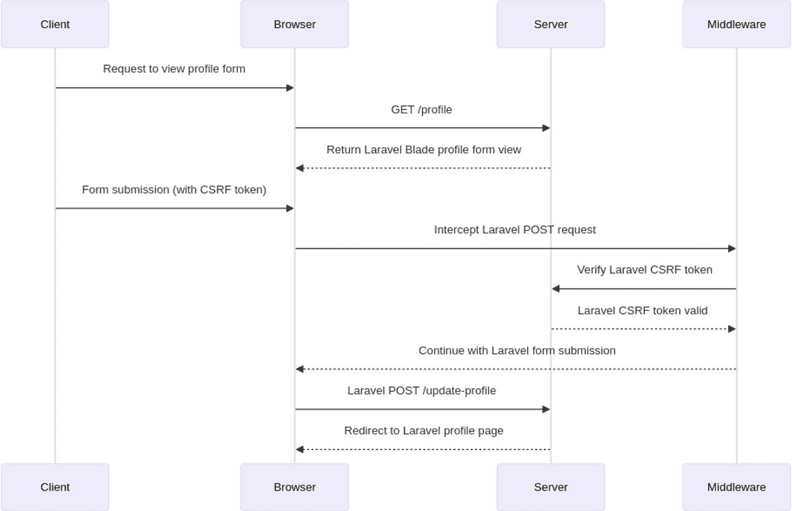

图 4-1

Laravel 使用 CSRF 令牌的工作流程

**前端（Blade 模板）**

假设在 Blade 模板中有一个简单的表单，允许用户更新其个人资料信息。

```
blade

@if(session()->has('success'))

{{ session()->get('success') }}

@endif

@csrf

更新个人资料
```

在这个例子中：

- `@csrf`：此 Blade 指令会生成一个包含 CSRF 令牌的隐藏输入字段。这个令牌对于 Laravel 验证表单提交是否源自您的应用（而非恶意站点）至关重要。

**后端（控制器）**

现在，让我们看看 Laravel 控制器中相应的后端代码。

```
route('profile')->with('success', '个人资料更新成功！');
}
}
```

在这个例子中：

- `showForm` 方法用于显示表单视图。

- `updateProfile` 方法负责处理表单提交。请注意，这里没有显式的 CSRF 验证代码；Laravel 的内置中间件会自动处理。

**中间件（VerifyCsrfToken）**

Laravel 包含诸如 `VerifyCsrfToken` 之类的中间件，用于自动验证所有传入的 POST、PUT 和 DELETE 请求的 CSRF 令牌。

```
<?php
// app/Http/Middleware/VerifyCsrfToken.php
namespace App\Http\Middleware;
use Illuminate\Foundation\Http\Middleware\VerifyCsrfToken as Middleware;
class VerifyCsrfToken extends Middleware
{
protected $addHttpCookie = true;
protected $except = [
// 在此处添加应排除 CSRF 防护的路由
];
}
```

默认情况下，Laravel 会为 Web 路由全局应用此中间件。

**说明**

**前端**

在 Laravel 应用的前端部分，通常使用 Blade 模板来创建表单。在这些模板中，包含 `@csrf` 指令是常见做法。该指令会生成一个包含 CSRF（跨站请求伪造）令牌的隐藏输入字段。CSRF 令牌是一个唯一的、秘密的值，用于验证表单提交的真实性。此验证有助于确保表单提交来自合法来源，而不是试图利用此应用的恶意行为者。

**后端**

在后端，控制器方法负责管理表单的显示和处理。具体来说，像 `showForm` 这样的方法负责向用户渲染表单，而像 `updateProfile` 这样的方法则处理表单数据的提交。Laravel 通过 `web` 中间件组提供内置的 CSRF 保护。这意味着分配给该中间件组的任何路由都会自动应用 CSRF 保护，从而确保对该路由的任何表单提交都使用 CSRF 令牌进行验证。

**中间件**

位于 `app/Http/Middleware/VerifyCsrfToken.php` 的 `VerifyCsrfToken` 中间件，负责检查传入的 POST、PUT 和 DELETE 请求中的 CSRF 令牌。此中间件确保表单中提供的令牌与用户会话中存储的令牌相匹配。如果令牌不匹配，该请求将被拒绝。此外，如果存在不应受此验证约束的特定端点，可以自定义此中间件以排除某些路由的 CSRF 保护。

### 跨站脚本攻击（XSS）防护

Laravel 的 Blade 模板引擎会自动转义输出，从而提供针对 XSS 攻击的保护。然而，开发者仍应保持警惕，并在需要时使用正确的转义方式。

```
<?php
// Blade 模板示例
{{ $userInput }}
?>
```

#### 详细说明

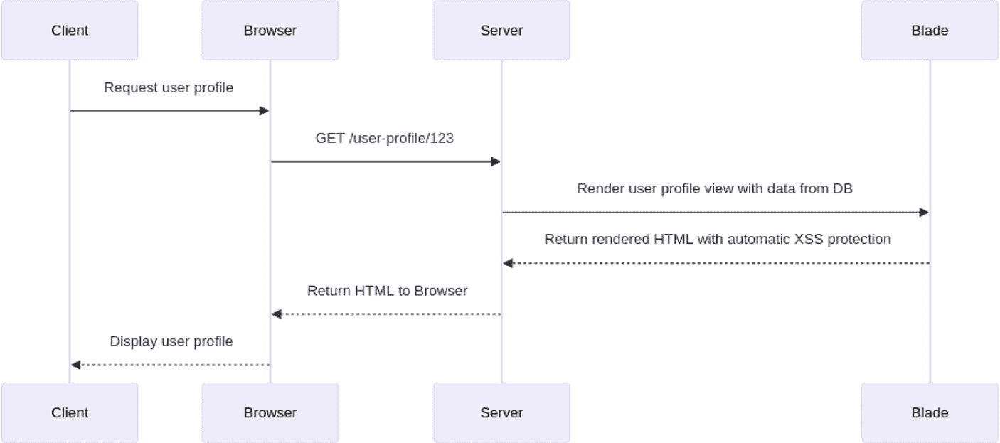

**图 4-2** Laravel XSS 使用流程

让我们通过一个示例来了解 Laravel 如何通过在 Blade 模板中自动转义输出来帮助防范跨站脚本攻击（XSS）。我们将涵盖前端和后端，并附上详细说明。

##### 前端（Blade 模板）

假设你有一个 Blade 模板，用于以安全的方式显示用户数据：

```
blade
用户资料
姓名：{{ $user->name }}
邮箱：{{ $user->email }}
地址：{{ $user->address }}
```

在此示例中，请注意我们使用 Blade 语法（`{{ }}`）来输出用户数据。Laravel 会自动转义这些输出，确保任何潜在的有害内容都被视为纯文本，而不会作为 HTML 或 JavaScript 执行。

##### 后端（控制器）

现在，让我们看看 Laravel 控制器中对应的后端代码。

```
<?php
// app/Http/Controllers/UserController.php
namespace App\Http\Controllers;

use Illuminate\Http\Request;
use App\Models\User;

class UserController extends Controller
{
    public function showProfile($userId)
    {
        // 从数据库检索用户数据
        $user = User::find($userId);

        // 将用户数据传递给视图
        return view('user_profile', ['user' => $user]);
    }
}
```

#### 说明

**前端**

在 Laravel 应用程序的前端部分，使用 `user_profile.blade.php` Blade 模板来显示用户信息。该模板通过类似 `{{ $user->name }}`、`{{ $user->email }}` 和 `{{ $user->address }}` 这样的表达式来访问并输出用户数据。Laravel 的 Blade 模板引擎会自动转义这些输出，将所有 HTML 或 JavaScript 字符转换为纯文本格式。这种内置的转义机制对于防止跨站脚本攻击（XSS）至关重要。因此，即使用户数据包含潜在危险的 HTML 或 JavaScript 代码，它也会被安全地渲染为纯文本。

**后端**

在后端，`UserController` 在管理用户数据方面扮演着关键角色。它根据提供的用户 ID（`$userId`）从数据库检索用户信息。获取用户数据后，将其传递给 `user_profile` 视图。这一过程确保了 Blade 模板中可以获取并显示正确的用户数据。通过分离数据检索和展示逻辑，Laravel 提倡一种清晰且有组织的代码结构，使应用程序更易于维护且更安全。

通过使用 Blade 模板和 Laravel 的自动输出转义功能，我们可以降低 XSS 攻击的风险。务必要始终使用 Blade 语法（`{{ }}`）输出用户生成的内容，并避免使用原始输出（`{!! !!}`），除非确实必要且经过了充分的验证。

请记住，虽然自动输出转义有助于防范许多 XSS 攻击，但我们还应该了解其他安全最佳实践，例如验证和清理用户输入，以及使用 Laravel 提供的其他安全机制。

### SQL 注入防护

Laravel 的 Eloquent ORM 使用了参数化查询，从而防止 SQL 注入攻击。鼓励开发者使用 Eloquent 或查询构建器进行数据库交互。

```php
<?php
$users = User::where('active', 1)->get();
?>
```

#### 详细说明

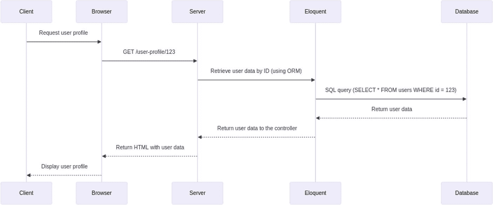

**图 4-3** Laravel 中的 SQL 注入防护

让我们通过一个示例来了解 Laravel 如何使用内建的 ORM（对象关系映射）工具 Eloquent 来防范 SQL 注入。此示例将涵盖前端和后端，包括详细说明。

##### 前端（Blade 模板）

假设你有一个 Blade 模板用于显示用户数据：

```blade
用户资料
姓名：{{ $user->name }}
邮箱：{{ $user->email }}
地址：{{ $user->address }}
```

##### 后端（控制器）

现在，让我们看看 Laravel 控制器中对应的后端代码。

```php
<?php
// app/Http/Controllers/UserController.php
namespace App\Http\Controllers;

use Illuminate\Http\Request;
use App\Models\User;

class UserController extends Controller
{
    public function showProfile($userId)
    {
        // 使用 Eloquent 通过 ID 检索用户数据
        $user = User::find($userId);

        return view('user_profile', ['user' => $user]);
    }
}
```

#### 说明

**前端（Blade 模板）**

在 Laravel 应用程序的前端，使用 `user_profile.blade.php` Blade 模板来显示用户信息。该模板利用 Blade 的双花括号（`{{ }}`）语法输出用户数据，例如 `{{ $user->name }}`、`{{ $user->email }}` 和 `{{ $user->address }}`。Blade 的模板引擎会自动转义这些输出，将特殊字符转换为 HTML 实体。这种转义机制旨在通过确保用户数据中任何潜在的有害代码都被渲染为纯文本，来防止跨站脚本攻击（XSS）。

**后端（控制器）**

在后端，`UserController` 包含负责处理用户数据的方法。具体来说，`showProfile` 方法使用 Laravel 的 ORM（对象关系映射）工具 Eloquent 从数据库检索用户信息。该方法通常使用 Eloquent 的 `find` 方法根据用户 ID 来获取用户。Eloquent 会自动处理参数绑定，将 `$userId` 参数视为占位符，并确保其被安全地合并到 SQL 查询中。这种方法提供了针对 SQL 注入攻击的保护，因为 Eloquent 确保输入被安全地处理和执行。

此示例展示了 Eloquent 默认情况下如何防范 SQL 注入。它使用参数化查询，确保用户输入被正确地清理，并防止恶意的 SQL 注入尝试。

Laravel 通过对 Eloquent ORM 的使用，通过自动处理参数绑定和清理用户输入，为防范 SQL 注入漏洞提供了高水平的保护。我们可以利用此功能来编写安全的数据库查询，而无需进行显式的数据清理。

### 身份验证与授权

Laravel 简化了用户身份验证和授权流程，通过守卫（Guards）和策略（Policies）来控制对资源的访问。它内置了密码哈希（Password Hashing）以及针对时序攻击（Timing Attacks）的防护功能。

```php
$email, 'password' => $password])) {
// 身份验证通过
}
// 授权
if (Gate::allows('update-post', $post)) {
// 用户被授权更新该文章
}
```

#### 详细说明

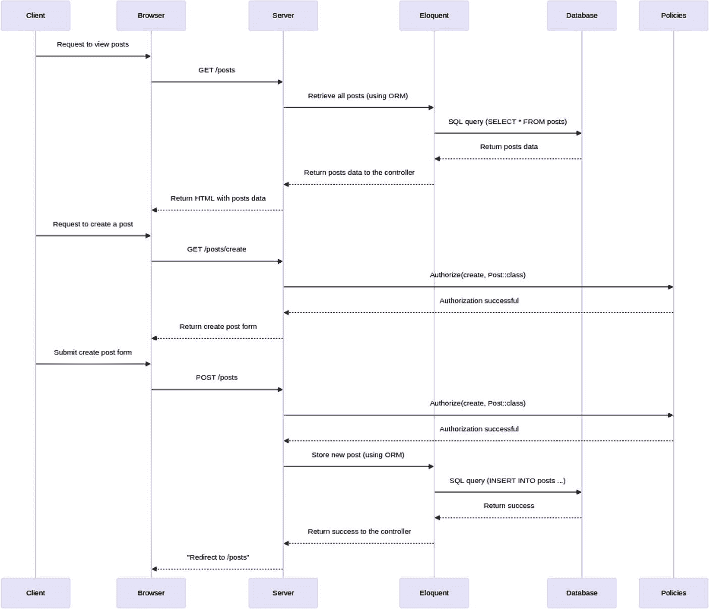

**图 4-4** Laravel 中的身份验证与授权流程

我们通过一个示例来看看 Laravel 如何处理身份验证和授权。这包括设置用户认证、创建包含授权检查的控制器，以及利用 Laravel 内置功能进行安全的用户管理。

#### 步骤 1：设置身份验证

`Laravel Breeze` 是一个扩展包，它提供了一种简单轻量的方式在 Laravel 应用中设置身份验证。请按照以下步骤进行配置：

##### 步骤 1：安装 Laravel Breeze

首先，你需要使用 `Composer`（PHP 的依赖管理器）来安装 `Laravel Breeze`。运行下面的命令，告诉 Composer 将 `Breeze` 包作为开发依赖项下载并安装到你的 Laravel 项目中。该包包含了快速搭建认证功能所需的所有文件和配置：

```bash
composer require laravel/breeze --dev
```

##### 步骤 2：安装 Breeze 的身份验证脚手架

`Breeze` 安装完成后，我们需要通过运行以下命令来搭建身份验证脚手架：

```bash
php artisan breeze:install
```

此命令会生成基本的身份验证系统所需的视图、路由、控制器和其他文件。这些文件会被放置在 Laravel 项目中的相应目录里，为用户登录、注册、密码重置和电子邮件验证提供基础框架。

##### 步骤 3：运行数据库迁移

Laravel 使用迁移（Migrations）来管理数据库模式。要创建身份验证所需的数据库表，请运行：

```bash
php artisan migrate
```

该命令会执行迁移文件，在你的数据库中创建用户表、密码重置表以及其他必要的实体表。迁移确保了数据库模式的一致性和版本控制。

##### 步骤 4：安装 NPM 依赖并编译前端资源

`Laravel Breeze` 包含需要编译的前端资源。首先，通过运行以下命令安装必要的 Node.js 依赖：

```bash
npm install
```

该命令会下载并安装 `package.json` 文件中列出的所有必需的软件包。安装完依赖后，使用以下命令编译前端资源：

```bash
npm run dev
```

此命令使用像 `Webpack` 这样的工具来编译和打包你的 JavaScript 和 CSS 文件。它会为开发环境准备好前端资源，让你在开发应用时能立刻看到更改的效果。

#### 步骤 2：创建资源控制器

接下来，创建一个用于管理资源（例如文章）并实现 CRUD（增删改查）操作的资源控制器。

```bash
php artisan make:controller PostController --resource
```

该命令会生成一个包含 `index`、`create`、`store`、`show`、`edit`、`update` 和 `destroy` 方法的控制器（`PostController`）。

#### 步骤 3：定义路由

在 `routes/web.php` 文件中，为身份验证和资源控制器定义路由。

```php
<?php
use App\Http\Controllers\PostController;
use Illuminate\Support\Facades\Route;

// 身份验证路由
require __DIR__.'/auth.php';

// 资源路由
Route::resource('posts', PostController::class);
```

#### 步骤 4：在控制器中实现授权

编辑 `PostController` 以加入授权检查。例如，只有经过身份验证的用户才能创建、更新和删除文章。

```php
public function create()
{
    $this->authorize('create', Post::class);
    return view('posts.create');
}

public function store(Request $request)
{
    $this->authorize('create', Post::class);
    // 验证和存储逻辑
    // ...
    return redirect()->route('posts.index');
}
// 其他方法...
```

#### 步骤 5：在视图中实现授权

在你的 Blade 视图中，可以使用 `@can` 指令根据用户的授权情况有条件地显示或隐藏内容。

```blade
@if(Auth::check())
    <a href="{{ route('posts.create') }}">创建文章</a>
@endif

@foreach($posts as $post)
    <h2>{{ $post->title }}</h2>

    @can('update', $post)
        <a href="{{ route('posts.edit', $post->id) }}">编辑</a>
    @endcan

    @can('delete', $post)
        <form action="{{ route('posts.destroy', $post->id) }}" method="POST">
            @csrf
            @method('DELETE')
            <button type="submit">删除</button>
        </form>
    @endcan
@endforeach
```

### 步骤 6：定义策略

在 Laravel 中，你可以使用策略（Policies）来封装授权逻辑。为 `Post` 模型创建一个策略。

```bash
php artisan make:policy PostPolicy
```

在 `PostPolicy` 类中定义授权逻辑。

```php
<?php

namespace App\Policies;

use App\Models\User;
use App\Models\Post;

class PostPolicy
{
    public function update(User $user, Post $post)
    {
        return $user->id === $post->user_id;
    }

    public function delete(User $user, Post $post)
    {
        return $user->id === $post->user_id;
    }
}
```

### 步骤 7：注册策略

在 `AuthServiceProvider` 中，将 `PostPolicy` 注册到对应的模型上。

```php
<?php

namespace App\Providers;

use App\Models\Post;
use App\Policies\PostPolicy;
use Illuminate\Foundation\Support\Providers\AuthServiceProvider as ServiceProvider;

class AuthServiceProvider extends ServiceProvider
{
    protected $policies = [
        Post::class => PostPolicy::class,
    ];

    public function boot()
    {
        $this->registerPolicies();
    }
}
```

### 步骤 8：在控制器中使用授权

重构 `PostController`，使用 `authorize` 方法代替手动检查。

```php
public function create()
{
    $this->authorize('create', Post::class);
    return view('posts.create');
}

public function store(Request $request)
{
    $this->authorize('create', Post::class);
    // 验证和存储逻辑
    // ...
    return redirect()->route('posts.index');
}
// 其他方法...
```

### 说明

#### 身份验证

`Laravel Breeze` 通过搭建必需的视图、控制器和路由来简化身份验证的设置。与已弃用的 `make:auth` 命令不同，`Breeze` 提供了一种现代且简约的身份验证方法。安装 `Breeze` 后，身份验证路由会在 `routes/web.php` 文件中定义，使用户能够轻松地注册、登录和管理密码。

#### 控制器中的授权

Laravel 控制器中的授权确保只有经过身份验证的用户才能执行某些操作。在 `PostController` 中，像 `create` 和 `store` 这样的方法会使用 `authorize` 方法来检查用户是否已通过身份验证。该方法会根据定义的策略验证用户是否拥有必要的权限。如果用户未经过身份验证，他们会被重定向到登录页面，从而确保安全的访问控制。

#### 视图中的授权

在 Blade 视图中，Laravel 提供了 `@can` 指令，根据用户权限有条件地显示内容。该指令会检查与用户关联的授权策略，并决定是否应显示特定内容，例如编辑或删除文章的链接。此功能确保只有授权用户才能看到并与用户界面的某些部分进行交互。

#### 策略

Laravel 的策略封装了针对特定模型（例如 `Post`）的授权逻辑。这些策略通过 `make:policy` 命令创建。策略定义的方法对应于用户可以对该模型执行的各种操作，例如更新或删除文章。通过集中管理授权逻辑，策略使得安全访问控制的维护和管理更加容易。

#### 注册策略

策略必须在 `AuthServiceProvider` 中注册，才能被 Laravel 识别。在 `AuthServiceProvider` 中，策略被映射到它们对应的模型。此注册确保 Laravel 在授权检查时使用正确的策略，将 `Post` 等模型与它们对应的 `PostPolicy` 关联起来。

#### 在控制器中使用策略进行授权

`PostController` 利用 `authorize` 方法，基于策略强制进行授权检查。当用户尝试执行创建或更新文章等操作时，控制器会调用相应的策略方法，以验证用户是否拥有必要的权限。这种方法为在整个应用中处理授权提供了一致且安全的方式。

这个端到端示例演示了 Laravel 如何处理用户认证和授权，利用 Eloquent ORM 进行用户管理，并使用策略进行细粒度的授权控制。它有助于确保只有经过身份验证的用户才能执行特定操作，并且授权逻辑集中化，易于维护。

### 会话安全性

Laravel 通过加密会话数据来保护用户会话。它还提供了使用安全、仅限 HTTP 的 cookie 的选项。Laravel 中的会话安全性是 Web 应用开发的一个关键方面。Laravel 提供了开箱即用、稳健且安全的会话管理系统。

```
'value']);
```

#### 详细说明

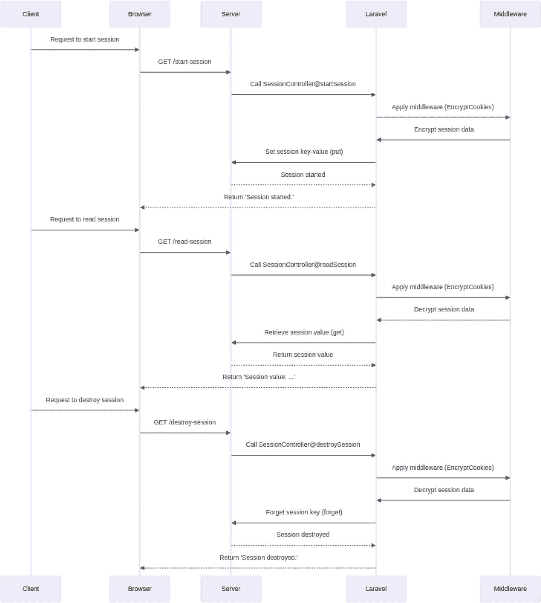

**图 4-5** Laravel 中的会话安全性

让我们回顾一个在 Laravel 应用中实现和保护会话的详细示例。

#### 步骤 1：会话配置

Laravel 的会话配置存储在 `config/session.php` 文件中。您可以在此处自定义会话行为的各个方面。确保您的配置是安全设置的。Laravel 默认使用 `cookie` 驱动，将会话数据存储在加密的 cookie 中。

```
env('SESSION_DRIVER', 'cookie'),
...
'secure' => env('SESSION_SECURE_COOKIE', true),
...
```

#### 步骤 2：控制器和路由

创建一个包含路由的控制器来演示会话的使用。在本示例中，我们将创建一个名为 `SessionController` 的简单控制器，其中包含启动、读取和销毁会话的方法。

```bash
php artisan make:controller SessionController
```

```php
session()->put('key', 'value');
return '会话已启动。';
}
public function readSession(Request $request)
{
$value = $request->session()->get('key', 'default');
return '会话值：' . $value;
}
public function destroySession(Request $request)
{
$request->session()->forget('key');
return '会话已销毁。';
}
}
```

在 `web.php` 中注册路由：

```
<?php
// routes/web.php
Route::get('/start-session', 'SessionController@startSession');
Route::get('/read-session', 'SessionController@readSession');
Route::get('/destroy-session', 'SessionController@destroySession');
```

#### 步骤 3：中间件

Laravel 包含一个 `web` 中间件组，其中包含 `EncryptCookies` 中间件。此中间件会加密 cookie，为会话数据提供额外的安全性。

```
[
...
\Illuminate\Cookie\Middleware\EncryptCookies::class,
...
],
...
];
```

#### 步骤 4：CSRF 保护

Laravel 默认包含 CSRF 保护。`csrf` 中间件会检查每个传入的 POST、PUT 和 DELETE 请求是否包含 CSRF 令牌。确保您的表单包含 `@csrf` Blade 指令。

```blade
@csrf
提交
```

#### 步骤 5：会话加密

Laravel 会自动加密会话数据以确保安全。确保 `config/session.php` 文件中的 `encrypt` 配置选项设置为 `true`。

```
true,
```

#### 步骤 6：会话闪存数据

会话闪存数据允许您存储在下一个 HTTP 请求期间可用的临时数据。这通常用于状态消息。

```
session()->flash('status', '数据存储成功！');
return redirect('/');
}
// Blade 视图
@if (session('status'))
{{ session('status') }}
@endif
```

#### 说明

##### 会话配置

在 Laravel 中，`config/session.php` 文件是配置各种会话设置的核心位置。此文件允许您定义会话驱动、生命周期、过期行为等参数，从而定制会话管理以适应应用的特定需求。

##### 控制器和路由

`SessionController` 负责演示会话管理的基本操作，包括启动会话、读取会话数据和销毁会话。映射到这些控制器操作的路由在 `web.php` 文件中定义，为应用内的会话交互建立了必要的端点。

#### 中间件

`EncryptCookies` 中间件包含在 `web` 中间件组中，可确保所有 cookie 都已加密。该中间件通过保护 cookie 数据不被轻易读取或篡改，增加了一层安全性，从而增强了会话数据的整体安全性。

##### CSRF 保护

Laravel 默认包含跨站请求伪造（CSRF）保护。此保护通过验证应用收到的请求是否合法且意图正确，来保护您的应用免受 CSRF 攻击。CSRF 令牌会自动生成并进行验证，使此过程变得无缝且稳健。

##### 会话加密

为了进一步保护会话数据，Laravel 在存储之前会加密所有会话数据。这意味着即使攻击者获得了会话存储的访问权限，如果没有正确的加密密钥，数据也无法读取，从而维护了会话信息的机密性和完整性。

##### 会话闪存数据

Laravel 提供了一项称为会话闪存数据的功能，允许在请求之间临时存储数据。闪存数据对于存储仅在下一次请求中可用的短暂消息或数据非常有用，例如表单提交后的成功或错误消息。这些数据在读取后会自动移除，确保其不会持久存在超过必要时间。

此示例演示了 Laravel 中会话安全性的基础知识，包括配置、中间件、CSRF 保护、加密和闪存数据。请始终确保您的会话管理符合安全最佳实践。

### 文件上传安全性

在处理文件上传时，Laravel 提供了文件验证和磁盘存储配置等功能以增强安全性。

```
$request->validate([
    'file' => 'required|file|max:10240', // 最大 10MB
]);
// 存储上传的文件
$path = $request->file('file')->store('uploads');
```

**详细说明**

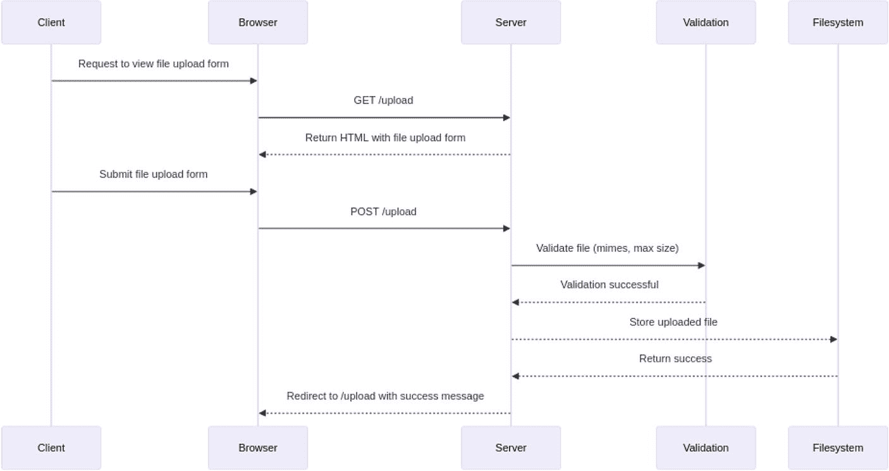

图 4-6：保护 Laravel 中的文件上传安全

文件上传安全性对于防范潜在漏洞至关重要。Laravel 提供了安全处理文件上传的功能。让我们来看一个关于如何在 Laravel 中实现安全文件上传的详细示例，并附有说明。

**第一步：创建文件上传表单**

创建一个包含文件上传表单的 Blade 视图。

```blade
<form action="/upload" method="POST" enctype="multipart/form-data">
    文件上传
    @csrf
    <input type="file" name="file">
    <button type="submit">上传</button>
</form>
```

**第二步：创建处理文件上传的控制器**

创建一个处理文件上传请求的控制器。

```bash
php artisan make:controller FileController
```

```php
<?php

namespace App\Http\Controllers;

use Illuminate\Http\Request;

class FileController extends Controller
{
    public function showUploadForm()
    {
        return view('upload');
    }

    public function upload(Request $request)
    {
        $request->validate([
            'file' => 'required|mimes:pdf,doc,docx|max:2048',
        ]);
        $file = $request->file('file');
        $filename = time() . '_' . $file->getClientOriginalName();
        $file->storeAs('uploads', $filename, 'public');
        return redirect()->route('upload')->with('success', '文件上传成功！');
    }
}
```

**说明**

-   **HTML 表单**：为在 Laravel 中安全处理文件上传，首先创建一个包含 "file" 类型输入字段的 HTML 表单。此表单还必须包含 `enctype="multipart/form-data"` 属性，这对于允许通过表单上传文件至关重要。这确保了文件数据能被正确编码并传输到服务器。

-   **控制器方法**：在控制器中，两个方法共同管理文件上传过程。`showUploadForm` 方法负责向用户显示文件上传表单。`upload` 方法则负责处理表单提交后的实际文件上传过程。这些方法协同工作，为用户提供无缝的文件上传体验。

-   **验证规则**：为确保仅上传合适的文件，使用 `validate` 方法对文件上传请求强制执行严格的验证规则。规则 `'file' => 'required|mimes:pdf,doc,docx|max:2048'` 确保上传的文件是必需的，将文件类型限制为 PDF、DOC 和 DOCX，并将文件大小限制为最大 2MB。此验证对于防止上传潜在危险文件及有效管理服务器存储至关重要。

-   **文件存储**：验证通过后，上传的文件存储在 `storage/app/public/uploads` 目录中。为确保每个文件名唯一并避免覆盖，存储在文件名前加上当前时间戳。这种方法不仅有助于整理文件，还能防止命名冲突。

**第三步：定义路由**

在 `routes/web.php` 文件中定义路由：

```php
Route::get('/upload', [FileController::class, 'showUploadForm'])->name('upload');
Route::post('/upload', [FileController::class, 'upload']);
```

**第四步：配置存储**

确保已创建存储链接：

```bash
php artisan storage:link
```

**第五步：为文件系统更新 `.env` 文件**

确保 `.env` 文件配置正确：

```env
FILESYSTEM_DRIVER=public
```

**第六步：显示成功消息**

更新 Blade 视图以显示成功消息：

```blade
<!DOCTYPE html>
<html>
<head>
    <title>文件上传</title>
</head>
<body>
    <form action="/upload" method="POST" enctype="multipart/form-data">
        @if(session('success'))
            <div>{{ session('success') }}</div>
        @endif
        @csrf
        <input type="file" name="file">
        <button type="submit">上传</button>
    </form>
</body>
</html>
```

此示例概述了在 Laravel 中实现安全文件上传的方法，重点介绍了确保安全性和效率的关键方面。

-   **HTML 表单**：HTML 表单设置了 `enctype="multipart/form-data"` 属性，该属性对于启用文件上传至关重要。此属性确保文件数据被正确编码并发送到服务器。

-   **控制器方法**：两个控制器方法管理文件上传过程：一个用于显示文件上传表单，另一个用于处理实际的上传。第一个方法向用户显示表单，第二个方法在表单提交后处理上传的文件。

-   **验证规则**：为了维护安全性和完整性，使用特定规则对文件上传请求进行验证。这些规则检查文件类型是否被允许（例如 PDF、DOC、DOCX），以及文件大小是否不超过特定限制（例如 2MB）。此步骤对于防止恶意文件上传至关重要。

-   **文件存储**：上传的文件存储在 `public/uploads` 目录中。为确保唯一性并避免覆盖现有文件，文件名前会添加时间戳。这种组织方法有助于有效管理文件并防止命名冲突。

-   **路由配置**：设置路由以管理文件上传表单的显示和文件上传的处理。这些路由确保根据用户操作调用正确的控制器方法，从而提供无缝体验。

-   **文件系统配置**：文件系统被配置为使用 `public` 磁盘存储上传的文件。此配置允许文件公开访问，同时确保其安全存储，并可通过 Laravel 的文件系统功能轻松管理。

### 用于额外保护的中间件

Laravel 允许开发者创建自定义中间件，用于额外的安全检查、日志记录或任何其他需求。

```php
<?php

// 自定义中间件

public function handle($request, Closure $next)

{

    // 执行安全检查

    return $next($request);

}
```

#### 详细说明

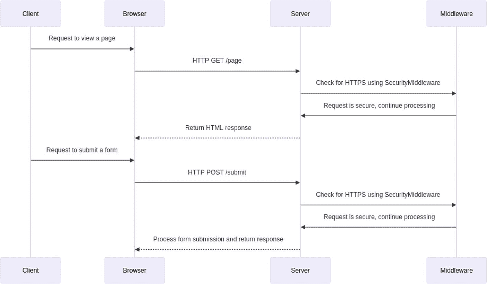

*图 4-7：使用 Laravel 的中间件保护*

Laravel 中的中间件提供了一种便捷的方式来过滤进入应用的 HTTP 请求。中间件可用于多种目的，包括为你的应用添加额外的安全层。让我们创建一个简单的中间件，说明如何为 Laravel 应用添加额外的保护。

**第 1 步：创建中间件**

运行以下 Artisan 命令来创建一个新的中间件：

```bash
php artisan make:middleware SecurityMiddleware
```

这将在 `app/Http/Middleware` 目录中生成一个新的中间件类。

**第 2 步：实现中间件逻辑**

打开生成的 `SecurityMiddleware` 类（`app/Http/Middleware/SecurityMiddleware.php`）并实现所需的安全检查。在这个例子中，我们将添加一个基本检查，以确保请求使用 HTTPS。

```php
<?php

// ...

public function handle($request, Closure $next)

{

    if (! $request->secure()) {

        return redirect()->secure($request->getRequestUri());

    }

    return $next($request);

}
```

**第 3 步：注册中间件**

将你的中间件添加到 `app/Http/Kernel.php` 文件中粗体显示的 `$routeMiddleware` 数组里。

```php
<?php

// ...

protected $routeMiddleware = [

    // ...

    'security' => \App\Http\Middleware\SecurityMiddleware::class,

];
```

**第 4 步：将中间件应用到路由**

你可以将中间件全局应用到所有 Web 路由，或者有选择地应用到特定路由或路由组。

*全局应用：*

```php
<?php

// app/Http/Kernel.php

protected $middlewareGroups = [

    'web' => [

        // ...

        \App\Http\Middleware\SecurityMiddleware::class,

    ],

];
```

*选择性应用：*

```php
<?php

Route::middleware(['security'])->group(function () {

    // 你的路由在这里

});
```

#### 说明

**SecurityMiddleware 逻辑**

在 Laravel 中，中间件用于过滤和修改进入应用的 HTTP 请求。中间件类中的 `handle()` 方法会在每个传入请求时执行。在这个例子中，中间件检查请求是否安全，即是否使用了 HTTPS。如果请求不安全，中间件会将用户重定向到 URL 的安全版本。这确保了客户端和服务器之间的所有通信都是加密的，从而保护敏感数据免遭拦截。

**中间件注册**

要激活中间件，必须在 `app/Http/Kernel.php` 文件中将其注册到适当的中间件组下。在本例中，中间件被添加到默认应用于所有 Web 路由的 `web` 中间件组。这种集中注册确保了安全检查在整个应用中一致地应用。

**中间件应用**

中间件可以应用于不同的范围。可以通过将其包含在 `web` 中间件组中来全局应用于所有 Web 路由。或者，也可以有选择地应用于特定路由或路由组。这种灵活性允许你在应用的某些部分强制使用 HTTPS，同时根据需要让其他部分通过 HTTP 访问。

这个例子演示了一个简单的安全中间件，它为 Web 路由强制使用 HTTPS。在实际场景中，你可能需要根据应用需求实现更高级的安全措施。这些措施可能包括输入验证以防止 SQL 注入、设置内容安全策略以防止 XSS 攻击，以及实现反 CSRF 保护以确保表单提交安全。通过有效使用中间件，你可以显著增强 Laravel 应用的安全态势。

中间件是 Laravel 中为应用添加安全层的强大工具，它允许你在 HTTP 请求生命周期的不同阶段拦截和检查请求。

### HTTPS 与安全配置

将 Laravel 配置为使用 HTTPS 以及保护敏感的配置设置，对于整体应用安全至关重要。

```php
<?php

// 在 .env 文件中配置安全设置

APP_ENV=production

APP_DEBUG=false
```

#### 详细说明

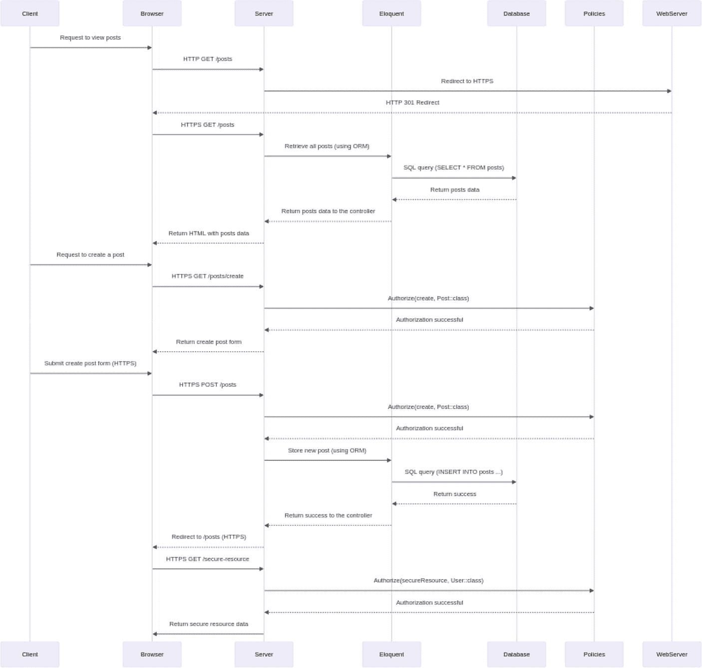

*图 4-8：Laravel 中的 HTTPS 与安全配置*

使用 HTTPS 保护 Laravel 应用需要配置 Web 服务器来使用 SSL/TLS，并在 Laravel 应用中强制执行安全配置。让我们按照带有代码片段的逐步指南来在 Laravel 中启用 HTTPS。

**第 1 步：获取 SSL 证书**

首先，你需要为你的域名准备一个 SSL 证书。你可以从像 Let's Encrypt 这样的证书颁发机构（CA）获取一个，或者购买一个。Let's Encrypt 提供免费的 SSL 证书。

**第 2 步：配置 Web 服务器（Apache 或 Nginx）**

*Apache 配置*

对于 Apache，你需要配置 VirtualHost 来使用 SSL。编辑你的 Apache 配置文件，或为你的 Laravel 项目创建一个新文件。

```apache
<VirtualHost *:80>

    ServerName your-domain.com

    Redirect permanent / https://your-domain.com/

</VirtualHost>

<VirtualHost *:443>

    ServerName your-domain.com

    DocumentRoot /path/to/your/laravel/public

    SSLEngine on
```

## 使用 HTTPS 保护你的 Laravel 应用程序

使用 HTTPS 保护 Laravel 应用程序的第一步是为你的域名获取 SSL 证书。这可以通过 Let's Encrypt 等证书颁发机构 (CA) 完成。SSL 证书会对服务器与客户端之间传输的数据进行加密，确保隐私和数据完整性。

### 配置 Web 服务器

获得 SSL 证书后，更新你的 Web 服务器配置以使用 SSL。对于 Apache，这需要在配置文件中指定 SSL 证书文件的路径。对于 Nginx，则在服务器块中进行类似的调整。这些配置告诉服务器使用 SSL 证书进行加密通信。

#### Apache 配置

```
SSLCertificateFile /path/to/your/ssl_certificate.crt
SSLCertificateKeyFile /path/to/your/private_key.key
SSLCertificateChainFile /path/to/your/chain_file.pem

<Directory /path/to/your/laravel/public>
    Options Indexes FollowSymLinks
    AllowOverride All
    Require all granted
</Directory>
```

#### Nginx 配置

对于 Nginx，配置你的服务器块以使用 SSL。

```nginx
server {
    listen 80;
    server_name your-domain.com;
    return 301 https://$host$request_uri;
}

server {
    listen 443 ssl;
    server_name your-domain.com;
    root /path/to/your/laravel/public;
    ssl_certificate /path/to/your/ssl_certificate.crt;
    ssl_certificate_key /path/to/your/private_key.key;
    ssl_trusted_certificate /path/to/your/chain_file.pem;
    # 其他 SSL/TLS 配置
    location / {
        try_files $uri $uri/ /index.php?$query_string;
    }
    # 额外的 Nginx 配置...
}
```

### 为 HTTPS 配置 Laravel

接下来，将 Laravel 的 `.env` 文件中的 `APP_URL` 设置为使用 HTTPS 协议。此配置确保 Laravel 应用程序中生成的所有 URL 默认使用 HTTPS，从而在你的站点上提供一致的安全链接结构。

```env
APP_URL=https://your-domain.com
```

### 在 Laravel 中间件中启用 HTTPS

为了强制使用 HTTPS，创建一个中间件，强制所有请求使用 HTTPS。在中间件栈中注册此中间件，以确保每个请求都被重定向到你网站的安全 HTTPS 版本。这一步对于防止任何未加密的访问至关重要。

运行以下命令生成一个新的中间件：

```bash
php artisan make:middleware ForceHttps
```

编辑生成的 `ForceHttps` 中间件：

```php
<?php

namespace App\Http\Middleware;

use Closure;

class ForceHttps
{
    public function handle($request, Closure $next)
    {
        if (! $request->secure() && env('APP_ENV') === 'production') {
            return redirect()->secure($request->getRequestUri());
        }

        return $next($request);
    }
}
```

在 `App\Http\Kernel` 类中注册该中间件：

```php
<?php

// app/Http/Kernel.php
protected $middleware = [
    // 其他中间件...
    \App\Http\Middleware\ForceHttps::class,
];
```

这个中间件会检查请求是否不安全（未使用 HTTPS），如果是生产环境，则重定向到安全版本。

### 更新服务提供者

确保 `config/app.php` 中的 URL 配置设置为使用 HTTPS。这一调整确保 Laravel 的 URL 生成器生成的所有 URL 都是安全的，从而在应用程序的所有部分强化 HTTPS 协议。

```php
'url' => env('APP_URL', 'https://your-domain.com'),
```

### HSTS（HTTP 严格传输安全）

可选地，你可以通过添加设置 `Strict-Transport-Security` 头的中间件来实现 HTTP 严格传输安全 (HSTS)。HSTS 指示浏览器始终使用 HTTPS 访问你的域名，即使用户尝试通过 HTTP 访问也是如此。这一额外的安全层有助于保护你的网站免受协议降级攻击和 cookie 劫持。

将以下中间件添加到 `App\Http\Kernel` 中的 `$middleware` 数组：

```php
<?php

// app/Http/Kernel.php
protected $middleware = [
    // 其他中间件...
    \App\Http\Middleware\ForceHttps::class,
    \Illuminate\Http\Middleware\FrameGuard::class,
    \App\Http\Middleware\AddHstsHeader::class,
];
```

创建一个新的 HSTS 中间件：

```bash
php artisan make:middleware AddHstsHeader
```

编辑生成的 `AddHstsHeader` 中间件：

```php
<?php

namespace App\Http\Middleware;

use Closure;

class AddHstsHeader
{
    public function handle($request, Closure $next)
    {
        $response = $next($request);
        $response->headers->add(['Strict-Transport-Security' => 'max-age=31536000; includeSubDomains']);
        return $response;
    }
}
```

通过遵循这些步骤，我们可以使用 HTTPS 保护我们的 Laravel 应用程序，确保客户端与服务器之间的加密通信。提供的代码片段和说明涵盖了为 HTTPS 配置 Laravel 以及增强安全措施的基本方面。

这些只是 Laravel 在不同场景下处理安全问题的几个示例。开发者必须及时了解最佳实践，并定期更新应用程序及其依赖项，以从最新的安全增强功能中受益。

## Laravel 中的安全配置与部署

Laravel 中的安全配置与部署是构建和维护安全 Web 应用程序的关键方面。正确保护你的 Laravel 应用程序涉及若干关键实践，从保护敏感信息到强制使用 HTTPS 进行安全通信。

### 保护敏感信息

在 Laravel 中，安全配置对于保护 API 密钥、数据库凭据和其他环境特定设置等敏感信息至关重要。Laravel 使用 `.env` 文件，它可以集中且安全地管理这些配置变量。在部署过程中，确保敏感信息不会暴露在配置文件或日志中至关重要。安全部署实践，例如使用环境变量和秘密管理工具，有助于在部署过程中防止凭据或其他敏感数据的意外泄露。

### 预防安全漏洞

采用最佳安全实践配置 Laravel 有助于预防常见漏洞。这包括设置适当的会话、Cookie 和加密配置。例如，确保 Cookie 设置了 `Secure` 和 `HttpOnly` 标志，并正确配置加密密钥，都有助于构建更安全的应用程序。定期部署安全更新和补丁对于解决 Laravel 或其依赖项中的漏洞至关重要。自动化部署流水线和工具可以帮助确保一致且安全的部署，使无需手动干预即可轻松应用更新。

### 强制使用 HTTPS 进行安全通信

配置 Laravel 使用 HTTPS 可确保客户端与服务器之间的通信经过加密。这可以保护用户数据、登录凭据和其他敏感信息免遭拦截。要强制使用 HTTPS，你需要配置你的 Web 服务器（例如 Apache 或 Nginx）以支持 HTTPS，并更新你的 Laravel 配置以使用 HTTPS 协议。这包括将 `.env` 文件中的 `APP_URL` 设置为 `https://`，并可能创建中间件将所有 HTTP 流量重定向到 HTTPS。强制使用 HTTPS 是一项关键的安全措施，尤其是在生产环境中。

### 实施 HTTP 严格传输安全 (HSTS)

在 Web 服务器配置中启用 HSTS 可确保浏览器仅通过安全连接与服务器通信。这可以防止协议降级攻击，并为用户提供更安全的浏览体验。在部署过程中，在 Web 服务器配置中设置 HSTS 标头有助于防范中间人攻击。这涉及向响应中添加 `Strict-Transport-Security` 头，该标头指示浏览器在指定时间段内仅通过 HTTPS 与你的站点交互。

### 维护生产就绪环境

为生产环境配置 Laravel 涉及优化性能、安全性和稳定性的设置。这包括禁用调试模式、确保正确的错误报告以及优化缓存和会话设置。正确的配置可确保错误消息不会暴露敏感信息。部署实践应侧重于维护一致且安全的生产环境。在生产部署之前，在预发布环境中定期测试和验证部署对于发现潜在问题并确保平稳过渡至关重要。

#### 增强整体应用安全性

遵循安全配置实践有助于为整体应用安全奠定基础。Laravel 内置的安全特性在正确配置后，有助于保护应用免受常见的 Web 应用漏洞攻击，例如 SQL 注入、XSS 和 CSRF 攻击。安全部署实践不仅限于部署过程，还包括监控和事件响应。实施持续性的安全实践，例如定期安全审计、漏洞扫描和监控，可确保安全在应用的整个生命周期中始终是优先事项。

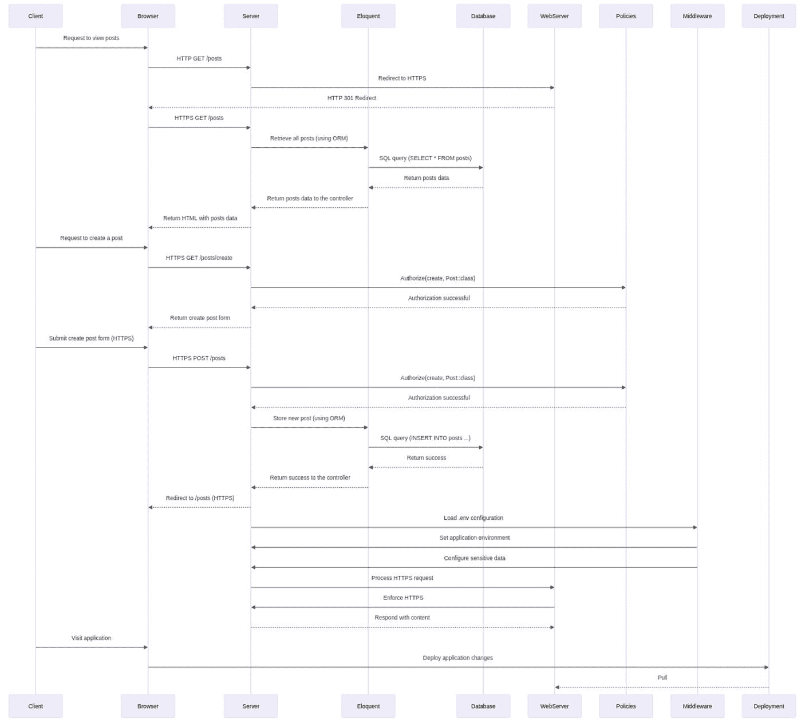

图 4-9: Laravel 工作流中的安全配置

##### 安全配置

`.env` 文件：

确保敏感信息安全存储。避免将关键信息直接存储在 `.env` 文件中。

```
dotenv
APP_ENV=production
APP_KEY=your_generated_key
DB_CONNECTION=mysql
DB_HOST=127.0.0.1
DB_PORT=3306
DB_DATABASE=your_database
DB_USERNAME=your_username
DB_PASSWORD=your_password
##### 其他配置...
```

##### HTTPS 和 HSTS

Web 服务器配置（Apache 示例）：

```
apache

ServerName your-domain.com
Redirect permanent / https://your-domain.com/

ServerName your-domain.com
DocumentRoot /path/to/your/laravel/public
SSLEngine on
SSLCertificateFile /path/to/your/ssl_certificate.crt
SSLCertificateKeyFile /path/to/your/private_key.key
SSLCertificateChainFile /path/to/your/chain_file.pem

Options Indexes FollowSymLinks
AllowOverride All
Require all granted

Header always set Strict-Transport-Security "max-age=31536000; includeSubDomains"
```

用于 HTTPS 重定向的中间件：

```
secure() && App::environment('production')) {
return redirect()->secure($request->getRequestUri());
}
return $next($request);
}
}
```

用于 HSTS 头的中间件：

```
headers->add(['Strict-Transport-Security' => 'max-age=31536000; includeSubDomains']);
return $response;
}
}
```

在 Kernel 中注册中间件：

```
<?php
// app/Http/Kernel.php
protected $middleware = [
// 其他中间件...
\App\Http\Middleware\ForceHttps::class,
\App\Http\Middleware\AddHstsHeader::class,
];
```

##### 部署最佳实践

将 Laravel 设置为生产模式：

在 `.env` 文件中：

```
dotenv
APP_ENV=production
```

为生产环境优化：

```
bash
php artisan optimize
```

Composer 自动加载优化：

```
bash
composer dump-autoload --optimize
```

安全文件权限：

```
bash
chmod -R 755 storage bootstrap/cache
```

安全配置和部署实践对于构建和维护安全的 Laravel 应用至关重要。它们有助于保护敏感信息、防止安全漏洞、强制安全通信，并有助于构建整体稳健的安全态势。定期审查和更新配置、部署安全补丁以及遵循最佳实践，对于构建安全可靠的 Laravel 应用至关重要。

---

### 保护路由、中间件和控制器

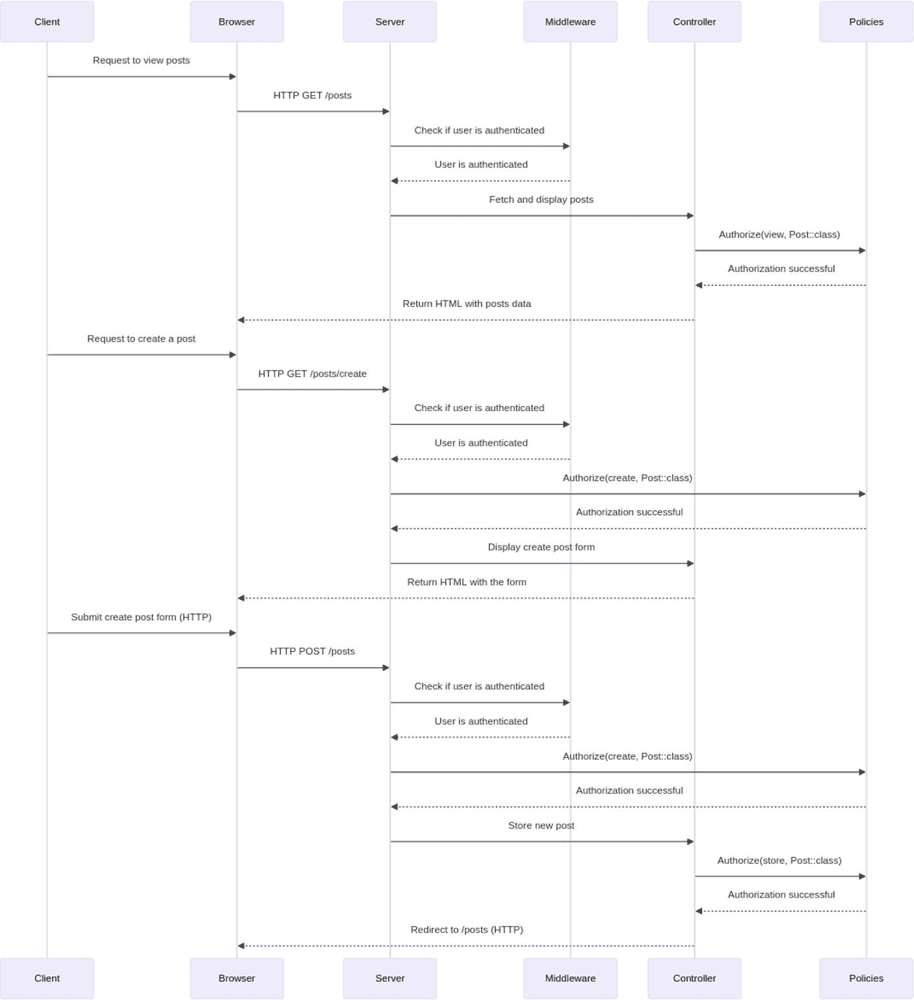

图 4-10: Laravel 中的路由、中间件和控制器

保护 Laravel 中的路由、中间件和控制器对于确保 Web 应用的安全性和完整性至关重要。这些组件在控制访问、过滤请求和实施安全措施方面发挥着关键作用。让我们探讨一下在安全环境中保护它们的重要性。

#### 1. 访问控制与授权

Laravel 的路由系统允许你定义映射到特定控制器或闭包的路由。控制对这些路由的访问对于执行正确的授权至关重要。可以使用中间件来检查用户角色、权限或任何自定义逻辑，然后再允许或拒绝对特定路由的访问。这有助于防止未经授权的用户访问应用的敏感部分。

#### 2. 输入验证与清理

中间件在请求和控制器之间运行，是用于输入验证和清理的强大工具。通过中间件对传入数据进行过滤和验证，可以保护应用免受 SQL 注入、XSS（跨站脚本攻击）和 CSRF（跨站请求伪造）等常见安全威胁。正确的验证可确保到达控制器的数据是安全的，并符合预期的格式，从而降低恶意输入的风险。

#### 3. 防御攻击与安全策略

控制器处理应用的核心逻辑。保护控制器涉及实施安全策略以防范各种攻击。Laravel 提供了路由模型绑定、依赖注入和资源控制器等功能，如果安全地使用这些功能，有助于防止参数篡改和注入攻击等攻击。另一方面，中间件允许你在更广泛的层面上应用与安全相关的策略，影响多个路由和控制器。

#### 4. 日志记录与监控

可以利用 Laravel 的中间件和控制器在应用中记录和监控活动。通过在中间件和控制器中实施日志记录机制，可以捕获有关用户操作、失败的访问尝试或任何可疑行为的信息。这些日志数据对于安全审计、取证分析和主动识别潜在安全威胁非常宝贵。

保护 Laravel 中的路由、中间件和控制器涉及身份验证、授权和其他安全措施的组合。让我们通过一个端到端的示例和详细的代码片段来回顾一下，重点突出最佳安全实践。

**步骤 1：设置身份验证**

首先，确保已经设置了用户身份验证。Laravel 提供了使用 `make:auth` 命令轻松搭建身份验证的方法：

```
bash
php artisan make:auth
```

此命令会生成用户注册和登录所需的视图、控制器和路由。

**步骤 2：创建用于授权的中间件**

创建一个中间件来处理授权。本例中，我们创建一个名为 `CheckRole` 的中间件，用于检查用户是否具有特定角色。

```bash
php artisan make:middleware CheckRole
```

编辑生成的 `CheckRole` 中间件：

```php
user() || !$request->user()->hasRole($role)) {
    abort(403, '未授权的操作.');
}
return $next($request);
}
}
```

**步骤 3：定义用户角色**

在你的 `User` 模型中，定义一个方法来检查用户是否拥有特定角色：

```php
role === $role;
}
}
```

**步骤 4：在 Kernel 中注册中间件**

在 `App\Http\Kernel` 类的 `$routeMiddleware` 数组中注册 `CheckRole` 中间件：

```php
\App\Http\Middleware\CheckRole::class,
];
```

**步骤 5：将中间件应用于路由**

将 `CheckRole` 中间件应用于你想要保护的路由：

```php
group(function () {
    // 你的受保护路由在此处
});
```

**步骤 6：保护控制器动作**

在你的控制器中，使用 `authorize` 方法执行授权检查：

```php
authorize('adminAction', $request->user());
// 用于管理员操作的控制器逻辑
}
}
```

**步骤 7：定义策略**

创建一个策略来封装你的授权逻辑：

```bash
php artisan make:policy ExamplePolicy
```

编辑生成的 `ExamplePolicy`：

```php
hasRole('admin');
}
}
```

**步骤 8：注册策略**

在 `AuthServiceProvider` 中，将 `ExamplePolicy` 注册到对应的模型：

```php
ExamplePolicy::class,
];
public function boot()
{
    $this->registerPolicies();
}
}
```

---

#### 安全最佳实践

在 Laravel 中实施安全最佳实践，对于确保你的应用稳健可靠、免受未经授权访问和其他安全威胁至关重要。以下是需要遵循的一些关键实践。

##### 基于角色的访问控制（RBAC）

为有效管理用户访问，请实施基于角色的访问控制（RBAC）。不要直接为每个用户分配权限，而是分配封装了一组权限的角色。这种方法简化了管理，并通过确保用户根据其角色拥有适当的访问级别来增强安全性。在检查权限时，应始终验证角色而非单个权限。

#### 中间件

在 Laravel 应用程序中，利用中间件来实现特定路由的授权。中间件充当守门人，拦截请求并在其到达控制器之前执行必要的检查。这确保了只有授权用户才能访问特定路由和资源，提供了额外的安全层。

#### 策略

对于更详细和精细的授权逻辑，请使用策略。策略封装了与应用程序中特定模型或操作相关的授权逻辑。通过定义策略，您可以集中管理授权逻辑，使其更易于管理和维护。

#### 控制器中的授权

在控制器中，使用 `authorize` 方法根据您定义的策略执行授权检查。此方法确保用户拥有执行其尝试操作的必要权限。通过将授权检查直接集成到控制器中，您可以在整个应用程序中维护清晰且一致的安全方法。

#### 中间件参数

通过向中间件传递参数来增强其灵活性和可重用性。中间件参数允许您针对不同路由或条件自定义中间件的行为，使您的安全措施更具适应性和效率。

### 错误处理

实施适当的错误处理，以便在授权失败时提供有意义的响应。不要暴露敏感信息或返回通用错误，而应定制您的响应以适当地通知用户，同时维护安全性。正确的错误处理有助于改善用户体验，并有助于调试安全问题。

#### 路由分组

利用带有中间件的路由分组，一次性将授权检查应用于多个路由。通过对相关路由进行分组并为该组分配中间件，您可以确保在多个端点之间实施一致的安全措施。这种方法简化了授权逻辑的应用，并有助于维护组织良好且易于管理的路由定义。

保护 Laravel 中的路由、中间件和控制器是构建安全 Web 应用程序不可或缺的一部分。这些组件构成了抵御未经授权的访问、输入操纵和其他安全漏洞的第一道防线。利用 Laravel 强大的功能并在此类领域实施安全的编码实践，有助于加固您的应用程序，并确保为用户和数据提供一个更安全的在线环境。

### 保护 Laravel 数据库操作

保护 Laravel 中的数据库操作涉及多种措施，例如使用 Eloquent ORM、采用参数化查询、验证用户输入以及实施授权检查。让我们按照以下指南进行操作，其中包含详细的代码示例和最佳安全实践。

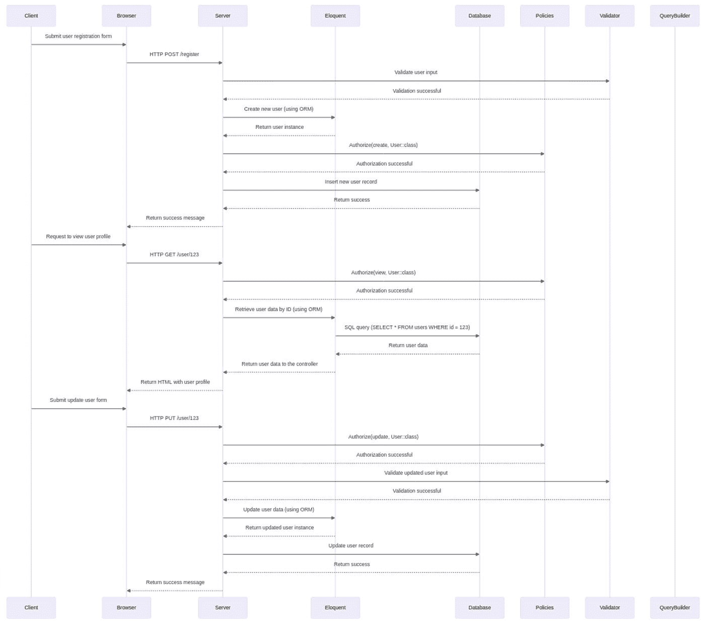

图 4-11

保护 Laravel 中的数据库操作

**第 1 步：使用 Eloquent ORM**

*模型定义*

为您在数据库中交互的实体定义一个模型，确保使用 Eloquent ORM。

```php
validate([
    'name' => 'required|string|max:255',
    'email' => 'required|email|unique:users|max:255',
    'password' => 'required|string|min:8',
]);
// 使用已验证的数据创建用户
$user = User::create($validatedData);
// 其他逻辑...
}
```

**第 2 步：执行验证**

始终验证用户输入，以防止 SQL 注入攻击并确保数据完整性。

```php
validate([
    'name' => 'required|string|max:255',
    'email' => 'required|email|unique:users|max:255',
    'password' => 'required|string|min:8',
]);
// 使用已验证的数据创建用户
$user = User::create($validatedData);
// 其他逻辑...
}
}
```

**第 3 步：使用参数化查询**

Laravel 的 Eloquent ORM 自动使用参数化查询，有助于防止 SQL 注入。

```php
<?php
// app/Http/Controllers/UserController.php
namespace App\Http\Controllers;
use Illuminate\Http\Request;
use App\Models\User;
class UserController extends Controller
{
    public function findUser($id)
    {
        // Eloquent 自动使用参数化查询
        $user = User::find($id);
        // 其他逻辑...
    }
}
```

**第 4 步：实施授权**

利用 Laravel 内置的授权功能来控制对数据库操作的访问。

*策略定义*

创建一个策略来定义授权规则。

```bash
php artisan make:policy UserPolicy
```

```php
id === $targetUser->id;
}
// 其他授权逻辑...
}
```

*控制器中的授权*

在控制器中应用该策略，以检查已认证用户是否拥有必要的权限。

```php
authorize('update', $user);
// 更新用户数据...
}
}
```

**第 5 步：安全地使用 Laravel 查询构建器**

如果您需要使用原始 SQL 查询，请使用带有绑定的 Laravel 查询构建器来防止 SQL 注入。

```php
<?php
// app/Http/Controllers/UserController.php
namespace App\Http\Controllers;
use Illuminate\Support\Facades\DB;
class UserController extends Controller
{
    public function customQuery($searchTerm)
    {
        $results = DB::select('SELECT * FROM users WHERE name = ?', [$searchTerm]);
        // 处理结果...
    }
}
```

**第 6 步：在生产环境中隐藏错误详情**

配置 Laravel 在生产环境中隐藏错误详情，以防止暴露敏感信息。

```php
env('APP_ENV', 'production'),
```

**第 7 步：保护数据库凭据**

确保您的数据库凭据安全存储，且不会在应用程序代码中暴露。使用环境变量来存储敏感信息。

## 总结

本章深入探讨了保护 Laravel 应用安全的关键方面，强调了针对这一流行的 PHP 框架采取强健安全措施的重要性。本章概述了各种技术和最佳实践，以保护 Laravel 应用免受潜在漏洞的攻击。

### Laravel 安全功能简介

本章首先概述了 Laravel 的内置安全功能，例如 CSRF 保护、XSS 防御以及通过 Eloquent ORM 实现的 SQL 注入防护。这些功能是保护 Web 应用免受常见安全威胁的基础。

### Laravel 的安全配置与部署

保护配置和部署安全涉及保护敏感信息、强制使用 HTTPS 以及实施 HTTP 严格传输安全（HSTS）。最佳实践包括使用环境变量存储配置设置，并定期部署安全更新。此外，还配置了中间件以确保所有流量安全，并对生产环境设置进行了性能和安全性优化。

### 保护路由、中间件和控制器

本节强调了路由、中间件和控制器在保护 Laravel 应用安全中的作用。通过实施基于角色的访问控制（RBAC）并使用中间件进行特定路由的授权检查，确保只有授权用户才能访问应用的特定部分。策略（Policies）封装了授权逻辑，使得管理和维护安全访问控制更加容易。错误处理和路由分组进一步增强了应用的安全性和可用性。

### 保护 Laravel 数据库操作

为了保护数据库操作的安全，本章提倡使用 Laravel 的 Eloquent ORM，它本质上使用参数化查询来防止 SQL 注入。用户输入验证、安全使用查询构建器以及通过环境变量妥善处理数据库凭据都是必不可少的实践。此外，本章还讨论了使用策略和控制器实施授权检查的重要性，以确保只有授权用户才能执行特定的数据库操作。