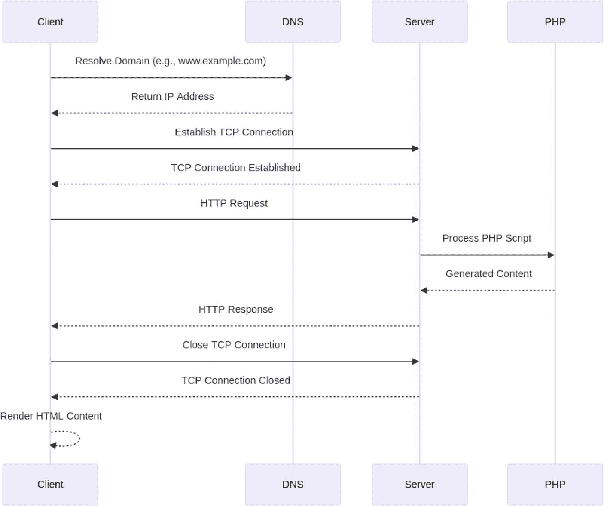
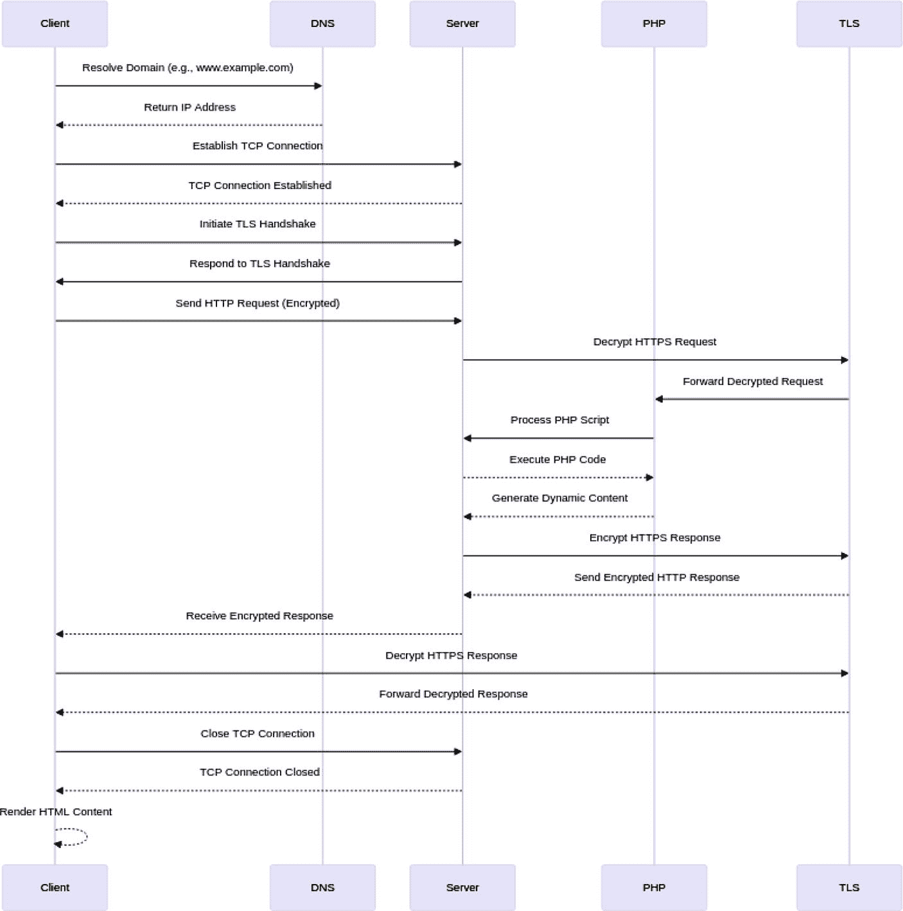
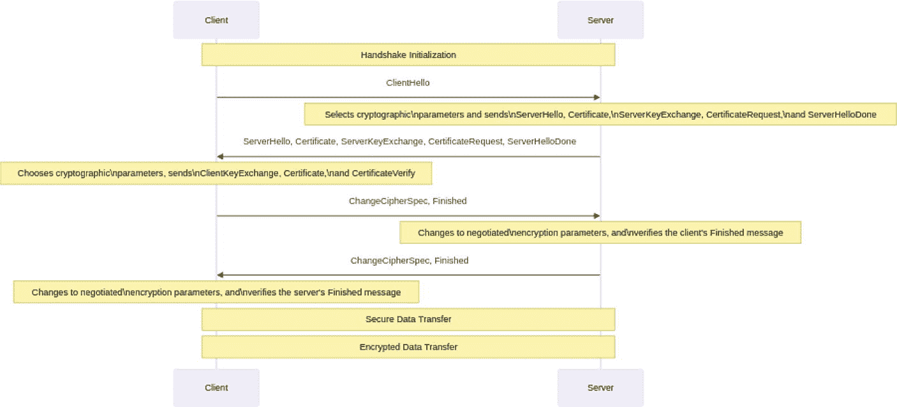
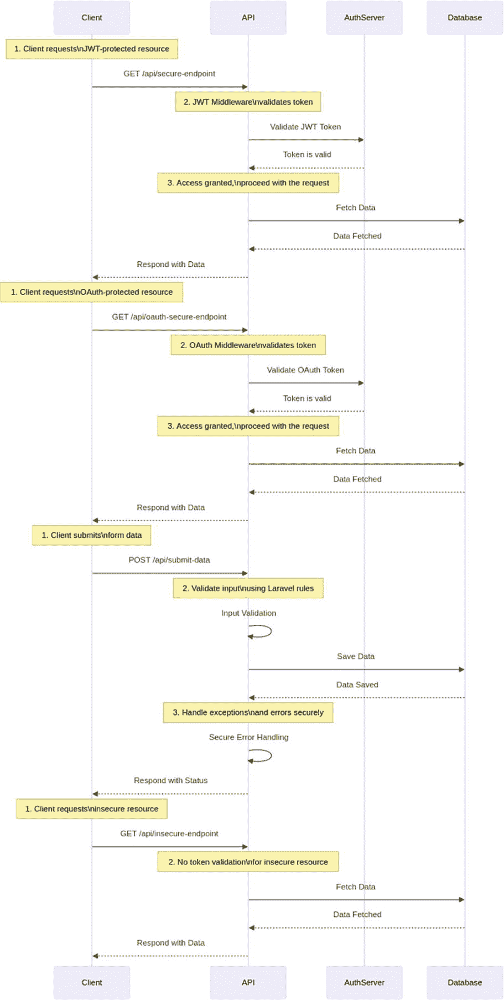

# 5. 安全标准与最佳实践

在 Web 应用开发日新月异的格局中，确保强健的安全至关重要。本章深入探讨了对 PHP 应用开发至关重要的关键安全标准和最佳实践。本章将探讨 OWASP Top Ten（开放式 Web 应用安全项目十大风险），重点介绍最常见的 Web 应用安全风险，并就实施安全编码实践和进行彻底的代码审查提供指导。内容将涵盖安全认证和授权机制，以保护用户数据并确保适当的访问控制。此外，本章还将讨论安全测试和漏洞评估的方法，以识别和缓解潜在威胁。最后，将涉及安全部署和 DevOps 方面的考量，强调在整个开发生命周期中集成安全的重要性。通过遵循这些标准和最佳实践，开发者可以显著增强其 PHP 应用的安全性，保护应用及其用户免受恶意攻击。

在 PHP 安全方面，需要遵循几个关键标准和最佳实践，以降低潜在风险并保护 Web 应用免受各种漏洞的攻击。输入验证是一项基础性的安全措施。确保用户输入在处理前经过彻底验证和清理，有助于防止 SQL 注入和跨站脚本（XSS）等常见攻击。PHP 提供了 `filter_var()` 和 `htmlspecialchars()` 等函数，用于辅助输入验证和输出编码。

安全配置设置在最小化攻击面方面起着至关重要的作用。应对 PHP 配置进行微调，以禁用不必要的特性和函数。例如，应关闭 `allow_url_fopen` 设置，以防止远程文件包含漏洞。定期将 PHP 更新到最新的稳定版本至关重要，因为每个版本通常都包含针对新兴威胁的安全补丁和改进。

安全编码实践包括实施最小权限原则。这意味着仅授予用户和进程执行其任务所需的最低访问权限。应建立强大的用户认证和授权机制，确保只有经过认证和授权的用户才能执行敏感操作。密码必须使用强健的算法进行安全哈希处理，并且敏感数据在传输和存储过程中都应加密。采用 HTTPS 等安全通信协议对于防止数据拦截和篡改至关重要。

持续监控和主动措施对于维护 PHP 应用的安全至关重要。定期的安全审计、代码审查以及使用自动化工具进行漏洞扫描，有助于发现和解决潜在的安全问题。通过积极参与 PHP 社区来及时了解最新的安全威胁和补丁，并坚持既定的安全最佳实践，是 PHP 应用强健安全策略的关键组成部分。

## OWASP Top Ten：关键的 Web 应用安全风险

OWASP（开放式 Web 应用安全项目）Top Ten 是一份被广泛认可的文档，列出了最关键的 Web 应用安全风险。下面我们来讨论关于 OWASP Top Ten 的一些关键思考，以及如何在 PHP 中使用 Laravel 框架处理这些风险。

### 注入（SQL、NoSQL、OS）

当不可信数据作为命令或查询的一部分发送给解释器时，就会发生注入漏洞，导致未经授权的访问或远程代码执行。

Laravel 中的解决方案：可以使用 Laravel 的 Eloquent ORM 或查询构建器使用参数化查询来防止 SQL 注入。

```
$users = DB::table('users')->where('email', $email)->get();
```

### 跨站脚本（XSS）

XSS 漏洞涉及向网页注入恶意脚本，使攻击者能够窃取用户数据或篡改内容。

Laravel 中的解决方案：可以利用 Laravel 的 Blade 模板引擎，它默认会自动转义输出，从而防止 XSS 攻击。

```
{{ $userInput }}
```

### 失效的身份认证

身份验证机制中的弱点可能导致未经授权的访问、用户账户被盗或会话劫持。

Laravel 中的解决方案：可以充分利用 Laravel 的内置身份验证系统，包括安全的密码哈希和会话管理。

```
if (Auth::attempt(['email' => $email, 'password' => $password])) {
    // 认证成功
}
```

### 安全配置错误

当系统配置不安全时，会发生安全配置错误，导致敏感信息泄露或提供未经授权的访问。

Laravel 中的解决方案：可以定期审查和审计 Laravel 的配置文件，并对敏感设置使用环境变量。

```
'default' => env('DB_CONNECTION', 'mysql'),
'connections' => [
    'mysql' => [
        'host' => env('DB_HOST', 'default-host'),
        // ...
    ],
],
```

### 敏感数据泄露

此风险涉及泄露敏感信息，可能导致数据泄露。

Laravel 中的解决方案：可以使用 Laravel 的加密功能对敏感数据进行加密，并避免将敏感信息存储在客户端存储中。

```php
<?php
// 在 Laravel 中加密数据的示例
$encrypted = encrypt($sensitiveData);
?>
```

### 功能级访问控制缺失

功能级别访问控制不充分可能导致未经授权的用户执行敏感操作。

Laravel 中的解决方案：可以在应用逻辑中使用 Laravel 中间件和策略实施适当的访问控制。

```php
Route::middleware(['auth', 'admin'])->group(function () {
    // 仅管理员可访问的路由
});
```


### 跨站请求伪造 (CSRF)

CSRF 攻击会诱骗用户在已认证的网站上无意中执行某些操作。

Laravel 的解决方案：Laravel 内置了 CSRF 保护功能。我们可以在表单中包含 CSRF 令牌来确保安全。

```
@csrf
```

### 使用含有已知漏洞的组件

当应用程序集成过时或存在漏洞的第三方组件时，就会引发此问题。

Laravel 的解决方案：我们可以定期更新 Laravel 及其依赖项，并关注 Laravel 及第三方包的安全公告。

```
bash
### 更新 Laravel 依赖项
composer update
```

### 未经验证的重定向与转发

未经验证的重定向和转发可能允许攻击者将用户重定向到恶意网站。

Laravel 的解决方案：我们需要避免使用用户输入来构建重定向 URL，而应使用 Laravel 的命名路由来安全地生成 URL。

```
route('dashboard');
```

这些代码示例展示了如何利用 Laravel 的特性和最佳实践来应对 OWASP 十大安全风险。重要的是要将这些实践整合到开发流程中，并持续关注 Laravel 以及整个 Web 应用安全领域的最新安全考量。

## 安全编码实践与代码审查

安全编码实践和代码审查对于确保我们软件应用的安全性和稳健性至关重要。当我们编写安全代码时，我们采取主动的方法，在开发阶段识别并缓解漏洞，这有助于降低软件投入生产后发生安全漏洞的风险。代码审查则通过让同行或安全专家参与来补充这一过程，他们能提供宝贵的见解，识别潜在问题，并强制执行编码标准。让我们探讨一下安全编码实践和代码审查对我们至关重要的几个关键原因。

首先，通过聚焦风险缓解，我们可以在开发过程早期识别并解决安全漏洞。这种主动方法有助于降低被恶意行为者利用的风险，确保我们的应用从一开始就是安全的。

其次，遵守安全编码实践有助于我们满足行业法规和标准（如 GDPR、HIPAA 或 PCI DSS）的合规性要求。这种遵从性确保我们的应用不仅安全，而且合法合规，保护我们免受潜在的监管问题困扰。

第三，当我们遵循安全编码实践时，我们有助于提高代码的可维护性和可读性。这让我们以及同行开发者更容易理解和修改代码，而不会引入安全风险，从而促进更协作、更高效的开发环境。

第四，对我们而言，在开发阶段解决安全问题更具成本效益。通过尽早修复安全问题，我们能够节省资源，并避免在部署后解决这些问题所产生的高昂成本。这种方法让我们能更有效地分配预算，避免不必要的开支。

最后，通过开发安全的应用，我们可以在用户和利益相关者之间建立信任，维护我们组织及其产品的声誉。安全应用表明我们致力于保护用户数据并维持高标准的安全，这对我们的成功和声誉至关重要。

### PHP 中的安全编码实践

在 PHP 中实施安全编码实践对于开发稳健且安全的 Web 应用至关重要。通过遵循这些最佳实践，我们可以保护应用免受常见漏洞的侵害，并确保用户数据的安全。

### 输入验证与清理

输入验证和清理是基础实践。我们需要验证并清理所有用户输入，以防止注入攻击。例如，我们可以使用 `filter_input` 函数来清理用户名等输入字段：

```
<?php
$username = filter_input(INPUT_POST, 'username', FILTER_SANITIZE_STRING);
```

通过这样做，我们确保进入应用的任何数据都是干净且安全的，从而降低恶意代码被执行的风险。

### 密码处理

安全地处理密码是另一个关键方面。我们应始终使用强哈希算法（如 bcrypt）来存储密码。PHP 中的 `password_hash` 函数允许我们安全地对密码进行哈希处理，即使攻击者获得了数据库访问权限，也难以破解密码：

```
<?php
$hashedPassword = password_hash($password, PASSWORD_BCRYPT);
```

### 会话管理

会话管理在保护应用安全方面也起着至关重要的作用。通过实施安全的会话管理技术，我们可以防止会话劫持。这包括使用 `session_start` 安全地启动会话，并确保用户在与应用交互的整个过程中会话数据都得到保护：

```
<?php
session_start();
```

### 错误处理

正确的错误处理对于防止在生产环境中泄露敏感信息至关重要。我们不应向用户显示详细的错误信息，而应使用自定义错误处理器来记录错误。这样，我们可以在不向潜在攻击者暴露关键信息的情况下，保留用于调试的日志：

```
<?php
// 设置自定义错误处理器
set_error_handler("customErrorHandler");
function customErrorHandler($errno, $errstr, $errfile, $errline) {
// 记录错误而非显示给用户
error_log("Error: $errstr in $errfile on line $errline");
}
```

### 文件上传安全

如果我们的应用允许文件上传，我们必须确保这些上传是安全的。这包括验证文件类型、将文件存储在安全位置以及生成唯一的文件名。例如，我们可以在处理和存储上传文件之前，检查其 MIME 类型以确保符合安全要求：

```
<?php
// PHP 文件上传验证示例
$allowedTypes = ['image/jpeg', 'image/png'];
if (in_array($_FILES['file']['type'], $allowedTypes)) {
// 安全地处理和存储文件
} else {
// 处理无效文件类型
}
```

### 跨站请求伪造 (CSRF) 令牌

为了防止跨站请求伪造 (CSRF) 攻击，我们应在表单中包含 CSRF 令牌，并在每次表单提交时刷新这些令牌。使用 `random_bytes` 生成新令牌并将其存储在会话中，有助于防止代表用户执行未经授权的操作：

```
<?php
// 生成并刷新 CSRF 令牌
$token = bin2hex(random_bytes(32));
$_SESSION['csrf_token'] = $token;
```

### 数据验证与清理

数据验证和清理与输入验证相辅相成。通过使用 PHP 过滤器函数，我们可以验证并清理电子邮件地址等输入，确保它们在处理前符合应用的要求：

```
<?php
// 使用 PHP 过滤器函数进行输入验证的示例
$email = filter_var($_POST['email'], FILTER_VALIDATE_EMAIL);
```

### 密码找回安全

对于安全的密码找回，我们应实施防止未经授权访问用户账户的机制。使用有时间限制的重置令牌（在一定时间后过期），可以为密码找回过程增加一层额外的安全保护：

```
<?php
// 生成有时间限制的重置令牌的示例
$resetToken = bin2hex(random_bytes(32));
$resetExpiration = time() + 3600; // 令牌在 1 小时后过期
```

### 内容安全策略 (CSP)

实施内容安全策略 (CSP) 有助于降低跨站脚本 (XSS) 攻击的风险。通过设置 CSP 头，我们可以指定允许哪些内容源，从而限制潜在有害脚本的执行。例如，我们可以配置 CSP 头，仅允许来自受信任源的脚本执行：

```
<?php
// 在 PHP 中设置 CSP 头的示例
header("Content-Security-Policy: default-src 'self'; script-src 'self' https://example.com");
```


### 数据库连接安全

保障数据库连接的安全是另一项关键实践。我们应使用强凭据，并将数据库用户权限限制在所需的最低限度。建立安全连接，例如使用带有适当错误处理的 `mysqli`，可确保我们的应用与数据库之间的通信是安全的：

```
$conn = new mysqli($servername, $username, $password, $dbname);
if ($conn->connect_error) {
    die("Connection failed: " . $conn->connect_error);
}
```

### 会话安全

通过使用安全的会话设置以及登录后重新生成会话 ID，可以进一步加强会话安全。这有助于防止会话固定攻击，并确保在整个用户会话期间会话数据保持安全：

```php
<?php
// 使用安全会话设置的示例
ini_set('session.cookie_secure', 1);
ini_set('session.cookie_httponly', 1);
```

### SSL/TLS 的使用

使用 SSL/TLS 加密传输中的数据至关重要。我们应始终对 Web 应用强制使用 HTTPS，以保护客户端与服务器之间交换的数据。将 HTTP 请求重定向到 HTTPS，可以确保所有通信都经过加密，从而保护敏感信息免受潜在的窃听：

```php
<?php
// 在 PHP 中强制启用 HTTPS 的示例
if ($_SERVER['HTTPS'] !== 'on') {
    header("Location: https://" . $_SERVER['HTTP_HOST'] . $_SERVER['REQUEST_URI']);
    exit();
}
```

采用这些额外的安全编码实践能够增强 PHP 应用的整体安全性，为常见的 Web 应用漏洞提供强大的防御能力。

## Laravel 中的安全编码实践

在 Laravel 中实施安全编码实践对于开发健壮且安全的 Web 应用至关重要。通过遵循这些最佳实践，我们可以保护应用免受常见漏洞的攻击，并确保用户数据的安全。

### 认证与授权中间件

认证与授权中间件是一个关键方面。我们可以使用 Laravel 中间件来高效地处理认证和授权检查。中间件允许我们在多个路由上应用特定的检查，确保只有经过认证和授权的用户才能访问我们应用的特定部分：

```php
Route::group(function () {
    // 仅限管理员的路由
});
```

### 使用 Laravel 的认证系统

利用 Laravel 内建的认证系统并结合 Breeze 包是非常有益的。Breeze 提供了一套全面的认证设置，包括安全的密码哈希、会话管理以及多因素认证等功能。通过使用 Breeze，我们可以快速安全地搭建认证组件，减少因实现自定义且可能不安全的认证机制所带来的风险：

```bash
#### 安装 Breeze 包
composer require laravel/breeze --dev
#### 安装 Breeze 脚手架
php artisan breeze:install
#### 运行数据库迁移
php artisan migrate
#### 安装前端资源
npm install && npm run dev
```

### 使用请求进行验证

对于输入验证，使用表单请求（Form Requests）可以让我们集中管理验证逻辑，并使控制器保持整洁。表单请求是专门的类，我们在其中定义验证规则，确保输入验证在整个应用中保持一致且可复用：

```php
'email' => 'required|email',
'password' => 'required|min:8',
];
}
```

### 使用策略和门卫进行授权

通过策略（Policies）和门卫（Gates）可以有效地处理授权，提供细粒度的访问控制。通过使用 `php artisan make:policy MyModelPolicy` 生成策略，我们可以定义复杂的授权逻辑并将其应用于模型，确保用户拥有执行操作的适当权限：

```php
<?php
// 使用 Laravel 策略的示例
if (Gate::allows('update-post', $post)) {
    // 用户被授权更新该文章
}
```

### 安全地使用 Eloquent ORM

使用 Laravel 的 Eloquent ORM 进行数据库交互有助于防范 SQL 注入。Eloquent 提供了流畅且富有表现力的数据库查询接口，能够自动转义输入并防止注入攻击。我们应避免在查询中直接使用用户输入，而是依赖 Eloquent 方法进行过滤和排序：

```php
$user = User::where('email', $email)->first();
```

### 跨站请求伪造（CSRF）保护

Laravel 包含内建的跨站请求伪造（CSRF）保护，我们应通过在表单中包含 CSRF 令牌来利用这一机制。这种保护有助于防止代表已认证用户提交恶意表单：

```blade
@csrf
```

### 安全的会话管理

安全的会话管理对于防止会话固定攻击至关重要。我们应实施安全的会话设置，并在登录后重新生成会话 ID。这可以在 `config/session.php` 文件中进行配置，以确保会话数据得到保护：

```php
'secure' => env('SESSION_SECURE_COOKIE', true),
'same_site' => 'lax',
```

### 内容安全策略（CSP）

实施内容安全策略（CSP）头信息有助于通过指定允许加载的内容源来减轻跨站脚本（XSS）攻击的风险。设置 CSP 头信息可以限制潜在有害脚本的执行：

```php
<?php
// 在 Laravel 中设置 CSP 头信息的示例
header("Content-Security-Policy: default-src 'self'; script-src 'self' https://example.com");
```

### 使用依赖注入

使用依赖注入而非全局函数或门面（Facades），可以提高代码的可测试性并降低注入攻击的风险。通过构造函数或方法参数注入依赖，我们可以创建更模块化、更易于测试的代码：

```php
class MyController
{
    protected $service;
    public function __construct(MyService $service)
    {
        $this->service = $service;
    }
}
```

### 数据库迁移与数据填充

Laravel 的迁移（Migrations）和数据填充（Seeders）为数据库模式的版本控制和初始数据填充提供了一种安全的方式。迁移允许我们定义模式变更，而数据填充则用于向数据库填充初始数据：

```php
Schema::create('users', function (Blueprint $table) {
    $table->id();
    $table->string('name');
    // ... 其他字段
    $table->timestamps();
});
```

### 使用 HTTPS

始终使用 HTTPS 加密传输中的数据至关重要。我们可以通过配置 Web 服务器将 HTTP 流量重定向到 HTTPS，并确保 Laravel 在生产环境中强制使用 HTTPS：

```php
<?php
// 在 Laravel 中强制使用 HTTPS 的示例
if (App::environment('production')) {
    URL::forceScheme('https');
}
```

遵循 Laravel 中的这些安全编码实践，有助于我们创建更能抵御常见 Web 漏洞的应用。


好的，作为高级文档工程师和翻译员，我将严格遵循您提供的格式要求，将给定的英文文本翻译成中文。


### 代码审查

代码审查在提升软件应用的安全性方面起着至关重要的作用。一个显著的优势是能够**及早发现安全漏洞**。通过在开发过程的早期审查代码，团队可以在安全问题深入嵌入软件之前就发现并修复它们。这种主动策略不仅更具成本效益，也有助于在整个应用生命周期中维护其完整性。

此外，代码审查促进了团队成员间的知识共享和培训。高级开发者可以在审查过程中，通过分享最佳实践和安全指南来指导初级开发者。这种协作环境培养了一个具有安全意识的开发团队，确保所有成员都了解最新的安全协议和技术。

**遵守安全标准**是代码审查的另一个关键好处。这些审查确保开发者遵循既定的安全标准和编码规范，从而在整个应用中维护一个一致且安全的代码库。这种一致性对于创建可靠且安全的软件产品至关重要。

此外，代码审查有助于**防止常见的安全陷阱**。通过仔细检查代码，审查者可以发现诸如输入验证问题、不安全的编码模式以及不充分的错误处理等问题。这种主动方法一开始就防止了安全漏洞被引入代码库。

**验证安全控制**是代码审查的另一个重要方面。审查者可以验证身份验证、授权和加密等安全功能是否已正确实现并按预期运行。这种验证确保了应用的安全机制能提供必要的保护来抵御威胁。

在代码审查期间，开发者还可以进行**威胁建模和风险评估**。这些讨论有助于识别代码库中潜在的安全威胁并评估风险。通过精确定位高风险区域，团队可以优先处理安全措施并更有效地分配资源。

代码审查在开发团队中**促进了持续改进的文化**。通过从过去的错误中学习并应用经验教训，团队可以持续加深对安全最佳实践的理解。这种持续的学习过程有助于随着时间的推移提升软件的整体安全态势。

此外，代码审查有助于**确保符合法规要求**。许多行业都有与软件安全相关的特定标准和法规。定期的代码审查可确保代码库遵守这些规定，从而降低法律和财务风险。

定期代码审查的另一个关键好处是**早期检测安全问题**。通过在开发过程早期识别安全问题，团队可以及时处理它们，从而降低漏洞进入生产环境的可能性。

代码审查有助于**在开发团队内部建立安全意识文化**。当安全考虑成为开发过程中不可或缺的一部分时，软件的整体安全态势就会得到改善。这种优先考虑安全的文化转变有助于创建更具弹性和安全的应用。

#### 同行评审

同行评审是软件开发中的一项基本实践，它让同事参与到代码审查过程中，以识别问题并提供不同的视角。定期的同行评审侧重于各个方面，例如代码可读性、编码规范的遵守情况以及安全考虑。通过纳入多个视角，我们可以发现单个开发者可能忽略的潜在问题，从而提升代码的整体质量和安全性。

#### 静态代码分析

除了同行评审之外，将静态代码分析工具集成到开发工作流程中可以显著提高代码安全性。`PHPStan`、`Psalm` 或 `PHP_CodeSniffer` 等工具会自动分析代码以识别潜在的安全漏洞。这些工具提供关于代码问题的即时反馈，使开发者能够在开发过程的早期解决安全问题。

#### 安全检查工具和扫描器

安全检查工具和扫描器在检测常见安全问题方面发挥着至关重要的作用。利用诸如 `OWASP Dependency-Check` 之类的专门工具可以帮助识别第三方依赖项中的漏洞。这种主动方法确保了项目中使用的外部库和框架不会引入安全风险，从而维护了应用的完整性。

#### 基于清单的审查

基于清单的审查是确保安全覆盖全面性的另一种有效方法。通过在代码审查期间制定并遵守安全检查清单，我们可以系统地验证所有关键安全方面都已得到处理。清单中应包含诸如输入验证、身份验证和授权检查、数据加密以及错误处理等项目，以确保对代码安全状态进行彻底检查。

#### 自动化测试

自动化测试，特别是侧重于安全的自动化测试，对于验证安全控制的有效性至关重要。在自动化测试套件中包含安全特定的测试用例，例如渗透测试或安全单元测试，有助于持续识别和缓解漏洞。这种自动化方法确保了安全检查在整个开发生命周期中得到一致应用，在潜在问题进入生产环境之前就将其捕获。

通过将这些安全编码实践和代码审查策略整合到开发过程中，我们可以创建更具弹性和安全性的 PHP 和 Laravel 应用。这些实践有助于在开发团队中建立安全意识文化，最终产出更健壮、更可靠的软件产品。

## Laravel 中的安全相关包

Laravel 中的自定义 Composer 包在增强应用的安全性、可扩展性和可维护性方面发挥着至关重要的作用。这些包允许您封装和共享可复用的代码片段，减少跨项目的重复，并促进模块化开发。在安全方面，自定义 Composer 包可以为常见的安全问题提供解决方案，例如身份验证、授权和输入验证。让我们讨论一些 Laravel 中与安全相关的重要自定义 Composer 包，以及如何使用它们的示例。

### Laravel Bouncer（用于授权）

Laravel Bouncer 是一个用于处理复杂授权逻辑的强大包。它允许您轻松地定义和管理角色与权限。

用法：

-   使用 Composer 安装该包：
```
bash
composer require silber/bouncer
```

-   设置并迁移 Bouncer 的数据表：
```
bash
php artisan bouncer:install
```

-   在代码中定义权限和角色：
```
to('edit-users');
```

-   在您的应用中检查授权：
```
<?php
// 检查授权的示例
if (Bouncer::can('edit-users')) {
    // 用户被授权编辑用户
}
```

### Laravel Sanctum（用于 API 身份验证）

Laravel Sanctum 提供了一种基于令牌的身份验证方式来验证 API 的简单便捷的方法。

用法：

-   使用 Composer 安装该包：
```
bash
composer require laravel/sanctum
```

-   发布并运行迁移：
```
bash
php artisan vendor:publish --provider="Laravel\Sanctum\SanctumServiceProvider"
php artisan migrate
```

-   将 Sanctum 的中间件添加到您的 API 路由中：
```
get('/user', function () {
    return Auth::user();
});
```

-   颁发 API 令牌：
```
createToken('token-name')->plainTextToken;
```


### Laravel Debugbar（用于调试和分析性能）

`Laravel Debugbar` 是一个开发包，可以帮助你深入了解应用的性能，并允许你调试和分析请求。

使用方法：

- 通过 Composer 安装该包：
  ```bash
  composer require barryvdh/laravel-debugbar --dev
  ```
- 将服务提供者添加到你的 `config/app.php` 文件中：
  ```php
  // ...
  Barryvdh\Debugbar\ServiceProvider::class,
  ],
  ```
- （可选）发布配置文件：
  ```bash
  php artisan vendor:publish --provider="Barryvdh\Debugbar\ServiceProvider"
  ```
- 在应用中访问调试工具栏：
  ```php
  <?php
  // 访问调试工具栏的示例
  $debugbar = app('debugbar');
  ```

### Laravel Scout（用于全文搜索）

`Laravel Scout` 是一个功能强大的包，用于为你的应用程序添加全文搜索功能。

使用方法：

- 通过 Composer 安装该包：
  ```bash
  composer require laravel/scout
  ```
- 发布配置文件：
  ```bash
  php artisan vendor:publish --provider="Laravel\Scout\ScoutServiceProvider"
  ```
- 在你的模型中实现搜索功能：
  ```php
  <?php
  // 在模型中使用 Laravel Scout 的示例
  use Laravel\Scout\Searchable;
  class Post extends Model
  {
      use Searchable;
  }
  ```
- 为数据建立索引：
  ```bash
  php artisan scout:import "App\Post"
  ```
- 执行搜索：
  ```php
  get();
  ```

### Laravel Telescope（用于监控和调试）

`Laravel Telescope` 能够让你深入了解进入应用的请求、异常、日志条目、数据库查询等。

使用方法：

- 通过 Composer 安装该包：
  ```bash
  composer require laravel/telescope --dev
  ```
- 发布静态资源并迁移数据库：
  ```bash
  php artisan telescope:install
  php artisan migrate
  ```
- 将服务提供者添加到你的 `config/app.php` 文件中：
  ```php
  // ...
  Laravel\Telescope\TelescopeServiceProvider::class,
  ],
  ```
- 在应用中访问 Telescope 仪表盘：
  ```php
  <?php
  // 访问 Telescope 仪表盘的示例
  Route::get('/telescope', function () {
      return view('telescope');
  });
  ```

### Laravel Nova（用于管理后台）

`Laravel Nova` 是一个设计精美的 Laravel 应用管理后台，提供便捷的方式来管理应用数据。

使用方法：

- 通过 Composer 安装该包：
  ```bash
  composer require laravel/nova
  ```
- 发布静态资源并运行迁移：
  ```bash
  php artisan nova:install
  php artisan migrate
  ```
- 在应用中访问 Nova 仪表盘：
  ```php
  <?php
  // 访问 Nova 仪表盘的示例
  Route::get('/nova', function () {
      return view('nova');
  });
  ```

### Spatie Laravel Activitylog（用于活动日志记录）

该包提供了一种简单的方式来记录 Laravel 应用中的活动，有助于跟踪变更和监控用户操作。

使用方法：

- 通过 Composer 安装该包：
  ```bash
  composer require spatie/laravel-activitylog
  ```
- 发布迁移文件并运行：
  ```bash
  php artisan vendor:publish --provider="Spatie\Activitylog\ActivitylogServiceProvider" --tag="migrations"
  php artisan migrate
  ```
- 在应用中记录活动：
  ```php
  activity()->log('用户执行了某个操作。');
  ```

### Intervention Image（用于图像处理）

`Intervention Image` 是一个强大的 Laravel 图像处理库，提供图像缩放、裁剪和操作等功能。

使用方法：

- 通过 Composer 安装该包：
  ```bash
  composer require intervention/image
  ```
- 在你的 Laravel 应用中使用该包：
  ```php
  Image::make('path/to/image.jpg')->resize(300, 200)->save('path/to/resized_image.jpg');
  ```

### Laravel Dusk（用于浏览器测试）

`Laravel Dusk` 是一个富有表现力且易于使用的 Laravel 应用浏览器测试和自动化工具。

使用方法：

- 通过 Composer 安装该包：
  ```bash
  composer require --dev laravel/dusk
  ```
- 设置 Dusk 并创建一个示例测试：
  ```bash
  php artisan dusk:install
  php artisan dusk
  ```
- 编写浏览器测试：
  ```php
  $browser->browse(function ($browser) {
      $browser->visit('/')
             ->assertSee('欢迎使用 Laravel');
  });
  ```

### Laravel Medialibrary（用于媒体管理）

**重要性：** 该包简化了媒体管理，允许你将文件与 Eloquent 模型关联，并轻松处理文件上传和转换。

使用方法：

- 通过 Composer 安装该包：
  ```bash
  composer require spatie/laravel-medialibrary
  ```
- 发布配置文件并运行迁移：
  ```bash
  php artisan vendor:publish --provider="Spatie\MediaLibrary\MediaLibraryServiceProvider" --tag="migrations"
  php artisan migrate
  ```
- 将媒体附加到你的 Eloquent 模型上：
  ```php
  $media = $model->addMedia($pathToImage)->toMediaCollection('images');
  ```

这些自定义 Composer 包展示了 Laravel 及其生态系统的多功能性，为各种与安全相关的问题提供了解决方案。虽然这些包增强了安全性和功能性，但保持它们更新并遵循保护 Laravel 应用安全的最佳实践至关重要。我们应该始终查阅每个包的文档以了解最新的使用说明和功能。

## 安全的身份验证和授权机制

安全的身份验证和授权机制是任何 Web 应用的基本组成部分，它们确保用户有权访问正确的资源，同时保护敏感信息。在 PHP、Laravel 以及一般的 Web 开发中，实施强大的身份验证和授权对于保护用户数据和维护应用的整体安全性至关重要。

### 安全身份验证和授权的重要性

安全的身份验证和授权是开发安全 Web 应用的关键组成部分。这些机制不仅能保护敏感数据，还能增强用户信任、确保合规性，并防止对关键资源的未授权访问。

数据保护是实施安全身份验证的首要原因。通过确保只有授权用户才能访问其帐户和敏感信息，我们能够保护用户隐私并防止数据泄露。安全身份验证机制，例如多因素身份验证和强密码策略，能够显著降低未授权访问的风险，确保个人和机密数据的安全。

可靠的认证系统能极大地增强用户信任。当用户知道他们的数据受到保护，并且应用认真对待安全问题时，他们对应用的信心就会增加。这种信任对于留住用户和提高用户满意度至关重要，因为用户更有可能持续使用并推荐他们认为安全的应用。

遵守通用数据保护条例（**GDPR**）等监管标准是另一个关键方面。许多法规要求实施安全身份验证和访问控制措施来保护用户数据。通过遵守这些要求，我们不仅可以避免法律处罚，还能展示我们对数据安全和用户隐私的承诺。这种合规性对于维护组织的声誉和可信度至关重要。

防止未授权访问是强大授权机制的一项基本功能。通过确保用户只能访问他们被授权的资源，我们可以防止对敏感功能和数据的未授权访问。这在具有多个用户角色和权限的应用中尤为重要，因为必须严格执行访问控制策略才能维护系统的完整性和安全性。


### PHP 中的安全认证与授权

`密码哈希`：我们应该使用强加密哈希算法（如 `bcrypt`）来安全地存储密码。

```php
<?php
// PHP 中的密码哈希示例
$hashedPassword = password_hash($plainPassword, PASSWORD_BCRYPT);
```

`会话管理`：我们应该实现安全的会话管理，以防止会话劫持和固定攻击。

```php
<?php
// PHP 中的会话启动和安全设置示例
session_start();
session_regenerate_id(true);
```

我们来讨论一些用于安全认证和授权的 `Composer` 包。

### Laravel Sanctum（用于 API 认证）

`Laravel Sanctum` 提供了一种简单便捷的方式，使用基于令牌的认证来保护 API。

使用方法：

-   使用 `Composer` 安装该包：
    ```bash
    composer require laravel/sanctum
    ```
-   发布并运行迁移：
    ```bash
    php artisan vendor:publish --provider="Laravel\Sanctum\SanctumServiceProvider"
    php artisan migrate
    ```
-   将 `Sanctum` 的中间件添加到你的 API 路由中：
    ```php
    get('/user', function () {
    return Auth::user();
    });
    ```
-   发放 API 令牌：
    ```php
    createToken('token-name')->plainTextToken;
    ```

### Laravel Passport（用于 OAuth2）

`Laravel Passport` 提供了一个完整的 OAuth2 服务器实现，用于保护 API 路由并允许第三方认证。

使用方法：

-   使用 `Composer` 安装该包：
    ```bash
    composer require laravel/passport
    ```
-   运行迁移：
    ```bash
    php artisan migrate
    ```
-   安装 `Passport` 并生成密钥：
    ```bash
    php artisan passport:install
    ```
-   在你的路由中使用 `Passport` 中间件：
    ```php
    get('/user', function () {
    return Auth::user();
    });
    ```

### Laravel Breeze（用于启动套件）

`Laravel Breeze` 为 `Laravel` 应用提供了一个包含安全认证机制的最小化且可定制的启动套件。

使用方法：

-   使用 `Composer` 安装该包：
    ```bash
    composer require laravel/breeze --dev
    ```
-   设置并发布 `Breeze` 的资源：
    ```bash
    php artisan breeze:install
    ```

### Laravel Fortify（用于自定义认证）

`Laravel Fortify` 提供了一个灵活的解决方案，用于自定义认证功能，包括密码重置和双重认证。

使用方法：

-   使用 `Composer` 安装该包：
    ```bash
    composer require laravel/fortify
    ```
-   发布 `Fortify` 的配置和视图：
    ```bash
    php artisan vendor:publish --provider="Laravel\Fortify\FortifyServiceProvider"
    ```
-   在应用中自定义配置并使用 `Fortify` 的功能。

#### 附加技术与最佳实践

##### OAuth2 和 OpenID Connect

我们应该实现 OAuth2 和 OpenID Connect 以实现安全、标准化的认证和授权，特别是在第三方集成的场景下。让我们看看使用 `Laravel Passport` 实现 OAuth2：

安装 `Laravel Passport`：
```bash
composer require laravel/passport
php artisan migrate
php artisan passport:install
```

创建 OAuth2 服务器：
```php
registerPolicies();
Passport::routes();
Passport::tokensExpireIn(now()->addDays(7));
Passport::refreshTokensExpireIn(now()->addDays(30));
}
```

然后使用 OAuth2 中间件保护路由：
```php
get('/user', function () {
return Auth::user();
});
```

##### JWT（JSON Web Tokens）

我们应该使用 JWT 实现无状态认证，并在各方之间安全地传输声明。下面我们来实现其用法：

安装 `tymon/jwt-auth` 包：
```bash
composer require tymon/jwt-auth
php artisan vendor:publish --provider="Tymon\JWTAuth\Providers\LaravelServiceProvider"
php artisan jwt:secret
```

在 `config/auth.php` 中配置 JWT：
```php
 [
'api' => [
'driver' => 'jwt',
'provider' => 'users',
],
],
```

生成并验证 JWT 令牌：
```php
authenticate();
```

##### 双重认证（2FA）

我们应该实现双重认证，为系统增加一层安全防护，尤其对于拥有高权限的用户账户。

安装 `Laravel 2FA` 包：
```bash
composer require pragmarx/google2fa-laravel
```

在 `User` 模型中启用双重认证：
```php
id) != null;
}
}
```

生成并验证双重认证令牌：
```php
generateSecretKey();
// 验证双重认证令牌的示例
$isValid = $google2fa->verifyKey($secret, $user->google2fa_secret, $request->input('2fa_token'));
```

##### 基于角色的访问控制（RBAC）

我们应该实现 RBAC 以实现精细化的访问控制，允许不同用户在应用内拥有不同级别的访问权限。

使用 `Laravel Gate` 进行授权：
```php
registerPolicies();
Gate::define('edit-settings', function ($user) {
return $user->role === 'admin';
});
}
```

使用 `Gate` 中间件保护路由：
```php
group(function () {
// 仅允许拥有 'admin' 角色的用户访问的路由
});
```

##### LDAP 集成

在**企业级**环境中，我们可以集成 LDAP 以实现集中式认证和授权。

安装 `Adldap2/Adldap2-Laravel` 包：
```bash
composer require adldap2/adldap2-laravel
```

在 `config/ldap.php` 中配置 LDAP：
```php
 [
'default' => [
'auto_connect' => env('LDAP_AUTO_CONNECT', false),
'connection' => Adldap\Connections\Ldap::class,
'settings' => [
// LDAP 设置
],
],
],
];
```

使用 LDAP 认证用户：
```php
 $username, 'password' => $password])) {
// 用户已认证
}
```

实现安全认证和授权是一个持续的过程，了解新兴的安全威胁和最佳实践至关重要。请记住，要根据你的具体用例、应用结构和认证提供方来调整这些示例。这些是帮助你开始在 PHP 和 `Laravel` 应用中实施上述技术和最佳实践的起点。

## 安全测试与漏洞评估

安全测试与漏洞评估在识别和解决软件应用中潜在安全风险方面扮演着关键角色。进行这些评估有助于确保你的系统健壮、有弹性，并且不易受到安全威胁。以下是安全测试、漏洞评估以及在 PHP 应用、`Composer` 包和云环境上下文中的相关工具与实践的关键方面。


### 安全测试与漏洞评估的重要性

安全测试对于保护我们的软件安全至关重要。它有助于我们在恶意行为者利用漏洞之前发现薄弱环节，从而降低安全漏洞的风险。例如，如果在测试中发现登录系统的漏洞，我们可以在黑客利用其进行未授权访问之前进行修复。

许多行业和监管标准也要求定期进行安全评估，以确保我们遵守安全和隐私法规。例如，金融机构必须遵守严格的准则来保护客户信息，而定期安全测试有助于它们满足这些要求。

通过主动解决安全漏洞，我们能够建立用户和客户对我们的信任，这有助于维护我们组织的声誉。如果用户知道我们重视安全并持续努力保护他们的数据，他们就更有可能信赖我们的服务。例如，一家能够及时修复安全问题并与用户透明沟通的公司，会被视为更可靠。

此外，在开发初期发现并修复安全问题可以节省资金，因为这远比安全漏洞发生后再处理要经济得多。例如，在开发阶段修复一个漏洞可能成本较低，但如果同一个漏洞在线上系统中被利用，可能会导致重大财务损失和公司声誉受损。因此，早期发现并解决安全问题不仅有效，而且经济。

### 安全测试与漏洞评估实践

#### 静态应用安全测试（SAST）

静态应用安全测试（SAST）涉及在不执行程序的情况下分析我们的 PHP 代码以发现安全漏洞。这种做法对于在开发生命周期早期发现潜在问题至关重要。SAST 有助于我们在代码部署之前识别并修复安全缺陷，从而降低生产环境中的安全漏洞风险。通过使用 `PHPStan` 或 `Psalm` 等工具，我们可以确保代码遵循安全最佳实践，进而增强应用程序的整体安全态势。

```bash
##### 使用 PHPStan 的示例
composer require --dev phpstan/phpstan
vendor/bin/phpstan analyse
```

#### 动态应用安全测试（DAST）

动态应用安全测试（DAST）通过模拟真实世界的攻击来测试正在运行的应用程序是否存在漏洞。DAST 有助于我们了解应用程序在受攻击时的行为表现，识别那些仅通过静态分析可能无法发现的漏洞。使用 `OWASP ZAP` 或 `Arachni` 等工具，我们可以检测并修复应用程序运行时出现的安全问题，确保拥有强大的防御机制。

```bash
##### 使用 OWASP ZAP 的示例
docker run -t owasp/zap2docker-stable zap-baseline.py -t http://your-app-url
```

#### 依赖项扫描

依赖项扫描涉及检查我们的 Composer 依赖项中是否存在已知漏洞。第三方库可能会将漏洞引入我们的应用程序。定期扫描可确保这些依赖项安全且保持最新。通过集成 `OWASP Dependency-Check` 或 `Snyk` 等工具，我们可以维护安全的代码库，并防范第三方代码中的漏洞。

```bash
##### 使用 OWASP Dependency-Check 的示例
docker run -it --rm -v "$(pwd):/usr/src" -w /usr/src owasp/dependency-check --scan .
```

#### 容器镜像扫描

容器镜像扫描涉及检查 Docker 镜像是否存在安全漏洞。容器将应用程序及其依赖项打包在一起。扫描这些镜像可确保所有组件都是安全的。使用 `Clair` 或 `Trivy` 等工具，我们可以识别并缓解容器镜像中的漏洞，从而增强部署的安全性。

```bash
##### 使用 Trivy 的示例
trivy your-docker-image
```

#### 安全头

在我们的应用程序中实现安全头有助于缓解常见的 Web 漏洞。安全头通过控制浏览器与 Web 内容的交互方式，提供了额外的保护层。`securityheaders.com` 等工具可以帮助我们评估并实施安全头，确保我们的 Web 应用程序能够抵御常见攻击。

#### 持续集成/持续部署（CI/CD）中的自动化安全测试

将安全测试集成到我们的持续集成/持续部署（CI/CD）管道中，可以确保在整个开发过程中持续进行安全评估。自动化安全测试使我们能够持续检测并处理漏洞，防止安全问题进入生产环境。通过使用 `SonarQube`、`GitLab CI/CD` 或 `GitHub Actions` 等工具，我们可以维护安全的开发工作流程，并确保代码始终是安全的。

```yaml
##### 用于 SonarQube 的示例 GitLab CI 配置
sonarqube:
image: sonarsource/sonar-scanner-cli
script:
- sonar-scanner -Dsonar.projectKey=your-project-key -Dsonar.sources=.
```

#### 云特定安全测试

确保云中应用程序的安全需要采用针对云环境独特性量身定制的专门实践。让我们了解一些关键的云特定安全测试实践，这些实践有助于我们维护安全可靠的云基础设施。

##### 云安全态势管理（CSPM）

云安全态势管理（CSPM）涉及持续监控和评估我们云环境的安全态势。CSPM 工具帮助我们发现云资源中的配置错误和合规性问题，确保它们遵循最佳安全实践。通过利用 `AWS Security Hub` 或 `Azure Security Center` 等工具，我们可以自动化监控过程，快速检测并应对潜在的安全威胁。

使用 `AWS Security Hub`，我们可以持续监控云环境是否符合安全最佳实践和合规性要求。

##### 无服务器安全测试

无服务器安全测试侧重于确保无服务器应用程序的安全，这些应用程序与传统应用程序相比通常具有不同的安全考量。无服务器架构引入了独特的安全挑战，例如事件数据注入和配置不安全。需要专门的工具来解决这些问题。通过使用 `OWASP ServerlessGoat` 进行测试，以及使用 `AWS Lambda Security` 进行监控和扫描，我们可以确保无服务器应用程序免受各种威胁。

```bash
###### 使用 OWASP ServerlessGoat 的示例
git clone https://github.com/OWASP/ServerlessGoat.git
cd ServerlessGoat
sls deploy
```

##### 云原生安全扫描

云原生安全扫描涉及使用云提供商提供的服务来扫描云资源和应用程序中的漏洞。云原生工具旨在与云环境无缝集成，提供高效且有效的安全扫描。利用 `AWS CodeScan` 或 `Google Container Analysis` 等服务，我们能够识别并缓解云原生应用程序中的安全漏洞，确保它们安全且合规。

```bash
###### 使用 AWS CodeScan 的示例
aws codescan start-scan --region your-region --repository your-repository
```


##### 定期安全审计

定期进行安全审计对于维持强大的安全态势至关重要。通过定期评估我们的系统和应用程序，我们可以发现并减轻漏洞，确保持续防范潜在威胁。让我们回顾一下进行定期安全审计的一些关键实践。

1. 渗透测试
   * 渗透测试涉及对我们的系统模拟网络攻击，以发现可能被攻击者利用的漏洞。定期的渗透测试能帮助我们赶在恶意行为者之前发现并修复安全弱点。通过使用诸如 `OWASP OWTF` 之类的工具，或聘请第三方安全专家，我们可以对系统进行彻底评估，确保任何漏洞都能被及时发现并修复。使用 `OWASP OWTF`，我们可以对目标系统执行渗透测试以识别安全弱点。

     ```bash
     # 使用 OWASP OWTF 的示例
     git clone https://github.com/owtf/owtf.git
     cd owtf
     ./owtf -s your-target-url
     ```

2. 红队与蓝队演练
   * 红队与蓝队演练涉及模拟真实世界的攻击场景（红队）并评估我们的防御能力（蓝队）。这些演练提供了一种实用且动态的方法来测试我们的安全措施，帮助我们了解防御体系在多大程度上能够抵御实际攻击。通过红蓝对抗演练模拟攻击与防御，我们可以改进安全策略、巩固防御体系并增强事件响应能力。在红蓝对抗演练中，红队尝试突破系统，而蓝队则致力于检测并阻止这些攻击，从而全面评估我们的安全状况。

##### 持续改进

持续改进我们的安全措施对于领先于潜在威胁至关重要。通过定期更新策略并培训团队，我们确保组织能够弹性应对不断演变的安全挑战。让我们了解一些持续改进安全性的关键实践。

1. 威胁建模
   * 威胁建模涉及识别并优先处理我们系统面临的潜在威胁及应对措施。通过了解潜在威胁，我们可以主动设计系统来缓解这些风险，而非事后被动应对。定期进行威胁建模演练，基于已识别的威胁持续优化安全措施，有助于我们始终领先于潜在攻击者。我们可以利用工具和框架来执行威胁建模，绘制系统架构图，识别可能的攻击向量及其缓解方案。

2. 安全意识培训
   * 安全意识培训涉及对开发和运维团队进行安全最佳实践的教育。培训有助于在组织内培养安全意识文化，让每位团队成员都了解潜在安全风险及如何避免。通过定期培训团队，我们降低了因人为失误导致安全漏洞的可能性，并确保每个人都了解最新的安全实践。我们可以定期举办培训会和研讨会，教育团队防范钓鱼攻击、遵循安全编码实践以及重视强密码的重要性。

3. 事件响应预案
   * 事件响应预案涉及制定处理安全事件并从事件中恢复的详细计划。拥有明确的事件响应预案，可确保我们能够快速高效地应对安全漏洞，最大限度地减少损失和恢复时间。定期更新并测试该预案，可确保所有团队成员在事件发生时清楚自己的角色和职责，从而实现更协调、更有效的响应。我们可以制定一份事件响应预案，详细说明发生漏洞时应采取的步骤，包括沟通协议、遏制策略和恢复流程。

## 安全部署与 DevOps 注意事项

安全部署与 DevOps 注意事项是软件开发生命周期中不可或缺的部分，确保应用程序不仅在开发时是安全的，在部署和维护过程中也同样安全。安全部署的重要性包括抵御各种威胁、最大限度地减少停机时间，以及确保持续交付安全可靠的软件。让我们了解安全部署与 DevOps 的关键注意事项和实践，这些内容既涵盖通用方面，也聚焦于 PHP 和 Laravel。


### 通用安全部署与 DevOps 考量

#### 1. 基础设施即代码（IaC）

`基础设施即代码（Infrastructure as Code, IaC）`通过代码定义和管理基础设施，从而实现自动化、一致的部署。`IaC`能降低配置错误的风险，并确保环境可复现，这对于在开发与部署的不同阶段保持一致性至关重要。通过使用`Terraform`或`Ansible`等工具，我们可以自动完成基础设施的设置与配置，确保其以可控且可预测的方式部署。

示例：使用`Terraform`，我们可以通过代码定义基础设施，从而轻松部署和管理：

```hcl
resource "aws_instance" "web" {
ami           = "ami-0c55b159cbfafe1f0"
instance_type = "t2.micro"
}
```

#### 2. 持续集成与持续部署（CI/CD）

`CI/CD`流水线自动执行代码的构建、测试与部署流程，确保变更能定期集成与部署。自动化这些流程可保证代码变更得到快速且一致的测试与部署，从而降低出错风险，提高软件整体质量。利用`Jenkins`、`GitLab CI`或`GitHub Actions`等 CI/CD 工具，有助于简化开发工作流，并确保应用程序始终处于可部署状态。

示例：用于自动化测试与部署的简单`GitLab CI`配置：

```yaml
stages:
- build
- test
- deploy
build:
script:
- echo "构建应用程序..."
test:
script:
- echo "运行测试..."
deploy:
script:
- echo "部署应用程序..."
```

#### 3. 不可变基础设施

不可变基础设施涉及创建和部署应用程序的完整、独立实例，这些实例在部署后不会发生更改。这种方法通过为每次更新部署全新实例，降低了配置漂移的风险，并确保环境更加安全稳定。使用`Docker`等技术构建和部署容器化应用程序，有助于实现跨部署的不可变性与一致性。

示例：用于构建容器化 PHP 应用程序的`Dockerfile`：

```Dockerfile
FROM php:7.4-cli
COPY . /usr/src/myapp
WORKDIR /usr/src/myapp
CMD ["php", "index.php"]
```

#### 4. 密钥管理

安全地管理和存储 API 密钥、数据库密码等敏感信息，对于防止凭证泄露至关重要。妥善的密钥管理可确保敏感数据安全存储和访问，降低未授权访问风险。使用`HashiCorp Vault`或`AWS Secrets Manager`等工具，可以集中且安全地管理密钥的访问控制。

示例：使用`AWS Secrets Manager`存储和检索密钥：

```bash
##### 存储密钥
aws secretsmanager create-secret --name MySecret --secret-string "my_secret_value"
##### 检索密钥
aws secretsmanager get-secret-value --secret-id MySecret
```

#### 5. 依赖项扫描

定期扫描依赖项中已知漏洞，有助于降低使用过时或不安全组件的风险。若管理不当，依赖项可能会引入安全漏洞。定期扫描可确保我们能及时了解并处理这些漏洞。将`OWASP Dependency-Check`等依赖项扫描工具集成到 CI/CD 流水线中，有助于维护安全的代码库。

示例：使用`OWASP Dependency-Check`扫描漏洞：

```bash
docker run -it --rm -v "$(pwd):/usr/src" -w /usr/src owasp/dependency-check --scan .
```

### PHP 与 Laravel 特定部署考量

安全地部署 PHP 和 Laravel 应用程序需要针对该框架和语言采用特定实践。这些实践有助于我们安全管理配置、保护代码并确保高效运行。接下来，我们来回顾一下安全部署 PHP 和 Laravel 应用程序的一些关键考量。

#### 1. 环境配置

安全管理环境特定配置对于防止敏感信息泄露至关重要。环境配置通常包含 API 密钥和数据库凭据等敏感数据。将这些信息暴露在版本控制中可能导致安全漏洞。通过使用环境变量和配置文件，我们可以将敏感信息排除在代码库和版本控制系统之外。

示例：在 Laravel 中，环境特定设置通过`.env`文件进行管理：

```
DB_CONNECTION=mysql
DB_HOST=127.0.0.1
DB_PORT=3306
DB_DATABASE=your_database
DB_USERNAME=your_username
DB_PASSWORD=your_password
```

#### 2. 代码混淆与加密

通过混淆或加密来保护 PHP 代码库中的敏感部分，有助于保护知识产权和敏感逻辑。代码混淆与加密使攻击者难以理解和利用代码，从而增加一层安全保障。利用`ionCube`或`Zend Guard`等工具，可以保护 PHP 代码免受未授权访问和逆向工程的威胁。

示例：使用`ionCube`加密 PHP 代码：

```bash
##### 使用 ionCube 加密 PHP 代码
ioncube_encoder --encrypt src/ --output encoded/
```

#### 3. 安全的 Laravel 配置

应保护并妥善管理 Laravel 特定的配置设置，以防止安全漏洞。不安全的配置可能引发攻击者可利用的漏洞。定期审查和调整配置有助于降低这些风险。确保`Laravel`配置文件（如`.env`）遵循安全最佳实践，有助于维护应用程序的安全性。

示例：保护 Laravel 中的`.env`文件：

```
APP_ENV=production
APP_DEBUG=false
APP_KEY=base64:your_base64_encoded_key
```

#### 4. 用于队列管理的 Laravel Horizon

`Laravel Horizon`为 Laravel 队列提供仪表盘和监控功能，确保高效可靠的后台作业处理。监控和管理队列对于维护后台作业的性能和可靠性至关重要。使用`Laravel Horizon`有助于可视化队列状态、重试失败的作业并优化队列性能。

示例：设置`Laravel Horizon`：

通过`Composer`安装 Horizon：

```bash
composer require laravel/horizon
发布 Horizon 配置文件：
bash
php artisan horizon:install
运行 Horizon 仪表盘：
bash
php artisan horizon
```

### 安全部署代码实践（以 Ansible 为例）

以下是一个用于安全部署 PHP 应用程序的简单 Ansible playbook 示例：

```yaml
- name: 部署 PHP 应用程序
hosts: web_servers
become: yes
vars:
app_name: "my_php_app"
deploy_path: "/var/www/{{ app_name }}"
release_path: "{{ deploy_path }}/releases/{{ ansible_date_time.date }}"
shared_path: "{{ deploy_path }}/shared"
tasks:
- name: 克隆 Git 仓库
git:
repo: "https://github.com/yourusername/your-repo.git"
dest: "{{ release_path }}"
version: "master"
- name: 安装 Composer 依赖
composer:
command: install
working_dir: "{{ release_path }}"
no_dev: yes
- name: 设置权限
file:
path: "{{ deploy_path }}"
state: directory
recurse: yes
mode: "0755"
owner: "www-data"
group: "www-data"
- name: 创建指向当前版本的符号链接
file:
src: "{{ release_path }}"
dest: "{{ deploy_path }}/current"
state: link
- name: 重启 PHP-FPM（或 Apache/Nginx）
systemd:
name: php7.4-fpm
state: restarted
become: yes
```

此 playbook 假设您的部署服务器上已安装`Ansible`，并已安装所需的角色和依赖项。


### 通用安全部署代码实践

在构建和部署软件时，我们需要确保其安全可靠。我们来探讨一些保障软件安全的基本步骤。

首先，我们使用名为 `SSH` 的密钥进行身份验证。这有助于确保只有授权用户才能访问我们的系统。例如，`SSH` 密钥就像一把打开上锁大门的专用钥匙。我们不必每次都输入密码，而是使用这些密钥，像 `SSH-agent` 这样的工具能帮助我们安全地管理它们，确保只有合适的人才能开门。

其次，我们设置安全标头，这些是给 Web 服务器遵循的特殊指令。这些标头告诉服务器如何安全地处理各种类型的内容和通信。

例如，设想告诉门口的守卫，只允许遵守特定规则的人进入。内容安全策略（`CSP`）告诉服务器可以加载哪些类型的内容，而严格传输安全（`HSTS`）则确保服务器与用户之间的通信始终是安全的。

我们还使用自动化安全扫描来检查软件是否存在任何薄弱环节。这些扫描会自动查找代码中的漏洞。例如，使用金属探测器寻找隐藏的危险，有助于确保我们的软件在被坏人利用之前没有漏洞。

另一个重要实践是制定备份和回滚计划。我们对数据进行自动备份，以确保在出现问题时能够恢复数据。例如，保留重要文档的额外副本，有助于我们回滚到软件之前正常工作的版本，确保一切平稳运行。

监控和日志记录是持续监控软件并记录重要事件的系统。这有助于我们快速检测和响应任何安全事件。例如，安装安全摄像头和警报器有助于我们在问题发生时立即处理，确保软件安全稳定运行。

在云平台上部署 PHP 应用程序时，采用安全的 DevOps 实践对于确保系统的弹性和完整性至关重要。我们来讨论一些针对 PHP 应用程序、侧重于安全的云 DevOps 实践，并附有示例。

#### 使用 CloudFormation 或 Terraform 的基础设施即代码（IaC）

一个关键实践是使用基础设施即代码（`IaC`），配合 AWS CloudFormation 或 HashiCorp Terraform 等工具。这些工具允许我们将基础设施定义为代码并进行配置，从而实现版本控制、可重复且安全的基础设施部署。例如，一个用于配置 `EC2` 实例的简单 Terraform 代码片段可能如下所示：

```hcl
// Terraform 代码片段示例
resource "aws_instance" "web" {
ami           = "ami-0c55b159cbfafe1f0"
instance_type = "t2.micro"
}
```

#### 使用 Docker 和 Kubernetes 进行容器化

使用 Docker 进行容器化，并结合 Kubernetes 进行编排，可以增强 PHP 应用程序的可移植性、可扩展性和隔离性。通过将应用程序容器化，我们可以确保开发、测试和生产环境一致。一个针对 PHP 应用程序的 Kubernetes 部署示例如下：

```yaml
##### Kubernetes 部署示例
apiVersion: apps/v1
kind: Deployment
metadata:
name: php-app
spec:
replicas: 3
selector:
matchLabels:
app: php-app
template:
metadata:
labels:
app: php-app
spec:
containers:
- name: php-app
image: your-registry/php-app:latest
```

#### 安全的存储管理

对于安全的存储管理，建议利用云原生服务，例如用于对象存储的 Amazon `S3` 和用于关系型数据库的 AWS `RDS`。数据在静态存储和传输过程中都应进行加密。以下是一个使用 AWS `S3` SDK for PHP 与 `S3` 交互的示例：

```php
// 使用 AWS S3 SDK for PHP 的示例
use Aws\S3\S3Client;
$s3Client = new S3Client([
'version'     => 'latest',
'region'      => 'us-east-1',
]);
```

#### 身份与访问管理（IAM）

使用身份与访问管理（`IAM`）角色和策略来实施最小权限原则至关重要。定期审计和轮换访问密钥可以进一步增强安全性。一个 AWS `IAM` 策略示例如下：

```json
// AWS IAM 策略示例
{
"Version": "2012-10-17",
"Statement": [
{
"Effect": "Allow",
"Action": "s3:ListBucket",
"Resource": "arn:aws:s3:::your-bucket"
},
{
"Effect": "Allow",
"Action": "s3:GetObject",
"Resource": "arn:aws:s3:::your-bucket/*"
}
]
}
```

#### 使用虚拟私有云（VPC）确保网络安全

通过利用虚拟私有云（`VPC`）隔离资源，并配置安全组和网络 `ACL` 来控制入站和出站流量，可以加强网络安全。例如，一个 AWS 安全组的定义如下：

```json
// AWS 安全组示例
resource "aws_security_group" "example" {
name        = "example"
description = "允许入站的 HTTP 和 SSH 流量"
ingress {
from_port   = 80
to_port     = 80
protocol    = "tcp"
cidr_blocks = ["0.0.0.0/0"]
}
ingress {
from_port   = 22
to_port     = 22
protocol    = "tcp"
cidr_blocks = ["0.0.0.0/0"]
}
}
```

#### 日志记录与监控

日志记录与监控对于维护安全性至关重要。使用 AWS CloudWatch 或 Google Cloud Monitoring 等服务，我们可以针对安全相关事件设置警报，并定期审查日志。例如，可以使用 AWS CloudWatch SDK for PHP 与 CloudWatch 日志进行交互：

```php
'version'     => 'latest',
'region'      => 'us-east-1',
]);
```

#### 自动化安全扫描

将自动化安全扫描工具集成到 CI/CD 流水线中有助于及早发现漏洞。可以配置诸如 GitLab 的 `SAST` 之类的工具来自动执行静态应用程序安全测试：

```yaml
##### 用于 SAST 的 GitLab CI 配置示例
include:
- template: SAST.gitlab-ci.yml
```

#### 使用云密钥管理服务进行机密管理

使用 AWS `KMS` 或 Google Cloud `KMS` 等云密钥管理服务进行机密管理，可以确保证书密钥和机密的安全存储与管理。以下是使用 AWS `KMS` SDK for PHP 的示例：

```php
'version'     => 'latest',
'region'      => 'us-east-1',
]);
```

#### 无服务器架构

考虑使用 AWS Lambda 或 Google Cloud Functions 等服务的无服务器架构，可以抽象化基础设施管理并减少攻击面。一个 AWS Lambda 函数示例如下：

```javascript
// AWS Lambda 函数示例
exports.handler = async (event) => {
// Lambda 函数逻辑
return 'Hello from Lambda!';
};
```

#### 备份与灾难恢复

实施自动化备份策略、快照和灾难恢复计划至关重要。定期测试恢复流程可确保在发生事件时能够快速恢复服务。例如，可以使用 AWS `CLI` 创建 AWS `RDS` 数据库的快照：

```bash
##### AWS RDS 数据库快照示例
aws rds create-db-snapshot --db-instance-identifier your-db-instance --db-snapshot-identifier your-snapshot-id
```


## 总结

本章探讨了 PHP 应用程序开发的基本安全标准和最佳实践。首先重点介绍了 OWASP Top Ten，该标准列出了最关键的 Web 应用程序安全风险，例如注入攻击和跨站脚本（XSS）。本章强调了安全编码实践，以及通过彻底的代码审查及早发现漏洞的重要性。讨论了安全认证与授权机制，如密码哈希和会话管理，以保护用户数据并确保正确的访问控制。本章还涵盖了安全测试与漏洞评估，包括静态测试和动态测试，以识别和减轻潜在威胁。最后，讨论了安全部署和 DevOps 考量，例如使用基础设施即代码（IaC）、持续集成/持续部署（CI/CD）和机密管理。通过遵循这些实践，开发者可以显著增强其 PHP 应用程序的安全性和弹性，保护其免受恶意攻击，并确保符合行业法规。

## 协议安全

在本章中，我们将深入探讨 PHP 应用程序中常用通信协议的关键安全方面。理解和实施健壮的协议安全措施对于保护敏感数据、确保用户与系统之间的安全交互至关重要。我们将涵盖：使用 SSL/TLS 和 HTTPS 保护 HTTP 通信的基础知识、安全管理用户输入和数据传输、使用 OAuth、JWT 和最佳实践保护 API 通信，以及为电子邮件通信实施传输层安全（TLS）。掌握这些主题对于旨在构建弹性且安全的 PHP 应用程序、防范当今数字环境中常见威胁和漏洞的开发者来说至关重要。

### 保护 HTTP 通信：SSL/TLS 和 HTTPS

超文本传输协议（HTTP）是互联网上数据通信的支柱，它能够在 Web 服务器和客户端（如 Web 浏览器）之间传输文本、链接、图像和其他多媒体内容。HTTP 采用客户端-服务器模型运行，其中客户端（通常是 Web 浏览器）请求资源，服务器提供所请求的信息。每个 HTTP 请求都是独立的，不携带关于先前请求的任何信息，因此它属于无状态协议。虽然这简化了协议，但通常需要诸如 cookies 之类的额外机制来在多个请求之间维护用户状态。

在 HTTP 中，每个请求-响应周期都是独立的，一旦响应被发送，连接即被关闭，除非明确保持活动状态。HTTP 使用多种请求方法，即所谓的 HTTP 动词，每种方法都有特定用途：`GET` 用于检索数据，`POST` 用于提交数据进行处理，`PUT` 用于更新资源，`DELETE` 用于删除资源。Web 上的资源由统一资源标识符（URI）标识，通常表示为统一资源定位符（URL），它包括协议（例如 `http://`）、域名、路径和可选的查询参数。

HTTP 请求和响应都包含标头，这些标头提供附加信息，例如内容类型、内容长度和缓存指令。HTTP 响应带有状态码，指示请求的结果，例如 `200 OK` 表示成功，`404 Not Found` 表示未找到资源，`500 Internal Server Error` 表示服务器端错误。HTTP 经历了多个版本的演变，其中 HTTP/1.1 和 HTTP/2 使用最广泛，每个版本都带来了性能和安全性方面的改进。

HTTP 的安全性通过 HTTPS（超文本传输安全协议）得到增强，该协议使用传输层安全（TLS）或其前身安全套接字层（SSL）增加了加密层。这确保客户端和服务器之间交换的数据被加密，从而显著提高安全性。理解 HTTP 的这些方面对于开发安全的 Web 应用程序至关重要，因为它实现了客户端和服务器之间高效且安全的数据通信。

在 PHP 应用程序的上下文中，通过 Web 建立 HTTP 连接的过程涉及几个步骤。让我们分解这个过程：



图 6-1 HTTP 连接工作流程生命周期

1.  **客户端请求**：用户与 Web 浏览器或其他客户端应用程序交互，该应用程序向 Web 服务器发送 HTTP 请求。通常，通过在浏览器地址栏中输入 URL、单击链接或提交表单来发起请求。

2.  **DNS 解析**：如果 URL 包含域名（例如 `www.example.com`），客户端需要使用域名系统（DNS）将此域名解析为 IP 地址。客户端向 DNS 服务器发送 DNS 查询，以获取与该域名关联的 IP 地址。

3.  **建立 TCP 连接**：客户端与服务器建立传输控制协议（TCP）连接。这涉及三次握手：
    *   **SYN（同步）**：客户端向服务器发送一个 `SYN` 包，请求建立连接。
    *   **SYN-ACK（同步-确认）**：服务器以一个 `SYN-ACK` 包响应，表示收到请求并准备建立连接。
    *   **ACK（确认）**：客户端向服务器发送一个 `ACK` 包，确认连接建立。

4.  **HTTP 请求**：一旦 TCP 连接建立，客户端向服务器发送 HTTP 请求。请求包括 HTTP 方法（`GET`、`POST` 等）、请求的资源（在 URL 中指定）、标头以及任何适用的数据（例如表单提交）等详细信息。

5.  **服务器端处理（PHP）**：在服务器端，如果请求的资源是一个 PHP 脚本，服务器的 PHP 解释器会处理该脚本。PHP 脚本通常嵌入在 HTML 中，并根据请求的参数生成动态内容。

6.  **HTTP 响应**：服务器生成 HTTP 响应，包括状态码、标头和实际内容。内容可能是 HTML、JSON、图像或任何其他数据类型，具体取决于请求的性质。

7.  **关闭 TCP 连接（可选）**：TCP 连接可能会保持打开状态以处理其他请求（如果客户端支持，则复用同一连接），或者在响应发送后关闭，这取决于服务器配置以及是否存在 HTTP keep-alive 标头等因素。

8.  **客户端渲染**：客户端（Web 浏览器）接收 HTTP 响应。如果响应包含 HTML 内容，浏览器会渲染页面，执行任何嵌入的 JavaScript，并显示 HTML 中引用的图像和其他资源。

上述步骤序列会在用户与 Web 应用程序的每次交互中重复。PHP 的动态特性允许生成个性化和特定上下文的内容，从而增强了 Web 应用程序的交互性和响应能力。


#### HTTPS



**图 6-2** HTTPS 连接工作流程生命周期

建立 HTTPS（超文本传输安全协议）连接相较于 HTTP 涉及额外的安全措施。在 PHP 应用的语境中，该过程通过加密技术保护客户端与服务器之间的通信安全。以下概述在 PHP 应用中建立 HTTPS 连接的流程，并重点说明其与 HTTP 的区别：

1. **客户端请求**：当用户通过 HTTPS 访问 PHP 应用时，客户端（网页浏览器）会使用 HTTPS 协议向服务器发送请求，以此发起安全连接。

2. **服务器证书**：托管 PHP 应用的服务器需要具备一份 SSL/TLS 证书。这份数字文档用于向客户端验证服务器的真实性，并促进双方数据的加密。该证书通常从受信任的证书颁发机构（CA）获取。

3. **SSL/TLS 握手**：SSL/TLS 握手是在 HTTPS 连接建立之初发生的一个过程。在握手期间：
   * 服务器将其 SSL/TLS 证书发送给客户端。
   * 客户端使用 CA 的公钥验证证书的真实性。
   * 客户端与服务器协商加密算法，并生成共享会话密钥。

4. **数据加密**：SSL/TLS 握手完成后，客户端和服务器之间实际传输的数据会被加密。这确保了即使数据在传输过程中被截获，没有相应的解密密钥，数据也仍然不可读。

5. **安全数据传输**：PHP 应用处理客户端请求并生成响应。该响应通过加密的 HTTPS 连接回传至客户端，从而保障了数据传输过程中的机密性与完整性。

现在，我们来回顾 HTTP 与 HTTPS 之间的关键区别。最显著的区别在于加密方式：HTTP 中客户端与服务器之间交换的数据以明文形式传输，这意味着一旦被截获就极易被读取。相比之下，HTTPS 对数据进行加密，提供了一层安全防护，可保护登录凭证或个人详细信息等敏感信息免遭截获和滥用。

此外，HTTP 和 HTTPS 使用不同的 URL 方案和端口号。HTTP 连接的 URL 以 `http://` 开头，而 HTTPS 连接的 URL 以 `https://` 开头，表明该连接已使用 SSL/TLS 加密确保安全。HTTP 通常使用端口 `80` 进行通信，而 HTTPS 则使用端口 `443` 进行安全通信。理解这些差异对于确保 Web 应用及其所处理数据的安全性至关重要。

HTTPS 通过对客户端和服务器之间交换的数据进行加密，增加了一层安全保障。这种加密对于保护敏感信息、确保通信的隐私性和完整性至关重要。SSL/TLS 证书的使用、SSL/TLS 握手过程以及加密数据传输，是在 PHP 应用中建立安全 HTTPS 连接的关键组成部分。

SSL（安全套接层）和 TLS（传输层安全协议）是旨在保护计算机网络（尤其是互联网）上通信安全的加密协议。它们通常用于在网页浏览器和网页服务器之间建立安全连接，确保两者之间交换的数据经过加密，并免受窃听、篡改或伪造。

#### SSL（安全套接层）与 TLS（传输层安全协议）

##### SSL（安全套接层）

SSL 由网景公司于 20 世纪 90 年代中期开发，旨在为初兴的万维网提供安全通信。尽管前景光明，但因安全漏洞，SSL 经历了多次迭代。由于这些缺陷，SSL 1.0 从未公开发布。SSL 2.0 作为首个公开发布的版本，也存在重大安全问题。1996 年发布的 SSL 3.0 解决了许多此类漏洞，并得到了广泛采用。

SSL 提供了多项革新 Web 安全的关键特性。它提供加密功能以保护数据传输过程中的机密性，确保被截获的数据不易被读取。SSL 还支持服务器身份验证，有助于向客户端验证服务器的身份，从而防止中间人攻击。此外，SSL 能确保数据的完整性，防止数据在传输过程中被篡改。尽管 SSL 曾被广泛使用，但它在很大程度上已被更安全的继任者 TLS 所取代。

##### TLS（传输层安全协议）

TLS 是作为 SSL 的改进版和更安全的继任者被引入的，它建立在 SSL 奠定的基础之上。首个版本 TLS 1.0 于 1999 年发布，与 SSL 3.0 相似但包含多项增强功能。后续版本 TLS 1.1（2006 年）和 TLS 1.2（2008 年）引入了更多的安全特性和改进。最新版本 TLS 1.3 于 2018 年发布，提供了更高的安全性和性能。

TLS 融合了多项增强安全性的先进特性。TLS 1.2 和 1.3 支持前向保密，确保即使服务器的私钥遭到泄露，过去的通信内容仍然安全。TLS 还解决了早期 SSL 版本中存在的已知漏洞，降低了安全漏洞的风险。此外，TLS 1.3 引入了更高效、更安全的握手过程，同时提升了安全性和性能。理解 SSL 和 TLS 的演进历程及其特性，对于确保当今 Web 应用中的安全通信至关重要。


##### SSL/TLS 握手过程



*图 6-3 SSL/TLS 握手过程工作流程*

SSL/TLS 握手过程是建立客户端与服务器之间安全连接的关键序列，通过协商加密方法和交换加密密钥，确保双方能够安全通信。该过程始于客户端向服务器发送`ClientHello`消息来发起握手，该消息包含客户端支持的加密算法及其他参数信息。

作为响应，服务器会回复一条`ServerHello`消息，从客户端提供的列表中选择最安全的参数。服务器还会提供其 SSL/TLS 证书，该证书包含服务器的公钥并作为身份验证的一种手段。随后，客户端与服务器协商密钥交换方法。这一步对于建立共享密钥至关重要，这些密钥将用于加密双方之间传输的数据，常用的方法包括 Diffie-Hellman 或 RSA 等。

密钥交换成功协商后，双方会交换`Finished`消息。这些消息确认握手过程已完成，并且客户端和服务器均已验证对方的加密参数。`Finished`消息经过加密，为握手过程增加了额外的安全层。

握手完成后，客户端和服务器现在可以安全地交换加密数据。握手期间建立的共享密钥用于加密和解密信息，确保数据传输过程中的机密性和完整性。理解 SSL/TLS 握手过程对于在 Web 应用中实现安全通信至关重要，因为它能确保交换的数据保持私密且免受篡改。

在现代 Web 应用中，TLS 是保障通信安全的标准协议。术语`SSL`和`TLS`经常互换使用，但需要注意的是，SSL 已被视为过时，建议使用 TLS 以获得更好的安全性。

SSL（安全套接层）及其继承者 TLS（传输层安全）是为通过计算机网络（尤其是互联网）提供安全通信而设计的加密协议。在安全语境下，这些协议在确保客户端（如 Web 浏览器）与服务器之间交换数据的机密性、完整性和真实性方面发挥着关键作用。当用于网页浏览时，HTTPS（超文本传输安全协议）正是这些协议的应用体现，表示存在安全通信通道。

在互联网安全领域，SSL/TLS 和 HTTPS 在保护通信和数据交换方面扮演着关键角色。SSL/TLS 协议的主要功能之一是数据加密。这些协议确保客户端和服务器之间交换的信息经过加密处理，使任何可能拦截通信的人无法读取。这种加密对于维护登录凭证、个人详细信息及金融交易等敏感信息的机密性至关重要。

数据完整性是 SSL/TLS 的另一个关键作用。通过加密机制，这些协议确保接收方收到的数据与发送方发送的数据完全一致，防止传输过程中的篡改或未授权修改。这保证了所交换数据的准确性和可靠性。

身份验证是 SSL/TLS 支持的一项关键特性，通过该功能，服务器的身份会向客户端进行验证。此过程有助于用户确信他们正在连接到合法且预期的网站，从而降低中间人攻击的风险。SSL/TLS 握手过程还促进了安全的密钥交换。这确保即使通信被拦截，在没有正确加密密钥的情况下，数据也无法被破译。

SSL/TLS 还提供强大的防窃听保护。这些协议的加密功能可防止未授权方监听客户端与服务器之间的通信。如果没有相应的加密密钥，任何被拦截的数据都将保持安全且不可读。

HTTPS 作为 HTTP 协议的安全版本，其实现将 SSL/TLS 应用于保护客户端 Web 浏览器与 Web 服务器之间的通信。HTTPS 对于处理敏感信息的网站（如登录凭证、支付详情及个人数据）尤为重要。浏览器地址栏中的 HTTPS 和挂锁图标向用户表明其连接是安全的，从而建立信任和信心，确保用户数据正在安全传输。

此外，SSL/TLS 通过其握手过程及证书的使用帮助防止中间人攻击。通过相互验证身份，客户端和服务器确保它们直接通信，没有中间人篡改数据。SSL/TLS 和 HTTPS 所提供的这种全面安全框架，对于在日益数字化的世界中保护用户及其数据至关重要。

SSL/TLS 和 HTTPS 是互联网上创建安全通信通道的基础。它们为加密数据、确保数据完整性以及验证通信双方身份提供了强大的框架。对于处理敏感信息的网站而言，采用 HTTPS 尤为重要，因为它能提升整体安全态势和用户信任度。

### SSL/TLS/HTTPS 在 PHP 应用中的使用

要在 Laravel 应用中实现 SSL/TLS 和 HTTPS，我们将重点放在配置 Web 服务器（如 Apache 或 Nginx）来管理安全连接上。Laravel 本身提供了处理安全通信的功能，但 SSL/TLS 配置仍需依赖 Web 服务器。让我们逐步了解在 Laravel 应用中设置 SSL/TLS 和 HTTPS 的步骤及代码示例。


#### Web 服务器配置

##### Nginx 配置

首先，我们来配置 Nginx 以处理 HTTPS 连接。我们需要提供一个 SSL 证书，并配置服务器监听 443 端口（HTTPS 的默认端口）。

```
nginx
server {
listen 443 ssl;
server_name yourdomain.com;
ssl_certificate /path/to/your/certificate.crt;
ssl_certificate_key /path/to/your/private.key;
###### 其他 SSL/TLS 配置...
location / {
###### Laravel 应用配置...
}
}
```

在此配置中，我们指定了 SSL 证书和私钥的路径。这些文件至关重要，因为它们建立了客户端与服务器之间的安全连接。`listen 443 ssl;` 指令告诉 Nginx 监听 443 端口上的安全连接。

##### Apache 配置

对于 Apache，我们将设置虚拟主机以使用 SSL，并指定 SSL 证书文件的路径。

```
apache

ServerName yourdomain.com
DocumentRoot /path/to/your/laravel/public
SSLEngine on
SSLCertificateFile /path/to/your/certificate.crt
SSLCertificateKeyFile /path/to/your/private.key
###### 其他 SSL/TLS 配置...

###### Laravel 应用配置...
AllowOverride All
Require all granted

```

在此，我们通过 `SSLEngine on` 启用 SSL，并指定证书和密钥文件的位置。这些设置允许 Apache 在 443 端口上处理安全的 HTTPS 连接，确保通信被加密。

##### Laravel 配置

接下来，我们需要确保 Laravel 应用能识别安全连接并生成安全的 URL。我们将更新 `.env` 文件和 `config/app.php` 文件。

`.env`:

```
APP_URL=https://yourdomain.com
```

通过将 `APP_URL` 设置为使用 HTTPS，我们确保 Laravel 生成安全的 URL，这对于保障所有链接和资源引用的安全至关重要。

`config/app.php`:

```
'url' => env('APP_URL', 'http://localhost'),
```

更新 `config/app.php` 中的 URL 配置有助于 Laravel 为所有生成的链接和重定向使用正确的基础 URL。

#### 在 Laravel 中强制使用 HTTPS

为了强制特定路由或整个应用使用 HTTPS，我们将使用 Laravel 的 `forceScheme` 中间件。这能确保发往我们应用的所有流量都通过 HTTPS 安全传输。

要强制整个应用使用 HTTPS，请在 `App\Providers\AppServiceProvider` 类的 `boot` 方法中添加以下内容：

```
use Illuminate\Support\Facades\URL;
public function boot()
{
if (env('APP_ENV') === 'production') {
URL::forceScheme('https');
}
}
```

这能确保我们的应用在生产环境中始终使用 HTTPS，自动将 HTTP 请求重定向到 HTTPS。

我们也可以在我们的路由中使用 `forceScheme` 方法，强制某些路由使用 HTTPS：

```
php
Route::group(['scheme' => 'https'], function () {
// 在此放置你的 HTTPS 路由
});
```

这允许我们有选择地对需要 HTTPS 的路由强制执行，为安全设置提供了灵活性。

#### HSTS（HTTP 严格传输安全）

启用 HSTS 会指示浏览器始终使用 HTTPS，通过阻止降级攻击并确保用户始终安全连接，进一步增强安全性。

```
nginx
add_header Strict-Transport-Security "max-age=31536000; includeSubDomains; preload" always;
```

在 Nginx 配置中添加此标头将告诉浏览器在指定时间段内（此处为一年）记住使用 HTTPS，包括所有子域名。

#### 混合内容处理

为避免混合内容问题，我们将确保所有资源（CSS、JavaScript、图片等）均通过 HTTPS 加载。我们可以通过使用 Laravel 的 `asset` 辅助函数来实现，该函数会为资源生成安全的 URL。

```
html
<link rel="stylesheet" href="{{ asset('css/app.css') }}">
```

使用 `asset` 辅助函数可确保所有对资源的引用都是安全的，从而防止浏览器中出现混合内容警告。

#### Laravel Mix

如果我们使用 Laravel Mix 进行资源编译，需要确保 `mix()` 函数生成 HTTPS URL：

```
mix.js('resources/js/app.js', 'public/js').version();
mix.sass('resources/sass/app.scss', 'public/css').version();
```

通过对资源进行版本控制，Laravel Mix 有助于确保我们始终引用最新版本，并且使用 `mix()` 函数可以确保这些 URL 被正确生成。

### 测试

最后，我们应该使用 SSL Labs 等在线工具测试我们的 SSL/TLS 配置和 HTTPS 设置，以确保安全配置正确无误。

通过遵循这些步骤，我们可以为 Laravel 应用设置 SSL/TLS 和 HTTPS，在服务器和客户端之间提供安全加密的通信通道。这确保了敏感数据在传输过程中受到保护，增强了我们 Web 应用的整体安全性。


### 安全处理用户输入和数据传输

安全处理用户输入和数据传输对于确保 PHP 和 Laravel 应用程序的整体安全至关重要。如果没有适当的安全措施，应用程序容易受到各种攻击，例如 SQL 注入、跨站脚本攻击 (XSS) 和数据泄露。让我们深入探讨安全处理用户输入和数据传输的重要性，并在 Laravel 框架内提供实际示例。

首先，防止 SQL 注入是安全处理用户输入的一个关键方面。SQL 注入发生在恶意用户将 SQL 代码插入输入字段时，这可能导致他们未经授权访问数据库并操控数据。在 Laravel 中，我们可以通过使用 Eloquent ORM 和查询构建器来降低此风险，它们会自动采用预处理语句。例如，在根据电子邮件检索用户时，我们使用 `$users = User::where(‘email’, $request->input(‘email’))->first();` 或 `$users = DB::table(‘users’)->where(‘email’, $request->input(‘email’))->first();`。这些方法确保用户输入安全地绑定到查询中，从而防止注入攻击。

跨站脚本攻击 (XSS) 是另一个可以通过正确处理用户输入来缓解的重大威胁。XSS 攻击发生在攻击者将恶意脚本注入网页，然后由其他用户的浏览器执行时。Laravel 的 Blade 模板引擎提供了变量的自动转义功能，确保用户生成的内容能够安全地渲染。例如，在 Blade 模板中使用 `<div>{{ $user->name }}</div>` 可以确保用户名中的任何 HTML 字符都被转义，从而阻止脚本执行。这种默认行为有助于保护我们的应用程序免受 XSS 漏洞的攻击。

在传输过程中维护数据完整性也至关重要。使用 HTTPS 对客户端和服务器之间的数据进行加密，可以确保数据不被篡改或拦截。在 Laravel 中，这通过在 `.env` 文件中将 `APP_URL` 设置为 `https://yourdomain.com` 来配置。通过强制使用 HTTPS，我们保证了数据在传输过程中的安全，维护了其完整性。

跨站请求伪造 (CSRF) 是另一种可以通过验证和保护用户输入来预防的攻击。CSRF 攻击诱使用户的浏览器代表他们发出非预期的请求。Laravel 通过默认包含 CSRF 保护中间件来解决此问题。在我们的路由中，我们可以使用 `Route::post(‘/profile’, function () { /* 处理表单提交 */ })->middleware(‘csrf’);` 来启用此保护。此外，Blade 模板会使用 `@csrf` 在表单中自动包含一个 CSRF 令牌。此令牌确保请求确实来自经过身份验证的用户，从而抵御 CSRF 攻击。

保护敏感信息（例如密码和个人数据）对于应用程序安全至关重要。Laravel 为此提供了强大的工具。应始终使用 Laravel 的 `Hash` 门面对密码进行哈希处理，如 `$user->password = Hash::make($request->input(‘password’)); $user->save();` 所示。对于加密其他敏感数据，我们使用 Laravel 的加密函数，例如 `$encrypted = encrypt($request->input(‘sensitive_data’));` 和 `$decrypted = decrypt($encrypted);`。这些方法确保敏感信息得到安全存储和传输。

#### Laravel 中的代码示例

1.  **输入验证**：Laravel 提供了验证规则来确保用户输入符合特定标准。

    ```php
    use Illuminate\Http\Request;
    public function store(Request $request)
    {
        $request->validate([
            'username' => 'required|string|max:255',
            'email' => 'required|email',
            'password' => 'required|min:8',
        ]);
        // 处理有效输入
    }
    ```

2.  **输入清理**：我们可以使用 Laravel 的 `clean` 方法来清理输入。

    ```php
    use Illuminate\Support\Facades\Input;
    $cleanInput = Input::clean($dirtyInput);
    ```

3.  **跨站脚本 (XSS) 保护**：Laravel 的 Blade 模板引擎自动转义输出，防止 XSS 攻击。

    ```php
    // 在 Blade 视图中
    {{ $userInput }}
    ```

4.  **数据加密**：Laravel 提供了一种便捷的方式来加密和解密数据。

    ```php
    $encryptedData = encrypt($sensitiveData);
    $decryptedData = decrypt($encryptedData);
    ```

5.  **安全数据传输 (HTTPS)**：我们需要确保你的 Laravel 应用程序通过 HTTPS 提供服务。

    ```nginx
    # Nginx 配置
    server {
        listen 443 ssl;
        server_name yourdomain.com;
        ssl_certificate /path/to/your/certificate.crt;
        ssl_certificate_key /path/to/your/private.key;
        # 其他 SSL/TLS 配置...
        location / {
            # Laravel 应用配置...
        }
    }
    ```

6.  **密码哈希**：Laravel 的 `bcrypt` 函数可以安全地对密码进行哈希处理。

    ```php
    $hashedPassword = bcrypt($rawPassword);
    ```

7.  **CSRF 保护**：Laravel 自动在表单中包含 CSRF 令牌以防止 CSRF 攻击。

    ```html
    <form method="POST" action="/profile">
        @csrf
        <!-- 表单字段 -->
    </form>
    ```

通过将这些安全编码实践整合到你的 Laravel 应用程序中，可以增强其抵御与用户输入和数据传输相关的常见安全威胁的能力。


### 保护 API 通信：OAuth、JWT 与 API 安全最佳实践



图 6-4

安全 API 通信中的请求-响应生命周期

保护 API 通信对于确保客户端和服务器之间交换数据的机密性、完整性和真实性至关重要。在 PHP 和 Laravel 的背景下，使用 OAuth 和 JWT 等协议，并遵循 API 安全最佳实践，有助于防范各种安全威胁。Laravel 提供了强大的工具和特性来实现安全的 API 通信。让我们探讨保护 API 通信的重要性，以及如何使用代码示例和 Laravel 中的详细示例来处理它。

机密性在 API 通信中至关重要，它可以在传输过程中保护敏感数据免遭未经授权的访问。通过使用 HTTPS 加密数据，我们可以确保通信安全。例如，在 Laravel 中，我们可以通过在 `.env` 文件中将 `APP_URL` 设置为 `https://yourdomain.com` 来强制使用 HTTPS。此配置可确保客户端和服务器之间传输的所有数据都经过加密，从而维护其机密性并防止窃听。

完整性是另一个关键方面，它确保数据在传输过程中不被篡改。我们可以通过使用校验和或数字签名来验证数据的完整性。在 Laravel 中，可以实现中间件来验证数据完整性。例如，我们可以创建中间件来检查传入请求的校验和或数字签名，确保接收到的数据与发送时完全一致，从而防止在传输过程中进行任何未经授权的修改。

认证在验证客户端和服务器身份以防止未经授权访问方面发挥着关键作用。Laravel 支持多种认证机制，包括 OAuth 和 JWT。通过使用 JWT，我们可以高效地认证 API 请求。例如，当用户登录时，我们可以使用 `JWTAuth` 门面生成一个 JWT 令牌。然后，可以将此令牌包含在后续的 API 请求中，以验证用户的身份，确保只有经过身份验证的用户才能访问受保护的资源。

授权与认证相辅相成，它根据用户角色和权限控制对特定资源的访问。在 Laravel 中，我们可以利用 OAuth 作用域和自定义授权逻辑来实施细粒度的访问控制。例如，通过在 Laravel Passport 中定义作用域，我们可以根据用户的权限限制对某些 API 端点的访问。这确保用户只能执行他们被授权执行的操作，从而增强我们应用程序的安全性。

基于令牌的认证，特别是使用 JWT，是一种无需依赖服务器端存储即可管理用户会话的高效方法。使用 JWT，我们可以创建无状态认证，其中每个令牌都包含识别用户所需的信息。这种方法具有良好的可扩展性，并简化了会话管理。例如，当用户登录时，会生成一个 JWT 令牌并返回给客户端。然后，客户端将此令牌包含在后续请求的 `Authorization` 头中，使得服务器能够在无需维护会话状态的情况下对用户进行认证。

OAuth 2.0 对于实现安全、委派的资源访问（代表用户）至关重要。Laravel Passport 简化了 OAuth 2.0 的实现，允许第三方应用程序安全地访问我们的 API。通过设置 Passport 路由，我们可以处理 OAuth 授权流程，颁发访问令牌，第三方应用程序可以使用这些令牌代表用户与我们的 API 进行交互。

遵循 API 安全最佳实践对于缓解常见安全漏洞至关重要。这包括实施输入验证、避免信息泄露以及安全地处理错误。例如，在 Laravel 中，我们可以使用内置的验证功能来确保用户输入在处理之前符合特定标准。此外，我们应该以不暴露敏感信息的方式处理错误，在安全地记录错误的同时向客户端提供通用错误消息。

#### Laravel 中的代码示例和实例

1.  使用 JWT 认证保护 API
    *   安装 `tymon/jwt-auth` 包以实现 JWT 认证。

        ```
        bash
        composer require tymon/jwt-auth
        ```

    *   在 `config/auth.php` 中配置 JWT。

        ```
        php
        'guards' => [
        'api' => [
        'driver' => 'jwt',
        'provider' => 'users',
        ],
        ],
        ```

    *   使用 JWT 中间件保护路由。

        ```
        php
        Route::middleware('jwt.auth')->get('/api/secure-endpoint', 'ApiController@secureEndpoint');
        ```

2.  使用 Passport 在 Laravel 中实现 OAuth
    *   安装 Laravel Passport 包。

        ```
        bash
        composer require laravel/passport
        ```

    *   运行 Passport 迁移并安装。

        ```
        bash
        php artisan migrate
        php artisan passport:install
        ```

    *   为受 OAuth 保护的路由使用 Passport 中间件。

        ```
        php
        Route::middleware('auth:api')->get('/api/secure-endpoint', 'ApiController@secureEndpoint');
        ```

3.  API 安全最佳实践
    *   使用 Laravel 的验证规则实施输入验证。

        ```
        php
        $request->validate([
        'username' => 'required|string|max:255',
        'password' => 'required|string|min:8',
        ]);
        ```

    *   避免在错误响应中泄露信息。

        ```
        php
        // 在生产环境中禁用详细错误消息
        'app.debug' => env('APP_DEBUG', false),
        ```

    *   使用适当的错误处理机制。

        ```
        php
        try {
        // 你的代码在这里
        } catch (Exception $e) {
        // 安全地处理异常
        return response()->json(['error' => '发生了错误。'], 500);
        }
        ```

这些示例展示了在 Laravel 中实现 JWT 认证、使用 Passport 的 OAuth 以及 API 安全最佳实践的方法。

### 为电子邮件通信实施传输层安全协议 (TLS)

为电子邮件通信实施传输层安全协议 (TLS) 对于保护邮件服务器和客户端之间电子邮件的传输安全至关重要。TLS 确保电子邮件投递过程中交换的数据经过加密，从而防止未经授权的访问、拦截和篡改。这对于维护通过电子邮件传输的敏感信息（如登录凭据、个人详细信息和附件）的机密性和完整性至关重要。

#### 实施电子邮件通信 TLS 的关键原因


##### 机密性

TLS 在传输过程中对电子邮件内容进行加密，防止未经授权的实体拦截和读取邮件内容。这对于通过电子邮件共享的敏感信息尤为重要。当使用 TLS 发送电子邮件时，数据在发件人和收件人的邮件服务器之间进行加密，这使得任何第三方都极难窃听通信内容。

##### 完整性

TLS 确保电子邮件内容在传输过程中保持不变。这可以防止恶意行为者的篡改和操纵。使用 TLS，任何在传输过程中对电子邮件内容的修改都能被检测到，从而确保收到的消息与发送时完全一致。

##### 身份验证

TLS 为服务器提供了一种相互验证的机制，确保电子邮件由合法服务器发送和接收。这有助于防止中间人攻击，即攻击者在双方不知情的情况下拦截并可能篡改通信内容。通过验证通信服务器的身份，TLS 增强了电子邮件通信的整体安全性。

##### 合规性

许多监管标准和隐私法律，例如 GDPR、HIPAA 等，都要求对某些类型的数据（包括个人和敏感信息）实施加密。将 TLS 用于电子邮件通信有助于组织遵守这些法规。实施 TLS 可确保敏感信息在传输过程中得到保护，从而满足各种合规框架的要求。

### 为 Laravel 配置 TLS 电子邮件通信

现在，我们来逐步了解在 Laravel 应用程序中为电子邮件通信实施 TLS 的步骤。请理解，实际实施取决于您使用的电子邮件服务提供商及其对 TLS 的支持。

1.  环境配置
    *   使用邮件配置设置更新您的 `.env` 文件。

        ```
        dotenv
        MAIL_DRIVER=smtp
        MAIL_HOST=your-smtp-server
        MAIL_PORT=587
        MAIL_USERNAME=your-email@example.com
        MAIL_PASSWORD=your-email-password
        MAIL_ENCRYPTION=tls
        ```

    将 `your-smtp-server`、`your-email@example.com` 和 `your-email-password` 替换为您的电子邮件服务商提供的相应值。

2.  配置 Laravel 邮件服务
    *   在您的 Laravel 应用程序中，您可以在 `config/mail.php` 中配置邮件服务。示例如下：

        ```
        php
        return [
        'driver' => env('MAIL_DRIVER', 'smtp'),
        'host' => env('MAIL_HOST', 'your-smtp-server'),
        'port' => env('MAIL_PORT', 587),
        'from' => [
        'address' => env('MAIL_FROM_ADDRESS', 'your-email@example.com'),
        'name' => env('MAIL_FROM_NAME', 'Your Name'),
        ],
        'encryption' => env('MAIL_ENCRYPTION', 'tls'),
        'username' => env('MAIL_USERNAME', 'your-email@example.com'),
        'password' => env('MAIL_PASSWORD', 'your-email-password'),
        'sendmail' => '/usr/sbin/sendmail -bs',
        ];
        ```

3.  测试 TLS 配置
    *   发送一封测试邮件并检查邮件头，确保存在 `TLS` 或 `Secure` 标志，表明电子邮件通信是安全的。

        ```
        php
        use Illuminate\Support\Facades\Mail;
        use App\Mail\YourTestMail;
        Mail::to('recipient@example.com')->send(new YourTestMail());
        ```

4.  验证 TLS 使用情况
    *   邮件发送后，我们可以检查邮件头以确保通信使用了 TLS 进行保护。您可以使用 `dig` 等工具或在线邮件头分析器进行验证。

## 总结

在本章中，我们探讨了在 PHP 和 Laravel 应用程序中保护通信安全的各个方面。从保护 HTTP 通信到实施安全的电子邮件传输，本章提供了全面的见解和实际示例，以增强应用程序的安全性。

*保护 HTTP 通信*

我们首先讨论了使用 SSL/TLS 和 HTTPS 保护 HTTP 通信安全的重要性。HTTP 是 Web 上数据通信的基础，但它缺乏固有的安全特性。通过使用利用 SSL/TLS 的 HTTPS，我们确保客户端和服务器之间交换的数据是加密的。这可以防止未经授权的访问，并保护敏感信息在传输过程中不被拦截或篡改。

*安全地处理用户输入和数据传输*

接下来，我们深入探讨了安全处理用户输入和传输数据的重要性。不正确地处理用户输入可能导致各种漏洞，例如 SQL 注入、跨站脚本攻击（XSS）和数据泄露。在 Laravel 中，使用内置工具和特性（如 Eloquent ORM、查询构建器、Blade 模板和中间件）可以缓解这些风险。通过实施输入验证、数据完整性检查和安全的身份验证机制，我们可以保护我们的应用程序免受常见安全威胁。

*保护 API 通信*

保护 API 通信对于维护客户端和服务器之间交换数据的机密性、完整性和真实性至关重要。像 OAuth 和 JWT 这样的协议，以及 API 安全最佳实践，有助于防范威胁。在 Laravel 中，实施 HTTPS、使用 JWT 进行身份验证、利用 OAuth 进行授权以及遵循安全最佳实践，可以确保我们的 API 通信是健壮和安全的。

*为电子邮件通信实施传输层安全协议（TLS）*

最后，我们介绍了为电子邮件通信实施 TLS。TLS 对于加密传输中的电子邮件、确保其机密性和完整性至关重要。通过将 Laravel 配置为使用支持 TLS 的 SMTP 服务器，我们可以保护我们的电子邮件通信。这对于遵守监管标准以及保护通过电子邮件共享的敏感信息尤其重要。

