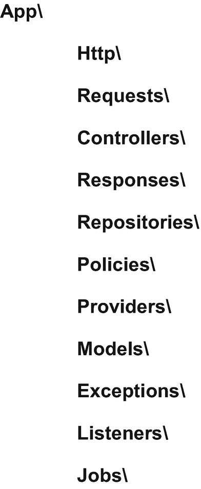

# 二、基础训练营

在本章中，您将学习一些核心工具和术语，以及足够的概念性材料，以帮助您阅读本书，并能够理解本书后面更难和技术性更强的章节。我还将介绍一些其他的关键概念，它们本身并不是我们将要学习的核心原则和标准，而是更多的周围“管道”，如果你愿意的话，这将帮助你在现实世界的设置中开始。这一章的一些内容将是我认为值得一提的理论。

我们还将了解一些 web 开发框架的历史，以及我们是如何使用 Laravel 作为我们应用的基础的(当然还有 DDD)。我们将退一步，从更广阔的角度来看问题。

Note

即使你不是为了学习拉弗尔或 DDD 的新概念而阅读这本书，你也会从阅读这一章中受益。它基于软件行业的普遍性。

## 做开发者意味着什么？

成为一名网站开发者需要付出很多，而成为一名成功的网站开发者需要付出更多。在过去的几十年里，关于我们所做的工作类型，web 开发人员的定义并没有太大的变化；然而，我们开发应用的*方式*已经以越来越快的速度发生了变化，可用于构建软件的可用工具、包和框架也是如此，并且在未来没有放缓的迹象。(值得注意的是，今天的大多数软件都遵循某种类型的设计模式或原则，所有这些模式或原则在编程的早期就已经存在，并在 1994 年左右由四人帮的对象模式书正式认可。)

这些进步已经改变了我们思考、构建、扩展和跟踪软件系统的方式，并开创了一个编程和开发的新时代。它们可以被认为是下列类别之一的一部分:软件开发工具、软件设计范例和编码标准，和/或一般的编程最佳实践。作为一名开发人员意味着利用这样的工具，不是因为它们是当时最新最棒的东西，而是因为它们为我们的代码以及最终产品增加了价值、速度和质量。DDD 本身是从开发行业的需求中诞生的，这种需求为制作特定于特定领域的软件提供了足够的指导，但也足够通用于我们试图建模的任何领域。

## 软件开发工具

软件开发工具(更确切地说，web 工具)是第三方软件或服务，您可以将它们合并到您的软件开发生命周期中——就像那些用于促进基于 web 的系统的创建的软件或服务一样。总的来说，该工具已经成为一种催化剂，促使人们普遍认识到创建高质量代码的重要性，并成功地改变了编程环境。该行业本身已经并正在使投入生产的代码质量突飞猛进——以至于它帮助延长了应用的生命周期，因为它们是为了以更可维护的方式创建代码而构建的，允许它们更容易(或至少更容易)扩展和协作。

对于软件工具，我指的是任何第三方开发工具，如 IDEs，在线服务，如 Google Cloud 和 AWS，软件版本控制系统，如 Git(有专有版本，如 Bitbucket 和 GitHub)，以及其他公司提供的各种其他解决方案，以增强开发生命周期的某些方面(无论是专有/开源，免费或付费)，并使开发定制软件和 web 应用更加简化和可靠，而且大多数时候，这恰好是一个自然可重复的过程。

从开发人员的角度来看，使用现代工具和新兴技术比使用 Notepad++作为 IDE 更令人愉快，这些工具和技术能够吸引我的注意力，并提供新的和改进的突破和体验。这在更大的范围内意味着，作为一名开发人员，意味着在为代码增加价值(为业务增加价值)的技术方面是高效的，并且有助于促进软件开发项目中的协作努力，在该项目中，多个开发人员一起工作。每个开发人员都使用相同的代码库，但是使用不同的版本，并且每个人都使用他们自己的变更部分来更新他们自己的副本，这通常是经常发生的(一天多次并不奇怪)，同时确保他们使用其他人的最新代码变更，以便当所有的更新都合并到最终形式中时，不会引入任何不可预见的错误或合并问题。

## PHP MVC 框架和开源

自 20 世纪 70 年代以来，模型-视图-控制器(MVC)架构就一直存在，在过去的 15 年中，它首次被引入“官方”web 应用。开源世界已经看到了这种 MVC 框架的一些重大进步，它们现在已经成为实现几乎任何基于 web 的系统的事实上的标准。

可以说“改变游戏”的原始框架是 2005 年左右发布的 Zend 框架和 Symfony 框架(版本 1)。从那以后，PHP MVC 领域出现了几十种不同的框架，今天最流行的是 Laravel 框架(它使用了各种 Symfony 和 Zend 组件)。

当今流行的大多数 MVC PHP 框架都是由 Symfony 的 Fabian Pontecier 最初发布的构建块构成的，他将它们创建为松散耦合、独立、可重用的组件，表示 HTTP 请求和 HTTP 响应，目的是封装一个对象以方便进入应用(请求)和对该请求的响应(响应)，它封装并模仿了各种 HTTP 级属性、头和其他元数据，这些元数据出现在来自浏览器的典型客户机-服务器请求/响应循环中(显然是为了跨网络使用)。

## 集成开发环境

当我提到集成开发环境(ide)时，我指的不是诸如 TextPad、Notepad++或 Sublime 之类的东西。这些都是很棒的程序，但它们不是 ide。他们是文本编辑器。其中一些有很少的插件可以扩展文本编辑器的功能，但它们都旨在使编辑器的功能像 IDE 一样，具有语法突出显示、LINT-ing 功能、代码格式化程序等扩展。—基本上，一个好的 IDE 支持开箱即用的所有东西。

目前，我在 web 开发(PHP 开发)领域看到的最常用的两个 ide 是 JetBrains 的 PhpStorm 和微软的 VSCode。就我个人而言，我使用 PhpStorm 是因为它几乎包含了我用 PHP 编程所需要的一切，这将使我成为一个更快、更干净、更好的开发人员。此外，Laravel、Symfony 和 PHP 生态系统中其他常用组件的可用扩展使我几乎不必离开 IDE，它们允许我专注于开发项目的领域模型(稍后将详细介绍)。

这两种 ide 都带有自动完成功能(尽管 PHP 使用一种更本地的方法来自动完成和处理不同的文件类型)。此外，在两个 ide 中都有大量的颜色主题可供选择，这在检查 bug 时非常重要，并且使阅读代码变得更加容易和有趣(同样，也许我只是有点奇怪，但是嘿)。当然还有其他的 IDEs 我只是分享我见过的用 PHP 做 web 开发最多的。主要的一点是，它通过为 IDE 的高级功能提供快速简单的低级快捷方式，提高了代码的速度和正确性。其中一个特性是为迷宫般的供应商包名称空间提供自动完成功能。如果您曾经使用过 Composer 来管理您的依赖项，您就会知道自动完成是多么节省时间。

## 版本控制系统

尽管软件版本控制已经存在很长时间了，但是以一种可管理的、符合逻辑的方式签入代码并对代码进行修改，以适应整个团队同时从事同一个项目，这种想法从来没有像代码库行业的两个主要参与者 GitHub 和 Bitbucket 那样简单和直接。两者都提供相似的功能，尽管 Bitbucket 是免费的，也没有那么漂亮或功能齐全(但确实很好地集成到了 Atlassian 的任务管理软件吉拉中)。GitHub 提供了一个很棒的界面，以及关于其用户和项目的各种见解和统计数据，还有一个漂亮的个人资料页面，通常用于显示或炫耀对开源项目的贡献。Git 版本控制系统已经成为 web 开发团队和软件工程师跟踪他们代码的标准。

### PHP 的进步

在过去的 15 到 20 年里，我们用来开发 web 应用的语言发生了很大的变化。以 PHP 为例，它最初是一种脚本语言，旨在(预)处理超文本标记，并向浏览器用来呈现在线内容的无逻辑 HTML 语言添加逻辑。它直到 PHP 版本 4 才支持对象、类或继承，直到版本 5 才真正开始提供真正的 OOP 支持——命名空间直到版本 5.3 才出现！随着 version 7 的发布，我们现在有了一些很酷的内置特性，比如返回类型声明、零合并操作符(`??`)和宇宙飞船操作符(`<=>`)，更不用说与以前的版本相比性能有了巨大的提高。事实上，PHP7 比任何其他编程语言的任何新版本都有更大的性能提升。PHP 已经获得了巨大的普及，并在今天被用来运行大部分的网络。下面是一些将 PHP 用于他们自己的应用的公司:

*   松弛的

*   Etsy 的

*   云 flare

*   特斯拉

*   维基百科(一个基于 wiki 技术的多语言的百科全书协作计划ˌ也是一部用不同语言写成的网络百科全书ˌ 其目标及宗旨是为全人类提供自由的百科全书)ˌ开放性的百科全书

*   博客

*   Tumblr

使用 PHP 构建的框架已经变得足够流行，被认为是创建现代 web 应用和分布式系统的事实上的标准(尽管目前的趋势是从 PHP 转向 NodeJS 这样的服务器端语言，NodeJS 使用 JavaScript 作为其主要语言，但针对服务器端编程进行了重新设计)。尽管 PHP 的总体使用量最近有所下降，但基于它在互联网上作为基础语言的地位，以及 80%的 PHP 运行于其上的事实，我认为它不会很快消失。总是需要支持(并最终转换)遗留系统，所以精通 PHP 从来都不是坏事。

说到 JavaScript，前端开发在过去几年里已经取得了长足的进步。ECMAScript 6 在过去几年里一直是人们谈论的话题；React、Material、VueJS 和 Angular 等突破性技术的引入，以及 redux 模式和其他状态管理关注点等概念上的进步，为前端 web 开发带来了更复杂的方法，使其更像后端开发。

## 依赖性管理系统

包管理系统已经存在很长时间了，但是它的焦点是共享代码库，这些代码库必须是专门使用的，并且缺乏任何整体的平台或者获取的手段。现在，有两个这样的系统驱动着所有 PHP 框架的 web 应用的开发，并且是管理 web 应用中依赖关系的标准方法，包括前端和后端。它们被称为 Composer(一个 PHP 依赖管理器)和 Node Package Manager (NPM)。Composer 最常用于引入后端依赖项(并且几乎总是在为您的应用安装任何第三方依赖项时的第一步，包括 Laravel 之类的框架)。

构成任何现代 MVC 框架的几乎所有安装基础的流行命令如下所示:

```php
composer install

```

这两个词足够强大，可以下载`composer.json`文件中列出的所有所需依赖项的指定版本(称为*版本锁定*，它保存在`composer.lock`文件中)，并创建一个包罗万象的自动加载器，只需一行简单的代码就可以导入在`composer.json`文件中定义的每个第三方依赖项(清单 2-1 )。

```php
<?php
require_once('vendor/autoload.php');
//good to go! use your installed dependencies freely

Listing 2-1Example Use of Installed Composer Dependencies

```

NPM 与 Webpack 结合使用，提供前端资产，这些资产可以下载、安装、缩小并以类似于 Composer 的方式运行，只需使用一个命令:`npm install`。Webpack 用于配置当前主导前端世界的所有高科技、新时代的库和包(如 React 和 Angular)的各种可用选项。不再需要进入网页，手动找到下载链接，然后在软件中使用它之前手动安装和配置它。这一切都是由 NPM 和 Webpack 完成的。尽管使用这些工具确实需要一些额外的知识(在其他人使用的生产/操作系统上部署东西时甚至需要更多的经验)，但是它们为有时被称为*依赖地狱*的东西增加了理智。

只需一下子(基本上是两个命令)，您就可以安装应用前端和后端所需的几乎所有第三方代码，并立即投入使用。这也为前端资产提供了一个整体结构，以流线型和流畅的方式围绕现代技术进行实践。

总的来说，这些和其他产品、库和平台所取得的进步让我们开发人员的生活变得更加轻松和有趣。我们不再承担管理我们自己的依赖关系并将这些依赖关系连接到一组可用的包含中的单调乏味的任务。我们可以只发布一个 Composer 命令或使用 NPM 来获取前端包..有了 PhpStorm、VSCode 这样的产品，以及 Bitbucket 和 GitHub 这样的版本控制系统，我们作为一个行业已经在全球范围内发展了 web 开发实践。这些进步对任何选择实现它们的企业的底线都有直接的影响，并且对开发人员的幸福和满足也有深远的影响，这两者都是成功的秘诀。

## 编码标准和实践

由于编程的本质(特别是 web 开发行业)，在 web 应用和程序之间存在某种标准化的全球需求，这些应用和程序旨在通过网络从浏览器使用。感谢 PHP-FIG(类似于 web 开发的 RFC)这样的倡议，我们现在有了一套标准的建议，用于日志记录、结构化代码等方面，以便于阅读。开发人员还可以使用类似接口的东西来处理基本的请求/响应和关于流 web 响应的规范，以及自动加载问题。Web 编程通常只不过是几个非常大的文件(通常是“意大利面条式的代码”)，所有的表示、业务逻辑和页面样式都打包成一个单一的整体结构，分布在两三个难以阅读、修改和维护的文件中。忽略这样的实践，因为它们具有清晰的关注点分离(在架构级别和领域级别上),使得负责维护代码的开发人员一想到要查看数英里构造不良和拼凑在一起的逻辑就畏缩不前，由于完全忽略基本的缩进和代码样式，这些逻辑的可读性也一样差。

这里要注意的另一件重要的事情是，代码的呈现不仅会影响下一个开发它的人，而且随着时间的推移，它会成为所谓的*破窗理论*的一个有效例子。在城市地区，当建筑物只有一扇破碎的窗户而没有及时修复时，自然会有更多的窗户被打破的趋势，这反过来又为更多的窗户打开了大门(或者更准确地说，窗户),这些窗户被打破而没有得到修复，这进一步延长了循环，最终导致不可避免的没有窗户的建筑物...一切都是从没有修好第一个开始的。

在软件中也是如此。未能修复应用中出现的第一个问题或问题只会使其他问题更有可能出现，如果不是很有可能的话，并且在这一点上，似乎“无论如何都是错误的”，所以只要事情仍然工作，谁会在乎是否有另一个小小的错误呢？这是一种糟糕的心态，因为在某些时候，这些无关紧要的小错误会累积起来，导致系统崩溃，导致严重的停机，影响公司的其他部门，可能会影响员工和客户。如果第一个 bug 被立即修复，那么任何其他的 bug 都会成为一个更大的问题。想想看:哪个开发人员想成为将一个错误引入一个没有错误的系统的人？(现实中可能有也可能没有“无 bug”系统这种东西，但你明白这一点。)

*最佳实践*是开发直接旨在防止这种类型灾难的软件的经过试验和测试的方法。有一些方法，当正确实施时，将有助于增加源代码的结构、深度和意义，并且最终将被用来创建一个高质量的软件工作件，该软件在其整个生命周期中确保其可维护性和可扩展性。

关键是要开发能够以任何速度伸缩的软件系统，并且能够承受系统的任何变化而不破坏系统的完整性。同样重要的是开发具有高内聚性的软件组件，并且用松散耦合的组件来表达，以便我们可以在应用的其他地方重用我们的代码。使用最佳实践意味着创建一个可靠的、可信赖的、可重复的连续迭代/连续开发(CI/CD)流程。这意味着频繁地向存储库提交和推送，在足够小的部分中进行微小的更改，以便于测试、管理和部署。让我们讨论一下开发环境中的内聚性是什么，以及如何将内聚性与低耦合性结合起来使用，以创建能够承受变化的可重用软件组件。

## 什么是凝聚力？

DDD 提供了一种组织应用的方法，这样它们可以作为独立的进程独立工作，但在协调运行时具有高度的内聚性。内聚是软件开发中的一个重要概念，还有*耦合*。与软件开发相关的术语*内聚*是由 Larry Constantine 在 20 世纪 60 年代末创造的，用来表达一个模块(或一组类)应该或多或少以统一的解决方案为目标的思想。在模块层次上，类应该足够分离，以便在没有太多开销的情况下可用和可扩展，并且应该通常专注于手头问题的一个方面。每个模块应该以这样一种方式相互关联，使它们作为一个组在功能上具有凝聚力——这意味着模块中的所有元素都应该有助于一个单一的、明确定义的任务。

请注意各种实践，并尝试认识到这里有两个主要原则，尽管是低级原则。一旦您能够识别单一责任原则和关注点分离，您将会发现这两者自然是相辅相成的。一旦你坚持认为一个类只专注于解决一个特定的问题(除了粒度)，通过确保它的成员以一种最自然和最适合公司业务领域的方式，几乎总是直接根据无处不在的语言中定义的术语，很容易同时坚持关注点的分离。

*   凝聚力:当一个团体或社会的成员团结在一起时

*   *(形容词)*:团结一致，有效地一起工作

与此同时，这些类最终需要实际“绑定”在一起，以产生手头问题的期望解决方案，其方式是可测试的、可重用的，并且根据其功能和核心业务逻辑，在关键系统组件之间划分出清晰的边界。

清单 2-2 提供了一个不那么内聚的类的例子。请记住，该示例没有验证或前置/后置条件，不应在生产环境中使用，而只是一个严格的学习练习。

```php
<?php
namespace App\Registration;

use App\User;
class RegisterUser
{

   protected $name;
   protected $username;
   protected $isAdmin = false;
   protected $isPremierMember = false;
   public function setName($name) {
       $this->name = $name;
   }
   public function setUsername($username) {
       $this->username = $username;
   }
   public function makeAdmin() {
       $this->isAdmin = true;
   }
   public function getUserAttributes() {
       return [
           'name' => ucfirst($this->name),
           'username' => $this->username,
           'isAdmin' => $this->isAdmin == false ? "NO" : "YES",
           'isPremierMember' => $this->isPremierMember == false ?
                  "NO" : "YES"
       ];
   }
   public function registerUser() {
   $user = new User($this->name, $this->username,
$this->isAdmin, $this->isPremierMember);
       return $user;
   }
}

Listing 2-2Example of Low Cohesion Within a Class

```

有几件事你可能马上就能发现，那就是类的*设计*和缺乏语义的问题。例如，通常一个执行高级用户注册过程的类很可能会检查重复的用户名和用户名是否有效的特定标准。现在，我只想关注例子中成员函数内部引用其他成员函数的情况，以及它是如何毫无理由地在类中传递自己的成员*的。更重要的是，为了使用它，很多工作都留给了客户端。清单 2-3 是清单 2-2 中类的示例客户端。*

```php
<?php

use App\Registration\RegisterUser;

//... collect user attributes--most likely via a form request
$params = [`name` => `Jesse`, `username` => `debdubstep`];

$userRegister = new RegisterUser();
$userRegister->setName($params[`name`]);
$userRegister->setUsername($params[`username`]);
$user = $userRegister->registerUser();
//now we have an unsaved $user...

Listing 2-3Example of Client Code for Low-Cohesive Class RegisterUser

```

总的来说，这是一个糟糕的设计。将特定的方法或例程留给客户端代码会产生它们可能不会被调用的可能性。与此同时，在`registerUser()`方法中，它用给定的参数创建用户，但不把它保存到数据库中。如果开发人员期望返回的用户是成功保存到数据库的记录，这可能会是一个问题。当然，由于缺乏错误消息或异常，我们无法从应用中了解情况，直到我们开始注意到用户没有被持久保存到数据库(或者人们开始抱怨，这是一种更有可能的情况)。

在持久化用户对象之前，没有检查来确保所有需要的数据和方法都已经放在类中。当然，我们可以编写一个逻辑，在我们创建和持久化新用户之前，检查是否已经在对象上设置了本地参数`$username`和`$name`。然而，这样做的问题是，我们必须考虑如何通知用户必须首先设置这些属性(手动)。我们会抛出一个异常吗？

我们可以，但我不认为停止软件执行的完全错误是值得的，因为对象上的参数还没有设置，但也许你在一个上下文中它会。例如，在 web 表单上，当您注册某个网站的新帐户时，您会立即得到反馈(通常通过 JavaScript ),告知您错过了某个字段或者该字段的格式无效。一旦你点击了提交，这个请求就会被应用处理，然后(通常)你就会被带到某种类型的个人资料页面。您不知道或不想知道创建您的用户帐户的内部进程；你想知道的是，你有权访问该网站和登录。

以类似的方式，实际注册新用户的代码应该封装到一个单独的类中(可能在应用层中作为一个利用域层对象的服务),并且应该作为在系统中创建新用户的单一入口点。客户端代码应该根据需要初始化这个类的一个对象来执行请求，然后“点击提交”很明显，没有可以点击的提交按钮，但是像`run()`、`execute()`和`handle()`这样的方法基本上是这样操作的，启动一个作业或初始化某种类型的注册服务，该服务将处理创建新用户的各个方面，并包含确保处理任务的先决条件得到满足的逻辑。

此外，使用技术分析会使我们得出这样的结论:注册用户的概念应该分解成不同的关注点，确保保持域模型的完整性。例如，我们可以引入一个存储库，减轻类处理`User`对象持久化的负担，使`Registration`类更干净、更轻便。我们还可以实现一个`UserFactory`类，封装注册新用户所涉及的知识和逻辑。

虽然这个例子确实是这样，但我们已经超越了自己。让我们把注意力集中在我们在前面几段中描述的这个类的更明显的问题上。

清单 2-4 展示了一个更好的(但不是最好的)解决方案。

```php
<?php
namespace App\Registration;

use App\User;

class RegisterUser
{
   protected $safeAttributes;

   protected $user;
   public function __construct(array $params) {
       $attributes = User::fillableFromArray($params);
       $this->safeAttributes = $attributes;
       $this->user = new User();
   }
   public function makeAdmin() {
       $this->user->admin = true;
   }
   public function makePremiumMember() {
       $this->user->premiumMember = true;
   }
   public function getUser() {
        return $this->user;
   }
   public function registerUser() {
       $this->user->fill($this->safeAttributes);
       $this->user->save();
   }
}

Listing 2-4A Refactored Version of RegisterUser with Higher Cohesion

```

在这个例子中，我们去掉了所有单独的 setter 方法，取而代之的是通过构造函数(*构造函数注入*)，这是一种依赖注入技术。正如您所看到的，这些字段是通过使用一种叫做`fillableFromArray()`的简便的雄辩方法来验证的。这个方法是一个功能强大的函数，它接受一个数组并返回另一个数组，数组中的值是模型中存在的有效属性名。当我说“有效”时，我的意思是属性被`User`类认为是“可填充的”还请注意，我省略了任何检查，以确保参数不为空(或者传入的`$params`变量不是空数组——为了简洁起见)。

我在这里留下了两个`make()`方法，以防客户需要能够在用户被保存之前设置它们，但是我也可以很容易地在构造函数中包含这两个额外的参数，并在方法签名中设置它们的默认值。使用所谓的*流畅界面*是有益的(稍后会有更多介绍)。当该说的都说了，该做的都做了，`getUser()`方法将简单地返回我们在调用`registerUser()`后建立的用户。从客户端的角度来看，使用该类的简单性使客户端保持简单，只需调用更少的方法来实现某种结果。

### 什么变了？

属性的内部引用或内部参数的“传递”过于频繁会使类变得混乱，难以测试、维护和在其他地方重用。努力实现关注点的清晰分离是有好处的。在前面的`RegisterUser`类中，它和`User`对象之间有很高的内聚性。`User`对象的属性由`RegisterUser`类指定，但是它的持久化是在`User`类内部处理的(`User`是一个有说服力的模型)。在应用的这一小部分中存在着一定程度的内聚性，这样各个部分就可以一起工作以达到最终的结果，并且这一部分遵循了对象中的关注点的清晰分离，从而促进了它的实现。

这里起作用的另一个因素是我们为客户提供的灵活性，特别是通过方法`getUser()`、`makeAdmin()`和`makePremiumMember()`。这些方法提供了额外的“特别”选项，由客户端负责调用。同样，我们也可以将它们实现为额外的构造函数参数，然后设置为默认值`null`。在调用了`registerUser()`方法之后，我们可以使用`getUser`来检索现在持久化的新的`User`对象。

这个设计远非完美。事实上，我们将以 Laravel 作业和队列的形式讨论一种更好的方法来处理这种功能，但是作为一个介绍性的例子，这种方法效果很好。

### 低内聚力

方法之间没有任何链接，类中的过程之间也没有任何共享资源的利用。它们都分别作用于单个成员变量，这里没有什么有趣的事情。尽管这个类能够并且可能实现关注点的分离，但是它很可能有一个错误的东西被分离出来。我们在领域层中的概念边界之间划的线对我们的对象相互作用(或不相互作用)以产生预期结果的方式有深远的影响。图 2-1 显示了一个低内聚类的例子。


图 2-1

低内聚的类

被认为具有高度内聚性的代码通常作为单独的片段存在，它们都有助于并致力于单一的定义的目标或任务。图 2-1 中的`SomeClass`是一个类，它的结构取决于它的属性。每个函数都是独立的，并且每个函数都只使用在类中定义的相应参数——如果该结构是基于特定的业务问题并保证了它的使用，那么这是很好的。

一般来说，这样的类不可重用，也不容易扩展。也许我不应该说“容易”,但扩展真的“毫无意义”,因为子类将使用这种结构，并且通常只作为独立对象有用。这个类中没有内聚性，因为其中的每个方法只与类中定义的单个参数相关。这些方法类似于某种形式的(通常是不需要的)getter 和 setter 方法。对于获取和设置数据(我们将在本书的后面深入探讨)，雄辩有一个更复杂的解决方案，即通过它的赋值函数(setter)和属性(setter)，也通过它的魔法方法。

## 必须保持他们分开(关注，这是...)

不，我指的不是后代的老派歌曲，我说的是应用或软件中存在的问题。当实际“分离关注点”时，产生的配置应该是软件试图解决的特定业务问题的指示。你不应该“仅仅因为”把事情分成不同的类和组件如果不同类或类内参数之间的分离似乎不太适合领域的整体调整，那么它很可能不需要以这种方式分离，或者根本不需要分离。相比之下，如果在两个独立的对象中发现的两个对象或属性似乎过于紧密地联系在一起而不能分开，它们可能只是属于一起。这很难做到正确，当然这完全取决于你所从事的特定领域。

Note

在整本书中，你会经常在我关于代码结构的讨论中看到*名称空间*、*文件夹结构*和*目录*这些词。只要知道我的意思是他们可以互换使用。

通常，这种分离是以严格的名称空间和目录结构的形式出现的，其中类是按照它们是什么而不是它们做什么来分离的。大多数(如果不是全部的话)现代框架都是这种情况，这也是 Laravel 的默认名称空间结构和目录的基本设置方式。控制器都在一个`App\Http\Controller`文件夹中。可能会在它们下面设置子文件夹，但它们仍然都源于主`App\`名称空间下的这个单一目录，由它们*是什么*分开(图 2-2 )。



图 2-2

正在运行的 Laravel 应用的目录结构示例

这种类型的结构关系到每件作品是什么；存储库放在`App\Repositories`名称空间中，控制器放在`App\Http\Controllers`名称空间中。在一段时间内，这一切看起来都很好，但随着时间的推移，系统中会增加额外的功能和业务需求(实际上是无限的)，很难在单个名称空间(甚至是模块化的名称空间)中管理所有控制器。在这样的结构中，领域的真正含义并不清楚——它并不特定于领域。

在我们开始使用 Laravel 之前，我将为您提供一种方法，将您的应用恰当地组织到单独的筒仓中。每个竖井将有其自己的名称空间，并且在每个竖井内将只有使该竖井起作用所需的组件和代码。顺便说一下，我使用*筒仓*和*模块*基本上是指同一件事。一旦您根据每个特定模块对领域的重要性开始分解应用的单一整体结构，您将发现管理和测试变得更加容易，因为所有的模块都是相互隔离的——然而所有的模块都以同步和谐的方式一起工作以产生最终的应用。

### 分离的先决条件

为了实现正确的结构，需要做一些必要的工作(“正确”是指对您的业务来说“正确”的任何东西)。要记住的主要事情是意识到可能的概念边界可能位于业务的核心中。如果我们努力保持模型驱动的设计，那么下一步将这些界限转化为实际的代码结构将会更容易，这取决于在这种无处不在的语言中描述的事物的质量和正确性。

有些事情将很难分开，如果，不管出于什么原因，在两个组件之间画一个适当的分离看起来太复杂或太困难，解决方案可能是使边界线比有界上下文的边界线更细。这可以通过使用每个组件的*模块*实现来完成，并且仔细地(并且显式地)将两者之间所需的通信抽象到单独的类中，或者作为服务或作业职责的一部分(然后可以在 RESTful 接口后面设置，并在多个有界上下文中使用)。模块提供了一种不太正式(但仍然显式)的机制，用于分离出您的业务(以及您的应用)所依赖的各种组件。

模块还提供了另一种在应用中对相似概念进行分组的方法，并且可以(并且应该)代表底层业务实际上是如何构建的。我们应该能够看到一个应用的模块图，并对其中发生的事情以及模块如何组合在一起形成一个完整的工作应用有一个很好的总体感觉。

当我们讨论有界上下文时，我们将研究一些不同的构建模块的方法，但是现在这里有一个模块结构的例子，在这个例子中我们可以清楚地理解它做什么以及它的操作中涉及的各种组件。

### 重构遗留系统

如果在试图将特定的概念或类集合移动到它们各自的模块或上下文中之后，它们似乎仍然不能自然地与应用的其余部分相适应，或者违反了在通用语言中定义的定义和关系，那么考虑它们实际上不需要被分离的可能性。这可能是由于缺乏管理所述概念和过程的业务规则的完整知识，或者是这种无处不在的语言的内部工作中的一个错误。我经常认为这是由于热情(或错误的信息/误解等)的结果。)离岸团队最终为一个应用留下了一个大烂泥球，而碰巧的是，他们成功地进行了数以千计的小黑客攻击，以获得一个 MVP 来同步并产生某种形式的系统，而无需做更多的工作。

如果这描述了你，并且你已经继承了一堆蹩脚的、离岸的代码，并且必须一行一行地通过遗留应用来弄清楚他们试图做什么(因为肯定没有文档可以帮助你)，我同情你！在我的职业生涯中，我去过那里很多次。大多数时候(有充分的理由)，从零开始重写遗留应用不是一个选项。

向前推进的最佳方式是尽可能使用最佳实践和标准来实现任何新功能，然后(可能在计划好的冲刺中)创建所谓的*反腐败层*。这一层基本上是应用特定部分的一个分割区域；通常这一部分与没有它的整个工作或过程的实现一样大。一旦您围绕遗留代码和新的反腐败层建立了参数(是的，这是一种奇怪的反腐败层的说法，但 ACL 已经被采用)，在其中构建一个完整的功能，只与旧代码建立强制性的连接和集成点，并使用最佳实践在新代码中构建任何东西。最终，遗留系统基本上吸收了这个反腐败层，并将其视为根本不存在——就好像它只是遗留代码导入或引用的另一组类和对象。

之后，休息一下，喝杯啤酒，因为这是一个伟大的成就，在复杂的系统上很难做到！一旦你重新开始工作，重复这个过程，只是用一个不同的现有功能，甚至是一个新功能。构建另一个反腐败层，作为或多或少的“插入式”替换或添加，遗留应用可以固有地交谈、发出请求和委托(这通常最好通过 API、事件系统或队列来完成)，以便处理用户的请求。在这种情况下，用户和遗留应用应该无法区分这两者。我们已经巧妙地创建了一个对外部几乎不可见的遗留应用边界，使用最佳实践封装了一个动态特性，并附带了单元测试和文档。现在你已经很好地掌握了这个过程，继续更新遗留应用的一小部分，并在它们各自的反腐败层中实现微小的功能，直到不再有遗留代码。

这是使用最佳实践和高质量代码构建任何新东西的可靠方法，同时使遗留应用越来越好，直到它从代码库中完全消失。当然，事情远不止如此，但你已经明白了。在我们深入这些概念之前，我想澄清一下我所说的“领域层”或“模型层”是什么意思这个定义是理解本书其余概念和思想的关键。

### 分层(洋葱)架构

那么，什么是领域层呢？很高兴你问了！从 DDD 的意义上来说，领域(或模型)层是软件架构背后的核心驱动力，它涉及的对象和过程代表了现实世界中的业务问题和需求，这些问题和需求是设计用来解决的(见图 2-3 )。领域层的成员通常是核心对象或业务流程，它们被表示为整体业务和应用的一等公民。


图 2-3

应用的层。有时被称为“洋葱”

本质上，模型层封装了业务实际做的上下文中存在的所有内容。它是应用的核心。所有其他代码、策略、过程和基础设施的存在只是为了方便在模型层中找到对象和组件。

因此，关键是能够将这些代表实际业务实体的业务规则和类“分割”到它们自己的层中。这是模型层。通过关注核心业务规则和基础领域知识，我们将构建一个强大而丰富的领域模型，它是业务本身的真实表现。各种模块将多个模型组成子部分——所有这些都是为了实现(理想的)关注点分离，其中每个模块对应于一个目标，或者整个业务的模型级关注点的一部分。

这可能表现为企业不同部门之间的明确区分，其中每个模块封装了整个部门的关注点，或者可能存在于更细粒度的级别上，而模块代表各种资源或特定于产品的关注点。

#### 其他层在哪里？

在图 2-3 中，注意领域层是如何处于应用的核心的。该图描述了操作的“流程”(对应于每个特定层的客户端),以及每个层通常如何指向它下面的层，使得每个层只能依赖(并调用)它下面的层。

基本上，领域层，应用的核心，作为它自己的实体存在，因此应该依赖(或依赖)该层中的其他成员或组件。其上的一层，即基础设施层，用于促进这些域层对象的读写(因此必须直接“了解”它们)。最后一个外圈是应用层。应用通过基础设施层访问域层，但是在 Laravel 中，可以直接访问域模型。

#### 应用层

应用层是其客户端通常在请求之外的层(通过一些输入源，如 HTTP 点击、API 调用或 SOAP 实现的操作)。这一层的客户通常是应用的用户。当需要处理业务规则或业务对象时，应用层不会直接处理它们。

相反，它处理基础设施层，基础设施层最了解如何处理域层(或模型层)中对象的各种细节。下面是对每一层中存在的组件的一些说明:

*   应用服务存在于应用层，但是没有任何领域逻辑。

*   它们控制持久性事务和安全性。

*   他们可以向其他系统发送基于事件的通知。

*   他们撰写给用户的电子邮件。

*   他们可以订阅从域层发出的事件。

*   这一层中的应用服务是域模型的直接客户。

#### 基础设施层

基础设施层包含以下内容:

*   存放在基础设施层中为域中定义的接口实现的存储库

*   如果与依赖注入结合使用，可以“颠倒”过来，给予基础结构层在它下面的层中实现任何接口的能力

*   工厂可以存在于这一层(或领域层)

*   持久性机制

#### 模型层(领域层)

模型层包含特定于业务的规则和实体，构建它们的公司使用这些规则和实体来运行。请记住，代码就是业务。照此处理。

*   域服务处理与域相关的特定过程和任务。

*   这一层发布领域事件，供应用的其余部分作出反应。

*   这种模式的客户端通常存在于应用层。

*   有界的上下文和业务组件的分离是关键。

注意一些关于模型层的事情是很重要的。

*   模型层是任何应用中最重要的一层。

*   应用中存在的其他层只是为了支持模型层中的对象。

*   在 DDD 分布式应用中，模型层的不断迭代、重组、澄清和细化是非常重要的。

*   模型层(领域层)是领域驱动设计的焦点。

*   对模型的改进通常是在开发人员和某类领域专家之间对业务如何运作和功能进行长时间讨论之后进行的。

#### 服务层

服务层(或只是层)也有明确的区别，几乎每个应用都有一些概念。这些服务层几乎与它们的“架构层”对等物直接相关。例如，应用服务位于应用层中，但是针对域层中的对象执行操作(通常通过基础设施层)。类似地，跨越多个领域对象并直接涉及系统核心业务规则的业务流程将存在于领域层中，并由基础设施层中的对象或组件来操作。

#### 应用服务程序

这些层与本章前面介绍的应用层非常相似，但是它们更细粒度，因为它们代表服务本身，主要关注业务的特定操作或流程，而不是应用的整个“层”。示例服务可以是诸如`SendNotificationEmails`、`SubscribeToNewsfeed`、`ExportAccountingStatement`等。

首先是应用服务。这一层中的服务基本上充当外部客户机(请求)和域逻辑之间的中介。这一层可以(并且通常确实)作为组件而不是服务存在——控制器就是一个例子。他们当然是 MVC 架构中的“C”。控制器分派特定的服务和作业，并控制任何侦听器、订户或其他接收器来响应这些作业和服务调用。请求和响应也包含在这一层中。

应用有时使用控制器作为保存和运行域层过程的手段。通过将它们与控制器内联编码，它们极大地降低了代码的可重用性，同时也使得任何只针对领域逻辑的测试变得更加困难，因为这个过程不是孤立的。单元测试的关键是能够测试彼此独立的事物(以“单元”为单位)。

#### 没有肥胖控制者

拥有肥胖的控制者不是好的做法；应该通过显式定义服务或其他领域层类和组件来避免这种情况，这些服务或其他领域层类和组件封装了此类流程的特定领域知识，然后从控制器内部调用这些知识，控制器传递流程并返回响应。除非过程非常简单，否则单独的类会显得多余，核心业务逻辑必须分离到应用的域层中，或者作为模型、域服务、事件监听器，或者任何最适合其目的的东西。根据通用语言命名领域层中的对象。

外部客户端(请求)是应用层中对象的直接客户端。然后，应用层根据该请求采取行动，通常包括与领域层中的对象进行交互。

## 在哪里划线？

这就是本书希望帮助回答的问题。我们需要一种在 web 环境中开发 Web 应用和系统级架构的方法。这就是 DDD 要发挥作用的地方。

我想简单地谈一下，因为它对于培养一种强大的、定义良好的通用语言至关重要——不是可选的，而是至关重要的，这种语言将用于对应用的核心结构进行建模，并确定其模块的粒度。这只有在对公司当前持有的“公认”标准进行一些挖掘和探索之后才会发生(通常是通过深入到他们如何工作和他们实际做什么的更细微之处)。很多时候，您最终发现的或多或少是*假定的*业务知识或模糊的边界，即，部门或核心流程的不清晰分离，经常看起来跨越几个服务或有多个主要关注点。

Eric Evan 的书 *DDD:在软件的核心解决复杂性*中有很大一部分是关于系统各个方面的概念边界以及在哪里画它们。通常，这些边界在应用中的正确位置并不总是像我们希望的那样清晰和直接。最有可能的是，领域模型中组件的分割需要开发人员和领域专家在一个被称为*知识收集*或*信息收集*的过程中进行许多彻底的讨论。

最后，这些上下文边界的产品划分出不同的功能组，这些功能组在业务本身的上下文中正常而自然地存在。当基于无处不在的语言中的概念和定义时，这变得更加健壮。不太正式的分离机制包括模块、域、子域或一般子域。从更广泛的意义上来说，作为分离机制的有界上下文也有助于业务范围内无处不在的语言的细化——特别是当设置为使用 REST 接口实现的*发布语言*时(我们将在后面讨论)。

现在，当您将 DDD 提供的策略和工具结合起来，并将它们与领先的 Laravel 框架相结合时，您就能够在一个可重复且简化的过程中满足几乎任何架构或业务领域规范的需求。该框架提供了各种组件的实现，这些组件是通过领域驱动设计的战略层发现的(它突出了围绕您正在构建的领域中各种解耦结构的概念边界的绘制)。我们将使用各种技术来更好地促进这一过程——比如依靠领域专家对业务概念的全面定义，以及以业务软件的形式实现所获得的知识，这些软件可以在企业范围内通过网络提供服务。这将为我们在应用的代码端实现我们需要的东西提供一条清晰的路径，并且基本上利用 Laravel 和 PHP 来实现我们已经获得的概念和过程。

## 我们从 DDL/DDD 得到了什么

最终，我们得到了一个功能完整的软件，它易于部署并建立在最佳实践之上，具有各种结构和名称空间，实际上与业务级的实体和结构相关联。该软件是完全可扩展的，因为我们明智地决定在云上推出我们的应用和基础设施，并且由于我们定义的关注点的明确分离，它们可以很容易地修改。我们也有一个清晰的模块路线图，需要构建这些模块来正确处理它所促进的核心级业务流程。

随着我们从最初的领域关注点分解进展到反映业务的真实需求和要求的细化的领域模型，我们开始看到事情以一种有机的方式排列起来。概念和理想似乎毫不费力地相互联系起来，并且在实现新功能或对现有功能进行更改时，开销开始大大减少，因为应用的底层结构是以与其领域模型紧密耦合(并表示)的方式制作的，这使得所有这些更容易理解、扩展和测试。在开发过程中，我们可以使用特定的单元测试作为快速简单的概念证明。我们将在后面的章节中详细讨论这一点。

## 结论

在这一章中，我们看了拉弗尔是如何构建的，并与 DDD 建议的指导原则进行了对比，以指出一些明显的差异。我们讨论了整体式应用是如何构建的，以及它们为什么不如一种更为分离的方法(比如微服务)理想。增加这种复杂程度的决定必须直接来自于与领域有关的决策，应该根据应用构建于其上的标准业务流程中存在的相同逻辑对领域进行分离。

我们还讨论了一些雄辩模型的例子，并回顾了一些有助于向数据库添加新用户的代码，以及为什么把以领域为中心的代码放在模型的范围内比放在控制器或服务的范围内更好。只有当实体或值对象的使用不适合您试图解决的问题的上下文时，才应该创建服务。

现在我们知道了 Laravel 在使用 DDD 作为指导构建架构方面的缺点，我们可以回顾一下我们将需要的各种更改，以使默认 Laravel 安装的结构实际可行。我希望我也激起了您对 Laravel 提供的其他组件的好奇，激发了您学习更多内容的欲望，这将在接下来的章节中介绍。