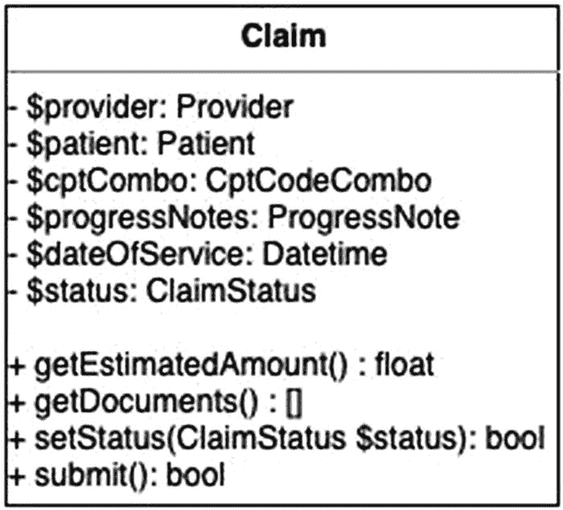
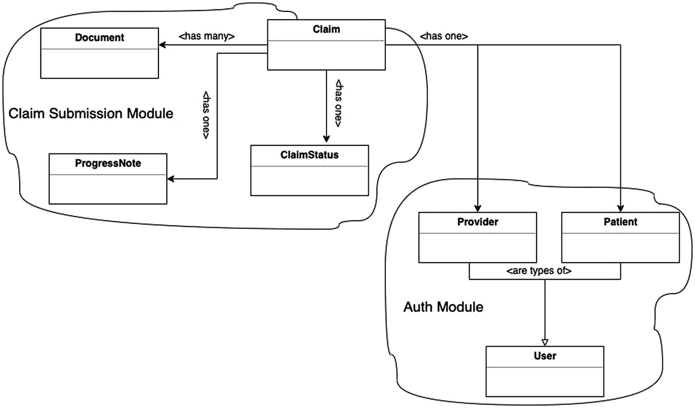

# 七、领域的建模和实现

现在我们对领域在现实世界中的工作方式有了一些了解，我们可以开始开发领域关注点，并创建一些基本的领域对象，这将帮助我们产生一个覆盖所有核心需求的解决方案。

Note

本章中包含的领域模型对象的目录将会随着本书在第八章中继续这个项目而改变，当我们有了一些在代码中表示我们领域的更好方法的额外见解时。

## 定义主索赔模型

首先，让我们定义我们将在系统的其余部分使用的主`Claim`模型，如图 7-1 所示。



图 7-1

索赔模型原型的首次尝试

`Claim`模型有两个部分；顶部的一个定义了索赔的属性。我们需要为属性所代表的类创建模型和迁移。).目前，属性是 FQHC 向提供商付款所需数据的一部分。在 UML 的底部是一个方法列表，这些方法对索赔状态做各种事情，或者拉入也是需求的一部分的附加数据(例如，`getDocuments()`获得给定索赔的所有相关文档)。

应用中有许多涉及声明的部分也需要建模。有时，最好从系统的高层次视图开始，这样就可以弄清楚类之间的关系。要做的一个重要区别是，我们在系统中包含了两种实际类型的用户，`Provider`和`Patient`，它们在模型中明确地用于域逻辑，而不是身份验证或授权(这将在应用层)。如果我们试图在这个类中建模安全问题(这将公然违反关注点分离原则)，我们应该导入`User`类。我们还需要在我们的类别映射中使这种包含显式化。

图 7-2 显示了在一个声明中*的高级概述。*



图 7-2

索赔类别的属性

请注意，有两组类，每组都包含在一个边界内，该边界将类组与应用的其余部分分开，对应于我们在前一章中设计的两个模块:Auth 模块和 Claim Submission 模块。实际的`Claim` *模型*可以在索赔提交模块中找到，并充当任何封闭类的看门人。

如果您还没有猜到，我们正在将索赔提交模块中的类聚合起来，用`Claim`模型作为聚合根。声明集合边界内的任何封闭类都只能通过声明本身来访问。例如，与索赔一起提交的`ProgressNote`只能通过`$claim->progressNote`访问。`ClaimStatus;`也是如此，它是通过`$claim->status`访问的。现在，如果您查看另一个模块，它被表示为驻留在同一父名称空间下的一组常规类。围绕它画出的边界并不表示一个集合，而只是一组相关的类。`Claim`模型显式地使用了`Provider`和`Patient`模型，既用于身份验证/授权，也作为断言将索赔提交到审查队列所需的需求的一种方式。让我们使用 Artisan 命令来充实模型，如清单 7-1 所示。

```php
php artisan make:model App\\Models\\Claim -a
php artisan make:model App\\Models\\Patient -a
php artisan make:model App\\Models\\Practice -a
php artisan make:model App\\Models\\Provider -a
php artisan make:model App\\Models\\ProgressNote -a
php artisan make:model App\\Models\\Document -a
php artisan make:model App\\Models\\ClaimStatus --migration

Listing 7-1Artisan Commands to Create the Domain Models of Our System

```

清单 7-1 中的命令，除了最后一个，为它们对应的模型创建以下每一个:

*   位于`App\Models`的模型类

*   位于`database/migrations`的迁移类

*   `database/factories`中的一个试验工厂

*   `app/Http/Controllers`中的一个控制器

让我们从最简单的开始，定义我们的`ClaimStatus`类和支持它的迁移，如清单 7-2 和 7-3 所示。

```php
// ddl/app/Models/ClaimStatus
<?php
...
class ClaimStatus
{
     const PENDING_REVIEW = 1;
     const REVIEWER_APPROVED = 2;
     const CORRECTION_NEEDED = 3;
     const BILLER_CORRECTION_NEEDED = 4;
     const BILLER_APPROVED = 5;

     public $table = 'claim_status';
     protected $fillable = ['*'];
}

Listing 7-2The ClaimStatus Class

```

注意，我们省略了将`created_at`和`updated_at`时间戳添加到状态表的代码，考虑到这是一个静态引用(即*查找*)表，这些代码是没有用的。

```php
// ddl/database/migrations/{YOUR_TIMESTAMP}_create_claimstatus_table
<?php
...
use App\Models\ClaimStatus;
function up()
{
     Schema::create('claim_status', function (Blueprint $table) {
            $table->bigIncrements('id');
            $table->string('name');
            $table->string('slug');
            $table->string('code');
     });

     ClaimStatus::create([
          'id' => 1,
           'name' => 'Pending Review',
          'slug' => 'pending_review',
           'code' => 'PENDING_REVIEW'
     ]);

     ClaimStatus::create([
          'id' => 1,
          'name' => 'Reviewer Approved',
           'slug' => 'reviewer_approved',
          'code' => 'REVIEWER_APPROVED'
     ]);

     ClaimStatus::create([
          'id' => 1,
           'name' => 'Correction Needed',
          'slug' => 'correction_needed',
           'code' => 'CORRECTION_NEEDED'
     ]);

     ClaimStatus::create([
          'id' => 1,
           'name' => 'Biller Correction Needed',
          'slug' => 'biller_correction_needed',
           'code' => 'BILLER_CORRECTION_NEEDED'
     ]);

     ClaimStatus::create([
          'id' => 1,
           'name' => 'Biller Approved',
          'slug' => 'biller_approved',
           'code' => 'BILLER_APPROVED'
     ]);
}

Listing 7-3ClaimStatus Migration File

```

Note

我们在`ClaimStatus`模型中定义了一组常量，以便于将其与应用的其他部分区分开来。现在，我们不必记住 ID 为 1 的`ClaimStatus`表示一个`PENDING_REVIEW`状态，我们可以直接引用`App\Models\ClaimStatus::PENDING_REVIEW.`同样需要注意的是我们在迁移运行时添加的记录——它们都对应于我们在顶部设置的模型常数。

本文中不会列出所有的模型和迁移，但是您可以在 GitHub repo 中找到这个例子和其他例子的所有代码。我没有提供`Practice, ProgressNote,`或`Document`的文本定义，因为它们是琐碎的实现——请在线查找这些类的定义。然而，我将内联定义`Claim, Provider,`和`ClaimStatus`类，因为它们是独一无二的，并且对当前的讨论非常重要。

让我们完成`Provider`类(请访问网站获取移植代码)。为此，请查看清单 7-4 。

```php
// ddl/app/Models/Provider
<?php
...
Class Provider extends Model
{
     public $table = 'providers';

     protected $fillable = ['fname', 'lname', 'address', 'practice_id', 'npi_number'];

     public function practice()
     {
          return $this->hasOne(Practice::class, 'practice_id', 'id');
     }
}

Listing 7-4The Provider Eloquent Model

```

`Provider`类相当简单。有一些标准标识符，包括姓名和地址，以及他们工作的诊所和国家提供者标识符(NPI)，这是美国每一位执业医生在政府注册后在美国行医的 ID。我们在这里定义的唯一关系是对应的`Practice`(我们用在`$fillable`数组中指定的`practice_id`字段明确了这一点)。

现在我们可以通过使用关系将`Claim`模型中的模型联系在一起，如清单 7-5 所示。

```php
// dll/app/Models/Claim.php
<?php
// ...
namespace App\Models;
class Claim
{
     public $table = 'claims';
     protected $fillable = ['cpt_code_combo_id', 'provider_id', 'patient_id', 'progress_note_id', 'date_of_service', 'status_id'];

//relations:
     public function provider()
     {
          return $this->hasOne(Provider::class);
     }

     public function patient()
     {
          return $this->hasOne(Patient::class);
     }
     public function progressNotes()
     {
          return $this->hasMany(ProviderNote::class);
     }
     public function cptCodeCombo()
     {
          return $this->hasOne(CptCodeCombo::class);
     }
     public function status()
     {
          return $this->hasOne(ClaimStatus::class, 'status_id', 'id');
     }
}

Listing 7-5The Claim Model

```

清单 7-6 展示了`Claim`模型的移植。

```php
// dll/database/migrations/{YOUR_TIMESTAMP}/_create_claim_table.php
<?php
...
class CreateClaimsTable extends Migration
{
     Schema::create('claims', function (Blueprint $table) {
           $table->bigIncrements('id');
           $table->integer('status_id')->unsigned();
           $table->integer('provider_id')->unsigned();
           $table->integer('patient_id')->unsigned();
           $table->integer('cpt_code_combo_id')->unsigned();
           $table->integer('progress_note_id')->unsigned();
           //define foreign keys:
           $table->foreign('practice_id')
                 ->references(Practice::class)
                 ->on('id');
           $table->foreign('provider_id')
                 ->references(Provider::class)
                 ->on('id');
           $table->foreign('patient_id')
                 ->references(Patient::class)
                 ->on('id')
           $table->foreign('cpt_code_combo_id')
                 ->references(CptCodeCombo::class)
                 ->on('id');
           $table->foreign('progress_note_id')
                 ->references(ProgressNote::class)
                 ->on('id');
           $table->foreign('status_id')
                 ->references(ClaimStatus::class)
                 ->on('id');
           $table->datetime('date_of_service');
           $table->timestamps();
     });
}

Listing 7-6Migration File for the Claim Model

```

在这一点上，我们已经勾勒出了声称*存在所需的基本模型。*我们尚未讨论通过提交和验证流程促进索赔所需的任何结构，也未对流程中涉及的所有不同步骤和状态的管道进行建模。我们将在本书的后面部分讨论所有这些内容。这些问题在 DDD 和拉腊维尔的技术水平和经验方面更先进。我保证我们会到达那里。

让我们谈谈总量。一个*集合*基本上是一个对象，它由分离的、单独的对象组成，这些对象使用一组组件组合在一起，这样它们可以被记录、分解和重构，并在面对领域中复杂对象的代码实现时作为一个可能的解决方案。聚合有助于在持久化数据时防止数据不一致，方法是采用一些使它们有用的原则。

*   原子数

*   一致性

*   完整

*   持久性

确保这一点的一种方法是，当系统要求您需要随时跟踪给定域对象的状态时，使用事务来管理一组事件或域模型的持久性。事件记录就是一个例子。当应用中发生了其他上下文想要知道的有趣的事情时，事件的持久性和重新创建就很难作为一个大块来管理。

通过使对象成为一个具有适当边界的集合，您可以采用一些技术，使其在持久性级别上更容易保存和加载。在我看来(我希望你也是如此),在我们的示例模型中，聚合非常适合索赔对象；然而，好像在书中有他们自己的章节，我将把细节留到以后。

## 实现用户和角色设计

既然我们已经确定了设计，让我们编码出一个原型。首先是数据库。Laravel 中的数据库问题位于 Laravel 项目目录的`/database`文件夹中。该目录中有几个子文件夹:

*   `migrations/`:数据库经历的增量转换，以保持一致性并访问 concertive 提供的一系列开箱即用的功能，这样您通常不必直接接触数据库，而是依靠简单的 Artisan 命令`php artisan migrate`。

*   `factories/`:生成虚拟数据的工厂，这些虚拟数据在应用中作为模型使用，并用于单元测试。

*   `seeds/`:运行另一个命令时可以插入的测试数据:`php artisan db:seed`。

我们需要构建代表系统中不同角色的模型。下面是生成我们需要的模型和迁移的命令，因此我们可以表示角色的概念:

```php
php artisan make:model Role --migration

```

这将产生类似如下的内容:

```php
Model created successfully.
Created Migration: 2019_10_03_033254_create_roles_table

```

哇，看看这个。我们能够用一个命令生成模型和相应的数据库表。我们先修改迁移；然后我们可以构建我们的领域模型。打开`ddl/db/migrations/*_create_roles_table,`，其中`*`是命令运行时的时间戳，然后找到方法`up()`。然后修改这个方法，看起来像清单 7-7 。

```php
   public function up()
    {
        Schema::create('roles', function (Blueprint $table) {
            $table->bigIncrements('id');
            $table->string('name');
            $table->string('slug');
            $table->timestamps();
        });
    }

Listing 7-7Roles Migration File

```

基本上，在清单 7-7 中，我们定义了我们的`roles`表，每个角色对应一个定义为 BIGINT 数据类型的角色 ID，它是自动递增的，并被设置为表的主键。接下来的两个字段是对应于角色名称和一个 slug 的字符串类型，因此我们可以很容易地在一个 HTTP 查询中表示它们(例如，`/fqhc-biller/billClaim`)。最后，我们将基本时间戳`created_at`和`updated_at`添加到表格中以供参考。

在我们实际运行迁移命令之前，让我们定义我们的模型(稍后我将向您展示为什么)。查看列表 7-8 。

```php
// ddl/app/Role.php

<?php
namespace App;

use Illuminate\Database\Eloquent\Model;

class Role extends Model
{
    const ROLE_ADMIN = 1;
    const ROLE_PRACTICE = 2;
    const ROLE_PROVIDER = 3;
    const ROLE_BILLER = 4;

    protected $fillable = ['name', 'slug'];
}

Listing 7-8Role Domain Model: Role.php

```

当我们在设计模型时，我们提前知道值将是什么，那么我们应该决定一个标识，系统可以用它来传递不同的角色类型，我们作为开发人员可以用在`Role`模型中定义的常数来引用它。这些值将在整个应用中保持一致。我们在执行数据库迁移之前进行建模的原因是，前面显示的 id 和角色名称的值需要与数据库中的`roles`表中定义的值保持一致。也就是说，`roles`表显然必须保存与存在于`Role`模型中的对应表相同的值。

`$fillable`数组保存了一个字段列表，这些字段允许由雄辩的各种方法自动生成(例如，如果我们试图将一个值插入一个不在这个列表中的字段，那么使用`create()) --auto`以这种方式将数据插入数据库将会失败)。把`$fillable`想象成一个白名单。

首先，我们在迁移类中导入新定义的`Role`模型，这样我们可以使用更易于阅读的语法(`Role::ROLE_ADMIN).`重新打开`Role`模型，并将其附加到文件顶部的`use`语句列表中:

```php
// ddl/app/Role.php
use App\Models\Role;

```

让我们将清单 7-9 中的内容添加到角色迁移文件中`up()`方法的末尾。

```php
public function up()
{
     //...
     Role::create([
            'id'   => Role::ROLE_ADMIN,
            'name' => 'Administrator',
            'slug' => 'admin'
        ]);

        Role::create([
            'id'   => Role::ROLE_PRACTICE,
            'name' => 'Practice',
            'slug' => 'practice'
        ]);

        Role::create([
            'id'   => Role::ROLE_PROVIDER,
            'name' => 'Provider',
            'slug' => 'provider'
        ]);

        Role::create([
            'id'   => Role::ROLE_BILLER,
            'name' => 'Fqhc Biller',
            'slug' => 'fqhc-biller'
        ]);
}

Listing 7-9Modified Migration to Include Standardized IDs, Names, and Slugs

```

因此，我们在这里所做的是将预定义的角色添加到数据库中，这正是我们在`Role`模型中建立它们的方式。现在，我们有了一组记录在案的角色，可以附加到我们的用户，以确定应用中各个点的授权，并且我们有了一种简单的方法，可以使用我们在模型中定义的常量来引用它们。现在，当我们运行`php artisan migrate`命令时，我们将创建数据库表*并且*用我们在清单 7-9 中定义的角色填充它。

我们还需要修改`User`类来包含新的角色，就像我们在清单 7-10 中所做的那样。

```php
// ddl/app/User.php
//import the Role class so we can use it here:
use App\Models\Role;
// add the following as a new method on the User class:
public function roles()
{
     return $this->belongsToMany(Role::class, 'role_id', 'user_id');
}

Listing 7-10Modifying

the User Model to Support the New Roles We Defined

```

要完成这个例子，我们还有很多工作要做。其中一些需要对 DDD 和 DDL 内部发现的更高级的主题和技术有更深入的理解。这就是为什么我们将在几章的课程中涵盖所有这些内容。我们已经使用系统的知识，使用雄辩作为 ORM 来勾画模型。我们有我们的基本领域模型集，我们从雄辩的`Model`类扩展而来，给我们超能力，让我们能够更容易地管理和更好地促进它们，操纵它们，保持它们，或者破坏它们。

当你把雄辩的特性和 DDD 的技术结合起来，你会得到一个丰富的领域模型。它之所以丰富，是因为该模型直接对应于业务本身所基于的底层业务规则和策略。该模型将反映对核心领域的深刻见解和理解。这些模型很容易相互区分，就像它们在现实世界中一样，并且很容易被公司或部门的所有成员识别。这(并不奇怪)是因为它已经被公司的领域专家很好地建立、迭代地改进并完全同意。这是 DDD 的终极目标。

## 现实检查:现实世界中的成功

项目进行到这一步并不容易。在我看来，使用框架比不使用要好，使用 Laravel 比其他任何框架都好。至少，我想给你一些你可以在自己的过程中使用的例子。在接下来的几章中，我们将深入讨论 DDD 过程，以及如何用 Laravel 实现它们。

我们的索赔示例的主要目标是构建一个解决方案，该解决方案将接受传入的数据，在属性级别和对象级别对其进行验证，并将索赔作为一个集合进行跟踪，以便可以独立保存索赔的各个部分，并且可以从索赔在任何给定时间所处的状态获得状态。我们还应该在某种事务日志中记录我们正在做的事情，这既是为了调试的目的，也是为了关于应用或其活动部分的简单信息。我们需要以一种模块化的方式设计它，并且在适当的位置有适当的边界来分隔或分组域对象，以试图反映它们的真实世界结构。我们需要能够识别由其他对象组成的对象，并且我们应该能够以一种简单的方式重建这样一个对象。

也就是说，我们在设计中遇到了一些障碍: *Laravel 的默认目录结构。* Laravel 建立在一个整体结构中，因为我们已经选择使用 PSR-4 自动加载 composer，目录结构与类所在的名称空间完全相同。我们不可能在一个目录中定义这个声明示例所需的所有模型和对象…有多个部分对应于使其工作的领域中的各种组件。我们有必要摆脱一个适合所有人的单一目录解决方案。尽管它完成后在技术上仍然是单片的，但它将使我们处于向微服务或六边形架构发展的有利位置。微服务对组件分离产生了更深远的影响，因为它要求将领域逻辑分割成单个、自封装的“服务”，这些服务分布在几个服务器(传统方式)或多个容器(使用 Docker & Kubernetes)。

## 结论

虽然本章中介绍的体系结构是一种稳定的体系结构，在当今的开发中广泛使用，但它的设置非常复杂，需要对各种与开发运营相关的概念和专业知识有较高的理解和应用知识，才能正确设置虚拟专用服务器(VPS)、企业级网络和子网，并建立正确的防火墙规则和路由规范。在本书中，我们不打算构建一个分布式系统，但是我们要做的是上一步……将我们的业务逻辑封装到由领域结构(我们称之为有界上下文和模块)规定的自然边界中，这样它们*可以*分布在不同的节点上。这最终成为一个领域模型，其内部活动部分完全分离，可以独立开发，由不同部门管理，并且可以独立部署，而不需要部署整个代码库。微服务或面向服务的架构还有许多其他好处——不胜枚举。

回到手头的问题——我们需要一种简单的方法来重构 Laravel 附带的名称空间和目录，以便我们可以在我们的领域模型中采用关注点分离，并有一个坚实的主干来帮助我们构建通过我们在本章和前面章节中讨论的管道提交和处理索赔所需的剩余功能，以及管理用户类型和角色——确保系统中的权限、策略和受保护资源仅由允许使用它们的用户*设置和访问。下一章将致力于这样做……到下一章结束时，我们将为我们的各种模块和类建立一个架构，在此基础上实现更复杂的特性。*

对我们来说幸运的是，Laravel 有内置的设施来定制行为、结构以及我们需要定制的几乎所有其他方面，以满足我们独特的项目要求和指导方针。我们将在下一章探讨这一点以及更多！