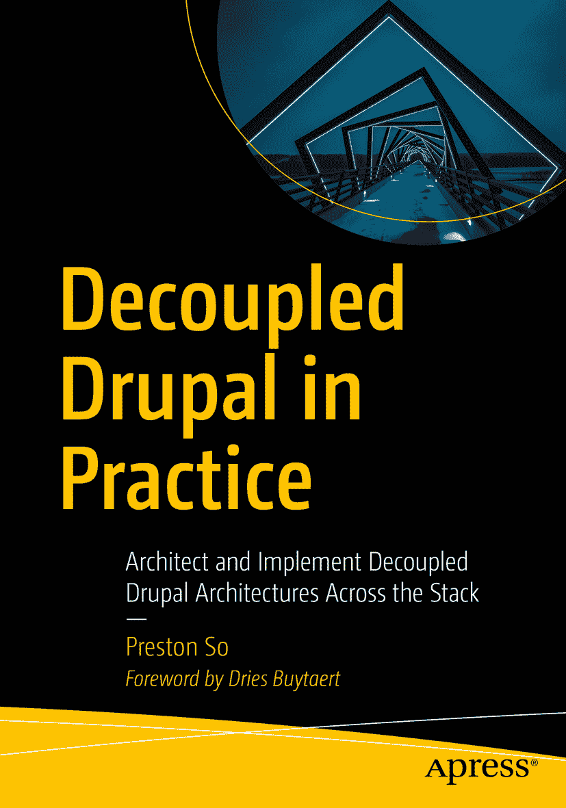

ISBN 978-1-4842-4071-7 e-ISBN 978-1-4842-4072-4 [`doi.org/10.1007/978-1-4842-4072-4`](https://doi.org/10.1007/978-1-4842-4072-4)
美国国会图书馆控制号：2018964944
© Preston So 2018
本作品受版权保护。出版商保留所有权利，无论是涉及材料的全部还是部分，特别是翻译、重印、重用插图、朗诵、广播、在缩微胶片或其他任何物理方式上复制，以及电子化传输或信息存储与检索、电子改编、计算机软件或任何目前已知或未来开发的类似或不同方法技术的权利。本书中可能出现商标名称、标识和图像。我们仅在编辑风格中使用这些名称、标识和图像，以维护商标所有者的权益，无意侵犯商标权。本书中使用的商品名、商标、服务标记和类似术语，即使未被明确标识，也不应被视为对其是否受所有权保护的表达。尽管本书中的建议和信息在出版时被认为是真实和准确的，但作者、编辑和出版商均不对可能存在的任何错误或疏漏承担法律责任。出版商对本书内容不作任何明示或暗示的担保。本书通过 Springer Science+Business Media New York 在全球图书贸易中发行，地址：233 Spring Street, 6th Floor, New York, NY 10013。电话：1-800-SPRINGER，传真：(201) 348-4505，电子邮件：orders-ny@springer-sbm.com，或访问 www.springeronline.com。Apress Media, LLC 是一家加利福尼亚有限责任公司，其唯一成员（所有者）是 Springer Science + Business Media Finance Inc (SSBM Finance Inc)。SSBM Finance Inc 是一家特拉华州公司。

*谨以此书献给我的母亲，致以爱意。*

