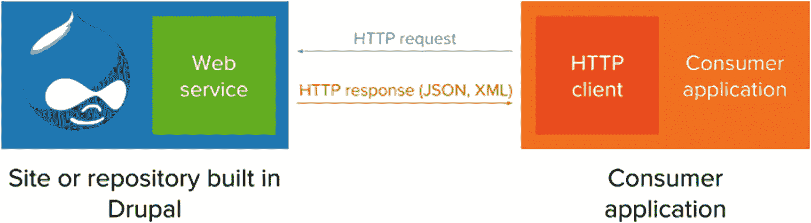

# 1. 不断变化的网络

关于寒武纪大爆发——地球历史上一个开创性事件——最引人注目的事实或许是，现存的生命形式在 5.41 亿年前的化石记录中，于同一时刻从以单细胞生物为主，多样化发展为构成了当今大多数动物王国的多细胞生物。在过去几年中，数字体验和内容管理正处于另一次寒武纪大爆发之中——这次爆发的不是生命形式，而是形态因素。

如今，用户面对的是与各类组织互动方式的快速增长的饕餮盛宴。例如，美国一名典型的大学生体验可能涉及一系列接触点，包括网站、移动应用、数字标牌和交互式信息亭。这种现象引发了一个根本性问题：如何为日益广泛的体验做好准备并进行架构设计，使其接近*内容无处不在*的理想状态。在深入探讨我们如何构思和构建这些体验之前，不妨先退一步，审视我们走过的路、数字体验的演变历程以及未来的发展方向。我们只能构建我们能清晰定义的内容。

## 网站现在仅仅是起点

直到 20 世纪 90 年代末，绝大多数网站内容都是由文本、图片以及（不常出现的）其他媒体资产构成的。这种网络内容的原始状态由大段的叙事或长篇文本组成，图片和其他媒体穿插其中。从网络用户体验的角度来看，大多数用户仅依靠鼠标和键盘（桌面计算机的主要交互方式）与这些体验进行交互。

即使在第一次浏览器战争末期，编写网站的标准也并未在负责浏览器的各个厂商之间得到统一规范，即便是在哈康·维姆·莱于 1994 年颁布的层叠样式表（CSS）标准于 20 世纪 90 年代末成为广泛理解的规范之后，情况依然如此。万维网联盟（W3C）既定标准长期以来未被广泛采用，这阻碍了网页开发领域最佳实践的发展，例如放弃基于表格的布局以及引入基于`CSS`的布局。与此同时，浏览器制造商网景和微软之间的激烈竞争掩盖了 JavaScript 的兴起。这种编程语言最初由布兰登·艾奇于 1995 年仅在十天内完成原型设计，随后在不同的浏览器中得到了截然不同的实现。

自由且开源的 Drupal 内容管理系统（CMS）在其 1.0 到 3.0 版本发布期间，在向服务端动态网页的演进中发挥了作用。服务端动态技术的出现，使得服务端实现（例如 CMS）能够创建标记，并将模板与从数据库检索到的用户生成内容拼接起来，从而颠覆了之前通过文件传输协议（FTP）上传平面 HTML 文件及媒体资产的方法。反过来，服务端动态是 21 世纪头十年此类应用程序逻辑向客户端迁移的重要前身。更多细节见第 3 章。

对于许多 Web 开发者来说，很难理解在当前行业状态下，网站仅仅被视为起点。尽管如此，还有无数其他格式，其最佳实践和标准的规范化（类似 21 世纪初网络所经历的那样）仍处于起步阶段。

## 从网站到 Web 应用

Web 2.0 和动态 HTML（DHTML）预示着网页交互元素的到来，标志着 Web 应用时代的开始。21 世纪初，JavaScript 不再像以前那样因在不同浏览器中实现方式不一致而声名狼藉，而是被用于通过异步 JavaScript 和 XML（Ajax）增强交互。这促进了网页刷新到浏览器后，在客户端进行动态标记更改。

借助 Ajax 范式，前端开发者受益于`XMLHttpRequest`（XHR）应用程序编程接口（API）（这是浏览器中 JavaScript 的核心功能），能够从服务器异步检索数据，并提供无需完全刷新页面的后台操作。这一转变可以被认为是网站真正成为 Web 应用的时刻，而不再是交付到浏览器的静态资产，从而巩固了摆脱服务器端拼凑的平面 HTML 或标记的做法。 “新”网页是包含动态部分的网页，这些部分消除了往返服务器多次的必要性。

在 Web 开发历史的这个节点上，网站与 Web 应用之间的区别变得越来越模糊，至今仍难以明确界定这种差异。更多关于客户端 JavaScript 的演进、由此引发的 JavaScript 复兴以及通用（同构）JavaScript 的信息，请参见第 3 章。

## 响应式网页设计

21 世纪末期出现了响应式网页设计（RWD），这是一种让网站能够无缝适配桌面端、平板端和移动端，无需提供页面不同版本的方法。通过将内容视为可以适应其容器的流体（"内容如水"），响应式网页设计这一由 Ethan Marcotte 于 2010 年提出的术语（尽管早在 21 世纪初某些网站就已有所体现）消除了网页设计中桌面端与移动端的割裂，如今已遍布整个网络，成为用户界面可塑性的重要典范。^(¹)

在 RWD 中，网页内容既能遵循传统网站的框架，也能在移动设备上展现许多原生移动应用的特性。从用户角度来看，移动设备上的体验相似但又有区别：在移动端，文本和图片等大多数资源会铺满整个视口。

## 原生桌面与移动应用

原生桌面与移动应用，以及构建它们的框架已经存在多年，但它们通常是专有生态系统与平台特定技术的结合。开发者需要与两个截然不同的生态系统和社区打交道：用`Objective-C`编写 iOS 应用，而用`Java`编写 Android 应用。

到 21 世纪末期，旨在促进跨设备原生移动应用实现的框架开始出现。这些框架往往基于非原生代码，例如`Xamarin`将用`C#`编写的应用转换为原生就绪代码。`Titanium`和`Cordova`（原名`PhoneGap`）的发布反映了向"网页转原生"框架的新趋势——这些针对构建原生移动应用优化的 Web 框架，使开发者能够先编写自己熟悉的代码，再将其编译为原生代码。到 2013 年，全球约 10%的智能手机上运行的应用由`Titanium`提供支持。^(²)

随着 JavaScript 的复兴，`React`和`Angular`等 JavaScript 框架与库通过提供`React Native`、`Electron`和`Ionic`等纯 JavaScript 转原生框架，已深度融入"网页转原生"范式。其中一些框架还提供通过 Web 技术构建原生桌面应用的功能。因此，JavaScript 转原生框架通过宣称 Web 应用应与原生应用难以区分，着力强调应用的跨平台相似性。

## 零用户界面

在 Web 开发领域之外，用户界面也以同样颠覆性的方式发展，在各类渠道中占据一席之地——企业需要在这些渠道中考虑网站、Web 应用和原生应用之外的选项。如今日常使用的一些用户界面已不再依赖手动或可视化的交互组件。这类零用户界面完全摒弃屏幕和物理操作元素。^(³)

Amazon Echo 和 Google Home 等语音助手符合零用户界面范式，但其他依赖听觉或手势操作的界面也属于这一范畴，例如环境界面和触觉界面——它们对周围刺激做出反应，而非依赖用户在屏幕上的显式输入或手动操作。虽然远超出本书范围，但随着界面本身变得日益自适应和智能化，零用户界面及其交互设计将需要重新审视可用性测试。

### 对话式内容

对话式内容（通过文本或语音对话与内容互动）在过去几年一直是营销团队和企业的热门目标。前述语音助手占据了对话式界面的一端，但传统聊天机器人、短信文本机器人和 Facebook、Slack 上的即时通讯机器人也在改变内容访问的面貌。Amazon Echo 和 Google Home 等语音助手可通过自定义功能进行编程，而 Cortana 和 Siri 等设备助手则反映出更封闭的生态系统，限制了自定义代码的扩展。

没有提供通往目标内容的分岔路口的信息架构，对话式内容便无法访问。它倾向于简短的单轮语句以保持注意力，且不能依赖音频之外的媒体资源。用户只能通过口头或书面的语言形式与对话式界面进行交互。

对许多企业而言，通过基础聊天机器人将基于 Web 的内容直接作为对话式内容呈现，虽能满足集中式内容的需求，但对需要更贴近真实人际交流的对话友好型内容的客户来说远远不够。精心设计对话式内容仍是一片相对未经探索的荒野，在`Dialogflow`（原名`api.ai`）等新兴企业的推动下，平台无关性正开始在此成形。

## 增强现实与虚拟现实中的内容

随着内容日益对话化，它也变得越来越情境化。机器视觉（检测和识别设备视野中的物品）和增强现实（AR：在真实世界投影上叠加媒体）等新兴技术预示着未来内容将在我们的物理世界和数字世界中同样占据重要地位。

对营销团队和企业而言，尤为重要的是强调基于位置的内容——这些内容可以存在于用户物理环境的上下文中，无论是用户实际环境的投影（如 AR）还是虚构呈现（如虚拟现实[VR]）。Forrester Research 在 2016 年指出："企业将继续尝试 AR 和 VR，为 2018 和 2019 年更大规模的部署奠定基础。"^(⁴) 紧随 2018 年消费电子展之后，埃森哲委托的一项调查也支持了这一观点，^(⁵)表明用户对 AR 和 VR 中提供环境信息或帮助提升特定任务表现的界面越来越适应。AR 和 VR 的实用性如今已远远超越其游戏导向的局限。^(⁶)

这些叠加在 AR 和 VR 界面上的内容不仅具有情境性，而且会覆盖或投射在用户视野之上。因此，与 Web 内容或对话式内容不同，任何有限的文本或媒体资源都需要与用户体验中已有的视觉元素互补。与通过显式输入进行交互的对话式界面或手动界面不同，AR 和 VR 界面通常依赖用户视角或手势来切换应用状态。

### 情境内容

随着地理定位技术的日益成熟，精确锁定用户位置使得根据用户当前所在位置来优化内容投放成为可能。有多种方法可以三角测量用户的位置，但目前最常用的方式是借助智能手机上的定位服务或蓝牙低功耗（BLE）近场信标（如 Estimote 公司生产的产品）。如今，WiFi 也能实现这一功能。

近期，借助信标及其他物联网（IoT）硬件来传递个性化内容的“近场营销”正日益受到重视。我们在日常生活中消费的内容，正越来越呈现地理空间化、位置化和情境化的特点。支撑这类内容传递的是一系列协同运作的技术，它们共同促成了更具情境感的数字体验。ABI Research 在 2015 年的一份报告中指出，到 2020 年，支持蓝牙的信标出货量将超过 4 亿个^(⁷)。与此同时，沃尔玛、塔吉特和梅西百货等企业已采用信标来提升其卖场体验，而万豪酒店的 14 家分店目前也正在使用信标，作为传递推广信息、展示可用宾客设施的手段^(⁸)。

然而，由于需要协调横跨多种硬件设备（每种设备都有自己的软件开发工具包 SDK）的复杂性，这种形式的情境内容往往仍然难以企及。用内容来增强用户的视角和周围环境——而不是反过来——这一愿景，与优先考虑内容的网站设计和架构方式相去甚远。

### 其他渠道

我们无法涵盖所有可能的内容传递渠道，但在整个行业中，有三个渠道尤为突出，分别是可穿戴技术、数字标牌以及苹果电视（Apple TV）和 Roku 等机顶盒。

在这些渠道中，数字体验固有的局限性限制了内容的呈现方式。例如，数字标牌将清晰可读性置于首位，因此内容数量较少，以便在远距离也能看清。在另一个极端，由于智能手表上的屏幕空间极为宝贵，内容必须以小号字体呈现。与此同时，机顶盒则受到设计局限，需要将内容封装在遵循严格规则的预制模板中。

### 结论

渠道的爆炸式增长仍在持续，内容传递及其技术范式的交织叙事，挑战着在一个越来越脱离屏幕的数字体验世界中，“内容”真正含义的本质。在本章中，我们审视了内容必须成功应对的多个维度，以便更好地将我们需要呈现的内容，与传递这些内容的机制分离开来。

虽然 Drupal 历来专注于为网站消费提供内容，但解耦式 Drupal 要求开发者、设计师和架构师共同重新思考这一重点，转向一种更与渠道无关的立场，使内容不再受制于严格的呈现机制。在下一章中，我们将深入探讨 CMS 自身的演变过程，以及解耦式内容管理如何成为一种引人注目的范式。

脚注 1 2 3 4 5 6 7 8

## 服务端：从单体式 CMS 到解耦式 CMS

有两个长期趋势促使解耦式 Drupal 成为了一种可行的方案，而非不切实际的想法。理解这些过程，对于了解 CMS 如何默认地朝着与渠道无关的方向发展至关重要。

首先，为了应对渠道爆炸和多渠道发布工作流这一趋势，CMS（如同许多其他软件项目一样）已逐渐采用 RESTful API，将其作为一种向众多不同消费者提供数据的手段，而非仅仅服务于一个与后端紧密耦合的单一呈现层。这些解耦式架构使得众多消费者依赖单一数据服务，反映了 CMS（服务端）与其前端（客户端）的分离，以便向不同的消费者传递数据。

其次，如第 1 章所述，近年来，客户端趋向于更动态、更少静态的趋势，彻底改变了用户体验和 Web 开发范式。大多数创建交互式体验的努力，都涉及用更具应用特性的行为来丰富网页，这体现在原生应用中所见的无缝用户体验功能上，例如状态间的过渡，以及无需用户明确请求即可实时呈现新内容。大多数 Web CMS 都构建于早期的 Web 2.0 时代（见第 3 章），当时编辑界面只需处理内容的显示，而非行为。

传统上，CMS 采用单体式而非解耦式架构，软件管理着内容管理的所有元素，从数据库访问、模板中的字符串拼接，到页面渲染以及两者之间的所有环节。这种描述适用于许多长期存在的 CMS，如 WordPress 和 Joomla。然而，新设备和应用的普及，促使 CMS 领域中的许多参与者重新利用现有的与其它系统通信的方式（通常用于服务器到服务器的通信），来向一系列前端消费者提供内容。

Drupal 是由 Dries Buytaert 于 2001 年创建的自由开源 CMS，是一个用 PHP 编写的框架，并在 GNU 通用公共许可证下发布。历史上，Drupal 被用于各种网站，如个人博客、复杂的企业和政府网站，以及知识管理网站。Drupal 社区是全球性的，拥有来自世界各地的数千名贡献者。

### 单体式内容管理

过去，这些基于 Web 的实现往往是单一化的，用户无法使用原生移动应用或其他体验形式；简言之，唯一的访问方式就是通过传统途径使用 Web 浏览器。然而，由于这些网站现在通常并行运行着其他应用，将单一内容源作为应用生态系统的核心，已成为一个至关重要的问题。

然而，Drupal 历来采用*单体式*架构，这意味着它是一个连贯的端到端系统，无法将子系统彼此解耦，特别是封装了 Drupal 前端的 Drupal 主题层。这种紧密耦合导致了一些症状，例如前端出现*Drupalisms*现象，即晦涩的 Drupal 术语被暴露为 HTML 和 CSS 类，这会让那些不太熟悉 Drupal、却要负责构建 Drupal 主题的前端开发者感到困惑。

关于这种耦合在涉及多个客户端时有多紧密，以下是一个例子：在版本 7 之前的 Drupal 版本中，无法将原始 Drupal 内容（而非 Drupal 完全渲染的 HTML 页面）提供给其他系统或前端。换句话说，不可能仅将 Drupal 用作其数据库抽象层或其视图（Views）集合。

## 解耦式内容管理

与之相反，*解耦式* CMS 架构涉及系统中的各组件通过机器对机器接口（例如 Web 服务）进行交互，而不像 Drupal 子系统那样显式地相互依赖。虽然某些面向服务的系统完全由可独立通信的小型组件构成，但大多数可解耦的 CMS 倾向于在*前端*（或客户端）与*后端*（或服务端）之间实现这种关注点分离，从而为两端提供更高的灵活性。

通过天文隐喻来阐释单体式 CMS 与解耦式 CMS 的区别是一种有效的方法。我们可以将单体式 CMS 想象成地球，它是一个连续的、拥有许多相互依赖子系统的整体。与此同时，解耦式 CMS 可以被看作是拥有许多卫星的独立地球，这些卫星在 CMS 与解耦消费者之间传输和接收消息，如图 2-1 所示。

图 2-1

在此图中，火星代表“解耦”的基地，它们通过与“单体式”地球（此例中为单体式 Drupal）进行请求和响应来交换数据。

例如，设想这样一个场景：一个存储信息能力有限的火星基地必须从地球的任务控制中心检索特定数据，才能保持正常运行。火星基地无需在火星上内置存储和准备这些数据所需的所有机制，而只需向地球请求其当时所需的少量关键任务信息。这样，火星基地就能以更轻量级的方式运行，因为地球上的任务控制中心是唯一负责处理这些数据所有其他相关事务（例如归档和传输准备）的单位。

对 Drupal 而言，这个类比也颇为贴切，因为 Drupal 8 并非以面向服务的方式构建。也就是说，当 Drupal 8 被解耦时，并不意味着它的子系统彼此分离。相反，当其他解耦系统取代其位置成为数据消费者时，Drupal 的主题层就被*闲置*了。正如我们稍后将看到的，这就是为什么 Drupal 能够实现如此多样且灵活的建筑方法（见第 4 章）的原因。

正因如此，经常互换使用来描述 Drupal 的*解耦式*和*无头式*这两个称谓，其实并不像看起来那么准确。简而言之，Drupal 的传统形式是一个支持解耦应用的单体式 CMS，但其内部依赖关系并未消失，因此它自身并非解耦的。相反，传统 Drupal 的解耦体现在其通信接口使其能够作为 Web 服务运行，并且无需启用前端。

### 注意

一些从业者更倾向于将解耦式 Drupal 称为无头式。从最广泛的意义上讲，*无头软件*是指不使用图形用户界面（GUI）的软件。然而，对于 Drupal 而言，这样的界面已经存在，即命令行界面 `Drush` 和 `Drupal Console`，它们使得仅通过终端就能管理 Drupal。尽管如此，*无头式*确实有效地说明了未使用 Drupal 耦合前端的情况。这两个术语都存在不精确性以及由其他术语带来的含义。

图 2-2 是一个简单的渲染图，描绘了解耦式 Drupal 的基本架构。我们将在第 3 章再次讨论此图。

图 2-2

在此图中，一个充当传统站点或内容存储库的 Drupal 站点包含一个 Web 服务（通常是 RESTful API），该服务接受 HTTP 请求，并以 `JSON` 或 `XML` 格式向位于解耦应用程序（可能是服务端或客户端）中的 HTTP 客户端发出 HTTP 响应。

### Web 服务

如今，*RESTful API*（Web API 的一个特定子集）是 Drupal 与其他系统或应用程序之间最常用的通信接口。这里有几个需要解读的重要术语，即 *API*、*REST* 和 *RESTful API*。

API 由一组定义好的方法和对象类组成，这些方法和对象类共同描述了当执行某些操作时，Drupal 等框架的预期行为。简而言之，API 通过仅暴露开发人员在构建基于该框架的应用程序时可能需要的类或方法，来抽象化框架的底层实现。

### 注意

所有 Drupal 版本的 API 参考位于 `api.drupal.org`。Drupal 8 更深入的 API 文档位于 `drupal.org/docs/8/api`（包括 RESTful API 的文档），Drupal 7 的则位于 `drupal.org/docs/7/api`。

Drupal 拥有许多用于管理扩展和重用现有实现的 API，例如 `Database API`、`Entity API` 和 `Form API`，但直到 Drupal 8 才拥有 Web 服务和相应的 API。*Web 服务 API* 是允许在 Drupal 等 Web 服务器之间，或在 Web 服务器与客户端之间进行机器对机器通信的 API。

在 21 世纪初，许多 Web 服务 API 都基于当时可用的开放标准构建：可扩展标记语言（`XML`），作为数据格式；简单对象访问协议（`SOAP`），作为通信传输协议；以及 Web 服务描述语言（`WSDL`），一种用 `XML` 描述 Web API 的方法。后来，JavaScript 对象表示法（`JSON`）成为通过 Web 服务 API 编码数据的流行格式，因为它天然适合客户端 JavaScript 代码，并且可以有效规避解析 `XML` 的挑战。

### 注意

W3C 在 2002 年将 *Web 服务* 定义为“旨在支持通过网络进行可互操作的机器对机器交互”。^(⁹) 然而，这比前面给出的定义更狭窄，并包含了几项要求，最值得注意的是在 `HTTP` 上使用 `SOAP` 而不是 `REST`。

## REST 与 RESTful API

当今许多 Web 服务 API 都遵循*表述性状态转移*（`REST`）的理念，被称为*REST 兼容*。`REST`一词由 Roy Fielding 在其关于该主题的论文中提出，包含一组用于设计 Web 服务的架构原则。REST 兼容（即 RESTful）的 Web 服务允许其他系统通过有限且不变的无状态操作集合，查询和修改*Web 资源*——这些资源是位于特定统一资源标识符（`URI`）处数据的有状态表示。这些 Web 资源是底层数据的表示，通常序列化为`JSON`或`XML`格式。

一个 RESTful API 必须遵守特定的架构约束（通常以其提出者命名为*Fielding 约束*），才能被视为 REST 兼容或 RESTful：

*   *客户端/服务器分离*：客户端/服务器模型是 Web 架构中最典型的关注点分离示例之一。RESTful API 假定数据的最终消费者包含展示这些数据的用户界面。RESTful API 本身位于负责数据存储的服务器端。
*   *无状态*：REST 客户端（即 RESTful API 的消费者）不应将客户端应用的状态信息传递给服务器进行存储和使用。消费者发出的每个请求都应包含在服务器端执行该请求所需的全部信息，使得所有状态都由消费者维护。
*   *可缓存*：RESTful API 的响应应包含关于该响应可缓存性的信息。这旨在防止客户端在响应时使用过时或不合适的数据。
*   *分层系统*：RESTful API 必须能在存在中间件或中介（如缓存系统或负载均衡器）的环境中正常运行。因为客户端通常不清楚其发出请求的最终目的地性质。
*   *按需代码*：尽管可选，服务器也可能通过 RESTful API 以客户端 JavaScript 的形式传输额外的可执行代码。这允许客户端通过服务器端的逻辑进行扩展。
*   *统一接口*：这是所有 Fielding 约束中最重要的一个。客户端必须能够依赖统一且不变的接口来查询和操作服务器端的数据。资源通常在请求中由其`URI`标识，并且仅通过其表示（例如`JSON`或`XML`）进行操作。客户端必须通过资源表示获得足够的信息（例如 Internet 媒体类型），才能在客户端执行修改、删除或处理资源的操作。最后，RESTful API 必须遵守*超媒体作为应用状态引擎*（`HATEOAS`）标准，即 REST 客户端应能利用服务器初始响应提供的链接，仅通过 API 的响应（而非任何硬编码信息）来理解如何与 API 交互。

*RESTful API*是指那些兼容 REST 的 API；也就是说，它们遵循`REST`制定的架构原则。RESTful API 使用 HTTP 方法（`GET`、`POST`、`PATCH`、`DELETE`等）进行操作，并定义特定的 Internet 媒体类型（例如`application/vnd.collection+json`）来格式化表示。它们还有一个基础的`URI`，作为 REST 客户端的初始入口点。

### RESTful 与 API 优先的 Drupal

在介绍了`REST`的关键原则和 Web API 的一些基础知识之后，我们可以审视 Drupal，以及它如何定义自身为 RESTful 或非 RESTful。`REST`的广泛使用导致 Drupal 社区在识别哪些 Web 服务解决方案是 RESTful 时存在一些混淆。

在 Drupal 6 和 7 中，Web 服务 API 能力仅限于贡献模块，最著名的是*Services*，它提供了专门用于高效操作 Drupal 站点的 API。然而，由于其广泛的功能远超常规 RESTful API 的范畴，`Services`并未明确遵循 Fielding 约束，这意味着它并非严格意义上的 RESTful。尽管如此，Drupal 7 中还有其他模块可用，例如`restWS`和`Restful`，它们确实遵守 REST 约束。

在 Drupal 8 的开发过程中，Web 服务与核心上下文倡议（`WSCCI`）致力于允许使用 Drupal 通过网络进行服务器到服务器的通信。这项由 Larry Garfield 协调的社区倡议，促成了多个模块的创建，其中最著名的是`REST`模块，它为 Drupal 中的 RESTful API 奠定了基础。Drupal 8 Core 默认提供的 REST API 是兼容 REST 的（参见第 7 章）。

在 Drupal 8 的贡献模块生态系统中，有几个重要的额外模块可用，包括 Drupal 8 的非 RESTful `Services`模块。首个兼容 REST 的模块`RELAXed Web Services`遵循`CouchDB` API 规范，侧重于内容暂存、内容工作流以及面向`PouchDB`和`Hoodie`的用例（参见第 8 章和第 13 章）。在本书付印时，`JSON API`模块（在 Drupal 中实现了同名的 RESTful API 规范）计划作为稳定模块包含在即将发布的 Drupal 核心版本中（参见第 8 章和第 12 章）。

近年来，出现了其他不遵循`REST`的方案，这些方案承诺提供超越 REST 兼容解决方案的某些功能，最著名的是`GraphQL`（参见第 8 章和第 14 章），这是一种专为消费者驱动查询（因此响应也针对消费者定制）的查询语言。由于对何种模块构成 REST 兼容存在混淆，从现在起，我们仅将使用具有 RESTful 功能的模块的 Drupal 实现称为 RESTful Drupal。

在这种情况下，*API 优先的 Drupal*指的是使用具有任何 Web 服务功能的模块的 Drupal 实现，无论该模块是否兼容 REST。这还包含 Drupal 是*API 优先*的理念，即 Web 服务被视为 Drupal 最核心的功能，使用 API 的消费者是 Drupal 最重要的用户。事实上，这正是 Drupal 社区持续开展*API 优先倡议*的原因，该倡议是`WSCCI`的直接继承者，致力于推动 Drupal 成为 Web 服务提供商。

## 内容即服务

解耦管理的应用并不止于此。Drupal 中广泛存在的 Web 服务解决方案之外的一项额外发展，激励了社区承认并重视其他应用的开发者的重要性——这些开发者可能希望仅将 Drupal 作为后端 Web 服务提供商。

解耦内容管理最早的典型例子源于一种预先存在的平台类别，称为*移动后端即服务*（mBaaS 或简称为 BaaS），其目标是为原生移动应用提供集中化的数据存储库。典型功能不仅包括数据存储和访问，还包括移动特定功能，例如推送通知和与其他系统的集成，这些功能通常依赖于客户端使用的 SDK。mBaaS 供应商的例子包括 Kinvey 和 Built.io。

鉴于 mBaaS 平台专用于原生移动应用，*内容即服务*（CaaS）则涵盖了所有涉及内容和内容应用程序的用例。在 CaaS 模型中，内容按需交付给消费通过托管订阅许可的 Web API 的客户端应用程序。该平台充当任何消费者应用的内容存储库，并通常提供额外的内容管理功能，例如内容工作流和用户管理。CaaS 供应商的例子包括 Contentful 和 Prismic。

许多人选择解耦 Drupal，是因为他们希望利用 Drupal 强大的内容管理能力，以及解耦前端所能提供的更大灵活性。其他人这样做则是因为他们可能需要 Drupal 之外的应用来查看和操作单一的内容集合。无论哪种情况，尽管 Drupal 可能不如 mBaaS 或 CaaS 提供商那样专业，但 Drupal 受益于其端到端免费开源软件的承诺，包括专门针对解耦用例的 Waterwheel SDK（见第 16 章）。

这意味着，如果您自己托管 Drupal 和任何由 Drupal 支持（即消费或操作 Drupal 数据）的应用，您可以利用 Drupal 作为后端 Web 服务提供商，而无需支付任何费用。

### 结论

Web 服务 API 支撑着所有解耦的 CMS 架构，因为它们是数据从服务器传输到消费者的通道。一些 Web 服务 API 也是 RESTful 的，这意味着它们遵循某些约束，这些约束构成了广泛使用的 API 的特征。然而，近年来，非 RESTful 的 Web 服务解决方案在 Drupal 社区内外也变得流行起来。

CMS 历史上是一个单一整体，但由于多渠道内容工作流的需求——将内容发布到许多不同的表示层——它已经变得解耦。在本章中，我们探讨了这一演变是如何发生的，以及 Drupal 的努力如何使其在更广泛的行业中成为解耦 CMS 的有利定位。在下一章中，我们将转向客户端，解释 JavaScript 等技术的演变如何引发了数据处理和最终呈现方式的全面转变。

脚注 1

