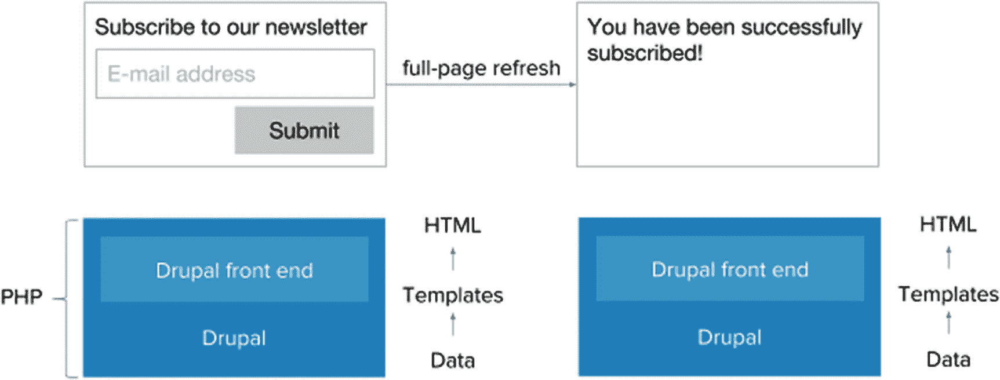
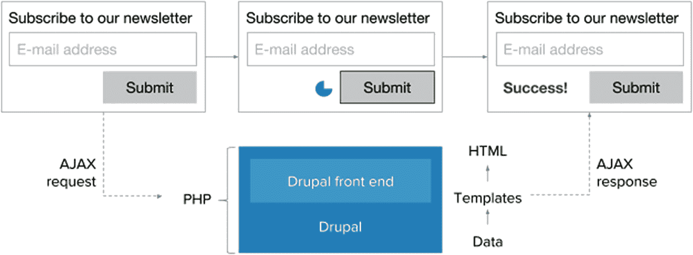
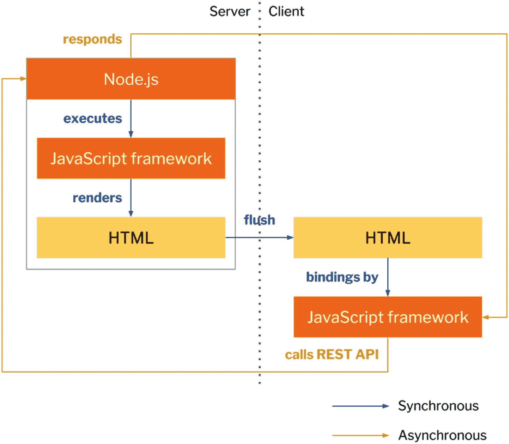
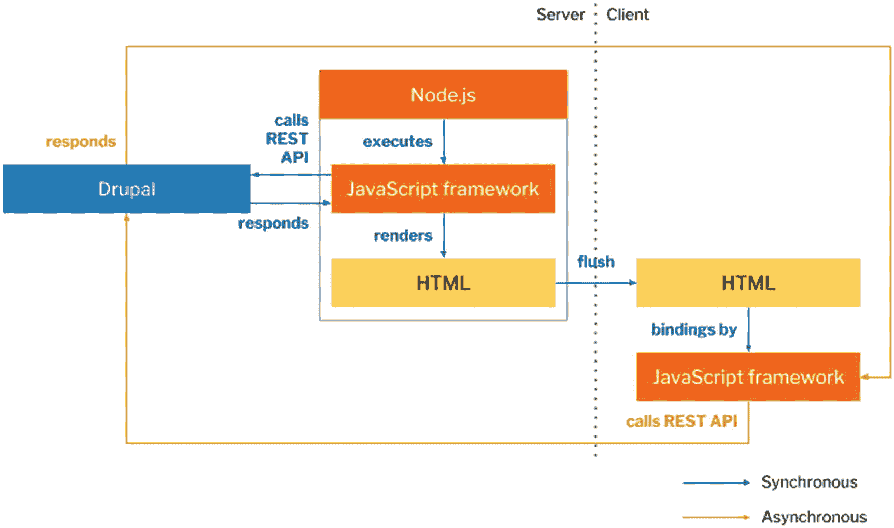

# 3. 客户端：从静态页面到动态页面

新的数字体验和内容渠道的引入，以及支撑其实现的底层软件演变，是导致对解耦内容管理模式产生兴趣的重要因素之一，如第 1 章所述。尽管如此，网页架构的变化——无论是用户对页面的需求，还是页面的构成方式——都直接促使一些人将 Drupal 与其前端解耦，转而使用 JavaScript 驱动的前端。

## 从 Web 1.0 到 Web 2.x

在 20 世纪 90 年代，即 Web 1.0 时代，网页通常是位于服务器上并通过代码编辑器管理的平面文件。这些*静态页面*各自代表了状态，但状态变更只能通过服务器往返实现，这由浏览器中的整页刷新触发，如图 3-1 所示。在 Web 1.0 页面中，这就是 HTML 表单（如新闻通讯订阅表单）如何向用户提供反馈的方式。在 Drupal 的情况下，这将需要两次引导 Drupal。

图 3-1

在 Web 1.0 时代，应用程序通常将应用状态表达为静态页面

21 世纪初，出现了一种处理网页的新方法：像 Drupal 这样的 CMS。在 Web 2.0 中，支持用户生成内容、直观用户体验和跨设备互操作性的网站受到重视。凭借早期对用户生成内容和编辑体验的关注，Drupal 的管理页面可以被视为这一趋势的一部分。

与 Web 2.0 作为一种理想的传播同时，*动态页面*的概念出现了。动态页面可以指两种含义：在服务器端，动态页面由 Drupal 等框架根据各种条件组成，例如登录用户和输入的特定搜索参数。服务器端动态页面也使用像 MySQL 这样的关系数据库，而不是平面文件资产。在客户端，动态页面是由客户端 JavaScript 操作或渲染的页面，它可以解析像 `onMouseOver` 这样的 HTML 属性。

在 2000 年代后期，网页不仅在服务器端变得越来越动态——这要归功于像 Drupal 这样使用 PHP 预处理页面数据的框架——在客户端也是如此。异步 JavaScript 和 XML（Ajax）是一系列客户端技术，用于异步检索和操作服务器上的数据，并动态注入这些数据，而无需重新加载页面。

通过 Ajax，用户体验得到了极大的改善，这在 Drupal 自身的用于动态客户端更新的 Ajax 框架中得到了清晰的体现。以一个普通的新闻通讯订阅表单为例，这意味着在提交时，可能出现一个 Ajax 旋转图标表示数据传输到服务器，随后表单被覆盖以指示成功或失败，如图 3-2 所示。应用状态的每次变更都不再需要整页刷新。

图 3-2

在 Ajax 中，页面的一小部分被替换为一个 Ajax 旋转图标，表示处理正在进行，并重新注入从服务器请求的新信息

支配 Ajax 的原理很快被应用于越来越广泛的场景。不仅表单经历了这种动态替换和无页面刷新的状态变更；页面的整个布局组件，甚至逐渐地整个页面，都成为了客户端动态行为的素材。随着由于浏览器支持不足而需要 JavaScript 替代方案的情况日益减少，客户端技术正在迅速获得发展动力，因为 JavaScript 的采用范围越来越广，用户体验要求也越来越高。

## JavaScript 的复兴

Ajax 运动的影响之一是推动了更广泛的 JavaScript 社区的爆发式增长，这得益于这一曾被视为低微语言的“专业化”。在 2000 年代，由于 JavaScript 应用范围有限以及专有技术的影响，它常被贬低为非程序员使用的编程语言。

在 2000 年代末和 2010 年代初，JavaScript 的使用开始以前所未有的方式被整理和重构。首先，John Resig 创建了 `jQuery`，一个文档对象模型（`DOM`）操作库，这促使 Ajax 技术规范化，并启发了许多其他库效仿。其中一些库是小部件库，而另一些则成为了成熟的应用程序框架。

借助 Ajax，真正的*单页应用*首次成为可能，这类应用通常以极少使用页面刷新、严重依赖 JavaScript 行为为特征。`Angular`、`Ember` 和 `React` 这三个当今最常用的 JavaScript 单页应用构建工具，其开发工作便始于这一时期。与旨在对页面进行小规模修改的 Ajax 方法不同，单页应用框架和库致力于实现无需强制页面刷新的动态全页渲染。

JavaScript 用途发生的这种根本性转变——它不再只是用户界面的装饰器，而是成为了页面渲染器——也促使 JavaScript 扩展到了网页浏览器之外的领域，特别是服务器端。2009 年，开源 JavaScript 运行时环境 `Node.js` 发布。除了通过 Node 包管理器（`NPM`）带来的前端构建工具革命外，`Node.js` 还使得服务端 JavaScript 成为可能。

JavaScript 社区的某些从业者将 JavaScript 的“专业化”视为一场更广泛的 *JavaScript 复兴* 的标志，这场复兴包括从小规模 Ajax 向大规模 JavaScript 框架的转变，以及 JavaScript 从仅限于浏览器到可在构建过程中使用，并且影响最深的是，可在服务器上使用。

## 通用（同构）JavaScript

由于 JavaScript 以前只能在客户端执行，如果 JavaScript 负责整个页面渲染过程，那么大多数功能可用之前，这段代码需要被浏览器下载、解析并执行。衡量用户感知页面性能的两个指标是*首次内容绘制时间*（截止到用户开始在页面上看到内容）和*首次交互时间*（截止到用户能够与应用的用户界面进行交互）。

2010 年，Twitter 在重新设计过程中，构建了一个新的客户端界面，该界面需要大量执行 JavaScript 来渲染和丰富用户界面。客户端 JavaScript 会从一个针对多种设备优化的 Web 服务 API 检索数据，并主要使用客户端逻辑来填充页面。最终，该界面的首次交互时间受到了严重影响，尤其是在性能不足的移动设备上。2012 年，Twitter 采用了一种新方法，即初始页面在服务端渲染，而客户端则启动一个范围更有限的应用，在渲染完成后提供预期的行为。

2013 年，Airbnb 通过使用 `Node.js` 实现*通用*（也称*共享*）JavaScript，重塑了 JavaScript 应用架构。在这种架构中，至少有一部分 JavaScript 在客户端和服务端上以完全相同的方式执行——尽管这些代码在两处都有副本，但实际上是共享的。在服务端，一个应用框架使用通过 `RESTful API` 调用或诸如 `MongoDB` 之类的 `NoSQL` 数据库提供的数据，来组合页面的初始渲染。一旦初始渲染出现在浏览器中，同一个应用框架便开始通过执行异步 `RESTful API` 调用并将更新后的数据注入 `DOM` 来“注水”服务端渲染。

请看图 3-3，它展示了一个典型的同构 JavaScript 实现。

图 3-3

在一个专注于跨客户端和服务端共享渲染的同构 JavaScript 实现中，`Node.js` 执行一个框架，该框架将初始应用状态组合成客户端就绪的标记。这个初始应用状态被传递给客户端，客户端初始化该框架以促进所需的额外客户端渲染，特别是为了“注水”或更新服务端发出的初始状态。

Airbnb 最重要的发明是一个完全可复用的渲染系统。由于 JavaScript 框架在服务端和客户端是相同的，因此调试或维护渲染代码要方便得多。因此，在通用上下文中，服务端渲染和客户端渲染的主要区别不在于使用的模板语言，而在于哪些数据来自服务端以及如何来自服务端。

除了当前通过不断完善的 `ECMAScript 6`（`ES6`）规范实现的 JavaScript 现代化之外，通用 JavaScript 是推动采用 JavaScript 驱动前端的重要动力之一。这意味着，以 `PHP` 渲染页面为中心的庞大 Drupal 系统，可能沦为第二选择。解耦 Drupal 使得可以接入 `Node.js` 和 JavaScript 同构。

图 3-4 展示了一个典型的、消费 CMS（此处为 Drupal）的同构 JavaScript 实现。

图 3-4

在一个由 CMS 提供数据的同构 JavaScript 实现中，`Node.js` 执行一个框架，该框架从诸如 Drupal 之类的 CMS 检索数据，然后将初始应用状态组合成客户端就绪的标记。客户端发出的任何异步请求都将被定向到 CMS。

## JavaScript 到原生应用

最后要强调的一点是，构成应用生态系统的各个应用（不仅包括传统的 Web 应用，还包括移动端和桌面端的原生应用）之间对统一性的需求日益增长。这既是出于在不同用户体验和开发者体验之间保持对等的需要，也是为了允许开发团队更快地推向市场。为此，许多 JavaScript 框架现在都提供`JavaScript 到原生`的编译，即用 JavaScript 驱动的单页应用编写的代码可以被重写为机器码。

适用于 Android 和 iOS 的原生移动应用通常需要使用 Java（适用于 Android）或 Objective-C 和 Swift 等语言（适用于 iOS）。`Angular` 和 `React` 分别使用 `Ionic` 和 `React Native` 将单页 JavaScript 应用编译成原生代码。与此同时，对于桌面应用（通常仍使用其他技术），像 `Electron` 这样的解决方案允许用 JavaScript 编写的单页应用被编译为原生应用。例如，开源代码编辑器 Atom 其核心是一个 Web 应用，但使用 `Electron` 来兼容桌面平台。

### 结论

客户端领域近年来经历了巨大的演变，从前端网页开发中 Ajax 与 jQuery 的普及开始，最终迎来了 JavaScript 的复兴以及通用 JavaScript 的推广。由于异步请求和动态客户端网页带来的新需求，内容管理系统（CMS）日益成为重要的数据源头和 web 服务 API 的提供者，这些 API 允许在应用层进行状态变更。

JavaScript 在 web 开发行业的广泛传播以及其使用方式的显著变化，突显了这样一个事实：由于其在服务器端和客户端均具有吸引力，JavaScript 将在此后多年内持续被使用。在本章中，我们深入探讨了 JavaScript 复兴所引发的动机与变革，以及其对 JavaScript 应用与 Drupal 之间关系的影响。在下一章中，我们将更正式地将解耦式 Drupal 定义为一组架构范式，并依次描述最常见的几种解耦式 Drupal 方案。