# 4. 解耦式 Drupal

简而言之，解耦式 Drupal 是指将 Drupal 用作一个 web 服务提供者，它向其他应用暴露数据以供其使用（图 4-1）。Drupal 可用于支撑其他服务器端应用、原生桌面与移动应用、单页 JavaScript 应用、OTT (Over-The-Top) 应用以及物联网应用。实际上，任何能够向 web 服务发起请求的应用，都可以成为解耦式 Drupal 实现所暴露 API 的消费者。

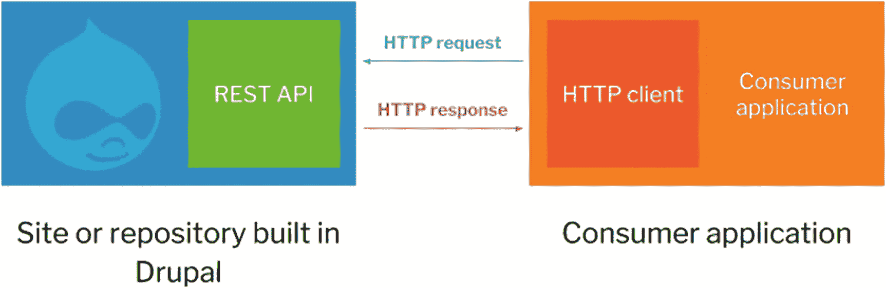

图 4-1

在其最简单的形式中，解耦式 Drupal 涉及通过 HTTP 请求与响应进行通信：一方是 Drupal 站点或内容仓库中的 web 服务（如 RESTful API），另一方是 Drupal 支撑的消费者应用（如单页 JavaScript 应用）中的 HTTP 客户端。

我们可以在图 4-2 中看到单体式 Drupal 与解耦式 Drupal 的区别。在单体式 Drupal 中，Drupal 前端是整个 Drupal 启动流程不可或缺的一部分；因此，整个实现都是用 Drupal 的原生 PHP 编写的。而在解耦的情况下，消费者应用使用任意语言（如 JavaScript、Java 甚至 PHP）编写，并通过服务器端的 RESTful API 与 Drupal 进行交互，如图 4-3 所示。

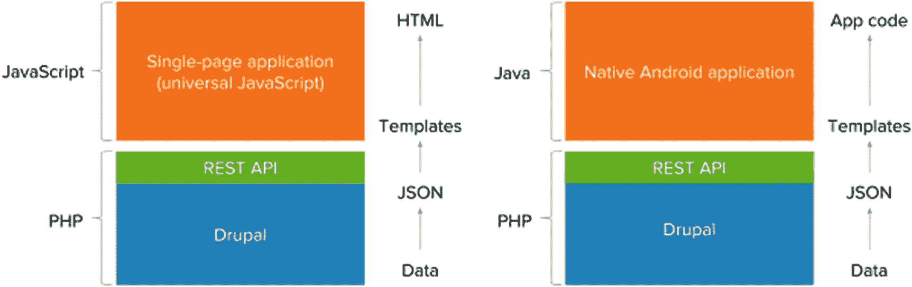

图 4-3

一个解耦式 Drupal 实现可以服务于任何类型的 Drupal 支撑的消费者，包括用 JavaScript 编写的单页应用（左侧）或用 Java 为 Android 编写的原生移动应用（右侧）。

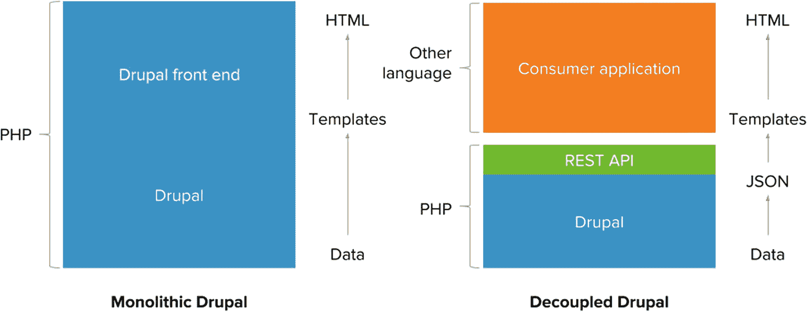

图 4-2

在单体式 Drupal（左侧）中，从数据检索到模板渲染的整个启动流程都是用 PHP 编写的，并且 Drupal 前端（主题层）与 Drupal 的其他子系统密不可分。在解耦式 Drupal（右侧）中，消费者应用可以使用任意语言，而 RESTful API 则充当了 Drupal 及其客户端之间的桥梁。

一个关键的注意事项是，单个 Drupal 仓库或解耦式 Drupal 后端可以作为应用生态系统的核心，其中许多应用都依赖于来自 Drupal 的数据，如图 4-4 所示。出于内容联合（content syndication）的目的——即保持所有应用间数据同步的统一内容源至关重要——一个由单个 Drupal 实现为多个应用提供数据的架构可能是最优的。

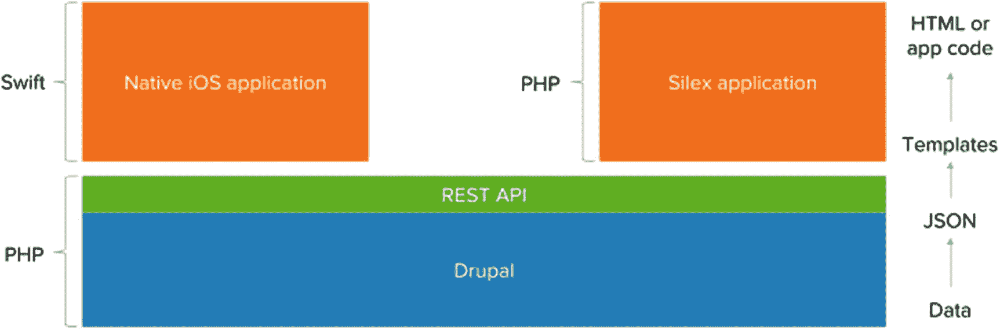

图 4-4

一个单一的 Drupal 站点或仓库可以作为数据枢纽，为共同消费同一 API 的各种应用提供信息。

### 完全解耦式 Drupal

在完全解耦式 Drupal 中，一个解耦的 Drupal 安装作为数据仓库，供 Drupal 支撑的应用使用。换句话说，客户端和服务器端之间完全分离，这导致了 Drupal 用户和开发者拥有不同的体验（见图 4-5）。对于开发者而言，尽管后端保持不变，但前端需要 Drupal 传统上不具备的专业知识。对于最终用户而言，前端可能是 Drupal 在后端提供的管理界面，也可能是取代了 Drupal 主题的面向用户的前端。

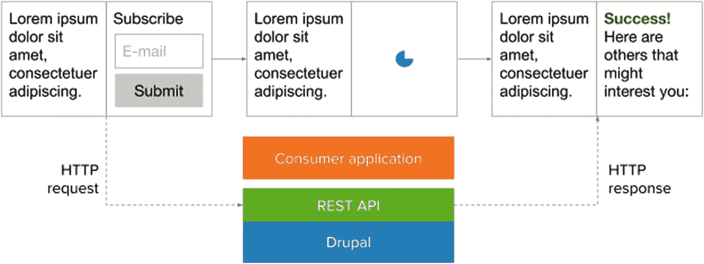

图 4-5

在这个完全解耦式 Drupal 的示例中，一个消费者应用（此处为单页 JavaScript 应用）在服务器端和客户端同时执行所有渲染。Drupal 仅通过 HTTP 请求被调用。

完全解耦式 Drupal 实现通常不会暴露除接收 Drupal 数据的应用之外的其他 Drupal 前端，这要么是因为冗余，要么是因为偏好其他前端。通常，完全解耦式 Drupal 实现仅将 Drupal 用作内容仓库。尽管如此，完全解耦 Drupal 所涉及的关注点分离，通常允许流水线式开发——即由不同专业团队以不同速度并行开发——得以进行（参见第 5 章）。

许多完全解耦的实现由一个独立的解耦前端组成，例如用 JavaScript 框架实现的前端，连接到 Drupal 站点。一些实践者选择完全替换 Drupal 站点的前端，以将品牌体验转化为更具应用感的体验。然而，这种架构意味着，由于不再需要原始的 Drupal 前端，解耦的前端仅仅是替换了 Drupal 的功能，而非增强了它。

## 伪解耦 Drupal

在网站构建与组装方面，这可能成为一个特别棘手的挑战。网站构建者倾向于通过使用 `Panels` 等 Drupal 模块来控制页面的布局和结构，但解耦的前端会削弱这种能力。对于既希望解耦又需要布局控制的使用场景，有一类完全解耦的 Drupal 实现，它们并未被明确归入完全解耦的类别，原因在于其典型的客户端/服务器端关注点分离方式有所不同。

完全解耦的 Drupal 实现通常将结构（数据）和表现（外观）分别交由 Drupal Web 服务提供者和解耦的前端处理。然而，有些项目需求要求采用完全解耦的架构，使网站构建者仍能通过布局工具操控页面结构。在*伪解耦 Drupal* 或*感知 Drupal 的解耦 Drupal*（过去我常互换使用这两个术语）中，关于布局配置的额外表现信息会随 Web 服务提供的结构化数据一同传输。换句话说，Drupal 的前端逻辑被暴露给了解耦的前端。图 4-6 展示了渐进式解耦 Drupal 与伪解耦 Drupal 的对比。

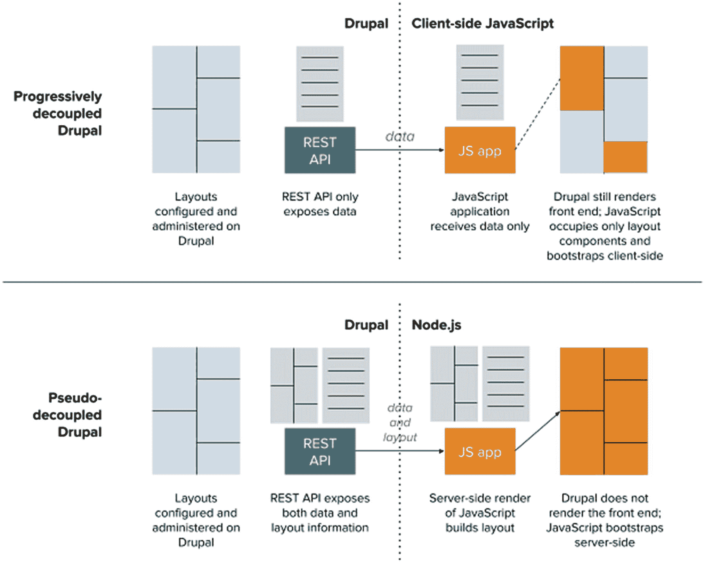

图 4-6

渐进式解耦 Drupal 与伪解耦 Drupal 差异的示意图

例如，`RESTful Panels` 这一模块能将 `Panels` 配置转换为 JSON，并提供 JSON 编码的布局组件名称，其中包含将在消费者应用中填充该布局组件的数据。结果，消费者应用不仅解释了结构（数据），还解释了部分表现（布局），尽管绝大多数表现信息已存在于消费者应用中。此外，渲染过程现在被拆分为两部分：由消费者应用自身范式完成的外部渲染，以及依赖于从 Drupal 获取信息后才能进行的内部渲染。

尽管这种方法具有若干关键优势（包括但不限于更强的网站构建者控制能力），但也引入了一些缺点。首先，功能存在重复，因为 Drupal 前端和解耦前端（假设它是一个具备足够大显示区域以生成布局的前端）都在管理布局。此外，若缺少来自 Drupal 的前端逻辑，渲染可能无法在特定节点之后继续。其次，存在虽小但不可忽视的循环依赖风险。例如，如果解耦前端允许用户直接在其内部而非 Drupal 中操控布局结构，那么前端或 Drupal 后端的任何变更都可能导致前端布局工具依赖 Drupal 的布局工具，反之亦然，或者引发竞态条件。

## 渐进式解耦 Drupal

*渐进式解耦 Drupal* 是一种将 JavaScript 驱动的前端嵌入到 Drupal 前端中，而非完全取代它的方法。渐进式解耦能独特地为内容编辑者、网站构建者和前端开发者保持连贯的体验。对于内容管理员和网站组装者来说，渐进式解耦有助于保持上下文内用户界面、内容工作流（包括预览）及其他传统功能的完整性。同时，前端开发者可以将页面的一部分交由 JavaScript 框架处理，从而按自己的节奏工作。图 4-7 和 4-8 描述了完全解耦 Drupal 与渐进式解耦 Drupal 的差异。

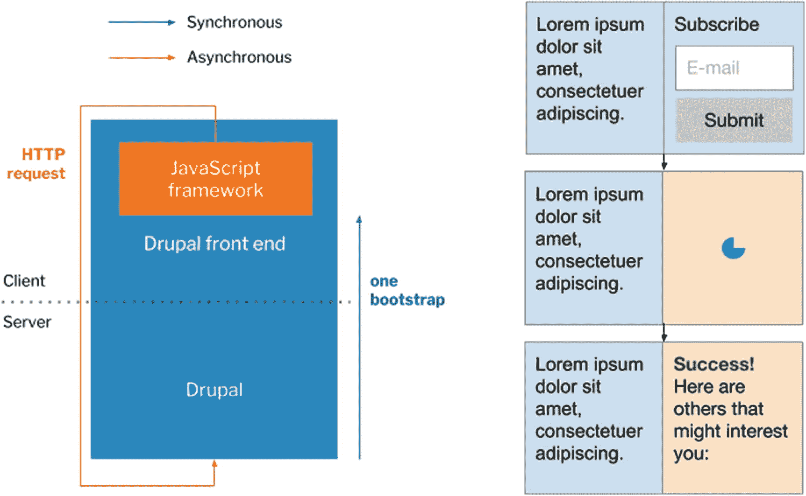

图 4-8

在渐进式解耦 Drupal 中，Drupal 的页面结构保持不变。通过将 JavaScript 框架的范围限制在动态组件上，你可以保留布局，因为页面部分区域完全处于 Drupal 的控制之下

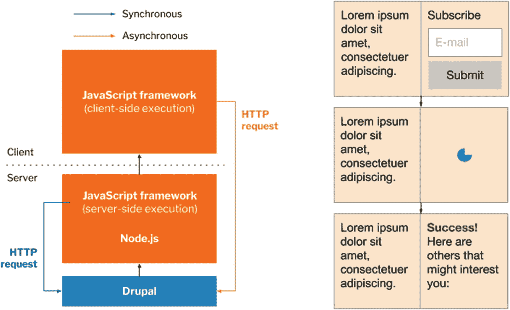

图 4-7

在完全解耦的 Drupal 中，整个渲染页面由 JavaScript 框架负责。但这意味着你无法利用 Drupal 的布局工具来调整列布局或为此布局添加第三列。

采用这种架构方案的两个主要动机源自服务端和客户端问题，尽管渐进式解耦更适合那些需要比 Drupal 默认提供更强大的前端能力的场景。在服务端，某些托管平台并未提供 Node.js 服务来实现 JavaScript 同构，尽管开发者强烈希望使用 JavaScript 框架。例如，许多 Drupal 托管服务商仅提供支持 Drupal 运行的 LAMP 堆栈托管服务。

与此同时，在客户端，渐进式解耦更适合那些需要比 Drupal 默认提供更强大前端能力的场景。首先，Drupal 的许多特性依赖于前端变更能力，例如在数据进入模板前进行预处理，或显示系统通知。许多 Drupal 实施者通常不希望这些特性消失。其次，尽管 Drupal 的前端能力很强（尤其是 Drupal 8 发布后），但一些从业者更偏好使用更符合 JavaScript 驱动的方式，即使无法执行服务端 JavaScript。在这种情况下，可以实现服务端与客户端之间的交接：Drupal 先渲染页面的初始状态，然后 JavaScript 框架在初始化完成后接管。

当然，由于渐进式解耦是一种与前述*渐进增强*趋势相关的方案，它仅适用于 Drupal 前端。也就是说，渐进式解耦 Drupal 并不解决内容分发问题；相反，它旨在丰富现有的 Drupal，引入一些促使许多架构师选择完全解耦 Drupal 的新颖功能。

然而，关键的是，由于渐进式解耦涉及将 JavaScript 嵌入 Drupal 前端（其管理界面已大量使用 JavaScript），因此存在多种可能性，如图 4-9 所示。JavaScript 框架可以只占据页面很小的一部分，也可以逐步让页面更大范围“动态化”。例如，一个最小化的渐进式解耦实现可以将 JavaScript 组件严格限定在页面中独立的区块内。

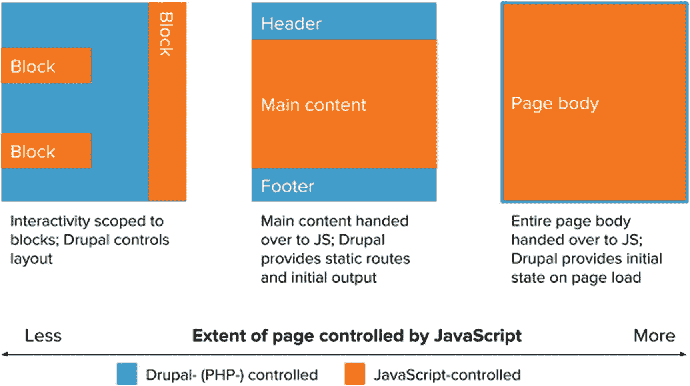

图 4-9

这张逐步解耦方法的谱系图表明，页面动态组件可以只占据 Drupal 中的一个区块，将大部分页面内容保留在 Drupal 手中；也可以覆盖整个页面主体，其形式与完全解耦的 JavaScript 应用几乎难以区分。

与此同时，其他逐步解耦的实现方案尝试将整个内容区域放入 JavaScript 框架中，同时保留页眉和页脚。页面上的页眉和页脚通常包含导航元素，这些元素在不同页面间不会发生变化，也无需大量重新渲染。这样一来，Drupal 可以只提供页面的静态部分，将动态部分交由 JavaScript 处理，同时为路由指定静态回退方案，并提供初始的服务器端输出。

最后，在该谱系的极端一端，一些逐步解耦的实现方案选择用 JavaScript 框架替换整个页面主体，从而只将 `<body>` 元素之外的部分留给 Drupal。Drupal 提供初始状态，但随后由 JavaScript 框架完全控制页面。此类大多数实现采用 Drupal，是因为它拥有丰富且可扩展的 `drupalSettings` JavaScript 对象（在 Drupal 7 中为 `Drupal.settings`），该对象通常在首次页面加载时提供，并可包含关于翻译或配置的关键信息。

## Drupal 作为站点与存储库

在前面的章节中，我交替将解耦的 Drupal 称为站点和存储库。之所以做此区分，是因为站点通常受益于面向公众的用户前端界面，例如默认的 Drupal 前端。而存储库通常是可访问的数据存储，但不具备自身原生的用户前端界面。这就引出了一个关键点：只有当 Drupal 的前端仍然与其他客户端一起被利用时，我们才能将其称为*站点*；否则，它仅仅是一个服务于客户端的*存储库*。换句话说，在这种语境下，站点可以作为存储库，但存储库不能作为站点。图 4-10 展示了这一区别。

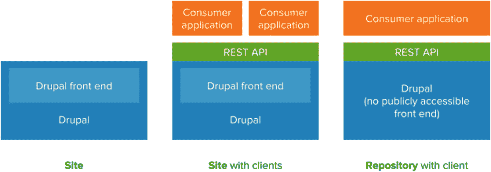

图 4-10

在这三个示例中，Drupal 可以是：一个拥有可公开访问的前端但无解耦客户端的站点（即单体式 Drupal，左图）；一个拥有可访问的前端并带有解耦客户端的 Drupal 站点（即保留 Drupal 部分的完全解耦 Drupal，中图）；以及一个没有可访问的前端，但拥有消费客户端的 Drupal 存储库（即客户端是唯一可用前端的完全解耦 Drupal，右图）。

由于 Drupal 功能强大，且解耦时会带来功能损失，因此必须仔细权衡解耦 Drupal 的风险与回报（见第 5 章和第 6 章）。将 Drupal 降级为仅承担存储库角色，意味着其所有功能都将对公众不可用，尤其是在发生故障导致所有消费应用瘫痪的情况下。而除了保留解耦前端外，还将 Drupal 保留为功能完整的站点，尤其是在只有一个基于 Web 的客户端符合此条件时，可能会导致用户混淆。

尽管区别不大，但以这种二分方式概念化 Drupal，有助于厘清那些真正需要解耦 Drupal 的使用场景。如果你将 Drupal 作为仅服务一个客户端的存储库，那么它可能并不是最适合你需求的方案。例如，也许存在一种在单体式实现中（如通过逐步解耦）满足客户端需求的方法。

如表 4-1 所示，大多数解耦 Drupal 的使用场景都是合适的，只要 Drupal 站点在有一个或多个客户端时保持可访问，或者在需要多个客户端时作为中央存储库。然而，如果 Drupal 作为存储库只服务一个客户端，那就应该提出一个问题：为什么不采用单体式架构？

表 4-1

解耦 Drupal 的使用场景

| 常见有效使用场景 | 需要讨论的使用场景 |
| --- | --- |
| Drupal 作为带有一个或多个客户端的站点 Drupal 作为带有多个客户端的存储库 Drupal 作为独立站点（单体式） | Drupal 作为仅带有一个客户端的存储库 |

## 解耦 Drupal 的用例

由于解耦 Drupal 作为一种架构方法仍在成熟过程中，关于如何决定实现应采用解耦式还是单体式 Drupal 的指导相对较少。架构师必须权衡众多优缺点（例如第 5 章和第 6 章所概述的内容），才能确定前进方向。解耦 Drupal 并非一个轻易做出的决定，因为它对项目的性质及其团队会产生深远影响。

下文总结了本章到目前为止讨论的各种方法，并如图 4-11 所示。

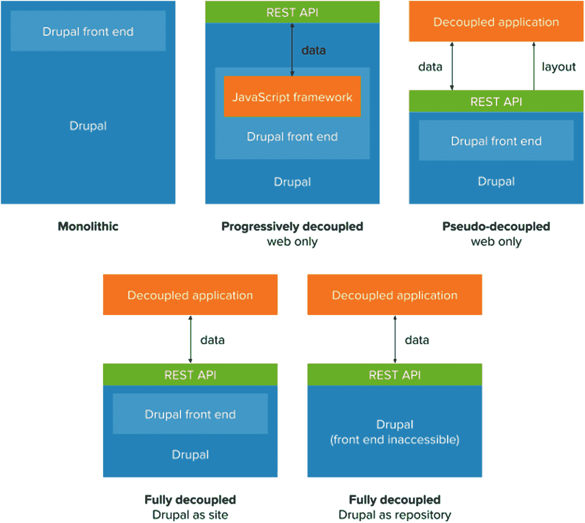

**图 4-11** 所有常见解耦 Drupal 方法的全面比较，包括（从左上顺时针方向）单体式（传统）、渐进式解耦（结合 JavaScript 框架）、伪解耦（展示层导出）、完全解耦 Drupal 作为仓库（前端不可访问的 Drupal）、以及完全解耦 Drupal 作为站点

-   **单体式 Drupal** 由一个单一的、连续的站点组成，不向其他应用程序暴露数据。
-   **渐进式解耦 Drupal** 涉及将 JavaScript 框架嵌入 Drupal 的前端，以利用其前端开发者体验和动态页面能力，而无需完全抛弃 Drupal 的前端。
-   **完全解耦 Drupal** 由一个 Drupal 站点或仓库组成，它将数据暴露给其他应用程序进行消费或操作。这些应用程序可以是任何服务端或客户端应用程序。
-   **伪解耦 Drupal** 涉及完全解耦 Drupal，但不同的是，它将布局配置等展示信息暴露给其他应用程序进行消费或操作。这些应用程序往往是那些大量使用布局的应用程序，例如 JavaScript 应用程序。

一般来说，在围绕项目做决策时，可以遵循以下宽泛指南。

1.  如果你打算让 Drupal 的数据被 Drupal 之外的其他应用程序消费和操作，并且你不需要 Drupal 的前端功能，请使用完全解耦 Drupal。

2.  如果你打算使用 JavaScript 框架以获得前端开发者和用户方面的优势，并且该框架将消费和操作 Drupal 数据，则只有当渐进式解耦 Drupal 不能满足你的需求时，才使用完全解耦 Drupal。

3.  如果你除了 JavaScript 应用程序之外，已经有其他应用程序在消费和操作 Drupal 数据，通常完全解耦 Drupal 是更好的选择。

4.  如果你打算使用 JavaScript 框架以获得前端开发者和用户体验方面的优势，并且该框架不仅消费和操作 Drupal 数据，还消费和操作来自 Drupal 的展示信息（例如构建页面所需的布局配置），请使用伪解耦 Drupal。尽管如此，要注意使用这种方法可能存在的潜在陷阱，如前所述。

5.  如果你正在构建一个传统网站，除了 Drupal 之外不需要额外的应用程序，并且 Drupal 拥有你所需的所有功能，请使用单体式 Drupal。

通过一个简单的二分法来总结这些指南：如果你需要 Drupal 之外的非基于 Web 的应用程序（例如原生应用程序）来消费和操作 Drupal 数据，那么完全解耦 Drupal 是最佳选择。另一方面，如果你需要基于 Web 的 JavaScript 应用程序来消费和操作 Drupal 数据，则可以在渐进式解耦 Drupal 和完全解耦 Drupal 之间进行选择。如果你倾向于保留 Drupal 的所有现有功能，包括 Drupal 前端的各个方面，并且你不需要前端开发者体验和最终用户体验有重大改进，那么单体式 Drupal 可能是正确的选择。

在图 4-12 中，这些指南被应用于一个有助于决策的流程图上下文中，该流程图来源于 Dries Buytaert 的博客文章《如何在 2018 年解耦 Drupal》，它概述了解耦 Drupal 架构可以遵循的几种轨迹。

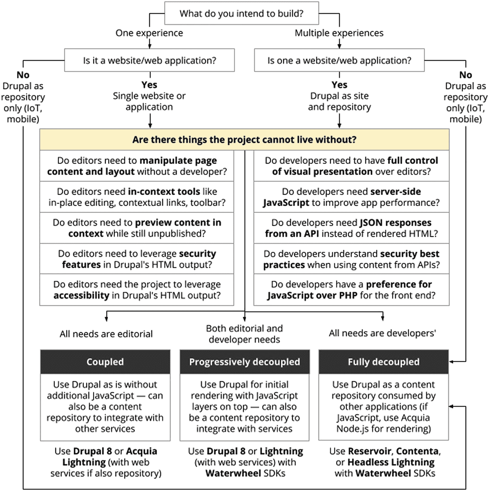

**图 4-12** 供决策者考虑解耦 Drupal 架构的流程图，经 Dries Buytaert 许可转载（ [*https://dri.es/how-to-decouple-drupal-in-2018*](https://dri.es/how-to-decouple-drupal-in-2018) ）。

### 结论

在本章中，我们更正式地定义了解耦 Drupal，并研究了最常见的解耦 Drupal 方法和用例。如前所述，解耦 Drupal 就是将 Drupal 用作一个 Web 服务提供者，允许任意数量的消费者应用程序检索或操作数据。目前，四种架构范式展示了解耦 Drupal 方法的多样性：单体式 Drupal、完全解耦 Drupal、渐进式解耦 Drupal 和伪解耦 Drupal。

在单体式 Drupal 中，Drupal 前端保持完整并可访问，这是当今大多数 Drupal 站点的运作方式。另一方面，在完全解耦 Drupal 中，Drupal 由 PHP 驱动的前端不可访问，消费者应用程序接管了传输数据的所有展示职责。当然，有时你可能希望受益于 JavaScript 框架的特性，而不完全抛弃 Drupal 的前端，在这种情况下，渐进式解耦 Drupal（将 JavaScript 框架嵌入默认的 Drupal 前端）是一个合适的选择。最后，伪解耦 Drupal 描述了一些实现，其中 Drupal 不仅暴露结构化数据，还暴露了关于数据应如何在消费者应用程序中渲染的展示信息。然而，这种方法应谨慎采用，因为它违背了结构与展示之间的关注点分离原则，并可能导致意想不到的后果。

在下一章中，我们将进一步探讨解耦 Drupal 的用例，并确定在解耦架构中实现 Drupal 的一些优势和回报。

