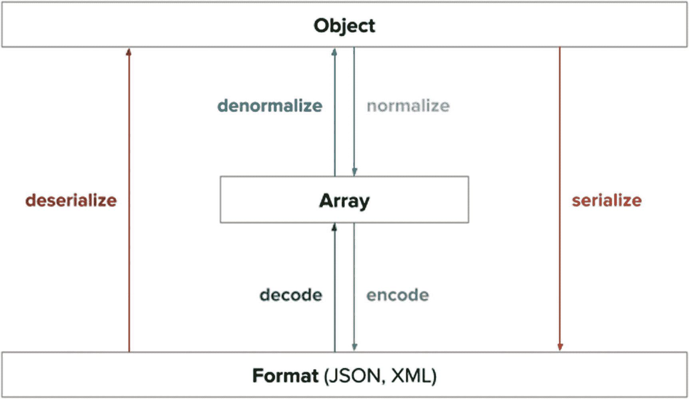
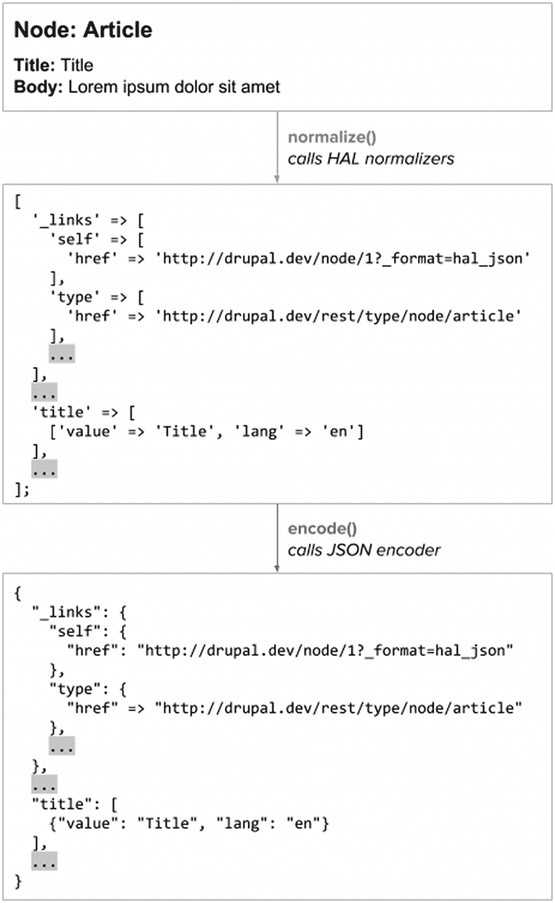
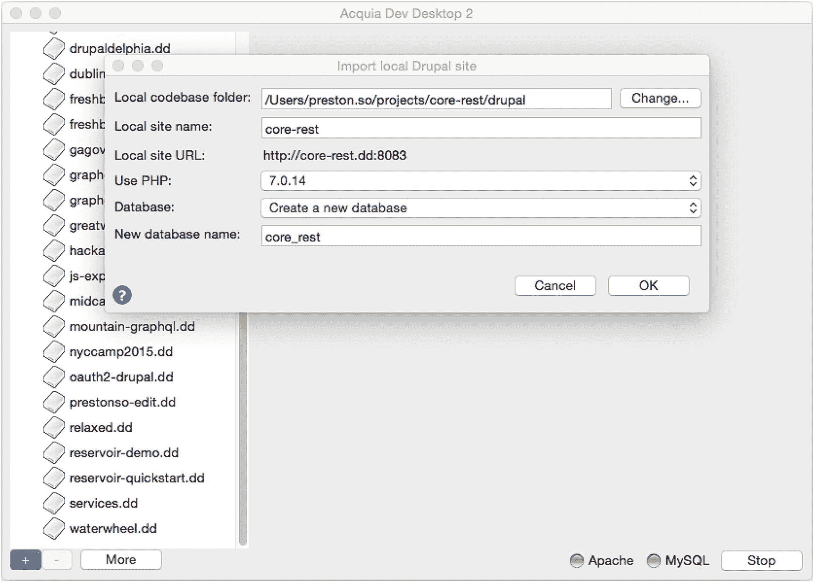
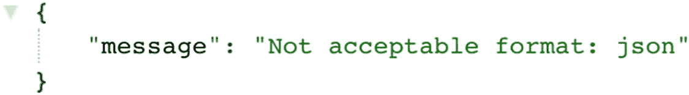
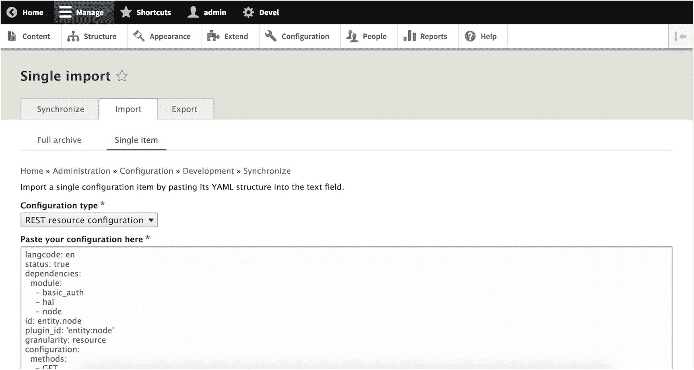
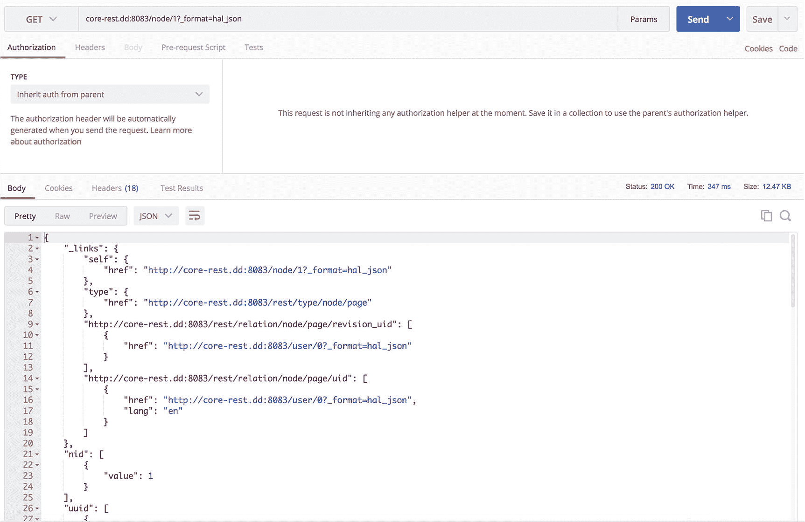

# 7. 解耦 Drupal 8 核心

得益于 `WSCCI` 的工作，如今的 Drupal 8 提供了一个开箱即用、功能强大的 REST 服务器，其中包括通过 HTTP 请求中广泛理解的 `create`、`read`、`update` 和 `delete`（`CRUD`）操作来检索和修改内容实体（例如节点、用户、分类术语和评论）的能力。


## Web 服务与上下文核心计划

> *要让 Drupal 真正拥抱未来网络，我们必须从根本上重新思考 Drupal 如何响应传入的 HTTP 请求。我们需要将 HTML 页面视为其本质：一种极为常见的 REST 响应形式，但只是众多形式之一。为此，Drupal 需要快速演进，从一个一流的 Web CMS 转变为一个一流的 REST 服务器，其中包含一个一流的 Web CMS。*
> 
> —Larry Garfield，WSCCI 负责人^(¹⁰)

正如我们在第 2 章和第 3 章中所见，Drupal 诞生于一个更为传统的时代，那时静态页面驱动着应用状态，且 CMS 本质上是单一整体的。然而，近年来，Web 应用日益动态化，以及前所未有的内容交付新渠道，使得 Drupal 在应对来自各种来源的请求时，面临的挑战日益凸显。

这些请求涵盖了从部分页面请求（例如，边缘端包含）、RESTful API 调用，甚至到源自命令行界面（如`Drush`和`Drupal Console`）的请求。^(¹¹) 然而，在 Drupal 过去更侧重于构建和渲染 HTML 页面而非需要以多种格式呈现的数据时，此类请求并未得到特别良好的支持。直到 Drupal 7，Drupal 的核心安装也仅提供了一个`XML-RPC`（基于 XML 的远程过程调用）层，而非一个真正的 Web 服务层。^(¹²)

*Web 服务与上下文核心计划*（`WSCCI`）于 2011 年在 Drupal 7 发布周期中启动，并成为 Drupal 8 的官方倡议。由于需要绕过 Drupal 中的 HTML 渲染过程，WSCCI 团队的目标是现代化 Drupal 处理请求和服务页面的方式，以预见在 Drupal 8 开发周期后期将出现的无数用例。

为了适应 Drupal 需要为消费者提供的所有响应类型，作为在 Drupal 核心中集成更多`Symfony` PHP 框架组件努力的一部分，WSCCI 倡导将`Symfony HTTPFoundation`组件（一个用 PHP 编写的 HTTP 请求处理库）纳入 Drupal 核心。此外，在 2012 年，由于该计划范围庞大，它缩小了规模，仅专注于 Web 服务相关事宜。^(¹³,) ^(¹⁴)

随着`Serialization`模块的加入，WSCCI 使 Drupal 能够*序列化*，即将结构化数据转换为可存储的格式（例如，文件或跨网络传输），以及*反序列化*，即从为存储而格式化的数据中重构 Drupal 数据结构。模块首次能够将内容实体序列化为 XML、JSON 以及基于`HAL`规范化的 HAL+JSON 格式，该规范化遵循超文本应用语言（HAL）规范。

### 注意

Drupal 社区在 2013 年选择用`HAL`替换`JSON-LD`。更多信息，请访问 [`https://www.drupal.org/project/drupal/issues/1924220`](https://www.drupal.org/project/drupal/issues/1924220)。

### 序列化模块

`Serialization`模块允许将其列为依赖的模块（如 RESTful Web Services 或 REST 模块）使用其中包含的序列化器，将 Drupal 数据转换为其他应用程序可消费的格式。`Serialization`模块以`Symfony Serializer`组件为基础构建，为开发者提供了一个 API，通过安装贡献模块来引入额外的序列化格式。使用`Serialization` API 的著名模块包括前述 Drupal 8 核心中的`HAL`模块（支持 HAL+JSON 格式）和`CSV Serialization`贡献模块（支持 CSV 格式数据）。

当不同的标准和规范不可避免地介入时，`Serialization`模块还处理*规范化*，即特定格式的数据为了满足特定要求而以不同方式结构化或公开，而不改变其格式的过程（*反规范化*是相反的过程）。例如，`HAL`模块提供的 HAL+JSON 格式使用的数据结构和公开的信息片段与 Drupal 中默认的 JSON 编码不同，其中包括指向符合 HAL 规范的其他资源 URI 的链接。

为了同时满足规范化和序列化的需求，`Serialization`模块为其他模块提供了默认的序列化器和默认的规范化器。此外，其他模块也可以使用自己的自研*编码器*，它将规范化器生成的数组转换为序列化格式，或使用自己的规范化器。自定义 JSON 和 XML 编码器并非必需，因为`Symfony Serializer`格式中已经存在默认的 JSON 和 XML 编码器。

如图 7-1 所示，Drupal 中的序列化过程依次包括规范化过程和编码过程。



图 7-1

此图改编自`Symfony Serializer`文档中的图表，展示了序列化器如何基于两个组成过程（规范化和编码）创建 JSON 和 XML 格式的可消费数据。

### 序列化如何工作

尽管大多数开发者会选择直接使用现成的序列化器，但每个序列化（或反序列化）过程实际上都包含规范化（或反规范化）和编码（或解码）。这实现了将对象*规范化*为嵌套数组与将该数组*编码*为所需格式之间的关注点分离。图 7-2 通过一个示例序列化过程深入探讨了这种双重过程。



图 7-2

此图说明了为何编码前需要先进行规范化，以满足像 HAL 这样规定了编码格式中应包含某些元素的特定规范。在此示例序列化中，一个节点实体在编码为 HAL+JSON 格式之前，被规范化为 HAL 兼容的结构。

我们可以通过内省所用方法来进一步详细说明此过程。当调用`Serializer::serialize()`方法时，`Serializer`会遍历所有可用的 Normalizer 服务，以确定应使用哪个 Normalizer，对每个 Normalizer（按从高到低的优先级）调用`Normalizer::supportsNormalization($object, $format)`，直到发现返回`TRUE`的 Normalizer。如果未找到 Normalizer，Drupal 则返回错误。

`Serializer`服务采用完全相同的过程来选择正确的 Encoder，遍历所有 Encoder 并每次调用`EncoderInterface::supportsEncoding($format)`，直到遇到满足作为参数提供的格式要求的特定 Encoder。

### 添加新编码

Drupal 附带核心支持的 JSON、XML 和 HAL+JSON 格式，但有时您可能希望完全添加一种新的编码，假设现有格式不适合您的项目。为此，只要核心默认 Normalizer 提供的数据结构也适合您的编码，您就可以添加一个 Encoder。

首先，创建一个实现`EncoderInterface`的编码器，并定义必需的`encode()`和`decode()`方法。然后，您可以在模块中使用`*.services.yml`文件注册该编码器。此示例取自`HAL`模块的`hal.services.yml`文件：

```
services:
# ...
serializer.encoder.hal:
class: Drupal\hal\Encoder\JsonEncoder
tags:
- { name: encoder, priority: 10, format: hal_json }
# ...
```


### 注释

你可以在 [`https://api.drupal.org/api/drupal/core%21modules%21hal%21hal.services.yml/8.6.x`](https://api.drupal.org/api/drupal/core%2521modules%2521hal%2521hal.services.yml/8.6.x) 找到此 YAML 文件的完整示例。

### 序列化 API

有几个关键 API 可以帮助你构建新的序列化器和规范化器，并处理通过实体解析器引用其他实体的实体。

### 序列化与反序列化

你可以使用 Drupal 8 的 `serializer` 服务（`\Symfony\Component\Serializer\SerializerInterface`）中的 `serialize()` 和 `deserialize()` 方法，将实体序列化为 JSON 或 XML 输出，或将传入的 JSON 或 XML 反序列化为 Drupal 实体：

```
$output = $this->serializer->serialize($entity, 'json');
$entity = $this->serializer->deserialize($output, \Drupal\node\Entity\Node::class, 'json');
```

在第一行代码中，一个实体被序列化为 JSON 输出。在第二行中，一个 JSON 数据结构被反序列化为一个实体，随后该实体可以被 Drupal 代码正常操作。

### 序列化格式的编码与解码

每个序列化器实现都使用编码器（`\Symfony\Component\Serializer\Encoder\EncoderInterface`）和解码器（`\Symfony\Component\Serializer\Decoder\DecoderInterface`），这些组件可用来支持新的序列化格式（例如 CSV 或其他格式）的编码和解码。

作为一个教学示例，CSV 序列化模块中的 `encode()` 实现会识别输入数据的类型，并将该数据编码为 CSV，这些 CSV 可以在 Drupal 自身对实体的理解之外被消费。

### 注释

请参阅 CSV 序列化模块中 `encode()` 的实现，地址为 [`https://cgit.drupalcode.org/csv_serialization/tree/src/Encoder/CsvEncoder.php#n108`](https://cgit.drupalcode.org/csv_serialization/tree/src/Encoder/CsvEncoder.php%2523n108)。

### 规范化与反规范化

为了协调特定编码与特定规范化之间的差异（例如原始 JSON 数据结构与 HAL+JSON 规范化之间的区别），Symfony 序列化组件引入了规范化器（`\Symfony\Component\Serializer\Normalizer\NormalizerInterface`）和反规范化器（`\Symfony\Component\Serializer\Normalizer\DenormalizerInterface`）接口。

在 Drupal 中，默认的规范化尽可能接近对象数据的完全复制，并仅将 JSON 和 XML 编码器应用于默认的规范化（`json` 和 `xml` 格式）。开发人员编写的其他规范化格式可能希望对传入的对象数据施加特定约束，例如省略本地 ID 而改用通用唯一标识符（UUID），或添加满足 JSON-LD 或 HAL 等规范的新元数据。

HAL 模块中的 `normalize()` 实现（稍后会详细讨论）演示了如何通过规范化器而非编码器来符合规范要求，因为编码器的职责不包括包含 HAL 规范所要求的那种元数据。在此示例中，规范化结果之前会添加一个 `_links` 键，这是每个 HAL 响应的开始部分。

### 注释

请参阅 HAL 模块中 `normalize()` 的实现，地址为 [`https://github.com/drupal/drupal/blob/8.5.x/core/modules/hal/src/Normalizer/ContentEntityNormalizer.php#L57`](https://github.com/drupal/drupal/blob/8.5.x/core/modules/hal/src/Normalizer/ContentEntityNormalizer.php%2523L57)。

### 使用实体解析器

尽管内容实体是最常被序列化的数据结构，但你可能还会发现某个特定实体引用了其他实体。在这种情况下（这在复杂的 Drupal 内容模型中很常见），你可以通过调用 `resolve()` 方法，利用它们的 UUID（`\Drupal\serialization\EntityResolver\UuidResolver`）或本地 Drupal 标识符（`\Drupal\serialization\EntityResolver\TargetIdResolver`）来解析这些被引用的实体。

### RESTful Web Services 模块

基于 Drupal 7 中 RESTful Web Services 模块的成果，Drupal 核心的 REST 模块也依赖于序列化模块。在标准用法中，REST 模块提供了一个可定制且可扩展的 REST API，用于暴露 Drupal 中存储的数据。在本节中，我将讨论 REST 模块及其 API；关于通过 CRUD 操作检索和操纵数据，请参见第 10 章；关于 REST 模块的更高级功能（如资源插件），请参见第 22 章。

默认情况下，REST 模块允许开发人员使用 HTTP 方法（如 `GET`、`POST` 和 `DELETE`）处理内容实体（包括节点、用户和评论）上的 Drupal 数据。此外，从 Drupal 8.2.0 开始，还支持对配置实体（例如词汇表、用户角色和站点配置）以及 Watchdog 数据库日志条目发出 `GET` 请求。^(¹⁵)

### 注释

Drupal 7 的 RESTful Web Services 模块可在 Drupal.org 项目页面 [`https://www.drupal.org/project/restws`](https://www.drupal.org/project/restws) 获取。

## RESTful Web Services API

REST 模块为希望扩展 Drupal 默认核心 REST API 功能集的开发人员提供了几个 API。不要将其与为消费者应用程序暴露的 REST API 混淆，RESTful Web Services 模块的 API 是指可供 Drupal 开发人员扩展核心功能的内部接口。

本节深入探讨 Drupal 开发人员可用的两个关键 API 之一，也是迄今为止最重要的一个：REST 资源配置。另一个可用的 API 负责处理资源插件，为默认开箱即用的资源添加额外的资源，这将在第 25 章中介绍。

### 配置 REST 资源

首先，每个 REST 资源，无论它表示的是内容实体还是配置实体，都有自己的配置实体（`\Drupal\rest\RestResourceConfigInterface`），该配置实体对应一个 `@RestResource` 插件。如果没有 REST 资源配实体，则 REST 资源插件将不可用。

因为所有 REST 资源都有对应的配置实体，所以我们可以像配置其他配置实体一样配置它们。例如，你可以指定特定 HTTP 方法、序列化格式和身份验证方法，这些是给定 REST 资源旨在支持的内容。通过此过程，选定的序列化格式和身份验证方法将在配置中暴露给选定的 HTTP 方法。

REST 资源可以通过使用提供图形界面的 REST UI 模块来配置，也可以通过手动修改和导入配置 YAML 文件来配置。许多开发人员（包括我自己）会使用现有的 REST 资源配置，例如 `core/modules/rest/config/optional/rest.resource.entity.node.yml`，作为方便参考的模板，可以直接复制粘贴。^(¹⁶)

## 使用 RESTful Web Services 模块

通常，当你在构建一个包含多个需要从 Drupal 获取数据的消费者的体系结构时，你会通过允许特定用户角色（具有特定权限）访问资源，并根据需要指定 REST 资源的序列化格式和身份验证方法来暴露这些数据。


好的，作为高级文档工程师和翻译员，我将严格遵循您的注意事项和示例，将给定的英文文本翻译成中文。


### 通过实体访问暴露资源

Drupal 8 的一个关键优势在于，它包含一个精细且强大的用户角色和权限系统，该系统与用于访问暴露的 REST 资源的权限能有效协同工作。在 Drupal 8 中，对于暴露内容实体的 REST 资源，`Entity Access API` 决定了用户角色是否拥有检索或操作内容实体的正确权限。

例如，要对一个节点发出 `GET` 请求（即读取或查看它），用户（在此场景下可能只是一个消费者应用程序，在 Drupal 中表现为匿名用户）需要由 Drupal 管理员授予*访问内容*权限。类似地，必须为用户启用 *创建文章* 内容权限，用户才能对文章类型的节点发出 `POST` 请求。

REST 资源复用 `Entity Access` 系统是一个关键特性，适用于处理敏感私有数据的消费者，因此应配合适当的身份验证方法使用，例如 Simple OAuth 模块提供的方法，该方法将用户角色及其指定权限与可单独识别的消费者应用程序关联起来。我将在第 9 章中更详细地讨论身份验证方法。

### 注意

适用于 Drupal 8 的 Simple OAuth 模块可在 Drupal.org 项目页面 [`https://www.drupal.org/project/simple_oauth`](https://www.drupal.org/project/simple_oauth) 获取。

### 自定义 REST 资源的格式和身份验证方法

开箱即用时，REST 模块支持 Web 上最常用的两种格式：`json` 和 `xml`。通过启用核心的 HAL 模块（参见下一节），开发者还可以使用 `hal_json` 格式。在其他贡献模块的帮助下，还可以添加其他格式，例如 `csv`。REST 模块还允许开发者根据相关资源提供不同的身份验证方法，因此开发者可以区分对待：某些资源需要基本身份验证，而对更为敏感的资源则使用 OAuth2 身份验证。关于解耦 Drupal 中身份验证的更全面讨论，请参见第 8 章。

以下是一个示例，说明如何使用 YAML 在每个资源的基础上配置可用的格式和身份验证机制：

```
granularity: resource
configuration:
methods:
- ...
formats:
- hal_json
- xml
- json
authentication:
- cookie
```

### 注意

上面的示例使用了基于 cookie 的身份验证，这对于渐进式解耦场景是相关的，因为消费者应用程序和 Drupal 前端都在同一个浏览器会话中处于活动状态。在基于 cookie 的身份验证中，经过身份验证的用户会话期间设置的 cookie，可以被 JavaScript 应用程序用来对 Drupal 的 REST API 执行身份验证。

所有这些配置也可以使用 REST UI 模块完成。

## 超文本应用语言

当消费者应用程序摄取标准化为符合 HAL 规范的 JSON（HAL+JSON）数据时，数据结构的出现遵循了 HAL 规范，而该规范是 HAL 模块的基础。启用后，Drupal 8 的 HAL 模块会根据 HAL 规范对实体进行标准化处理。

与 JSON-LD 非常相似，HAL 规范解决了许多 Web 服务 API 都在努力解决的一个特定需求：能够跨多个资源建立超链接，以在单个 API 响应中包含指向其他相关资源的链接或引用，从而为消费者应用程序提供更大的实用性。事实上，HAL 本身是一种通用媒体类型，其目的是在 Web 服务 API 中包含“一系列链接”。有了这些链接，API 消费者就可以遍历它们，以在各种应用状态之间推进。

对于提供 API 响应而言，采用像 HAL 这样的规范最明显的好处之一是周边工具的可用性。例如，HAL 浏览器为开发者提供了一种“试驾”其应用程序的方法，并可以通过一个便捷的用户界面检查其 JSON 的格式。

### 注意

HAL 规范位于 [`https://tools.ietf.org/html/draft-kelly-json-hal-08`](https://tools.ietf.org/html/draft-kelly-json-hal-08)。

## 将 Drupal 8 设置为 Web 服务提供者

在建立了上述一些关键基础之后，我们现在可以将注意力转向将 Drupal 8 设置为 Web 服务提供者。在本节中，我们将获取、安装并生成 Drupal 内容，然后进入核心 REST 配置，包括手动配置和使用 REST UI 模块配置。但首先，我们需要一份本地的最新版 Drupal。

### 安装 Composer

如果您从未安装过 Drupal 或以前没有使用过 Drupal 8，那么 Drupal 中新的依赖管理系统可能会让您感到陌生。如果您过去已经使用过基于 Composer 的工作流，则可以安全地跳过本节。

`Composer` 是 PHP 中的依赖管理器，类似于 JavaScript 中的 `NPM` 和 `Yarn` 包管理器以及 Ruby 中的 `Bundler`。基于位于 PHP 代码库中的 `composer.json` 文件，`Composer` 会获取并安装其中列出的依赖项。

除非您有特定需求，要求在每项目基础上使用特定版本的 `Composer`，否则最佳实践是全局安装 `Composer`。如果您使用的是 Linux、Unix 或 OSX，请导航到 [`https://getcomposer.org/installer`](https://getcomposer.org/installer) 下载一个方便的安装程序。安装完成后，使用以下命令将 `Composer` 移动到您的 `PATH` 环境变量中的某个目录。这将允许您在全局范围内使用 `composer` 命令。

```
$ mv composer.phar /usr/local/bin/composer
```

如果您使用的是 Windows，请导航到 [`https://getcomposer.org/Composer-Setup.exe`](https://getcomposer.org/Composer-Setup.exe) 下载一个可执行文件，该文件将安装 `Composer`，使其在任何目录下都可用。^(¹⁷)

### 注意

有关安装 `Composer` 的更多信息，包括手动安装和本地安装，请查阅 [`https://getcomposer.org/doc/00-intro.md`](https://getcomposer.org/doc/00-intro.md) 上的 `Composer` 文档。

### 使用 Composer 下载 Drupal 和 Drupal 依赖项

在您希望存放 Drupal 的目录中，运行以下命令。此命令还会执行 `composer install`，它将下载 Drupal 8 和所有依赖项。

```
$ composer create-project drupal-composer/drupal-project:8.x-dev core-rest --stability dev --no-interaction
$ cd core-rest
```


### 注意

关于 Drupal 8 项目的 `drupal-composer/drupal-project` Composer 模板的更多信息，请查阅 [`https://github.com/drupal-composer/drupal-project/blob/8.x/README.md`](https://github.com/drupal-composer/drupal-project/blob/8.x/README.md) 中的 README 文件。

对于熟悉 Drupal 以往开发工作流程的开发者来说，Composer 的一个独特之处在于能够通过命令行使用如下命令添加新的依赖项，其中 `{module_name}` 是你希望添加的模块名称。Composer 会自动将该依赖项添加到你的 `composer.json` 文件中。

```
$ composer require drupal/{module_name}
```

如果你打开 `composer.json` 文件，你会看到类似如下内容被添加进去。

```
{
"require": {
"drupal/{module_name}": "1.x-dev"
}
}
```

如果在运行 `composer require` 时看到错误，你可能需要将 [Drupal.​org](http://drupal.org) 添加为 Composer 仓库，以便 Composer 识别需要从 [`https://packages.drupal.org/8`](https://packages.drupal.org/8) 获取 Drupal 包。我们可以使用 `composer config` 来设置，如下命令所示。请注意，如果你使用的是前面详述的安装方法，或者你使用的是 Drupal 8.3.0 或更高版本，则无需执行此步骤。

```
$ composer config repositories.drupal composer https://packages.drupal.org/8
```

当你再次打开 `composer.json` 时，你会看到以下内容出现。

```
{
"repositories": {
"drupal": {
"type": "composer",
"url": "https://packages.drupal.org/8"
}
}
}
```

### 注意

如果你在运行 Composer 时遇到内存限制错误，有几种解决方案可用。最常见的是在 `php.ini` 文件中将 `memory_limit` 配置为大于默认值。另一种选择是临时将 PHP 的内存限制配置为无限制，如下面版本的 `composer create-project` 命令所示。有关更多信息，请查阅关于 PHP 内存限制的 Composer 文档，地址为 [`https://getcomposer.org/doc/articles/troubleshooting.md#memory-limit-errors`](https://getcomposer.org/doc/articles/troubleshooting.md%2523memory-limit-errors)。

```
$ php -d memory_limit=-1 composer.phar create-project drupal-composer/drupal-project:8.x-dev core-rest --stability dev --no-interaction
```

### 配置 Drupal 站点

下载 Drupal 及其依赖项后，你可以使用刚刚获取的现有代码库，在你指定的本地开发环境中配置一个新站点。在这些示例中，我使用的是 Acquia Dev Desktop，但你可以使用任何你喜欢的本地开发环境，例如 Lando、Docker for Drupal 或 MAMP。在 Acquia Dev Desktop 中，点击左下角的 + 按钮会打开一个选项菜单，其中包括我们需要的选项：*导入本地 Drupal 站点*。一旦你输入了所有信息，如图 7-3 所示，我们就可以继续安装 Drupal。

### 注意

Acquia Dev Desktop 可以在 [`https://dev.acquia.com/downloads`](https://dev.acquia.com/downloads) 下载。



**图 7-3**

在此截图中，我们选择导入一个已经存在于 *core-rest* 目录中的本地 Drupal 站点。该 Drupal 站点将使用 PHP 版本 7.0.14，并且会创建一个新的数据库。

现在，你可以通过正常方式安装 Drupal，无论是通过 Drush、Drupal Console，还是通过 `/core/install.php` 的 Web 界面手动安装。如果你在 `/core/install.php` 遇到“白屏死机”（一个空白错误屏幕，页面顶部可能包含无格式的错误信息），并且出现与 `autoload.php` 相关的错误，你可能需要重新运行 `composer install`。

### 注意

关于 Drush 和 Drupal Console 的更多信息，可以在它们的网站 [`http://www.drush.org`](http://www.drush.org) 和 [`https://drupalconsole.com`](https://drupalconsole.com) 上找到。

### 生成内容并启用核心 REST 模块

接下来，我们需要创建一些内容，以便通过 API 进行测试。这个过程可以手动完成，也可以使用 Devel 模块的 Devel Generate 子模块完成。以下命令会创建 20 个节点和 20 个用户（两者都是内容实体的示例）。

```
$ composer require drupal/devel
$ drush en –y devel devel_generate
$ drush genc 20 && drush genu 20
```

### 注意

Devel 在 [Drupal.​org](http://drupal.org) 上的项目页面位于 [`https://www.drupal.org/project/devel`](https://www.drupal.org/project/devel)。

一旦你安装了站点并添加了少量内容，你就拥有了一个功能完备的 Drupal 站点。然而，我们还没有启用负责公开核心 REST API 的模块。因为这些模块已经是核心的一部分但尚未启用，我们只需要导航到*扩展*页面 (`/admin/modules`) 或通过 Drush 启用它们。例如，以下 Drush 命令将启用 Drupal 核心的 Serialization、HAL、Basic Authentication 和 REST 模块。

```
$ drush en -y serialization hal rest basic_auth
```

此时，我们可以导航到 `core-rest.dd:8083/node/1?_format=json` 来测试我们闪亮的新 REST API。不幸的是，当我们导航到该路径时（在 Chrome 中如图 7-4 所示），我们看到一个错误提示：“`Not acceptable format: json`”。这意味着我们还有更多工作要做，即配置我们需要在 API 中公开的 REST 资源。



**图 7-4**

这里缺少了一个步骤，因为我们的 REST 资源尚未配置。

## 配置核心 REST

为了在 Drupal 公开的 REST API 中公开我们的 REST 资源，我们需要使用 Drupal 的配置管理系统来配置这些 REST 资源。例如，如果我们的需求是将文章内容类型的节点公开给 API，我们需要确保为该内容类型对应的 REST 资源分配了 HTTP 方法、格式和认证方法。

如前所述，一个可以作为他人参考的配置 YAML 文件示例位于 `/core/modules/rest/config/optional/rest.resource.entity.node.yml`。通过使用 Drupal 的配置导入系统，我们可以将以下 YAML 复制到 Drupal 中，以提供一个新配置的 REST 资源。

```
langcode: en
status: true
dependencies:
module:
- basic_auth
- hal
- node
id: entity.node
plugin_id: 'entity:node'
granularity: resource
configuration:
methods:
- GET
- POST
- PATCH
- DELETE
formats:
- hal_json
authentication:
- basic_auth
```

为了让 Drupal 知道这个配置，我们可以导航到“管理” ➤ “配置” ➤ “开发” ➤ “配置同步” (`/admin/config/development/configuration`)，在那里我们可以选择导入单个项目，如图 7-5 所示。



**图 7-5**

“单项导入”页面用于导入单个配置项。每次我们为每个内容类型指定另一个 REST 资源时，都需要导入一个配置项。

一旦我们为文章类型导入了配置，就可以测试针对现已正确配置的 REST API 发出的请求。虽然我们可以使用 cURL 命令行界面或在浏览器中进行测试，但我推荐使用 Postman REST 客户端，这是一种可以针对 HTTP API 发出和保存任意请求的工具。Postman 功能非常强大，拥有许多有用的特性，因此我们将在本章中一直使用它来测试请求。


### 注意

Postman 可以从 [`https://www.getpostman.com`](https://www.getpostman.com) 下载。

在 Postman 中，我们可以创建并发出如图 7-6 所示的请求，该请求针对的是 `core-rest.dd:8083/node/1?_format=hal_json` 的 `GET` 请求。我们只需要插入正确的 URL，选择 HTTP 方法，然后点击 *发送*。返回的响应是一个符合 HAL 规范的 JSON 负载，其中包含节点 ID 为 1 的节点（内容项）中的所有信息。



**图 7-6**

Postman 是一个强大的 HTTP 客户端，可以替代开发者工具箱中的 `cURL`。在此示例中，我们向节点 ID（标识符）为 1 的节点（Drupal 中的内容项）发出了 `GET` 请求。

恭喜！您已成功向 Drupal 8 的核心 REST API 发出了第一个 `GET` 请求。换句话说，您刚刚迈出了实现解耦 Drupal 的第一步。

## 配置 CORS

尽管在配置 REST 资源后我们已经拥有了一个功能完备的 REST API，但我们不应将当前状态的 API 部署到生产环境。如果我们尝试从不同域名的应用程序访问此域，那么所有请求都将因*同源策略*而失败，该策略出于安全考虑，禁止来自其他域的请求检索主域上的内容。同源策略可防止存储在一个域上的数据成为另一个域发起的漏洞利用或分布式拒绝服务 (DDoS) 攻击的受害者。

为降低此风险，*跨域资源共享* (CORS) 允许用户代理（对我们来说，指 API 消费者或消费者应用程序）从与请求发起者不同的域，通过特定的 HTTP 标头访问指定的资源。例如，从 `my-consumer-app.net` 向 `my-decoupled-backend.com` 发出的请求默认会被阻止，除非请求中包含适当的标头。

### 注意

有关这两个原则的更多信息，Mozilla 开发者网络维护了关于同源策略 ( [`https://developer.mozilla.org/en-US/docs/Web/Security/Same-origin_policy`](https://developer.mozilla.org/en-US/docs/Web/Security/Same-origin_policy) ) 和 CORS ( [`https://developer.mozilla.org/en-US/docs/Web/HTTP/CORS`](https://developer.mozilla.org/en-US/docs/Web/HTTP/CORS) ) 的详细文档。

出于安全目的，Drupal 默认会阻止所有来自不同域的请求。然而，使用驱动整个 Drupal 安装行为的 Drupal 站点设置，我们可以允许选定的域（或网络上的所有域）访问 Drupal 中的特定方法或路由。这使得我们能够将 API 暴露给不同来源的消费者，并且我们可以以任意方式使特定方法或路由可用。

请考虑以下摘自 `sites/default/default.services.yml` 的内容，该文件包含 Drupal 的默认站点设置；本部分专门处理 CORS 设置。

```
## 配置跨站点 HTTP 请求 (CORS)。
## 阅读 https://developer.mozilla.org/en-US/docs/Web/HTTP/Access_control_CORS
## 以获取有关该主题的更多信息。
## 注意：默认情况下该配置是禁用的。
cors.config:
enabled: false
## 指定允许的标头，例如 'x-allowed-header'。
allowedHeaders: []
## 指定允许的请求方法，指定 ['*'] 以允许所有可能的方法。
allowedMethods: []
## 配置来自特定来源的允许请求。
allowedOrigins: ['*']
## 设置 Access-Control-Expose-Headers 标头。
exposedHeaders: false
## 设置 Access-Control-Max-Age 标头。
maxAge: false
## 设置 Access-Control-Allow-Credentials 标头。
supportsCredentials: false
```

CORS 默认是禁用的。要覆盖默认设置并启用它，我们需要将 `default.services.yml` 复制到同一目录中，并重命名为 `services.yml`。这样做可以指示 Drupal 使用我们提供自定义 CORS 配置的定制文件来覆盖默认设置。在此过程中，我们可以指定希望授予新 API 访问权限的特定 HTTP 标头、HTTP 方法或来源。例如，以下 YAML 描述了一个公共 API，任何来源的任何消费者都可以向该 API 发出直接对 Drupal 内容产生影响（有直接后果）的请求。

```
cors.config:
enabled: true
allowedHeaders: ['*']
allowedMethods: ['GET', 'POST', 'PATCH', 'DELETE']
allowedOrigins: ['*']
exposedHeaders: false
maxAge: false
supportsCredentials: false
```

这种 CORS 配置过于宽松，不应在生产环境中使用。在以下示例中，API 更加私密，仅允许带有特定标头的传入请求。此外，它将所有可能的 HTTP 方法限制为仅 `GET`，并且只允许来自单个消费者应用程序来源的请求继续。

```
cors.config:
enabled: true
allowedHeaders: ['x-csrf-token', 'authorization', 'content-type', 'accept', 'origin', 'x-requested-with']
allowedMethods: ['GET']
allowedOrigins: ['https://my-decoupled-app.net']
exposedHeaders: false
maxAge: false
supportsCredentials: false
```

尽管借助 YAML，Drupal 显著简化了该过程，但您的基础设施可能要求您执行额外的步骤，尤其是在使用 Apache 或 Nginx 时。如果在保存 `services.yml` 并重建缓存注册表 (`drush cr`) 后仍遇到 CORS 问题，您可能在 Web 服务器的配置及其发出的 CORS 标头响应中遇到了上游问题。

### 注意

在 Drupal 8.2.0 之前，存在一个 CORS 贡献模块 ( [`https://www.drupal.org/project/cors`](https://www.drupal.org/project/cors) )，用于惠及 Drupal 8 实施。然而，自 Drupal 8.2.0 起，选择性加入的 CORS 支持功能的引入已导致 CORS 模块被弃用，转而支持核心的原生 CORS 支持。更多信息，请参阅 [`https://www.drupal.org/node/2715637`](https://www.drupal.org/node/2715637) 上的变更记录。

### 结论

在本章中，我们探讨了核心中 Web 服务的可用性，以及在核心 REST 中配置 API 所依据的基础知识。正如您所见，其历史相当复杂，并表明了在 Drupal 8 开发周期早期对 Web 服务可用性的重视，尽管最初推动核心支持的努力动机是跨站内容同步，而非解耦 Drupal 的用例。

得益于 WSCCI 奠定的基础，Web 服务现已成为 Drupal 8 核心不可分割的一部分，尽管默认并未启用。此外，多亏了 Serialization 模块，我们现在可以访问处理各种编码和规范化的广泛功能，并且有可能通过 Serialization API 扩展这些功能。

借助 Drupal 8 核心中的 RESTful Web Services 和 HAL，我们可以轻松地为消费者应用程序暴露 REST API，而无需向现有核心添加任何模块。在本章中，我们还介绍了如何设置和安装 Drupal 8 以提供 Web 服务、配置 REST 资源以及配置 CORS 支持。在下一章中，我们将转向提供 Web 服务的贡献模块，以及它们如何与核心 REST 功能相配合。

脚注 1 2 3 4 5 6 7 8


好的，作为一名高级文档工程师和翻译员，我将遵循您提供的注意事项和示例，将给定的英文文本翻译成中文。


