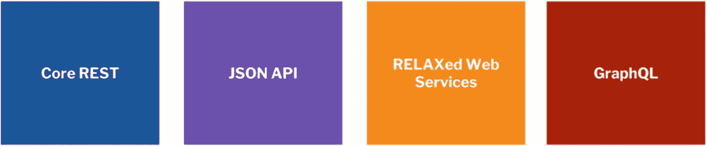
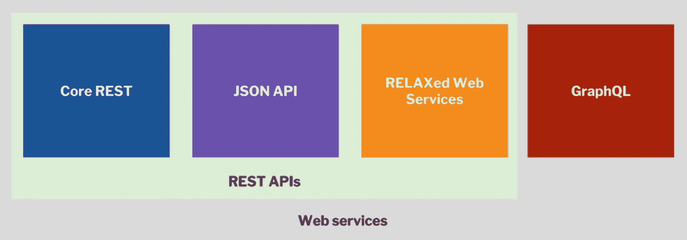
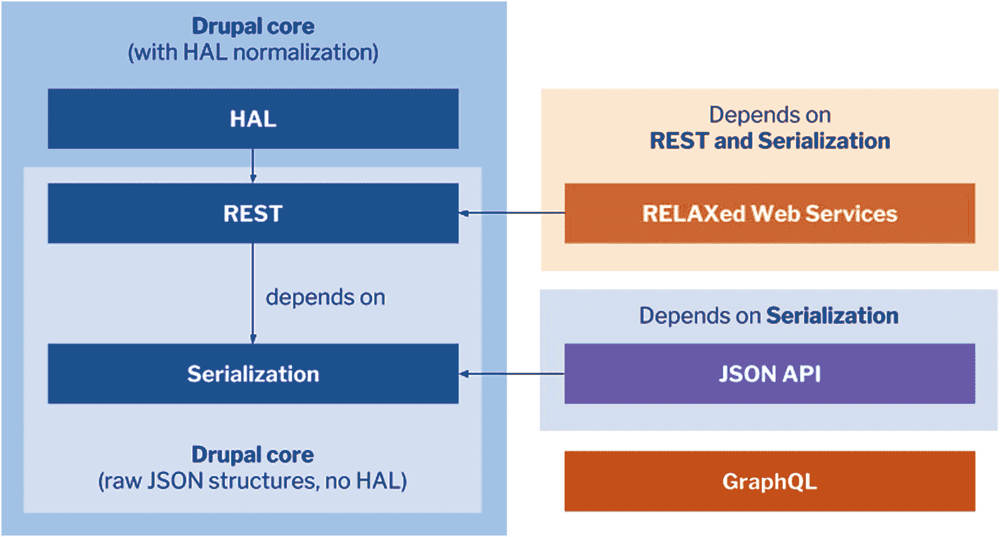
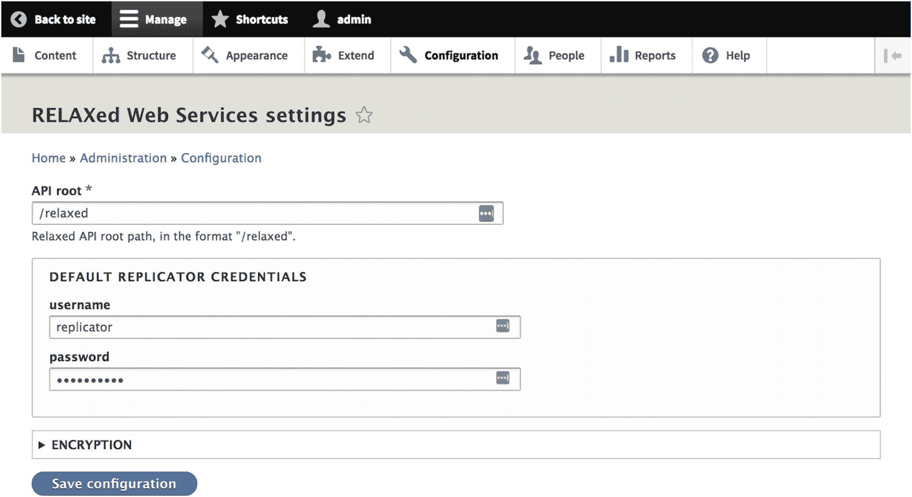
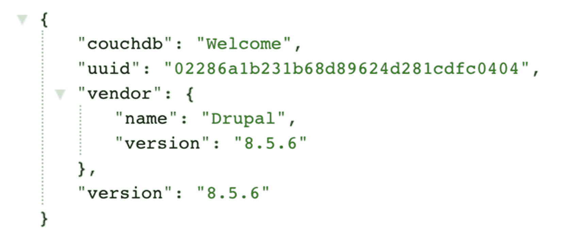
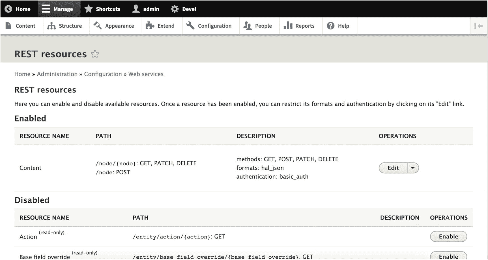
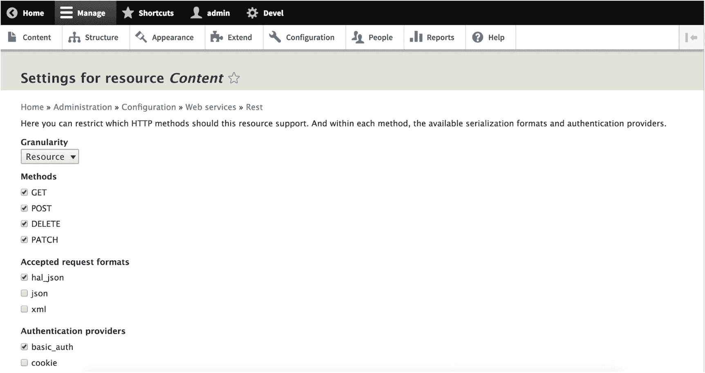

# 8. 使用贡献模块解耦 Drupal 8

在第 7 章中，我们探讨了 Drupal 核心中现有的 Web 服务生态系统，这得益于在 Drupal 8 开发周期中引入的序列化、HAL 和 RESTful Web 服务模块。然而，许多最初支持采用 HAL 的理由已不再像过去那样重要，并且自那时起，涌现了许多更适合解耦式 Drupal 架构的新 API 规范。

在本章中，我们将从 Drupal 8 默认提供的功能中放大视野，审视更广泛的 Drupal Web 服务生态系统，并特别关注四个模块。其中三个模块——JSON API、RELAXed Web Services 和 GraphQL——已被早期采用者用于生产环境。第四个模块 `REST UI` 是一个为配置核心 REST 提供图形用户界面的工具，对于许多用户来说，它比手动编写 YAML 来配置 REST 资源更简单。

## Drupal Web 服务生态系统

从解耦角度来看，Drupal 最显著的特点之一是它拥有广泛且多样化的 Web 服务，这些服务支持 Drupal 与消费者应用程序之间进行可互操作的机器对机器交互。在 Drupal 生态系统中，Web 服务通常以贡献模块的形式提供。在生产构建中最常见的包括核心 REST、JSON API、RELAXed Web Services 和 GraphQL（见图 8-1）。



**图 8-1** Drupal 8 中最常用的四种 Web 服务

尽管这些 Web 服务大部分是 RESTful API，它们遵循 REST 原则并使用 HTTP 方法进行操作，但有些 Web 服务模块，尤其是 GraphQL 模块，并不提供遵循 REST 原则的 HTTP API，因此不能被视为 RESTful。出于这个原因，通常更倾向于使用术语*Web 服务*来描述 Drupal 可用的所有 API，而不是使用更狭窄的术语 *RESTful API*。

请看图 8-2，它包含一个欧拉图，描述了 Drupal 8 中最常用的 Web 服务模块，包括核心 REST 以及贡献的解决方案 JSON API、RELAXed Web Services 和 GraphQL。JSON API 和 RELAXed Web Services 都实现了特定的 RESTful API 规范，而 GraphQL 除了是一种 Web 服务外，还是一种查询语言，因此被归为不同的类别。



**图 8-2** 此欧拉图显示了 Drupal 8 的哪些 Web 服务是 RESTful 的；GraphQL 是非 RESTful 的，但它仍然是一种 Web 服务

Drupal 的 Web 服务生态系统由依赖关系各异的模块组成。一些模块，如 RELAXed Web Services，除了依赖 Drupal 8 核心中可用的序列化模块（以及与其他内容暂存相关的模块）外，还依赖于 RESTful Web Services 模块。其他模块，如 JSON API，依赖序列化模块来提供 JSON 编码器等功能，但不依赖 REST 模块。最后一个特例是 GraphQL，它不依赖前述的任何模块。

图 8-3 展示了 Drupal Web 服务生态系统中依赖关系的差异。请注意，此图示仅考虑了 Drupal 8 可用的模块。



**图 8-3** 核心 Web 服务能力构成了贡献的 Web 服务模块的基础。RELAXed Web Services 依赖于 RESTful Web Services 模块，而 JSON API 则实现了自己的方法，仅依赖序列化模块。

### JSON API

在本节中，我们将描述并审视所有四个 Web 服务模块中最稳定、使用最广泛的 JSON API。JSON API 规范是 Web 服务领域中最知名的规范之一，Ember 和 Ruby on Rails 等社区都为其自身的 REST API 采用了该规范。JSON API 之所以受到许多开发者的青睐，是因为它专注于通过查询字符串参数中提供的丰富操作来促进高度关联的查询。

在撰写本文时，Drupal 8 对 JSON API 的实现计划作为稳定模块包含在即将发布的 Drupal 核心次要版本中。JSON API 模块由 Mateu Aguiló Bosch (`e0ipso`)、Wim Leers 和 Gabriel Sullice (`gabesullice`) 维护。

## JSON API 规范

JSON API 自称为“反自行车棚”工具，它是一种 REST API 规范，以 JSON 格式发出响应，并因其被 Ember 和 Ruby on Rails 社区采用而近来获得了发展势头。JSON API 还受益于对资源之间关系的强大处理，以及诸如内置排序和分页等受欢迎的查询操作。JSON API 的 Drupal 实现位于 JSON API 模块中，该模块即将被包含在 Drupal 8 核心中。

JSON API 对自身的描述如下：

> *[一种]规范，规定了客户端应如何请求获取或修改资源，以及服务器应如何响应这些请求。*

>

> *JSON API 旨在最小化客户端和服务器之间的请求数量和传输数据量。这种效率是在不影响可读性、灵活性或可发现性的前提下实现的。*

得益于 Drupal 通过引用处理实体关系的方法，Drupal 的数据结构（例如，实体类型、包和字段）非常适合与 JSON API 规范和模块一起使用和操作。^(¹⁸)

### 注意

JSON API 规范位于 [`http://jsonapi.org`](http://jsonapi.org)，JSON API 模块的项目页面可在 Drupal.org 上找到，地址为 [`https://www.drupal.org/project/jsonapi`](https://www.drupal.org/project/jsonapi)。

### JSON API 文档结构

与 HAL 规范或网络上许多常见的 JSON API 不同，JSON API 规范对数据应如何在 JSON API 响应中提供有很强的意见。本节并未详尽地讨论 JSON API 规范，也不应被视为与正式规范本身一样权威的资源。

每个请求和响应体，无论使用何种方法，都由一个 JSON 对象组成。任何特定于资源的数据都位于此对象下的 `data` 键下，该键可以表示一个对象值或数组值。但是，JSON API 对数据值的类型有严格的规定：创建或更新实体资源时，该值将是一个包含单个值的对象；只有在检索多个资源的集合时（见第 12 章），该值才会变成数组。比较以下两个示例：

```json
{
  "data": {
    // 单个资源
  }
}
{
  "data": [
    {
      // 多个资源之一
    }
  ]
}
```

除了 `data` 之外，其他顶层*成员*，即 JSON 对象内的预定义键，还包括 `errors`、`meta`、`links` 和 `included`。正如您所料，最常用的成员是 `included`，它包含通过查询参数中的包含项获取的所有资源。^(¹⁹) 有关 JSON API 包含项的更多信息，请参见第 12 章。

### JSON API 资源对象

JSON API 规范也定义了代表相关实体内容的*资源对象*，JSON API 模块将这些实体视为资源。这些对象包含在 `data` 和 `included` 成员中。在 Drupal 的上下文中，资源对象对应于单个实体的 JSON 表示形式，例如用户和节点等内容实体。

该规范要求每个资源对象都必须包含两个成员：`type` 和 `id`。JSON API 中的所有标识符都是 UUID。

### 注意

由于通过 `POST` 创建实体通常依赖 Drupal 生成唯一标识符，因此对于通过 JSON API 创建资源的 `POST` 请求，`id` 不是必需的。尽管如此，消费者应用程序在发出 `POST` 请求时，仍然可以自由地为该资源提供 UUID。

`type` 成员始终采用 kebab 命名格式（例如 `custom-entity-type`），并且始终是必需的，因为它指示 JSON API 应如何处理和操作该资源。我们将在本章后面介绍 JSON API 模块如何提供类型信息。现在，您需要知道的最重要的事实是，`type` 成员的值由实体类型名称和包名称组成，中间用两个连字符分隔。

从理论上讲，在一个没有任何必填字段的实体上，您只需从消费者应用程序发出一个包含以下对象的 `POST` 请求即可创建一个实体。

```
{
"data": {
"type": "node--airport",
}
}
```

这将创建一个没有填写任何值的实体，但是，我们缺少了两个重要的附加成员：`attributes` 和 `relationships`。

### JSON API 属性与关系

为了存储值，JSON API 规范定义了两个成员：`attributes`（存储特定于所讨论资源的参数值）和 `relationships`（存储由系统中其他资源提供的参数值）。在 Drupal 的上下文中，关系通常由可通过实体引用获得的参数值表示。

例如，考虑 `Node` 类型上的一个包 `Airport`，它有一个 `uid` 属性，代表该节点的创建者。这可以对应一个用户，其信息将通过实体引用呈现给 `Airport` 实体。以下文档展示了一个更完整的对象，其中包含了 `attributes` 和 `relationships`：

```
{
"data": {
"type": "node--airport",
"id": "5c11bcce-dd2f-43b3-9925-c85036b7fcc0",
"attributes": {
"title": "丹尼尔·井上国际机场"
},
"relationships": {
"uid": {
"data": {
"type": "user--user",
"id": "ffe4bcbe-4aef-4676-9d22-c63cfac51d56"
}
}
}
}
}
```

在此示例中，`relationships` 成员包含对包含相关实体的属性的引用。在 `uid` 属性内部，定义了另一个数据对象，以及必需的 `type` 和 `id` 成员，表明它是一个可以通过其自己的 URL 在 JSON API 中访问的唯一资源。

正如您可能注意到的，外部资源包含了所讨论实体的属性，而相关资源本身没有任何 `attributes` 或 `relationships`，因为 JSON API 仅在消费者通过 `include` 查询参数特别请求时才会提供相关资源的内容。有关包含的更多信息，请参见第 12 章。

## JSON API 模块

JSON API 模块的愿景是要求用户执行最少的配置。因此，在安装并启用 JSON API 模块后，您就可以立即为 Drupal 安装中的每个内容类型提供 REST API。为此，JSON API 模块会遍历实体类型和包，以生成 URL，通过这些 URL，它可以经由安全和不安全的 HTTP 方法来检索和操作实体。

这种“无需配置”和开箱即用、可用于生产环境的使命确实带来了一些缺点，即 JSON API 在资源的可用路径、可以发出请求的方法以及可以检索和以其他方式修改实体的权限方面必然是固执己见的。这是因为 JSON API 模块的权限始终回退到核心用户系统中的默认权限，而不是依赖于一个独特的配置页面（如核心 REST 所做的那样）。

要启用 JSON API，请使用以下命令：

```
$ composer require drupal/jsonapi
$ drush en -y jsonapi
```

## JSON API 模块 API

JSON API 模块中的 API 大量使用了 Drupal 的实体类型和包系统。Drupal 应用程序中的每个可用包都被分配了一个遵循严格模式的唯一 URL。与核心 REST 模块不同，JSON API 的路径不可配置，并且默认启用。这是因为 JSON API 规范制定的规则覆盖了比 HAL 等规范更广泛的领域，因为它规定了应如何使用 HTTP 方法、应发出哪些 HTTP 响应代码，以及资源应如何在响应中格式化并链接到其他资源。

### JSON API 类型

对包的依赖意味着 JSON API 模块要求每个资源都有一个全局唯一的 `type` 属性，该属性的值由实体类型机器名称和包类型机器名称组成，中间用两个连字符分隔。请考虑表 8-1，其中包含了类型和包如何转换为符合 JSON API 规范的 `type` 属性的示例。

**表 8-1** Drupal 实体类型和包作为 JSON API `type`

| 类型 | 包 | JSON API `type` |
| --- | --- | --- |
| 文章 (`article`) | 节点 (`node`) | `node--article` |
| 基本页面 (`page`) | 节点 (`node`) | `node--page` |
| 用户 (`user`) | 无（默认为类型 `user`） | `user--user` |

从表 8-1 中可以看出，当实体类型缺少包时，为保持一致性，实体类型名称会被重复。

### JSON API URL

为了与其他 Web 服务模块以及 Views REST 导出（参见第 11 章）区分开来，JSON API 模块要求所有资源 URL 都带有 `/jsonapi` 前缀。

此外，该模块要求 Drupal 中表示的每个资源类型在 API 内都必须是“唯一可寻址的”，这意味着每个 Drupal 类型都必须位于其自己的路径上。这是为了防止两个包（Drupal 内容类型）在同一个 URI 上拥有不同的字段集而发生冲突。JSON API 模块中的这个条件也意味着每个资源 URL 只处理单一类型资源的请求。因此，Drupal 对 JSON API 的实现遵循表 8-2 中所示的模式。

**表 8-2** Drupal 中的 JSON API 资源及可用的 HTTP 方法

| 方法 | URL | 示例 |
| --- | --- | --- |
| `GET, POST` | `/jsonapi/{entity_type_id}/{bundle_id}` | `/jsonapi/node/article` |
| `GET, PATCH, DELETE` | `/jsonapi/{entity_type_id}/{bundle_id}/{entity_id}` | `/jsonapi/node/article/{{uuid}}` |

`GET` 在表 8-2 中出现两次，这是因为 JSON API 在检索单个实体或实体集合时提供了可选择性。更多信息，请参见第 12 章。

### 注意

在 `/jsonapi/node` 路径下没有有效的资源 URL，因为如果允许这样做，资源 URL 将从一个单一 URL 提供多种资源类型（由于实体类型中可能存在多个包类型），这违反了 JSON API 规范。

在提供实体类型和包类型之后，有一个可选的实体标识符组件。在 JSON API 的情况下，这是 UUID，而不是核心 REST 模块中常见的节点 ID。当处理单个资源时，无论是检索它还是操作它，你必须在 URL 中包含 UUID。然而，在创建资源时，必须排除 UUID，以便 Drupal 负责在创建实体时生成 UUID。

#### JSON API 请求头与响应码

在适当的情况下，JSON API 规范要求发出请求的客户端包含指示请求符合 JSON API 规范的 `Content-Type` 和 `Accept` 头，例如这里的示例头：

```
Accept: application/vnd.api+json
Content-Type: application/vnd.api+json
```

JSON API 规范还包含了关于哪些响应可以被接受的信息。Drupal 模块使用了表 8-3 中所示的响应码。

**表 8-3** JSON API 模块发出的响应码

| 响应码 | 条件 |
| --- | --- |
| `200 OK` | 成功的 `GET` 和 `PATCH` 请求 |
| `201 Created` | 成功的 `POST` 请求（响应主体中也包含刚创建的资源） |
| `204 No Content` | 成功的 `DELETE` 请求 |

关于针对 Drupal 的 JSON API 实现的请求示例，请参见第 12 章。现在，我们转向 RELAXed Web Services，这是 Drupal 8 中另一个主要的 Web 服务提供者。

### RELAXed Web Services

由 Tim Millwood (timmillwood) 和 Andrei Jechiu (jeqq) 维护的 RELAXed Web Services 模块，在 Drupal 8 中最流行的 Web 服务解决方案中独树一帜，因为它使用了 CouchDB 规范，并且其重点在于内容暂存用例，而不是向多通道分发内容。从这个意义上讲，它在方向上最接近 WSCCI 的初期努力，其最初使命是促进 Drupal 站点之间更好的内容暂存。

*内容暂存* 是一组定义较为宽泛的功能，包括编辑工作流、内容预览，以及最重要的是，在内容需要保持 embargo 状态或以其他方式保持私密时，能够在非生产环境中起草和测试内容。当内容经过充分审核并获准发布时，暂存内容和线上内容之间必须进行内容同步。在 Drupal 中，这通常通过内容 *工作区* 来完成，工作区是将作为一个组跨环境同步的内容集合。内容暂存是大多数 CMS 中的常见功能。

RELAXed Web Services 模块是 Drupal Deploy 生态系统的一部分，我们将在本节中详细讨论。此外，我们还将介绍 CouchDB 规范和 PouchDB 客户端，它有助于实现支持离线模式的消费者。更多关于 RELAXed Web Services 和 Drupal 的 CouchDB 实现的详细信息，请参见第 13 章。

## Drupal Deploy 生态系统

Drupal Deploy 生态系统由几个关键模块组成，这些模块简化了从一个 Drupal 站点到另一个 Drupal 站点的内容暂存过程。Drupal Deploy 生态系统的核心是 Deploy 模块，它管理实体可能相互依赖的任何依赖关系，并包含一个强大的 API，可处理各种内容暂存用例，包括以下内容。^(²⁰)

- **跨站点内容暂存：** Deploy 和 RELAXed Web Services 非常适合在多个 Drupal 站点之间进行内容暂存。

- **单站点内容暂存：** Workspace 模块与 Deploy 模块集成，并为各种工作流状态提供了预览系统。

- **完全解耦的内容交付：** RELAXed Web Services 还支持向在非 Web 通道中运行的消费者交付内容。

Deploy 模块依赖于 Multiversion 和 RELAXed Web Services 模块。Multiversion 模块使 Drupal 中的所有内容实体都可进行修订，即节点、分类术语、用户、评论和区块内容。它还为 Drupal 的 Entity API 添加了一个新的唯一修订标识符，有助于有效处理修订树和恢复已删除的修订。

同时，RELAXed Web Services 实现了 CouchDB 规范，并提供了一个 REST API，我们可以将其用于传统的跨站点内容暂存和解耦的消费者。对于许多架构师来说，只有在与 Drupal Deploy 生态系统中的其他模块（如 Replication、Conflict、Trash 和 Workbench Moderation）结合使用时，使用 RELAXed Web Services 才有意义。

### 注意

Drupal Deploy 生态系统的完整范围过于庞大，无法在本卷中全面覆盖。更多信息，请参考 Drupal Deploy 网站：[`http://www.drupaldeploy.org`](http://www.drupaldeploy.org)。

## CouchDB 复制协议

CouchDB 并非 REST API 的传统规范；相反，它是一个 NoSQL 数据库工具。CouchDB 将数据存储在 JSON 文档中，这些文档可通过 Web 浏览器以及从用 JavaScript 等语言编写的消费者发出的 HTTP 请求进行访问。^(²¹) 在 CouchDB 数据库中，每个文档（资源）都有一个唯一的名称，该名称通过一个允许检索和操作资源的 RESTful API 暴露出来。^(²²)

与 Drupal 中的 JSON API 一样，CouchDB 支持某些 HTTP 方法，例如 `GET`、`POST`、`PUT` 和 `DELETE`。然而，CouchDB 还支持核心 REST 中排除的其他 HTTP 方法，例如 `PUT` 和 `COPY`。以下是常见请求方法和预期响应的列表。

- `GET`：在 CouchDB 中，`GET` 请求检索项目，这些项目可以是文档（资源）、静态项目，或自省信息（如配置），并以 JSON 形式返回。

- `POST`：在 CouchDB 中，`POST` 用于更新文档中的值、上传新文档以及触发某些远程过程。

- `PUT`：在 Drupal 的核心 REST 中被排除，CouchDB 中的 `PUT` 允许我们创建新的对象，例如数据库、文档等。

- `DELETE`：在 CouchDB 中，`DELETE` 请求删除对应的资源。

- `COPY`：CouchDB 特有的方法，`COPY` 请求可用于复制数据库中的文档和对象。

如果使用了不允许的方法，CouchDB 会返回 `405 Method Not Allowed` 响应码，并在响应主体中列出允许的方法。^(²³)

### 注意

有关 CouchDB API 的更多信息，请查阅位于 [`http://docs.couchdb.org/en/latest/api/index.html`](http://docs.couchdb.org/en/latest/api/index.html) 的 API 参考文档。

## RELAXed Web Services 模块

要安装 RELAXed Web Services 模块，请务必手动添加第三方依赖项，或使用 Composer Manager 确保 `relaxedws/replicator` 库存在。

```
$ composer require relaxedws/replicator:dev-master
$ composer require drupal/relaxed
$ drush en -y relaxed
```

安装完成后，导航至“配置 ➤ Relaxed 设置”（`/admin/config/relaxed/settings`），您将在此找到 RELAXed Web Services 设置页面。在安装过程中，RELAXed Web Services 会生成一个新的*复制者*用户，该用户负责跨站点的内容复制。这得益于 RELAXed Web Services 特有的*执行拉取复制*和*执行推送复制*权限。

如果您不需要内容暂存功能，可以直接跳到下一节。如果您计划在多个 Drupal 站点间暂存内容，请创建一个具有“复制者”角色的新用户，或为现有用户更新该角色。请记住，所有执行内容复制的 Drupal 站点上都必须存在该复制者用户。在 RELAXed Web Services 设置页面中，提供复制者用户的凭据，并设置通过 RELAXed Web Services 暴露的所有资源的根路径，如图 8-4 所示。



图 8-4

如果您在多个站点间暂存内容，请将“复制者”角色分配给一个用户，并在 RELAXed Web Services 设置页面中提供该用户的凭据。

如果您在多个 Drupal 站点间执行内容复制，您还需要通过导航至“配置 ➤ Relaxed 远程”（`/admin/config/services/relaxed`）来配置远程站点，在此您可以添加新的远程 Drupal 站点，此过程需要 Workspace 模块。您需要提供负责内容复制的复制者用户的凭据。

最后，导航至“结构 ➤ 工作区”（`/admin/structure/workspace`）以添加和编辑应连接到远程 Drupal 站点的工作区。

### 注

有关使用 Drupal Deploy 套件的更多信息，请参阅 Drupal.org 上 RELAXed Web Services 模块的配置页面，地址为 [`https://www.drupal.org/docs/8/modules/relaxed-web-services/module-configuration`](https://www.drupal.org/docs/8/modules/relaxed-web-services/module-configuration)。

## RELAXed Web Services REST API

如前所述，RELAXed Web Services 不强制要求您使用其内容暂存功能，它可以单独作为 REST API 使用。您可以在不提供复制者用户的情况下保存配置页面，也可以在不安装 Workspaces 模块的情况下使用 RELAXed Web Services 模块。当未安装 Workspaces 时，默认工作区为 `live`。

要测试 REST API 是否正常工作，只需在浏览器中访问 `/relaxed`，将出现如图 8-5 所示的欢迎响应。任何具有正确权限的 `GET` 请求（取决于您如何配置访问控制）也会在根资源上产生欢迎响应。



图 8-5

对 RELAXed Web Services 中根 CouchDB 资源发出的 *GET* 请求将产生欢迎响应。

要获取 Drupal 后端所有可用工作区的列表，我们可以向 `/relaxed/_all_dbs` 资源发出 `GET` 请求，该请求将返回 Drupal 中存在的工作区。如果您尚未安装 Workspaces 模块，这将返回默认工作区 `live`。

要获取某个工作区中所有 Drupal 实体（CouchDB 文档）的集合，我们可以向`/relaxed/{workspace}/_all_docs`发出`GET`请求，其中`{workspace}`是所需的工作区。例如，在未安装 Workspaces 的 Drupal 站点上，该资源的路径为`/relaxed/live/_all_docs`。^(²⁴)

有关演示 RELAXed Web Services 功能的示例请求，请参见第 13 章。

### 注

RELAXed Web Services 中所有可用 REST 资源及其支持方法的完整说明，可在 Drupal.org 上获取，地址为[`https://www.drupal.org/docs/8/modules/relaxed-web-services/available-rest-resources-and-supported-http-methods`](https://www.drupal.org/docs/8/modules/relaxed-web-services/available-rest-resources-and-supported-http-methods)。

### PouchDB 和 Hoodie

解耦式 Drupal 从业者选择 RELAXed Web Services 而非其他方案的最重要原因之一，并不仅仅是其内容暂存能力，还因为它使其他数据库能够与 RELAXed Web Services 中包含的数据进行丰富的集成。最引人注目的是，可以使用 PouchDB 和 Hoodie 等客户端技术来提供离线功能。

PouchDB 是 Apache CouchDB 的 JavaScript 对应物，专门设计用于在浏览器中本地运行。PouchDB 使应用程序能够在离线数据库内存放本地数据，并能在用户恢复网络连接后与可用的 CouchDB 数据库同步。

### 注

对 PouchDB 的全面介绍超出了本书的范围。有关 PouchDB 的更多信息，请访问其网站[`https://pouchdb.com`](https://pouchdb.com)。

依赖于 PouchDB 的 Hoodie 更明确地秉持离线优先和无后端原则。Hoodie 使用 JavaScript 编写，基于 CouchDB 和 Node.js，并且还可以与基于 Drupal 的 CouchDB 数据库集成，以实现内容同步。

### 注

对 Hoodie 的全面介绍超出了本书的范围。有关 Hoodie 的更多信息，请访问其网站[`http://hood.ie`](http://hood.ie)。

### GraphQL

在 Drupal Web 服务生态系统中，解耦式 Drupal 从业者能用到的最具未来感的解决方案或许是 GraphQL，这是一种由 Facebook 创建的声明式查询语言和应用层协议，用于支持其庞大的移动应用生态系统。得益于维护者 Sebastian Siemssen (fubhy) 和 Philipp Melab (pmelab) 的工作，Drupal 拥有自己的 GraphQL 实现。

GraphQL 与 SPARQL 等早期的查询语言非常相似，因为它描述函数调用，并不直接查询数据库；相反，GraphQL 服务器充当了一个额外的抽象层，负责处理来自消费者的传入请求。GraphQL 服务器应独立于数据存储，通常是转发 API 调用的代理或中继系统。

GraphQL 中最重要的原则是客户端请求和服务器的响应载荷遵循共享的结构。换句话说，客户端提供其所需数据的结构，服务器根据客户端声明的结构返回数据。

### GraphQL 的动机

GraphQL 近年来在 JavaScript 社区乃至更广泛领域中取得成功，很大程度上源于当今 CMS 领域中传统 RESTful 架构的局限性。典型的 RESTful 架构依赖大量端点，存在响应臃肿问题，需要多次往返服务器，缺乏向后兼容性，并且通常无法提供充分的 introspection（内省）功能。

在 REST API 中，单个资源往往过于具体，其响应结果不适合高度关联的资源树。这通常导致为满足消费端应用开发者需求而定制或自研的 API 资源，从而增加了维护成本。对于这些开发者来说，此问题尤其有害，因为他们有责任处理不理想或复杂的响应，却无法控制响应对象的结构。为了缓解这一问题，GraphQL 提供了一个统一的 URL，即使 GraphQL 服务器需要执行多个构成性操作来获取这些数据，它也能提供统一的响应。

如今，我们经常为大量消费端应用使用 REST API，却没有充分注意消费端之间差异巨大，不应接收相同的响应，尤其是像 Raspberry Pi 这类低端消费端。此外，由于业务需求的变化，消费端可能不得不应对日益庞大的数据负载，却无法控制传入数据的数量。GraphQL 的定制化响应允许消费端自身精确指定所需的数据量——不多也不少。

许多 REST API 还强制要求多次向服务器发起请求，以便在消费端提供复杂或高度关联的应用视图。以 Drupal 为例，这还意味着额外的引导（bootstraps）。与 JSON API 不同（后者使用查询参数字符串来规定响应负载中的关联或包含关系如何处理），GraphQL 允许消费端以灵活的方式根据其请求结构定制响应。

在维护方面，REST API 面临的主要问题是业界缺乏针对 API 版本控制方案的统一标准。这导致了复杂的解决方案，例如提供多个带有版本特定路径的 API（例如`/api/v1`、`/api/v2`）。当 API 及其对请求的响应方式发生变化时，消费端必须手动更新到新的 API 版本。GraphQL 消除了 API 版本控制的需求，它允许消费端向多个版本提交相同的查询，而响应结果并无差异，这要归功于响应结果面向消费端的定制化结构。

最后，许多 REST API 因未在 API 内提供完整的 introspection 层，而导致开发者体验不佳。GraphQL 拥有一个原生且可扩展的模式和类型系统，开发者可以像查询 GraphQL API 一样对其进行 introspection。这有助于下游的客户端工具和验证。

表 8-4 通过列举传统 RESTful 架构的每个缺点以及 GraphQL 的应对措施，对前述信息进行了总结。

**表 8-4** 典型 RESTful 架构的限制与 GraphQL 应对措施

| **REST 限制** | **GraphQL 应对措施** |
| --- | --- |
| 端点过多 | 减少端点 |
| 响应臃肿 | 定制化响应 |
| 多次往返请求 | 减少往返请求 |
| 无向后兼容性 | 固有的向后兼容性 |
| 无原生 introspection 层 | 完整的 introspection 层 |

尽管如此，GraphQL 也有其缺点，解耦式 Drupal 实践者也应予以考虑。例如，GraphQL 中的许多功能在 HTTP 中也可用，如并行网络请求（因浏览器而异）、内容协商（允许客户端在单个路径上请求资源的多个版本）以及原生内容类型系统（类似于 GraphQL 自身的类型系统）。此外，许多架构师可能会发现 GraphQL 的学习曲线过于陡峭，可能更倾向于简单地配置额外的 REST API 端点。

### GraphQL 规范

在本节中，我们将快速介绍 GraphQL 中一些最重要的关键概念。我们将在第 14 章中，针对 Drupal 的 GraphQL 服务器实现请求时运用这些知识。

> **注意：** 对 GraphQL 语法的全面描述超出了本卷的范围。有关 GraphQL 语法的更多信息，请参考[`https://graphql.org/learn`](https://graphql.org/learn)。

#### GraphQL 操作

GraphQL 模拟了两种类型的操作：查询（queries）和变更（mutations）。*查询* 是数据的只读检索，可以是区分大小写的命名查询或匿名查询。*变更* 是写入查询。请考虑以下示例并注意注释语法。

```graphql
query {
# 只读获取
}
```

此匿名查询有一种简写形式。

```graphql
{
# 只读获取
}
```

查询可以命名。

```graphql
query getUser {
# 只读获取
}
```

> **注意：** 这些仅是用于说明目的的假设示例，并非能从 Drupal 生成响应的功能性查询。

#### GraphQL 选择集和字段

请考虑以下假设性查询。在 GraphQL 中，*字段* 是请求对象中最重要且不可再分的单元，而 *选择集* 则定义了响应负载中应包含对象的哪些字段。在选择集中，字段通过回车符（`\n`）分隔。顶层字段（例如此示例中的`entity`）通常是全局可访问的。

```graphql
{
entity {
user(id: "123") {
name
}
}
}
```

如果这是功能性查询，它将返回 GraphQL 服务器的一个响应对象，其结构与原始查询的结构相同，如下所示。

```json
{
"data": {
"entity": {
"user": {
"name": "Preston So"
}
}
}
}
```

字段还能够描述与其他数据的关系。例如，我们可以将字段视为类似于函数，因为它们返回值并且可以携带任意数量的参数。请考虑以下示例。

```graphql
{
entity {
user(id: "3") {
firstName
lastName
email
avatar(height: "72", width: "72")
}
}
}
```

字段也可以使用别名，这对于区分同名字段非常有用。

```graphql
{
entity {
user(id: "3") {
firstName
lastName
email
thumbnail: avatar(height: "72", width: "72")
profileImage: avatar(height: "250", width: "250")
}
}
}
```

### GraphQL 片段

GraphQL 还允许定义*片段*，这些是可重用的选择集，有助于防止查询变得难以维护。注意，片段中存在的字段会与相邻字段位于同一调用层级上被包含在查询中。例如，在下面的示例中，`title` 和 `body` 处于相同的层次结构。

```
{
  entity {
    article: node(id: "992") {
      title
      ...content
    }
  }
}
fragment content on Page {
  body
}
```

这个假设的查询可能会产生如下响应：

```
{
  "data": {
    "entity": {
      "article": {
        "title": "GraphQL and Drupal ..."
        "body": "... go together like peas in a pod!"
      }
    }
  }
}
```

片段需要声明类型，以便在获取不同类型的对象时能够有条件地应用它们各自的字段。例如，考虑一个包含两个片段的查询，每个片段专门针对文章的一种特定视图类型。当查询选择的对象是 `Teaser` 时，正文将被排除，而会选择一张较小的图片。

```
{
  entity {
    article: node(id: "992") {
      title
      ...content
    }
  }
}
fragment content on Page {
  heroImage: image(width: "960")
  body
}
fragment content on Teaser {
  thumbnail: image(width: "100")
}
```

片段也是可嵌套的。

```
{
  entity {
    article: node(id: "992") {
      title
      ...content
    }
  }
}
fragment content on Page {
  ...heroImage
  body
}
fragment heroImage on Page {
  image(width: "960")
}
```

片段可以内联使用以提高代码可读性，在这种用法下它们可以是匿名的。

```
{
  entity {
    article: node(id: "992") {
      title
      ... on Page {
        body
        image(width: "960")
      }
      ... on Teaser {
        image(width: "100")
      }
    }
  }
}
```

### GraphQL 变量和指令

在 GraphQL 中，*指令*会改变查询行为，并可用于根据查询定义中定义的*变量*（其值会传入查询）来有条件地包含或排除字段。例如，考虑以下假设的查询。

```
query getArticle($hasBody: Boolean) {
  article: node(id: "992") {
    title
    ... @include(if: $hasBody) {
      body
      image(width: "960")
    }
  }
}
```

GraphQL 规范建议支持 `@skip` 和 `@include` 等指令。

```
query getArticle($hasBody: Boolean, $anonymous: Boolean = true) {
  article: node(id: "992") {
    title
    author @skip(if: $anonymous)
    ... @include(if: $hasBody) {
      body
      image(width: "960")
    }
  }
}
```

为了传入变量，GraphQL 服务器还需要接受一个包含已定义变量及其值的 JSON 负载。

```
{
  "hasBody": true,
  "anonymous": true
}
```

### GraphQL 变更

在 GraphQL 中，*变更*是写入操作，指示 GraphQL 服务器执行选择集中包含字段所命名的操作。考虑以下变更查询，其中感叹号表示参数是必填的。在这个假设场景中，我们预定义了一个包含若干字段的 `Article` 对象类型。

```
mutation CreateArticle($article: Article!) {
  createArticle(article: $article) {
    id
    title
    body
  }
}
```

然后我们可以使用以下参数执行此变更查询，前提是该数据结构与 `Article` 类型定义相匹配。

```
{
  "article": {
    "title": "GraphQL and Drupal ...",
    "body": "... go together like peas in a pod!"
  }
}
```

该查询随后会产生以下响应，确认文章已创建。^((26))

```
{
  "data": {
    "createArticle": {
      "id": "992",
      "title": "GraphQL and Drupal ...",
      "body": "... go together like peas in a pod!"
    }
  }
}
```

## GraphQL 模块

GraphQL 模块是 Drupal 对 GraphQL 的权威实现，允许创建和公开反映 Drupal 8 站点内容的模式。由于该模块依赖于 `webonyx/graphql-php` 库（GraphQL 的 PHP 实现），它满足 GraphQL 规范的完整特性集。

GraphQL 模块可以作为通过自定义代码构建模式的基准，但默认生成的模式可以通过 GraphQL 核心子模块中的插件进行扩展。此外，GraphiQL（一个 GraphQL 查询调试器）已内置在 GraphQL 模块中，在安装模块后可通过路径 `/graphql/explorer` 访问。^((27))

GraphQL 模块有一种独特的安装方法，这可能会让刚接触 Drupal 的开发人员感到困惑。由于它依赖于 GitHub 上托管的外部仓库，第一步是打开 Drupal 安装根目录下的 `composer.json` 文件，并将以下内容作为 `repositories` 数组的一个成员添加进去。

```
{
  "type": "vcs",
  "url": "https://github.com/drupal-graphql/graphql"
}
```

保存 `composer.json` 文件后，您就可以使用标准的 Composer 工作流程或 Composer Manager 来处理依赖项。请注意，我们同时启用了 GraphQL 核心模块，该模块提供了 GraphiQL 调试器等功能。

```
$ composer require drupal/graphql
$ drush en -y graphql graphql_core
```

有关演示消费者如何通过 GraphQL 检索 Drupal 内容的示例，请参见第 14 章。

### 注意

GraphQL 模块可在 GitHub 的 [`https://github.com/drupal-graphql/graphql`](https://github.com/drupal-graphql/graphql) 上获取。项目页面位于 Drupal.org 的 [`https://www.drupal.org/project/graphql`](https://www.drupal.org/project/graphql)。

## REST UI

虽然了解 Drupal 8 中 REST 资源配置的基础知识以及它如何与 Drupal 配置系统集成（参见第 7 章）至关重要，但由 Juampy NR (`juampynr`) 和 Clemens Tolboom (`clemens.tolboom`) 维护的 REST UI 模块，通过一个便捷的用户界面加速了您的配置过程，免去了在 Drupal 配置同步页面执行单个导入的麻烦。对于经验不足的 Drupal 用户来说，这种界面尤其有用。

使用默认方法（即下载、解压到 `/modules` 目录，并在扩展页面安装）或 Composer 中的依赖管理。可能需要重建缓存注册表。

```
$ composer require drupal/restui
$ drush en -y restui
$ drush cr
```

导航到管理 ➤ 配置（`/admin/config`）后，您将看到一个包含已启用 REST 资源列表的新用户界面，如图 8-6 所示。如果您按照第 7 章的步骤为节点实体导入了配置，您将已经在界面中看到节点被表示为已启用的资源。



图 8-6

REST UI 模块中的 REST 资源配置页面会考虑您已配置的资源。在此，我们将所有节点资源配置为可供检索和操作。

在显示的每种资源类型旁边，您可以通过一个界面编辑其配置，该界面以表单形式复制了配置导入的结构，如图 8-7 所示。



图 8-7

每组单独的资源配置都可以使用一个表单进行配置，该表单看起来类似于前面介绍的配置导入界面。

REST UI 对于需要快速配置站点以将其转换为 Web 服务提供商的情况特别有用，它允许经验不足的用户无需阅读 YAML 配置文件就能理解资源是如何暴露的。

### 注意

REST UI 模块位于 Drupal.org 的 [`https://www.drupal.org/project/restui`](https://www.drupal.org/project/restui)。

### 结论

本章中，我们介绍了 Drupal 8 中最稳定、最流行的 Web 服务社区解决方案——JSON API、RELAXed Web Services 和 GraphQL，以及能够加速开发进度的 `REST UI` 模块。此外，我们还熟悉了这三种规范中的通用概念，这些概念在后续章节中开发相关模块应用时将非常有用。

下一章，我们将聚焦于解耦式 Drupal 架构中至关重要的领域：身份认证。首先，我们会了解 Drupal 核心提供的开箱即用认证方法：基本认证和基于 Cookie 的认证。幸运的是，还有更安全的社区解决方案，例如 Simple OAuth 和 JSON Web Tokens。我们将认识到，在解耦式 Drupal 架构中，保护用户的安全和隐私，与向用户设备交付内容同样关键。