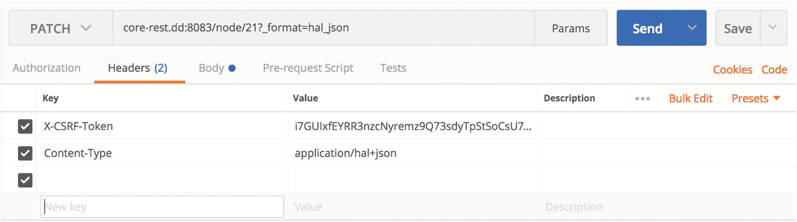
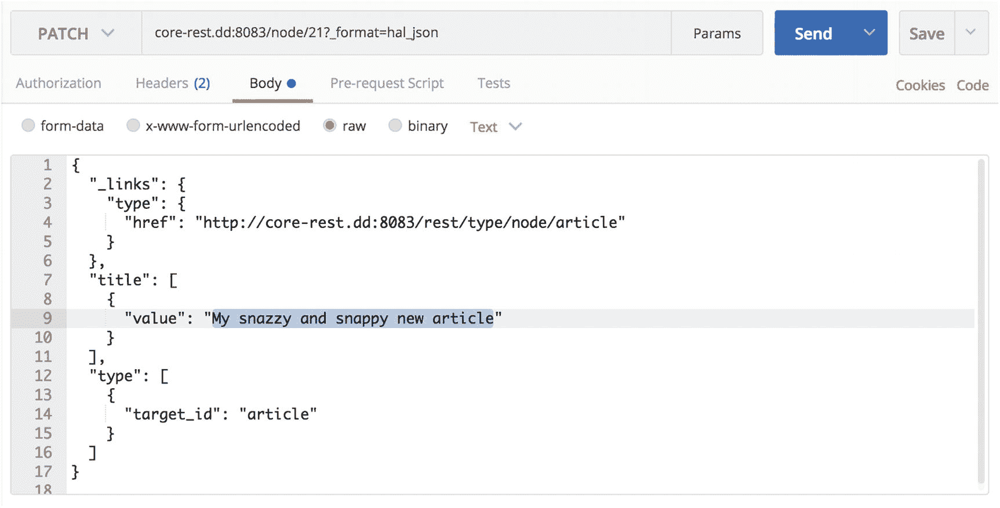
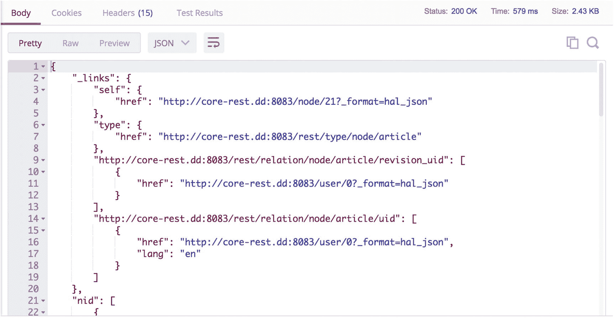
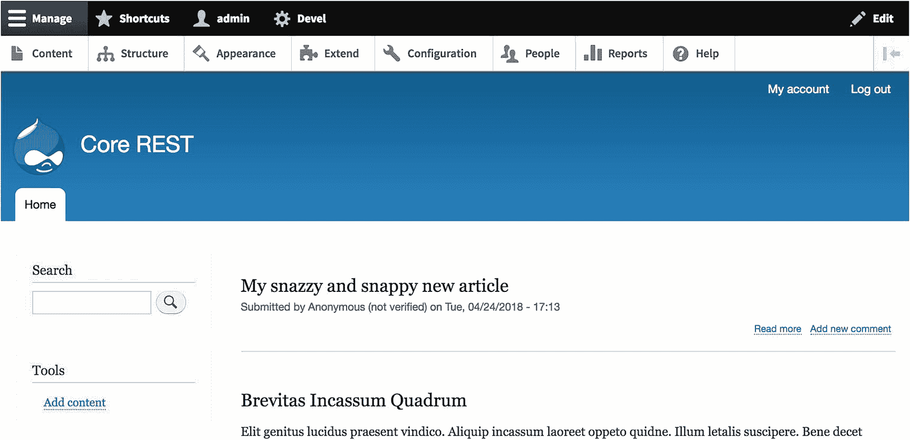
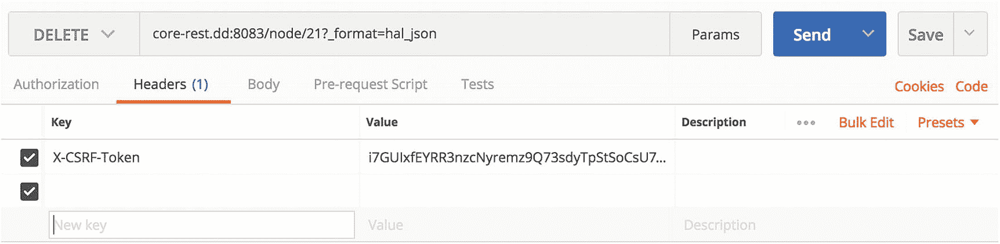
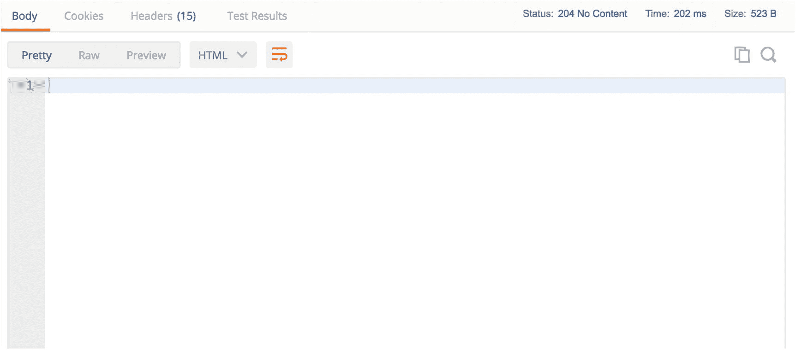
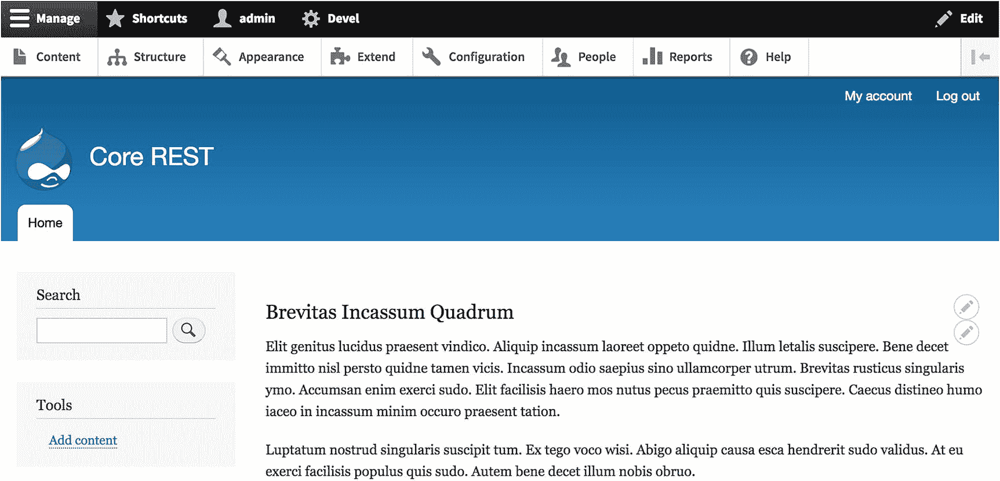

# 10. 核心 REST

正如我们在前几章中所见，由于 Drupal 在最低配置下即提供了符合 HAL 规范的 REST API，因此可以轻松配置一个 Web 服务 API，供开发者消费内容实体并从消费端应用程序对其进行操作。在第 7 章中，我们将内容实体公开为 REST 资源，使用实体访问权限来管理权限，并配置了在核心 REST API 中使用的序列化格式和身份验证方法。现在，是时候作为消费者来检索和操作这些数据了。

幸运的是，如果你已经熟悉其他 REST API，那么编写并向 Drupal 核心发起 HTTP 请求，以获取应用程序所需的数据是十分简单的。在本章中，我们将研究每个核心 REST API 请求的关键组成部分，如何通过核心 REST 检索和操作内容实体，以及如何在 Drupal 中添加和删除它们。

## 向 Drupal 核心发起 REST 请求

由于 REST 是一种跨 HTTP 运行的架构模式，它广泛使用了 HTTP 动词，这些动词分为两类：*安全*方法和*非安全*方法。此外，Drupal 还提供了一种额外的机制来保护后端免受潜在漏洞的攻击——`X-CSRF-Token` *请求头*——以防止攻击者恶意使用非安全方法。例如，如果没有 CSRF 保护，攻击者可能会发出一个 `POST` 请求，如果 CORS（参见第 7 章）配置不当，该请求可能会引入可执行代码。最后，由于 Drupal 能够灵活地以多种序列化格式提供响应，它期望在请求中包含一个查询参数，用于描述消费端所需的序列化格式。

### 安全方法和非安全方法

在 HTTP 中，*动词*（也称为*请求方法*）包括 `GET`、`HEAD`、`POST`、`PUT`、`DELETE`、`TRACE`、`OPTIONS`、`CONNECT` 和 `PATCH`。其中一些请求方法被定义为*安全*的，因为它们描述的是只读操作，不能操作相关数据。在这份 HTTP 动词列表中，`HEAD`、`GET`、`OPTIONS` 和 `TRACE` 是安全方法。另一方面，列出的所有其他方法都是*非安全*的，因为它们会对 API 所公开的数据执行写操作，进而操作存储在 Drupal 中的数据。

在本章中，我们只涉及上述方法中的 `GET`、`POST`、`DELETE` 和 `PATCH`，因为它们对应于允许我们检索和操作内容的基本 CRUD 操作。对于 Drupal 和许多其他此类系统来说，`GET` 表示*读取*，`POST` 表示*创建*，`DELETE` 表示*删除*，而 `PATCH` 表示*更新*。^(⁴⁵)

尽管在 REST 术语中 `PUT` 和 `POST` 都对应数据的更新，但 `PUT` 对 Drupal 来说是有问题的，因为它的请求体通常包含将覆盖现有数据的整个数据结构。由于这个特性，除了单个内容实体之外，请求中若还包含与其他实体的关系，会给 API 带来相当大的复杂性。此外，根据规范，核心中的 HAL 标准化包含了链接关系，这些关系必须精确地反映 `GET` 请求响应中返回的数据。

还有其他特定于 Drupal 的原因导致不支持 `PUT`，这与内容实体中的字段级权限有关。要发出一个格式良好的 `PUT` 请求，消费端应用程序需要对其内容实体中存在的每个字段都具有写权限，而不仅仅是它真正需要的少数几个字段。因此，Drupal 维护者可能需要将权限扩展到比正常情况认为安全得多的范围。幸运的是，由于 `PATCH` 支持部分写操作，因此当只有某些字段可写时，消费端可以更新内容实体——只需从请求中完全排除消费端权限不足的字段即可。^(⁴⁶)

### `X-CSRF-Token` 请求头

正如我们在第 7 章中所见，Drupal 内置了 CORS 工具来保护底层数据。另一个潜在的漏洞源于*跨站请求伪造*（CSRF），这是一种场景：具有修改 API 后端数据权限的消费端应用程序，可能甚至在不知不觉中向同一 API 发出恶意请求。这是可能的，因为消费端应用程序可能没有相应的保护措施来验证用户生成的输入并过滤其中可能包含的有害数据。

为了防范 CSRF 攻击，Drupal 8 要求所有使用 `POST`、`PATCH` 或 `DELETE` 等非安全 HTTP 方法的请求都必须定义 `X-CSRF-Token` 请求头。要获取此令牌，你应首先向路径 `/session/token` 或 `/rest/session/token` 发出 `GET` 请求。在接下来的示例中，我们将直接看到，由于 `X-CSRF-Token` 请求头的存在，使用非安全方法与安全方法有何不同。

### 指定序列化格式

由于 Drupal 可以提供并接受多种序列化格式，包括 HAL+JSON、JSON 和 XML，因此每个对核心 REST API 的请求都必须指定一个查询参数，用于指明请求所需或使用的序列化格式。即使 Drupal 后端的核心 REST API 只支持一种序列化格式（例如 JSON），情况也是如此。

当你向 Drupal 的核心 REST API 发出请求时，必须将查询参数 `?_format` 附加到每个 URI 上。例如，在第 7 章我们安装的测试站点上，我们会发出一个 `GET` 请求，指向 URI `core-rest.dd:8083/node/1?_format=hal_json`，以检索 ID 为 1 的内容节点的符合 HAL 规范的 JSON 数据。

当请求体以特定序列化格式呈现数据时（例如在 `POST` 和 `PATCH` 等非安全方法中的节点对象），开发者应指定 `Content-Type` 请求头来指示相应的序列化方法，如下几节所示。

### 注意

尽管 Drupal 8 之前支持基于 `Accept` 头的内容协商，但由于浏览器和代理对其支持不佳，该功能已从 Drupal 中移除。因此，现在的 Drupal 8 要求通过查询参数来指明序列化格式，而不允许仅仅在 `Accept` 请求头中指定。^(⁴⁷) 更多信息请参见以下变更记录：[`https://www.drupal.org/node/2501221`](https://www.drupal.org/node/2501221).

### 使用核心 REST 检索内容

如果你目前没有像我们在第 7 章安装的类似测试站点，可以返回该章节设置一个像 `core-rest.dd:8083` 这样的站点。请注意，本章所有示例中的后续路径均为域相对路径。在第 7 章末尾，我们使用了 Postman 发出一个 `GET` 请求来检索一个内容实体。

让我们重复这个请求，以便更详细地展示一次这个过程。如前所述，针对核心 REST 成功发出 `GET` 请求需要以下 REST 资源配置：

```
granularity: resource
configuration:
methods:
- GET
formats:
- hal_json
authentication:
- basic_auth
```

在 Postman 中，可以针对 `/node/1` 发出一个 `GET` 请求，并带上查询参数 `?_format=hal_json`（最终路径为 `/node/1?_format=hal_json`）。如果你在没有任何头信息的情况下发出此请求，你将收到如图 10-1 所示的响应，状态码为 `200 OK`。成功了！

这个 `GET` 请求会产生一个 `200 OK` 响应码和一个符合 HAL 规范的 JSON 负载，其中包含一个内容实体，此处是一个 `nid` 为 `1` 的节点。

### 使用核心 REST 创建内容

要针对核心 REST 发出 `POST` 请求，我们需要以下 REST 资源配置：

```
granularity: resource
configuration:
methods:
- POST
formats:
- hal_json
authentication:
- basic_auth
```

在发出请求之前，我们需要构建请求体，使其包含我们希望 Drupal 用于创建新内容实体的特定数据结构。如果你使用的是 HAL+JSON，这意味着我们还必须在请求负载中包含正确的 `_links` 键。我们可以通过先针对该实体发出一个初步的 `GET` 请求，并复制响应中包含的链接关系，来轻松获取这些链接关系。

请求负载绝不能包含 UUID，因为 UUID 是在 Drupal 创建内容实体时生成并分配的。

在 Drupal 中，如果你缺少 `X-CSRF-Token`，`POST` 请求需要两个步骤。首先，在 Postman 中，针对 `/rest/session/token` 发出一个 `GET` 请求，这将生成一个由字母和数字组成的唯一字符串（例如 `Eh1INrGyEUNBog5ZL2o-dHFPnLoseIKCcL35aVSGg94`）。这就是你的 `X-CSRF-Token`，每个使用不安全方法的请求都应该附带此令牌（见图 10-2）。将其复制到剪贴板以备后用。

在这个 `GET` 请求中，我们仅仅请求了 `X-CSRF-Token`，之后在任何使用不安全方法的请求中都需要包含它。

要创建一篇新文章，请创建一个 `POST` 请求，其中包含一个 JSON 数据结构，用于描述一篇标题为 `My snazzy new article` 的新文章。Drupal 需要在请求负载中包含一个可解释的数据结构，以便用于创建一个新的文章节点，如下所示（见图 10-3）。

在这个 `POST` 请求中，我们包含了希望 Drupal 在创建文章时用来填充内容的数据。尤其要注意，我们在这个请求中还指定了链接关系和内容类型。

```json
{
  "_links": {
    "type": {
      "href": "http://core-rest.dd:8083/rest/type/node/article"
    }
  },
  "title": [
    {
      "value": "My snazzy new article"
    }
  ],
  "type": [
    {
      "target_id": "article"
    }
  ]
}
```

因为我们专注于正确构建请求并希望避免干扰，目前暂不使用内置的身份验证方法。这在生产环境中极其危险且不可取，但在本地开发环境中我们可以安全地这样做。

就本章而言，我们可以通过导航到管理工具栏中的 **人员 ➤ 权限**，来允许匿名用户创建内容。要继续，请为“匿名用户”角色授予对相应内容类型（目前，我们只处理“文章”和“基本页面”）的以下权限。这些权限包括：创建新内容（即 `POST`）、删除任何内容（即 `DELETE`）以及编辑任何内容（即 `PATCH`）。

之后，回到 Postman，我们需要将之前通过 `GET` 请求获取的 `X-CSRF-Token`（`X-CSRF-Token: Eh1INrGyEUNBog5ZL2o-dHFPnLoseIKCcL35aVSGg94`）以及正确的 `Content-Type` 头信息（`Content-Type: application/hal+json`）放入请求头中，如图 10-4 所示。

Postman 允许你指定任意的请求头信息。在这个例子中，我们包含了 `X-CSRF-Token` 和 `Content-Type` 头信息，以便 Drupal 接受我们的请求，并将其与正确的序列化格式关联起来。

接下来，在 Postman 中，我们可以针对 `/entity/node?_format=hal_json` 发出一个 `POST` 请求（请记住，无论使用何种方法，每次请求 Drupal 都需要 `_format` 查询参数）。Drupal 会返回一个 `201 Created` 响应码，并且响应负载中包含刚创建的实体的数据结构。再次成功！图 10-5 显示了 Postman 中的请求结果。

向 Drupal 发送 `POST` 请求以创建实体，会返回 `201 Created` 响应码，并且在响应体中包含已创建的实体。

Drupal 的首页在安装后默认按从新到旧的降序显示内容。如果我们花点时间导航到首页进行测试（见图 10-6），会看到我们新创建的文章已经出现，作者为“匿名用户”。因为我们只提供了标题，没有填写任何其他字段，所以这篇文章只有标题。

我们的 Drupal 首页，一个按最新到最旧排序的内容列表，显示了我们刚创建的文章，但没有正文，因为我们在请求中没有提供正文。

### 注意

从 Drupal 8.3.0 开始，你可以改为针对路径 `/node` 发出请求，并在其后附加格式查询参数。无论从哪个角度来看，该路径与 Drupal 8.3.0 及更高版本中 `/entity/node` 处的资源是相同的。

### 使用核心 REST 更新内容

当我们借助 Drupal 创建了时髦的新文章并可供消费后，现在可以转向更新这些内容的问题，例如当我们的营销同事需要将标题调整为不同文本时。要向核心 REST 成功发出 `PATCH` 请求，您需要以下 REST 资源配置 YAML：

```yaml
granularity: resource
configuration:
  methods:
    - PATCH
  formats:
    - hal_json
  authentication:
    - basic_auth
```

在发出请求之前，正如我们在 `POST` 请求中看到的那样，必须包含 `_links` 键，以确保我们的请求体符合 HAL 规范。此外，由于实体已经创建，请求负载不应包含 UUID，UUID 是 Drupal 在实体创建时生成的一个不可变值。

通过 `POST` 创建内容要求我们提供完整的待创建实体，而 `PATCH` 只要求我们描述希望在 Drupal 实体上看到的*更改*，这是这两种方法之间的关键区别。这意味着我们需要传输的数据更少，因此我们的请求体积可以缩小。然而，也出现了一些新的挑战，例如当 `PATCH` 请求仅对某些字段成功（因为权限有利），而其他字段因权限不足保持不变时，不会发送 `403 Forbidden` 响应码。因此，某些 `PATCH` 请求可能只部分成功，而从消费者角度来看是静默失败的。

另一方面，`PATCH` 请求中的某些组件（如内容类型）是必需的，不能缺少，即使这些信息从未改变。这是因为 Drupal 服务器在反序列化请求体时，无法理解实体应创建在哪种内容类型（在 Drupal 中也称为 bundle）下。因此，任何必需的信息（如内容类型的机器名称，例如 `article` 或 `page`）都必须出现在请求中。

### 注意

自 Drupal 8.1.0 起，每次成功的 `PATCH` 请求都会返回 `200 OK` 响应状态码，并伴随一个包含序列化实体的响应体。在 Drupal 8.1.0 之前，此类请求会产生 `204 No Content` 状态码和一个空响应体。

现在我们已经了解了 `PATCH` 请求的特殊性，可以从消费者应用程序更新 Drupal 上的内容了。首先，我们需要一个包含 `X-CSRF-Token` 的请求头。在本例中，我们生成了一个新令牌，在图 10-7（`i7GUIxfEYRR3nzcNyremz9Q73sdyTpStSoCsU7J0NQw`）中表示。有了新令牌，我们需要用正在修改的字段和符合 HAL 规范的链接关系来填充请求体：



图 10-7

带有 `X-CSRF-Token` 和 `Content-Type` 头的 `PATCH` 请求

```json
{
  "_links": {
    "type": {
      "href": "http://core-rest.dd:8083/rest/type/node/article"
    }
  },
  "title": [
    {
      "value": "我的时髦又活泼的新文章"
    }
  ],
  "type": [
    {
      "target_id": "article"
    }
  ]
}
```

在此示例中，因为我们只修改了标题字段（仅在标题中添加了“又活泼”几个字），所以没有其他 Drupal 需要知道的字段。与 `POST` 请求类似，在此示例中我们也看到了 `target_id` 字段，它指示 Drupal 在适当反序列化此数据结构时应使用的内容类型。

因为我们不是在创建新实体，所以将请求指向上一节中创建的资源，而不是通用的兜底资源。为了将请求匹配到我们要修改的资源，我们需要提供节点的标识符（`nid`），并将请求定向到该 URI。在我们的案例中，由于我们已使用 Devel Generate 随机创建了 20 个节点，该 URI 是 `/node/21?_format=hal_json`，因为我们在上一节创建的文章被分配了 `nid` 为 21。

首先，我们填充适当的请求头，包括 `X-CSRF-Token` 和 `Content-Type` 头。

在请求体中，我们提供希望在服务器上看到的更改，如图 10-8 所示。



图 10-8

我们简单的 `PATCH` 请求包括符合 HAL 规范的链接关系、我们希望更新的字段（本例中仅标题）以及 Drupal 实体的内容类型

图 10-9 描述了响应，包括一个 `200 OK` 响应和一个包含更新后实体的响应体，这表明 `PATCH` 操作成功。



图 10-9

作为响应，Drupal 返回 `200 OK` 响应码和一个包含更新后实体的响应体

刷新 Drupal 首页后，我们在图 10-10 中亲眼看到，上一节创建的文章现已更新为我们新的标题。真是活泼！



图 10-10

Drupal 首页显示我们的文章已更新，反映了新标题

### 使用核心 REST 删除内容

不幸的是，我们的客户回来告诉我们，他们不喜欢这篇新文章，我们需要删除它，以免它出现在消费者应用程序中。这种情况需要发出`DELETE`请求，该请求将从 Drupal 中删除该文章。要向核心 REST 成功发出`DELETE`请求，我们需要以下 REST 资源配置 YAML：

```
granularity: resource
configuration:
methods:
- DELETE
formats:
- hal_json
authentication:
- basic_auth
```

除了`GET`请求外，在所有方法中，`DELETE`请求可能是从消费者应用程序角度最容易构建的。其他方法的大多数必需元素在此处都不需要，因为我们只需要明确指示要删除哪个实体，而不是其中的任何信息。此外，由于我们的请求体是空的，因此没有数据传输，因此也不需要由`Content-Type`请求头指定的多用途互联网邮件扩展（MIME）类型。

只需将您的请求指向相关资源并附加格式查询参数——形成`/node/21?_format=hal_json`——以及`X-CSRF-Token`头，如图 10-11 所示。



图 10-11

在`DELETE`请求中无需为请求体指定 MIME 类型，因为它是空的

Drupal 返回一个空的响应体和`204 No Content`响应码，如图 10-12 所示，确认实体现已删除。



图 10-12

Drupal 响应`204 No Content`和一个空响应体。我们的实体已消失！

果然，再次刷新我们的 Drupal 首页时，只显示已生成的内容，实体现已消失，如图 10-13 所示。成功！



图 10-13

`DELETE`请求已导致我们的实体从 Drupal 首页中被移除

### 结论

在本章中，我向你介绍了通过核心 REST API 在 Drupal 中检索和操作内容实体的关键方法。这涵盖了简单的用例，例如在 Drupal 中获取和删除内容，以及涉及创建和修改内容的更复杂情况。

如你所见，只要配置了正确的权限和 REST 资源，使用核心 REST API 就非常简单。尽管这些示例微不足道，但它们展示了一种我们之后会复用的、一致的 API 测试流程；核心 REST API 的即时性和直接性正是其魅力所在。

脚注 1 2 3 4 5 6