# 11. 将视图与核心 REST 结合使用

有时，核心 REST API 可能无法满足你的需求，无论是由于它无法很好地处理资源集合，还是因为你无法从 Drupal 中获取消费端所需的信息。许多促使决策者选择 Drupal 作为 CMS 的相同动机——即 Views 模块及其灵活的查询构建——也同样适用于解耦的 Drupal 实现。幸运的是，Views 包含一种 REST 导出显示类型，可用于提供自定义设计的只读 API。

## 使用视图进行内容列表展示

对于那些不太熟悉将 Drupal 作为单体 CMS 的人来说，Views 是一个查询构建器和工具，可以简化在 Drupal 8 核心中创建任意实体列表的过程。事实上，Drupal 的许多管理界面本身就是 Views 并且是可定制的，例如我们在前面章节操作新文章时看到的首页。你可以使用 Views 以各种显示方式（包括页面和区块）和各种格式（包括表格和未格式化列表）创建内容列表。

许多开发者和网站构建者发现 Views 对于创建内容列表非常有用，例如已登录用户表、最近文章的摘要列表，或按字母顺序排序的分类术语列表。在解耦 Drupal 的背景下，这些信息对消费端应用程序也非常有用且宝贵。不过，你可以使用 REST 导出显示类型，而不是使用限制这些内容列表只能在原生 Drupal 前端使用的页面或区块显示，从而轻松地基于 Views 输出创建只读 API。

## 为 REST 导出显示创建视图

因为 Views 是 Drupal 8 核心的一部分，你通常无需启用相关模块；但为了保险起见，你应该确认 `Views` 和 `Views UI`（为 Views 提供用户界面的模块）都已安装并启用。在 Views 中使用 REST 导出还需要启用 `RESTful Web Services` 和 `Serialization` 模块。

然后，我们可以导航到 `管理 ➤ 结构 ➤ 视图 ➤ 添加视图` 来创建一个新视图 (`/admin/structure/views/add`)。你也可以通过创建额外的 REST 导出显示来重用现有的某个包含 Drupal 管理界面特定列表的视图，但在这个示例中，我们将从头到尾搭建一个视图：构建一个按文章标题字母排序的文章列表。在“添加视图”页面（如图 11-1 所示），你需要设置一个名称和视图设置，其中包括内容类型和排序条件的配置。

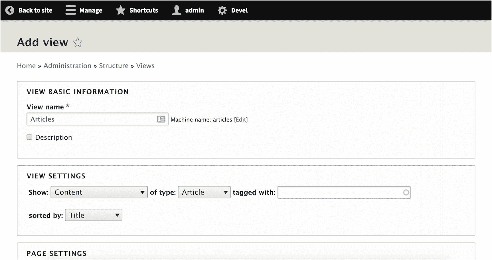

*图 11-1*

“添加视图”页面允许你创建视图，这些内容列表不仅可作为页面和页面区块公开，还可作为 REST 导出公开

接着，我们需要创建一个 REST 导出并提供一些初始设置，最重要的是设置一个可访问此视图显示的路径。许多 API 设计者倾向于通过在资源路径前加上 `/api/v1` 来对 API 进行版本管理，这表示 API 的第一个版本。这样架构师可以发布 API 的新版本，使得新消费端能够依赖改进后的版本，同时保持依赖旧版本的消费端不受影响。考虑到这种情况，我们将使用 `api/v1/articles`，如图 11-2 所示。

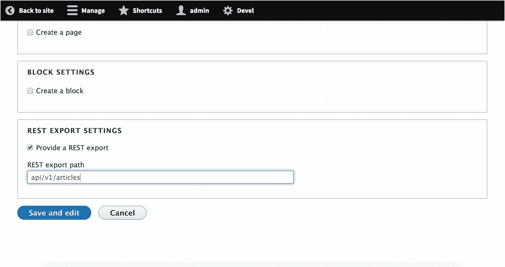

*图 11-2*

在将新视图公开为 REST 导出时，你可以设置一个任意路径，通过该路径可访问你创建的由视图生成的 REST API。这有助于为消费端应用程序实现基本的版本控制系统。

点击 `保存并编辑` 将我们带到视图配置界面，该界面允许我们对 REST 导出显示设置各种条件，并为我们提供 API 资源的实时预览（见图 11-3）。

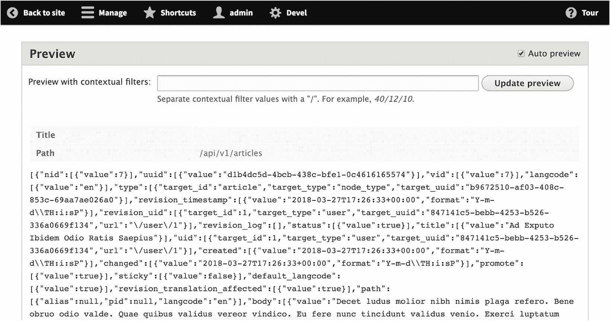

*图 11-3*

视图 REST 导出的实时预览展示了我们的 REST 资源作为有效负载公开给消费端应用程序时的样子

例如，你可以使用“添加筛选条件”模态框（见图 11-4）来方便地根据文章的评论数量、更新日期、作者名称、发布状态或多种其他条件对文章进行排序。

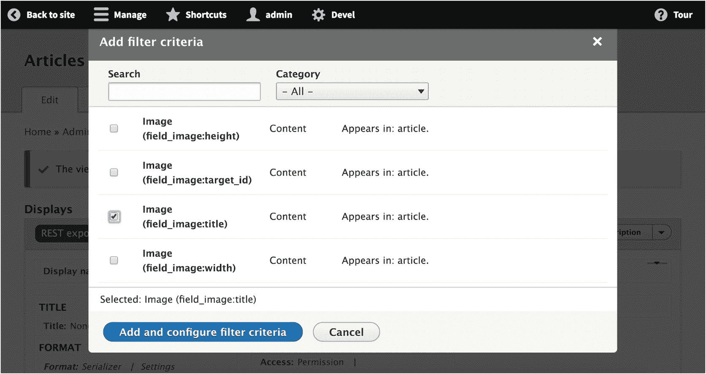

*图 11-4*

在视图中，我们可以添加筛选条件，这些条件基于内容项所包含的字段决定应如何对其进行排序

让我们来看一个为我们的视图配置添加新筛选条件的实际用例。虽然我们的网站包含的文章可能有图片也可能没有，但我们的消费端应用程序是为一个要求发出的每个内容项都必须包含图片的客户设计的。这意味着我们的 API 必须只考虑那些包含图片的文章。幸运的是，我们的 `Devel Generate` 命令（见第 7 章）创建了一些包含图片和不包含图片的文章。

由于生成的每张图片也都有一个标题，我们将添加一个筛选条件，确保图片的标题不为空，如图 11-5 所示。

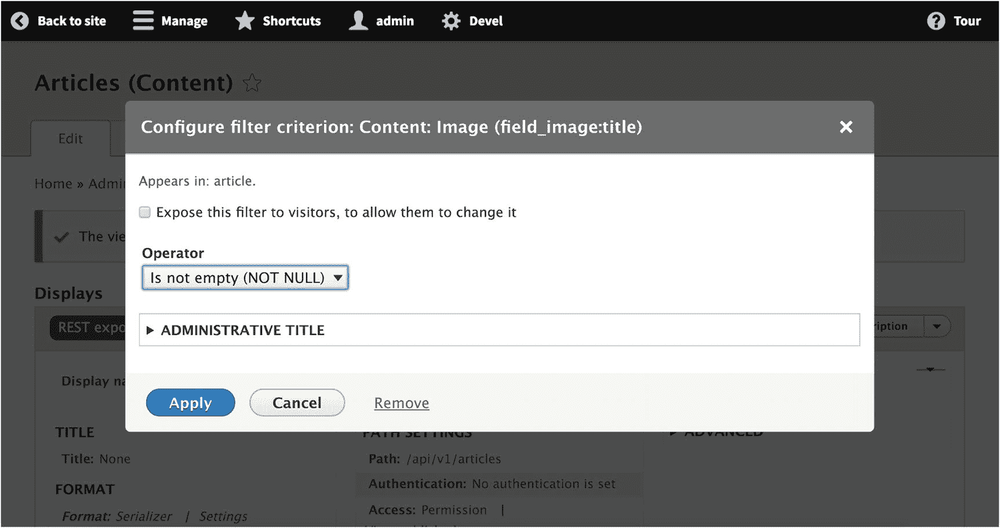

*图 11-5*


图 11-5

在此过滤条件中，我们仅指定包含图片的内容项目纳入 REST 导出显示。

我们的视图配置现在如图 11-6 所示，过滤条件表明我们只希望获得已发布且包含已填写某种标题的图片的文章。

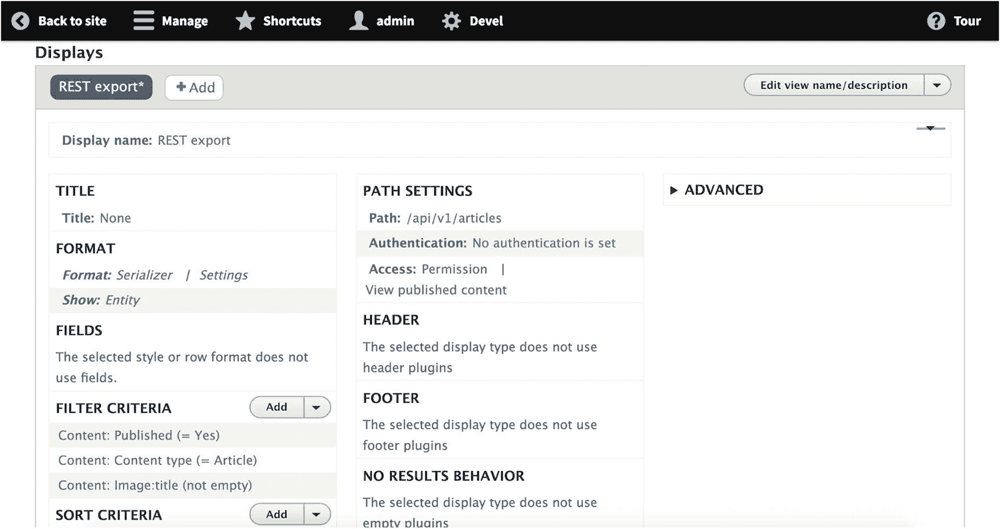

图 11-6

已添加过滤条件的视图配置页面

如果检查界面下方的实时视图预览，我们确实可以看到负载中仅包含带有图片的文章。

```
...
"field_image":
[
{
"target_id":1
"alt":"Abbas distineo neo. Importunus luctus nutus turpis ullamcorper ymo.",
"title":"Abbas magna utrum. Distineo gemino interdico lobortis natu nibh nimis similis typicus.",
"width":481,
"height":563,
"target_type":"file",
"target_uuid":"376df8ce-f1f3-474c-94ae-7f4816be67c6",
"url": "http:\/\/core-rest.dd:8083\/sites\/core-rest.dd\/files\/2018-03\/generateImage_dZ02Dw.png"
}
]
...
```

现在，我们可以将此内容作为 API 资源正常使用，但并非通过核心 REST API 的典型方式；保存视图后，我们的 API 将在初始创建视图过程中定义的路径上可用。

客户要求我们不再按文章标题的字母顺序排序，而是改为按图片标题排序。我们可以应用一个新的基于图片标题的升序排序条件，并移除现有的标题排序条件。这就得到了图 11-7 中的配置。


图 11-7

在此示例视图配置中，我们将视图限制为仅显示已发布且包含图片的文章，排序依据为文章内图片标题的升序

检查配置下方的实时预览时，我们可以看到，在之前的实体（其图片标题以“Abbas”开头）之后，一个新的实体取代了第二个内容实体。在我们生成的内容中，显示的第二个实体标题为“Laoreet Refero”，但其引用的图片标题为“Accumsan augue ….”。

```
...
"field_image": [
{
"target_id": 7,
"alt": "Abico nimis nunc pecus persto suscipere utinam.",
"title": "Accumsan augue caecus dolus luctus mauris plaga suscipere valde venio.",
"width": 317,
"height": 128,
"target_type": "file",
"target_uuid": "63bafb27-944a-4484-a991-f8601b1517c8",
"url": "http:\/\/core-rest.dd:8083\/sites\/core-rest.dd\/files\/2018-03\/generateImage_xC0P2i.gif"
}
]
...
```

这个例子有点刻意，旨在让你熟悉视图配置界面，特别是那些可能仅将 Drupal 用作内容后端、尚未接触过 Drupal 的开发者。不过，我们的内容很少会如此容易处理，通常，我们对内容模型有独特的需求，这迫使我们使用自定义内容类型。

尽管视图的大部分强大功能超出了本概述的范围，但提供视图资源的简单 API 对于只需要只读访问内容的消费者应用来说可能很有价值。然而，在通过 Postman 测试视图的 REST 导出之前，我们通过一个自定义内容类型进行更深入的探讨。

## 使用视图 REST 导出的自定义内容类型

Drupal 内容模型强大工具的很大一部分在于能够创建新的自定义内容类型，并为其指定特定字段。这在 Drupal 中开箱即用，这意味着，与需要自定义插件才能启用此功能的 WordPress 不同，可以根据内容的独特需求，使用诸如产品、常见问题、火车模型、投资组合项目等自定义内容类型来构建任意内容模型和相应的模式。然后，可以根据各种字段类型使用字段自定义这些类型。

在此示例中，我们的基础页面和文章类型已无法满足内容模型的需求。既然我们的客户决定建立一个对全球机场进行编目的旅游网站，我们需要创建一个 API 来提供机场列表，该列表可以通过 IATA 代码或机场位置进行排序。

我们需要创建一个新的“机场”内容类型，包含以下字段：

*   机场（内容实体）

    *   名称（字段）

    *   IATA 代码（字段）

    *   位置（字段）

导航至 管理 ➤ 结构 ➤ 内容类型 (`/admin/structure/types/add`) 以添加新的内容类型。在图 11-8 中，我们为该内容类型提供了一个名称（“机场”），添加了将用作“添加内容”页面帮助文本的描述，并将默认标题字段标签更改为“名称”，以更好地反映我们内容类型的特性。

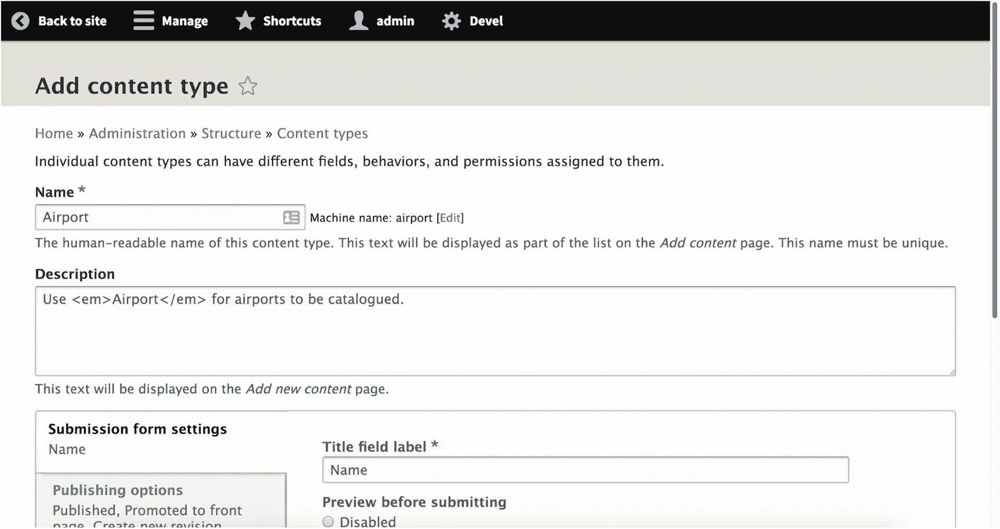

图 11-8

Drupal 最强大的功能之一是能够创建具有任意字段的自定义内容类型。在此截图中，我们正在创建一个新的“机场”内容类型。

下一页（如图 11-9 所示）使我们能够向内容类型添加字段或从中移除字段。我们不需要“正文”字段，因此可以将其移除，只关注 IATA 代码字段和位置字段。

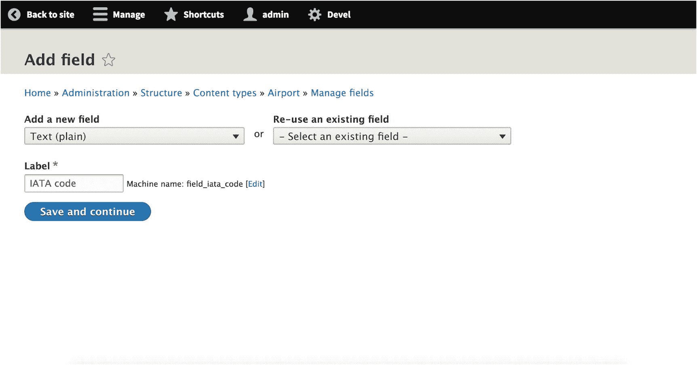

图 11-9

你可以向自定义内容类型添加各种类型的字段（或复用其他内容类型中已有的字段），并为其提供唯一的标签和机器名称。

对这两个字段都使用纯文本格式器后，最终，我们看到我们的“机场”内容类型除了标题之外还包含两个附加字段：IATA 代码和位置（见图 11-10）。

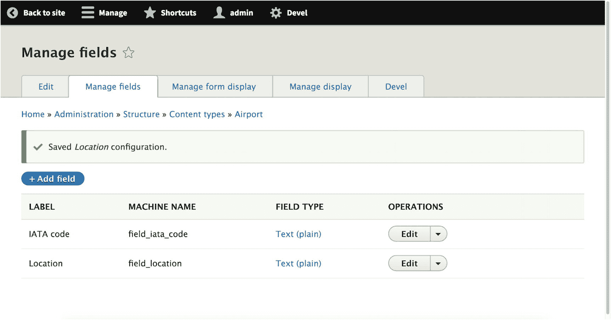

图 11-10

我们完成的“机场”内容类型，包含 IATA 代码和位置字段

现在，我们可以创建一些内容了。添加十个类型为“机场”的内容实体，并填入信息。完成后，我们可以创建视图和相应的 REST 导出。导航至 管理 ➤ 结构 ➤ 视图 (`/admin/structure/views`) 并单击“添加视图” (`/admin/structure/views/add`)。为视图命名（例如，“Airports”），并确保视图设置显示类型为“机场”的内容，并按标题排序。接下来，确保存在一个 REST 导出，使我们能够在路径 `api/v1/airports` 上，在消费者应用中定位 API。

你可能已经注意到，我们的视图配置不允许我们指定要包含哪些字段或如何包含它们。这是因为我们使用默认的实体格式器来显示实体，而不是依赖字段格式器。但是，我们可以自定义视图的 REST 导出，使其在 Drupal 的实体结构中显示单个字段，而不是整个实体（见图 11-11）。

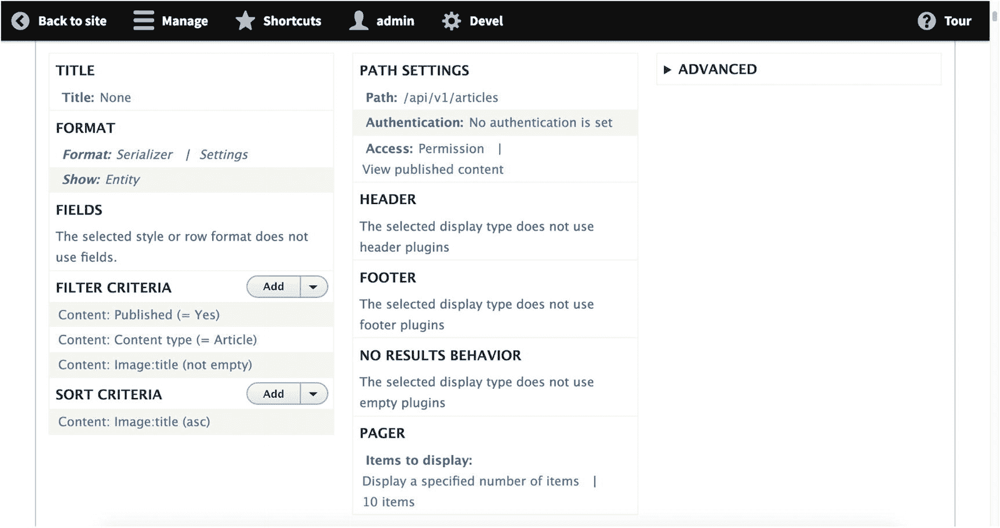

图 11-11 默认情况下，视图格式的 REST 导出会使用默认实体数据结构来显示所有字段，正如在 `显示` 字段中看到的 `实体` 值。

相反，我们可以更改格式化程序以显示个别字段，这为我们提供了更大的灵活性。如果我们选择这样做，可以要求视图仅提供包含某个字段的 REST 导出，例如 IATA 代码和位置，而不包含其他任何字段（如标题）。如果你有某些内容包含了希望在后端编辑界面或 Drupal 站点中公开、但不想在前端消费者应用中显示的字段，这将特别有用。

就我们的目的而言，我们只导出 IATA 代码和 `位置` 字段，将 `标题` 字段隐藏，使其仅在 Drupal 站点上浏览内容时可见。我们新配置的视图显示了 IATA 代码和 `位置` 字段，但没有 `标题` 字段——尽管机场仍然按名称排序，正如我们在图 11-12 的排序条件中所看到的那样。

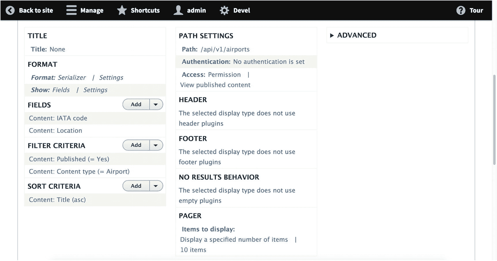

图 11-12 相反，通过将 REST 导出设置为显示单独的“字段”，我们可以指定要显示的字段，而不是通常显示所有节点信息。

现在我们有了一个轻量级的 API 资源，它只提供单个字段数据。图 11-13 中的实时预览显示，将导出的数据限制为仅 IATA 代码和位置，显著减小了负载大小。

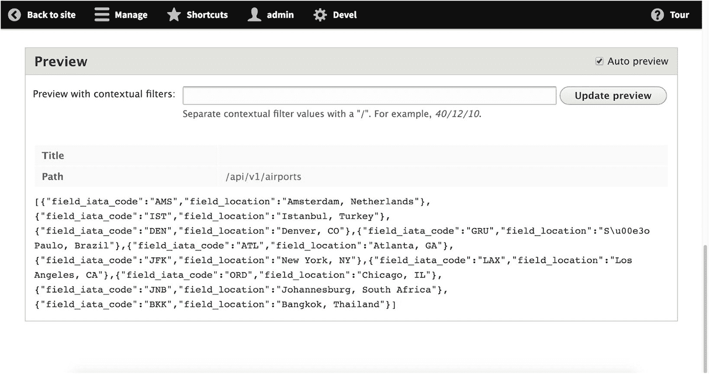

图 11-13 将显示内容限制为特定字段，可以改善开发人员构建消费者应用的体验，因为负载更简单且更易于遍历。

以下是图 11-13 中的负载经过格式化后的样子：

```
[
{
"field_iata_code": "AMS",
"field_location": "Amsterdam, Netherlands"
},
{
"field_iata_code": "IST",
"field_location": "Istanbul, Turkey"
},
{
"field_iata_code": "DEN",
"field_location": "Denver, CO"
},
{
"field_iata_code": "GRU",
"field_location": "S\u00e3o Paulo, Brazil"
},
{
"field_iata_code": "ATL",
"field_location": "Atlanta, GA"
},
{
"field_iata_code": "JFK",
"field_location": "New York, NY"
},
{
"field_iata_code": "LAX",
"field_location": "Los Angeles, CA"
},
{
"field_iata_code": "ORD",
"field_location": "Chicago, IL"
},
{
"field_iata_code": "JNB",
"field_location": "Johannesburg, South Africa"
},
{
"field_iata_code": "BKK",
"field_location": "Bangkok, Thailand"
}
]
```

不过，有一个问题让我们稍作停顿。Drupal 使用 `field_` 前缀来标识所有不属于其标准核心数据模型的自定义字段。在其他条件不变的情况下，这意味着每个使用此 API 的开发人员都必须了解并根据 Drupal 提供的命名体系来编写他们的应用程序。幸运的是，Drupal 也允许我们为这些自定义字段名提供别名，从而为字段赋予更易于记忆的名称。单击 `字段` 格式化程序旁边的 `设置`，我们就可以为字段设置别名，如图 11-14 所示。

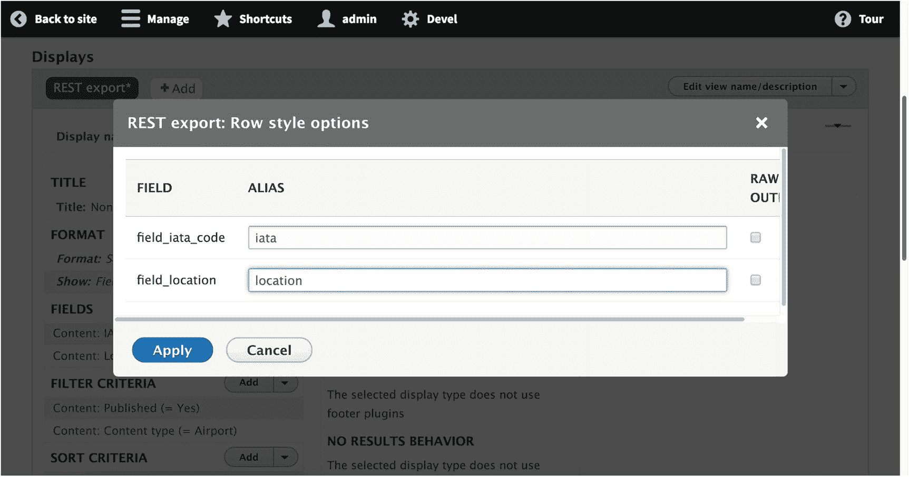

**图 11-14** 借助视图，我们可以为字段名设置别名，这可以进一步改善消费者应用的开发体验。

现在，对于需要特定字段标签和小负载大小的消费者来说，我们导出的数据看起来更棒了。

```json
[
{
"iata": "AMS",
"location": "Amsterdam, Netherlands"
},
{
"iata": "IST",
"location": "Istanbul, Turkey"
},
{
"iata": "DEN",
"location": "Denver, CO"
},
{
"iata": "GRU",
"location": "S\u00e3o Paulo, Brazil"
},
{
"iata": "ATL",
"location": "Atlanta, GA"
},
{
"iata": "JFK",
"location": "New York, NY"
},
{
"iata": "LAX",
"location": "Los Angeles, CA"
},
{
"iata": "ORD",
"location": "Chicago, IL"
},
{
"iata": "JNB",
"location": "Johannesburg, South Africa"
},
{
"iata": "BKK",
"location": "Bangkok, Thailand"
}
]
```

> **注意：** 本节部分内容受到了 Kevin Blanco 的优秀教程《在 Drupal 8 中构建一个快速的 RESTful 视图》的启发，该教程可在 [`https://medium.com/kevinblanco-io/build-a-quick-restful-view-in-drupal-8-56203ea63b88`](https://medium.com/kevinblanco-io/build-a-quick-restful-view-in-drupal-8-56203ea63b88) 找到。

作为最后一步，如果我们定义了其他序列化格式，还可以让 REST 导出以 JSON 以外的格式提供。例如，在已具备 CSV 序列化器的情况下，我们可以包含通过 XML 或 CSV 请求数据的能力。在图 11-15 中，我们启用了所有三种可用格式（`hal_json`、`json` 和 `xml`），尽管将所有复选框留空也会使这三种格式都可用。

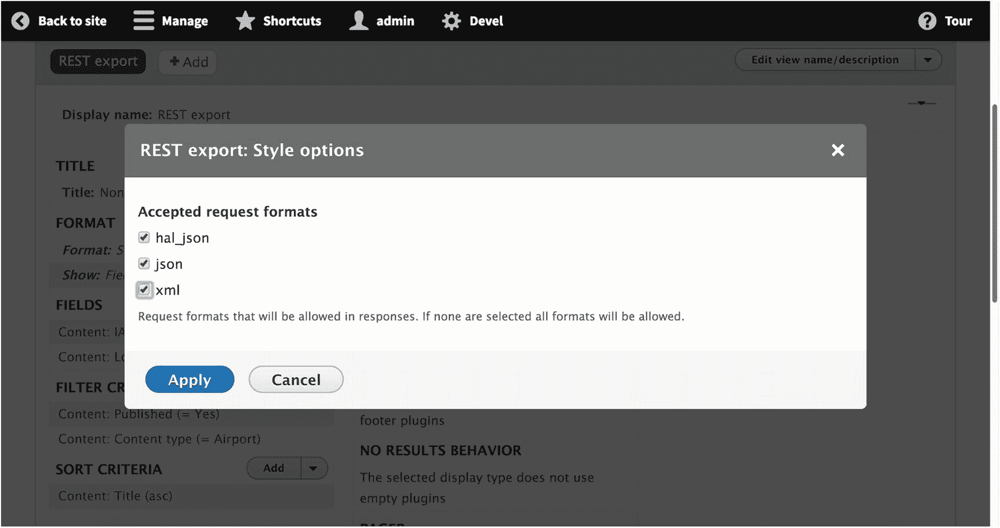

**图 11-15** 通过样式选项，我们可以允许消费者以 HAL+JSON、JSON、XML 或我们定义的任何其他序列化格式检索数据。

## 使用核心 REST 检索视图 REST 导出

在过去的几节中，我们使用了诸如序列化（Serialization）和视图 REST 导出（Views REST exports）等核心 REST 模块，为我们提供了两个位于 `/api/v1/articles` 和 `/api/v1/airports` 的 API 资源。现在，我们可以像之前那样使用 Postman，通过对 Drupal 发出 `GET` 请求，来检索这两个视图 REST 导出。

关于视图 REST 导出，有一点很重要：它们的权限是与我们之前操作过的单个实体等典型 REST 资源权限明确区分开来的。视图 REST 导出不使用 REST 资源插件，这意味着 REST 定义的权限不适用于视图。^(⁵¹)

当我们对 `/api/v1/articles?_format=hal_json` 发出 `GET` 请求时，即使没有任何头部信息（此处不需要 `X-CSRF-Token`，因为 `GET` 是安全方法），Drupal 会按照预期返回符合 HAL 规范的文章实体。使用值 `json` 会给我们提供相关实体的纯表示，`xml` 也是如此，如图 11-16 所示。

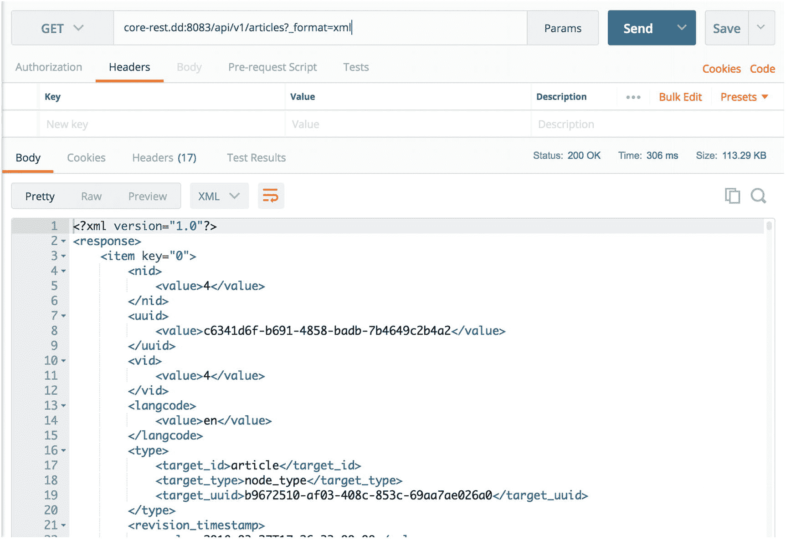

**图 11-16** 我们将视图 REST 导出配置为在请求时提供 XML *响应*，从而成功以 XML 格式检索到了我们的视图。

当我们对 `/api/v1/airports?_format=json` 发出 `GET` 请求时，我们会收到我们在配置视图 REST 导出期间刚刚预览过的数据，如图 11-17 所示。还不错！

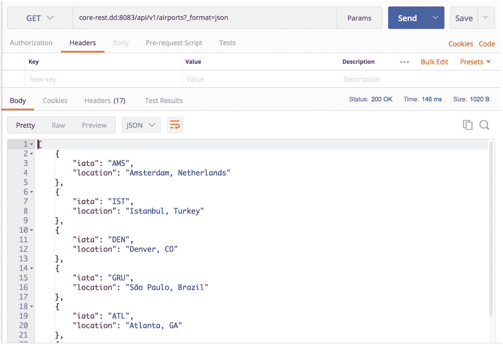

**图 11-17** 之前的操作，例如为字段名添加别名以及通过指定字段来限制显示信息量，最终生成了一个简化的 JSON 负载。

### 结论

尽管核心 REST 提供了开箱即用的查询和操作单个实体的能力，但对于我们作为架构师和开发人员所面临的用例来说，这有时是不够的。鉴于不安全 HTTP 方法的影响，单独操作实体通常是合理的，但当涉及到只读操作时，单个实体则完全不够。

得益于视图 REST 导出，提供公开内容集合的 API 可以是一个轻松且快速的过程。对于许多只需要检索内容的轻量级应用程序，视图可以成为核心 REST 模块的强大替代方案。然而，视图最初是为 Drupal 前端提供内容列表而构建的，这意味着其能力存在局限性。

此外，通常会出现这样的情况：你需要一个更健壮、且他人之前使用过的 API 规范，或者你无法为了对公开数据执行复杂操作而配置两个独立的 API 端点。Drupal 针对这个问题有一个解决方案：JSON API，我们将在后续章节中详细讨论。

脚注 1