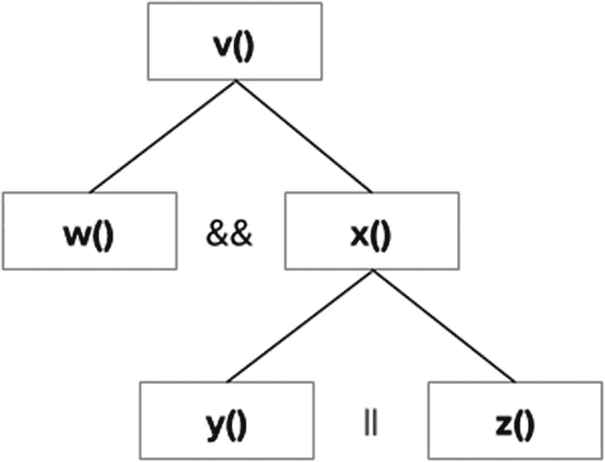
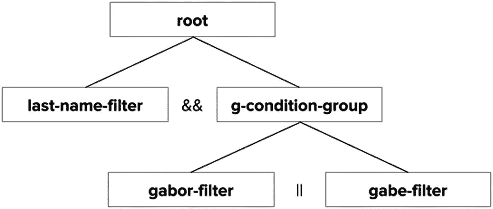
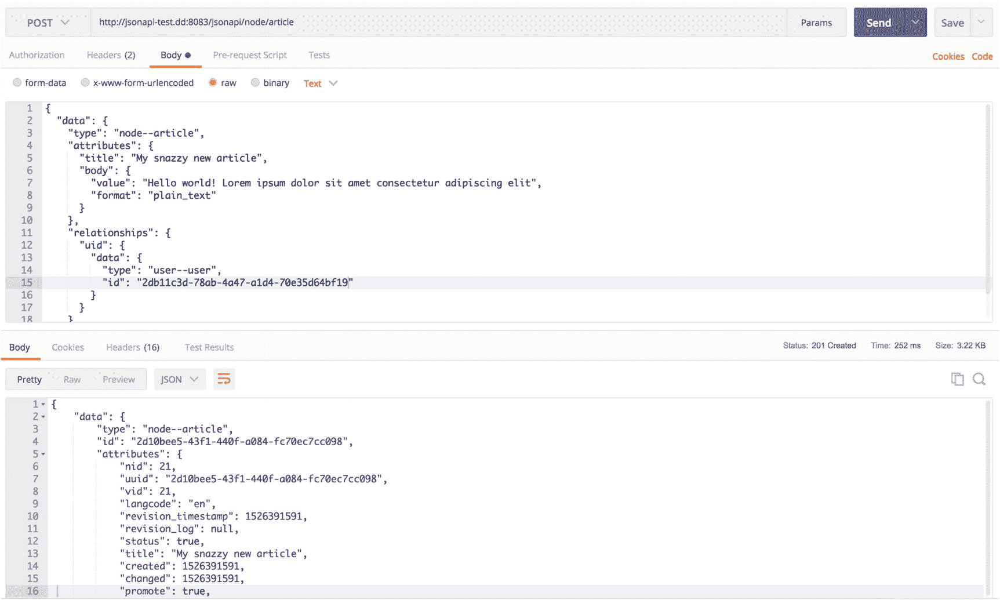
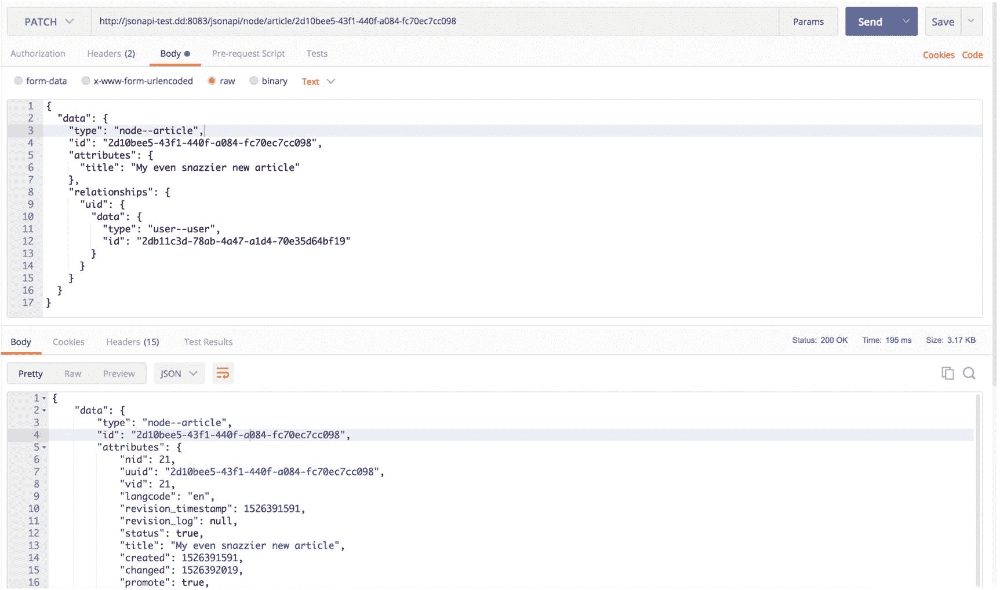
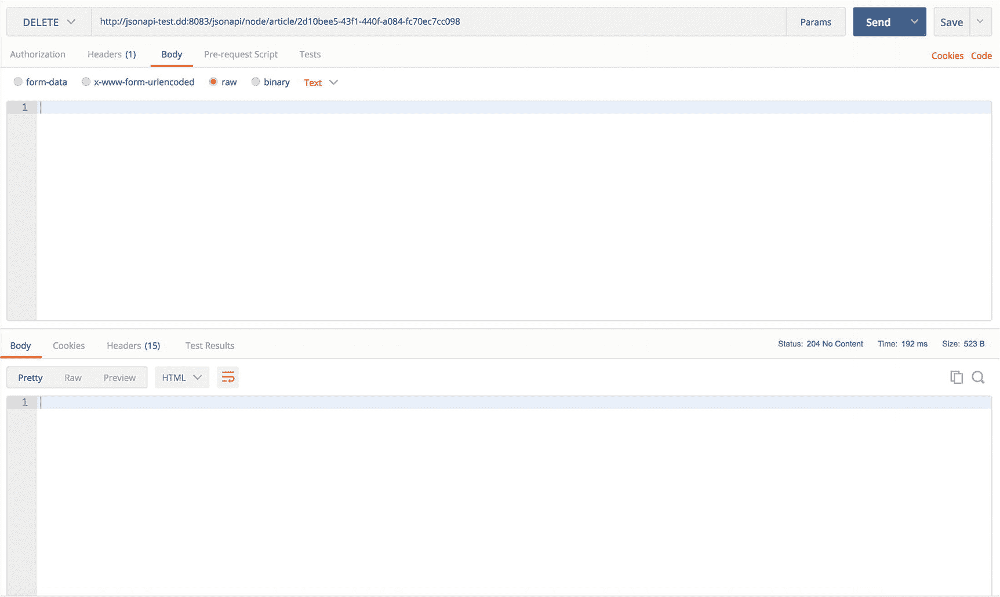

# 12. Drupal 中的 JSON API

正如我们在第 8 章中所见，JSON API 是核心 REST 的一个强大替代方案，因为它是一个被广泛理解的规范，受益于健壮的关系和查询操作定义方式，并且是 Drupal 可用的、最稳定的贡献版 Web 服务解决方案之一。尽管 JSON API 计划作为稳定模块包含在 Drupal 8.7.0 的核心中，但对于首要关注稳定性的架构师来说，它可能不那么有吸引力。

Drupal 对 JSON API 的实现与核心 REST 在几个关键方面存在显著差异。首先，在核心 REST 中修饰每个请求的`_format`查询参数在 JSON API 中是不必要的，因为序列化格式被假定为严格的 JSON。其次，资源 URI 的构成与核心 REST 不同，并且与访问 Drupal 站点内容所使用的典型路由有明显区别。

在本章中，我们将回顾这些差异，以及在 Drupal 中针对 JSON API 成功发起请求以创建、读取、更新和删除内容的流程。

### 注意

关于文件上传功能，请参考 JSON API 文件模块，这是一个贡献版解决方案，超出了本书的范围。JSON API 文件模块可在 Drupal.org 上找到，地址为 [`https://www.drupal.org/project/jsonapi_file`](https://www.drupal.org/project/jsonapi_file)。相关文档可在 Drupal.org 上找到，地址为 [`https://www.drupal.org/docs/8/modules/json-api/working-with-files-post`](https://www.drupal.org/docs/8/modules/json-api/working-with-files-post)。

## 使用 JSON API 检索资源

JSON API 规范建议每个请求都应包含一个带有正确 JSON API MIME 类型的`Accept`标头，但 JSON API 模块也接受没有任何请求标头的请求^((52))。

```
Accept: application/vnd.api+json
```

### 检索单个资源

检索单个资源需要其标识符，需要注意的是，与核心 REST 不同，该标识符不是我们在核心 REST 中看到的`nid`，而是一个 UUID。要检索单篇文章，我们只需对以下 URI 发起一个`GET`请求，并将`{{node_uuid}}`替换为相应的 UUID。

```
/jsonapi/node/article/{{node_uuid}}
```

此外，路径中引用的 bundle（例如`article`）必须与所查询实体的 bundle（内容类型）一致，否则将抛出错误。当您发起请求时，随后的响应将包含`200 OK`的响应码，响应体将包含您所请求节点的 JSON API 对象，包括属性（即字段）、任何可用的关系以及链接关系^((53))。

### 注意

要检索特定节点的 UUID，您可以使用可用的调试工具，例如我们第 7 章安装的 Devel 模块（用于提供自动内容生成）。在 Drupal 中导航到需要识别的节点，从查看选项卡切换到 Devel 选项卡，UUID 即可在变量部分找到，如图 12-1 所示。或者，您可以启用第 7 和第 10 章中的核心 REST 模块，并针对该实体发起`GET`请求，生成的响应将包含该 UUID。


图 12-1

借助 Devel 模块，您可以内省任何实体并查明其 UUID，以用于检索单个实体

### 检索资源集合

使用 JSON API 而非核心 REST 的最重要动机之一在于，能够通过 JSON API 集合在单个请求中检索多个资源。在 Drupal 8 Core 中，虽然我们可以使用核心 REST 检索单个实体，但视图 REST 导出（见第 11 章）是开箱即用的、唯一可以用来检索实体集合的方法。而在 JSON API 中，我们只需在`GET`请求中移除 UUID。发出此请求后，JSON API 会返回一个文章节点集合。

```
/jsonapi/node/article
```

在生成的响应中，我们会找到一个`200 OK`响应码和一个`data`对象，其中包含最多 50 篇文章，并附带一个指向集合中下一页可用文章的链接。

##### 对资源集合进行分页

对资源集合进行分页时的一个最佳实践是使用 JSON API 内置的分页链接，而不是生成定制的分页 URL。从 JSON API 检索到的每个集合都在`links`键下包含以下信息，如表 12-1 所示。

表 12-1

JSON API 分页链接与定义

| **键** | **页面指示** | **当前页面状态** |
| --- | --- | --- |
| `self` | 当前页 | 如果既不存在`prev`也不存在`next`，则只有一页。 |
| `next` | 下一页 | 如果`next`存在，则还有更多页面。如果`next`不存在，则这是最后一页。 |
| `prev` | 上一页 | 如果`prev`存在，则当前页不是第一页。 |

### 注意

如果您遇到这样一种情况：页面限制大于响应中出现的资源数量（例如，页面限制为 4，但只出现了 3 个资源），并且还存在`next`链接，这意味着集合中有某个实体出于安全原因未被展示。

除了分页链接，JSON API 规范还允许某些查询参数对通过 API 检索到的集合进行操作。例如，对以下路径的请求指定了 25 篇文章的限制，响应将包含指向集合中下一页文章的链接。

```
/jsonapi/node/article?page[limit]=25
```

我们可以使用`page[offset]`来检索第二页的 25 篇文章，这样服务器响应中将只包含第 26 到第 50 篇文章。

```
/jsonapi/node/article?page[limit]=25&page[offset]=25
```

### 注意

为了避免 DDoS 及类似攻击损害 Drupal 后端的性能，JSON API 模块强制设置了 50 的上限页面限制，以避免对过多资源执行访问检查。这也是无法检索总页数的原因。有关 Drupal 中 JSON API 分页的更多信息，请参见 [`https://www.drupal.org/docs/8/modules/json-api/pagination`](https://www.drupal.org/docs/8/modules/json-api/pagination)。


#### 对资源集合进行排序

我们还可以在请求中通过使用 `sort` 查询参数动态执行排序操作，该参数将属性作为排序结果的依据值。在以下示例中，我们依据 `title` 字段和 `nid` 标识符对响应中的集合进行排序。

```
/jsonapi/node/article?sort[sort-title][path]=title
/jsonapi/node/article?sort[sort-nid][path]=nid
```

这些排序方式也有简写形式。

```
/jsonapi/node/article?sort=title
/jsonapi/node/article?sort=nid
```

我们可以通过提供另一个参数来反转顺序。

```
/jsonapi/node/article
?sort[sort-title][path]=title
&sort[sort-title][direction]=DESC
/jsonapi/node/article
?sort[sort-nid][path]=nid
&sort[sort-nid][direction]=DESC
```

还有一种简写形式，可以通过在值前添加连字符来利用，这表示升序应被反转，变为降序。

```
/jsonapi/node/article?sort=-title
/jsonapi/node/article?sort=-nid
```

当用于排序集合的字段中存在可用属性时，我们可以通过添加一个句点 (`.`) 来访问下一级的属性。在以下示例中，我们根据文章作者的姓名对集合进行排序，其中 `sort-author` 是我们为排序指定的任意名称，用于与其他排序区分。

```
/jsonapi/node/article?sort[sort-author][path]=uid.name
```

此路径的简写形式如下。

```
/jsonapi/node/article?sort=uid.name
```

也可以按多个字段进行排序，这些字段会按照它们被列出的顺序依次考虑。

```
/jsonapi/node/article
?sort[sort-title][path]=title
&sort[sort-title][direction]=DESC
&sort[sort-author][path]=uid.name
```

在简写形式中，您可以像之前看到的那样反转顺序。^(⁵⁴)

```
/jsonapi/node/article?sort=-title,uid.name
```

##### 过滤资源集合

当我们对诸如 `/jsonapi/node/article` 这样的资源集合发出 `GET` 请求时，我们会检索拥有权限访问的每一个资源。然而，消费者应用通常需要符合特定特征集的过滤响应，例如由某位特定作者撰写的所有文章，或超过某个日期的所有文章。

在 Drupal 的 JSON API 实现中，我们可以使用*过滤器*来指定哪些资源应包含在响应中。使用过滤器的最简单方法是根据字段的值选择特定资源，路径格式如下，其中 `{field_name}` 和 `{other_field_name}` 是可用于过滤的字段，`{value}` 代表用于过滤的值。

```
/jsonapi/node/article
?filter[{field_name}]={value}
&filter[{other_field_name}]={value}
```

与依赖用户界面来暴露定制化资源的 Views REST 导出（见第 11 章）不同，Drupal 的 JSON API 实现所提供的过滤系统包含两个基本概念：条件和组。在 JSON API 中，*条件*表示被断言为真的表达式。一个条件表明资源的某方面为真或假，例如：“这篇文章是本周创建的吗？” 当条件对某个资源返回 `FALSE` 时，JSON API 会将其从集合中排除。

同时，*组*是由条件中的断言组成的逻辑集合，用于构建更大的条件组。这些条件组可以嵌套，以形成粒度精细的查询。例如，考虑以下示例，它展示了当我们嵌套条件组时建立的树状关系。我们可以很容易地用这种方式表达一个条件层级结构。

```
v( w() && x( y() || z() ) )
```

在此例中，条件 `y()` 和 `z()` 是组 `x()` 的成员，它们之间是 `OR` 关系。条件 `w()` 和 `x()` 是组 `v()` 的成员，它们之间是 `AND` 关系。图 12-2 将此条件组以树的形式展示出来。



图 12-2

示例条件组以层级树的形式表示

条件包含三个组成部分：路径、运算符和值。*路径*用于标识特定资源上的具体字段。*运算符*是比较方法，用于验证条件是否满足。*值*是我们需要与资源进行比较的对象。由于 URL 查询字符串的限制，我们将每个条件表示为一个键值对。^(⁵⁵)

考虑以下过滤器，我们为其赋予了一个随机标识符。此过滤器查找所有满足用户名字为“Gábor”且无其他条件的资源。请注意在此示例中，特殊字符如 `=`（`%3D`）和 `á`（`%E1`）是必需的，因为它们在 URL 查询字符串中要使用。

```
/jsonapi/user/user
?filter[my-custom-filter][condition][path]=field_first_name
&filter[my-custom-filter][condition][operator]=%3D
&filter[my-custom-filter][condition][value]=G%E1bor
```

每个条件或组都必须有一个标识符，我们可以任意定义，以便 JSON API 能成功将其与其他条件和组区分开来。例如，假设我们可能还想按姓氏进行过滤，以便只检索姓氏以字母 H 开头的资源。为此，我们需要区分我们的条件。

```
/jsonapi/user/user
?filter[first-name-filter][condition][path]=field_first_name
&filter[first-name-filter][condition][operator]=%3D
&filter[first-name-filter][condition][value]=G%E1bor
&filter[last-name-filter][condition][path]=field_last_name
&filter[last-name-filter][condition][operator]=STARTS_WITH
&filter[last-name-filter][condition][value]=H
```

表 12-2 列出了 Drupal 的 JSON API 实现中所有可用的过滤运算符及其定义。

表 12-2

JSON API 过滤运算符及定义

| **运算符** | **定义** |
| --- | --- |
| `=` | 等于 |
| `<>` | 不等于 |
| `>` | 大于 |
| `>=` | 大于或等于 |
| `<` | 小于 |
| `<=` | 小于或等于 |
| `STARTS_WITH` | 以提供的值开头 |
| `CONTAINS` | 包含提供的值 |
| `ENDS_WITH` | 以提供的值结尾 |
| `IN` | 检查提供的值是否存在于数组中 |
| `NOT_IN` | 检查提供的值是否不存在于数组中 |
| `BETWEEN` | 检查提供的值是否在某个范围内 |
| `NOT_BETWEEN` | 检查提供的值是否不在某个范围内 |
| `IS_NULL` | 是否为空（无需提供值） |
| `IS_NOT_NULL` | 是否不为空（无需提供值） |


#### 使用条件组过滤资源集合

到目前为止，我们已经在查询中应用了两个条件，但尚未将它们组合起来以对应图 12-2 所示的内容。要构建一个*条件组*，我们需要使用 `AND` 或 `OR` 在条件之间创建*连接*。现在，我们可以检查资源集合中用户的姓是否为“Gábor”或“Gabe”。

要创建条件组，我们定义一个条件组名称，然后通过 `memberOf` 键和该条件组名称将所需的过滤器分配给该组。组也可以有自己的 `memberOf` 键，这意味着我们可以在组内嵌套其他条件组。考虑以下示例，它构建了一个条件组，用于选择名字为 Gábor 或 Gabe 的用户，并使用了另一个过滤器来选择姓氏以 H 开头的用户。

```
/jsonapi/user/user
?filter[g-condition-group][group][conjunction]=OR
&filter[gabor-filter][condition][path]=field_first_name
&filter[gabor-filter][condition][operator]=%3D
&filter[gabor-filter][condition][value]=G%E1bor
&filter[gabor-filter][condition][memberOf]=g-condition-group
&filter[gabe-filter][condition][path]=field_last_name
&filter[gabe-filter][condition][operator]=%3D
&filter[gabe-filter][condition][value]=Gabe
&filter[gabe-filter][condition][memberOf]=g-condition-group
&filter[last-name-filter][condition][path]=field_last_name
&filter[last-name-filter][condition][operator]=STARTS_WITH
&filter[last-name-filter][condition][value]=H
```

图 12-3 以层次树的形式展示了这些条件。



图 12-3

JSON API 条件组可以任意嵌套

条件还包含另一个在路径中体现的强大功能，就像我们在关于排序操作的小节末尾看到的那样。路径提供了一种手段，使我们能够根据相关实体中的值进行过滤，并使用点号（`.`）标记法来遍历这些关系。考虑以下示例，它根据作者姓名的开头部分过滤文章。

```
/jsonapi/node/article
?filter[author_name][condition][path]=uid.name
&filter[author_name][condition][operator]=STARTS_WITH
&filter[author_name][condition][value]=Angie
```

### 注意

如果存在多个相关实体，例如在一个具有多个值的字段中，你也可以使用正整数来指定要定位的相关实体。例如，路径 `related_entity.1.field` 将根据第二个相关资源进行过滤。

如果某些过滤器的冗长形式令人担忧，那么 JSON API 提供了某些简写形式可以让编写过滤器更高效，这将会让人感到欣慰。例如，以下过滤器可以简化为紧随其后的过滤器，因为当未提供其他运算符时，默认使用等于号（`=`）。

```
/jsonapi/user/user
?filter[first-name-filter][condition][path]=field_first_name
&filter[first-name-filter][condition][operator]=%3D
&filter[first-name-filter][condition][value]=G%E1bor
/jsonapi/user/user
?filter[first-name-filter][condition][path]=field_first_name
&filter[first-name-filter][condition][value]=G%E1bor
```

如果不需要多次按同一字段进行过滤，可以将路径用作过滤器的标识符。在以下过滤器中，我们通过用字段名本身替换自定义过滤器名称来减少了 URL 的冗长性。

```
/jsonapi/user/user
?filter[first-name-filter][condition][path]=field_first_name
&filter[first-name-filter][condition][value]=G%E1bor
/jsonapi/user/user
?filter[field_first_name][value]=G%E1bor
```

最后，在这种情况下我们可以完全省略 `value`。

```
/jsonapi/user/user
?filter[field_first_name]=G%E1bor
```

### 注意

不应将 Drupal 的 JSON API 实现中的过滤器与 Drupal 的访问控制（由用户角色和权限管理）相混淆。最佳实践是始终在后端验证访问权限，而不是依赖于消费者端发来的查询，并提前从响应中过滤掉不可访问的资源。最重要的是，如果发出请求的用户缺少对某个资源的访问权限，JSON API 将不会返回该资源。

## 常见过滤场景示例

在本节中，我们将列举一些常见场景并为每个场景提供相应的过滤器。考虑以下示例，它仅获取那些已发布的文章。在以下每个示例中，长格式版本后面都会跟一个简写版本。

```
/jsonapi/node/article
?filter[status-filter][condition][path]=status
&filter[status-filter][condition][value]=1
/jsonapi/node/article
?filter[status][value]=1
```

我们还可以通过定位被引用实体的 UUID 来基于该实体是否存在进行过滤。在此例中，我们定位的是特定用户的文章。

```
/jsonapi/node/article
?filter[author-filter][condition][path]=uid.uuid
&filter[author-filter][condition][value]=360427cb-96be-459f-a0d9-8fe9bc5164a4
/jsonapi/node/article
?filter[uid.uuid][value]=360427cb-96be-459f-a0d9-8fe9bc5164a4
```

我们也可能希望根据用户是否属于用户列表中的某几个用户来过滤文章集合。为此，我们使用 `IN` 过滤器运算符和一种特殊的数组表示法来判断一篇文章是否是由 `admin` 或 `average_joe` 编写的。

```
/jsonapi/node/article
?filter[name-filter][condition][path]=uid.name
&filter[name-filter][condition][operator]=IN
&filter[name-filter][condition][value][]=admin
&filter[name-filter][condition][value][]=average_joe
```

### 注意

如需获取此处未涉及的、更复杂的其他示例，请参见 Drupal.org 上的文档，网址为 [`https://www.drupal.org/docs/8/modules/json-api/filtering`](https://www.drupal.org/docs/8/modules/json-api/filtering)。

## 检索字段的有限子集

如果你需要向各种不同的客户端提供内容，包括那些出于性能原因而传输小数据量的消费者，JSON API 模块返回的完整响应往往过于庞大。为了解决这个问题，JSON API 规范支持通过查询参数来从资源中检索字段的有限子集，这些参数枚举了我们希望在响应中包含的字段。

例如，我们可以提供一个 `fields` 查询参数，指示 API 只向我们提供文章的标题、创建时间戳、修改时间戳以及正文内容。

```
/jsonapi/node/article?fields[node--article]=title,created,changed,body
```


### 使用 JSON API 创建资源

得益于 JSON API 规范，我们可以通过 API 创建单个资源，但无法像检索集合那样创建多个资源。通过 JSON API 进行资源的更新和删除也是如此。^(⁵⁶) 有关如何缓解此限制的信息，请参阅第 23 章关于子请求模块的介绍。

JSON API 要求每个 `POST` 请求都包含以下请求标头，以生成标准响应：

```
Accept: application/vnd.api+json
Content-Type: application/vnd.api+json
```

要创建文章，我们可以使用相同的 URI（即我们向 Drupal 中的 JSON API 发出 `POST` 请求时用于检索文章集合的 URI）。

```
/jsonapi/node/article
```

正如我们在核心 REST 中创建实体时所看到的，我们需要在请求负载中包含任何必填字段：

```
{
"data": {
"type": "node--article",
"attributes": {
"title": "My snazzy new article",
"body": {
"value": "Hello world! Lorem ipsum dolor sit amet consectetur adipiscing elit",
"format": "plain_text"
}
}
}
}
```

通常，在创建实体时，我们可能希望同时包含一个关系，用以标识用户为文章的作者。在以下请求负载中，我们在该 `POST` 请求中包含了一个关系，该关系将实体分配给一个标识符为 `{{user_uuid}}` 的现有用户。

```
{
"data": {
"type": "node--article",
"attributes": {
"title": "My snazzy new article",
"body": {
"value": "Hello world! Lorem ipsum dolor sit amet consectetur adipiscing elit",
"format": "plain_text"
}
},
"relationships": {
"uid": {
"data": {
"type": "user--user",
"id": "{{user_uuid}}"
}
}
}
}
}
```

这两个 `POST` 请求在响应中都会返回 `201 Created` 响应码，并且 JSON API 还会在响应正文中向我们展示已创建的实体（包含 Drupal 生成的 UUID），就像我们将其作为单个资源进行检索一样。图 12-4 展示了 Postman 中的示例响应。



图 12-4

创建文章时，Drupal 的 JSON API 实现在响应体中返回新创建的实体

### 注意

如果遇到 `403 Forbidden` 响应码和一条要求“管理节点”权限的错误消息，你可以为测试目的将该权限分配给匿名用户，但在生产环境中不建议这样做。

### 使用 JSON API 更新资源

`PATCH` 请求也需要 `Accept` 和 `Content-Type` 请求标头。^(⁵⁷)

```
Accept: application/vnd.api+json
Content-Type: application/vnd.api+json
```

要向 Drupal 发出 `PATCH` 请求以更新实体，我们首先需要确定相关资源的 UUID。

```
/jsonapi/node/article/{{node_uuid}}
```

在请求负载中，与核心 REST 一样，我们只包含希望修改的字段以及相关实体的 UUID。

```
{
"data": {
"type": "node--article",
"id": "{{node_uuid}}",
"attributes": {
"title": "My even snazzier new article"
}
}
}
```

`PATCH` 请求也允许我们包含一个指向文章作者的用户关系，我们在请求体中通过其 UUID 来标识作者。以下对象显示了一个关系，该关系将实体链接到由 `{{user_uuid}}` 标识的现有用户。

```
{
"data": {
"type": "node--article",
"id": "{{node_uuid}}",
"attributes": {
"title": "My even snazzier new article"
},
"relationships": {
"uid": {
"data": {
"type": "user--user",
"id": "{{user_uuid}}"
}
}
}
}
}
```

每个请求都返回 `200 OK` 响应码，JSON API 响应中包含完整的更新后实体。图 12-5 展示了该请求的结果。



图 12-5

与 `POST` 请求一样，`PATCH` 请求会从 JSON API 获取响应，该响应在响应体中包含更新后的实体

### 使用 JSON API 删除资源

现在我们已经更新了文章，我们也可以删除文章，但只需在 `DELETE` 请求中包含 `Content-Type` 请求标头即可。

```
Content-Type: application/vnd.api+json
```

与核心 REST 一样，与其他不安全的 HTTP 方法不同，我们在发出 `DELETE` 请求时不需要提供任何请求负载。我们所要做的就是使用其 UUID 定位资源，并向该 URI 发出 `DELETE` 请求。^(⁵⁸)

```
/jsonapi/node/article/{{node_uuid}}
```

此请求返回 `204 No Content` 响应码，响应负载没有任何内容，表明我们的文章已从 Drupal 中删除。图 12-6 展示了 Postman 中的示例响应。



图 12-6

作为对我们 `DELETE` 请求的响应，Drupal 的 JSON API 实现返回一个空的响应体和 `204 No Content` 响应码，证明我们的实体已从 Drupal 中删除

## 总结

在本章中，我们介绍了在 Drupal 中使用 JSON API 执行基本的 CRUD 操作。尽管 JSON API 是一个复杂且健壮的规范，可以满足各种需求，但多亏了 JSON API 模块，即使是刚刚接触解耦 Drupal 的从业者也可以轻松使用。虽然其方法在实质上与核心 REST 有很大不同，但许多预期的响应码和响应负载表明两者之间有很高的相似性。

在下一章中，我们将把注意力转向使用 RELAXed Web Services（遵循 CouchDB 规范的模块）执行 CRUD 操作。我们将涵盖所有相同的操作，包括使用 RELAXed Web Services 模块创建、检索、更新和删除 Drupal 内容。

脚注 1 2 3 4 5 6 7


