# 13. RELAXed Web Services

`RELAXed Web Services` 因其与 Drupal Deploy 生态系统和 CouchDB 规范的紧密集成，成为用作 Web 服务提供商的特别稳健的候选方案。这意味着架构师和开发者可以将 `RELAXed Web Services` 用于各种内容暂存场景以及向消费者交付内容。`RELAXed Web Services` 在翻译、修订版和文件附件等领域比核心 REST 拥有更好的支持。

如第 8 章所述，完全可以在不使用 Workspaces 模块和 Drupal Deploy 生态系统其余部分的情况下利用 `RELAXed Web Services`。`RELAXed Web Services` 实现了 CouchDB 规范，这一事实为在表示层借助 `PouchDB` 和 `Hoodie` 实现离线应用打开了大门。

在本章中，我们将探讨 `RELAXed Web Services`，以及如何通过其符合 CouchDB 的 API 检索和操作内容。`RELAXed Web Services` 添加了一系列权限，用于通过 API 创建、读取、更新和删除资源，这些权限默认只分配给管理员，如图 13-1 所示。

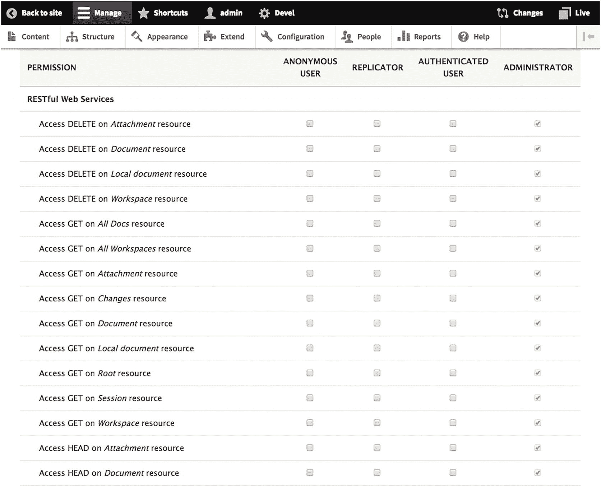

图 13-1

`RELAXed Web Services` 在 RESTful Web Services 模块功能上创建的新权限

回想一下，除非我们配置了所有 `RELAXed Web Services` 资源可用的路径，否则每个 URL 都将以 `/relaxed` 为前缀。为了演示这一点，我们可以重复第 8 章的请求，该请求在 Postman 中使用具有适当权限的用户的凭据显示欢迎消息。

为了便于演示，我们将使用基本身份验证（参见第 9 章）和管理员凭据，但您可以通过配置或模块安装使用您喜欢的任何身份验证机制。如前所述，在生产环境部署时，您需要考虑更安全的身份验证机制。我们可以通过基本身份验证（用户名 `admin`，密码 `admin`）向 `/relaxed` 发出一个 `GET` 请求，如下所示。

```
GET /relaxed HTTP/1.1
Authorization: Basic YWRtaW46YWRtaW4=
```

我们收到的响应如下所示：

```
{
"couchdb": "Welcome",
"uuid": "90a7677e8fbea8c2505ba4b9a1e1d719",
"vendor": {
"name": "Drupal",
"version": "8.5.5"
},
"version": "8.5.5"
}
```

图 13-2 也展示了这个欢迎响应。我们成功了！

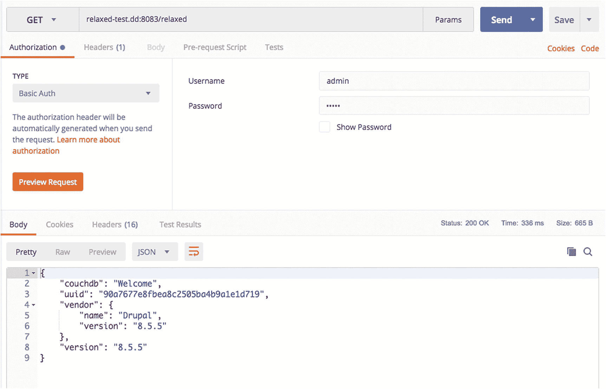

图 13-2

当我们向 `/relaxed` 路径发出 `GET` 请求时，会收到一条欢迎消息，表明该 API 符合 CouchDB 规范

### 注意

有关本章未涉及但更适用于内容暂存需求的请求信息，请参阅 [`https://www.drupal.org/docs/8/modules/relaxed-web-services/available-rest-resources-and-supported-http-methods`](https://www.drupal.org/docs/8/modules/relaxed-web-services/available-rest-resources-and-supported-http-methods) 提供的文档。

## 使用 RELAXed Web Services 检索资源

`RELAXed Web Services` 提供了多种多样的资源，每种资源都有不同的特性。在开始之前，我们需要定义可用的资源及其在 Drupal 生态系统中的含义。例如，CouchDB 数据库等同于 Drupal 的*工作区*，而 CouchDB 文档等同于 Drupal 的*实体*。

表 13-1 以非详尽列表的形式定义了一些常见的 CouchDB 术语及其 Drupal 等效项。

表 13-1

CouchDB 对象与 Drupal 等效项

| CouchDB 对象 | Drupal 等效项 |
| --- | --- |
| 数据库 | 工作区 |
| 文档 | 实体 |
| 附件 | 文件附件 |
| 本地文档 | 本地实体（复制日志实体） |

CouchDB 规范建议所有期望 JSON 响应的请求都应包含以下两个标头。^(⁵⁹) 尽管如此，在接下来的章节中描述的许多请求，即使没有这些标头，也可以在 `RELAXed Web Services` 中执行。

```
Accept: application/json
Content-Type: application/json
```

### 注意

在整个章节的示例中，假设您要么手动创建了内容，要么使用 Devel Generate 自动生成了内容，这些步骤我们将在第 7 章中进行。

有关 CouchDB 发出的响应标头的信息，请参阅 [`http://docs.couchdb.org/en/latest/api/basics.html`](http://docs.couchdb.org/en/latest/api/basics.html) 提供的 CouchDB 文档。

### 检索工作区和工作区集合

要检索 Drupal 站点上所有可用工作区的列表，即工作区集合，请向此处显示的 URL 发出 `GET` 请求。请记住，如果您在模块配置期间修改了 `/relaxed` 前缀，它将会不同。^(⁶⁰)

```
/relaxed/_all_dbs
```

根据您配置权限和工作区的方式，您会看到不同的结果。对于某些配置，您可能会看到一个仅包含单个成员 `live` 的数组，而对于其他配置，您将收到一个包含两个成员的数组，如下所示：

```
[
"live",
"stage"
]
```

在 Postman 中实际操作该请求，结果如图 13-3 所示，该请求返回了 `200 OK` 响应码。数组中的字符串代表工作区，并指示我们应使用哪些路径来访问这些工作区中的单个文档（Drupal 实体）。

### 注意

从现在开始，本章中的所有图表均为 Postman 截图，显示与正文中所示相同的响应。

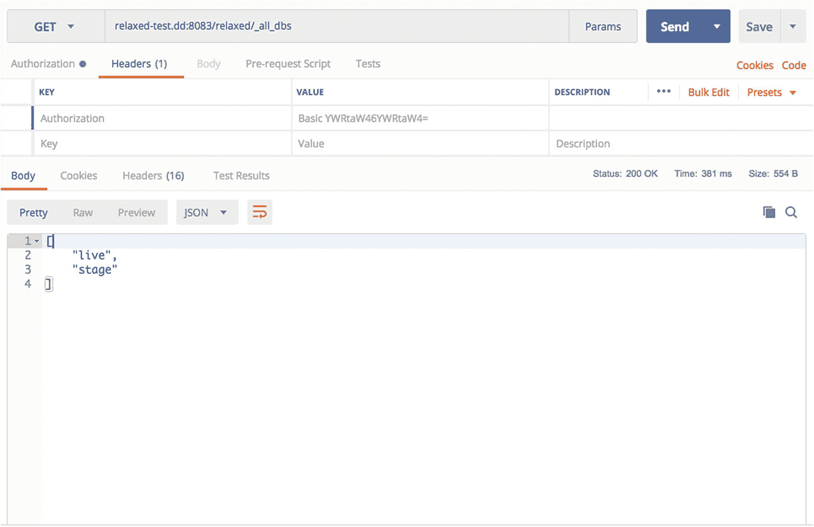

图 13-3

在此示例中，我们请求 Drupal 上所有可用工作区的集合，并收到此响应

要检索单个工作区，只需在全局工作区路径的末尾附加工作区名称（如下所示 `{workspace}`）。

```
/relaxed/{workspace}
```

在以下路径中，我们定位了 `live` 工作区。

```
/relaxed/live
```

响应将伴随 `200 OK` 响应码，如下所示，也可见图 13-4。

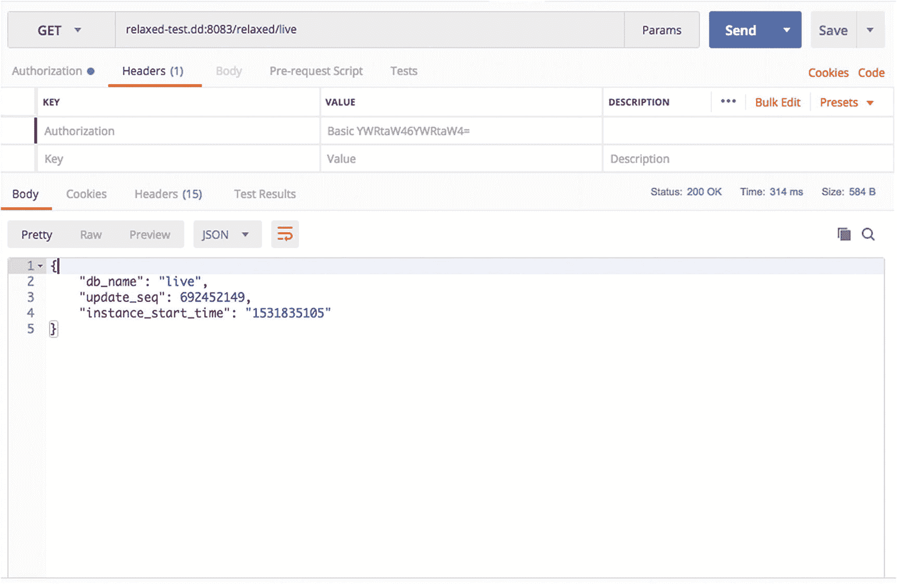

图 13-4

在此示例中，我们检索了 `live` 工作区的信息

```
{
"db_name": "live",
"update_seq": 692452149,
"instance_start_time": "1531835105"
}
```

现在我们已经获取了单个工作区，接下来我们可以在下一节中访问该工作区内包含的所有文档。

### 注意

如果您想检查某个工作区是否存在，可以改为向同一 URL 发出 `HEAD` 请求。该响应将包含有关工作区的有限信息，但这是一种轻量级的方法，用于确定工作区是否存在。

### 检索文档与文档集合

要检索指定工作区中所有实体（CouchDB 文档）的集合，请使用以下 URL 格式，其中 `{workspace}` 是包含所需内容的工作区名称。

```
/relaxed/{workspace}/_all_docs
```

例如，对于 `live` 工作区，我们可以向以下 URL 发出请求，以获取该工作区中的所有实体。

```
/relaxed/live/_all_docs
```

响应将包含 `200 OK` 状态码，内容如下所示（亦见图 13-5）。

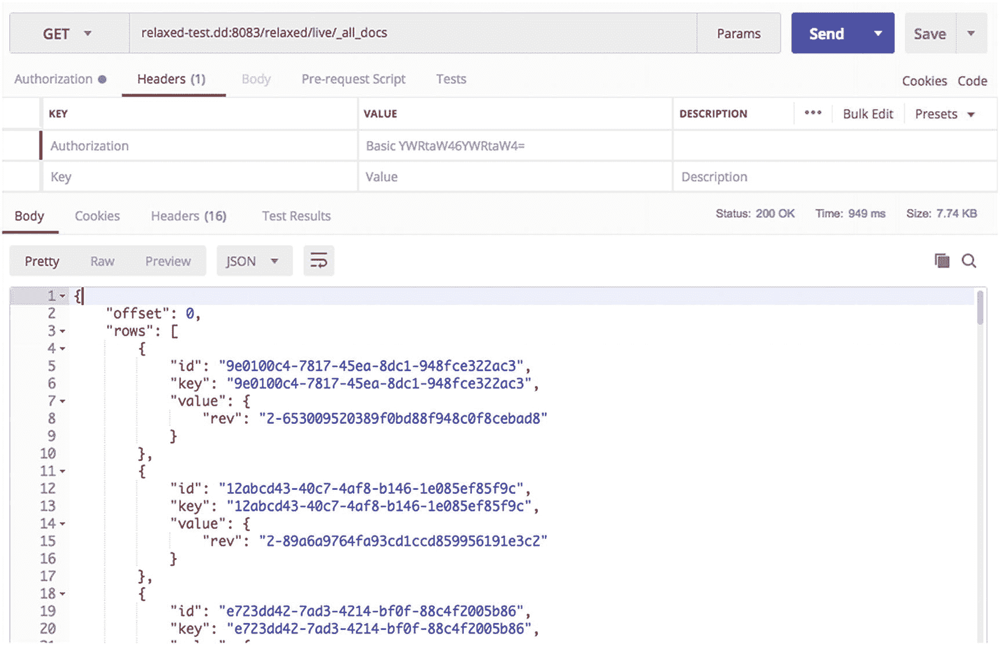

**图 13-5** 来自 RELAXed Web Services REST API 的典型实体集合（针对指定工作区）。请注意，需要额外发起请求才能深入查看数据细节。

```json
{
"offset": 0,
"rows": [
{
"id": "9e0100c4-7817-45ea-8dc1-948fce322ac3",
"key": "9e0100c4-7817-45ea-8dc1-948fce322ac3",
"value": {
"rev": "2-653009520389f0bd88f948c0f8cebad8"
}
},
{
"id": "12abcd43-40c7-4af8-b146-1e085ef85f9c",
"key": "12abcd43-40c7-4af8-b146-1e085ef85f9c",
"value": {
"rev": "2-89a6a9764fa93cd1ccd859956191e3c2"
}
}
],
"total_rows": 2
}
```

要检索单个实体，我们需要将 `_all_docs` 替换为要检索的文档（Drupal 实体）的 UUID，如下例所示，其中 `{workspace}` 是目标工作区名称，`{document_id}` 是目标文档的 UUID。

```
/relaxed/{workspace}/{document_id}
```

例如，考虑我们刚才获取的集合中标识出的一个实体。我们可以像下面这样针对该实体构建请求。注意，UUID 是我们用来定位正确实体的标识符。

```
/relaxed/live/462e86f6-0123-43a6-a71e-914d9432ab6e
```

响应将包含 `200 OK` 状态码，并返回一个包含实体特定细节的对象，例如关于实体的关键信息和存在的字段。这可以在图 13-6 和图 13-7 中看到。

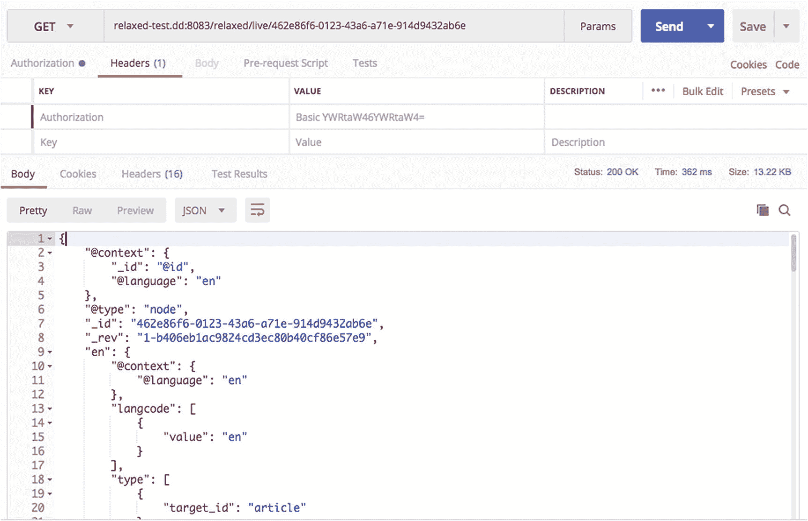

**图 13-7** 在另一个对不同 UUID 实体的请求中，我们检索到了一篇文章。

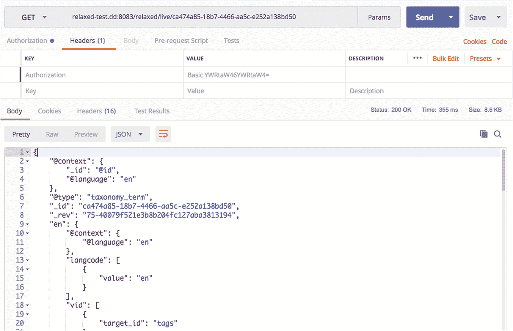

**图 13-6** 在此例中，我们获取了一个单独的分类术语及其关键信息。

### 检索文件附件

RELAXed Web Services 和 CouchDB 的一个独特特性是其对文件附件的稳健处理。对于文件附件，CouchDB 规范建议 `Accept` 头应包含文件预期的 MIME 类型（例如，JPEG 图像的 `image/jpeg`）或允许任何 MIME 类型的通配符，如下所示。如果缺少 `Accept` 头，CouchDB 默认接受任何 MIME 类型。

```
Accept: */*
```

在 RELAXed Web Services 中，针对文件附件的 `GET` 请求采用相对复杂的格式。在以下 URL 中，`{workspace}` 代表工作区名称，`{document_id}` 代表实体 UUID，`{field_name}` 代表文件附件所在的字段名称，`{delta}` 代表字段中的增量（单值字段为 `0`，多值字段为其在数组中的索引），`{file_id}` 代表文件的 UUID，`{scheme}` 代表文件的方案值，`{filename}` 代表字段的文件名值。

```
/relaxed/{workspace}/{document_id}/{field_name}/{delta}/{file_id}/{scheme}/{filename}
```

如果这看起来非常复杂，不必担心，因为所有这些信息都可以在包含文件附件的实体请求中找到。

例如，考虑上一节中我们检索到的实体。在该响应中，我们找到了以下字段对象，为简洁起见，去除了周围内容。

```json
"field_image": [
{
"entity_type_id": "file",
"target_uuid": "4f3ad958-83f7-4800-8505-0e26a06f96b7",
"alt": "Commodo ibidem pertineo sagaciter scisco.",
"title": "Aliquip inhibeo suscipit verto.",
"width": "280",
"height": "451",
"uri": "public://2018-08/generateImage_2BMzyH.jpg",
"filename": "generateImage_2BMzyH.jpg",
"filesize": "6752",
"filemime": "image/jpeg"
}
],
```

根据这个示例图片，我们可以将元素与它们在构建请求时对应的部分相匹配。表 13-2 根据给出的示例图片标识了这些元素。

**表 13-2** RELAXed Web Services 文件附件 URL 段

| 占位符 | 定义 | 示例 |
| --- | --- | --- |
| `{field_name}` | 字段名称 | `field_image` |
| `{delta}` | 值数组中的增量 | 单值字段为 `0`；多值字段为 `0` 或更高 |
| `{file_id}` | 文件 UUID | `4f3ad958-83f7-4800-8505-0e26a06f96b7` |
| `{scheme}` | URI 方案 | `public`（取自上述 `uri` 字段） |
| `{filename}` | 文件名 | `generateImage_2BMzyH.jpg` |

那么 URL 变为以下形式：

```
/relaxed/live/462e86f6-0123-43a6-a71e-914d9432ab6e/field_image/0/4f3ad958-83f7-4800-8505-0e26a06f96b7/public/generateImage_2BMzyH.jpg
```

响应将包含 `200 OK` 状态码和所需的完整图片。这可以在图 13-8 中看到。

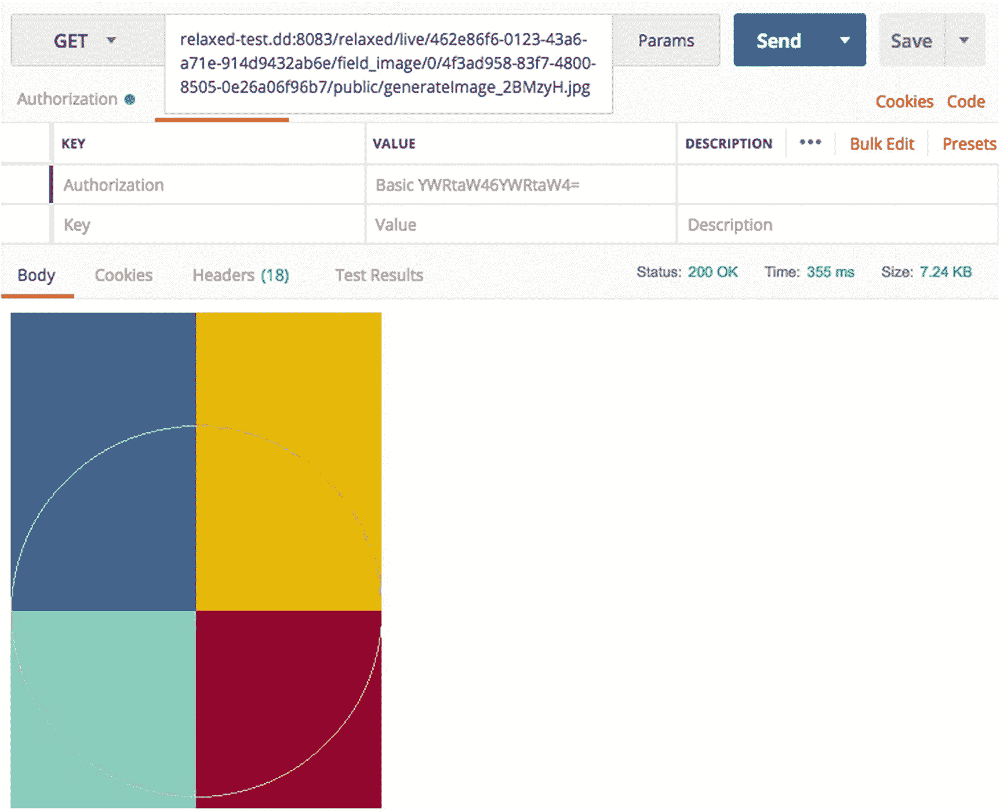

**图 13-8** 当我们对文件附件发出 `GET` 请求时，只要在构建 URL 时提供了所有正确信息，就会在响应体中接收到该图片。

### 注意

如果你想要检查某个文件附件是否存在，可以改为向同一个 URL 发出 `HEAD` 请求。响应将包含关于该文件附件的有限信息，但这是一种轻量级的确认文件附件是否存在的方法。

## 使用 RELAXed Web Services 创建和更新资源

与核心 REST（参见第 7 章）不同，RELAXed Web Services 频繁使用 `PUT` 方法。在许多情况下，特别是 CouchDB 文档（Drupal 实体）和文件附件，我们可以使用 `PUT` 来创建新资源以及更新现有资源，前提是我们在请求体中（对于文档/实体）提供了关于新实体或修改后实体的所有必要信息。因此，在本节中，我们将介绍如何使用 RELAXed Web Services 创建和更新资源。

### 创建工作区

如果你正在将“工作区”模块与 Drupal Deploy 生态系统中的其他工具结合使用，虽然可以通过 Drupal 用户界面创建工作区，但通过 RELAXed Web Services 提供的 REST API 来创建新工作区通常更有意义，特别是当你的消费端需要能够操作工作区时。

要创建一个新工作区，我们只需向以下 URL 发出 `PUT` 请求，其中 `{workspace}` 代表我们希望创建的新工作区（CouchDB 数据库）。

```
/relaxed/{workspace}
```

例如，如果你想在 `stage` 和 `live` 之外再创建一个名为 `draft` 的工作区，你可以通过向以下 URL 发出 `PUT` 请求来实现。

```
/relaxed/draft
```

RELAXed Web Services 中的全部 `PUT` 请求都需要一个 `Content-Type` 请求头。我们可以使用 `application/json` 来指明。

```
PUT /relaxed/draft HTTP/1.1
Authorization: Basic YWRtaW46YWRtaW4=
Content-Type: application/json
```

返回的响应码是 `201 Created`，并附带一条简短的确认消息，如图 13-9 所示。

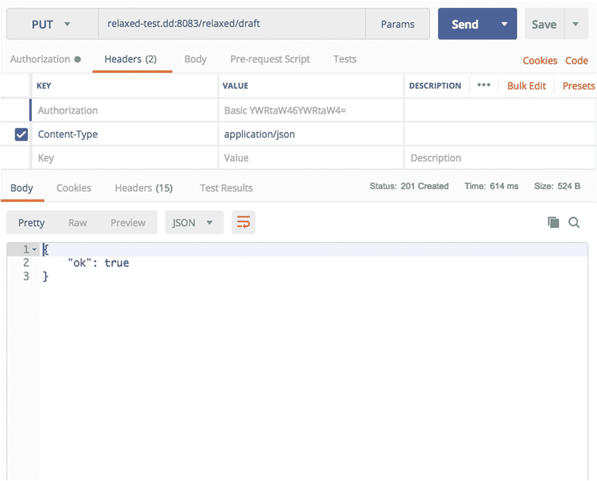

图 13-9

当我们向包含新工作区所需名称的 URL 发出 `PUT` 请求时，会收到一个带有 `201 Created` 响应码的响应。

```
{
"ok": true
}
```

果然，如果我们像上一节那样向 `/relaxed/_all_dbs` 发出 `GET` 请求，就能在数组中看到我们的新工作区。这也如图 13-10 所示。

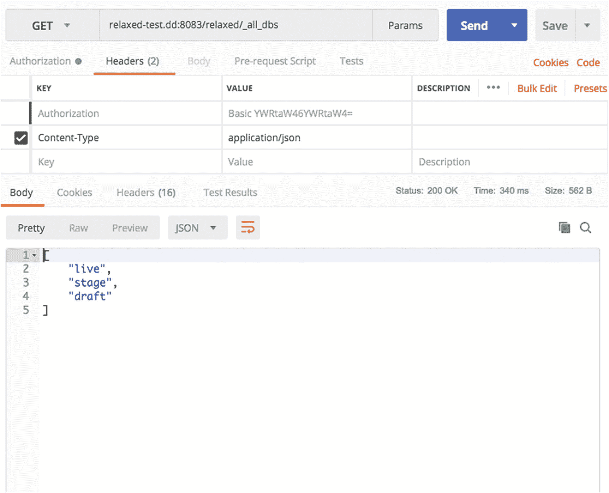

图 13-10

在我们之前的 `PUT` 请求之后，当我们向 `/relaxed/_all_dbs` 发出 `GET` 请求时，会在数组中看到我们新创建的工作区。

```
[
"live",
"stage",
"draft"
]
```

### 注意

根据 CouchDB 规范，所有工作区名称必须以小写字母（`a-z`）开头，并且只能包含小写字母（`a-z`）、数字（`0-9`）或某些特殊字符（`_`、`$`、`(`、`)`、`+`、`-`和`/`）。也可以将这些规则表述为正则表达式：`^[a-z][a-z0-9_$()+/-]*$`。^(⁶¹)

### 创建文档

使用 RELAXed Web Services 有两种创建新文档（Drupal 实体）的方法。第一种是向 `/relaxed/{workspace}` 发出 `POST` 请求，它会根据请求正文在工作区中创建一个文档。第二种方法是向 `/relaxed/{workspace}/{document_id}` 发出 `PUT` 请求，其中 `{document_id}` 是我们希望创建的实体所具有的 UUID。

更新单个文档（Drupal 实体）只有一种方法，即向 `/relaxed/{workspace}/{document_id}` 发出 `PUT` 请求，其中 `{document_id}` 是现有实体的 UUID。简而言之，当我们向一个现有实体发出 `PUT` 请求时，该实体将使用请求正文进行更新；当实体不存在时，则会使用请求正文创建该实体。

因为这是创建 Drupal 实体最直接的方式，所以我们先从在工作区 URL 上使用 `POST` 的方法开始。考虑以下示例请求。

```
POST /relaxed/live HTTP/1.1
Accept: application/json
Content-Type: application/json
{
"@context": {
"_id": "@id",
"@language": "en"
},
"@type": "node",
"_id": "b6cea743-ba86-49b0-81ac-03ec728f91c4",
"en": {
"@context": {
"@language": "en"
},
"langcode": [
{
"value": "en"
}
],
"type": [
{
"target_id": "article"
}
],
"title": [
{
"value": "REST and RELAXation"
}
],
"body": [
{
"value": "This article brought to you by a request to RELAXed Web Services!"
}
]
}
}
```

请注意，在此示例中，我们定义了一个 UUID，Drupal 将使用它来创建新实体。如果你省略了 `_id` 键，Drupal 将为该实体生成自己的 UUID。

当我们发出此请求时，会收到一个对象作为响应，该对象确认文章已创建，并带有 `201 Created` 响应码。你可以在图 13-11 中看到这一点。

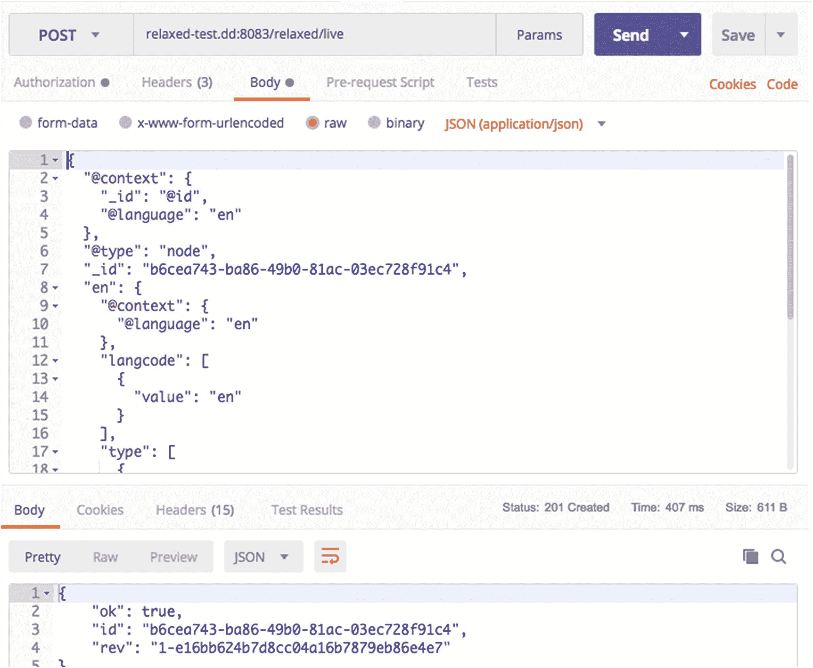

图 13-11

当我们向一个工作区资源发出 `POST` 请求，且请求正文包含所需内容时，我们会收到 `201 Created` 响应码。

```
{
"ok": true,
"id": "b6cea743-ba86-49b0-81ac-03ec728f91c4",
"rev": "1-e16bb624b7d8cc04a16b879eb86e4e7"
}
```

果然，当我们向 `/relaxed/live/b6cea743-ba86-49b0-81ac-03ec728f91c4` 发出 `GET` 请求时，能够检索到我们刚刚创建的实体，如图 13-12 所示。

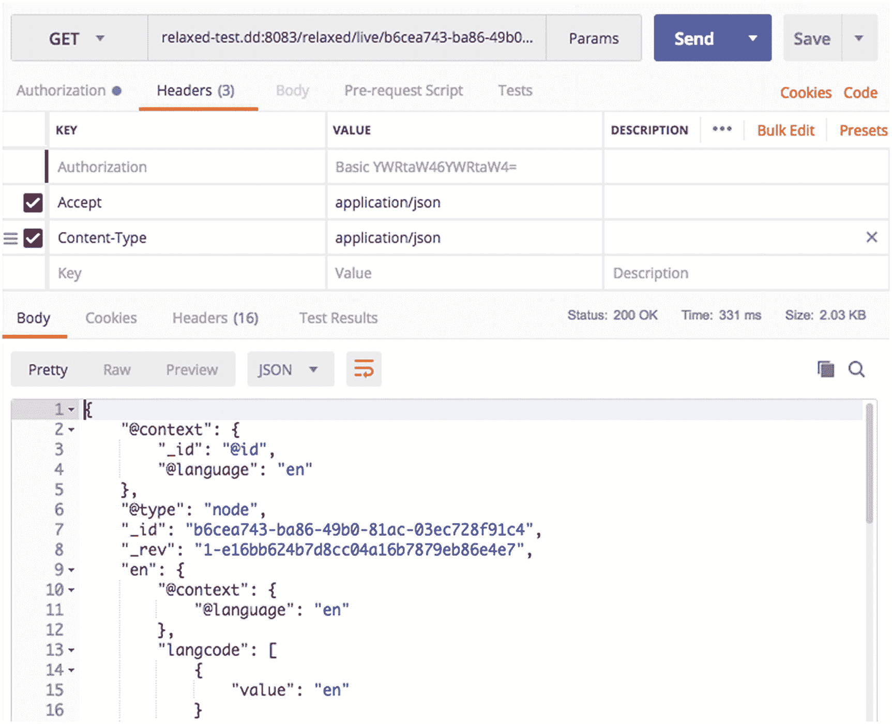

图 13-12

当我们在 `GET` 请求中提供刚创建的实体的 UUID 时，可以验证该文章是否已创建。

通过 `PUT` 创建实体的过程与通过 `POST` 创建实体的过程非常相似。我们不是将 UUID 放在请求正文中，或者让 Drupal 为我们生成一个新的 UUID，而是将 UUID 放在请求的 URL 中。这意味着无法使用 `PUT` 方法将 UUID 生成委托给 Drupal。请注意，URL 中提供的 UUID 不得是已存在的 UUID。

在此示例请求中，我们提供与前一个示例相同的请求正文，并使用一个新的 UUID。请注意，URL 中的 UUID 和请求正文中的 UUID 必须匹配。

```
PUT /relaxed/live/0b36080d-a3ed-48c0-9863-a5726c687166 HTTP/1.1
Accept: application/json
Content-Type: application/json
{
"@context": {
"_id": "@id",
"@language": "en"
},
"@type": "node",
"_id": "0b36080d-a3ed-48c0-9863-a5726c687166",
"en": {
"@context": {
"@language": "en"
},
"langcode": [
{
"value": "en"
}
],
"type": [
{
"target_id": "article"
}
],
"title": [
{
"value": "Feeling RELAXed"
}
],
"body": [
{
"value": "It's possible to achieve a sense of contentment while using RELAXed Web Services ."
}
]
}
}
```

Drupal 以 `201 Created` 响应码作为回应，以反映文章已创建，如图 13-13 所示。

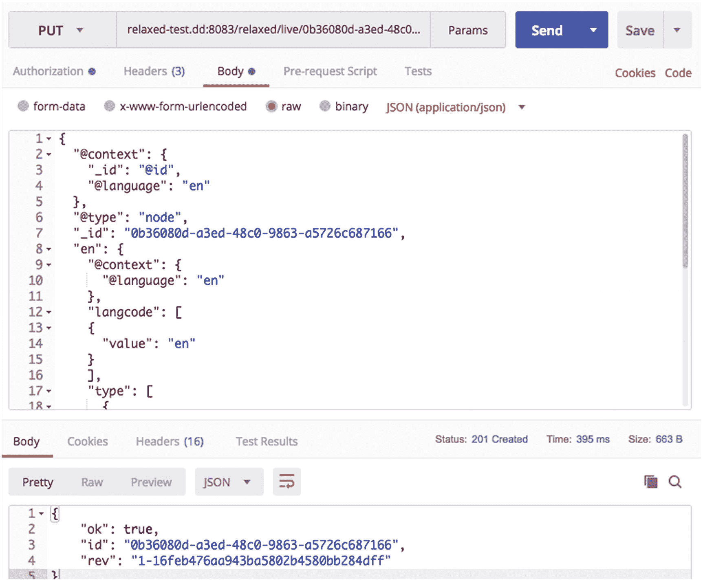

图 13-13

在此示例中，我们使用 `PUT` 创建了一篇文章，方法是提供一个 UUID，让 Drupal 使用它来创建实体。

```
{
"ok": true,
"id": "0b36080d-a3ed-48c0-9863-a5726c687166",
"rev": "1-16feb476aa943ba5802b4580bb284dff"
}
```

### 更新文档

更新单个文档（Drupal 实体）只有一种方法，即向 `/relaxed/{workspace}/{document_id}` 发起 `PUT` 请求，其中 `{document_id}` 是现有实体的 UUID。简而言之，当我们向现有实体发出 `PUT` 请求时，该实体将使用请求体进行更新；当目标实体不存在时，将使用请求体创建该实体。

要更新同一篇文章，我们只需提供现有实体的 UUID 并提供一个全新的请求体即可。请注意，这仅在 UUID 已存在时才会更新实体；如果不存在，Drupal 将使用提供的 UUID 创建一个实体。

最重要的是，为了向 CouchDB 标识我们正在执行更新操作，我们需要提供一个 `_rev` 标识符，指明我们要更新的版本；否则将收到 `409 Conflict` 响应码。回顾一下我们创建文章时 RELAXed Web Services 发出的响应，您可以在其中找到版本标识符（例如 `1-16feb476aa943ba5802b4580bb284dff`）。请注意此处请求体中 `_id` 键下方的附加 `_rev` 键。

```
PUT /relaxed/live/0b36080d-a3ed-48c0-9863-a5726c687166 HTTP/1.1
Accept: application/json
Content-Type: application/json
{
"@context": {
"_id": "@id",
"@language": "en"
},
"@type": "node",
"_id": "0b36080d-a3ed-48c0-9863-a5726c687166",
"_rev": "1-16feb476aa943ba5802b4580bb284dff",
"en": {
"@context": {
"@language": "en"
},
"langcode": [
{
"value": "en"
}
],
"type": [
{
"target_id": "article"
}
],
"title": [
{
"value": "Are you well-RESTed and RELAXed yet?"
}
],
"body": [
{
"value": "As you can see this article has changed a great deal, so we need to make sure that RELAXed Web Services knows about that ."
}
]
}
}
```

`RELAXed Web Services` 将返回给我们一个 `201 Created` 响应码（如果你习惯了核心 `REST`，这个响应码可能会有点令人困惑——它表示创建了一个新版本）以及一个新的版本标识符，下次需要再次更新该实体时应使用这个新标识符。你可以在图 13-14 中看到这个结果。

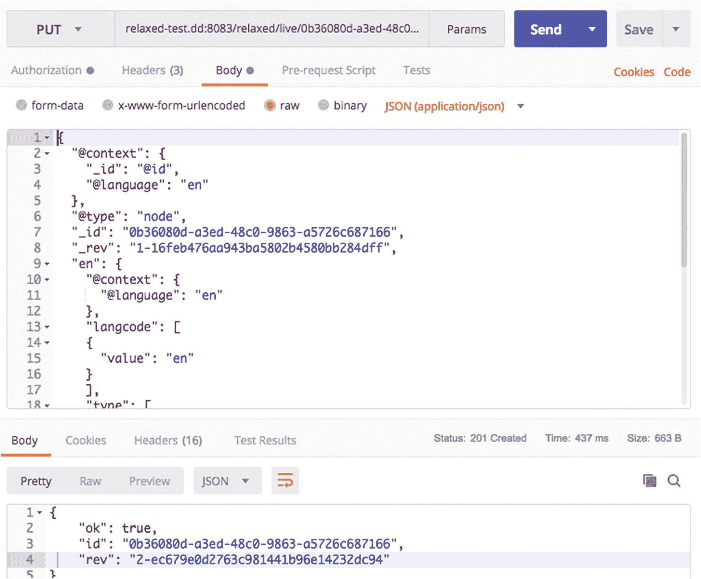

图 13-14

当我们对实体执行更新时，`RELAXed Web Services` 会提供一个新的版本标识符

```
{
"ok": true,
"id": "0b36080d-a3ed-48c0-9863-a5726c687166",
"rev": "2-ec679e0d2763c981441b96e14232dc94"
}
```

再次确认，向该文章的 `UUID` 发起 `GET` 请求可以证明它已成功更新，如图 13-15 所示。

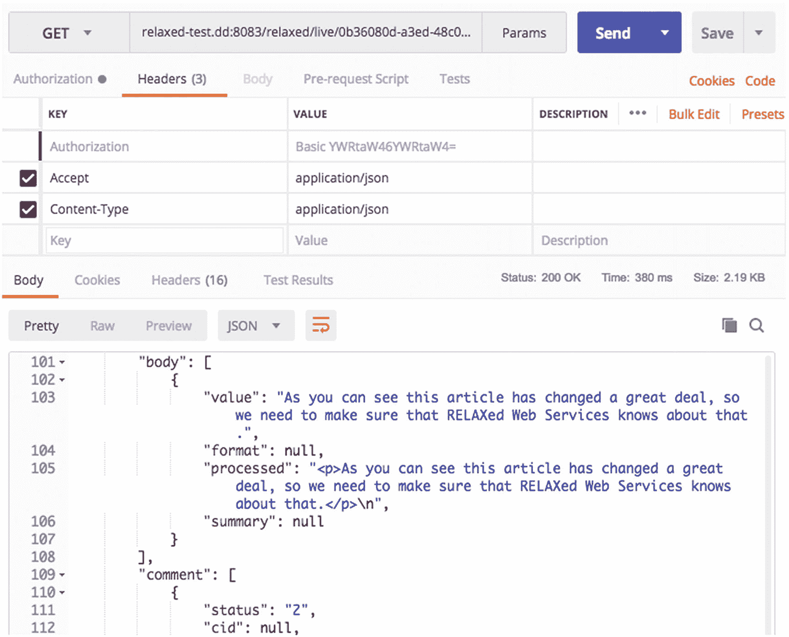

图 13-15

当我们再次检索同一个实体时，我们可以看到它已经用我们的新内容更新了

### 批量创建和更新文档

也可以使用 `POST` 请求向以下 `URL` 批量创建和更新文档，其中 `{workspace}` 代表所需的工作区（`CouchDB` 数据库）。

```
/relaxed/{workspace}/_bulk_docs
```

在此请求中，我们需要熟悉的 `Accept` 和 `Content-Type` 请求头，并且请求体需要包含一个 `docs` 数组，该数组由代表我们想要创建的每个实体的文档对象组成。

考虑以下示例请求，其中我们旨在创建两篇描述 2018 年两部热门电影的文章。

```
POST /relaxed/live/_bulk_docs HTTP/1.1
Accept: application/json
Content-Type: application/json
{
"docs": [
{
"@context": {
"_id": "@id",
"@language": "en"
},
"@type": "node",
"_id": "be3bdff5-4c20-4996-a158-b24b3b8a27d6",
"en": {
"@context": { "@language": "en" },
"langcode": [ { "value": "en" } ],
"type": [ { "target_id": "article" } ],
"title": [ { "value": "Ready Player One" } ],
"body": [ { "value": "A movie directed by Steven Spielberg." } ]
}
},
{
"@context": {
"_id": "@id",
"@language": "en"
},
"@type": "node",
"_id": "8e0a2aba-0027-43b4-a738-48a0b35837c9",
"en": {
"@context": { "@language": "en" },
"langcode": [ { "value": "en" } ],
"type": [ { "target_id": "article" } ],
"title": [ { "value": "A Wrinkle in Time" } ],
"body": [ { "value": "A movie directed by Ava DuVernay." } ]
}
}
]
}
```

提交此请求将返回一个 `201 Created` 响应码以及一个响应体，其中包含对我们现已分配的 `UUID` 和版本标识符的确认信息，我们可以在需要执行批量更新时定位这些标识符，如图 13-16 所示。

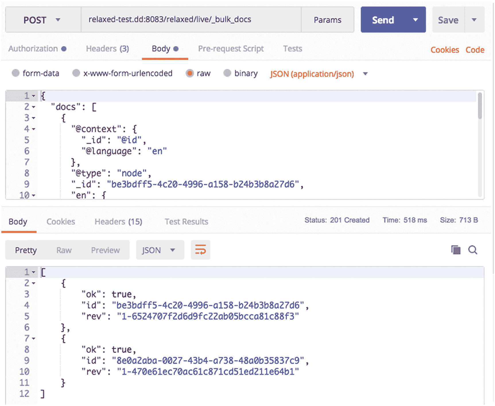

图 13-16

在本例中，因为我们使用批量创建创建了两篇文章，所以 `RELAXed Web Services` 返回一个包含两个对象的数组，反映了我们新创建的实体

```
[
{
"ok": true,
"id": "be3bdff5-4c20-4996-a158-b24b3b8a27d6",
"rev": "1-6524707f2d6d9fc22ab05bcca81c88f3"
},
{
"ok": true,
"id": "8e0a2aba-0027-43b4-a738-48a0b35837c9",
"rev": "1-470e61ec70ac61c871cd51ed211e64b1"
}
]
```

现在，要批量更新这两篇文章，我们只需在每个文档对象中提供版本标识符即可。考虑以下示例。请特别注意 `_id` 键下方新增的 `_rev` 键，这是我们从前一个响应中获得的信息。

```
POST /relaxed/live/_bulk_docs HTTP/1.1
Accept: application/json
Content-Type: application/json
{
"docs": [
{
"@context": {
"_id": "@id",
"@language": "en"
},
"@type": "node",
"_id": "be3bdff5-4c20-4996-a158-b24b3b8a27d6",
"_rev": "1-6524707f2d6d9fc22ab05bcca81c88f3",
"en": {
"@context": { "@language": "en" },
"langcode": [ { "value": "en" } ],
"type": [ { "target_id": "article" } ],
"title": [ { "value": "Ready Player One (2018)" } ],
"body": [ { "value": "Directed by Steven Spielberg, this film takes place in the city of Columbus and a virtual world called the Oasis." } ]
}
},
{
"@context": {
"_id": "@id",
"@language": "en"
},
"@type": "node",
"_id": "8e0a2aba-0027-43b4-a738-48a0b35837c9",
"_rev": "1-470e61ec70ac61c871cd51ed211e64b1",
"en": {
"@context": { "@language": "en" },
"langcode": [ { "value": "en" } ],
"type": [ { "target_id": "article" } ],
"title": [ { "value": "A Wrinkle in Time (2018)" } ],
"body": [ { "value": "Directed by Ava DuVernay, this film is based on the seminal science fiction work by Madeleine L'Engle." } ]
}
}
]
}
```

通过响应中的 `201 Created` 响应码和响应体中的新版本标识符，我们知道我们的文章已更新，反映了新的标题和正文。如图 13-17 所示。

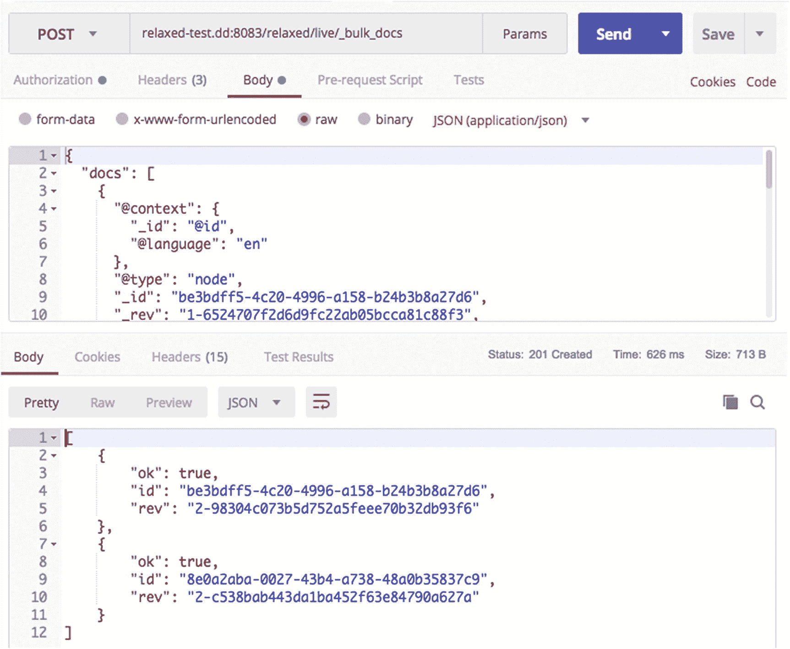

图 13-17

我们获得了新的版本标识符，将来可以用于对这些文档（Drupal 实体）执行另一次批量更新

```
[
{
"ok": true,
"id": "be3bdff5-4c20-4996-a158-b24b3b8a27d6",
"rev": "2-98304c073b5d752a5feee70b32db93f6"
},
{
"ok": true,
"id": "8e0a2aba-0027-43b4-a738-48a0b35837c9",
"rev": "2-c538bab443da1ba452f63e84790a627a"
}
]
```

### 注意

有关超越本书范围的创建和更新资源的更多示例，请参阅 Drupal.org 上提供的 RELAXed Web Services 文档：[`https://www.drupal.org/docs/8/modules/relaxed-web-services/available-rest-resources-and-supported-http-methods`](https://www.drupal.org/docs/8/modules/relaxed-web-services/available-rest-resources-and-supported-http-methods)。

### 使用 RELAXed Web Services 删除资源

我们对 RELAXed Web Services 的最后需求涉及从 Drupal 服务器删除工作区和实体。幸运的是，与核心 REST 和 JSON API 一样，此过程是所有方法中最直接的。由于每个请求的响应体都将为空，我们只需要 `Accept` 头部（在撰写本文时，即使我们不提供此头部，Drupal 也会执行删除操作）。

```
Accept: application/json
```

### 删除工作区

要删除工作区，我们需要对相关工作区的 URL 发起一个 `DELETE` 请求。例如，我们可以通过以下请求删除之前创建的工作区。

```
DELETE /relaxed/draft HTTP/1.1
Authorization: Basic YWRtaW46YWRtaW4=
Accept: application/json
```

如图 13-18 所示，会出现一个确认对象，确认工作区已被删除，并带有 `200 OK` 响应状态码。如果我们现在对 URL `/relaxed/draft` 发起 `GET` 请求，将会收到 `404 Not Found` 错误。

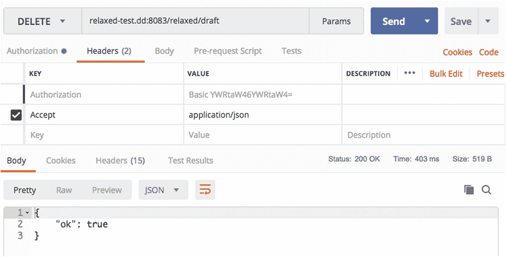

图 13-18

成功删除会返回 `200 OK` 响应状态码和一个确认对象，表明我们的实体已被删除

```
{
"ok": true
}
```

### 删除文档

要删除文档（Drupal 实体），请对文档所在的 URL 发起请求。在此示例中，我们正在删除之前章节中创建的 *头号玩家* 文章。

```
DELETE /relaxed/live/be3bdff5-4c20-4996-a158-b24b3b8a27d6 HTTP/1.1
Authorization: Basic YWRtaW46YWRtaW4=
Accept: application/json
```

文档删除也会返回一个 `200 OK` 响应状态码和一个与上一节类似的确认对象。

### 删除文件附件

要删除文件附件，请对文件附件所在的 URL 发起请求。在此示例中，我们正在删除之前在章节中检索到的生成的图片。

```
DELETE /relaxed/live/462e86f6-0123-43a6-a71e-914d9432ab6e/field_image/0/4f3ad958-83f7-4800-8505-0e26a06f96b7/public/generateImage_2BMzyH.jpg HTTP/1.1
Authorization: Basic YWRtaW46YWRtaW4=
Accept: application/json
```

文件附件删除也会返回一个 `200 OK` 响应状态码和一个确认对象，其中包含相关实体的 UUID 和修订标识符。

```
{
"ok": true,
"id": "462e86f6-0123-43a6-a71e-914d9432ab6e",
"rev": "2-e1dfe8a2e4f73bd2026988c921abb3ea"
}
```

### 结论

在本章中，我们探讨了使用 Drupal 中的 RELAXed Web Services 模块（它是 CouchDB 规范的一种实现）进行的 CRUD 操作。尽管许多架构师会选择将 RELAXed Web Services 与 Drupal Deploy 生态系统中的其他解决方案结合使用，但这些章节证明，即使没有 Drupal Deploy 提供的附加内容暂存功能，消费者应用程序的开发人员也可以从强大的 API 中受益。

在下一章中，我们将完全转变方向，将注意力集中在 GraphQL 规范及其在 Drupal 中的实现上。在创建、检索、更新和删除 Drupal 内容时，这种方法需要一种全新的、非 RESTful 的方式。通过 GraphQL，我们将完成对更广泛 Drupal 生态系统中主要贡献的 Web 服务解决方案的巡览。

脚注 1   2   3