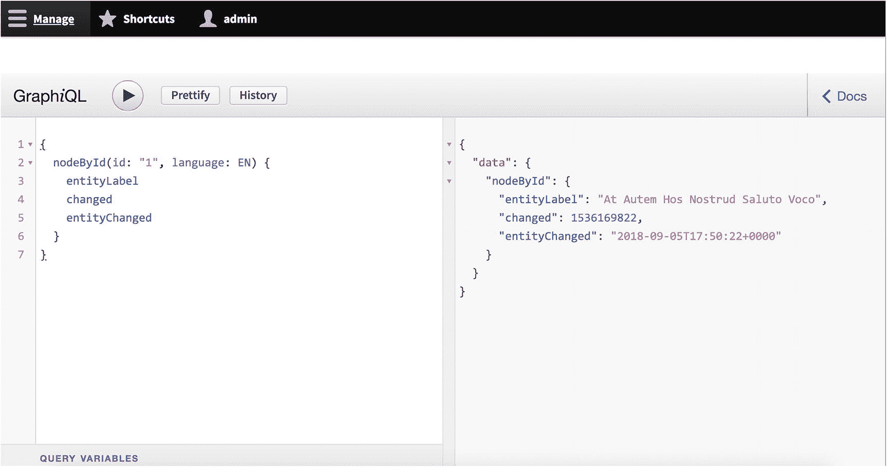
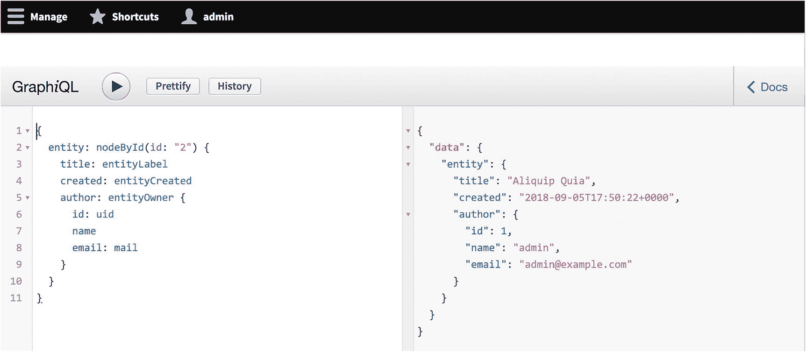
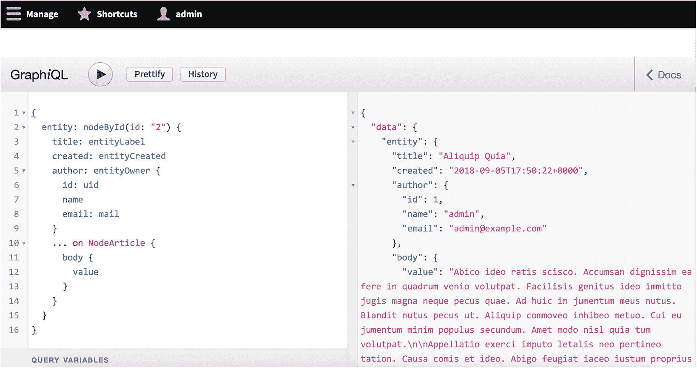
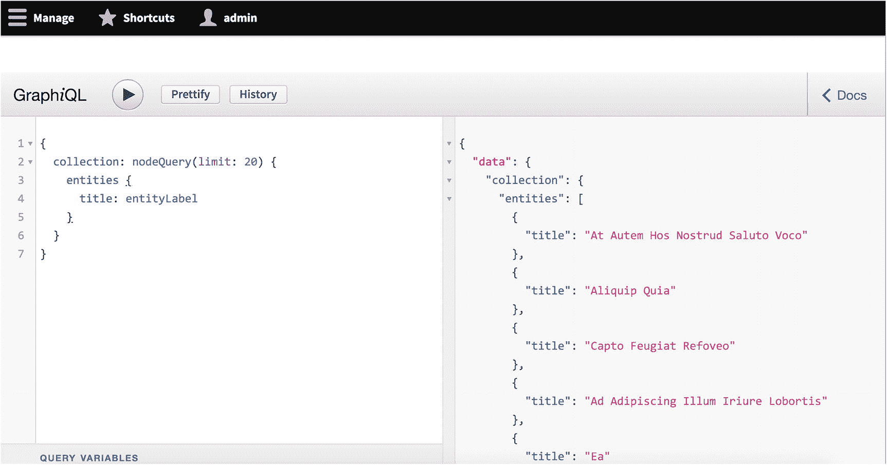
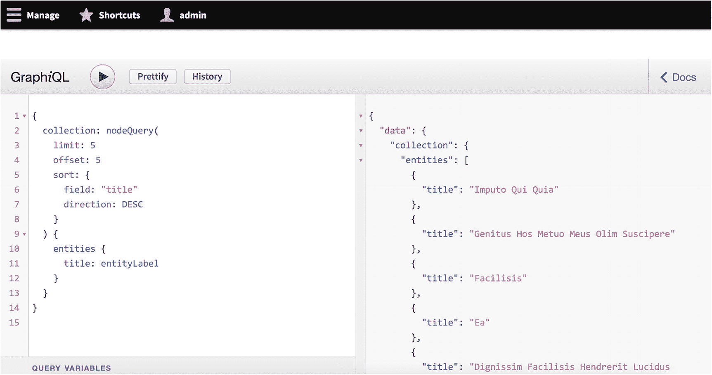
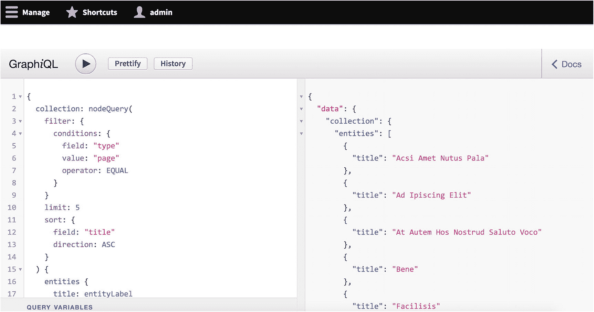
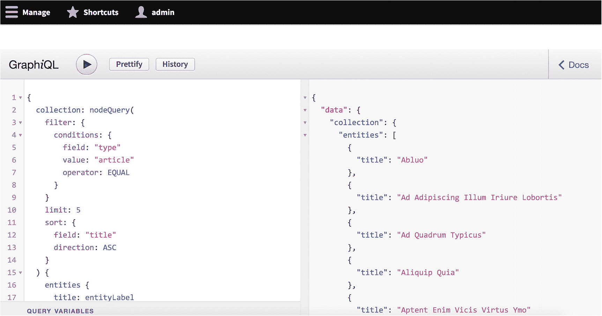
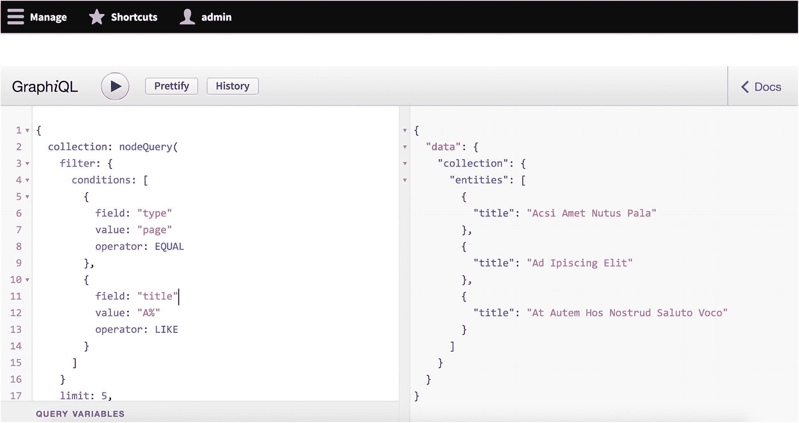
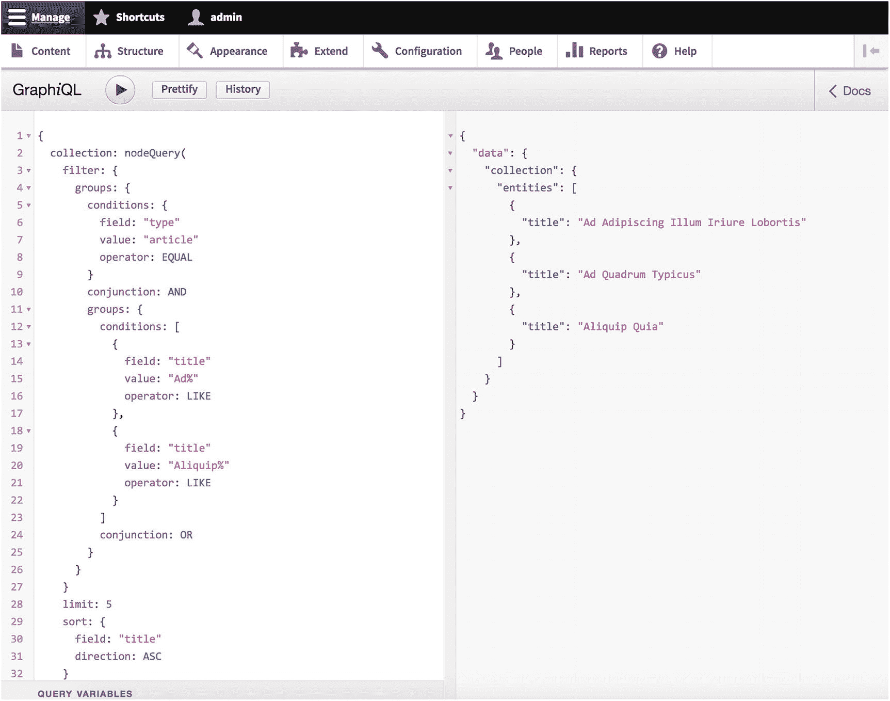
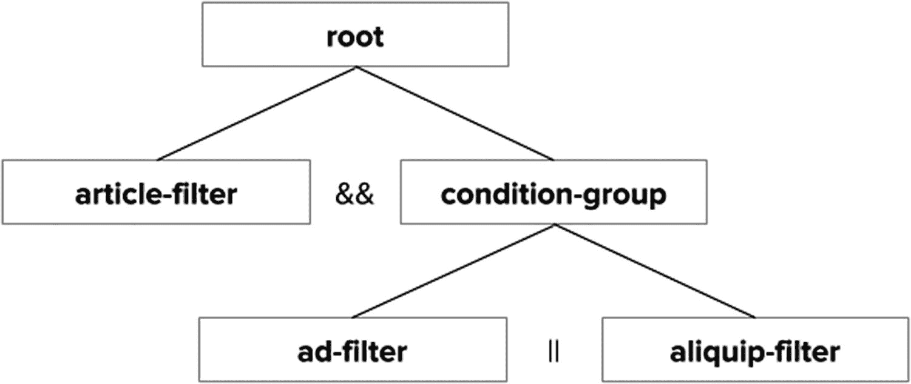

# 14. Drupal 中的 GraphQL

GraphQL 是一种快速成熟的解决方案，可作为 Drupal 8 中的 Web 服务使用。尽管它仍在大力开发中，但该模块的许多方面已经稳定，许多生产站点也在 Drupal 上利用 GraphQL。正如我们在第 8 章中所见，GraphQL 作为一种 Web 服务特别强大，因为它专注于定制化的响应和随时可用的自省层。

此外，安装后，GraphQL 提供了一个名为 GraphiQL 的内置调试工具和用户界面，允许我们实时发出查询并检查响应，该界面位于 `/graphql/explorer`。在本章中，由于其实用性，我们将广泛使用这个调试器。要向 Drupal 的 GraphQL 实现发出请求，我们只需对 URL `/graphql` 发起一个 `GET` 请求，并附带查询参数 `?query=`，后跟我们的查询（格式化为 URL 编码的字符串）。

在本章中，我们通过 GraphQL 检索内容实体，并通过 Drupal 的 GraphQL 实现演示其一些特性。GraphQL 模块添加了多种权限，允许不同角色的用户执行任意查询、绕过字段安全性、访问 GraphiQL 界面等。默认情况下，这些权限仅分配给管理员。

## 使用 GraphQL 检索实体

与 RELAXed Web Services 和 JSON API 等其他模块不同，GraphQL 模块提供了一组更具体、更通用性较弱的 GraphQL 字段，这些字段映射到 Drupal 中的对应项。例如，尽管 RELAXed Web Services 和 JSON API 不区分节点和用户，而是将它们视为通用实体，但 GraphQL 模块却分别处理它们。

### 注意

GraphiQL 提供了几个方便的键盘快捷键来访问某些功能。要美化您插入的查询，请使用键盘快捷键 `Shift+Ctrl+P`。要运行查询，请使用 `Ctrl+Enter`。在提供字段时，要访问自动完成下拉菜单，请使用 `Ctrl+Space`。


### 检索单个实体

要检索单个节点实体，我们可以发出以下匿名查询。`nodeById` 字段接受两个参数：`id`，即节点的标识符，应以字符串形式提供；以及 `language`，即节点的语言，应以 `LanguageId`（一个 GraphQL 模块提供的类型，要求语言代码为大写字母且不带引号；例如 `EN`、`FR`）形式提供。`language` 参数默认为 `null`，因此是可选的。

```
{
  nodeById(id: "1", language: EN) {
    title
  }
}
```

正如我们所料，上述查询会生成以下响应。请注意，在此场景中，我们使用的是通过 Devel Generate 生成的内容（参见第 7 章）。

```
{
  "data": {
    "nodeById": {
      "title": "At Autem Hos Nostrud Saluto Voco"
    }
  }
}
```

如本例所示，我们可以深入节点以访问其中包含的字段，例如 `title`。尽管这些字段映射到它们对应的 Drupal 字段（正如我们在之前核心 REST 和 JSON API 的响应中看到的，例如 `status`、`changed`、`created` 等），但 GraphQL 模块也提供预格式化的字段，例如 `entityLabel`。考虑以下查询。

```
{
  nodeById(id: "1") {
    entityLabel
    changed
    entityChanged
  }
}
```

此查询会生成以下响应，如图 14-1 所示。如您所见，`changed` 返回的是 Unix 时间戳，这与我们目前为止介绍的其他 API 类似，要求我们在消费端处理日期；而 `entityChanged` 则根据 Drupal 的默认日期格式化器为我们提供了日期。这是一个强大的结果，意味着我们可以同时利用来自 Drupal 的原始输出和格式化输出。



**图 14-1** GraphQL 模块允许我们指定需要来自 Drupal 的原始输出还是格式化输出。在此例中，`entityChanged` 已经过 Drupal 的日期格式化器处理。

```
{
  "data": {
    "nodeById": {
      "entityLabel": "At Autem Hos Nostrud Saluto Voco",
      "changed": 1536169822,
      "entityChanged": "2018-09-05T17:50:22+0000"
    }
  }
}
```

用户的检索操作方式大致相同。考虑以下示例，这是一个检索用户实体的查询，其字段遵循 GraphQL 模块中定义的 `User` 类型。

```
{
  userById(id: "2") {
    uid
    name
    mail
  }
}
```

此查询会生成以下响应。

```
{
  "data": {
    "userById": {
      "uid": 2,
      "name": "chifrothaw",
      "mail": "chifrothaw@example.com"
    }
  }
}
```

我们还可以检索实体内部的关系。考虑以下示例查询，它获取一个节点实体及其作者。在此查询中，我们在第一级包含遵循 `Node` 类型的字段，但由于 `entityOwner` 的类型是 `User`，我们必须使用 `User` 类型定义中的字段。我们还使用了别名（参见第 8 章）来改善构建我们消费端的开发人员的体验。

```
{
  entity: nodeById(id: "2") {
    title: entityLabel
    created: entityCreated
    author: entityOwner {
      id: uid
      name
      email: mail
    }
  }
}
```

结果如下所示，如图 14-2 所示。



**图 14-2** 在此示例中，除了包含关于创建此实体的用户的信息外，我们还使用别名来改善消费端开发人员的体验。

```
{
  "data": {
    "entity": {
      "title": "Aliquip Quia",
      "created": "2018-09-05T17:50:22+0000",
      "author": {
        "id": 1,
        "name": "admin",
        "email": "admin@example.com"
      }
    }
  }
}
```

您可能已经注意到，虽然我们获得了关于实体的某些关键信息（例如何时创建或更改、由谁创建以及叫什么名称），但我们缺少其他信息，例如内容实体的实际主体。这是因为，虽然*主体*字段在 Article 和 Page 类型的节点中是必需的，但在 Drupal 的内容建模系统中，完全可以不包含*主体*字段。

每当我们创建新的内容类型时，正如您可能从我们对 JSON API 的学习中回忆起的，该类型的所有内容实体都会被分配一个包。在 Drupal 对 GraphQL 的实现中，对于统管所有节点（不论其包）的总体 `Node` 类型，以及包含包特定信息（如*主体*字段）的独立 `NodeArticle` 和 `NodePage` 类型，两者之间存在明显区别。

考虑以下示例。在此场景中，我们使用一个片段来指定：只有当涉及的节点是文章时，才应检索其主体。

```
{
  entity: nodeById(id: "2") {
    title: entityLabel
    created: entityCreated
    author: entityOwner {
      id: uid
      name
      email: mail
    }
    ...body
  }
}

fragment body on NodeArticle {
  body {
    value
  }
}
```

回想一下，我们也可以内联此片段，以避免重复编写字段名称。

```
{
  entity: nodeById(id: "2") {
    title: entityLabel
    created: entityCreated
    author: entityOwner {
      id: uid
      name
      email: mail
    }
    ... on NodeArticle {
      body {
        value
      }
    }
  }
}
```

此查询的结果如下，如图 14-3 所示。



**图 14-3** 我们可以根据所针对的特定包的值来内联一个片段。在此例中，只有当实体是文章时，主体才会包含在响应中。

```
{
  "data": {
    "entity": {
      "title": "Aliquip Quia",
      "created": "2018-09-05T17:50:22+0000",
      "author": {
        "id": 1,
        "name": "admin",
        "email": "admin@example.com"
      },
      "body": {
        "value": "Abico ideo ratis scisco. Accumsan dignissim ea fere in quadrum venio volutpat. Facilisis genitus ideo immitto jugis magna neque pecus quae. Ad huic in jumentum meus nutus. Blandit nutus pecus ut. Aliquip commoveo inhibeo metuo."
      }
    }
  }
}
```

### 注意
Drupal 对 GraphQL 的实现提供了多种用于检索单个实体的查询，远不止本概述的范围，包括 `blockContentById`（自定义块内容）、`commentById`（评论）、`contactMessageById`（联系表单提交）、`fileById`（文件实体）、`shortcutById`（快捷方式）、`taxonomyTermById`（分类术语）和 `nodeRevisionById`（节点修订）。GraphiQL 的自动完成和文档功能可以帮助您探索这些查询中有哪些字段可用。


### 获取实体集合

除了通过标识符检索单个实体的查询外，GraphQL 模块还提供了集合查询，可以对一系列实体执行任意操作，例如 `nodeQuery` 和 `userQuery`。请看以下示例。

```
{
  collection: nodeQuery(limit: 20) {
    entities {
      title: entityLabel
    }
  }
}
```

该查询将返回包含 20 个实体的集合，如图 14-4 所示。



图 14-4

在此查询中，我们检索了一个实体集合，但将响应限制为 20 个实体。

在 GraphQL 的 Drupal 实现中，`nodeQuery` 接受几个参数：`limit`，表示响应中包含的实体数量（默认为 10）；`offset`，表示在响应中包含某个实体之前要跳过的实体数量（默认为 0）；`sort`，指定实体的排序方式；`filter`，提供任意过滤器；以及 `revisions`，指定是否应包含修订版本。`revisions` 参数的默认值为 `DEFAULT`，表示加载当前修订版本；`ALL` 加载所有修订版本，`LATEST` 仅加载最新修订版本（所有值均不带引号，因为它们遵循各自的类型定义）。

为了同时检索这些实体的正文，我们可以使用以下查询，该查询深入到了每个包（bundle）的具体实现。在以下示例中，我们仅包含文章的正文。

```
{
  collection: nodeQuery(limit: 20) {
    entities {
      title: entityLabel
      ... on NodeArticle {
        body {
          value
        }
      }
    }
  }
}
```

截至目前，GraphQL 规范中还没有办法在单个片段中包含多种类型。这意味着要同时包含页面实体的正文，我们必须创建另一个引用 `NodePage` 的片段，如下面的示例查询所示。

```
{
  collection: nodeQuery(limit: 20) {
    entities {
      title: entityLabel
      ... on NodeArticle {
        body {
          value
        }
      }
      ... on NodePage {
        body {
          value
        }
      }
    }
  }
}
```

#### 对实体集合进行排序

请看以下示例，它获取了包含五个实体的集合（`limit`），跳过了集合中的前五个实体（`offset`），并按标题降序（`reverse`）排序（`sort`）。如您所见，`sort` 参数接受一个包含另外两个字段的对象：`field`（用于排序的字段）和 `direction`（`ASC` 或 `DESC`，不带引号）。

```
{
  collection: nodeQuery(
    limit: 5
    offset: 5
    sort: {
      field: "title"
      direction: DESC
    }
  ) {
    entities {
      title: entityLabel
    }
  }
}
```

响应包含以下对象，如图 14-5 所示，表明我们的请求已成功获取了所需的实体。



图 14-5

在此示例查询中，我们请求了一个按标题降序排序的实体集合，仅显示五个实体，并跳过了前五个结果。

```
{
  "data": {
    "collection": {
      "entities": [
        {
          "title": "Imputo Qui Quia"
        },
        {
          "title": "Genitus Hos Metuo Meus Olim Suscipere"
        },
        {
          "title": "Facilisis"
        },
        {
          "title": "Ea"
        },
        {
          "title": "Dignissim Facilisis Hendrerit Lucidus Refero"
        }
      ]
    }
  }
}
```

请注意，由于 `sort` 参数也可以接受一个对象数组，因此我们可以连续执行多重排序，如以下示例查询所示，该查询首先按标题排序，然后按上次更新时间戳排序，两者均为降序。

```
{
  collection: nodeQuery(
    limit: 5
    offset: 5
    sort: [
      {
        field: "title"
        direction: DESC
      },
      {
        field: "changed"
        direction: DESC
      }
    ]
  ) {
    entities {
      title: entityLabel
    }
  }
}
```

##### 过滤实体集合

我们还可以通过使用 `filter` 参数来过滤结果，使得响应仅包含类型为 Article 的实体。`filter` 参数接受一个与 `sort` 参数结构相似的的对象。考虑以下示例，它仅获取文章类型的实体集合，将其限制为五个，并按标题升序排序。

```
{
  collection: nodeQuery(
    filter: {
      conditions: {
        field: "type"
        value: "article"
        operator: EQUAL
      }
    }
    limit: 5
    sort: {
      field: "title"
      direction: ASC
    }
  ) {
    entities {
      title: entityLabel
    }
  }
}
```

该查询产生以下响应，如图 14-6 所示。如果我们将过滤的类型改为 `page`，您会看到结果发生了变化，如图 14-7 所示，以供比较。



图 14-7

在这个示例中，我们改为选择页面。请注意响应的差异。



图 14-6

在此示例查询中，我们仅选择了文章，限制为五个，并按标题升序排序。

```
{
  "data": {
    "collection": {
      "entities": [
        {
          "title": "Abluo"
        },
        {
          "title": "Ad Adipiscing Illum Iriure Lobortis"
        },
        {
          "title": "Ad Quadrum Typicus"
        },
        {
          "title": "Aliquip Quia"
        },
        {
          "title": "Aptent Enim Vicis Virtus Ymo"
        }
      ]
    }
  }
}
```

表 14-1 列出了可用于条件的操作符。如您所见，该列表与第 12 章中 Drupal 的 JSON API 实现类似。

**表 14-1** GraphQL 过滤器操作符与定义

| 操作符 | 定义 |
| --- | --- |
| `EQUAL` | 等于 |
| `NOT_EQUAL` | 不等于 |
| `GREATER_THAN` | 大于 |
| `GREATER_THAN_OR_EQUAL` | 大于或等于 |
| `SMALLER_THAN` | 小于 |
| `SMALLER_THAN_OR_EQUAL` | 小于或等于 |
| `IN` | 检查提供的值是否存在于数组中 |
| `NOT_IN` | 检查提供的值是否不存在于数组中 |
| `LIKE` | 检查提供的值是否与提供的模式匹配 |
| `NOT_LIKE` | 检查提供的值是否不与提供的模式匹配 |
| `BETWEEN` | 检查提供的值是否在某个范围内 |
| `NOT_BETWEEN` | 检查提供的值是否在某个范围之外 |
| `IS_NULL` | 为空 |
| `IS_NOT_NULL` | 不为空 |

对于熟悉第 12 章中介绍的 JSON API 过滤器操作符（如 `STARTS_WITH` 和 `CONTAINS`）的用户来说，`LIKE` 和 `NOT_LIKE` 操作符可能不太熟悉。在 GraphQL 的 Drupal 实现中，这些操作符反映了典型 SQL 数据库中使用 `%` 和 `_` 作为通配符的模式。请考虑以下示例。

- 模式 `X%` 匹配所有以字母 X 开头的值，而模式 `%X` 匹配以字母 X 结尾的值。
- 模式 `%X%` 匹配在任何位置包含 X 的值，而 `X%Y` 匹配以 X 开头并以 Y 结尾的值。
- 模式 `_X%` 匹配第二个位置是 X 的值，`X_%_%_%` 匹配以 X 开头且至少包含四个字符的值。

与 JSON API（参见第 12 章）一样，我们也可以提供条件组来控制响应的显示方式。例如，考虑以下示例，它请求所有标题以大写字母 A 开头的页面。

```
{
  collection: nodeQuery(
    filter: {
      conditions: [
        {
          field: "type"
          value: "page"
          operator: EQUAL
        },
        {
          field: "title"
          value: "A%"
          operator: LIKE
        }
      ]
    }
    limit: 5,
    sort: {
      field: "title"
      direction: ASC
    }
  ) {
    entities {
      title: entityLabel
    }
  }
}
```

我们收到以下响应，如图 14-8 所示。




图 14-8

此处，我们使用两个条件：首先只选择页面，然后只选择那些标题以大写字母 A 开头的页面。

```
{
"data": {
"collection": {
"entities": [
{
"title": "Acsi Amet Nutus Pala"
},
{
"title": "Ad Ipiscing Elit"
},
{
"title": "At Autem Hos Nostrud Saluto Voco"
}
]
}
}
}
```

### 使用条件组过滤实体集合

与 Drupal 的 JSON API 实现类似，Drupal 中的 GraphQL 模块也提供了用于复杂过滤的条件组。回顾第 12 章，*组*是由条件中的断言组成的逻辑集合，用于构成更大的条件组。如前所述，这些条件组可以嵌套使用，以构建具有高粒度级别的精细查询。关于条件、条件组和连接词的更全面解释，请参考第 12 章。

考虑一个场景：我们有几篇文章和页面，它们具有以下标题，代表通过 Devel Generate 生成的实体。

- Ad Ipiscing Elit (页面)
- Ad Quadrum Typicus (文章)
- Ad Adipiscing Illum Iriure Lobortis (文章)
- Aliquip Quia (文章)

在下面的 GraphQL 查询示例中，我们创建了一个条件组，用于检查所选实体的标题是否以 `Ad` 或 `Aliquip` 开头，而不检查该实体是否为文章。

```
{
collection: nodeQuery(
filter: {
groups: {
conditions: [
{
field: "title"
value: "Ad%"
operator: LIKE
},
{
field: "title"
value: "Aliquip%"
operator: LIKE
}
]
conjunction: OR
},
},
limit: 5
sort: {
field: "title"
direction: ASC
}
) {
entities {
title: entityLabel
}
}
}
```

此查询的结果如下所示。请注意，我们的页面仍然出现在响应中。

```
{
"data": {
"collection": {
"entities": [
{
"title": "Ad Adipiscing Illum Iriure Lobortis"
},
{
"title": "Ad Ipiscing Elit"
},
{
"title": "Ad Quadrum Typicus"
},
{
"title": "Aliquip Quia"
}
]
}
}
}
```

现在，我们在层级结构中包含另一个条件组，该条件组也与现有条件组以 `AND` 关系检查所选实体是否为文章。

```
{
collection: nodeQuery(
filter: {
groups: {
conditions: {
field: "type"
value: "article"
operator: EQUAL
}
conjunction: AND
groups: {
conditions: [
{
field: "title"
value: "Ad%"
operator: LIKE
},
{
field: "title"
value: "Aliquip%"
operator: LIKE
}
]
conjunction: OR
}
}
}
limit: 5
sort: {
field: "title"
direction: ASC
}
) {
entities {
title: entityLabel
}
}
}
```

此查询返回以下响应。请注意，页面实体现在已从响应中消失，这表明我们的条件组正在选择正确的实体。这如图 14-9 所示。



图 14-9

在此查询示例中，我们根据实体是否为文章以及标题是否以两个给定字符串之一开头进行过滤。

```
{
"data": {
"collection": {
"entities": [
{
"title": "Ad Adipiscing Illum Iriure Lobortis"
},
{
"title": "Ad Quadrum Typicus"
},
{
"title": "Aliquip Quia"
}
]
}
}
}
```

这些条件组建立的层级结构可以在图 14-10 中看到，其结构与我们在之前探索 JSON API 条件组时在图 12-3 中复制的结构相同。



图 14-10

示例 GraphQL 查询建立的条件组层级结构

### 注意

虽然 Drupal 中 GraphQL 读取查询可用功能的全部范围远超本书的容量，但 GraphiQL 接口提供了一个强大的内省接口，它将模式文档与实时测试工具配对，可以加速上手过程。使用 GraphiQL 右上角的 `Docs` 链接来访问此接口。

## Drupal 中的 GraphQL 变更操作

尽管内置的变更操作（写入查询）支持先前在 Drupal 的 GraphQL 实现中开箱即用，但 GraphQL 模块的维护者后来移除了该功能，转而专注于稳定读取查询。为 Drupal 独特灵活的内容模型提供自动变更操作支持最具挑战性的难题之一是，变更操作需要考虑到每一个单独的包类型及其包含的每一个字段。

在 2018 年 1 月的一篇博客文章中，联合维护者 Philipp Melab 提供了额外的见解：“[S]一些实体结构增加了额外的复杂性：例如，仅尝试创建一个带有标题和正文值的文章，而同时启用了评论模块，就会导致约束冲突，因为评论字段需要一个空的评论列表。”

尽管在 Drupal 的 GraphQL 实现中提供变更操作支持的工作本可以处理好所有这些情况，但结果将是，在构建既读取又写入 Drupal 的消费者时，开发者体验会因 Drupal 特定的术语和考虑因素而变得负担过重。^((62))

有一些关于在 Drupal 中提供 GraphQL 变更的参考资料，但它们已经过时了。我们不重复它们，而是在此结束我们对 Drupal 的 GraphQL 实现的考察。在撰写本文时，没有一种稳定的方法来编写随模块一起打包安装的自定义 GraphQL 变更操作。尽管如此，这是一个已经并将继续进行大量探索的领域。

### 注意

有关在采用 `webonyx/graphql-php` 作为依赖项之前 GraphQL 变更操作如何工作的示例，请参阅 [`https://github.com/drupal-graphql/graphql-mutation`](https://github.com/drupal-graphql/graphql-mutation) 和 [`https://github.com/drupal-graphql/graphql-examples`](https://github.com/drupal-graphql/graphql-examples) 。请注意，这些代码库仅供参考并出于历史原因而提供。有关移除 GraphQL 变更操作支持的更多信息，请参阅 Philipp Melab 在 Amazee Labs 的博客文章“扩展 GraphQL：第 3 部分 – 变更操作”，网址为 [`https://www.amazeelabs.com/en/blog/extending-graphql-part-3-mutations`](https://www.amazeelabs.com/en/blog/extending-graphql-part-3-mutations) 。

### 结论

在本章中，我们介绍了 Drupal 对 GraphQL 的实现、如何检索单个实体和实体集合，以及为什么开箱即用的变更操作支持不可用。尽管 GraphQL 模块仅提供开箱即用的读取查询支持，但它仍然提供了可与 JSON API 和 RELAXed Web Services 模块相媲美的开发者体验，这得益于该规范对定制响应和模式内省的重视。

在第 4 部分中，我们将探讨 Drupal 解耦的应用生态系统，其中包括丰富多样的发行版、SDK 和参考应用程序。通过超越 Drupal 核心和贡献模块所提供的功能，我们涉足消费者及其开发者的关注领域。我们考察的问题包括：如何为解耦用例提供不同风格的 Drupal，以及如何通过可以加速构建过程的 SDK 和参考应用程序，让另一边的开发者生活变得更加简单。

脚注 1


