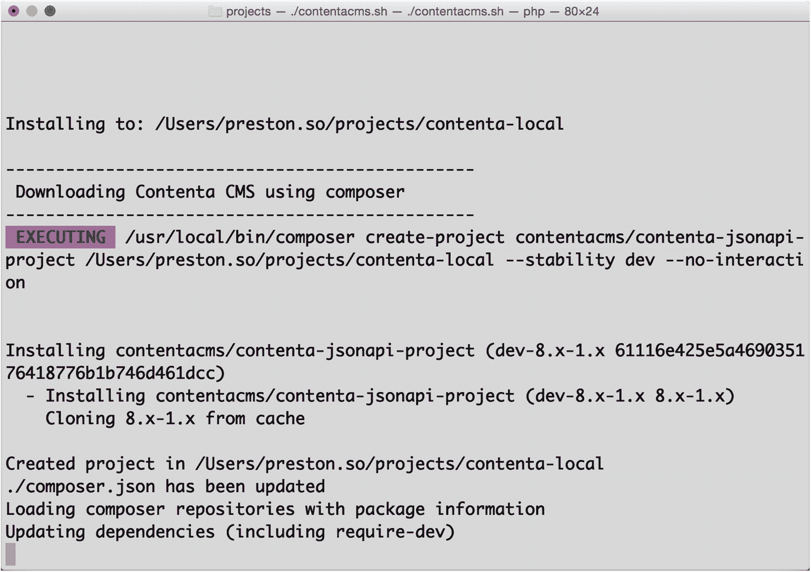
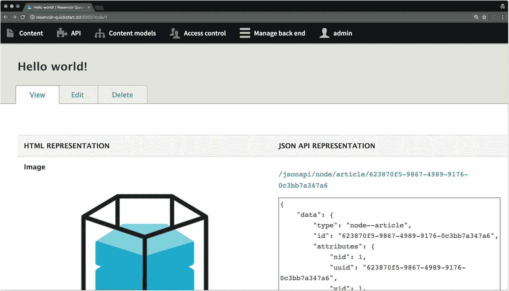
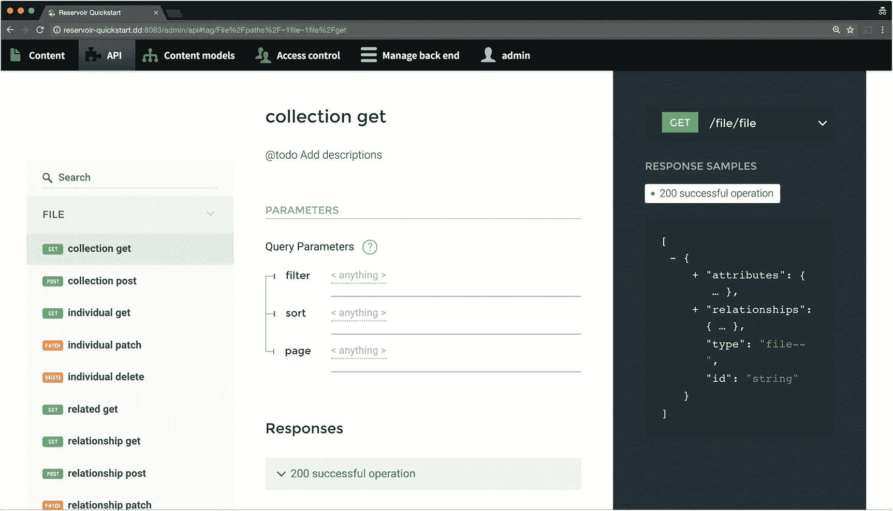
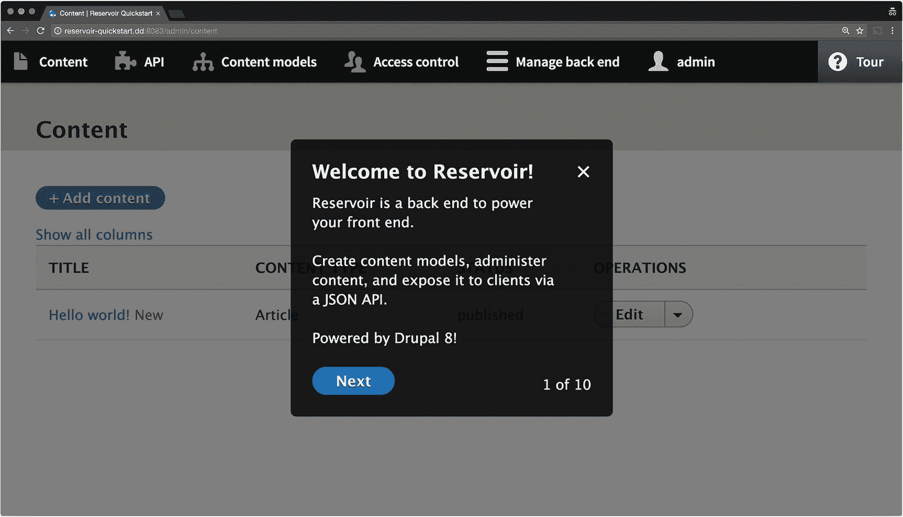
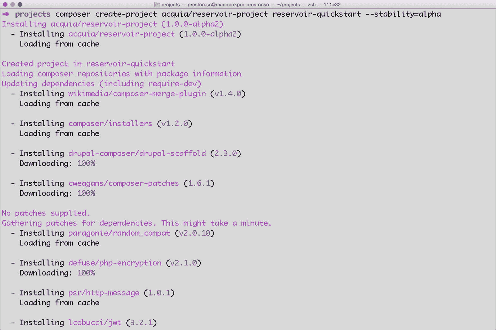
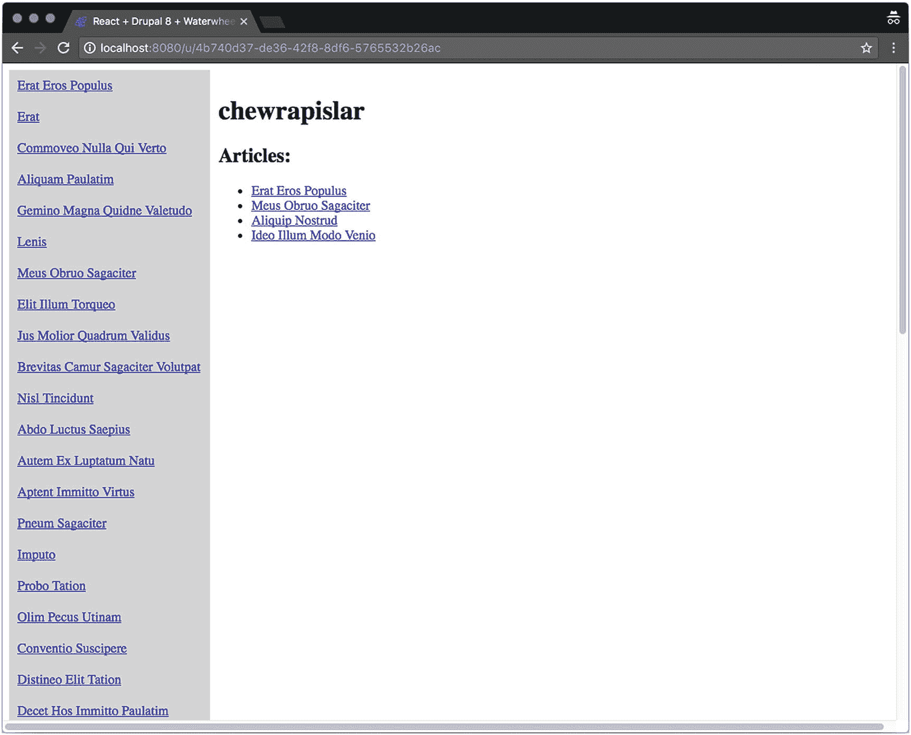

# 15. API 优先的发行版

在 Drupal 术语中，*发行版*指的是 Drupal 的变体，它包含完整的 Drupal 核心以及其他项目，如主题、模块、库（用于前端资源）和安装配置文件。发行版可以是功能完善的，意味着它们是用于特定场景的全面解决方案；或者它们可以作为快速启动工具，帮助开发者和站点构建者迅速上手。^(⁶³)

### 注意

Drupal 中一些常用的发行版包括：用于会议网站的会议组织发行版（COD）；用于社交社区、内部网和网络的 Open Social；以及用于出版网站的 Thunder。每个发行版的文档可在 Drupal.org 上获得，网址为 [`https://www.drupal.org/docs/8/distributions`](https://www.drupal.org/docs/8/distributions)。

近年来，解耦式 Drupal 架构的出现促使人们重新思考 Drupal 在这种环境中应该如何呈现和运行。对于许多构建 Drupal 消费者的开发者来说，学习 Drupal Web 服务的内部工作原理可能需要花费大量时间，令人望而却步。由于发行版是指定要安装哪些模块以及如何配置站点的最佳方式，因此它们是降低解耦式 Drupal 学习曲线的绝佳候选方案。

这些 *API 优先的发行版* 是 Drupal 的变体，为解耦式 Drupal 用例提供专门的配置和模块集。在 2017 年巴尔的摩 DrupalCon 期间的核心讨论中，由于解耦式 Drupal 存在多种最佳实践，且消费者开发者对 Drupal 缺乏认识，因此产生了对 API 优先发行版的需求。随后创建了一个 Drupal 核心想法议题，最终演变成了 Contenta。^(⁶⁴)

在 2017 年期间，API 优先的发行版 Contenta 和 Reservoir 相继独立发布。2017 年晚些时候，Acquia 的 Lightning 发行版的一个变体 Headless Lightning 采纳了 Reservoir 的大部分功能。随之而来，围绕着 Contenta 和 Reservoir 的生态系统也逐渐形成。2018 年，Lauri Eskola 和我重新提出建议，希望 Drupal 核心能标配提供一个“Decoupled”（解耦）安装配置文件，这将大大减少对特定 API 优先发行版的需求。^(⁶⁵)

虽然 API 优先的发行版是内容生态系统的优秀后端——这些生态系统仅仅需要一个供消费的存储库而非完整网站——但它们对于后端需要同时扮演站点和存储库双重角色的解耦式 Drupal 架构来说并非理想之选（更多关于解耦式 Drupal 用例的内容，请参见第 4 章）。例如，Reservoir 显著限制了功能，其中许多限制是针对习惯于正常构建单体式 Drupal 站点的用户的。因此，当你构建的是消费存储库而非站点的应用程序时，应该使用 API 优先的发行版；而对于构建站点，你可以正常使用单体式 Drupal。


### Contenta

`Contenta` 是 Drupal 社区中最常用的以 API 为首选的分发版，也是见证贡献者活动最多的项目。与下一节将要介绍的 `Reservoir` 类似，`Contenta` 的目标是为解耦式 Drupal 架构提供理想的内容存储库。尽管如此，`Contenta` 与 `Reservoir` 的优先事项截然不同。

`Contenta` 很大程度上保留了默认的管理界面，以给予 Drupal 开发者更熟悉的体验，但这也为 Drupal 新手开发者带来了复杂性。为缓解这一问题，`Contenta` 为不太熟悉 Drupal 的开发者提供了一个快速安装流程，其中包含了最常用的必需模块和一套完整的默认内容。^(⁶⁶) 该分发版还包含了 `JSON API Extras` 模块，该模块为 JSON API 增加了更多可配置性，例如为 JSON API 处理的路由提供别名（参见第 8 章）。

`Contenta` 的灵活性还允许消费端开发者在空白安装或包含已解决问题及 Umami 主题的演示安装之间进行选择。与 `Reservoir` 类似，`Contenta` 聚焦于 Drupal 为消费端应用开发者带来的最显著优势。使用 Drupal 作为底层基础，使得 `Contenta` 能够利用相同的开源软件许可证，并提供 Drupal 核心中可用的相同内容建模工具。然而，`Contenta` 最受推崇的优势或许是其为开发者提供的大量参考构建，这是一个在第 16 章详述的生态系统。^(⁶⁷)

根据其作者的说法，`Contenta` 的使命有四个方面：

- *对非 Drupal 用户友好*：`Contenta` 展现了一个简化的 Drupal 管理后端视图，让不熟悉 Drupal 术语的用户能够使用可用的默认值来建模和创建内容。
- *从第一分钟即可使用*：`Contenta` 自带大量演示内容，使得来自其他生态系统的开发者能够更快地评估解耦式 Drupal，并且能够恢复到干净状态。
- *解耦式知识中心*：`Contenta` 网站包含一系列文章和资源，其中包括针对解耦式 Drupal 中困难概念的教程，例如 OAuth2 身份验证和 JSON API 查询操作。
- *针对解耦用例功能完备*：`Contenta` 宣称其创建者在实施全功能解耦式 Drupal 架构方面拥有丰富的实际经验，并强调其能够满足包括解耦式 Drupal 在内的需求，功能完备。

### 注意

提供 JSON API 实现的主要 `Contenta` 分发版可在 GitHub 上获取，地址为 [`https://github.com/contentacms/contenta_jsonapi`](https://github.com/contentacms/contenta_jsonapi)。`Contenta` 网站位于 [`https://contentacms.org`](https://contentacms.org)。

### 安装 Contenta

要安装 `Contenta` 用于本地开发，如图 15-1 所示，您可以执行以下快速安装命令，这需要您的机器上已安装 `Composer` 1.7 或更高版本。继续阅读有关生产环境中 `Contenta` 的安装说明。



图 15-1

`Contenta` 的本地开发安装过程包含一个命令行界面，引导用户完成以下操作：

```
$ php -r "readfile('https://raw.githubusercontent.com/contentacms/contenta_jsonapi/8.x-2.x/installer.sh');" > contentacms-quick-installer.sh
$ chmod a+x contentacms-quick-installer.sh
$ ./contentacms-quick-installer.sh
```

要基于 `Composer` 的工作流或在生产环境中安装 `Contenta`，执行以下命令。此操作将额外下载 Drupal 核心之外的 `Contenta` 模块。

```
$ php -r "readfile('https://raw.githubusercontent.com/contentacms/contenta_jsonapi_project/8.x-1.x/scripts/download.sh');" > download-contentacms.sh
$ chmod a+x download-contentacms.sh
$ ./download-contentacms.sh /path/to/my-contenta
```

完成后，将 `.env.example` 文件复制为新的 `.env` 文件，并添加关于您的 Drupal 站点和 MySQL 数据库的关键信息。文档还建议使用 `.env.local` 来存储敏感凭据，以便 `git` 等版本控制工具忽略它。请考虑以下 `.env` 和 `.env.local` 文件示例。

```
# .env
SITE_MAIL=admin@example.com
ACCOUNT_MAIL=admin@example.com
SITE_NAME='Contenta Test'
ACCOUNT_NAME=admin
MYSQL_DATABASE=contenta
MYSQL_HOSTNAME=localhost
MYSQL_PORT=3306
MYSQL_USER=contenta
# .env.local
MYSQL_PASSWORD=contenta
ACCOUNT_PASS=admin
```

然后，您可以执行以下命令来运行安装脚本。

```
$ composer run-script install:with-mysql
```

### 注意

`Contenta` 的 Composer 安装程序可在 GitHub 上获取，地址为 [`https://github.com/contentacms/contenta_jsonapi_project`](https://github.com/contentacms/contenta_jsonapi_project)。


## 内容仓库

本章讨论的第二个发行版是 Reservoir，这是一个用于解耦 Drupal 的实验性极简主义发行版。与 Contenta 类似，Reservoir 的目标是为任何解耦式 Drupal 架构构建一个最优且通用的内容仓库，能够成功引导来自各种背景的开发人员（尤其是那些不熟悉 Drupal 界面的开发人员）上手，以便他们可以完成任何与内容管理或 API 消费相关的任务。

Reservoir 特别专注于将功能限制在以下几个主要领域：内容建模、内容管理、通过 API 公开内容以及内容 API 文档（图 15-2）。因此，它主要用作一个轻量级的内容仓库，不包含典型的单体式 Drupal 功能。

因此，与 Contenta 不同，Reservoir 有意移除了单体式 Drupal 功能的显著部分，包括面向用户的前端以及与内容仓库无关的模块（例如，断点、联系、区块）。无论好坏，Reservoir 也避免使用视图，因为假定消费者会更倾向于使用文档完善且广泛理解的 JSON API 响应，而不是采用一个具有学习曲线的陌生模块来处理仅涉及读取操作的功能。



图 15-2

Reservoir 并排展示了 HTML 格式和 JSON API 响应格式的内容呈现

这些特点构成了 Reservoir 的极简主义导向，它视消费端应用开发人员为第一等公民：

-   **有主见的功能集**：与 Contenta 一样，Reservoir 对其功能集以及提供给消费端开发人员的模块非常有主见。Reservoir 支持 JSON API 和 Simple OAuth 模块，这意味着开发人员不再需要配置 REST 资源或研究认证方法。在未来的迭代中，Reservoir 计划包含 GraphQL 支持。

-   **自动生成的 API 文档**：借助 Reservoir 开箱即附带的 OpenAPI 模块和 ReDoc JavaScript 库（见图 15-3），当开发人员创建和修改内容模型时，Reservoir 会自动生成 API 文档。当您使用默认的 Drupal 界面浏览内容时，每个资源的 API 文档也会显示在右侧。得益于 OpenAPI，Reservoir 还为希望使用不同文档生成工具的开发人员提供了 OpenAPI（Swagger）描述。此后，Contenta 也已采纳了所有这些功能。



图 15-3

得益于 OpenAPI 和 ReDoc，Reservoir 自动生成 API 文档，并根据 Drupal 内容模型的变更进行调整

-   **优化的用户界面**：首次安装 Reservoir 时，一个欢迎导览（图 15-4）会迎接新用户，并概述 Reservoir 中可用的内容建模、内容管理和 API 预置功能。



图 15-4

安装 Reservoir 时的欢迎屏幕还包括对其功能的引导式导览

自 Contenta 和 Reservoir 发布以来，这两个项目已经显著趋同。Reservoir 发布后，其维护者与 Contenta 团队合作引入了 API 文档和并排内容呈现功能，现在 Contenta 中也提供了这些功能。

如今，Contenta 和 Reservoir 最显著的区别在于它们的**优先级**。Reservoir 将功能精简到最核心的必要部分，并专注于一种极简主义方法，有利于那些完全不熟悉 Drupal 的开发人员。另一方面，Contenta 则走了一条中间路线，保留了熟悉的用户界面，让有 Drupal 经验的开发人员可以随意添加功能而无后顾之忧，并且仍然专注于向消费端应用交付内容。Contenta 还使用了默认内容，以便达到更接近演示就绪的状态。

### 注意

Reservoir 在 GitHub 上的地址是 [`https://github.com/acquia/reservoir`](https://github.com/acquia/reservoir)。此外，截至撰写本文时，作者 Wim Leers 提供了一个 alpha 版本的演示视频，可在 [`https://vimeo.com/222271467`](https://vimeo.com/222271467) 观看。

### 安装 Reservoir

安装 Reservoir 最简单的方法是使用 Composer 项目模板（见图 15-5）并执行以下命令：

```
$ composer create-project acquia/reservoir-project your-project-name --stability=alpha
```

接下来，在您的 Web 主机配置中，确保您的域名指向目录 `your-project-name/docroot`。然后，导航到该域名并正常安装 Reservoir。^(⁶⁸)



图 15-5

安装 Reservoir 的 Composer 项目模板

### 注意

Reservoir Composer 安装程序在 GitHub 上的地址是 [`https://github.com/acquia/reservoir-project`](https://github.com/acquia/reservoir-project)。

### 使用 Reservoir

在安装过程中，Reservoir 会创建四项内容：一项示例内容（标题为“Hello world”）、三个示例用户（拥有三个不同的角色）以及一个代表消费端应用的 OAuth 2.0 客户端。当您准备好在生产环境中部署 Reservoir 时，需要删除这些演示数据，并用您自己的密钥替换 OAuth 2.0 公钥和私钥（有关 OAuth 2.0 的更多信息，请参见第 9 章）。此外，请确保您的 CORS 设置已正确配置（请参见第 7 章）。

对于 Drupal 开发人员来说，Reservoir 可能并非最佳选择，因为 Reservoir 公开的数据仅限于节点（内容）和节点类型（内容类型）。Reservoir 排除了许多熟悉的 Drupal 用户界面以及像视图和分类术语这样的功能。据作者称，这些限制简化了开发并增强了理解，从而降低了后续的维护成本。尽管 Reservoir 允许安装 Drupal 模块来引入新功能或自定义代码，但 Reservoir 的极简主义意味着有经验的 Drupal 开发人员可能会觉得 Contenta 更有吸引力。

简而言之，Reservoir 强调简单性，但同时也受限于其极简主义导向的局限性。另一方面，Contenta 注重开箱即用的健壮性和完整性，但它保留了大部分复杂性，这可能会让 Drupal 新手感到困惑。

### 注意

围绕 Reservoir 还有一个不断扩展的生态系统，其中包括 `reservoir-docker`，一个在 GitHub 上可用的 Reservoir Docker 镜像，地址是 [`https://github.com/mattgrill/reservoir-docker`](https://github.com/mattgrill/reservoir-docker)；以及 `well`，一个基于 Reservoir 和 Acquia 的 BLT 项目的 Drupal 安装包，在 GitHub 上的地址是 [`https://github.com/damontgomery/well`](https://github.com/damontgomery/well)。


### Headless Lightning

Lightning 是 Acquia 开发的一款 Drupal 发行版，旨在通过集成各种实用模块，使之领先于 Drupal 核心，从而为内容编辑者和 Drupal 开发者提供开箱即用的更丰富体验。在其最初构想中，Lightning 只针对传统的单体 Drupal 站点和典型的 Drupal 用例，但此后其应用范围已扩展到包括分离式（解耦）Drupal 架构。

Lightning 提供的 API 优先功能，也作为 Headless Lightning 中的一个子配置文件提供。Headless Lightning 是一个更轻量级的发行版，包含了 Reservoir 的所有 Web 服务模块及其简化的管理界面。Lightning 和 Headless Lightning 都使用了 Content API 功能，这是 Lightning 对其所暴露的 JSON API 实现的称呼。^(⁶⁹)

Headless Lightning 与 Reservoir 的许多目标一致，即：简化呈现给消费者开发者的用户界面，对内容仓库用户可能希望的功能提供建议，并避免阻碍内容编辑者和站点构建者的工作进展。^(⁷⁰)

事实上，Lightning 和 Headless Lightning 之间的这种区别，解决了关于 Contenta 和 Reservoir 的一个关键担忧，因为前述的 API 优先发行版仅针对内容仓库的用例进行了优化，而非站点和仓库的混合用例（参见第 4 章）。然而，在任何一种 API 优先发行版中，由于它们的架构差异，仍然无法在这两种用例之间优雅地切换。

### 注

Lightning 可在 GitHub 上获取，地址为：[`https://github.com/acquia/lightning`](https://github.com/acquia/lightning)。Headless Lightning 可在 GitHub 上获取，地址为：[`https://github.com/acquia/headless-lightning`](https://github.com/acquia/headless-lightning)。

### 安装 Headless Lightning

安装 Headless Lightning 的最简单方式是通过基于 Composer 的项目模板。

```
$ composer create-project acquia/lightning-project:dev-headless --no-interaction --stability=dev
```

此命令会创建一个名为 `lightning-project` 的目录，其中包含一个 `docroot` 文件夹。你可以通过在执行 `--no-interaction` 和 `--stability` 标志前添加一个额外的参数来自定义目录名称。

```
$ composer create-project acquia/lightning-project:dev-headless your-project-name --no-interaction --stability=dev
```

在安装过程结束时，与 Reservoir 类似，虽然无需配置 REST 资源，但你需要配置 CORS 支持（参见第 7 章）和 OAuth 认证令牌（参见第 9 章）。

### 结论

尽管 API 优先发行版仍然是解耦 Drupal 生态系统中一个不断成熟的部分，但对于不熟悉 Drupal 的开发者，以及那些希望为其应用寻找一个简化型内容仓库（而非功能完备的 CMS 作为后端）的开发者而言，它们至关重要。在过去几年中，Drupal 社区涌现了大量活动，创建了诸如 Contenta、Reservoir 和 Headless Lightning 等发行版，它们都共享许多功能，但也突显了方法上的诸多差异。

借助 API 优先发行版，那些原本永远不会考虑 Drupal 的开发者，可以利用一个更易访问、对新手更友好的界面，该界面将 API 文档和并排展示等组件置于核心位置。在下一章中，我们将深入探讨解耦 Drupal 生态系统的另一个极端——帮助开发者在客户端（消费者端）构建应用的入门工具包、SDK 和参考构建。

脚注 1 2 3 4 5 6 7 8

## 软件开发工具包与参考构建

如今，开发者正选择以仅在几年前还无法想象的新颖方式来使用 Drupal。因此，背景迥异的开发者们正以前所未有的方式应对 Drupal 的 Web 服务，以便为自己的应用提供内容。得益于 Drupal 8 核心中的 Web 服务，Drupal 已经能够很好地适应不同技术领域的各类消费者应用。然而，这里只有一个问题：不熟悉 Drupal 的开发者不知道如何使用它。

在本章中，我们将介绍解耦 Drupal 生态系统中一些超越典型 Web 服务的最基本工具——即 SDK 和参考构建，它们能够加速在 Drupal 自身技术之外的消费者应用开发（参见图 16-1）。这使得那些可能从未发现或考虑过 Drupal 的开发者，无需采用整个单体系统就能尝试使用它。


**图 16-1** 此图展示了 API 优先发行版（参见第 15 章）、SDK 和参考应用在典型解耦 Drupal 架构中的位置

SDK 的概念在 Web 开发和通用软件领域并非新事物，使用 SDK 将消费者应用与 API 桥接起来的想法同样不新鲜。如今，像 Contentful 和 Prismic 这样的专有型“内容即服务”解决方案，提供了免费且开源的 SDK，这些 SDK 能与它们自己的 Web 服务无缝协作，同时允许开发者使用自己选择的语言进行开发。尽管如此，这些 SDK 虽然是免费的，但需要订阅一个通常具有不透明 API 规范的专有平台。

选择 Drupal 的主要动机之一是其免费且开源的性质。借助一个健壮的 SDK 生态系统，Drupal 能够有效地与 Contentful 等服务相抗衡，成为市场上唯一端到端的 API 优先 CMS，尽管要在足够广泛的技术领域实现一套全面的 SDK 还有很长的路要走。从这个意义上说，虽然 SDK 并非固有地绑定于典型的 Drupal 开发，但它们作为连接其他技术的桥梁，以及作为以 Drupal 为后盾的应用生态系统的一个组成部分，扮演着重要角色。

通常，解耦 Drupal 生态系统中的 SDK 旨在弥补许多初涉 Drupal 的开发者对其 Web 服务以及如何使用这些服务的认知不足。例如，`Waterwheel.js`（原名 Hydrant）和 `Waterwheel.swift`（原名 Drupal iOS SDK）分别帮助 JavaScript 和 Swift 开发者构建由 Drupal 驱动的应用。有了 SDK，开发者无需记住诸如不同基数（cardinality）的字段如何在 JSON 响应中暴露等细微差别。

### Waterwheel 生态系统

Waterwheel 生态系统是由 Drupal 社区构建的一套新兴 SDK，旨在服务那些使用非 Drupal 技术开发应用的开发者。请允许我使用一个不完美的比喻：Waterwheel 通过促进 Drupal 与不同技术之间低开销的通信，帮助开发者“说”Drupal 的语言。目前，有两个可用的 SDK，分别对应 JavaScript (ES6) 和 Swift，此外还有一个 Ember 插件和一个 React 参考构建。

### Waterwheel.js

`Waterwheel.js` 于 2016 年发布，是一个帮助库，旨在帮助 JavaScript 开发者消费和操作 Drupal 内容。


### 注意

`Waterwheel.js` 可在 GitHub 的 [`https://github.com/acquia/waterwheel.js`](https://github.com/acquia/waterwheel.js) 和 NPM 的 [`http://npmjs.org/package/waterwheel`](http://npmjs.org/package/waterwheel) 上获取。此前，`Waterwheel.js` 还曾支持实体查询 API 模块（[`https://www.drupal.org/project/entityqueryapi`](https://www.drupal.org/project/entityqueryapi)）及其查询操作，但该模块现已被 JSON API 模块所取代（参见第 8 章和第 13 章）。

虽然 `Waterwheel.js` 包含一个与 Drupal 完美契合的 HTTP 客户端，但它特别灵活，开发者可以在服务器端使用它，在像 Ember 或 React 这样的框架的服务器端执行过程中，通过 Node.js 发起 API 调用。此外，你还可以在客户端使用 `Waterwheel.js`，在浏览器加载客户端包后执行异步请求。这意味着 `Waterwheel.js` 是*通用*的，其代码可以在客户端/服务器端边界之间共享。

由于 `Waterwheel.js` 的灵活性，Drupal 开发者还可以利用它，通过类似 AJAX 的交互或其他专门处理异步请求的 HTTP 客户端（如 `superagent` 或 `axios`），来增强现有单体 Drupal 站点的客户端体验。由于它旨在作为 JavaScript 框架的基础，因此对于完全解耦和渐进式解耦的 Drupal 用例来说都是最优选择。

### 注意

`superagent` 和 `axios` 库可分别在 NPM 的 [`https://www.npmjs.com/package/superagent`](https://www.npmjs.com/package/superagent) 和 [`https://www.npmjs.com/package/axios`](https://www.npmjs.com/package/axios) 上获取。

由于 `Waterwheel.js` 是许多构建消费型应用的开发者最易入门的切入点，我们将在接下来的章节中更详细地探讨其功能。

#### 安装与构建 Waterwheel.js

安装 `Waterwheel.js` 最简单的方法是直接克隆 GitHub 仓库。

```
$ git clone git@github.com:acquia/waterwheel.js.git
```

你也可以通过 HTTPS 克隆 GitHub 仓库。

```
$ git clone https://github.com/acquia/waterwheel.js.git
```

要安装开发依赖项，例如 `axios` 和 `qs`（一个处理查询字符串的库），可以使用 `npm install` 这个简写命令来获取 `Waterwheel.js` 所需的库。

```
$ npm i
```

要运行测试并检查覆盖率，请运行简写的测试命令。

```
$ npm t
```

最后，任何客户端 JavaScript 应用最关键的一步是生成一个包含所有依赖项的压缩版本的、可用于生产环境的包。以下命令在 `dist` 目录中创建一个包含 `Waterwheel.js` 所有内置功能的单一包文件。

```
$ npm run build
```

#### 实例化 Waterwheel.js

要在支持 ES6 的 Node.js 服务器上创建 `Waterwheel.js` 的新实例，可以使用 `const` 关键字来引入 `Waterwheel` 模块。之后，你可以通过提供一个包含 Drupal 源 URI 和 OAuth 2.0 访问令牌的对象参数来实例化一个新的 `waterwheel`（有关 OAuth 2.0 的更多信息，请参见第 9 章）。^(⁷¹)

```
// 在 Node.js 服务器上
const Waterwheel = require('waterwheel');
const waterwheel = new Waterwheel({
base: 'http://drupal-backend.dd:8083',
oauth: {
grant_type: '授权类型',
client_id: '客户端 ID',
client_secret: '客户端密钥',
username: '用户名',
password: '密码'
}
});
```

要使 `Waterwheel` 在支持 ES6 的浏览器中可用，你可以使用 `<script>` 导入生成的包（参见上一节），并将其添加到 `window` 对象中。在渐进式解耦的场景中，你也可以使用 Drupal 资源库来包含客户端就绪的包。

```
// 在支持 ES6 的浏览器上
// 
const waterwheel = new window.Waterwheel({
base: 'http://drupal-backend.dd:8083',
oauth: {
grant_type: '授权类型',
client_id: '客户端 ID',
client_secret: '客户端密钥',
username: '用户名',
password: '密码'
}
});
```

目前许多浏览器仍不支持 ES6，在这种情况下，你仍然可以在使用 ES5 定义全局变量 `waterwheel` 之前，通过传统的 `<script>` 标签引入客户端包。

```
// 在不支持 ES6 的浏览器上
// 
var waterwheel = new window.Waterwheel({
base: 'http://drupal-backend.dd:8083',
oauth: {
grant_type: '授权类型',
client_id: '客户端 ID',
client_secret: '客户端密钥',
username: '用户名',
password: '密码'
}
});
```

当你实例化 `Waterwheel` 时，还可以向参数对象提供其他属性，这些属性可能对你的 `Waterwheel` 驱动的消费型应用有用。例如，你可以提供一个 `timeout` 参数，指示在 `Waterwheel` 取消请求之前，请求可以空闲多长时间。以下是截至撰写本文时，直接从 `README` 中摘录的 `Waterwheel` 可选接受的其他可能属性列表。^(⁷²)

*   `base`: Drupal 实例的基础路径。所有请求路径都将基于此路径构建。
*   `resources`: 一个 JSON 对象，表示 `waterwheel` 可用的资源（参见接下来的两节）。
*   `oauth`: 一个包含获取和刷新 OAuth 承载令牌所需信息的对象。`Waterwheel` 推荐使用 Simple OAuth 模块（参见第 9 章）。
    *   `grant_type`: OAuth 2.0 授权类型。截至撰稿时，`password` 是唯一支持的值。
    *   `client_id`: 你的客户端 ID。
    *   `client_secret`: 你的客户端密钥。
    *   `username`: 用户的用户名。
    *   `password`: 用户的密码。
*   `timeout`: 在取消 HTTP 请求之前，请求可以空闲的时间长度。
*   `accessCheck`: 指示是否应使用身份验证。可能的值是 `true` 和 `false`。
*   `jsonapiPrefix`: 如果你覆盖了 JSON API 的前缀，请在此处指定，`Waterwheel` 将使用此值覆盖默认值 `jsonapi`。
*   `validation`: 一个布尔值，默认为 `true`。如果设置为 `false`，每个请求都将忽略任何现有的 OAuth 信息，允许你在不进行任何身份验证的情况下发出请求。如果你有一个开放的 API，则无需使用 Simple OAuth 模块。


### 资源发现

消费端应用的开发者常常面临一个挑战：如何实现客户端验证，使其能够模拟服务器端对收到的所有请求进行的验证。借助 OpenAPI 规范——该规范在 Drupal 中由 OpenAPI 模块（关于 OpenAPI（一种用于自文档化 API 的规范）的更多信息，请参阅第 24 章）表示——Waterwheel.js 启用了一项名为*资源发现*的功能。

具体来说，资源发现允许消费端应用理解 Drupal 的内容模式，并避免验证陷阱，而无需依赖与 Drupal 之间来回交互来获取验证源。这一点至关重要，因为 Drupal 的关键特性之一是内容建模的灵活性，这意味着可以随意添加或移除新的内容类型及其字段。

由于消费端应用必然不了解 Drupal 用户在 CMS 上如何对内容进行建模，并且开发者通常缺乏对 Drupal 中用于 Web 服务的实体序列化的全面理解，因此针对服务器端 Drupal 内容模式的客户端验证可能特别困难。消费端应用可能还希望向内容模型添加自己的元素，这些元素与 Drupal 的内容模型并存，尤其是当他们使用其他数据源时。最重要的好处之一是，消费端应用可以执行客户端验证，而完全无需咨询服务器。

在 Waterwheel.js 中，资源发现允许消费端应用开发者在实例化 `waterwheel` 时，使用一个包含关于 Drupal 上哪些实体和字段可用于检索和操作信息的元数据对象。

#### 通过资源发现填充资源

要填充 Waterwheel.js 可用的资源，您可以提供一个资源清单来启用资源发现。Waterwheel.js 可以自动处理一个 OpenAPI 模式的 JSON 文件，并在向 Drupal 发出请求之前，根据这些响应验证任何用户生成的内容。

例如，请查看以下示例，该示例从 JSON 文件导入 OpenAPI 模式，并将其整合到 Waterwheel.js 的可用数据中。

```
// 在 Node.js 服务器上
const Waterwheel = require('waterwheel');
const waterwheel = new Waterwheel({
base: 'http://drupal-backend.dd:8083',
resources: require('./resources.json'),
oauth: {
grant_type: 'GRANT-TYPE',
client_id: 'CLIENT-ID',
client_secret: 'CLIENT-SECRET',
username: 'USERNAME',
password: 'PASSWORD'
}
});
```

如果您希望在稍后而非实例化时填充 Waterwheel.js 的资源，您可以使用 `populateResources()` 方法，该方法会向 OpenAPI Drupal 模块提供的资源发出一个额外的 API 调用。在这里，我们看到使用 ES6 的 promise 来调用该方法以处理响应。

```
waterwheel.populateResources('http://drupal-test.dd:8083/resources.json')
.then(res => {
// ...
});
```

一旦您填充了 Waterwheel.js 的内部资源，您就可以使用 `getAvailableResources()` 方法来访问它们。promise 返回的响应将包含一个可用资源数组，如下面的注释所示。然后，您可以根据此数组验证对资源的传入请求。

```
waterwheel.getAvailableResources()
.then(res => {
/*
[ 'comment',
'file',
'menu',
'node.article',
'node.page',
'node_type.content_type',
'query',
'taxonomy_term.tags',
'taxonomy_vocabulary',
'user' ]
*/
});
```

### 注意

OpenAPI Drupal 模块可在 Drupal.org 上的 [`https://www.drupal.org/project/openapi`](https://www.drupal.org/project/openapi) 获取。有关 OpenAPI 的更多详细信息，请查阅第 24 章。

### 使用 Waterwheel.js 消费和操作 Drupal

Waterwheel.js 与 Contenta.js（本章后续讨论）一样，为 JavaScript 开发者与 Drupal 之间搭建了一座桥梁，允许他们使用母语（JavaScript）通过 Drupal 的 Web 服务来检索和操作内容。

#### 使用 Waterwheel.js 检索内容

要使用 Waterwheel.js 检索内容，您可以在 `api` 对象上使用 `get()` 方法，并在过程中指定类型（以及必要的包的名称）。Waterwheel.js 中的所有查询都返回 ES6 的 promise。由于 Waterwheel.js 需要实体类型和包的名称来构建正确的资源路径，我们在调用 `get()` 时，必须在 `api` 对象内通过指定相应的资源来同时标识这两者。

```
// Node 表示带有不同包的类型
waterwheel.api['node:article'].get(1) // .then( ...
waterwheel.api['node:page'].get(1) // .then( ...
// User 同时表示类型和包
waterwheel.api['user'].get(1) // .then( ...
```

`get()` 方法接受两个参数：必需的请求实体的 `标识符`（例如，核心 REST 中的 `nid`、`tid`、`uid` 等），以及可选的响应 `格式`，默认为 `json`。

```
waterwheel.api['node:article'].get(1)
.then(res => {
// Drupal JSON 响应
})
.catch(err => {
// 错误
});
```

要请求序列化为 XML 的实体，请包含所需的 `format` 参数：

```
waterwheel.api['node:article'].get(1, 'xml')
.then(res => {
// Drupal JSON 响应
})
.catch(err => {
// 错误
});
```

#### 使用 Waterwheel.js 创建内容

使用 Waterwheel.js，您还可以通过发出 `POST` 请求并调用 `post()` 方法，在核心 REST 中创建一个新实体。以下对 `post()` 方法的调用创建了一个标题为“Hello Drupal”的*基本页面*类型节点。

`post()` 方法接受两个参数：所需内容实体的 `body`，其格式需使 Drupal 能够将其反序列化为一个 Drupal 实体；以及可选的 `format`，默认为 JSON。

```
waterwheel.api['node:page'].post({
"type": [
{"target_id": "page"}
],
"title": [
{"value": "Hello Drupal"}
],
"body": [
{"value": "How are you today?"}
]
})
.then(res => {
// 201 已创建
})
.catch(err => {
// 错误
});
```

#### 使用 Waterwheel.js 更新内容

我们还可以通过调用 `patch()` 方法，对 Drupal 核心 REST 中的任何内容实体发出 `PATCH` 请求（即执行更新操作）。该方法接受三个参数：需要更新的实体的 `标识符`（必需）、包含更新后实体字段的 `body`（必需），以及可选的 `format`。以下查询更新了 `nid` 为 `1` 的文章的标题和正文。

```
waterwheel.api['node:article'].patch(1, {
"nid": [
{"value": "1"}
],
"type": [
{"target_id": "article"}
],
"title": [
{"value": "New title"}
],
"body": [
{"value": "New node"}
]
})
.then(res => {
// 更新后的 JSON 格式实体
})
.catch(err => {
// 错误
});
```

与典型的核心 REST 响应类似，此 `PATCH` 查询会在响应中返回新更新的 JSON 对象，随后可在已完成的 promise 中进行处理。

#### 使用 Waterwheel.js 删除内容

要使用 Waterwheel.js 删除一个实体，我们只需在调用 `delete()` 方法时提供标识符作为参数，我们的 Drupal 实体就会被删除。

```
waterwheel.api['user'].delete(2)
.then(res => {
// 204 无内容
})
.catch(err => {
// 错误
});
```


### 使用 JSON API 和 Waterwheel.js 检索内容

如果你的 Drupal 站点已安装 JSON API（完整概述请参阅第 8 章和第 12 章），你可以借助 `jsonapi` 对象使用 Waterwheel.js 来查询 JSON API。该对象包含一个用于检索单个内容实体和实体集合的 `get()` 方法。

截至目前，Waterwheel.js 的 JSON API 功能仅支持检索（`get()`）、创建（`post()`）和删除（`delete()`）。

`get()` 方法接受三个参数：
- `resource`：被请求的包（bundle）和实体类型。
- `params`：查询所需的其他参数，这些参数在发出请求前会被转换为查询字符串参数。
- `id`：被请求实体的 UUID。

要检索一个集合，你可以像下面的示例一样，将包和实体类型作为字符串提供，这形成了第一个参数。以下代码从 JSON API 中检索一篇默认的文章集合。

```
waterwheel.jsonapi.get('node/article', {})
.then(res => {
// 处理响应
})
.catch(err => {
// 错误处理
});
```

要检索单个资源，我们可以提供第三个参数，即相关实体的 UUID。在这个例子中，我们正在检索 UUID 表达在参数中的那篇文章。

```
waterwheel.jsonapi.get('node/article', {}, 'bc4acb41-d3fe-4e19-a43b-c51665dab367')
.then(res => {
// 处理响应
})
.catch(err => {
// 错误处理
});
```

得益于 JSON API，我们还可以检索被请求资源中关系（relationships）包含的相关资源。这意味着除了文章本身，我们还可以通过引用文章实体中包含的 `uid` 来获取相关的文章作者。我们通过“重载”UUID 参数来指定这种关系来实现这一点。

```
waterwheel.jsonapi.get('node/article', {}, 'bc4acb41-d3fe-4e19-a43b-c51665dab367/uid')
.then(res => {
// 处理响应
})
.catch(err => {
// 错误处理
});
```

最后，我们还可以使用第二个 `params` 参数，对我们可能想要检索的任何集合动态执行查询操作。这些操作的常见示例可以在第 12 章找到，这里复现了几个。

要按标题升序排序，我们可以像下面这样提供一个 `sort` 查询字符串参数，反映相对路径 `/jsonapi/node/article?sort=title`。

```
waterwheel.jsonapi.get('node/article', {
sort: 'title'
})
.then(res => {
// 处理响应
})
.catch(err => {
// 错误处理
});
```

在字段名前加一个连字符，我们可以得到按标题降序排序的集合，反映路径 `/jsonapi/node/article?sort=-title`。

```
waterwheel.jsonapi.get('node/article', {
sort: '-title'
})
.then(res => {
// 处理响应
})
.catch(err => {
// 错误处理
});
```

我们还可以将集合限制为仅 25 条记录，反映路径 `/jsonapi/node/article?page[limit]=25`。

```
waterwheel.jsonapi.get('node/article', {
page: {
limit: '25'
}
})
.then(res => {
// 处理响应
})
.catch(err => {
// 错误处理
});
```

我们可以确保初始集合只包含第 26 到第 50 篇文章，由路径 `/jsonapi/node/article?page[limit]=25&page[offset]=25` 表示。

```
waterwheel.jsonapi.get('node/article', {
page: {
limit: '25',
offset: '25'
}
})
.then(res => {
// 处理响应
})
.catch(err => {
// 错误处理
});
```

作为最后一个例子，我们可以定义自己的过滤器——此处只允许标识符为 5 或更高的文章——并将其应用到集合中，这里反映的路径构造如下：

```
/jsonapi/node/article
?filter[nid_filter][condition][value]=5
&filter[nid_filter][condition][field]=nid
&filter[nid_filter][condition][operator]=%3C
```

这里，`%3C` 代表左尖括号 `<`。如你所见，得益于 Waterwheel.js 内置的查询处理，我们不需要使用 UTF-8 替换。

```
waterwheel.jsonapi.get('node/article', {
filter: {
nid_filter: {
condition: {
value: '5',
field: 'nid',
operator: '<'
}
}
}
})
.then(res => {
// 处理响应
})
.catch(err => {
// 错误处理
});
```

### 使用 JSON API 和 Waterwheel.js 创建内容

Waterwheel.js 还允许我们创建和删除 JSON API 暴露的内容实体，但截至目前，它不允许我们通过 `PATCH` 请求来更新它们。

`post()` 和 `delete()` 的第一个参数——连接后的包和实体类型——与 `jsonapi` 对象上的 `get()` 相同。然而，第二个参数不同；在 `post()` 中，它是要创建的文章的期望数据，而在 `delete()` 中，它是要删除实体的 UUID。

在第一个示例中，我们使用预定义的数据创建一篇文章，Drupal 将使用这些数据来构建实体。

```
const postData = {
'data': {
'type': 'node--article',
'attributes': {
'langcode': 'en',
'title': '我悄悄创建的新文章',
'status': '1',
'promote': '0',
'sticky': '0',
'default_langcode': '1',
'path': null,
'body': {
'value': '向你问候我悄悄创建的新文章。'
}
}
}
};
waterwheel.jsonapi.post('node/article', postData)
.then(res => {
// 处理响应
})
.catch(err => {
// 错误处理
});
```

### 使用 JSON API 和 Waterwheel.js 删除内容

在第二个示例中，我们通过在调用 `delete()` 时引用实体的 UUID 来删除一个实体。注意其参数与 `post()` 不同。

```
waterwheel.jsonapi.delete('node/article', 'bc4acb41-d3fe-4e19-a43b-c51665dab367/uid')
.then(res => {
// 处理响应
})
.catch(err => {
// 错误处理
});
```

### Waterwheel.swift

Waterwheel.swift 以前被称为 Drupal iOS SDK，它为 Drupal 8 的核心 REST API 以及常见的 Swift 消费者需求（如会话管理和身份验证功能）提供了强大的支持。由于它旨在与 Swift 集成，Waterwheel.swift 支持 iOS、macOS、tvOS 和 watchOS。尽管全面检视 Waterwheel.swift 的功能超出了本书的范围，但我们在此强调几个关键特性。

得益于 Swift，Waterwheel.swift 相比其前身（用 Objective-C 实现的 Drupal iOS SDK）在性能上有显著优势。因此，构建 Swift 应用程序的开发人员可以利用该语言的闭包等特性。

例如，对于 iOS，Waterwheel.swift 提供了一个现成的登录按钮，开发人员可以将其子类化或放置到视图中的任何所需位置。该按钮可以与一个定制的 `LoginViewController` (`waterwheelLoginViewController`) 配合使用，该控制器开箱即用地提供了用户名和密码字段，允许开发人员以最小的开销将 Drupal 用户登录和注销功能集成到 Swift 应用程序中。

总之，Waterwheel.swift 转变了面向 Drupal 的 Swift 开发人员体验，使其变得轻松自如。得益于 Swift，你可以利用苹果技术的下一代语法特性来与 Drupal 交换数据，而无需学习或理解 Drupal 复杂且常常难以驾驭的 Web 服务生态系统。

### 注意

Waterwheel.swift 可在 GitHub 上获得： [`https://github.com/kylebrowning/waterwheel.swift`](https://github.com/kylebrowning/waterwheel.swift)，同时还有一个演示应用程序： [`https://github.com/kylebrowning/waterwheel.swift/tree/4.x/waterwheelDemo`](https://github.com/kylebrowning/waterwheel.swift/tree/4.x/waterwheelDemo)。


### `ember-drupal-waterwheel`

本节和下一节，我们将深入探讨 Waterwheel 生态系统中，为使用 Ember 和 React 构建消费者应用的开发者所提供的扩展、插件和参考构建的各个要素。在后续章节中，我们将转向 Contenta 生态系统。

由 Chris Hamper (hampercm) 编写的 `ember-drupal-waterwheel` 扩展，帮助 Ember 开发者构建由 Drupal 支撑的消费者应用。例如，`ember-drupal-waterwheel` 与提供 Ember 应用服务端渲染功能的 FastBoot 扩展兼容。

无论是在将现有 Ember 应用连接到 Drupal Web 服务提供者（例如 Contenta、Reservoir 或 Headless Lightning），还是从头创建新的 Ember 应用，我们都可以在 Ember 应用开发的各个阶段使用 `ember-drupal-waterwheel` 扩展。

尽管 Ember 自带了一个通用的 `JSONAPIAdapter`，用于处理遵循 JSON API 规范的各类 API 的请求和响应，但 `ember-drupal-waterwheel` 扩展所包含的适配器和序列化器能够处理 Drupal 特有的 JSON API 请求和响应，同时还能处理由 Simple OAuth 模块提供的 OAuth 2.0 认证（参见第 9 章）。

首先，使用 Ember 自带的命令行界面 Ember CLI 来安装该扩展。

```
$ ember new my-app
$ cd my-app
$ ember install ember-drupal-waterwheel
```

`ember-drupal-waterwheel` 允许你即时生成反映 Drupal 实体类型的 Ember 模型、路由和模板。通过使用带 `drupal` 前缀参数的 `ember generate` 命令（或其简写 `ember g`），我们可以创建现成的 Ember 应用资源，并可以在此基础上进行修改。

```
$ ember g drupal-article
$ ember g drupal-tag
```

我们还可以通过在通用实体类型名称后面将自定义实体名称作为参数传入，来为自定义 Drupal 实体生成所需的模型、路由和模板。

```
$ ember g drupal-entity my_custom_entity
```

### 注意

`ember-drupal-waterwheel` 扩展可在 GitHub 上获取，地址为 [`https://github.com/acquia/ember-drupal-waterwheel`](https://github.com/acquia/ember-drupal-waterwheel) 。

### `react-waterwheel-app`

`react-waterwheel-app` 参考应用（见图 16-2）通过 Waterwheel.js 库与一个基础 React 应用相结合，与 Drupal 后端集成，为内容实体的增删改查操作提供了一个简单的编辑界面。



图 16-2

`react-waterwheel-app` 中显示与特定用户关联的内容列表的用户页面

Waterwheel 生态系统中由 React 和 Ember 驱动的参考应用还有一个相似之处，即由于 `src/config.js` 文件的存在，它们都易于配置。在 `react-waterwheel-app` 中，你可以通过保存包含适当的 Drupal 主机名和 OAuth 2.0 所需凭证的文件，将 React 应用连接到 Drupal Web 服务提供者。

要开始使用 `react-waterwheel-app` 并连接到一个 Drupal 站点，请从 GitHub 克隆仓库并运行此处所示的命令。`react-waterwheel-app` 项目使用 Yarn 作为依赖管理器，这与许多现代 JavaScript 生态系统保持一致。

```
$ git clone https://github.com/acquia/react-waterwheel-app
$ cd react-waterwheel-app
$ yarn install
```

### 注意

`react-waterwheel-app` 参考构建可在 GitHub 上获取，地址为 [`https://github.com/acquia/react-waterwheel-app`](https://github.com/acquia/react-waterwheel-app) 。

### Contenta 生态系统

如第 15 章所述，社区主导的 Contenta 发行版旨在为解耦 Drupal 提供一个功能丰富且能与多种演示和参考构建无缝集成的综合性后端。这些演示和参考构建针对与 Contenta 而非通用 Drupal 后端的使用进行了优化。Contenta 团队还积极接触其他社区，这些社区慷慨地贡献了可引用的消费者应用。

虽然 Contenta 拥有比 Waterwheel 生态系统更广泛的参考构建，但在撰写本文时，这些构建通常变化很大，因此不太稳定。然而，本章将介绍其中一些足够健壮的参考构建。在本节末尾，我们还将介绍 Contenta.js，它于 2018 年 7 月发布，专门为 Contenta CMS 提供了一个完整的 Node.js 中间件层。

### Contenta 参考构建

与旨在提供通用 SDK 供开发者与任何解耦 Drupal 后端一起使用的 Waterwheel 生态系统不同，Contenta 生态系统更侧重于遵循单一设计的可演示应用，即由“开箱即用”计划制作的 Umami 主题。这有一个特别的优势，即便于在多个消费者应用之间进行比较，这对评估者非常有益。

虽然全面深入地审视每个参考构建超出了本书的范围，并且这些参考构建本身不如 Contenta CMS 稳定，但这里我们将介绍几个最流行的 Contenta 消费者应用。

##### `contenta_angular`

`contenta_angular` 参考应用旨在提供一套最佳实践，不仅用于构建由 Drupal 支撑的 Angular 应用，也适用于通用 Angular 应用的构建。为此，`contenta_angular` 选用 Angular CLI 作为其命令行界面（有关 Angular CLI 的更多信息，请参见第 19 章），它包含了应用脚手架搭建、测试等功能。

此外，得益于 Service Worker 的使用，`contenta_angular` 支持离线工作。`contenta_angular` 的 Service Worker 会在客户端缓存从 Drupal 加载的外部 API 调用和文件，这意味着整个应用可以在离线状态下运行。`contenta_angular` 应用还支持 HTTP/2 服务器推送，这使得服务器一旦接收到首次请求，即可启动 JavaScript 和 CSS 资源的传输。

最后，`contenta_angular` 使用了 Angular 生态系统的其他几个要素，例如基于 Material Design 的设计，其包含的 Sass 编译由 Angular CLI 免费提供。它还遵循 `ngrx 4` 库的状态管理方法，将对远程 API 的请求视为副作用，从而避免失败的请求导致过于乐观且难以回退的状态更改。^(⁷³)

在撰写本文时，我们可以按照以下步骤安装 `contenta_angular`。此过程结束时，本地构建将在 `http://localhost:4200` 上可用。

```
$ npm install -g @angular/cli
$ git clone https://github.com/contentacms/contenta_angular.git
$ cd contenta_angular
$ npm install
$ ng serve
```

之后，你可以修改 `ngsw-manifest.json`、`src/environments/environment.prod.js` 和 `src/environments/environment.js` 中的配置，以指向除公共 Contenta 主机之外的不同解耦 Drupal 主机。

### 注意

`contenta_angular` 可在 GitHub 上获取，地址为 [`https://github.com/contentacms/contenta_angular`](https://github.com/contentacms/contenta_angular) 。在撰写本文时，演示应用可在 [`https://contenta-angular.firebaseapp.com`](https://contenta-angular.firebaseapp.com) 上访问。


##### `contenta_ember`

`contenta_ember` 参考应用程序也使用了其框架 Ember 的官方命令行界面（更多关于 Ember 的内容，请参见第 21 章）。借助 Ember CLI，开发者可以使用与 Angular CLI 类似的脚手架工具、内置的测试功能（Ember 非常强调自动化测试），以及生成生产就绪代码的打包功能。

`contenta_ember` 最引人注目的特性之一是其 Ember 代码生成能力。借助 Ember CLI，您可以通过*一条命令*生成裸机 Ember 模型、组件和其他代码。^(⁷⁴)

安装 `contenta_ember` 与安装 `contenta_angular` 一样简单直接。

```
$ git clone https://github.com/contentacms/contenta_ember.git
$ cd contenta_ember
$ npm install
$ ember serve
```

若要一次性在本地运行测试，或在每次文件更改时运行测试，请分别使用以下命令。

```
$ ember test
$ ember test --server
```

若要构建生产就绪的 Ember 应用程序，您可以使用 `ember build` 命令，该命令同样接受多种标志。

```
$ ember build --environment production
```

> **注意**  
> `contenta_ember` 在 GitHub 上的地址为 [`https://github.com/contentacms/contenta_ember`](https://github.com/contentacms/contenta_ember) ，在撰写本文时，演示应用程序位于 [`http://umami.emc23.com`](http://umami.emc23.com) 。

##### `contenta_react`

`contenta_react` 参考应用程序利用了 React 生态系统中一个新兴的项目，即 Create React App，其目标是通过提供一个包含部分最重要 React 功能的现成样板，来解决初学者在 React 之旅中面临的诸多挑战。

> **注意**  
> Create React App 在 GitHub 上的地址为 [`https://github.com/facebook/create-react-app`](https://github.com/facebook/create-react-app) 。

`contenta_react` 还使用了 Redux（一个用于 JavaScript 应用程序的可预测状态容器）、Aphrodite（一个与框架无关的 JavaScript 内联样式提供程序）以及服务器端渲染。^(⁷⁵)

在撰写本文时，要安装 `contenta_react` 并通过本地服务器 `https://localhost:3000` 快速启动，请使用以下命令。

```
$ git clone https://github.com/contentacms/contenta_react.git
$ cd contenta_react
$ yarn install
$ yarn start
```

若要以开发模式运行应用程序（每次编辑文件时页面都会重新加载，并在控制台记录开发错误），您可以使用以下命令。

```
$ yarn run start:dev
```

若要创建放置于 `build` 文件夹中的生产就绪构建，请使用以下命令。在运行 `build` 命令后执行 `yarn start`，将以生产模式初始化应用程序，并对初始页面状态进行服务器端渲染。

```
$ yarn build
$ yarn start
```

> **注意**  
> `contenta_react` 在 GitHub 上的地址为 [`https://github.com/contentacms/contenta_react`](https://github.com/contentacms/contenta_react) 。

##### `contenta_vue_nuxt`

`contenta_vue_nuxt` 参考应用程序阐述了一个愿景，即反映使 Vue.js 普及的相同特性（更多关于 Vue.js 的内容，请参见第 20 章）。这个理想状态意味着低入门门槛、渐进式可采纳性、代码可读性以及易于上手的学习性。^(⁷⁶)

Contenta 的 Vue.js 消费者还利用了 Nuxt.js，它为 Vue.js 提供了服务器端渲染，但并未使用 Vue CLI。这两个项目均在第 20 章中讨论。

要安装 `contenta_vue_nuxt`，请使用以下命令。

```
$ git clone https://github.com/contentacms/contenta_vue_nuxt.git
$ cd contenta_vue_nuxt
$ npm install
```

若要启动一个带有热重载功能（每次代码编辑时刷新）的本地环境，请执行以下操作。

```
$ npm run dev
```

若要运行单元测试、生成生产构建并启动生产服务器，请按顺序执行以下命令。

```
$ npm test
$ npm run build
$ npm run start
```

> **注意**  
> `contenta_vue_nuxt` 在 GitHub 上的地址为 [`https://github.com/contentacms/contenta_vue_nuxt`](https://github.com/contentacms/contenta_vue_nuxt) ，在撰写本文时，演示应用程序位于 [`https://contentanuxt.now.sh`](https://contentanuxt.now.sh) 。

如果关于 Waterwheel 和 Contenta 参考应用程序的讨论感觉过于浅显和入门，那是因为我们尚未介绍支撑它们的 JavaScript 技术。在本书第五部分构建我们自己的、基于 Drupal 的 JavaScript 消费者的过程中，我们将重新回顾这些内容，以从中汲取灵感。

### Contenta.js

Contenta.js 的发布是为了补充 Contenta CMS 在 JavaScript 消费者中的使用，它解决了一个迫切需求：需要一个规范的 Node.js 代理作为 Drupal 内容 API 层和前端 JavaScript 应用程序之间的中间件。随着越来越多的用户开始在自己的项目中采用 Contenta CMS，Contenta 团队注意到这个需求迅速导致了碎片化，表现为各个机构都有自己的、独特的 Node.js 代理来为各种 JavaScript 消费者提供 Drupal 内容。^(⁷⁷)

Node.js 中间件层至关重要的原因有几个。首先，当解耦的 Drupal 架构需要聚合来自多个来源的数据时，Node.js 凭借其非阻塞 I/O 成为检索这些数据的更优机制。其次，在为通用应用程序执行服务器端渲染时，Node.js 是明确的需求。最后，Node.js 中的中间件层提供了缓存功能，允许请求从 Node.js 的缓存中检索数据，而不是直接访问数据的原始来源。鉴于 Contenta.js 的动机多种多样，该中间件的既定理念是“分支并继续”（"fork and go."）。^(⁷⁸)

Contenta.js 的既定目标是“带来一致性和协作——一套通用实践，以使各机构能够专注于使用 Node.js 创建尽可能最好的软件。”确实，它附带了一些开发者认为对 Node.js 代理至关重要的特性。

首先，只要在配置中提供了站点的 URI，Contenta.js 就能与任何暴露 API 的 Contenta CMS 安装进行无缝集成。启用了 JSON API、JSON-RPC（参见第 23 章）、Subrequests（参见第 23 章）和 OpenAPI（参见第 24 章）模块的 Contenta 安装无需进一步配置。

其次，Contenta.js 包含多个对开发有用的特性，包括一个多线程 Node.js 服务器、一个促进请求聚合的 Subrequests 服务器、Contenta 提供的 Redis 集成、一个利用 Flow 的类型安全开发环境，以及一种对开发者更友好的配置 CORS 的方法。

> **注意**  
> Contenta.js 在 GitHub 上的地址为 [`https://github.com/contentacms/contentajs`](https://github.com/contentacms/contentajs) 。


### 结论

尽管无头 CMS 仅在消费者 SDK 方面采用开源，但解耦 Drupal 却拥有从头到尾均为开源 CMS 的独特优势，无论你使用的是来自 `Contenta` 或 `Waterwheel` 生态系统的参考构建还是 SDK。凭借适用于多种语言的 SDK 和适用于多种 JavaScript 技术的参考构建，`Contenta` 和 `Waterwheel` 都为基于解耦 Drupal 的消费者应用开发者描绘了一个充满希望的未来。

事实上，Drupal 与其他技术（即 JavaScript 框架和原生移动技术，如 `Swift`）的集成度越高，Drupal 以 API 为先的未来就越有保障，并且基于消费者应用开发者的反馈，Drupal 的 Web 服务也将更加稳健。有了功能强大的库和参考资料，解耦 Drupal 能够赢得那些最初可能甚至从未搜索过 Drupal 的其他技术和社区的采用。

在第 5 部分中，在我们将所有时间都花在 Drupal 内部或 Drupal 与其消费者之间后，现在我们将转向前端和消费者。由于每个消费者都不同，因此在后续章节中不可能逐一考虑每种技术。因此，我们将仅关注最重要的、同时具有原生等效实现的 JavaScript 框架，即 `Angular`、`Ember`、`React` 和 `Vue`。在介绍了每个项目之后，我们将使用相同的接口在所有这四个框架上构建一个简单的应用程序，该应用程序将突显它们之间的差异，并充分利用我们迄今为止建立的所有基础。

脚注 1 2 3 4 5 6 7 8

