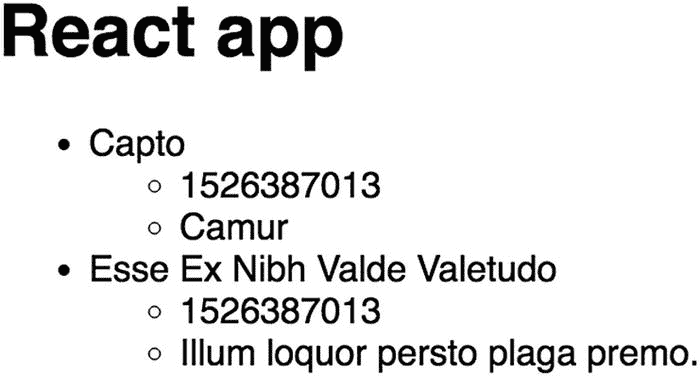
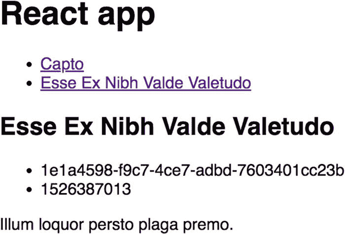
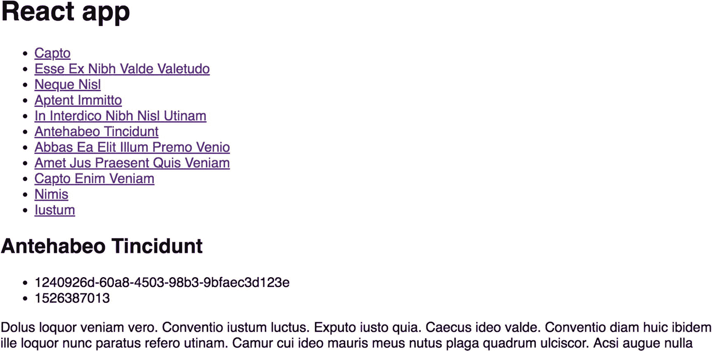

# 17. React

`React` 是一个流行的 JavaScript 视图库，经常与其他技术结合使用来创建单页 JavaScript 应用程序。`React` 于 2013 年由 Facebook 创立，由于其声明式的状态管理、将模板与视图逻辑放在一起，以及相对不固执己见的技术栈（这意味着它与 `Angular`（见第 19 章）和 `Ember`（见第 21 章）最为不同），因此在流行度上迅速超越了其他类似项目。在过去几年中，围绕核心 `React` 库已经发展出了一个广泛的生态系统。

`React` 自称是一个“用于构建用户界面的 JavaScript 库”，并在其主页上声明：

- *React 使创建交互式 UI 变得轻而易举。为你应用中的每种状态设计简单的视图，当数据变化时，React 将高效地更新和渲染正确的组件。* ^(⁷⁹)

与其他框架不同，`React` 强调其作为库的独特特性，而不是传统的模型-视图-控制器（MVC）框架。由于它专注于提供可重用和可嵌套的组件，许多人选择将 `React` 视为 MVC 架构中的视图层。因为它纯粹是一个视图库，架构师经常将其他技术与 `React` 配对，并且在工具选择方面往往缺乏指导。

传统上，使用声明式方法和双向数据绑定的 MVC 框架必须直接将更改应用于 DOM。例如，`AngularJS` 手动更新 DOM 节点。与此同时，`React` 使用*虚拟 DOM*，这是一种抽象的 DOM，允许对不同用户界面状态进行差异比较（对比所有已考虑的差异），从而实现可能最高效的 DOM 操作。

由于整个技术栈中工具覆盖的缺乏，`React` 构建可能特别具有挑战性和负担。在许多 `React` 架构中，需要决定是否使用 `Flux` 架构方法、`Redux` 绑定库以及其他更小的库，如 `react-router`（现在是 `React` 应用程序中最常用的路由库）。`React` 的最后一个缺点是它对 Web Components 的支持不完善，这使得它与 `Ember` 等框架形成对比，并带来了向前兼容性的问题。^(⁸⁰)

### 注意

有关 `React` 的更多信息，请访问网站 [`https://reactjs.org`](https://reactjs.org)。有关 `React` 中对 Web Components 支持的更多信息，请查阅文档 [`https://reactjs.org/docs/web-components.html`](https://reactjs.org/docs/web-components.html)。

## React 中的关键概念

虽然在过去的几年里，`React` 生态系统以其臭名昭著的困难学习曲线而闻名，但如今创建 `React` 应用程序的过程已经简单得多，这要归功于 `create-react-app` 项目，它提供了一个功能完整的 `React` 应用程序，而无需在 `Webpack` 和 `Babel` 等工具中进行额外的构建配置。

### 搭建一个 React 应用程序并安装依赖

要创建一个新的 `create-react-app` 应用程序，请执行以下命令。

```
$ npx create-react-app ddip-react
$ cd ddip-react
$ yarn start
```

最后的命令会启动一个本地服务器，并使你的 `React` 应用程序在 `http://localhost:3000` 可用。你可以使用以下命令轻松创建一个可用于客户端的压缩包。

```
$ yarn build
```


### 注意

`npx` 适用于 `npm` 5.2 及更高版本。

我们还需要在代码库中包含并安装几个依赖项，特别是 `react-router-dom`。作为 React 生态系统中最常用的路由库之一，它不仅提供 `react-router` 的所有功能，还能实现跨路由创建链接。我们将在后续章节介绍如何在 React 中执行路由。请注意，要执行以下命令，你需要打开一个新的终端窗口或停止本地服务器。

```
$ yarn add react-router-dom
```

我们将使用 `axios` 从 Drupal 网站执行检索操作来支持我们的应用；因此也需要包含它。如果你还需要 OAuth 2.0 认证（参见第 9 章），不妨考虑使用已内置该认证功能的 Waterwheel.js（参见第 16 章）。

```
$ yarn add axios
```

完成此步骤后，你的 `package.json` 文件应如下所示。

```
{
"name": "ddip-react",
"version": "0.1.0",
"private": true,
"dependencies": {
"axios": "⁰.18.0",
"react": "¹⁶.5.2",
"react-dom": "¹⁶.5.2",
"react-router-dom": "⁴.3.1",
"react-scripts": "2.0.3"
},
"scripts": {
"start": "react-scripts start",
"build": "react-scripts build",
"test": "react-scripts test",
"eject": "react-scripts eject"
},
"eslintConfig": {
"extends": "react-app"
},
"browserslist": [
">0.2%",
"not dead",
"not ie <= 11",
"not op_mini all"
]
}
```

你的目录结构应如下所示（不包括 `node_modules` 目录）。

```
├── README.md
├── package.json
├── public
│   ├── favicon.ico
│   ├── index.html
│   └── manifest.json
├── src
│   ├── App.css
│   ├── App.js
│   ├── App.test.js
│   ├── index.css
│   ├── index.js
│   ├── logo.svg
│   └── serviceWorker.js
└── yarn.lock
```

### 注意

本章的其余内容大致基于并受 Matt Grill (drpal) 编写的 `react-waterwheel-app` 代码启发，该代码将在第 16 章中介绍。

### 索引组件

如前所述，React 具有可嵌套、可重用的*组件*概念，其中包含一个顶层的根组件。当我们在应用上下文中使用这些组件时，通常需要传入*属性（properties）*，为组件提供需要渲染的差异化信息。

在 `src` 目录中，我们可以创建第一个组件，`create-react-app` 已经为我们搭建好了脚手架，该组件将作为索引（根）组件，所有其他组件都会渲染到其中。我们需要获取所有依赖项。将 `src/App.js` 的内容修改为以下代码。

```
// src/App.js
import React, { Component } from 'react';
import {
BrowserRouter as Router,
Route,
Link
} from 'react-router-dom';
class App extends Component {
constructor(props) {
super(props);
this.state = {};
}
componentWillMount() {
this.setState({
articles: [
{
id: '3ca469da-b905-4a77-8d97-954abcdc4cf6',
attributes: {
title: 'Capto',
uuid: '3ca469da-b905-4a77-8d97-954abcdc4cf6',
created: 1526387013,
body: {
value: 'Camur'
}
}
},
{
id: '1e1a4598-f9c7-4ce7-adbd-7603401cc23b',
attributes: {
title: 'Esse Ex Nibh Valde Valetudo',
uuid: '1e1a4598-f9c7-4ce7-adbd-7603401cc23b',
created: 1526387013,
body: {
value: 'Illum loquor persto plaga premo.'
}
}
}
]
});
}
render() {
return (

React app

);
}
}
export default App;
```

我们依次查看这段代码的每个部分，理解 React 如何处理某些重要元素会很有帮助。首先，我们引入所有依赖项。

```
import React, { Component } from 'react';
import { render } from 'react-dom';
import {
BrowserRouter as Router,
Route,
Link
} from 'react-router-dom';
```

然后，我们实现一个 `Component` 类，并用 React 实例化该组件时定义的任何属性来填充它。

```
class App extends Component {
constructor(props) {
super(props);
this.state = {};
}
```

最后，我们通过使用 `componentWillMount()` 方法接入 React 的组件生命周期来检索数据。在此例中，由于尚未引入 Drupal，我们提供的是虚拟数据。

```
componentWillMount() {
this.setState({
articles: [
{
id: '3ca469da-b905-4a77-8d97-954abcdc4cf6',
attributes: {
title: 'Capto',
uuid: '3ca469da-b905-4a77-8d97-954abcdc4cf6',
created: 1526387013,
body: {
value: 'Camur'
}
}
},
{
id: '1e1a4598-f9c7-4ce7-adbd-7603401cc23b',
attributes: {
title: 'Esse Ex Nibh Valde Valetudo',
uuid: '1e1a4598-f9c7-4ce7-adbd-7603401cc23b',
created: 1526387013,
body: {
value: 'Illum loquor persto plaga premo.'
}
}
}
]
});
}
```

最后，我们渲染组件，但正如你所见，我们尚未提供数据。如果你使用 `npm run start` 打开应用程序，应用将是空的。在下一节中，我们将介绍 React 的原生模板语言 JSX。

### 注意

有关 React 组件的更多信息，请查阅文档：[`https://reactjs.org/docs/components-and-props.html`](https://reactjs.org/docs/components-and-props.html)。

### React 状态与声明式渲染

与其他主流框架和库一样，React 提供了一种原生方法来实现声明式渲染，该方法通过将传入的属性与它们所涉及的组件的标记放在一起来实现。这产生了一种以 JSX 编写的高度清晰的模板，JSX 是 React 对 JavaScript 的语法扩展，看起来类似于 HTML 或 XML。JSX 可用于渲染传统的 HTML 元素以及 React 组件。

我们要做的第一件事是更新我们的 `render()` 方法，添加将文章渲染到应用程序所需的逻辑。考虑以下示例，并更新 `src/App.js` 以反映当前状态。

```
// src/App.js
import React, { Component } from 'react';
import {
BrowserRouter as Router,
Route,
Link
} from 'react-router-dom';
class App extends Component {
constructor(props) {
super(props);
this.state = {};
}
componentWillMount() {
this.setState({
articles: [
{
id: '3ca469da-b905-4a77-8d97-954abcdc4cf6',
attributes: {
title: 'Capto',
uuid: '3ca469da-b905-4a77-8d97-954abcdc4cf6',
created: 1526387013,
body: {
value: 'Camur'
}
}
},
{
id: '1e1a4598-f9c7-4ce7-adbd-7603401cc23b',
attributes: {
title: 'Esse Ex Nibh Valde Valetudo',
uuid: '1e1a4598-f9c7-4ce7-adbd-7603401cc23b',
created: 1526387013,
body: {
value: 'Illum loquor persto plaga premo.'
}
}
}
]
});
}
render() {
return (

React app

{this.state.articles && this.state.articles.map(article => (

{article.attributes.title}

{article.attributes.created}
{article.attributes.body.value}

))}

);
}
}
export default App;
```

仔细审视上面给出的 `render()` 方法。如你所见，在访问状态对象中的值并将其显示在列表中之前，我们正在验证数据是否存在于状态对象中。在此过程中，我们创建了一个简单的内容列表，你可以在图 17-1 中看到。



图 17-1

我们的 React 应用程序的当前状态渲染了虚拟数据

### 注意

有关 JSX 的更多信息，请查阅文档：[`https://reactjs.org/docs/introducing-jsx.html`](https://reactjs.org/docs/introducing-jsx.html)。有关声明式渲染的更多信息，请查阅文档：[`https://reactjs.org/docs/rendering-elements.html`](https://reactjs.org/docs/rendering-elements.html)。


### React 路由与组件

现在，我们将应用拆分为主视图和用于展示单篇文章信息的组件。为此，需要使用 React Router，并向 React 提供一个新组件。在你的 `src` 目录中，创建一个名为 `Article.js` 的新文件。这将成为我们新的文章详情组件。

将以下内容插入到 `src/Article.js` 中。如你所见，我们将原先嵌套列表中的信息提取出来，放入独立的文章详情组件中。我们还为文章数据关联了一个类型，借助 `PropTypes` 的类型检查，可以更轻松地进行调试。

```js
// src/Article.js
import React from 'react';
import PropTypes from 'prop-types';
const Article = ({article}) => (

{article && (

{article.attributes.title}

{article.id}
{article.attributes.created}

{article.attributes.body.value}

)}

);
Article.propTypes = {
article: PropTypes.object
};
export default Article;
```

现在，我们可以更新 index 组件，添加文章选择逻辑。首先，需要导入新的 `Article` 组件，以便 index 组件能够识别它。然后，需要提供一个路由机制，允许根据文章标识符选择并渲染文章。请参考 `src/App.js` 的以下新状态。

```js
// src/App.js
import React, { Component } from 'react';
import {
BrowserRouter as Router,
Route,
Link
} from 'react-router-dom';
import Article from './Article.js';
class App extends Component {
constructor(props) {
super(props);
this.state = {};
}
componentWillMount() {
this.setState({
articles: [
{
id: '3ca469da-b905-4a77-8d97-954abcdc4cf6',
attributes: {
title: 'Capto',
uuid: '3ca469da-b905-4a77-8d97-954abcdc4cf6',
created: 1526387013,
body: {
value: 'Camur'
}
}
},
{
id: '1e1a4598-f9c7-4ce7-adbd-7603401cc23b',
attributes: {
title: 'Esse Ex Nibh Valde Valetudo',
uuid: '1e1a4598-f9c7-4ce7-adbd-7603401cc23b',
created: 1526387013,
body: {
value: 'Illum loquor persto plaga premo.'
}
}
}
]
});
}
render() {
return (

React app

{this.state.articles && this.state.articles.map(article => (

{article.attributes.title}

))}

{this.state.articles &&
 {
let article = this.state.articles.find(article => article.id === match.params.articleID);
return ();
}
}/>
}

);
}
}
export default App;
```

再次查看应用时，可以看到点击任意文章链接后，详情组件会渲染出来，如图 17-2 所示。



图 17-2

当我们点击其中一个链接时，可以看到详情组件更新，且 URL 会变为 `/articles/` 后接选中文章的 UUID。

### 注意

关于 React 组件的更多信息，请查阅文档： [`https://reactjs.org/docs/components-and-props.html`](https://reactjs.org/docs/components-and-props.html)。

## 用 Drupal 和 JSON API 为 React 提供后端支持

为了用 API 暴露的真实数据支持 React 应用，我们使用了在第八章和第十二章构建的 Drupal 网站的最终状态，该站点提供了一个符合 JSON API 规范的 Web 服务。如果你还没有搭建一个带有生成内容并启用了 JSON API 的 Drupal 站点，请先回到第八章和第十二章继续操作。

### 使用 `axios` 获取 Drupal 数据

现在有了 `axios`，我们可以向 Drupal 发出请求，获取填充应用所需的真实数据内容项。用以下内容替换 `src/App.js`，它用基于 `axios` 的 Promise 替换了 `componentWillMount()` 中的虚拟数据。请注意，我们现在通过一个新的 `import` 语句引入了 `axios` 依赖。

```js
// src/App.js
import React, { Component } from 'react';
import {
BrowserRouter as Router,
Route,
Link
} from 'react-router-dom';
import axios from 'axios';
import Article from './Article.js';
class App extends Component {
constructor(props) {
super(props);
this.state = {};
}
componentWillMount() {
axios.get('http://jsonapi-test.dd:8083/jsonapi/node/article')
.then(res => this.setState( { articles: res.data.data }))
.catch(console.log);
}
render() {
return (

React app

{this.state.articles && this.state.articles.map(article => (

{article.attributes.title}

))}

{this.state.articles &&
 {
let article = this.state.articles.find(article => article.id === match.params.articleID);
return ();
}
}/>
}

);
}
}
export default App;
```

回到应用，可以看到 Drupal 数据现在正确地填充了 React 应用。这也如图 17-3 所示。



图 17-3

回到应用，表明我们现在已成功填充了 Drupal 数据。

### 注意

关于 `axios` 的更多信息，请查阅文档： [`https://github.com/axios/axios`](https://github.com/axios/axios)。


#### 处理错误与加载状态

现在，我们可以添加一些错误处理机制和加载状态，以防 Drupal 站点响应缓慢。不过，要实现这一点，我们需要在 React 应用以及 Promise 处理中考虑错误与加载状态。将`src/App.js`的内容替换为以下代码，即可查看效果。

```javascript
// src/App.js
import React, { Component } from 'react';
import {
BrowserRouter as Router,
Route,
Link
} from 'react-router-dom';
import axios from 'axios';
import Article from './Article.js';
class App extends Component {
constructor(props) {
super(props);
this.state = {
articles: [],
loading: true,
errored: false
};
}
componentWillMount() {
axios.get('http://jsonapi-test.dd:8083/jsonapi/node/article')
.then(res => this.setState({ articles: res.data.data }))
.catch(err => {
console.log(err);
this.setState({ errored: true });
})
.finally(() => this.setState({ loading: false }));
}
render() {
return (

React app
{this.state.errored ? (
抱歉，当前无法获取{'this'}信息。
) : (

{this.state.loading ? (
加载中...
) : (

{this.state.articles && this.state.articles.map(article => (

{article.attributes.title}

))}

{this.state.articles &&
 {
let article = this.state.articles.find(article => article.id === match.params.articleID);
return ();
}
}/>
}

)}

)}

);
}
}
export default App;
```

这里有不少内容需要深入分析，我们来逐一剖析这个代码示例。首先，我们向 React 的状态机声明了`errored`和`loading`这两个初始状态，它们分别被设置为`false`和`true`。

```javascript
constructor(props) {
super(props);
this.state = {
articles: [],
loading: true,
errored: false
};
}
```

然后，在`componentWillMount()`方法中，我们增强了错误处理，并在 Promise 完全兑现后将`loading`状态调整为`true`。

```javascript
componentWillMount() {
axios.get('http://jsonapi-test.dd:8083/jsonapi/node/article')
.then(res => this.setState({ articles: res.data.data }))
.catch(err => {
console.log(err);
this.setState({ errored: true });
})
.finally(() => this.setState({ loading: false }));
}
```

接着，在`render()`方法中，我们使用三元运算符来检查`loading`和`errored`状态是否为`true`。在第一个条件语句中，如果`errored`状态返回`true`，则仅显示错误信息。否则，如果`loading`状态为`true`，则会显示一个加载占位符，直到 Promise 兑现，之后继续渲染。

请注意以下代码段中，由于`this`是 JavaScript 和 JSX 中的保留字，我们在第二行将其包裹在一个表达式中。此外，由于 JSX 表达式需要一个外层标签，我们添加了一个`<section>`元素来包含处理`loading`状态的控制结构。

```javascript
{this.state.errored ? (
抱歉，当前无法获取{'this'}信息。
) : (

{this.state.loading ? (
加载中...
) : (

{this.state.articles && this.state.articles.map(article => (

{article.attributes.title}

))}

{this.state.articles &&
 {
let article = this.state.articles.find(article => article.id === match.params.articleID);
return ();
}
}/>
}

)}

)}
```

你可以在图 17-4 和 17-5 中看到我们刚刚完成的效果。


**图 17-5** 当 Promise 仍处于待定状态时，我们会看到一条加载消息，直到 Promise 兑现


**图 17-4** 当 Promise 抛出错误时，我们会收到一条错误消息

### 注意

有关 React 条件渲染的更多信息，请查阅文档[`reactjs.org/docs/conditional-rendering.html`](https://reactjs.org/docs/conditional-rendering.html)。

### 结论

React 推广了许多如今在 JavaScript 社区中广泛采用的概念，包括虚拟 DOM 和 JSX 的底层哲学。由于其范围有限但功能强大，React 成为了解耦 Drupal 的消费者中的热门选择。尽管如此，由于缺乏明确观点和规范的最佳实践，React 可能成为一个难以驾驭且充满挑战的工具，不过在整个生态系统中，这一状况正在迅速改善。

在下一章中，我们将转向 React Native，它利用了 React 的许多原则，以便通过 React 创建强大的原生桌面或移动应用。尽管还有其他示例（包括但不限于 Ionic 和 Electron）支持使用 JavaScript 创建原生应用，但由于 React Native 的广泛流行和采用，我们选择专注于它。

脚注 1 2

