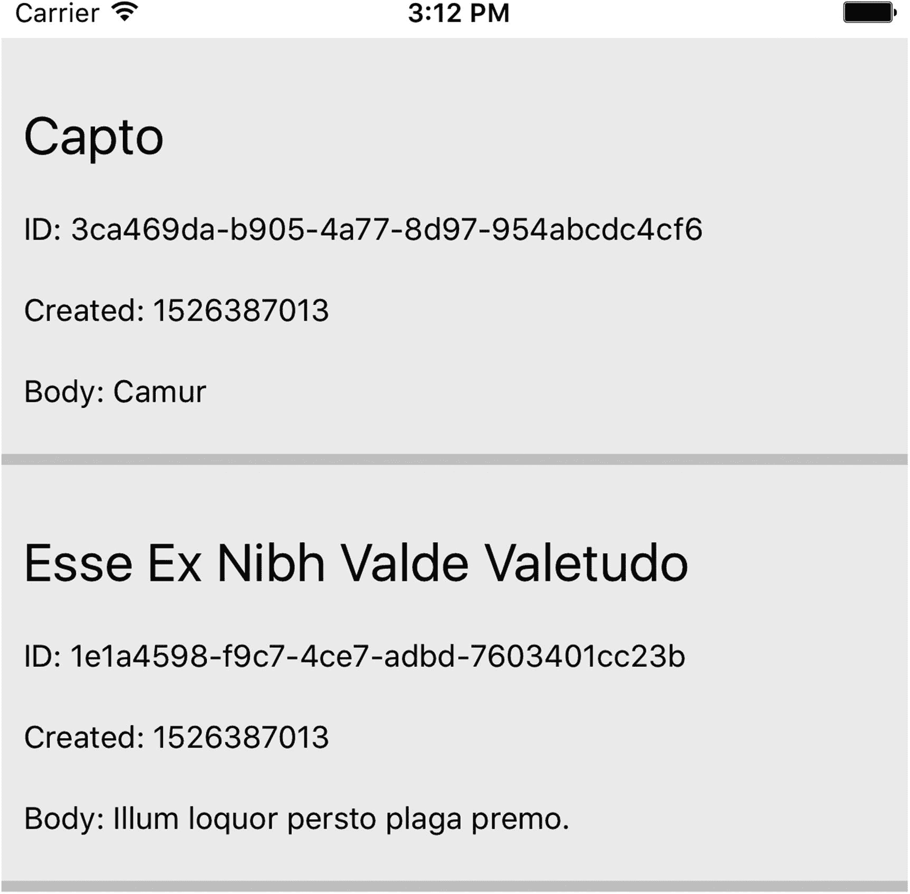
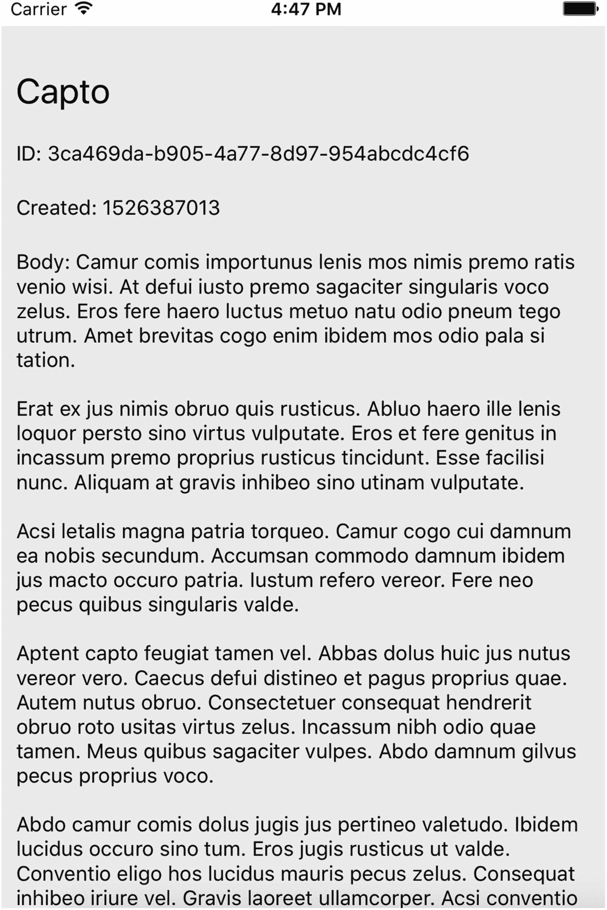

# 18. React Native

React Native 是一个流行的框架，它利用了 React 的一些最熟悉的功能，例如其可嵌套的组件架构和 JSX 模板系统的细微差别。然而，有几个关键区别将 React Native 与其他 JavaScript 框架区分开来。首先，由于 React Native 专注于原生应用开发，它不允许使用任何传统的 HTML 元素。

React Native 的官网对其独特的定位进行了如下描述：

> *使用 React Native，你构建的并不是“移动 Web 应用”、“HTML5 应用”或“混合应用”。你构建的是一个真正的移动应用，它与使用 Objective-C 或 Java 构建的应用无法区分。React Native 使用了与常规 iOS 和 Android 应用相同的基本 UI 构建块。你只需使用 JavaScript 和 React 将这些构建块组合在一起。* ^((81))

由于我们已经对 React 有一定的了解（参见第 17 章），我们将快速转向区分 React Native 与 React 的元素，以及从 React Native 消费者的上下文中消费 Drupal 数据的过程。

### 注意

有关 React Native 的更多信息，请查阅网站[`facebook.github.io/react-native`](https://facebook.github.io/react-native)。

## React Native 的关键概念

如果你已经熟悉我们在上一章中详细介绍的关于 React 的开发方法，那么下一节将是驾轻就熟的领域。然而，React Native 有许多特性，这些特性体现了其对原生移动应用而非传统 Web 应用的重视。


### 搭建 React Native 应用框架

与 React 生态系统类似，React Native 也提供了一个应用脚手架工具，可加快 React Native 项目的启动过程。要安装 Expo CLI，请执行以下命令。

```
$ npm install -g expo-cli
```

安装完该包之后，你可以调用 `expo` 命令在本地搭建一个新的 React Native 项目。Expo CLI 会询问你想要一个已包含标签导航的应用，还是一个空白模板。我们选择**空白模板**作为我们的模板。

```
$ expo init DdipReactNative
$ cd DdipReactNative
```

要启动打包器（允许我们以多种方式测试应用），请执行以下命令。

```
$ expo start
```

打包器运行后，在运行打包器的终端窗口中，你可以输入 `a` 来启动一个可用的 Android 模拟器，或者输入 `i` 来启动 iOS 模拟器。在本章中，我们使用 Xcode 内置的 iOS 模拟器。你还可以使用其他命令，例如输入 `s` 将应用的 URL 发送到手机号码或电子邮件地址，或者输入 `q` 显示二维码。

由于我们将再次利用 `axios` 库向 Drupal 发起请求，我们可以按如下方式将其添加到依赖项中。

```
$ yarn add axios
```

在安装过程结束时，你的 `package.json` 清单文件应如下所示。

```
{
"name": "empty-project-template",
"main": "node_modules/expo/AppEntry.js",
"private": true,
"scripts": {
"start": "expo start",
"android": "expo start --android",
"ios": "expo start --ios",
"eject": "expo eject"
},
"dependencies": {
"axios": "⁰.18.0",
"expo": "³⁰.0.1",
"react": "16.3.1",
"react-native": "https://github.com/expo/react-native/archive/sdk-30.0.0.tar.gz"
}
}
```

此外，你的目录结构应如下所示（不包括 `node_modules` 目录）。

```
├── App.js
├── app.json
├── assets
│   ├── icon.png
│   └── splash.png
├── package.json
└── yarn.lock
```

完成这些步骤后，我们现在可以讨论 React 和 React Native 之间最显著的区别。

### 注意

有关设置 React Native 的更多信息，请查阅位于 [`https://facebook.github.io/react-native/docs/getting-started`](https://facebook.github.io/react-native/docs/getting-started) 的文档。

### React Native 视图

与 React 一样，React Native 主要操作*视图*，即数据的显示。默认的 `View` 组件是一个占据整个屏幕且不可滚动的视图。在某些场景下，由于我们预期会有大量的文本内容，我们稍后还会用到 `ScrollView` 组件。`ScrollView` 默认可以垂直滚动，如果设置了 `horizontal` 属性（`<ScrollView horizontal/>`），也可以水平滚动。

此外，我们将利用 `FlatList` 组件来提供一个文章列表。`FlatList` 组件接受两个属性：`data`（列表需要渲染的数据）和 `renderItem`（表示列表中的一项，并返回每个项目将渲染成的组件）。

让我们从第 17 章 React 应用的中间状态开始，调整一些初始代码以适应 React Native 的细微差别。将 `App.js` 替换为以下代码，并特别注意我们已将所有的 HTML 元素替换为了 React Native 元素。另请注意引用 React Native 的 `import` 语句。

```
// App.js
import React from 'react';
import { FlatList, StyleSheet, Text, View } from 'react-native';
export default class App extends React.Component {
constructor(props) {
super(props);
this.state = {};
}
componentWillMount() {
this.setState({
articles: [
{
id: '3ca469da-b905-4a77-8d97-954abcdc4cf6',
attributes: {
title: 'Capto',
uuid: '3ca469da-b905-4a77-8d97-954abcdc4cf6',
created: 1526387013,
body: {
value: 'Camur'
}
}
},
{
id: '1e1a4598-f9c7-4ce7-adbd-7603401cc23b',
attributes: {
title: 'Esse Ex Nibh Valde Valetudo',
uuid: '1e1a4598-f9c7-4ce7-adbd-7603401cc23b',
created: 1526387013,
body: {
value: 'Illum loquor persto plaga premo.'
}
}
}
]
});
}
render() {
return (

 item.id}
renderItem={({item}) => {item.attributes.title}}
/>

);
}
}
const styles = StyleSheet.create({
container: {
flex: 1,
backgroundColor: '#fff',
paddingTop: 22
},
item: {
padding: 10,
fontSize: 18,
height: 44,
},
});
```

我们逐一介绍这段代码中不熟悉的部分。首先，我们的 `render()` 方法使用我们提供给状态对象的虚拟数据渲染了一个 `FlatList` 组件。然后，我们渲染列表中的每一项。`FlatList` 的默认行为期望每个数据项中都包含一个唯一的可缓存的 `key` 键，但由于我们使用 JSON API，我们需要覆盖此行为以改用包含 UUID 的 `id` 属性。

```
render() {
return (

 item.id}
renderItem={({item}) => {item.attributes.title}}
/>

);
}
```

最后，我们包含了几个样式对象，这些对象在 `View` 和 `FlatList` 组件中被调用。特别注意，由于传统 CSS 在 React Native 环境中不可用，我们使用了一些独特的约定，包括 CSS 属性名采用 `camelCase` 形式。

```
const styles = StyleSheet.create({
container: {
flex: 1,
backgroundColor: '#fff',
paddingTop: 22
},
item: {
padding: 10,
fontSize: 18,
height: 44,
},
});
```

在 iOS 模拟器中生成的应用程序如图 18-1 所示。


**图 18-1** 我们的 iOS 模拟器显示渲染到 `FlatList` 组件中的虚拟文章

### 注意

有关 `FlatList` 和列表视图的更多信息，请查阅位于 [`https://facebook.github.io/react-native/docs/using-a-listview`](https://facebook.github.io/react-native/docs/using-a-listview) 的文档。

### React Native 样式

在继续之前，由于我们计划提供一个包含文章相关信息的文章详情组件，我们可以调整应用程序以包含一些额外的属性和增强的样式集。修改你的 `App.js` 文件，使其如下所示，并注意新增的 `ScrollView` 导入。

```
// App.js
import React from 'react';
import { FlatList, ScrollView, StyleSheet, Text, View } from 'react-native';
export default class App extends React.Component {
constructor(props) {
super(props);
this.state = {};
}
componentWillMount() {
this.setState({
articles: [
{
id: '3ca469da-b905-4a77-8d97-954abcdc4cf6',
attributes: {
title: 'Capto',
uuid: '3ca469da-b905-4a77-8d97-954abcdc4cf6',
created: 1526387013,
body: {
value: 'Camur'
}
}
},
{
id: '1e1a4598-f9c7-4ce7-adbd-7603401cc23b',
attributes: {
title: 'Esse Ex Nibh Valde Valetudo',
uuid: '1e1a4598-f9c7-4ce7-adbd-7603401cc23b',
created: 1526387013,
body: {
value: 'Illum loquor persto plaga premo.'
}
}
}
]
});
}
render() {
return (

 item.id}
renderItem={({item}) => (

{item.attributes.title}
ID: {item.id}
Created: {item.attributes.created}
Body: {item.attributes.body.value}

)}
/>

);
}
}
const styles = StyleSheet.create({
container: {
flex: 1,
backgroundColor: '#fff',
paddingTop: 22,
},
item: {
padding: 10,
backgroundColor: '#eee',
borderBottomColor: '#ccc',
borderBottomWidth: 5,
},
itemHeading: {
marginTop: 10,
paddingTop: 10,
paddingBottom: 10,
fontSize: 24,
},
itemAttribute: {
paddingTop: 10,
paddingBottom: 10,
}
});
```

这些最新更改的结果如图 18-2 所示。



**图 18-2** 我们的 React Native 应用现在采用了一些样式，以改善用户体验并区分各篇独立文章


### 注意

有关 `ScrollView` 的更多信息，请查阅 [`https://facebook.github.io/react-native/docs/using-a-scrollview`](https://facebook.github.io/react-native/docs/using-a-scrollview) 上的文档。有关 React Native 样式的更多信息，请查阅 [`https://facebook.github.io/react-native/docs/style`](https://facebook.github.io/react-native/docs/style) 上的文档。

### React Native 组件

将所有代码放在一个文件中很快就变得难以管理。正如我们在上一章中成功所做的那样，我们也可以将列表逻辑拆分到一个单独的组件中，以保持良好的关注点分离。首先，添加以下 `Article.js` 组件。

```
// Article.js
import React from 'react';
import { StyleSheet, Text, View } from 'react-native';
import PropTypes from 'prop-types';
const Article = ({article}) => (

{article.attributes.title}
ID: {article.id}
Created: {article.attributes.created}
Body: {article.attributes.body.value}

);
Article.propTypes = {
article: PropTypes.object
};
const styles = StyleSheet.create({
item: {
padding: 10,
backgroundColor: '#eee',
borderBottomColor: '#ccc',
borderBottomWidth: 5,
},
itemHeading: {
marginTop: 10,
paddingTop: 10,
paddingBottom: 10,
fontSize: 24,
},
itemAttribute: {
paddingTop: 10,
paddingBottom: 10,
}
});
export default Article;
```

然后，我们可以调整 `App.js` 文件以反映新组件的存在。请特别注意声明对该组件依赖的 `import` 语句。

```
// App.js
import React from 'react';
import { FlatList, ScrollView, StyleSheet, Text, View } from 'react-native';
import Article from './Article.js';
export default class App extends React.Component {
constructor(props) {
super(props);
this.state = {};
}
componentWillMount() {
this.setState({
articles: [
{
id: '3ca469da-b905-4a77-8d97-954abcdc4cf6',
attributes: {
title: 'Capto',
uuid: '3ca469da-b905-4a77-8d97-954abcdc4cf6',
created: 1526387013,
body: {
value: 'Camur'
}
}
},
{
id: '1e1a4598-f9c7-4ce7-adbd-7603401cc23b',
attributes: {
title: 'Esse Ex Nibh Valde Valetudo',
uuid: '1e1a4598-f9c7-4ce7-adbd-7603401cc23b',
created: 1526387013,
body: {
value: 'Illum loquor persto plaga premo.'
}
}
}
]
});
}
render() {
return (

 item.id}
renderItem={({item}) => (

)}
/>

);
}
}
const styles = StyleSheet.create({
container: {
flex: 1,
backgroundColor: '#fff',
paddingTop: 22,
},
});
```

重新加载应用程序后，应该不会看到与图 18-2 有任何变化，因为我们只是移动了代码。

### 注意

有关 React Native 中原生组件的更多信息，请查阅 [`https://facebook.github.io/react-native/docs/components-and-apis`](https://facebook.github.io/react-native/docs/components-and-apis) 上的文档。React Native 中的堆栈导航（类似于 React 路由）因其相对不稳定性而超出了本章的范围，但其文档可在 [`https://reactnavigation.org`](https://reactnavigation.org) 上找到。

## 使用 Drupal 和 JSON API 作为 React Native 的后端

我们将使用一个现有的 Drupal 站点作为 React Native 应用程序的后端，该站点公开了我们在第 8 章和第 12 章中配置和构建的 JSON API。如果你没有一个功能完备、启用了 JSON API 并填充了一些内容的 Drupal 站点，请返回第 8 章和第 12 章，以全面了解 Drupal 的 JSON API 实现。

### 使用 `axios` 检索 Drupal 数据

就像我们在第 17 章中所做的那样，我们可以使用 `axios` 将我们的虚拟数据替换为来自 Drupal 的实际数据。考虑以下 `App.js` 的新状态，其结果如图 18-3 所示。



图 18-3

完整的文章正文表明，我们的文章已按预期正确地从 Drupal 站点获取

```
// App.js
import React from 'react';
import { FlatList, ScrollView, StyleSheet, Text, View } from 'react-native';
import axios from 'axios';
import Article from './Article.js';
export default class App extends React.Component {
constructor(props) {
super(props);
this.state = {};
}
componentWillMount() {
axios.get('http://jsonapi-test.dd:8083/jsonapi/node/article')
.then(res => this.setState({ articles: res.data.data }))
.catch(console.log);
}
render() {
return (

 item.id}
renderItem={({item}) => (

)}
/>

);
}
}
const styles = StyleSheet.create({
container: {
flex: 1,
backgroundColor: '#fff',
paddingTop: 22,
},
});
```

### 注意

有关 React Native 中网络功能的更多信息，请查阅 [`https://facebook.github.io/react-native/docs/network`](https://facebook.github.io/react-native/docs/network) 上的文档。有关 `axios` 的更多信息，请查阅 [`https://github.com/axios/axios`](https://github.com/axios/axios) 上的文档。

### 处理错误和加载状态

与 Web 应用程序的常见情况一样，向用户指示数据视图尚未渲染的不同场景对我们来说很重要。幸运的是，我们只需重复在第 17 章中的工作，即可为我们的 React Native 应用程序提供 `errored`（错误）和 `loading`（加载）状态。请考虑以下 `App.js` 的新状态。

```
// App.js
import React from 'react';
import { FlatList, ScrollView, StyleSheet, Text, View } from 'react-native';
import axios from 'axios';
import Article from './Article.js';
export default class App extends React.Component {
constructor(props) {
super(props);
this.state = {
articles: [],
errored: false,
loading: true
};
}
componentWillMount() {
axios.get('http://jsonapi-test.dd:8083/jsonapi/node/article')
.then(res => this.setState({ articles: res.data.data }))
.catch(err => {
console.log(err);
this.setState({ errored: true });
})
.finally(() => this.setState({ loading: false }));
}
render() {
return (

{this.state.errored ? (
抱歉，当前无法获取此信息。
) : (

{this.state.loading ? (
加载中...
) : (
 item.id}
renderItem={({item}) => (

)}
/>

)}
)}

);
}
}
const styles = StyleSheet.create({
container: {
flex: 1,
backgroundColor: '#fff',
paddingTop: 22,
},
});
```

现在，我们可以断开 Drupal 网站的连接，会发现我们的应用程序不会返回网络错误，而是会显示错误消息，如图 18-4 所示。此外，我们还会看到一个加载状态，它会反馈我们的应用程序确实在正常运行，如图 18-5 所示。


图 18-5

当我们首次加载应用程序时，请求正在处理中，应用程序会显示加载信息


图 18-4

当我们断开 Drupal 站点连接时，请求未能完成，应用程序会显示错误信息


### 结论

React Native 是一种强大且稳健的替代方案，可用于替代使用 Objective-C 和 Swift 等移动技术编写原生移动应用，因为它使我们能够沿用已熟悉的 **React** 约定。得益于这两种技术的相似性，熟悉 React 的开发人员可以相对快速地开始构建 React Native 应用。尽管如此，React Native 的生态系统仍在扩展，诸如 React Navigation 等工具也在迅速成熟。

在下一章中，我们将研究 **Angular**，这是一个完全不同的框架，拥有许多独特特性，使其既引人入胜又时而令人沮丧。尽管在有限的篇幅内无法全面介绍 TypeScript 及其细微差别，也无法对 Angular 进行详尽综述，但我们仍将构建一个由解耦 Drupal 支持的等效 Angular 应用。

脚注 1

