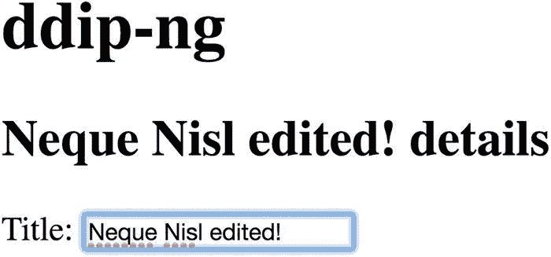
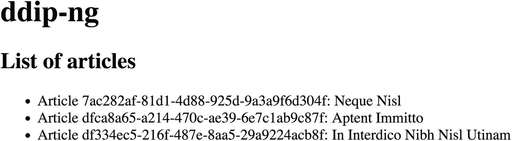
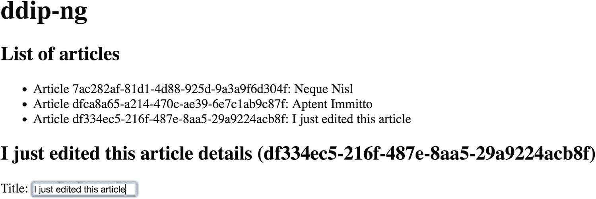
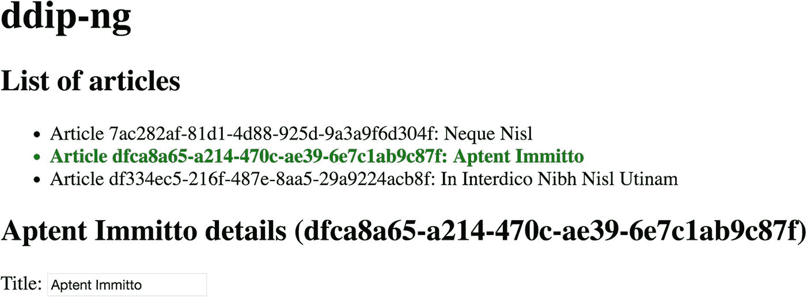
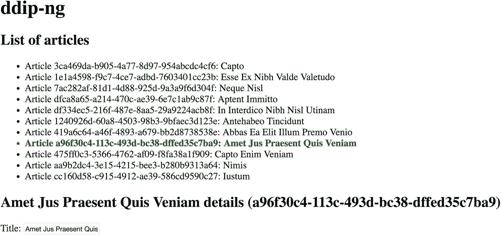

# 19. Angular

Angular 是一个有着悠久历史的 JavaScript 框架，但在过去几年中经历了重大演变，以至于与其前身 AngularJS 相比几乎面目全非。如今，Angular 利用 TypeScript，并强调其使命是成为一个统一的框架，用于构建跨越 Web、移动端以及原生移动和桌面应用的应用体验。

Angular 文档说明如下：

> Angular 是一个平台，可以轻松地使用 Web 构建应用。Angular 结合了声明式模板、依赖注入、端到端工具以及集成的最佳实践，以解决开发挑战。Angular 使开发者能够构建适用于 Web、移动端或桌面的应用。

与 Ember（参见第 21 章）一样，Angular 以其相当固执己见的开发实践而闻名，最明显的证据是它要求开发者使用 TypeScript。尽管如此，其丰富的生态系统，加上其跨设备能力，使得 Angular 成为那些为解耦 Drupal 架构选择 JavaScript 技术的人的一个有吸引力的候选方案。

### 注意

有关 Angular 的完整文档，请参阅 Angular 网站：[`https://angular.io`](https://angular.io)。

## Angular 中的关键概念

由于 Angular 使用 TypeScript，为你的代码编辑器安装一个能识别 TypeScript 语法的包可能会很有用。如果你使用 Atom 作为代码编辑器，可以通过以下命令为 Atom 安装 TypeScript 包。

```
$ apm install atom-typescript
```

### 注意

Atom 代码编辑器可从 [`https://atom.io`](https://atom.io) 下载。

### 搭建 Angular 应用脚手架

与 Ember 和 Vue.js（参见第 20 章）一样，Angular 有一个官方命令行界面，称为 Angular CLI，可简化 Angular 开发过程中的某些任务。要全局安装 Angular CLI，请执行以下命令。

```
$ npm install -g @angular/cli
```

Angular CLI 以及任何由 Angular CLI 生成的项目都需要 Node 8.9 或更高版本以及 NPM 5.5.1 或更高版本。你可以分别使用 `node -v` 和 `npm -v` 命令来验证你的版本是否是最新的。

### 注意

有关安装 Node.js 的更多信息，请查阅网站 [`https://nodejs.org/en/download`](https://nodejs.org/en/download)。有关安装 NPM 的更多信息，请查阅网站 [`https://docs.npmjs.com/getting-started/installing-node#install-npm--manage-npm-versions`](https://docs.npmjs.com/getting-started/installing-node%2523install-npm%252D%252Dmanage-npm-versions)。如果你有其他项目依赖于其他版本的 Node，请考虑使用诸如 Node Version Manager 之类的工具，该工具可在 GitHub 上获取：[`https://github.com/creationix/nvm`](https://github.com/creationix/nvm)。

我们可以使用以下命令创建一个新项目，并启动一个带有热重载功能的本地开发服务器。按顺序，以下命令会在我们选择的目录中搭建一个新的 Angular 应用，进入该目录，并启动一个本地服务器。`--open` 标志将在浏览器中打开一个包含该应用的标签页。

```
$ ng new ddip-ng
$ cd ddip-ng
$ ng serve --open
```

一旦搭建好一个新的 Angular 应用，你的目录结构将如下所示（不包括 `node_modules` 目录）。

```
├── README.md
├── angular.json
├── e2e
│   ├── protractor.conf.js
│   ├── src
│   │   ├── app.e2e-spec.ts
│   │   └── app.po.ts
│   └── tsconfig.e2e.json
├── package-lock.json
├── package.json
├── src
│   ├── app
│   │   ├── app.component.css
│   │   ├── app.component.html
│   │   ├── app.component.spec.ts
│   │   ├── app.component.ts
│   │   └── app.module.ts
│   ├── assets
│   ├── browserslist
│   ├── environments
│   │   ├── environment.prod.ts
│   │   └── environment.ts
│   ├── favicon.ico
│   ├── index.html
│   ├── karma.conf.js
│   ├── main.ts
│   ├── polyfills.ts
│   ├── styles.css
│   ├── test.ts
│   ├── tsconfig.app.json
│   ├── tsconfig.spec.json
│   └── tslint.json
├── tsconfig.json
└── tslint.json
```

现在，我们可以使用 Atom 打开该应用并开始编写代码。^(⁸²) 你也可以使用你选择的、包含 TypeScript 支持的代码编辑器。

```
$ atom .
```

### 根组件

与其他流行的 JavaScript 应用框架一样，Angular 使用可重用且可嵌套的组件，包括应用根组件。当我们打开 `src/app/app.component.ts` 时，我们会看到我们可以更改应用的总体标题。

```
// src/app/app.component.ts
import { Component } from '@angular/core';
@Component({
selector: 'app-root',
templateUrl: './app.component.html',
styleUrls: ['./app.component.css']
})
export class AppComponent {
title = 'ddip-ng';
}
```

在本章中，我们将构建一个能够访问 Drupal 中内容实体的简单内容浏览器。为此，由于 TypeScript 是一种静态类型语言，我们需要定义一个与 Drupal bundle（Drupal 内容类型）匹配的类，并考虑其属性的类型，如下例所示。

在我们将 Angular 应用连接到 Drupal 之前，我们将暂时使用虚拟数据。

```
// src/app/app.component.ts
import { Component } from '@angular/core';
export class Article {
attributes: object;
}
@Component({
selector: 'app-root',
templateUrl: './app.component.html',
styleUrls: ['./app.component.css']
})
export class AppComponent {
title = 'ddip-ng';
article: Article = {
attributes: {
uuid: '7ac282af-81d1-4d88-925d-9a3a9f6d304f',
title: 'Neque Nisl',
body: {
value: 'At interdico letalis modo qui.'
}
}
}
}
```

### 双向数据绑定

我们还可以修改根组件，使其显示一篇虚拟文章并附带一个 `<input>` 元素，以演示*双向数据绑定*。在此场景中，`ngModel` 是一个指令，我们需要通过在 `FormsModule` 上声明额外的依赖来添加它，如下方 `app.module.ts` 中所示。

```
// src/app/app.module.ts
import { BrowserModule } from '@angular/platform-browser';
import { NgModule } from '@angular/core';
import { FormsModule } from '@angular/forms';
import { AppComponent } from './app.component';
@NgModule({
declarations: [
AppComponent
],
imports: [
BrowserModule,
FormsModule
],
providers: [],
bootstrap: [AppComponent]
})
export class AppModule { }
```

现在，将`app.component.html`的内容替换为以下内容。

```
{{title}}
{{article.attributes.title}} details
Title: 
```

由于 Angular 强制执行双向数据绑定，我们可以编辑此`<input>`元素，并看到标题随之更新。您可以在图 19-1 中看到应用程序的当前状态。



图 19-1

当我们在`<input>`元素中进行编辑时，双向数据绑定确保值会立即更新。

### 注意

有关 Angular 表单的更多信息，请查阅文档[`https://angular.io/guide/user-input`](https://angular.io/guide/user-input)。从这个示例开始，本章中的许多示例都灵感来源于 Angular 文档中的“英雄之旅”教程，该教程位于[`https://angular.io/tutorial`](https://angular.io/tutorial)。

### Angular 组件

为了获得更好的可维护性，我们可以生成一个组件来容纳所有处理文章显示的逻辑。要生成新组件，请在退出运行中的服务器（按`Ctrl+C`）或打开新的终端窗口后，执行以下命令。

```
$ ng generate component articles
```

如果您导航到`src/app/app.module.ts`，您将看到 Angular 已使用对新组件的引用更新了根模块。

```
// src/app/app.module.ts
import { BrowserModule } from '@angular/platform-browser';
import { NgModule } from '@angular/core';
import { FormsModule } from '@angular/forms';
import { AppComponent } from './app.component';
import { ArticlesComponent } from './articles/articles.component';
@NgModule({
declarations: [
AppComponent,
ArticlesComponent
],
imports: [
BrowserModule,
FormsModule
],
providers: [],
bootstrap: [AppComponent]
})
export class AppModule { }
```

现在，在我们的根组件中，我们可以引用刚刚创建的新组件，并将所有逻辑移到文章组件中。请注意，此示例被分成两个独立的文件，由 HTML 注释分隔。

```
{{title}}
{{article.attributes.title}} details
Title: 
```

我们还需要相应地更新根组件和文章组件的行为。

```
// src/app/articles/articles.component.ts
import { Component } from '@angular/core';
export class Article {
attributes: object
}
@Component({
selector: 'app-articles',
templateUrl: './articles.component.html',
styleUrls: ['./articles.component.css']
})
export class ArticlesComponent {
title = 'ddip-ng';
article: Article = {
attributes: {
uuid: '7ac282af-81d1-4d88-925d-9a3a9f6d304f',
title: 'Neque Nisl',
body: {
value: 'At interdico letalis modo qui.'
}
}
}
}
// src/app/app.component.ts
import { Component } from '@angular/core';
@Component({
selector: 'app-root',
templateUrl: './app.component.html',
styleUrls: ['./app.component.css']
})
export class AppComponent {
title = 'ddip-ng';
}
```

让我们提供一些虚拟数据作为常量，以便我们能够遍历多篇文章。为此，我们创建一个组件可访问的公共属性，如下例所示。

```
// src/app/articles/articles.component.ts
import { Component } from '@angular/core';
export class Article {
attributes: object;
}
const ARTICLES: Article[] = [
{
attributes: {
uuid: '7ac282af-81d1-4d88-925d-9a3a9f6d304f',
title: 'Neque Nisl',
body: {
value: 'At interdico letalis modo qui.'
}
}
},
{
attributes: {
uuid: 'dfca8a65-a214-470c-ae39-6e7c1ab9c87f',
title: 'Aptent Immitto',
body: {
value: 'Exputo molior nobis patria quadrum saepius valde.'
}
}
},
{
attributes: {
uuid: 'df334ec5-216f-487e-8aa5-29a9224acb8f',
title: 'In Interdico Nibh Nisl Utinam',
body: {
value: 'Cui refoveo similis.'
}
}
}
];
@Component({
selector: 'app-articles',
templateUrl: './articles.component.html',
styleUrls: ['./articles.component.css']
})
export class ArticlesComponent {
title = 'ddip-ng';
articles = ARTICLES;
}
```

### 注意

有关 Angular 组件的更多信息，请查阅文档[`https://angular.io/guide/architecture-components`](https://angular.io/guide/architecture-components)。

### Angular 指令

在 Angular 中，`指令`用于指示渲染模板时开发者所期望的逻辑。我们也可以创建自定义指令，以对 DOM 元素施加自定义行为。

我们可以深入 articles 组件，通过提供一个文章列表（而不是一个用于编辑文章标题的字段）来丰富模板。我们可以使用`ngFor`指令来遍历刚刚提供给组件的虚拟文章。最终，我们将允许用户在选中某篇具体文章时编辑其标题。

```
文章列表

文章 {{article.attributes.uuid}}：{{article.attributes.title}}

```

其结果如图 19-2 所示。



图 19-2

我们的虚拟文章正确显示了

为了恢复编辑文章标题的功能，我们将提供点击行为。当点击一篇文章时，我们需要显示之前演示过双向数据绑定的表单。为此，我们可以为每个列表项添加一个`click`事件绑定。

# 文章列表

文章 `{{article.attributes.uuid}}`：`{{article.attributes.title}}`

我们在 `articles.component.ts` 中定义了 `onSelect()` 方法，如下例所示。

```typescript
// src/app/articles/articles.component.ts
import { Component } from '@angular/core';
export class Article {
attributes: object;
}
const ARTICLES: Article[] = [
{
attributes: {
uuid: '7ac282af-81d1-4d88-925d-9a3a9f6d304f',
title: 'Neque Nisl',
body: {
value: 'At interdico letalis modo qui.'
}
}
},
{
attributes: {
uuid: 'dfca8a65-a214-470c-ae39-6e7c1ab9c87f',
title: 'Aptent Immitto',
body: {
value: 'Exputo molior nobis patria quadrum saepius valde.'
}
}
},
{
attributes: {
uuid: 'df334ec5-216f-487e-8aa5-29a9224acb8f',
title: 'In Interdico Nibh Nisl Utinam',
body: {
value: 'Cui refoveo similis.'
}
}
}
];
@Component({
selector: 'app-articles',
templateUrl: './articles.component.html',
styleUrls: ['./articles.component.css']
})
export class ArticlesComponent {
title = 'ddip-ng';
articles = ARTICLES;
selectedArticle: Article;
onSelect(article: Article): void {
this.selectedArticle = article;
}
}
```

然后，在模板中，我们可以重新插入之前缺失的逻辑，并绑定到我们新定义的 `selectedArticle` 属性，而不是 `article` 属性。为了更容易识别选中的文章，我们还包含了 UUID。最后，我们可以使用 `ngIf` 指令来确保不会因尝试引用尚未选中的文章标题而抛出任何错误。本例的结果如图 19-3 所示。



图 19-3

在此示例中，我们点击了列表中的第三篇文章并编辑了标题，这会更新在其上方渲染的绑定属性

```
文章列表

文章 {{article.attributes.uuid}}：{{article.attributes.title}}

{{selectedArticle.attributes.title}} 详情 ({{selectedArticle.attributes.uuid}})

标题：

```

将来，我们可能希望对这篇文章应用某些样式，以便其活动状态清晰可见。将 `articles.component.html` 更新如下。

```
文章列表

文章 {{article.attributes.uuid}}：{{article.attributes.title}}

{{selectedArticle.attributes.title}} 详情 ({{selectedArticle.attributes.uuid}})

标题：

```

然后，将以下选择器添加到 `articles.component.css` 中，以便区分选中的文章。其结果如图 19-4 所示。



图 19-4

得益于少量 CSS，现在从列表中哪篇文章被选中一目了然

```css
/* src/app/articles.component.css */
.selected {
font-weight: bold;
color: green;
}
```

### 注意

有关 Angular 指令的更多信息，请查阅关于属性型指令的文档（[`https://angular.io/guide/attribute-directives`](https://angular.io/guide/attribute-directives)）和关于结构型指令的文档（[`https://angular.io/guide/structural-directives`](https://angular.io/guide/structural-directives)）。

### Angular 服务

现在我们已经介绍了组件的一些细节（全面探讨超出了本书的范围），可以将注意力转向服务了。正如我们在 Ember 中也将看到的那样（见第 21 章），让组件同时充当数据提供者并不是最佳实践，因为我们最终期望将应用程序连接到 Web 服务。在 Angular 中，*服务*是一个广泛的概念，代表应用程序中的依赖项——无论是值、函数还是其他特性——并且通常服务于单一、明确的目的。

因此，我们应该提供一个服务，为任何依赖它的组件提供数据。这意味着我们可以将数据与单个组件解耦，并提供一种通用的数据检索方式。例如，在我们的场景中，我们希望创建一个为组件提供文章数据的服务。要生成新服务，请执行以下命令。

```bash
$ ng generate service article
```

这会在我们的 `src/app` 目录中创建一个 `article.service.ts` 文件。因为我们知道最终需要从 Web 服务检索文章，所以可以添加一个 `getArticles()` 方法。

```typescript
// src/app/article.service.ts
import { Injectable } from '@angular/core';
@Injectable({
providedIn: 'root'
})
export class ArticleService {
getArticles(): void {}
}
```

然后，我们可以从文章组件中移除模拟文章，并将其放入一个单独的文件中。这样做是为了让我们的服务更容易检索文章。创建 `dummy-articles.ts` 并插入以下内容。

```typescript
// src/app/dummy-articles.ts
import { Article } from './articles/articles.component';
export const ARTICLES: Article[] = [
{
attributes: {
uuid: '7ac282af-81d1-4d88-925d-9a3a9f6d304f',
title: 'Neque Nisl',
body: {
value: 'At interdico letalis modo qui.'
}
}
},
{
attributes: {
uuid: 'dfca8a65-a214-470c-ae39-6e7c1ab9c87f',
title: 'Aptent Immitto',
body: {
value: 'Exputo molior nobis patria quadrum saepius valde.'
}
}
},
{
attributes: {
uuid: 'df334ec5-216f-487e-8aa5-29a9224acb8f',
title: 'In Interdico Nibh Nisl Utinam',
body: {
value: 'Cui refoveo similis.'
}
}
}
];
```

在从文章组件导出的部分中，我们移除了包含模拟数据的常量，并向 Angular 指明 `articles` 属性由一组文章构成。

```typescript
// src/app/articles/articles.component.ts
import { Component } from '@angular/core';
export class Article {
attributes: object;
}
@Component({
selector: 'app-articles',
templateUrl: './articles.component.html',
styleUrls: ['./articles.component.css']
})
export class ArticlesComponent {
title = 'ddip-ng';
articles: Article[];
selectedArticle: Article;
onSelect(article: Article): void {
this.selectedArticle = article;
}
}
```

然后，我们可以调整文章服务，使其改用模拟文章。

```typescript
// src/app/article.service.ts
import { Injectable } from '@angular/core';
import { Article } from './articles/articles.component'
import { ARTICLES } from './dummy-articles';
@Injectable({
providedIn: 'root'
})
export class ArticleService {
getArticles(): Article[] {
return ARTICLES;
}
}
```

在文章组件中，我们通过 `import` 语句将服务添加为依赖项，使用依赖注入添加一个私有的 `articleService` 属性，并通过构造函数将该属性标记为 `ArticleService` 的注入目标。然后，我们将 `ArticleService` 添加到 `@Component` 装饰器底部的 `providers` 数组中，以确保 Angular 知道每次初始化新文章组件时都要创建一个新的 `ArticleService`。最后，我们可以通过向导出部分添加 `getArticles()` 方法来添加一个专门用于检索文章的方法。

```typescript
// src/app/articles/articles.component.ts
import { Component } from '@angular/core';
import { ArticleService } from '../article.service'
export class Article {
attributes: object;
}
@Component({
selector: 'app-articles',
templateUrl: './articles.component.html',
styleUrls: ['./articles.component.css'],
providers: [ArticleService]
})
export class ArticlesComponent {
title = 'ddip-ng';
articles: Article[];
selectedArticle: Article;
constructor(private articleService: ArticleService) { }
getArticles(): void {
this.articles = this.articleService.getArticles();
}
onSelect(article: Article): void {
this.selectedArticle = article;
}
}
```

为了确保 Angular 在初始化时立即调用 `getArticles()`，我们将该方法包含在 `ngOnInit()` 生命周期钩子中。请注意，在下面的示例中，我们还包含了 `OnInit` 作为依赖项，并在 `export` 语句中注明文章组件实现了 `OnInit`。

```typescript
// src/app/articles/articles.component.ts
import { Component, OnInit } from '@angular/core';
import { ArticleService } from '../article.service'
export class Article {
attributes: object;
}
@Component({
selector: 'app-articles',
templateUrl: './articles.component.html',
styleUrls: ['./articles.component.css'],
providers: [ArticleService]
})
export class ArticlesComponent implements OnInit {
title = 'ddip-ng';
articles: Article[];
selectedArticle: Article;
constructor(private articleService: ArticleService) { }
getArticles(): void {
this.articles = this.articleService.getArticles();
}
ngOnInit(): void {
this.getArticles();
}
onSelect(article: Article): void {
this.selectedArticle = article;
}
}
```

### 注意

有关 Angular 服务的更多信息，请查阅文档 [`https://angular.io/guide/architecture-services`](https://angular.io/guide/architecture-services)。

## 使用 Drupal 和 JSON API 作为 Angular 的后端

现在我们已经为 Angular 应用提供了一个服务来从模拟数据集中检索数据，接下来需要准备 Angular 应用以使用 Drupal 实现的 JSON API。为此，我们需要重构文章服务中的 `getArticles()` 方法，使其能够处理可观察对象。

如果您还没有按照第 8 章和第 12 章所述设置并准备好 Drupal 中的 JSON API 后端，请返回这些章节以确保您能够继续。

### 为 Angular 添加 `HttpClient`

我们现在需要将文章服务指向我们的 Drupal JSON API 实现，以便直接从后端检索数据。首先，在应用模块中包含 `HttpClientModule`，如下所示。请仔细检查新的 `import` 语句以及 `imports` 数组中新增的成员。

```typescript
// src/app/app.module.ts
import { BrowserModule } from '@angular/platform-browser';
import { NgModule } from '@angular/core';
import { FormsModule } from '@angular/forms';
import { HttpClientModule } from '@angular/common/http';
import { AppComponent } from './app.component';
import { ArticlesComponent } from './articles/articles.component';
@NgModule({
declarations: [
AppComponent,
ArticlesComponent
],
imports: [
BrowserModule,
FormsModule,
HttpClientModule
],
providers: [],
bootstrap: [AppComponent]
})
export class AppModule { }
```

### 注意

有关 `HttpClient` 的更多信息，请查阅文档 [`https://angular.io/guide/http`](https://angular.io/guide/http)。

### 从 Drupal 检索数据并处理 Observable

现在我们已经有了所需的依赖项，包括 `HttpClientModule` 中提供的 `HttpClient` 和 `HttpHeaders`，我们可以更新文章服务，以从之前准备好的 Drupal JSON API 实现中检索所需数据。

考虑以下示例，特别注意我们引入的其他用于处理 Observable 和错误的依赖项。注意，由于不同环境的差异，最佳实践是将指向 Drupal 后端的 URI 存储在一个单独的配置文件（例如 `config.ts`）中。

```typescript
// src/app/article.service.ts
import { Injectable } from '@angular/core';
import { HttpClient, HttpHeaders } from '@angular/common/http';
import { Observable, of } from 'rxjs';
import { catchError, map } from 'rxjs/operators';
import { Article } from './articles/articles.component'
const httpOptions = {
headers: new HttpHeaders({ 'Content-Type': 'application/json' })
}
@Injectable({
providedIn: 'root'
})
export class ArticleService {
private articlesUrl = 'http://jsonapi-test.dd:8083/jsonapi/node/article';
constructor(private http: HttpClient) {}
getArticles(): Observable {
return this.http.get(this.articlesUrl, httpOptions)
.pipe(
map(res => res['data'])
)
.pipe(
catchError(this.handleError([]))
);
}
private handleError (result?: T) {
return (error: any): Observable => {
console.error(error);
return of(result as T);
}
}
}
```

从 Drupal 的角度仔细审视其中一些元素会有所启发。注意，由于 JSON API 要求一个值为 `application/json` 的 `Content-Type` 头，我们除了导入 `HttpClient` 外，还导入了 `HttpHeaders`。接着，我们设置了请求应发往的 URL。然后，我们定义了方法 `getArticles()`，它返回一个 Observable，每当其中包含的文章发生变化时，该 Observable 就会通知我们。

由于 JSON API 将所有数据作为 `data` 对象的一部分返回，而不是作为简单的数组（更多内容请参见第 8 章），因此我们需要使用 `map()` 函数将响应映射到其构成的 `data` 对象，以便访问其下的资源数组。最后，我们执行了一些基本的错误处理，并将抛出的任何错误记录到控制台。

### 注意

有关 Observable 的更多信息，请查阅文档 [`https://angular.io/guide/observables`](https://angular.io/guide/observables)。有关 Angular 中 Observable 的更多信息，请查阅文档 [`https://angular.io/guide/observables-in-angular`](https://angular.io/guide/observables-in-angular)。

### 在组件中订阅 Observable

由于我们现在已更新文章服务，使其使用从 JSON API 检索的数据填充的 Observable，而不是一个虚拟常量，因此我们的最后一步是修改文章组件，使其正确处理来自文章服务的 Observable。将你的文章组件更新为以下内容。

```typescript
// src/app/articles/articles.component.ts
import { Component, OnInit } from '@angular/core';
import { ArticleService } from '../article.service'
export class Article {
attributes: object;
}
@Component({
selector: 'app-articles',
templateUrl: './articles.component.html',
styleUrls: ['./articles.component.css'],
providers: [ArticleService]
})
export class ArticlesComponent implements OnInit {
title = 'ddip-ng';
articles: Article[];
selectedArticle: Article;
constructor(private articleService: ArticleService) { }
getArticles(): void {
this.articleService.getArticles()
.subscribe(articles => this.articles = articles);
}
ngOnInit(): void {
this.getArticles();
}
onSelect(article: Article): void {
this.selectedArticle = article;
}
}
```

如你所见，现在我们在订阅 Observable，以便在应用程序需要了解的任何数据发生变化时得到通知。接着，我们向 `subscribe()` 方法传入一个 observer（观察者），它负责处理我们收到的通知。

当我们回到浏览器中的应用程序时，可以看到它现在已完全填充了来自 JSON API 的文章，而不是我们的虚拟列表，并且当我们点击显示的文章之一时，表单仍然按预期显示。这个最终状态如图 19-5 所示。



**图 19-5** 我们由 Angular 驱动的内容浏览器的最终状态，使用了直接从 Drupal 的 JSON API 检索的内容

### 注意

关于 Observable 在 Angular 应用程序中其他实用场景的更多信息，请查阅文档 [`https://angular.io/guide/practical-observable-usage`](https://angular.io/guide/practical-observable-usage)。

### 结论

Angular 是开发基于 Drupal 的消费者应用程序的一个强大且稳健的选择。其最丰富的特性包括内置的 Observable 支持、功能齐全的 HTTP 客户端、类似于其他框架的组件驱动方法，以及得益于静态类型语言 TypeScript 而带来的良好开发者体验。尽管如此，一些开发者可能会发现，由于采用了 TypeScript，Angular 的学习曲线变得陡峭，尤其是那些更习惯于 AngularJS 旧有范式的开发者。

在下一章，我们将完全转换方向，转向 Vue，由于其独特的渐进式采用方法，它与 Angular 有着显著的不同。Angular 是一个功能强大的庞然大物，提供了一系列复杂但高效的功能，而 Vue 则倾向于一种不那么固执己见的导向，阐明了一系列开发者可以探索的方向。与 Angular 类似，Vue 受益于基于组件的架构，并在模板中使用指令。

**脚注** 1