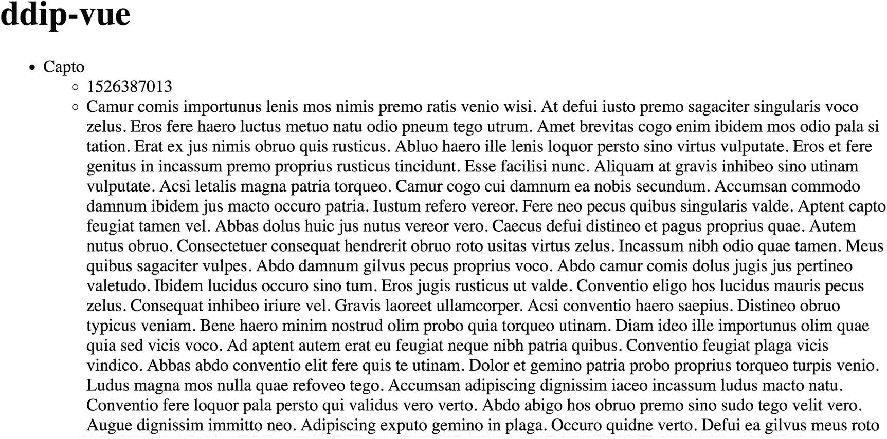

# 使用 yarn

```
$ yarn global add @vue/cli
```

Vue CLI 安装完成后，你可以使用它来搭建全新的应用程序，这些应用会包含大型 Vue.js 项目所需的预期目录结构。同时，它还能启动一个便捷的用户界面，让你只需几个简单步骤就能创建新应用。下方的第一个命令会在创建应用时提供更多选项。第二个命令则列出所有可用选项，第三个命令则提供一个用户界面，用于搭建新的 Vue.js 应用。

```
$ vue create my-vue-app
$ vue create --help
$ vue ui
```

如果你想使用现有模板，请执行以下命令，通过模板来初始化 Vue.js，而不是使用 `vue create` 命令。例如，以下命令使用 `webpack-simple` 模板创建了一个新的 Vue.js 应用。

```
$ vue init webpack-simple my-vue-app
$ cd my-vue-app
$ npm install
$ npm run dev
```

Vue.js 还提供了丰富的插件生态系统，你可以利用它为你的应用添加功能。例如，`vue add` 命令允许我们通过将插件添加到开发依赖项中，将其安装到现有项目中。

```
$ vue add @vue/eslint
$ vue add @vue/cli-plugin-eslint
```

在项目根目录的 `~/.vuerc` 配置文件中，你还可以向 Vue.js 注册某些设置，从而使特定插件按特定方式运行。在以下示例中，我们设置 `@vue/cli-plugin-eslint` 使用 Drupal 采用的 Airbnb JavaScript 风格指南。

```
{
  "useConfigFiles": true,
  "router": true,
  "vuex": true,
  "cssPreprocessor": "sass",
  "plugins": {
    "@vue/cli-plugin-babel": {},
    "@vue/cli-plugin-eslint": {
      "config": "airbnb",
      "lintOn": ["save", "commit"]
    }
  }
}
```

## 用 Drupal 和 JSON API 支持 Vue.js

在构建我们以 Drupal 为后端的 Vue.js 应用过程中，我们将回顾在第 12 章中创建的 Drupal 网站的最终状态。如果你还没有建立一个启用了 JSON API 并包含内容的网站，请返回第 12 章，确保你按照步骤将 JSON API 声明为依赖项并启用了该模块。

### 搭建 Vue.js 应用

首先，我们可以使用以下命令来搭建一个新的 Vue.js 应用。在这些示例中，我们使用 `yarn` 来处理我们的依赖项。出于我们的目的，在搭建新的 Vue.js 应用时，我们将选择 `default` 选项，该选项将包含 `babel`（ES6 转译）和 `eslint`（代码检查）的插件。

```
$ vue create ddip-vue
$ cd ddip-vue
```

要在本地服务器上测试我们的 Vue.js 应用，我们可以执行以下命令，该命令将在 `http://localhost:8080` 上显示标准的欢迎信息。

```
$ yarn serve
```

在我们的 Vue.js 应用中，我们将使用 `axios` HTTP 客户端来提供我们所需的与 Drupal 的双向通信。`axios` 是一个基于 Promise 的 HTTP 客户端，它也是 Waterwheel.js 库（参见第 16 章）的一部分，并且能够向任意后端发出 HTTP 请求。`axios` 可以作为依赖项包含进来，要么通过 `npm` 或 `yarn` 作为最终客户端构建的一部分，要么通过指向内容分发网络（CDN）的嵌入方式引入。

出于我们的目的，我们使用以下命令将 `axios` 添加为依赖项。请注意，你需要停止服务器（Ctrl+C）或打开一个新的终端窗口才能继续下一步。

```
$ yarn add axios
```

你的目录结构将如下所示（不包括 `node_modules` 目录）。

```
├── README.md
├── babel.config.js
├── package.json
├── public
│   ├── favicon.ico
│   └── index.html
├── src
│   ├── App.vue
│   ├── assets
│   │   └── logo.png
│   ├── components
│   │   └── HelloWorld.vue
│   └── main.js
└── yarn.lock
```

### 使用 `axios` 检索 Drupal 数据

将 `HelloWorld.vue` 替换为一个名为 `Articles.vue` 的组件，其内容如下。在此示例中，我们创建了一个文章集合的视图，并将其分配给 `articles` 属性，然后传递给模板进行渲染。

```
<template>
  <div>
    <article v-for="article in articles" :key="article.id">
      <h2>{{ article.attributes.title }}</h2>
      <p>{{ article.attributes.created }}</p>
      <p>{{ article.attributes.body.value }}</p>
    </article>
  </div>
</template>

<script>
import axios from 'axios';
export default {
  name: 'Articles',
  data () {
    return {
      articles: []
    };
  },
  mounted () {
    this.getArticles();
  },
  methods: {
    getArticles () {
      axios.get('http://jsonapi-test.dd:8083/jsonapi/node/article')
        .then(res => this.articles = res.data.data)
        .catch(err => {
          throw new Error(err);
        });
    }
  }
}
</script>
```

然后，将 `App.vue` 替换为以下内容。

```
<template>
  <div id="app">
    <Articles/>
  </div>
</template>

<script>
import Articles from './components/Articles.vue'
export default {
  name: 'app',
  components: {
    Articles
  }
}
</script>
```

### 处理错误和加载状态

思考以下改编自 Vue.js 文档的示例，如果 Promise 抛出错误，它会显示一条错误消息；当 Promise 正在完成时，则显示一条正在加载的消息。如果我们禁用 Acquia Dev Desktop，你将看到错误消息出现。

```
<template>
  <div>
    <div v-if="errored">
      <p>抱歉，此信息目前不可用。</p>
    </div>
    <div v-else>
      <div v-if="loading">
        <p>加载中……</p>
      </div>
      <div v-else>
        <article v-for="article in articles" :key="article.id">
          <h2>{{ article.attributes.title }}</h2>
          <p>{{ article.attributes.created }}</p>
          <p>{{ article.attributes.body.value }}</p>
        </article>
      </div>
    </div>
  </div>
</template>

<script>
import axios from 'axios';
export default {
  name: 'Articles',
  data () {
    return {
      articles: [],
      loading: true,
      errored: false
    };
  },
  mounted () {
    this.getArticles();
  },
  methods: {
    getArticles () {
      axios.get('http://jsonapi-test.dd:8083/jsonapi/node/article')
        .then(res => this.articles = res.data.data)
        .catch(err => {
          this.errored = true;
          throw new Error(err);
        })
        .finally(() => this.loading = false);
    }
  }
}
</script>
```

现在，我们可以查看 Vue.js 应用的最终结果，并继续添加其他对用户体验至关重要的元素，例如 CSS。你可以在图 20-1 中看到这一点。你也可以在图 20-2 中看到错误状态。从这里开始，我们可以对针对 JSON API 的请求应用各种过滤器和排序操作，或者提供处理其他 Drupal bundles 的组件。


**图 20-2** 当我们禁用本地环境时，得益于我们的错误处理，应用程序会显示一条错误消息



**图 20-1** 我们的 Vue.js 应用的结果显示了我们从 JSON API 请求的集合

> **注意：** 有关如何执行 `PATCH`、`POST` 和 `DELETE` 请求的 `axios` 文档，请参阅 [`https://github.com/axios/axios`](https://github.com/axios/axios)。

### 结论

正如你在本章的示例中所见，Vue.js 的灵活性和渐进式可采纳性使其区别于我们在本书中介绍的其他 JavaScript 项目。在本章中，我们介绍了 Vue.js 的一些基本概念，包括声明式渲染、指令和组件构成。我们还使用了嵌入式脚本来演示 Vue.js 不仅可以通过完整的命令行界面使用，还可以作为一个资源文件使用。最后，我们探讨了将 `axios` 与 Vue.js 结合使用，从 Drupal 的 JSON API 实现中检索资源的过程。

在下一章中，我们将注意力转向 Ember，尽管它是一个高度固执己见的框架，但它强调愉快的开发者体验。正如我们将看到的，它包含一个内置的 JSON API 数据适配器，这极大地加速了构建以 Drupal 为后端的 Ember 应用程序的过程。在此过程中，我们将触及 Ember 中一些独特的细微差别，以及它们在应用程序开发过程中的作用。

---

**脚注**

21. Ember


