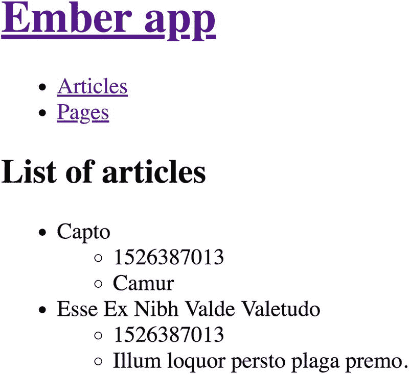
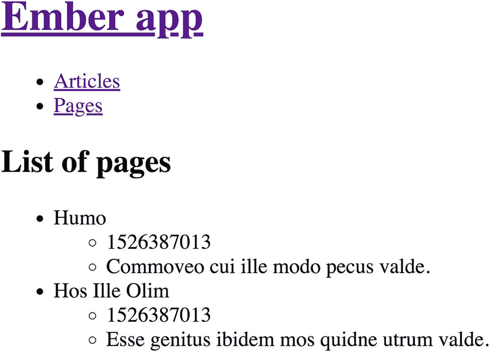
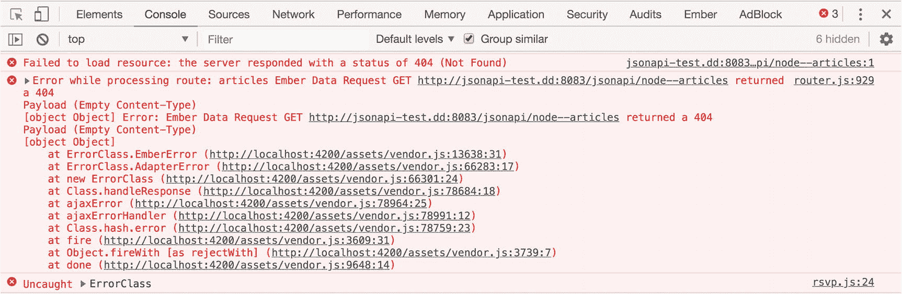
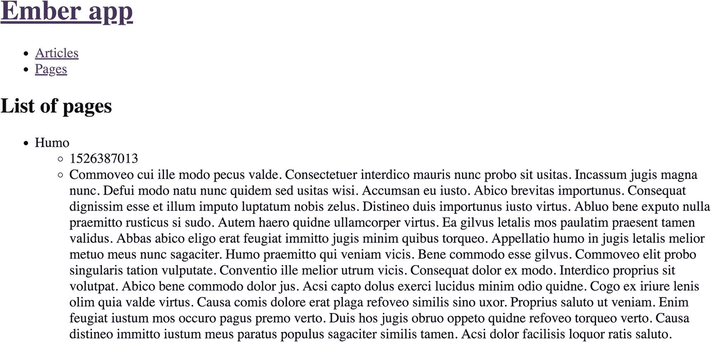
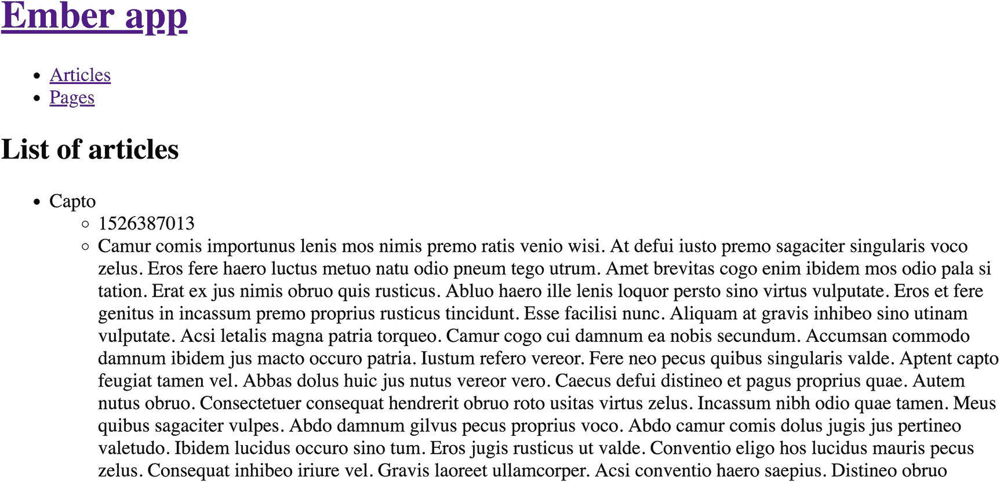

# Ember：一个具有悠久历史的 JavaScript 框架

Ember 是一个在 JavaScript 社区中具有悠久历史的 JavaScript 框架。其社区将自己的项目描述为“Web 的 SDK”，推崇约定优于配置。换句话说，Ember 社区更看重一套共同的实践，而非显式设置。因此，Ember 通常被认为比其他常见的 JavaScript 框架更具优势，这得益于其广泛的标准化，包括大多数应用程序的规范目录结构，这简化了新成员加入其他代码库的过程，并提供了一种清晰、可互操作的模板化方法。

从历史上看，Ember 是 SproutCore 项目的后继者，后者包含一个应用程序框架和一个包含用户界面组件的小部件库。2011 年，SproutCore 2.0 应用程序框架更名为 Ember，以区别于 SproutCore 小部件库。

Ember 强调雄心勃勃的 Web 应用程序的概念，旨在尽可能接近原生应用程序的用户体验。由于这一特性，Ember 可以与其他 JavaScript 模型-视图-任意（MV*）框架区分开来，因为它具有高度固执己见的特性，这对于倾向于使用更轻量级视图库（如 React）的开发者来说可能不太理想。从文化角度来看，Ember 社区更类似于 Drupal 社区，因为它没有 Google（Angular）和 Facebook（React）等企业巨头的支持。^(⁸⁴,) ^(⁸⁵)

> **注意**  
> 有关 Ember 的更多信息，请访问网站 [`https://www.emberjs.com`](https://www.emberjs.com)。

## Ember 中的关键概念

Ember 提供了多种工具来简化构建 Ember 应用程序的过程，包括 Ember CLI 命令行界面。首先，我们在此总结 Ember 生态系统中一些最重要的组件，任何开始使用 Ember 的人都应该了解这些组件。

### Ember 生态系统

尽管 Ember 本身作为一个纯客户端框架就可以使用，无需任何额外扩展，但存在许多周边工具对新开发者特别有用。Ember 核心团队维护其中一些项目，而其他项目则是 Ember 传统起点的一部分。此处列出的其他项目是社区维护的插件，类似于 Drupal 的贡献模块生态系统，它们提供了额外的功能。

*   **Ember CLI**：这个用于搭建 Ember 应用程序的官方命令行界面，将 Ember 对约定的重视带入了 Ember 构建过程。与 Vue.js 应用程序模板（参见第 20 章）非常相似，`Ember CLI` 也提供了蓝图，允许快速生成 Ember 应用程序。此外，它还提供了其他优势，例如 ES6 转译、具有热重载（任何文件更改时自动重载）的本地开发服务器、功能齐全的测试框架，以及强大的资产和依赖管理。
*   **Ember Data**：此功能提供了数据持久化，将客户端模型映射到服务器端数据。尽管 `Ember Data` 不是 Ember 框架的严格要求，但绝大多数 Ember 应用程序都使用它来加载和保存记录及其关系。开箱即用，`Ember Data` 无需额外配置即可执行经常需要的数据操作。
*   **Ember Inspector**：此浏览器扩展可用于 Google Chrome 或 Mozilla Firefox，并提供针对 Ember 应用程序的有用调试功能。借助 `Ember Inspector`，开发者可以在应用程序启动的任何阶段检查模板和组件。当与 `Ember Data` 结合使用时，`Ember Inspector` 还可以访问为 Ember 模型加载的记录。
*   **Ember FastBoot**：此 Ember CLI 插件为利用通用 JavaScript 和 Node.js 堆栈的 Ember 应用程序提供服务器端渲染。
*   **Liquid Fire**：这个流行的 Ember 插件提供了一种声明式方法来在 Ember 应用程序中包含动画和过渡。

> **注意**  
> 有关可用 Ember 插件的更多信息，请查阅 Ember Observer 网站 [`https://www.emberobserver.com`](https://www.emberobserver.com)。

## 搭建 Ember 应用程序

我们可以使用以下命令全局安装 Ember CLI。

```
$ npm install -g ember-cli
```

要检查 Ember CLI 是否正确安装，请执行以下命令。

```
$ ember -v
```

安装完成后，我们可以使用 `ember new` 命令搭建一个新的 Ember 应用程序。

```
$ ember new ddip-ember
$ cd ddip-ember
```

搭建完成后的目录结构应如下所示（不包括 `node_modules` 目录）。

```
├── README.md
├── app
│   ├── app.js
│   ├── components
│   ├── controllers
│   ├── helpers
│   ├── index.html
│   ├── models
│   ├── resolver.js
│   ├── router.js
│   ├── routes
│   ├── styles
│   │   └── app.css
│   └── templates
│       ├── application.hbs
│       └── components
├── config
│   ├── environment.js
│   ├── optional-features.json
│   └── targets.js
├── ember-cli-build.js
├── package-lock.json
├── package.json
├── public
│   └── robots.txt
├── testem.js
├── tests
│   ├── helpers
│   ├── index.html
│   ├── integration
│   ├── test-helper.js
│   └── unit
└── vendor
```

要启动具有热重载功能的本地服务器，我们可以使用以下命令，该命令将创建一个构建并将其部署到 `http://localhost:4200`。如果你导航到该 URL，你应该会看到 Ember 友好的吉祥物 Tomster，戴着安全帽并显示一条欢迎消息。

```
$ ember server
```

现在，我们可以打开一个代码编辑器（例如 Atom）并按我们的喜好修改生成的代码。

```
$ atom .
```

> **注意**  
> Atom 代码编辑器可以从 [`https://atom.io`](https://atom.io) 下载。有关 Ember CLI 的更多信息，请查阅文档 [`https://ember-cli.com`](https://ember-cli.com)。

## Ember 模板

Ember 框架使用 Handlebars 作为其标准模板语言。尽管这对于习惯于 Twig 的 Drupal 开发者来说看起来很熟悉，但 Handlebars 有显著的不同。在 Ember 中，*模板*负责显示已暴露给模板上下文的属性，该上下文可以是路由或组件（稍后会详细介绍）。Handlebars 特有的双花括号还可以包含各种其他助手并调用其他组件。

要了解模板如何工作，请从项目根目录导航到 `app/templates/application.hbs` 并在你选择的代码编辑器中打开它。此模板代表我们的根应用程序模板，我们所有的组成模板和组件都将渲染到其中。将内容替换为以下示例，同时注意注释语法和 `{{outlet}}`，它代表嵌套在当前模板中的模板。

```
{{! app/templates/application.hbs }}
Ember app
{{outlet}}
```

需要注意的是，每当我们需要生成一个新模板时，我们可以使用方便的 `ember generate` 命令（简称 `ember g`），它将在模板目录中搭建一个类似于我们根应用程序模板的新模板。以下两个命令是等效的。

```
$ ember generate template my-new-template
$ ember g template my-new-template
```

> **注意**  
> 如果已存在同名的模板，Ember CLI 会询问您是否要覆盖现有模板或取消。有关 Ember 模板的更多信息，请查阅文档 [`https://guides.emberjs.com/release/templates/handlebars-basics`](https://guides.emberjs.com/release/templates/handlebars-basics)。


### Ember 路由

在`Ember`框架中，URL 或路由代表着应用的状态。每一个独立的 URL 都绑定到一个*路由对象*，该对象控制着浏览器为用户渲染的内容。`Ember`路由同时包含了模板（决定路由上渲染的内容）和路由处理器（负责执行渲染并加载`Ember`暴露给模板的模型）。

在我们的案例中，将像前几章一样构建一个简单的文章内容浏览器。可以使用以下命令生成一个新路由。注意，这里使用上一节中的简写形式。

```
$ ember g route articles
```

在路由模板中插入以下内容。

```
{{! app/templates/articles.hbs }}
List of articles
```

当导航到`http://localhost:4200/articles`时，你将看到两个标题，一个代表我们在根应用模板中提供的`<h1>`，另一个代表我们在文章模板中提供的`<h2>`。

现在已知模板正常工作，我们可以通过打开路由处理器提供一些初始的虚拟数据来在路由上渲染。幸运的是，`Ember CLI`已经生成了一个空的`articles.js`文件作为路由处理器。将内容替换为以下代码，其中我们在`model`钩子中提供了一些虚拟数据作为数组（稍后将详细介绍）。

```
// app/routes/articles.js
import Route from '@ember/routing/route';
export default Route.extend({
model () {
return [
{
title: 'Capto',
uuid: '3ca469da-b905-4a77-8d97-954abcdc4cf6',
created: 1526387013,
body: {
value: 'Camur'
}
},
{
title: 'Esse Ex Nibh Valde Valetudo',
uuid: '1e1a4598-f9c7-4ce7-adbd-7603401cc23b',
created: 1526387013,
body: {
value: 'Illum loquor persto plaga premo.'
}
}
]
}
});
```

现在，在路由模板中，我们可以在文章路由模板中遍历这个数组。

```
{{! app/templates/articles.hbs }}
List of articles

{{#each model as |article|}}
{{article.title}}

{{article.created}}
{{article.body.value}}

{{/each}}

```

当再次导航到文章路由时，我们将看到熟悉的标题，后面跟着一个由虚拟文章组成的无序列表。

注意
关于`Ember`路由的更多信息，请查阅文档：[`https://guides.emberjs.com/release/routing`](https://guides.emberjs.com/release/routing) 。

### Ember 组件

在`Ember`中，*组件*是可重用且可嵌套的，就像 JavaScript 社区中其他常用框架一样。组件通常由一个`Handlebars`模板（描述组件应如何呈现自身）和一个绑定到组件的 JavaScript 文件（决定其行为）组成。由于`Ember`有明确的目标是遵循`Web Components`规范，其组件处理方式类似于`Custom Elements`。考虑我们已开始构建的文章浏览器。如果我们也想构建一个 Drupal 页面浏览器，重复与页面和其他内容实体相同的代码将变得繁琐且最终维护性差。然而，如果我们能跨所有实体类型进行泛化，就可以使用一个仅因 Drupal bundle 而异的通用组件。

使用以下命令生成一个新组件。

```
$ ember g component entity-list
```

在组件模板中，我们可以复制文章模板的内容，并提供更通用的、与我们所处理的实体类型无关的代码。如你所见，因为每个组件的标题会变化，我们需要将`{{title}}`作为一个属性提供。

```
{{! app/templates/components/entity-list.hbs }}
{{title}}

{{#each entities as |entity|}}
{{entity.title}}

{{entity.created}}
{{entity.body.value}}

{{/each}}

```

现在，在总体的文章模板中，我们可以将内容替换为对`entity-list`组件的调用。由于`Ember`遵循`Custom Elements`规范，所有组件名称都需要用连字符连接以确保前向兼容性。

```
{{! app/templates/articles.hbs }}
{{entity-list title="List of articles" entities=model}}
```

当我们还希望在内容浏览器中包含一个页面列表时，可以生成一个新路由，并提供类似的模板而无需更改底层属性。

```
$ ember g route pages
```

页面路由看起来与文章路由完全相同，只是`type`属性不同，如下例所示。

```
{{! app/templates/pages.hbs }}
{{entity-list title="List of pages" entities=model}}
```

现在，我们需要提供由示例页面组成的虚拟数据。

```
// app/routes/pages.js
import Route from '@ember/routing/route';
export default Route.extend({
model () {
return [
{
title: 'Humo',
uuid: 'bc4acb41-d3fe-4e19-a43b-c51665dab367',
created: 1526387013,
body: {
value: 'Commoveo cui ille modo pecus valde.'
}
},
{
title: 'Hos Ille Olim',
uuid: '1e343b8a-3bb5-4c3e-aba2-665cb2cfbece',
created: 1526387013,
body: {
value: 'Esse genitus ibidem mos quidne utrum valde.'
}
}
]
}
});
```

当导航到`http://localhost:4200/pages`时，我们将看到虚拟数据出现。

作为改善应用用户体验的附加步骤，我们可以在根应用模板顶部提供一个基本的导航栏，允许我们在创建的路由之间导航。将内容替换为以下内容。

```
{{! app/templates/application.hbs }}
{{#link-to "index"}}Ember app{{/link-to}}

{{#link-to "articles"}}Articles{{/link-to}}
{{#link-to "pages"}}Pages{{/link-to}}

{{outlet}}
```

我们应用在两个路由上的当前状态可以在图 21-1 和图 21-2 中看到。



图 21-2
在`http://localhost:4200/articles`处的虚拟文章列表



图 21-1
在`http://localhost:4200/pages`处的虚拟页面列表

注意
关于`Ember`组件的更多信息，请查阅文档：[`https://guides.emberjs.com/release/components/defining-a-component`](https://guides.emberjs.com/release/components/defining-a-component) 。

### Ember 模型

到目前为止，我们通过`Ember`的`model`钩子提供了虚拟数据。在`Ember`中，*模型*代表客户端上的持久状态，并且通常也会将数据持久化到 Web 服务器，尽管它们可以表示在任何远程保存的数据。当我们修改数据或添加新数据时，模型会被保存。

我们可以像之前生成路由、模板和组件一样生成模型。由于我们将使用 Drupal 的`JSON API`实现，我们生成的每个模型代表我们将处理的每个 bundle（Drupal 内容类型）。

```
$ ember g model node--article
$ ember g model node--page
```

生成模型后，我们需要使用`Ember Data`中的`.attr()`方法告知`Ember`我们希望暴露给将渲染它们的模板的属性。在以下示例中，我们将特定的 JSON API 属性注册到`Ember`。

```
// app/models/node--article.js
import DS from 'ember-data';
export default DS.Model.extend({
uuid: DS.attr(),
title: DS.attr(),
created: DS.attr(),
body: DS.attr()
});
// app/models/node--page.js
import DS from 'ember-data';
export default DS.Model.extend({
uuid: DS.attr(),
title: DS.attr(),
created: DS.attr(),
body: DS.attr()
});
```

`.attr()`方法通常被调用来将输入转换为不同的类型。例如，我们可以将 API 响应中的整数转换为字符串（`.attr('string')`）。此外，由于`Ember Data`智能地捕获了属性中所有子数据，因此无需为`body`值包含额外的`value`属性。^(⁸⁶)


### 说明

有关 Ember 模型的更多信息，请参阅 [`https://guides.emberjs.com/release/models`](https://guides.emberjs.com/release/models) 上的文档。

## 使用 Drupal 和 JSON API 支持 Ember

现在我们已经创建了模型，接下来准备将 Drupal 后端连接到 Ember 应用。我们将再次利用第 8 章和第 12 章中使用的安装了 JSON API 的 Drupal 站点。如果你需要进一步了解如何在 Drupal 中启用和使用 JSON API，请回顾第 8 章和第 12 章。

## Ember 适配器与 `JSONAPIAdapter`

在 Ember 中，*适配器*用于通过 `XMLHttpRequests` 促进与 API 的通信。虽然在有多个数据源支持时，Ember 应用可能使用多个适配器，但在我们的案例中，只需要一个覆盖整个应用并代表 Drupal 站点中 JSON API 实现的单一适配器。如果你需要多个适配器，可以在此处显示的 `application` 之外提供另一个参数，以支持多个数据源。

```
$ ember g adapter application
```

默认情况下，Ember 会生成一个 `JSONAPIAdapter`，因为 Ember 社区已将 JSON API 选为首选的 API 规范。Ember Data 也为不遵循 JSON API 规范的 REST API 提供了其他适配器，但这些通常会要求开发者执行其他设置步骤。为了连接到我们之前设置好的 Drupal 内容仓库，我们需要为适配器提供 `host` 和 `namespace`，如这个示例所示。

```
// app/adapters/application.js
import DS from 'ember-data';
export default DS.JSONAPIAdapter.extend({
host: 'http://jsonapi-test.dd:8083',
namespace: 'jsonapi'
});
```

### 说明

有关 Ember 适配器的更多信息，请参阅 [`https://guides.emberjs.com/release/models/customizing-adapters`](https://guides.emberjs.com/release/models/customizing-adapters) 上的文档。

## 在路由处理程序中获取数据

在我们最初提供虚拟数据的路由处理程序中，现在可以运用 Ember 的数据存储，将模型钩子中的内容替换为对 Drupal 数据的检索。请考虑以下路由处理程序示例，我们将 JSON API 发布的 Drupal 数据导入路由，以便在路由模板中使用。

```
// app/routes/articles.js
import Route from '@ember/routing/route';
export default Route.extend({
model () {
return this.get('store').findAll('node--article');
}
});
// app/routes/pages.js
import Route from '@ember/routing/route';
export default Route.extend({
model () {
return this.get('store').findAll('node--page');
}
});
```

你可能已经注意到，保存后，我们的 Ember 应用不再按预期工作。如果我们导航到 Drupal 站点并检查 Drupal 错误日志（`/admin/reports/dblog`），会发现针对不符合 Drupal JSON API 实现预期格式的 URL（例如 `/jsonapi/node--articles` 等）出现 `404 Not Found` 错误。此外，当我们在谷歌浏览器等浏览器中打开开发者控制台时，可以看到类似图 21-3 所示的错误。



**图 21-3** 我们的适配器需要进一步自定义，以反映 Drupal JSON API 实现中的预期路径

需要进一步的工作来确保我们的 Ember 应用能够正确地从 Drupal 检索数据。

## 自定义 `JSONAPIAdapter`

为了让我们的 `JSONAPIAdapter` 识别 Drupal 独特的 JSON API 路径，我们需要用额外的代码进一步自定义适配器，使其能够识别 Drupal 的 JSON API。这可以通过多种方式实现，这里我们可以看到一个由 Chris Hamper（`hampercm`）优化的示例。

```
// app/adapters/application.js
import DS from 'ember-data';
export default DS.JSONAPIAdapter.extend({
host: 'http://jsonapi-test.dd:8083',
namespace: 'jsonapi',
pathForType(type) {
let entityPath;
switch(type) {
case 'node--article':
entityPath = 'node/article';
break;
case 'node--page':
entityPath = 'node/page';
break;
}
return entityPath;
},
buildURL() {
return this._super(...arguments);
}
});
```

现在，我们可以在图 21-4 和图 21-5 中看到完成且功能完整的内容浏览器。



**图 21-5** 我们的内容浏览器显示直接来源于 Drupal 站点 JSON API 的页面



**图 21-4** 我们的内容浏览器显示直接来源于 Drupal 站点 JSON API 的文章

### 结论

在本章中，我们通过环游 Ember 生态系统，完成了对 JavaScript 技术的探索。得益于 Ember 提供的广泛工具库以及其相对固化的取向，我们可以预见各种用例并快速开发应用。在此过程中，我们深入探讨了 Ember 框架的关键元素，如模板、路由、路由处理程序、组件、模型和适配器。尽管对某些开发者来说 Ember 可能过于固化，但其丰富的插件生态系统使其成为解耦 Drupal 实践者的一个引人注目的选择。此外，Ember 社区采用 JSON API 并默认提供 `JSONAPIAdapter`，意味着 Ember 是计划基于 Drupal JSON API 实现构建消费者的架构师的特别合适之选。通过最小的开销和适配器有限的定制，我们可以创建一个丰富的消费者，而无需依赖像 `axios` 这样的第三方库。在第六部分中，我们将考虑高级主题，结束对解耦 Drupal 的探索。在接下来的章节中，我们将关注用于扩展 Drupal 网络服务能力以支持解耦架构的核心和贡献解决方案，包括创建自定义 REST 资源、利用贡献模块增强 Drupal 的 JSON API 实现。我们还将探讨一些挑战，例如通过缓存确保良好性能、通过模式和生成的文档为消费者提供愉快的开发者体验。最后，我们将思考解耦 Drupal 对 Drupal 前端以及更广泛 CMS 的未来影响。


