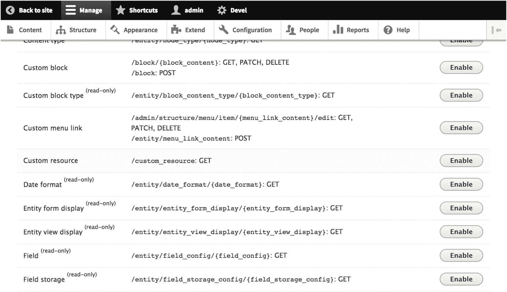
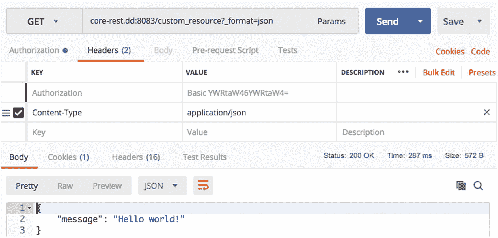

# 排版后的 Markdown 文档

在第五部分中，我们介绍了当前用于构建解耦 Drupal 消费者的一些主要 JavaScript 技术，例如 React、Angular、Ember 和 Vue，包括在选择这些技术时与 Drupal 的 Web 服务解决方案相关的动机、概念性介绍以及构建由 Drupal 支持的应用程序的指南。在本章中，我们结束对全栈的探索，涵盖解耦 Drupal 的高级主题，例如 REST 插件系统、适用于高级用例的贡献模块、模式与生成的 API 文档、缓存以及解耦 Drupal 的未来。

我们在这些章节中涉足了许多不同的领域，其内容并非旨在详尽无遗地检查，而是作为对解耦 Drupal 领域中快速演变和长期存在的解决方案的调查。例如，我们首先转向 Drupal 核心中的 REST 插件系统，该系统使用了已经存在多年的 Drupal 8 开发范式。然而，紧接着，我们转向开创性的贡献模块，这些模块提供诸如 OpenAPI 实现、派生模式以及子请求等功能。我们还涵盖了缓存，这是实时生产构建成功的关键主题。

虽然创建扩展现有核心 REST 功能的自定义资源相对简单，但该过程确实需要在 Drupal 中创建一个自定义模块并具备一些 PHP 知识。幸运的是，Drupal 插件系统在 Drupal 的文档中有很好的体现，对 `Plugin API` 的掌握为新手 Drupal 开发者打开了通往 Drupal 中许多其他功能扩展的大门。

得益于诸如 `JSON API Extras`、`JSON API Defaults`、`JSON-RPC`、`Subrequests` 和 `Decoupled Router` 等项目，贡献模块生态系统对解耦 Drupal 架构的优势不可低估。提供模式和生成文档的模块（如 `Schemata` 和 `OpenAPI`）也是如此。尽管这些项目中的许多还不稳定且仍在大力开发中，但它们为核心功能中的特性路线图以及即将推出的核心功能（例如 Drupal 的 `JSON API` 实现）揭示了有前途的前进方向。

最后，任何解耦 Drupal 架构都必须考虑其决策在投入生产后对性能的影响。有许多特性专门用于改善解耦 Drupal 的性能结果，特别是 Drupal 的缓存标签系统以及诸如反向代理和内容分发网络（CDN）等外部工具。尽管在缓存方面没有一刀切的解决方案，但对这些问题的坦诚考虑对于架构的成功至关重要。

为了结束我们对解耦 Drupal 世界的旅程，本书的最后一章讨论了解耦 Drupal 当前和即将出现的问题，以及解耦 Drupal 在中长期的发展前景。我们首先介绍活跃的 `Admin UI` 和 `JavaScript Modernization Initiative`，这是一个致力于将解耦 Drupal 的优势引入 Drupal 自身管理界面的团队。最后，我们讨论了 Drupal 主题层的问题、Drupal 对开发者和编辑者的承诺的未来，以及 Drupal 在解耦 CMS 领域中的地位。

## 22. REST 插件系统

与 Drupal 中的许多其他模块一样，RESTful Web 服务模块（参见第 [7] 章）可以通过额外的资源插件进行扩展，这些插件向 Drupal 核心 `REST API` 添加新的资源。由于 RESTful Web 服务模块是 Drupal 核心的一部分，并且我们绝不应在任何情况下修改 Drupal 核心代码，因此我们可以通过自定义模块添加资源插件。

对于熟悉 PHP 的 Drupal 开发者来说，第一部分详细介绍的创建自定义模块的过程将会很熟悉，可以安全地跳过而直接阅读后续部分。对于那些对从 PHP 角度进行 Drupal 开发感兴趣，并希望扩展核心 `REST` 以包含定制资源的人来说，本章的全部内容将传授有用的知识。

### 创建自定义模块

在 Drupal 8 中，下载的贡献模块位于 `/modules` 目录中。最佳实践是将所有不属于 Drupal 贡献模块生态系统的自定义模块放在 `/modules/custom` 目录下以便区分。在 `/modules/custom` 目录中，创建一个您选择名称的新目录，例如 `extended_rest`。

每个 Drupal 模块都必须有一个 YAML 文件，在 Drupal 术语中称为 `.info.yml` 文件。YAML 文件表达有关 Drupal 模块的某些关键信息，例如其人类可读的名称、将出现在扩展页面（`/admin/modules`）上的描述、其适用的 Drupal 版本以及该模块的任何依赖项。

例如，考虑我们新的 `extended_rest` 模块的 `.info.yml` 文件，该文件名为 `extended_rest.info.yml`，位于 `/modules/custom/extended_rest` 目录中。请注意，我们声明了对 RESTful Web 服务模块的依赖，因为我们将在其提供的插件之一上进行实现。

```yaml
name: Extended REST
description: 'Adds custom resources to the Drupal core REST API.'
package: Custom
type: module
core: 8.x
dependencies:
- drupal:rest
```

无需任何进一步操作，此时可以导航到扩展页面（`/admin/modules`）并在列表中看到您的模块，尽管启用它不会执行任何操作，因为我们还没有编写任何用于向核心 `REST API` 添加新资源的代码。^([(87)])

> **注意**
>
> 您也可以使用 Drupal Console 通过命令 `drupal generate:plugin:rest:resource` 来搭建一个已经包含生成的资源插件的自定义模块。有关使用此命令的更多信息，请查阅位于 [`https://hechoendrupal.gitbooks.io/drupal-console/content/en/commands/generate-plugin-rest-resource.html`](https://hechoendrupal.gitbooks.io/drupal-console/content/en/commands/generate-plugin-rest-resource.html) 的 Drupal Console 文档。有关 Drupal Console 的更多信息，请查阅 [`https://drupalconsole.com`](https://drupalconsole.com)。^([(88)])

### 实现 REST 资源插件

要添加我们的自定义 REST 资源，我们需要使用 Drupal 插件。在 Drupal 8 中，**插件** 是可替换的小功能单元。通常，负责相似功能的插件属于同一个 **插件类型**。在 REST 资源的情况下，涉及的插件是 `ResourceBase` 插件，它被用于其他 REST 资源的提供，例如数据库日志资源和通用实体资源。

下一步是我们在 Extended REST 模块中创建 `ResourceBase` 插件的实现。为此，我们严格遵守 Drupal 的模块文件和目录结构。在 `/modules/custom/extended_rest/src/Plugin/rest/resource` 目录中创建一个名为 `CustomResource.php`（或您喜欢为资源命名的任何名称）的文件。

请注意，您的目录结构应如下所示。

```
modules
├── custom
│   └── extended_rest
│       ├── extended_rest.info.yml
│       └── src
│           └── Plugin
│               └── rest
│                   └── resource
│                       └── CustomResource.php
```

在以下示例中，我们为承载逻辑的 PHP 类设置了一个命名空间，并使用了 `ResourceBase` 和 `ResourceResponse` 类，后者将负责处理响应的发送。

```php
<?php
namespace Drupal\extended_rest\Plugin\rest\resource;
use Drupal\rest\Plugin\ResourceBase;
use Drupal\rest\ResourceResponse;
```

**注意**

关于 Drupal 插件系统的更多信息，请参阅 Drupal.org 上的插件 API 概述，网址为 [`https://www.drupal.org/docs/8/api/plugin-api/plugin-api-overview`](https://www.drupal.org/docs/8/api/plugin-api/plugin-api-overview)。

## 为 REST 资源插件添加注解

下一步是添加插件注解，这可能是最重要的一步，因为它使插件实现能够被发现，并决定了我们的资源在 Drupal 中的呈现方式以及资源可用的 URI。我们通过在 `CustomResource` 类的文档块中表达一个 `@RestResource` 注解来实现这一点。

```php
/**
 * 为核心 REST API 添加一个自定义资源。
 *
 * @RestResource(
 *   id = "custom_resource",
 *   label = @Translation("自定义资源"),
 *   uri_paths = {
 *     "canonical" = "/custom_resource/{id}",
 *     "https://www.drupal.org/link-relations/create" = "/custom_resource"
 *   }
 * )
 */
class CustomResource extends ResourceBase {
}
```

所示的 `uri_paths` 定义对于插件实现至关重要，该定义以链接关系类型为键，以部分 URI 为值。如果您选择不在 `uri_paths` 定义中指定任何内容，Drupal 将根据插件标识符自动生成 URI，而不是依赖于我们定义的路径。为了进一步解释这一点，请考虑我们前面的定义缺少 `uri_paths` 定义的情况。

如果没有 `uri_paths` 定义，Drupal 将自动允许对以下路径使用以下方法。请注意 `POST` 与其他方法的区别。

```http
GET /custom_resource/{id}
PATCH /custom_resource/{id}
DELETE /custom_resource/{id}
POST /custom_resource
```

定义 `uri_paths` 还允许我们通过 REST 资源插件进行 API 版本管理，方法是每次需要递增 API 版本时，都可以添加具有不同 `uri_paths` 的新资源。请考虑以下示例文档块和注解。

```php
/**
 * 为核心 REST API 添加一个自定义资源。
 *
 * @RestResource(
 *   id = "custom_resource",
 *   label = @Translation("自定义资源"),
 *   uri_paths = {
 *     "canonical" = "/api/v1/custom_resource/{id}",
 *     "https://www.drupal.org/link-relations/create" = "/api/v1/custom_resource"
 *   }
 * )
 */
```

**注意**

有关 Drupal 插件 API 中注解的更多信息，请查阅 [`https://www.drupal.org/docs/8/api/plugin-api/annotations-based-plugins`](https://www.drupal.org/docs/8/api/plugin-api/annotations-based-plugins) 上的文档。关于 `POST` 请求中不常见的 `uri_paths` 键，请查阅 [`https://www.drupal.org/node/2811757`](https://www.drupal.org/node/2811757)。

## 在资源插件中提供响应

现在我们已经为资源添加了注解，可以定义一个方法，并指示 Drupal 我们希望它如何响应该方法的请求。例如，考虑我们在以下示例中如何处理 `GET` 方法。在此示例中，由于我们的资源将是只读的（因为其他方法尚未实现），我们排除了除 `canonical` 路径之外的所有路径，并提供了一个单一资源。

```php
/**
 * 为核心 REST API 添加一个自定义资源。
 *
 * @RestResource(
 *   id = "custom_resource",
 *   label = @Translation("自定义资源"),
 *   uri_paths = {
 *     "canonical" = "/custom_resource",
 *   }
 * )
 */
class CustomResource extends ResourceBase {
  /**
   * 处理 GET 请求的响应。
   *
   * @return \Drupal\rest\ResourceResponse
   */
  public function get() {
    $response = ['message' => 'Hello world!'];
    return new ResourceResponse($response);
  }
}
```

如果您已启用 REST UI 模块（请参阅第 8 章），您现在将看到自定义资源出现在可用 REST 资源列表中，并且该资源上的 `GET` 方法现在可配置，如图 22-1 所示。我们之前详细介绍的手动配置过程也是可行的。



**图 22-1**

当我们为自定义资源添加 `GET` 请求处理时，它就会出现在 REST UI 中的可配置资源列表中。

现在，我们可以通过发出以下请求来测试该资源是否确实提供了响应。

```http
GET /custom_resource?_format=json HTTP/1.1
Authorization: Basic YWRtaW46YWRtaW4=
Content-Type: application/json
```

我们将从 Drupal 收到以下响应，如图 22-2 所示。



**图 22-2**

我们的自定义资源以 `200 OK` 响应码和我们期望的响应负载向我们致意。

```json
{
  "message": "Hello world!"
}
```

**注意**

关于正在使用的 REST 资源插件的更多示例，请分别查阅位于 [`https://github.com/drupal/drupal/blob/8.6.x/core/modules/dblog/src/Plugin/rest/resource/DBLogResource.php`](https://github.com/drupal/drupal/blob/8.6.x/core/modules/dblog/src/Plugin/rest/resource/DBLogResource.php) 和 [`https://github.com/drupal/drupal/blob/8.6.x/core/modules/rest/src/Plugin/rest/resource/EntityResource.php`](https://github.com/drupal/drupal/blob/8.6.x/core/modules/rest/src/Plugin/rest/resource/EntityResource.php) 的 `DBLogResource` 和 `EntityResource` 插件实现。

### 结论

如您所见，REST 插件系统是快速配置新资源以供使用者使用的有效手段。在本章中，我们介绍了 REST 资源插件实现中一些最重要的元素，包括模块创建、注解和响应处理。掌握了这些以及其他插件实现，您就可以让 Drupal 提供各种各样的资源。

在下一章中，我们将介绍解耦式 Drupal 生态系统中的一些贡献模块，这些模块有助于高级用例，例如远程过程调用（RPC）、性能改进、处理修改后的路径以及为 JSON API 配置默认值和其他设置。接下来，我们将探索 JSON API Extras、JSON API Defaults、JSON-RPC、Subrequests 和 Decoupled Router 模块。