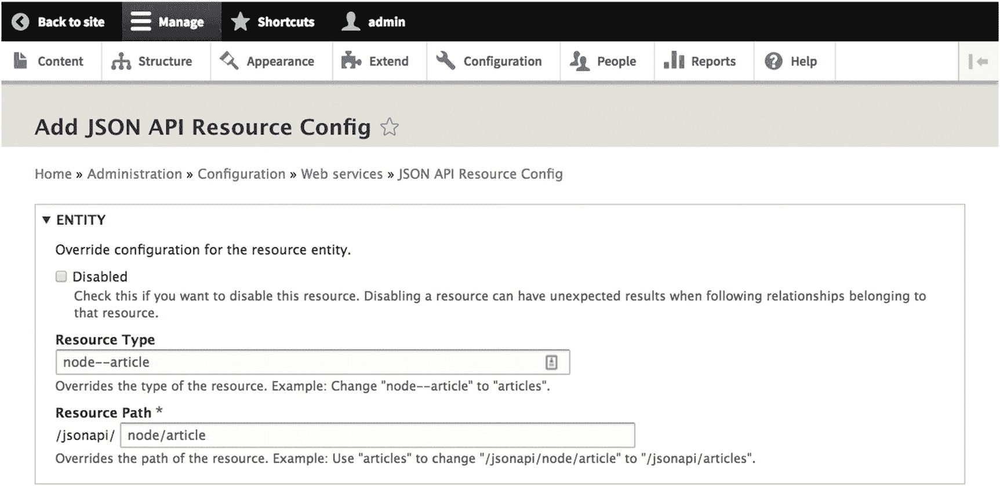
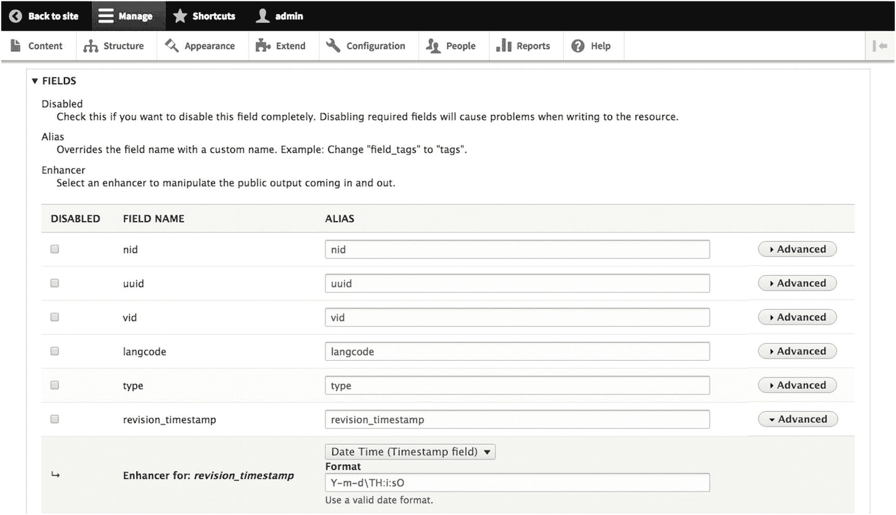
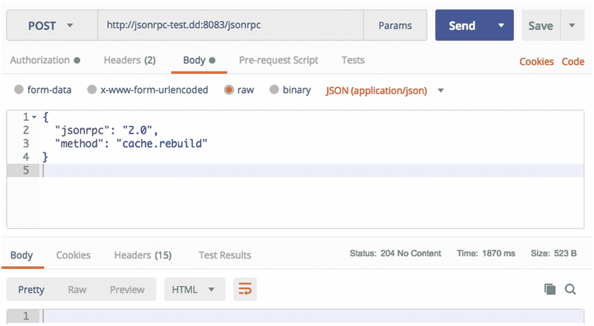
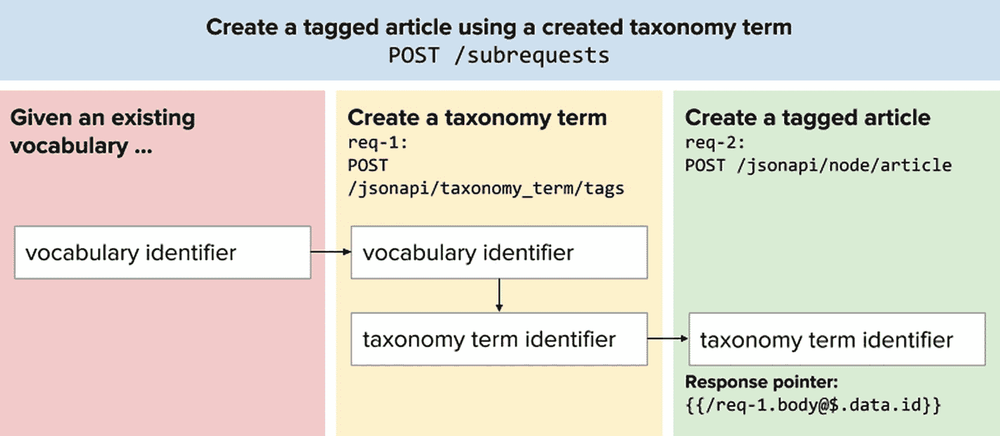

# 脚注

23. 高级用例的贡献模块


## JSON API 扩展、JSON API 默认值、JSON-RPC 与子请求

尽管 `JSON API`、`RELAXed Web Services` 和 `GraphQL` 模块（见第 12)–14) 章）都是规范的实现并提供 Web 服务，但其他贡献模块则提供了与 Web 服务提供相邻或相关但并非直接核心的功能，这些功能在各个方面为开发者带来便利，无论是改善开发者体验还是用户体验。在本章中，我们将介绍该领域一些最流行的模块。

例如，`JSON API Extras` 和 `JSON API Defaults` 扩展了 `JSON API` 模块，提供了覆盖 `JSON API` 模块默认配置的能力。同时，`JSON-RPC` 允许开发者访问 Drupal 中非 RESTful 且无法通过 API 请求轻松执行的某些操作。最后，`Subrequests` 通过支持链式请求来缓解性能问题，而 `Decoupled Router` 则确保资源即使在其 URL 随时间变化时也能正确解析。

### JSON API Extras

`JSON API` 模块最重要的优势之一在于它需要零配置。我们只需启用该模块，即可获得一个符合 JSON API 规范的 API。然而，在许多情况下，你可能希望覆盖该模块提供的某些默认设置。为此，我们需要利用 `JSON API Extras` 模块，该模块也随 Contenta 发行版（见第 15) 章）一起提供，由 Mateu Aguiló Bosch（`e0ipso`）编写。

`JSON API Extras` 模块提供了覆盖默认设置并建立结果 API 应遵循的新设置的接口。目前，其功能包括常见需求，例如：启用和禁用单个资源、为资源名称和路径设置别名、禁用实体中的单个字段、为字段名称设置别名，以及通过使用 Drupal 字段增强器来修改字段输出。^(⁸⁹)

要安装 `JSON API Extras` 模块，请使用以下命令。如果 `JSON API` 尚未安装，Composer 可以为您获取它。

```bash
$ composer config repositories.drupal composer https://packages.drupal.org/8
$ composer require drupal/jsonapi_extras
$ drush en -y jsonapi_extras
```

导航到 **配置** ➤ **JSON API 覆盖** (`/admin/config/services/jsonapi`)，其中的 JSON API 资源配置页面列出了所有通过 JSON API 启用和公开的资源，并反映了每个预设的默认值。例如，考虑 `node--article` 资源，点击该行右侧的 **覆盖** 按钮。

如图 23-1 所示，我们可以实施多种更改，这些更改可能改善消费者应用程序的开发者体验，而在这些应用中，Drupal 的包（Bundle）是完全无意义的。界面的第一部分允许我们：禁用所讨论的资源、更改在集合检索时调用的类型名称（例如，从 `node--article` 改为 `articles`），或更改资源可用的路径（例如，从 `/jsonapi/node/article` 改为 `/jsonapi/articles`）。



**图 23-1** 使用 `JSON API Extras` 禁用单个资源、覆盖资源类型以及覆盖请求资源的路径

在图 23-2 所示的界面第二部分，我们可以看到：我们可以禁用响应中出现的单个字段、为字段名称设置别名，并且（单击 **高级** 按钮后）选择一个字段增强器以不同方式装饰响应中的字段值。得益于 `JSON API Extras`，我们可以利用广泛的功能集来丰富我们的响应，从而加速下游的消费者开发。



**图 23-2** 我们还可以禁用单个字段，使其不出现在响应中；为消费者设置字段名称别名；或者使用 Drupal 字段增强器，在字段进入序列化响应之前修改其输出

> **注意**  
> `JSON API Extras` 模块可在 Drupal.org 上获取：[`www.drupal.org/project/jsonapi_extras`](https://www.drupal.org/project/jsonapi_extras)。

### JSON API Defaults

由 Martin Kolar（`mkolar`）维护的 `JSON API Defaults` 模块允许我们为资源设置默认的包含项和过滤器，但它仍处于不稳定和开发阶段。`JSON API Defaults` 在以下场景中特别有用：消费者希望发出更精简的请求，而不需要为生成包含关系的特定响应而提供参数。简而言之，您可以对资源发出不带任何参数的请求，并收到具有预定义默认值的响应，即使响应中缺少指示此类特征的参数。^(⁹⁰)

> **注意**  
> `JSON API Defaults` 模块可在 Drupal.org 上获取：[`www.drupal.org/project/jsonapi_defaults`](https://www.drupal.org/project/jsonapi_defaults)，但它仍处于不稳定和积极开发阶段。

#### JSON-RPC

有时，Drupal 中更多的功能需要提供给消费者应用的开发者，因为检索和操作内容对于消费者应用的需求来说是不充分的。此外，许多解耦式 Drupal 实践者正在探索编辑界面，这些界面虽然基于 Drupal，但通常需要能够执行关键的 Drupal 操作，例如运行 cron 任务或重建缓存注册表。

由 Mateu Aguiló Bosch（`e0ipso`）和 Gabriel Sullice（`gabesullice`）维护的 `JSON-RPC` 模块在 Drupal 中提供了一种无状态、轻量级的协议，用于执行 **远程过程调用**（RPC），^(⁹¹) 这些调用在另一个系统上执行过程（或子程序），但编写方式如同本地操作，无需直接编码远程操作。^(⁹²) 它旨在用于 Drupal 中任何无法通过 REST 表示的函数，其使命是作为构建 Drupal 管理和自省界面的规范基础。尽管核心 REST 提供了创建自定义资源的能力，但某些 Drupal 操作（如缓存重建）无法通过任何 RESTful API 实现。

简而言之，消费者应用的开发者可以使用 `JSON-RPC` 模块在 JavaScript 或原生应用中包含界面，以触发 Drupal 中的某些任务，例如将站点置于维护模式。此外，`JSON-RPC` 还会暴露 Drupal 数据库中的某些内部细节，例如权限和已启用模块的列表。

要安装 `JSON-RPC` 模块，请使用以下命令。请确保使用 **使用 JSON-RPC 服务** 权限为希望访问 `JSON-RPC` 的角色授予权限。对于某些任务，您可能还需要 **管理站点配置** 权限。

```bash
$ composer config repositories.drupal composer https://packages.drupal.org/8
$ composer require drupal/jsonrpc
$ drush en -y jsonrpc jsonrpc_core
```

要发现可用的 `JSON-RPC` 方法，您可以通过首先安装 `JSON-RPC Discovery` 子模块（该子模块依赖于 Serialization 模块）来自省 `JSON-RPC` API。

```bash
$ drush en -y jsonrpc_discovery
```


从那时起，你可以向 Drupal 后端发送 `GET` 请求到 `/jsonrpc/methods`，以检索文档并查看详细用法信息。

要向 Drupal 服务器发送 JSON-RPC 调用以触发非 RESTful 操作，我们需要创建一个包含 `Authorization` 标头（使用基本认证）的 `POST` 请求。请求正文需要符合 JSON-RPC 规范。

对于仅强制 `GET` 请求的内容分发网络（CDN），还有一种替代方法，涉及向 `/` 发送带有 `?query=` 参数的 `GET` 请求。但这要求 JSON 进行 URL 编码。

考虑以下请求，我们可以用它来远程重建 Drupal 的缓存注册表。你还可以在图 23-3 中看到该请求。

``` http
POST /jsonrpc HTTP/1.1
Authorization: Basic YWRtaW46YWRtaW4=
Content-Type: application/json
{
"jsonrpc": "2.0",
"method": "cache.rebuild"
}
```

在 `GET` 情况下，请求将如下所示。

``` http
GET /?query=%7B%22jsonrpc%22%3A%222.0%22%2C%22method%22%3A%22cache.rebuild%22%7D HTTP/1.1
Authorization: Basic YWRtaW46YWRtaW4=
Content-Type: application/json
```

如你所见，现在我们已从消费者的角度远程重建了缓存注册表。



**图 23-3**
一个 `204 No Content` 响应表示我们的 JSON-RPC 调用在清除所有缓存的情况下成功了。

对于一个更复杂的例子，我们可以请求列出 Drupal 站点中所有可用的权限，然后我们可以在消费者中使用它来创建一个权限视图。考虑以下请求，它请求一个权限列表，其中 `uid` 为 2 的用户的上限为 5，偏移量为 0。

``` http
POST /jsonrpc HTTP/1.1
Authorization: Basic YWRtaW46YWRtaW4=
Content-Type: application/json
{
"jsonrpc": "2.0",
"method": "user_permissions.list",
"params": {
"page": {
"limit": 5,
"offset": 0
}
},
"id": 2
}
```

表 23-1 列出了一些你在开发过程中可能用到的最常见的 JSON-RPC 方法。

**表 23-1**
JSON-RPC 方法及其参数

| JSON-RPC 方法 | 描述 | 参数 |
| --- | --- | --- |
| `cache.rebuild` | 重建系统缓存 | 无 |
| `maintenance_mode.isEnabled` | 启用或禁用维护模式 | `enabled` |
| `user_permissions.add_permission_to_role` | 将给定权限添加到指定角色 | `permission, role` |
| `user_permissions.list` | 列出站点中所有可用权限 | `page (limit, offset)` |
| `plugins.list` | 列出已定义的插件 | `page (limit, offset), service` |
| `route_builder.rebuild` | 重建应用的路由器（如果重建成功，结果为 `TRUE`，否则为 `FALSE`) | 无 |

**注意**
JSON-RPC 模块在 Drupal.org 上可用，位于 [`https://www.drupal.org/project/jsonrpc`](https://www.drupal.org/project/jsonrpc)。请谨慎使用，因为它仍处于测试阶段。JSON-RPC 调用的示例可以在 Postman 集合中找到，位于 [`https://www.getpostman.com/collections/04e08782cde9fbf64f44`](https://www.getpostman.com/collections/04e08782cde9fbf64f44)。未实现的 API 列表可以在 [`https://www.drupal.org/project/drupal/issues/2913790`](https://www.drupal.org/project/drupal/issues/2913790) 找到。有关 JSON-RPC 背后动机的更多信息，请参阅 Mateu Aguiló Bosch 在 Lullabot 上发表的文章“JSON-RPC to Decouple Everything Else”，网址为 [`https://www.lullabot.com/articles/jsonrpc-to-decouple-everything-else`](https://www.lullabot.com/articles/jsonrpc-to-decouple-everything-else)。

#### 子请求

在利用 JSON API 作为 Web 服务解决方案时，我们尚未涉及的一个领域是其对性能的影响。毕竟，使用 JSON API 而不是核心 REST 等替代方案的主要动机之一是，由于能够处理相关实体的包含关系，从而减少了对多个连续请求的需求。尽管如此，如果你使用的是 HTTP/1.1，通常仍然需要顺序请求，因为在消费者中所需的一切并不总能通过单个请求处理。

JSON API 模块的维护者 Mateu Aguiló Bosch 将文章创建作为性能缺陷的一个例子。例如，要远程创建一个关联了许多分类术语的文章，我们需要先创建这些分类术语，因为文章创建要求我们提供分类术语 ID。然而，要做到这一点，我们还需要创建一个词汇表来处理这些分类术语。虽然在某些消费者身上，许多这些操作可以并行进行，但许多其他消费者却没有这种便利。正如 Aguiló Bosch 精辟地指出的那样，“每个消费者都可以有自己的想法来决定如何发出请求，以及这些请求是否可以被并行化。”^(⁹³)

与其发出连续请求并损害性能，我们可以利用子请求（`Subrequests`）模块在单个请求中处理许多 JSON API 操作，特别是那些足够简单以至于无需人工输入的操作。图 23-4 说明了子请求的工作原理。



**图 23-4**
子请求如何链接有依赖关系的请求

要安装子请求，请执行以下命令。请注意，子请求依赖于几个第三方库，处理这些库需要 Composer 或 Composer Manager。^(⁹⁴)

```
$ composer require drupal/subrequests:².0
$ drush en -y subrequests
```

**注意**
子请求模块在 Drupal.org 上可用，位于 [`https://www.drupal.org/project/subrequests`](https://www.drupal.org/project/subrequests)。它也被包含在 Contenta 发行版中（见第 15 章），并与 Contenta.js 集成（见第 16 章）。

##### 子请求蓝图

在子请求中，一个被称为*蓝图*的 JSON 文档包含一组指令，说明如何在一次 Drupal 引导中执行相互依赖的连续请求。子请求蓝图使用占位符代替 Drupal 将创建的未实现值。通过这种方式，我们可以将蓝图视为没有标识符的请求。后续成功响应将用正确的标识符填充这些占位符。

对子请求的请求采用以下格式。请注意，`Content-Type` 标头是必需的，以便处理蓝图的前端控制器能够解释请求。

``` http
POST /subrequests HTTP/1.1
Authorization: Basic YWRtaW46YWRtaW4=
Content-Type: application/json
```

还有一种使用 `GET` 的替代方法，类似于我们在 JSON-RPC 中发出 `GET` 请求的方式（见上一节），请求正文包含在附加到 `/subrequests?query=` 的百分比编码字符串中。

**注意**
关于用法，从现在开始，我们使用*子请求*（大写）来指代子请求模块，并将使用*subrequest*（小写）来指代单个的子请求或组成请求。

蓝图本身被构造成一个包含多个请求对象的数组，每个请求对象代表一个 Drupal 预期执行的请求。蓝图中的每个子请求都包含表 23-2 中列出的属性。`action` 和 `uri` 属性是推荐的，其他属性是可选的。^(⁹⁵)

**表 23-2**
子请求属性


##### 子请求属性

| 属性 | 描述 | 示例值 |
| --- | --- | --- |
| `action` | 子请求将要执行的操作类型 | `view, create, update, replace, delete, exists, discover` |
| `uri` | 子请求的 URI | `/jsonapi/node/article` |
| `requestId` | 子请求的唯一标识符，用于将其与某个部分响应相匹配 | `req-2` |
| `body` | 子请求请求体的序列化内容 | 以 JSON 表示的某篇文章 |
| `headers` | 一个键值对对象，键表示头部名称，值表示头部值 | `{ "Content-Type": "application/json" }` |
| `waitFor` | 将另一个子请求的 `requestID` 表示为依赖项；在 `waitFor` 请求给出响应之前，此子请求无法运行 | `req-1` |

**注意：** 有关如何在子请求中形成请求的更完整规范，请查阅 [`https://www.drupal.org/project/subrequests`](https://www.drupal.org/project/subrequests) 上的文档。

## 处理请求依赖项

在子请求蓝图中，先前的请求会以两种方式表现为后续请求中的依赖项：*请求依赖项*和*响应指针*（也称为*响应嵌入*）。如上一节所示，`waitFor` 键很重要，因为它表示对前一个请求响应的依赖。虽然每个子请求只能声明对单个其他子请求的依赖，但我们可以通过将这些依赖项收集到一个单独的蓝图中，并将该蓝图所代表的子请求声明为依赖项，从而声明对一系列多个子请求的依赖。

通常，子请求需要来自对其他子请求响应中的信息。因此，子请求可以包含替换令牌（响应指针），这些令牌需要根据其共享蓝图中先前成功的子请求来解析。针对未完成的响应的替换令牌的格式如下，其中 `<request_id>` 表示依赖项子请求的请求标识符，`<location>` 表示令牌在子请求对象中的位置（例如，如果指针在请求体中则为 `body`），`<path_expression>` 表示一个字符串，用于指定依赖项子请求响应中的哪一部分应替换该令牌。

```
{{/.@}}
```

例如，考虑以下示例响应指针。在此示例中，我们标识了包含所需值以替换令牌的先前请求（`req-1`）、先前响应中所需值的位置（`body`），以及如何通过遍历其中包含的对象（`$.data.id`）来访问它。请注意，遵循 JSONPath 规范的 `$` 在此情况下表示 `body` 的值。

```
{{/req-1.body@$.data.id}}
```

**注意：** 如果顶层请求的 `Content-Type` 头部的值为 `application/json`，则响应指针应遵循位于 [`http://goessner.net/articles/JsonPath`](http://goessner.net/articles/JsonPath) 的 JSONPath 规范。如果 `Content-Type` 为 `application/xml`，则响应指针应遵循位于 [`https://www.w3.org/TR/xpath20`](https://www.w3.org/TR/xpath20) 的 XPath 2.0 规范。

**警告：** 不要将响应指针用作 `requestId` 或 `waitFor` 属性的值。

## 使用子请求蓝图

当所有组成子请求都已完成且所有响应都已填充后，Drupal 会向顶层请求发出一个统一的响应，该响应将每个子请求的响应作为数组成员包含在内。这些最终响应中的每一个都使用 `207 Multi-Status` 响应码，因为每个子请求都将包含其自身的响应码。对顶层请求的响应将附带 `Content-Type` 头部，其值为 `multipart/related`。

请考虑以下示例蓝图，它创建了一个分类术语，然后将其用于创建一篇文章。特别要注意第二个请求 `req-2` 中对 `waitFor` 的使用以及替换令牌 `{{/req-1.body@$.data.id}}`，该令牌针对 `req-1` 响应中 `data` 对象下的 `id` 属性，作为应填充占位符的信息。

```
[
{
"requestId": "req-1",
"uri": "/jsonapi/taxonomy_term/tags",
"action": "create",
"body": "{\"data\":{\"type\":\"taxonomy_term--tags\",\"attributes\":{\"name\":\"Cetaceans\",\"description\":{\"value\":\"Species that are cetaceans\"},\"weight\":5},\"relationships\":{\"vid\":{\"data\":{\"type\":\"taxonomy_vocabulary--taxonomy_vocabulary\",\"id\":\"b4708a6b-5df8-4019-adab-870cbfb09fd6\"}}}}}",
"headers": {
"Accept": "application/vnd.api+json",
"Content-Type": "application/vnd.api+json",
"Authorization": "Basic YWRtaW46YWRtaW4="
}
},
{
"requestId": "req-2",
"waitFor": ["req-1"],
"uri": "/jsonapi/node/article",
"action": "create",
"body": "{\"data\":{\"type\":\"node--article\",\"attributes\":{\"langcode\":\"en\",\"title\":\"Porpoises\",\"status\":\"1\",\"promote\":\"1\",\"sticky\":\"0\",\"default_langcode\":\"1\",\"body\":{\"value\":\"Porpoises are a group of fully aquatic mammals that are sometimes referred to as mereswine, all of which are classified under the family Phococenidae, parvorder Odontoceti, which means toothed whales.\",\"format\":\"plain_text\",\"summary\":\"Porpoises are a group of fully aquatic mammals that are sometimes referred to as mereswine.\"}},\"relationships\":{\"type\":{\"data\":{\"type\":\"node_type--node_type\",\"id\":\"article\"}},\"uid\":{\"data\":{\"type\":\"user--user\",\"id\":\"1\"}},\"field_tags\":{\"data\":[{\"type\":\"taxonomy_term--tags\",\"id\":\"{{/req-1.body@data.id}}\"}]}}}}",
"headers": {
"Accept": "application/vnd.api+json",
"Content-Type": "application/vnd.api+json",
"Authorization": "Basic YWRtaW46YWRtaW4="
}
}
]
```

**注意：** 您可以使用 Drupal PHP 中的 `json_encode()` 和 JavaScript 中的 `JSON.stringify()` 等方法创建您刚刚看到的序列化 JSON 对象。

如您所见，子请求通过一种可被多个实现相同规范的消费者共享的方式，在性能方面带来了显著改善。无论如何，Drupal 始终以相同的方式解释这些链接的请求。

**注意：** 您可以使用页面缓存来加速组成子请求的交付。有关缓存技术的更多信息，请参见第 25 章。有关子请求动机的更多信息，请参见 Mateu Aguiló Bosch 在 Lullabot 上发表的文章“使用子请求实现令人难以置信的解耦性能”，网址为 [`https://www.lullabot.com/articles/incredible-decoupled-performance-with-subrequests`](https://www.lullabot.com/articles/incredible-decoupled-performance-with-subrequests)。


### 解耦路由器

同样由 Mateu Aguiló Bosch(e0ipso)编写的`解耦路由器`模块，对于计划采用以 Web 消费者（而非原生移动消费者）为核心的架构而言尤为重要。搜索引擎优化(SEO)和路由主要涉及浏览器端功能，用户看到的 URL 至关重要。

Drupal 一直坚持让内容编辑者和站点构建者能够通过其*URL 别名*功能为 Drupal 渲染的页面指定不同的 URL。然而，虽然 Drupal 用户可以轻松更改这些路径（例如使用 Views REST 导出功能，参见第 11 章），但消费者端有时可能更脆弱，只有在请求失败时才会意识到 URL 发生了变化。

例如，考虑一种情况：某个资源原本可通过`/api/airports/amsterdam-schiphol`这样的 URL 访问，但由于 URL 更改为`/api/airports/ams`，该资源不再存在于原位置。`解耦路由器`允许任何未更新路径的消费者通过 Drupal 将请求重定向到正确的路由。`解耦路由器`通过回答一个常见问题来实现这一点：“无论路径如何变化，当前路径下存在什么实体？”它会追踪 URL 的修改，使得一旦发生此类变化，Drupal 就能使用通用标识符（例如`node:21`）将路径解析到新位置，并从新路径返回正确的实体数据，而消费者对此毫不知情。^(⁹⁶)

> **注意**  
> `解耦路由器`模块可在 Drupal.org 上获取，地址为[`https://www.drupal.org/project/decoupled_router`](https://www.drupal.org/project/decoupled_router)。关于`解耦路由器`的更多信息，请参阅 Mateu Aguiló Bosch 在 Lullabot 上发表的文章“Decoupled Drupal Hard Problems: Routing”，地址为[`https://www.lullabot.com/articles/decoupled-hard-problems-routing`](https://www.lullabot.com/articles/decoupled-hard-problems-routing)。`解耦路由器`也包含在 Contenta 发行版中（参见第 15 章），并与`Contenta.js`集成（参见第 16 章）。

## 总结

在本章中，我们介绍了几个以不同方式改善解耦 Drupal 实践者体验的模块，即`JSON API Extras`、`JSON API Defaults`、`JSON-RPC`、`Subrequests`和`解耦路由器`。`JSON API Extras`和`JSON API Defaults`都提供了额外的用户界面以实现更丰富的配置，而`JSON-RPC`则通过 RPC 扩展了 Drupal 的可操控性。同时，针对生产环境用例，`Subrequests`和`解耦路由器`分别解决了性能陷阱和资源 URL 变更的问题。

在下一章中，我们将转换话题，讨论能够显著提升构建消费者应用的开发者体验的 Schema 和生成的文档。具体来说，我们将讨论自动生成 API 文档的前景，包括 Reservoir 引入的并排预览功能，以及管理此类 Schema 认知的工具（`OpenAPI`和`Schemata`模块）。最后，我们将简要探讨自动生成 API 文档的功能如何催生自动生成表单甚至完整的编辑界面。

