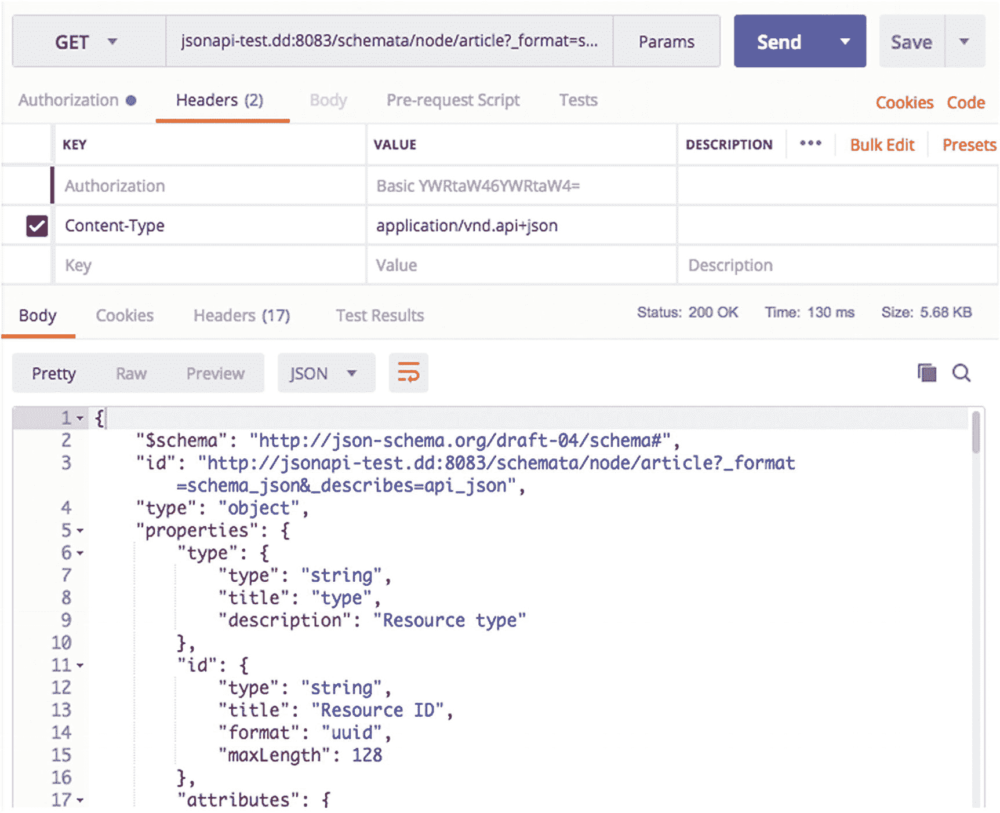
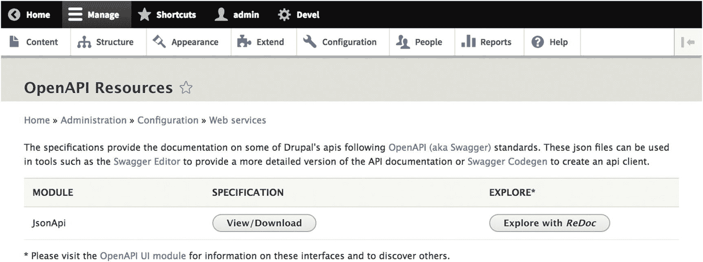

# 脚注

## 24. Schema 与自动生成文档

对于解耦 Drupal 实践者而言，提升构建消费者应用的开发者体验的最佳方法之一，是提供清晰的途径来访问概述 Drupal Web 服务中可用资源的 Schema，并基于该 Schema 使用自动生成的文档。在本章中，我们将重点关注贡献者在这两个领域所做的一些创新工作。

Schema 丰富了解耦 Drupal 架构，这不仅因为它们在内省 Web 服务方面的作用，还因为它们提供了超越软件开发本身的价值。例如，组织能够受益于描述逻辑数据模型(LDM)的能力，该模型可以跨越其数字生态系统中的所有 API 和消费者应用，从而促进更深入的理解和更好的数据协调。对于许多此类组织而言，Drupal 正扮演着这一核心角色。

## Schemata

*Schema*是描述 JSON 文档形状的声明性描述，例如来自 Drupal Web 服务的典型实体响应。它们允许后端和前端开发者理解 API 如何处理请求以及服务器如何形成响应。Schema 对于所有 Web 服务都是必不可少的，因为它们提供了一种简单的 API 测试查询无法实现的内省级别。

简而言之，Schema 负责捕获从 Web 服务返回的任何 JSON 文档的结构，并以机器可读的方式呈现这些信息，以便其他需要集成的系统能够理解并处理相同的 Schema。在 Drupal 8 中，由 Adam Ross(Grayside)维护的`Schemata`模块负责提供 Schema 并促进自动生成文档（参见下一节）。

健壮的 Schema 定义不仅为自动生成文档（这对构建消费者应用的开发者来说是一个关键特性）打开了大门，也为自动生成代码（参见本章最后一节）铺平了道路，我们可以针对 Schema 生成可用的表单。Schema 的另一个关键优势是*客户端验证*的潜力，即消费者端了解应如何形成请求的知识可以避免向服务器发送往返请求来执行验证。

在解耦 Drupal 架构中拥有众多消费者的最大缺点之一是，这些消费者会根据各自技术特性实现自己的表单，从而导致大量重复劳动。当我们需要在内容类型中添加新字段或从响应中删除字段时，情况会变得更糟，因为消费者中的所有表单都需要重构。

Schema 描述了 API 暴露的数据形状，但同时也负责 Web 服务的其他重要信息，例如资源是否可以被删除、是否公开、或者是否可以进行`POST`交互。由于这些内容并不存在于 Drupal 数据模型中，我们需要一个像`Schemata`模块这样的 Schema 提供者，以普遍理解的方式提供这些信息。^(⁹⁷)

`Schemata`模块从核心 REST（参见第 7 章）的`序列化`模块中派生出数据模型的 Schema 定义，并支持针对序列化为 JSON、HAL+JSON 和 JSON API（仅内容实体）的实体的 JSON Schema 规范。利用 Drupal 8 新的类型化数据系统，`Schemata`支持一系列其他引人注目的功能，例如测试、代码生成、文档生成等。

要安装`Schemata`，请使用以下命令。

```bash
$ composer require drupal/schemata
$ drush en -y schemata
```

`Schemata`是一个精简模块，因为它支撑着子模块`Schemata JSON Schema`，该子模块实现了针对派生 Schema 的 JSON Schema 规范。因此，我们只应将`Schemata`与包含`序列化器`实现以定义 Schema 的附加模块结合安装。^(⁹⁸)

### Schemata JSON Schema

要启用 `Schemata JSON Schema`，请使用以下命令。启用后，`Schemata JSON Schema` 模块将添加 *访问不同数据模型* 的权限。

```bash
$ drush en -y schemata_json_schema
```

要在浏览器中浏览 schema，或发送返回 schema 响应的 `GET` 请求，我们需要使用符合 `Schemata` URL 格式的路径。考虑以下路径，其中 `{entity_type}` 代表实体类型，`{bundle}` 代表 bundle（Drupal 内容类型），`{output_format}` 代表期望的输出格式（除非您使用不同的序列化方式，否则为 `schema_json`），`{described_format}` 代表 schema 所描述的格式（例如 `json`、`hal_json`、`api_json`）。

```
/schemata/{entity_type}/{bundle}?_format={output_format}&_describes={described_format}
```

例如，考虑以下示例，它获取 JSON API 中 Drupal 文章的一个 JSON schema。当我们使用适当的权限向该路径发送 `GET` 请求时，会收到一个 `200 OK` 响应，如图 24-1 所示。

```
/schemata/node/article?_format=schema_json&describes=api_json
```

与 JSON API 中的类型处理不同（参见第 12 章），`Schemata` 要求我们在实体类型没有 bundle 时省略 bundle，如下例所示，它根据 `HAL+JSON` 格式检索用户的 JSON schema。

```
/schemata/user?_format=schema_json&describes=hal_json
```



**图 24-1** 在此示例中，我们根据 JSON API 规范检索了一个描述 Drupal 文章结构的 schema。

> **注意**

> `Schemata` 模块可在 Drupal.org 上获取：[`www.drupal.org/project/schemata`](https://www.drupal.org/project/schemata)。有关 JSON Schema 规范的更多信息，请查阅 [`json-schema.org`](http://json-schema.org)。有关如何在 Drupal 的 PHP 环境中使用 `Schemata` 的信息，请查阅 `README`：[`cgit.drupalcode.org/schemata/tree/README.md`](https://cgit.drupalcode.org/schemata/tree/README.md)。

## 生成的 API 文档

生成的 API 文档并非新概念，流行的例子包括 `OpenAPI`（以前称为 Swagger 规范）和 `API Blueprint`。在许多情况下，从业者使用这些技术来描述和原型化一个 API 规范。在 Drupal 的案例中，我们使用 API 文档技术来描述一个已存在的 API 规范。

像 `OpenAPI` 和 `API Blueprint` 这样的规范也通常是 *API 设计* 工具的一部分，因为它们可以被那些只想在 API 工作原型中尝试和测试不同场景的开发人员使用。此外，流水线开发（参见第 5 章）的前景也变得更加可行，因为像 `API Blueprint` 这样的工具可以促进 *虚拟 API* 的创建，当后端开发人员正在提供将提供 API 的 Web 服务时，消费应用程序的开发人员可以针对这些虚拟 API 进行工作。

对于消费应用程序的开发人员来说，生成的 API 文档可能是一个巨大的福音，因为它消除了向 API 发送测试请求以确定 schema 结构以及后端对请求的期望的需要。例如，`Reservoir`（参见第 15 章）是第一个为了消费开发人员的利益而引入资源 JSON 表示及其 Drupal 渲染的并排预览概念的项目，这个想法迅速被 `Contenta` 和 `Headless Lightning`（参见第 15 章）所采纳。

> **注意**

> 有关 `API Blueprint` 的更多信息，请访问网站 [`apiblueprint.org`](https://apiblueprint.org)。我们将在下一节介绍 `OpenAPI`。

## OpenAPI

`OpenAPI`（以前称为 Swagger 规范）是一个用于描述 RESTful Web 服务的规范，此外还具有生成、消费和可视化这些服务等功能。其目的是在开发人员之间为记录 API 创建一个共享标准。`OpenAPI` 最初是 Swagger 整体框架的一部分，但在 2016 年，它成为了由 Linux 基金会领导的一个独立计划的一部分。请注意，`OpenAPI` 与 Swagger 规范是同义词，而术语 *Swagger* 指的是实现该规范的工具生态系统。

给定一个包含 API 详细信息的接口文件，Swagger 生态系统能够基于可用的 Web 服务生成文档、测试用例，甚至可工作的代码。Swagger 生态系统中的一些工具包括 `Swagger UI`、`Swagger Codegen` 和 `Paw`。

由 Rich Gerdes (`richgerdes`) 和 Ted Bowman (`tedbow`) 维护的 `OpenAPI` 模块是 Drupal 对该 API 的实现，它与核心 REST（参见第 7 章）和 Drupal 的 JSON API 实现（参见第 8 章和第 12 章）集成，以记录这些 Web 服务中可用的实体路由。您还可以创建便于其他自定义集成的插件。`OpenAPI` 模块依赖于 `Schemata`（参见本章第一节）、`Serialization` 和 `Schemata in JSON Schema` 模块。

另一个独立的模块 `OpenAPI UI` 模块负责在渲染后的 Drupal 前端上提供面向用户的文档，该文档描述了兼容的 API。但是，您需要安装一个解析 `OpenAPI` 文档的用户界面库。`OpenAPI UI` 模块推荐的选项是 `ReDoc`，这是一个 JavaScript 库，允许用户浏览 Web 服务的 API 文档，并包含在 `ReDoc for OpenAPI UI` 模块中。还有一个 `Swagger for OpenAPI UI` 模块，它与 `Swagger UI` 集成。

为您的 Drupal 站点上可用的 Web 服务生成 API 文档的最简单方法是安装所有这些模块。在具有核心 REST 或 JSON API 中已有 Web 服务的 Drupal 站点上执行以下命令。由于 `ReDoc for OpenAPI UI` 依赖于 `OpenAPI UI`，因此 `OpenAPI UI` 依赖项将被自动获取。

```
$ composer require drupal/openapi
$ composer require drupal/openapi_ui_redoc
$ drush en -y openapi openapi_ui_redoc
```

要改为安装 `Swagger for OpenAPI UI`，请使用以下命令。

```
$ composer require drupal/openapi
$ composer require drupal/openapi_ui_swagger
$ drush en -y openapi openapi_ui_swagger
```

我们现在可以通过导航到 配置 ➤ OpenAPI (`/admin/config/services/openapi`) 来查看我们的文档，在那里我们可以下载 Swagger 规范 JSON 文件供个人使用，或者使用 `ReDoc` 浏览文档，如图 24-2 所示。



**图 24-2** OpenAPI 资源页面为我们提供了下载 API 规范文件或使用我们已安装的库浏览生成的文档的功能。

> **注意**
>
> `OpenAPI` 模块可在 Drupal.org 上获取：[`www.drupal.org/project/openapi`](https://www.drupal.org/project/openapi)。`OpenAPI UI` 模块可在 Drupal.org 上获取：[`www.drupal.org/project/openapi_ui`](https://www.drupal.org/project/openapi_ui)。`ReDoc for OpenAPI UI` 模块可在 Drupal.org 上获取：[`www.drupal.org/project/openapi_ui_redoc`](https://www.drupal.org/project/openapi_ui_redoc)。`Swagger for OpenAPI UI` 模块可在 Drupal.org 上获取：[`www.drupal.org/project/openapi_ui_swagger`](https://www.drupal.org/project/openapi_ui_swagger)。

### 生成代码

提供符合标准的 API 规范文档（如 OpenAPI 规范）最令人信服的理由之一在于，同一份文档不仅可以用于生成文档和测试用例，还能生成实际可运行的代码。当前 API 规范工具的前沿能力是基于 API 规范生成通用表单乃至完整界面。

一个典型例子是 `Swagger Codegen`，它能够生成用于构建消费者应用的服务器存根和 SDK。^(103) 另一个生成表单的例子是 `react-jsonschema-form`，该工具能够根据 Bootstrap 约定生成 React 组件（参见第 15 章），它解释 JSON schema（例如由 `Schemata` 模块提供的 schema），并生成与 schema 集成的完整 HTML 表单。^(104)

对这两个项目的全面介绍远超本书范围，但基于 API 规范和 schema 的代码生成，已成为处理 Web 服务领域最重要的当前趋势之一，预示着我们在前端表单与后端业务逻辑耦合方式上的范式转变。

**注**：关于 `Swagger Codegen` 的更多信息，请访问 [`https://swagger.io/tools/swagger-codegen`](https://swagger.io/tools/swagger-codegen)。关于 `react-jsonschema-form` 的更多信息，请访问 [`https://github.com/mozilla-services/react-jsonschema-form`](https://github.com/mozilla-services/react-jsonschema-form)。

## 总结

当前普遍理解的 API 规范和自动生成 API 文档的发展势头，预示着消费者与 Web 服务交互方式的新纪元。特别是，schema 有助于更深入地内省数据，而自动生成的文档在构建消费者应用时能显著提升开发者体验。最后，那些根据 schema 或 API 规范生成实际可运行代码的新兴工具，正在重塑我们对客户端/服务器关系的认知。

在下一章中，我们将介绍一些在解耦 Drupal 项目中日趋重要的最佳实践，包括反向代理以及结合 Drupal 缓存标签系统的使用。在此过程中，我们将讨论用于驱动解耦 Drupal 架构缓存的一些最知名技术。