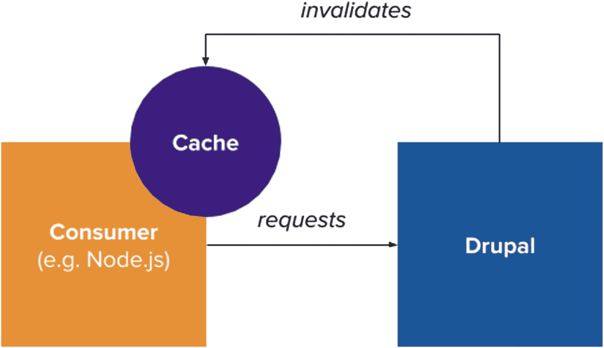
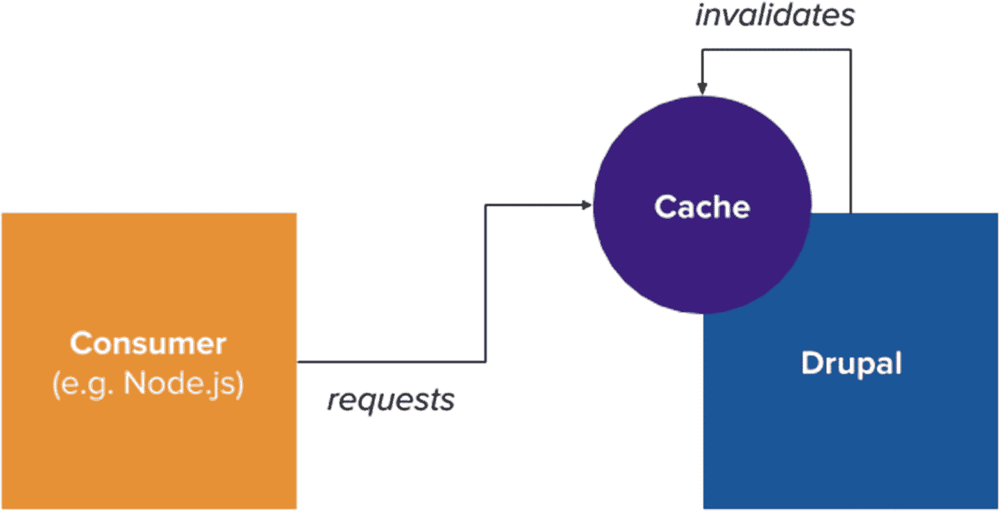
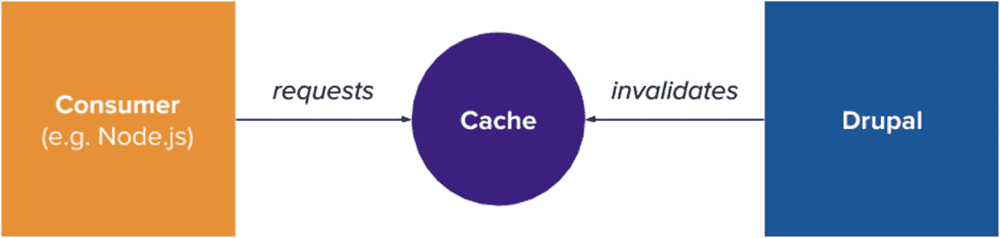

# 脚注

## 25. 缓存

对于任何高性能的解耦 Drupal 架构而言，缓存至关重要，但由于不同实现之间的差异，它又充满了极大的变数。加之开源解决方案范围有限（尽管有`Contenta.js`，参见第 16 章）能够作为反向代理提升消费者应用性能，这使得缓存问题更加复杂。

本章将介绍解耦 Drupal（相较于单体 Drupal 架构）中的一些缓存用例，为何反向代理比内部对象缓存更适合缓存，Drupal 缓存标签系统的工作原理，以及缓存索引和失效的最佳实践。由于没有两种实现是完全相同的，单一的章节无法穷尽每种性能场景下的所有缓存方案，但本章会为您自己的解耦 Drupal 架构提供一些可能的研究方向。

## 解耦 Drupal 中的缓存用例

在 2018 年“解耦 Drupal 日”上，David Strauss 在其演讲《有效的 API 缓存：当客户端是解耦前端时实现高命中率》中，指出了利用缓存架构进行解耦 Drupal 的三个最常见用例，其中许多与第 5 章概述的解耦 Drupal 优势相呼应。

支持在 Drupal 实例与任何消费者实例之间使用强大缓存层的主要论点之一是*安全性*。单体 Drupal 架构极易受到攻击媒介的攻击，而利用反向代理等缓存系统可以缓解恶意行为者利用漏洞的某些途径。

另一个动机是*个性化*。如今，许多用户体验根据用户品味变得越来越动态和个性化，当大量用户开始请求内容时，服务器的负担变得非常沉重。在单体 Drupal 中基于个性化数据生成整个页面可能很简单，但防止对高度个性化的 API 响应的请求触发完整的 Drupal 引导过程则极具挑战性。在解耦 Drupal 中，针对大规模个性化体验的健壮缓存是硬性要求。

最后，技术在全球的普及导致了*地理分布广泛的动态用户*激增，这些用户从远离数据中心实际位置的地方访问内容。这些来自世界各地的用户越来越期望获得与附近用户相同的良好体验。^(¹⁰⁵)

## Drupal 缓存标签系统

Drupal 8 中最重要且引人注目的特性之一是*缓存标签系统*，它允许缓存项通过*缓存标签*声明对其他缓存项的依赖。简而言之，缓存标签提供了一种声明式方法，让我们能够追踪缓存项如何依赖 Drupal 管理的数据。缓存标签是字符串，并在字符串集合中传输，最常见的是在标头中传输。^(¹⁰⁶) 一种有用且形象的方式来思考缓存标签集合，是将它们视为标识产品成分的配料表；当某种成分改变时，整个产品都需要反映该更新。

在解释缓存标签的工作原理之前，我们应先确定 Drupal 缓存标签系统有用的一些场景。在当今的 Drupal 中，许多用户生成的内容不仅在其自身页面上渲染，还会在区块（可重复的页面组件）、视图显示或视图 REST 导出（参见第 11 章）中渲染。当内容更新时，我们希望该内容的每一个实例（无论位于何处）都能反映该内容的最新状态。简而言之，无论内容项位于何处，我们都需要使其失效。

通过在 Drupal 中对特定内容实体声明缓存标签，我们可以确保：无论某个缓存项在何处包含了该内容实体的缓存项，该缓存项都会被失效，转而使用该内容的更新版本。

缓存标签采用以下形式，其中`{object}`是需要缓存的对象（例如，节点、用户、配置等），`{identifier}`是该对象在 Drupal 中的标识符。

```
{object}:{identifier}
```

当对象只有一个实例或多个实例不可能存在时，则不需要标识符（从而形成`{object}`格式）。除了不能包含空格外，缓存标签语法没有其他限制。请参考表 25-1 中的缓存标签示例，这些示例反映了常见需求。

**表 25-1** 缓存标签示例

| 缓存标签 | 描述 |
|---|---|
| `node:53` | 标识符为 53 的节点实体的缓存标签，当该实体变更时失效 |


`user:2` — 标识符为 2 的用户实体缓存标签，当实体发生变化时失效。

`node_list` — 所有节点实体的列表缓存标签，当任何节点实体被添加、修改或删除时失效。

`library_info` — 资源库的缓存标签，当任何资源库被添加、修改或删除时失效。

Drupal 为**实体**（缓存标签格式：`{entity_type}:{entity_identifier}`）、**配置**（缓存标签格式：`config:{configuration_name}`）和**自定义场景**（例如 `library_info`）处理缓存标签。在接下来的章节中，我们将讨论如何在反向代理和内容交付网络（CDN）的上下文中使用缓存标签，这是在解耦式 Drupal 架构中进行数据缓存的两种最常见方法。

> **注意**  
> 有关 Drupal 缓存标签系统的更多详细信息，请查阅文档 [`https://www.drupal.org/docs/8/api/cache-api/cache-tags`](https://www.drupal.org/docs/8/api/cache-api/cache-tags)。

## 反向代理与内容交付网络

尽管一些 Drupal 开发者选择将所有缓存维护在 Drupal 内部，并依靠内部页面缓存等工具进行缓存失效处理，但这在解耦式 Drupal 架构中意义不大，因为我们需要在 API 响应发送到消费方服务器后对其进行缓存。许多 Drupal 开发者选择在使用整体式架构时使用反向代理和 CDN，但它们在解耦式场景中可能更为有用。

定义一些术语：**反向代理**是一种代理服务器，代表消费方向服务器发出请求，并代理消费方发起请求。^(¹⁰⁷) 反向代理不仅是缓存方面的热门工具，还能提供统一的方式将请求转发至 Drupal 实例。同时，CDN 是分布式的代理服务器网络，无论最终用户位于何处，都能确保高可用性和高性能。^(¹⁰⁸) 在许多情况下，CDN 可以替代解耦式 Drupal 架构中的反向代理。

在 Drupal 中，通常将 Varnish（一种 HTTP 反向代理，可置于任何使用 HTTP 通信的服务器之前）置于 Drupal 实例之前。^(¹⁰⁹) 其他 Drupal 实践者则选择使用 Redis（一种键/值缓存和存储，也被称为数据结构服务器）或 Memcached（一种分布式内存缓存系统）等解决方案。

Strauss 在其演讲中告诫，不要使用位于前端的对象缓存来为解耦式 Drupal 架构提供缓存支持，因为如图 25-1 所示，这会产生一致性问题。例如，如果你有一个 Node.js 服务器位于 Memcached 实例之前，Node.js 代替 Drupal 从 Memcached 中检索数据，那么 Drupal 就需要知道如何使 Node.js 服务器前的 Memcached 实例失效。换句话说，所有前端和后端实例现在都在与同一个 `cache` 进行通信。



**图 25-1** 在此场景中，消费方和 Drupal 都依赖于消费方上的对象缓存，这要求 Drupal 了解前端缓存如何存储缓存项以及如何使其失效。经 David Strauss 许可，根据其图解改编。

当消费方改变其在 Memcached 中的缓存方式时，可能会产生一致性问题。如果消费方修改了其在 Memcached 中的缓存方式，而 Drupal 未更新以反映这些修改，就可能产生不一致，导致最终用户看到过时的内容。

尽管强烈建议也利用 Drupal 自身的内部缓存系统，但同样不应使用 Drupal 自身的对象缓存来缓存 API 响应，因为每次请求缓存时都需要引导 Drupal，从而抵消了使用缓存带来的性能优势。如图 25-2 所示。



**图 25-2** 在此情况下，每当消费方从 Drupal 的原生缓存系统中获取缓存项时，每次查找都会触发一次 Drupal 引导。经 David Strauss 许可，根据其图解改编。

Strauss 建议使用反向代理作为 API 响应缓存，将反向代理作为独立实体置于消费方和 Drupal 实例之间。或者，你还可以配置反向代理或 CDN 来缓存 JavaScript 框架的初始渲染。这种方法如图 25-3 所示，其特殊优势在于 Drupal 既能填充缓存，又能根据自身模式（本例中为 Drupal 缓存标签）管理缓存。



**图 25-3** David Strauss 推荐的架构，可确保缓存记录 Drupal 的可缓存性元数据，同时防止过多的 Drupal 引导。经 David Strauss 许可，根据其图解改编。

> **注意**  
> 有关如何为解耦式 Drupal 架构提供缓存的更多信息，请参阅 David Strauss 在 2018 年解耦式 Drupal 日上的演讲“有效的 API 缓存：当客户端是解耦式前端时实现高命中率”，网址为 [`https://2018.decoupleddays.com/session/effective-api-caching-achieving-high-hit-rates-when-your-client-decoupled-front-end`](https://2018.decoupleddays.com/session/effective-api-caching-achieving-high-hit-rates-when-your-client-decoupled-front-end)。

## 缓存索引

为了向反向代理和 CDN 指示哪些缓存标签与缓存项相关联，我们可以在标头中发出缓存标签。目前，出于调试目的，Drupal 提供了一个 `X-Drupal-Cache-Tags` 标头。Drupal 还可以发送适应特定反向代理和 CDN 特性的标头。

例如，某些 CDN 不允许缓存项中包含空格或逗号。因此，Drupal 可以发出一个 `Surrogate-Keys` 标头（值用空格分隔），或一个 `Cache-Tag` 标头（值用逗号分隔）。通常建议你的 Drupal 网站所在的 Web 服务器以及你的反向代理都支持最多容纳 16 KB 缓存标签的响应标头。

如果超出了 16 KB 的建议大小（大约相当于 1000 个缓存标签），你应该检查分配缓存标签的方式，以及是否提供了过于复杂的响应。此外，一旦超出限制，许多服务会直接忽略剩余的缓存标签，从而导致过时数据。

表 25-2 列出了流行 CDN 产品和反向代理中缓存标签标头的一些常见等效项。

**表 25-2** 流行 CDN 和反向代理中的缓存标签标头

| 缓存标签标头 | 服务 |
| --- | --- |
| `Cache-Tag` | Cloudflare Enterprise |
| `Edge-Cache-Tag` | Akamai |
| `HashTwo` | Varnish Pro |
| `Surrogate-Keys` | Fastly |
| `xkey` | Varnish mod |

> **注意**  
> 有关在反向代理和 CDN 中使用缓存标签的更多信息，请查阅文档 [`https://www.drupal.org/docs/8/api/cache-api/cache-tags`](https://www.drupal.org/docs/8/api/cache-api/cache-tags)。


### 缓存失效

借助缓存标签，你可以选择性地使特定缓存项失效，同时也能让包含该缓存项的其他内容失效。需要注意的是，如果你使用的是开源版 Varnish 以及提供集成功能的模块，则需要配置 Varnish 以支持这些缓存标签的清除。如果使用的是 CDN，许多 CDN 都提供自己的清除 API，能够处理带有缓存标签的缓存项失效操作。其中部分清除 API 可以在单个请求中处理多个失效项，而另一些则需要发送多次请求。

以下是一个示例 Varnish 配置（使用 Varnish 配置语言编写），用于处理来自 Drupal 的清除请求。

```
sub vcl_recv {
if (req.method == "PURGE") {
xkey.softpurge(req.http.xkey-purge);
}
}
```

来自 Drupal 的清除请求可以通过 cURL 编写如下，其中 `{cache_tag}` 表示需要失效的缓存标签（需根据代理的具体特性进行格式化），`{cache_host}` 表示缓存的主机地址。

```
curl -XPURGE -H"xkey-purge: {cache_tag}" {cache_host}
```

这种缓存失效操作并非仅清除单个缓存项，而是会清除所有包含该特定节点的内容，从而凸显了 Drupal 缓存标签系统的优势。至此，我们已经掌握了执行缓存失效的方法，但尚未说明为何使用 `softpurge()` 方法而非传统的硬清除。硬清除是指强制将指定缓存项从缓存中移除，使得这些项在清除后不再出现。Strauss 建议仅在处理极度敏感的数据或需要极高实时准确性的数据时才进行硬清除。而软清除（大多数 CDN API 均支持）会将缓存项的生存时间设置为零，但在新的缓存副本尚未送达的中间阶段，仍然允许该缓存项出现。这样做的好处是：在包含已更新对象的缓存请求中，直到新副本到达缓存之前，仍会提供略微过期的对象。这可以防止服务器出现请求风暴，并在新副本传输到缓存期间避免对最终用户造成响应缓慢的问题。

**注意**：如果你使用的是开源版 Varnish，可能需要额外安装一个模块来支持软清除。

### 结论

在本章中，我们探讨了解耦式 Drupal 中缓存最佳实践的整体图景。我们介绍了 Drupal 的缓存标签系统，该系统提供了对缓存能力元数据的支持，可用于实现高度精细化的缓存失效；定义了反向代理和 CDN 作为缓存 Drupal Web 服务响应最有效的手段；并探索了现实场景中执行缓存索引和失效的一些现有方法。下一章将标志着我们共同深入探索解耦式 Drupal 的结束。在最后一章中，我们将再次将视野放大到更广阔的背景下，探讨 Drupal 整个生命周期中一些最及时但也最具挑战性的问题，尤其是在解耦式 Drupal 架构在 Drupal 社区中日益兴起的背景下。我们还将思考不断演进 Drupal 使命、与其他社区及运动联合所带来的影响。这其中关乎的正是 Drupal 的未来与前景。

