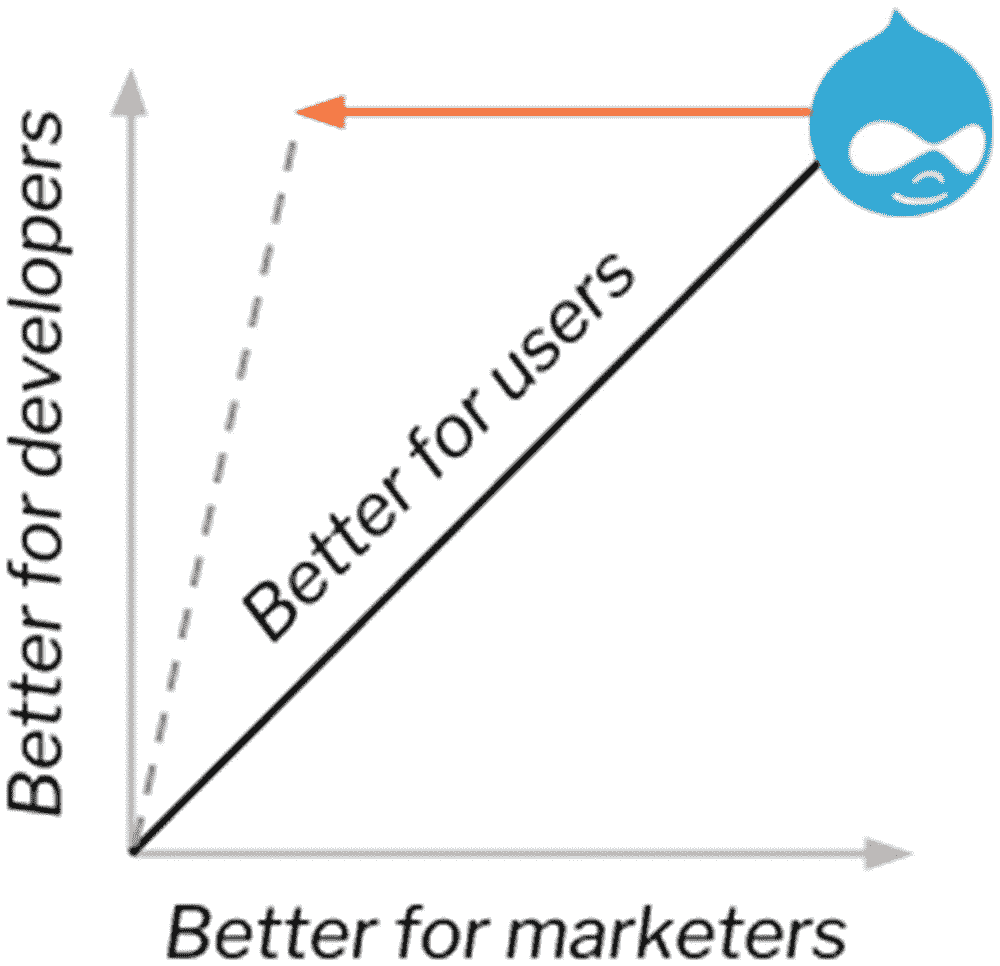
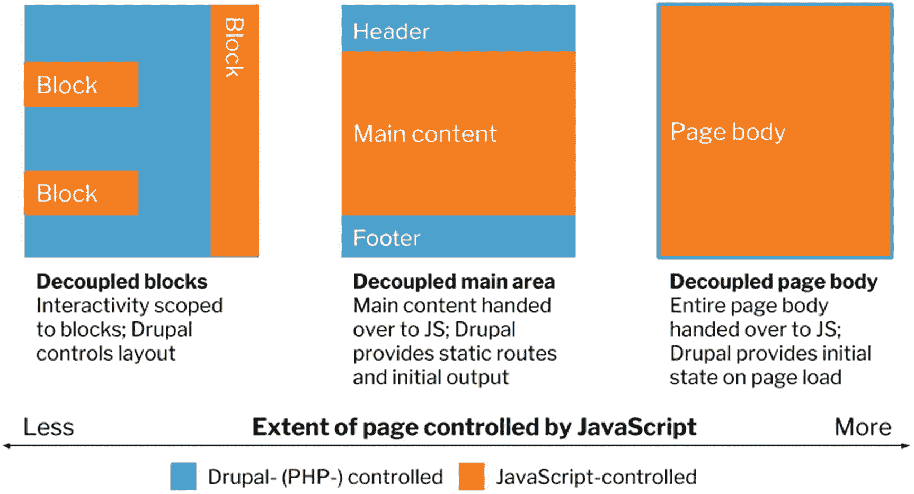
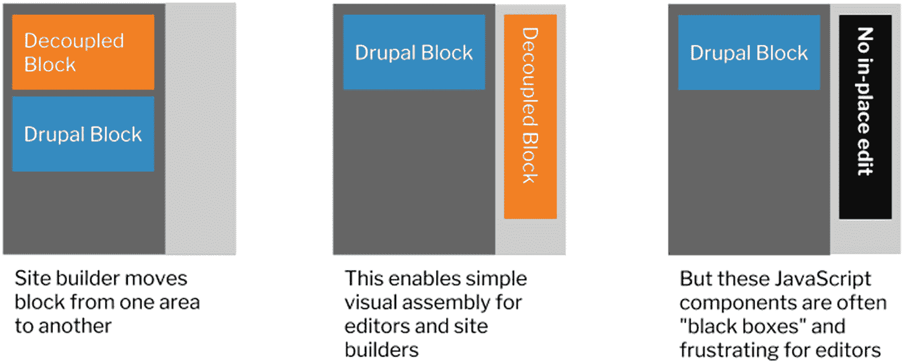
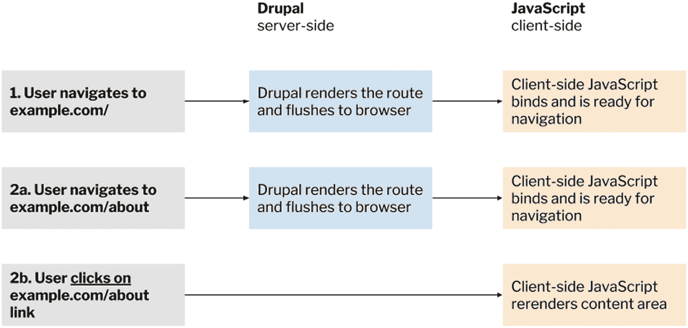
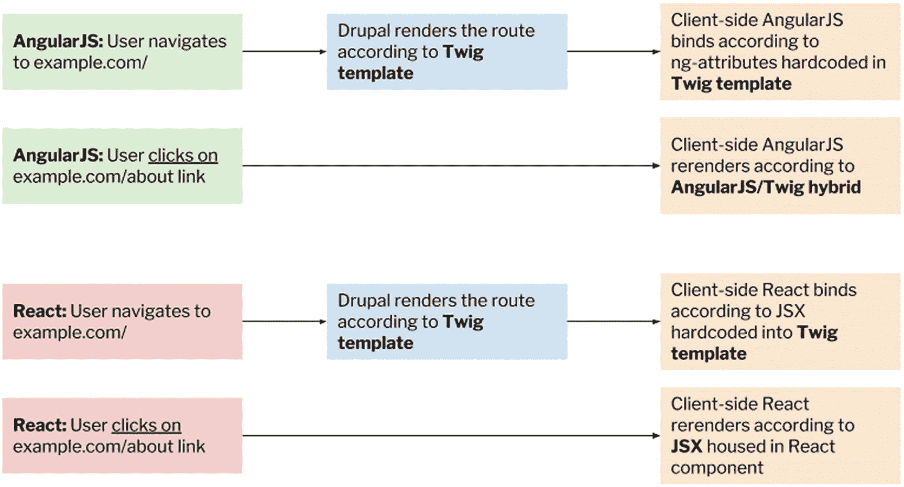

# 排版后的内容

近年来，Drupal 在提升其 JavaScript 开发体验方面取得了重大进展，包括采用 Airbnb JavaScript 风格指南、引入 JavaScript 构建流程，以及在 Drupal 8 发布周期内升级至最新版本的 jQuery 和 jQuery UI。截至本文撰写时，Drupal 8.6 还附带了对 `Nightwatch.js` 的支持，这是一种用于编写 JavaScript 自动化测试的常见且流行的工具。与之前缺乏客户端通用性的测试系统相比，这代表了一项显著改进，并取代了现已弃用的 `PhantomJS`。

在 Drupal 8.7 开发周期中，计划进行多项大规模改进。其中之一是创建一个独立的单页 React 应用，该应用在更具动态性的用户界面中复制了所有现有的 Drupal 管理界面。Drupal 用户体验团队与 JavaScript 团队之间的这次合作，不仅将带来改进的管理体验，还将提供一个测试 Drupal Web 服务极限的机会。^(¹¹³)

**注意**：有关管理 UI 和 JavaScript 现代化计划的更多信息，请查阅 Drupal.org 上的计划页面 [`https://www.drupal.org/about/strategic-initiatives/admin-ui-js`](https://www.drupal.org/about/strategic-initiatives/admin-ui-js) 和路线图问题页面 [`https://www.drupal.org/project/drupal/issues/2926656`](https://www.drupal.org/project/drupal/issues/2926656)。

### Drupal 前端的未来

迄今为止，Drupal 成功的主要原因之一，在于其价值主张能够满足多种用户角色。换句话说，没有哪个单一角色能显著比其他角色获益更多。Drupal 长期以来一直以其处于三种截然不同用户角色交汇点的独特定位而自豪。

1.  *开发者*，受益于灵活的开发者体验和高度的可扩展性。
2.  *营销人员*，受益于情境化的管理工具和编辑权限。
3.  *用户*，受益于其他两种角色所构建的任何用户体验。

在解耦式 Drupal 日益成为 Drupal 架构首选架构的未来中，Drupal 前端有多种可能的发展方向。最稳妥的方法是为那些倾向于使用 Drupal 主题层组件（如 Twig 和预处理函数）的用户保留 Drupal 前端的当前状态。这将使“站点与代码库”用例（见第 4 章）成为使用 Drupal 的主要方式。

尽管如此，这本身也带来了问题。如今，站点构建者和内容编辑者期望（尽管这种期望可能不切实际），他们在 Drupal 中用于创建和布局内容的相同工具，也能用于那些不由单体 Drupal 前端驱动的体验中。不乏这样的例子：失望的客户选择了完全解耦的 Drupal 作为解决方案，并搭配了 JavaScript 应用，结果却发现自己现在无法执行之前唾手可得的就地编辑和布局管理操作。

例如，一些营销人员可能认为，用于在网站上定位内容的相同布局工具，也应当可用于数字标牌和增强现实界面，这一点至关重要，尽管这两个渠道可能完全依赖于无关且基础设施迥异的技术。

站点构建者和内容编辑者的期望，与依赖于千差万别技术的多渠道分散现实之间的这种错位，我称之为 Drupal 的新不协调性，如图 26-1 所示。特别是那些已经接受跨多设备无缝体验是必备功能的营销人员，他们的期望可能与支撑这些体验的技术完全不一致，甚至无法调和。

**图 26-1** 随着最终用户期望的渠道数量增加，为最终用户带来更好结果，需要开发者进行更多定制工作以使体验在更多渠道上运行，从而导致营销人员的灵活性降低。

#### 通用编辑

在 2010 年代初期 Spark 计划时期，当 Drupal 开始提供能够在移动和桌面设备上无缝工作的响应式管理界面时（如图 26-2 所示），人们仍然可以设想内容编辑者能够在所有设备上创建和管理内容。得益于响应式设计，除了桌面端，将编辑体验和最终用户体验同时置于移动设备上成为了可能。

**图 26-2** Spark 计划引入了能够对视口变化做出响应式反馈的移动编辑界面。

然而，这也有其缺点。由于屏幕可用空间有限，可供内容编辑者和站点构建者使用的功能范围受到限制。例如，很难想象在移动设备上进行布局管理。Spark 计划发现，许多用户更倾向于切换到桌面平台来执行复杂操作，并且此类移动编辑界面的实用性有限。

如今，随着 Apple Watch 等设备的出现，试图在每个设备上都放置编辑界面显然是不可行的。然而，对于期望值很高的营销专业人士来说，设想一个能够充分管理和操作当前存在的各种最终用户体验的桌面端界面，也同样复杂。

从这个意义上说，或许*通用编辑*应当指的是从单个桌面界面管理多种不同体验的概念，以获得最大的多功能性。事实上，在 2016 年初，Drupal 项目负责人 Dries Buytaert 主张 Drupal 中的编辑界面应该朝着更*由外而内*或与页面内容脱节的方向演进。Terrence Kevin O’Leary 也将此称为 *Literal UI*。

在 Drupal 传统的就地编辑和上下文链接方法中，这些功能与其所操作的内容相邻。然而，当 Drupal 被用于编辑和预览面向其他渠道（例如 JavaScript 应用和由其他技术驱动的数字标牌）的内容时，这是不可能的。通过将所有以前处于上下文中的工具放在页面的一个独立区域（不干扰预览），我们可以为在同一空间内管理其他渠道打开大门。

尽管如此，在 Drupal 驱动的界面内为其他渠道提供高保真预览的想法引发了一些重要问题。当数字标牌或增强现实界面所依赖的技术与 Web 技术无法调和时，能达到何种保真度？是否可能提供必要的模拟器，还是基础设施方面的要求过于苛刻？^(¹¹⁴)

### 注意

欲深入了解该主题，请参阅该作者在 DrupalCon 维也纳大会上的演讲“解耦站点构建：Drupal 的下一个挑战”，视频地址为 [`https://events.drupal.org/vienna2017/sessions/decoupled-site-building-drupals-next-challenge`](https://events.drupal.org/vienna2017/sessions/decoupled-site-building-drupals-next-challenge)。

### 渐进式解耦与解耦区块

其他渠道在满足营销专业人员对网站以外的编辑和管理体验的期望时，需要付出巨大努力；而像 Drupal 这样的 JavaScript 应用同样基于 Web 技术，理论上在 Drupal 环境下应该更容易获得支持。

**渐进式解耦**（参见第 4 章）在 Drupal 社区中长期以来一直被视为一种平衡方案：一方面是渴望获得更符合其期望的开发体验的 JavaScript 开发者，另一方面是需要像传统 Drupal 一样轻松编辑和布局页面的营销专业人员及内容编辑。这种方法涉及将单页 JavaScript 应用插入到 Drupal 前端中，从而仍能利用诸如区块放置等上下文工具，并可使用 ES6 及其他现代开发技术来驱动更具交互性的体验。

然而，如图 26-3 所示，渐进式解耦也带来了自身的问题，因为并非 Drupal 所有备受推崇的上下文功能都对营销人员和内容编辑开放。此外，渐进式解耦使得 JavaScript 开发者更难通过服务器端渲染来提升应用性能，因为 Drupal 前端负责提供 JavaScript 应用的资源。

**图 26-3** 渐进式解耦 Drupal 方法的谱系

`Decoupled Blocks`是由 Matt Davis（`mrjmd`）开发的一个模块，它采用了一种框架无关的方式，在操作布局和放置内容的站点构建者与内容编辑，以及需要操控 JavaScript 行为的前端开发者之间建立了一种平衡。在 `Decoupled Blocks` 模块中，Drupal 将 JavaScript 组件渲染为区块，并允许这些 JavaScript 组件访问某些可提供状态或其他信息的区块配置。

`Decoupled Blocks` 是针对一个难题的优雅解决方案；它在站点管理员需要根据 Drupal 中一直存在的熟悉的拖放范式来管理布局，与 JavaScript 开发者希望对页面上交互组件的行为拥有更大控制权这两者之间，成功地达成了折衷。

一个并非 `Decoupled Blocks` 独有、并适用于所有渐进式解耦 Drupal 实现的重要问题是：尽管某些功能（如区块放置）保持不变，但渐进式解耦会导致出现“黑盒”，使得原本期望的 Drupal 功能（如就地编辑）变得不可用。此问题如图 26-4 所示。

**图 26-4** 渐进式解耦的主要问题在于，在交由 JavaScript 负责的页面部分中，某些 Drupal 功能（如就地编辑）不可用

### 注意

`Decoupled Blocks` 可在 Drupal.org 上获取，地址为 [`https://www.drupal.org/project/pdb`](https://www.drupal.org/project/pdb)。有关渐进式解耦 Drupal 方法的更多信息，另请参阅该作者在 Acquia 博客上发布的文章“渐进式解耦 Drupal 方法”，地址为 [`https://dev.acquia.com/blog/progressively-decoupled-drupal-approaches/22/08/2016/16296`](https://dev.acquia.com/blog/progressively-decoupled-drupal-approaches/22/08/2016/16296)。

### 共享模板、渲染与路由

由于 JavaScript 与 Drupal 开发实践之间存在巨大差异，诸如 Admin UI 和 JavaScript Modernization Initiative 等社区驱动的工作强调一种完全独立的现代化 Drupal 管理界面方法：即构建一个独立的 React 应用，该应用不依赖 Drupal 前端的任何方面，而是完全依赖 Drupal 可用的 Web 服务。

尽管如此，一些 Drupal 用户已经探索了在 JavaScript 和 Drupal 之间共享职责的可能性，以便它们能在 Drupal 前端共存。毕竟，采用通用 JavaScript 的主要动机之一是在 JavaScript 应用的服务器端和客户端版本之间共享代码。如果在服务器端 Drupal 实现和客户端 JavaScript 应用之间也能做到同样的事情呢？

**共享模板**的理想状态是 Drupal 和 JavaScript 在服务器端和客户端都依赖相同的模板系统。由于有诸如 `Twig.js`（它是 Drupal 8 中使用的 Twig 模板语言的 JavaScript 实现）这样的项目，这一理想状态变得可能。尽管如此，Drupal 8 对 Twig 的实现包含了许多 Drupal 特有的细微差别，这严重阻碍了在 Drupal 渲染层和 JavaScript 驱动的前端之间提供通用版本 Twig 的任何努力。

**共享渲染**即 Drupal 和 JavaScript 以相同方式进行渲染，也一直被提议作为一种解决方案，以使 Drupal 前端演变为一个对 JavaScript 更友好的环境。然而，尽管这在通用 JavaScript 中是可行的（因为语言在客户端和服务器端相互可理解），但 Drupal 是用 PHP 编写的。任何在 Drupal 中跨客户端和服务器进行渲染的尝试，要么需要将 Drupal 渲染层重写为 JavaScript（从而必须使用 Node.js 作为渲染代理，并考虑相关的基础设施挑战），要么需要使用库 `php-v8-js`（它在 PHP 中实现 V8 JavaScript 引擎，但仍处于高度实验阶段）。

没有选择这两个未经测试的方向，一些 Drupal 用户转而选择了**共享路由**，即 Drupal 和 JavaScript 框架在单个域上共享路由，但执行不同的渲染。例如，如果 JavaScript 框架在应用中有某个可用路由，它可以渲染该路由，而 Drupal 则可以渲染 JavaScript 应用中未涵盖的路由。这将允许 Drupal 路由在 JavaScript 路由不可用时作为回退机制。Drupal 路由作为 JavaScript 路由的超集这一概念如图 26-5 所示。

**图 26-5** Drupal 路由作为 JavaScript 路由的超集

尽管如此，共享路由也带来了一些额外的困难，尤其是当客户端渲染参与进来时。模板重复必然会发生，因为当用户点击链接时，JavaScript 框架会执行动态渲染，而这种动态渲染只有在启用了诸如 `RefreshLess`（由 Wim Leers 创建，灵感源自 Ruby on Rails 中的 `Turbolinks` 项目）之类的模块时才会在 Drupal 中发生。

由于许多用户禁用了 JavaScript，因此必须有一种替代方案，能够在 JavaScript 不可用时提供服务器端渲染。因此，当 JavaScript 被禁用时，路由会回退到使用 Twig 模板的 Drupal 版本；而当 JavaScript 启用时，则会改用 JavaScript 模板。尽管对一些架构师来说，模板重复可能不是大问题，但这会在后续开发中引发可维护性问题。这一困境在图 26-6 中进行了说明。

**图 26-6** 客户端渲染挑战了共享路由的使用，因为当 JavaScript 可启用或禁用时，它会造成模板重复

**注意**  
`RefreshLess`模块可在 Drupal.org 上获取，地址为[`https://www.drupal.org/project/refreshless`](https://www.drupal.org/project/refreshless)。要深入了解此主题，请参阅本文作者在 DrupalCon 维也纳的演讲“解耦站点构建：Drupal 的下一个挑战”，地址为[`https://events.drupal.org/vienna2017/sessions/decoupled-site-building-drupals-next-challenge`](https://events.drupal.org/vienna2017/sessions/decoupled-site-building-drupals-next-challenge)。

### 从设计上解耦 Drupal

由于许多架构师在尝试让 Drupal 和 JavaScript 在同一实现中共存时面临诸多挑战，包括本文作者在内的许多用户都认为，Drupal 不应试图集成其他技术，而应*在设计中解耦*，即 Drupal 当前所有可能的功能都应能通过网络服务或 RPC 提供。2018 年 7 月，Lauri Eskola（`lauriii`）和本文作者在里斯本举行的 Drupal 开发者日上做了一场演讲，阐述了这一发展方向的动机和愿景。

从设计上解耦最令人信服的理由之一，源于开发者在 Drupal 陡峭的前端学习曲线和其被认为过时的问题上所面临的众多挑战。绝大多数开发者已涌向解耦的 Drupal 架构，以追求符合当前流行开发实践的 JavaScript 实现。然而同时，编辑者和站点构建者却抱怨 Drupal 中缺乏上下文工具和其他需要单体架构支持的功能。

从设计上解耦 Drupal 还将意味着，Drupal 安装过程会为用户提供单体（标准）、增强单体（标准加 API 优先）和解耦（API 优先）这三种安装配置文件，从而形成广泛使用的三种 Drupal 风格。在前者中，前端可用的所有 Drupal 功能将保持不变。在后者中，所有 Drupal 功能则将通过 Web 服务和 RPC 访问，而上下文工具（如就地编辑）将被禁用。

**注意**  
在 Drupal 中，*安装配置文件*为开发者打算构建的特定类型 Drupal 实现提供站点特性和功能。这通过一个包含 Drupal 核心、额外贡献模块和预制配置的单一下载包提供。

然而，从设计上解耦 Drupal 的前景也提出了几个尚未解决的重要问题，例如对 Drupal 用户群的影响。一个在设计上解耦的 Drupal 是否意味着在 JavaScript 和其他消费端开发者（创建通用 JavaScript 和原生应用）与利用 Twig 的 PHP 开发者（赋能内容创建者、站点构建者和主题制作者）之间造成永久性分裂？解耦环境下，上下文工具（如就地编辑和上下文链接）是否将不可用？在假设的 Drupal 解耦安装配置文件中，每个贡献模块都需要通过网络服务提供 API 优先的功能，以匹配核心模块的功能。这种体验将特别针对解耦用例进行优化，从而无需那些具有前端功能的模块，如`Quick Edit`（就地编辑）和`Contextual Links`。在此过程中，Drupal 社区可以确保在基于 JavaScript 的用户界面不可用时存在回退方案；我们可以转而利用 Twig 和 Drupal 的`Form API`来产生支持两种模型所需的灵活性。

无论关于从设计上解耦 Drupal 以及 Drupal 管理界面未来的讨论结果如何，需要考虑的最重要概念之一是：尽管开发者渴望完全解耦的 Drupal 架构，但编辑者和营销人员对开箱即用的完整功能实现仍有严格的要求，无论其架构构成如何。从这个意义上说，也许 Drupal 需要做到*架构上解耦但体验上单体*，即使后者仅仅是感知上的。^(¹¹⁵)

**注意**  
要深入了解此主题，请参阅 Lauri Eskola 和本文作者在 2018 年里斯本 Drupal 开发者日上的演讲“Drupal 9：从设计上解耦？”，地址为[`https://lisbon2018.drupaldays.org/sessions/drupal-9-decoupled-design`](https://lisbon2018.drupaldays.org/sessions/drupal-9-decoupled-design)。

### 结论

在本章中，我们探讨了解耦式 Drupal 在短期、中期和长期面临的一些问题。首先，关于短期努力，我们描述了管理界面与 JavaScript 现代化倡议的当前工作，其社区成果已产生可操作的成效。其次，关于中期愿景，我们思考了社区实现与 JavaScript 更深度融合的一些方式。

本章对 Drupal 社区而言，最直接相关的部分或许是关于 Drupal 转型为真正 API 优先 CMS 的潜力。正如 Lauri Eskola 和我所主张的，既然 Web 服务的优势在解耦式 Drupal 架构中已得到广泛认可，那么是时候在 Drupal 核心及构成其生态系统的贡献模块中充分利用这一功能了。通过这样做，我们可以扩大 Drupal 的用户群体，吸引那些开发仅几年前还难以想象的新颖体验的开发者。

至此，我们探索解耦式 Drupal 的旅程告一段落。我们穿越了一个快速扩张且极其多样化的宇宙，其中蕴含着令人惊叹的丰富可能性，展现出 Drupal 一片充满希望的前沿领域。尽管如此，Drupal 的未来尚未完全确定。要巩固 Drupal 在真正 API 优先 CMS 中的地位，并鼓励其他生态系统的开发者采用 Drupal 及其引人注目的新功能，仍有大量工作要做。然而，凭借迄今为止无数贡献者打下的基础，以及整个行业对解耦式 Drupal 架构的积极早期采用，Drupal 正处于其历史上的一个关键且重大的转折点。

Drupal 社区的无数贡献者不懈努力，为全球解耦式 Drupal 实践者带来了重要功能。请考虑通过加入贡献工作来帮助 Drupal 社区规划这些发展轨迹的未来，无论是报告问题队列中的漏洞、编写文档、审查补丁和拉取请求，还是改进设计和可用性成果。

感谢解耦式 Drupal，也感谢世界各地不知疲倦的贡献者的努力，Drupal 的未来一片光明，充满无限可能。

