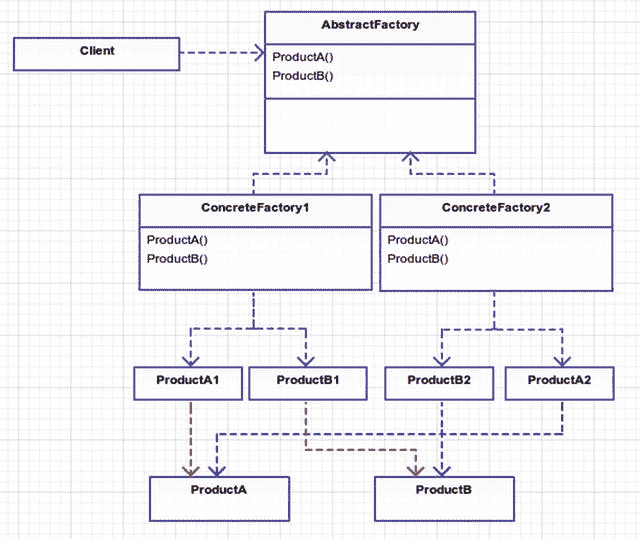
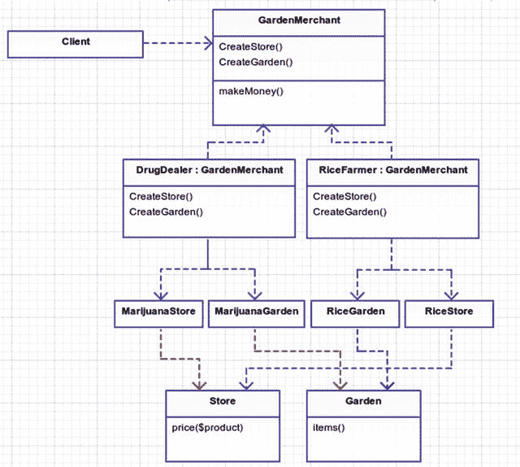

# 三、抽象工厂

```php
$> git checkout abstract_factory

```

## 目的

提供创建相关或依赖对象系列的接口，而无需指定它们的具体类。 [<sup>1</sup>](#Fn1)

## 应用

当您拥有一系列多少有些关联的对象时，您可以使用工厂来创建产品。有时你想创造产品的变体。产品可以是任何类别。可能是`User, Airplane`，也可能是`House`。在处理房地产时，商业不同于住宅。在这种情况下，您可以创建两个工厂:一个用于商业，一个用于住宅。住宅工厂可以生产房屋和土地等产品。商业工厂可以生产像商店建筑和停车场这样的产品。房地产客户仍然可以进行诸如出售、购买和列出地段、土地、房屋和商店建筑等操作。当你改变你的工厂时，你不必改变你的客户。

## 抽象结构

*   这个类使用了抽象工厂。见图 [3-1](#Fig1) 。具体工厂可以作为参数传递给客户端的构造函数，或者客户端可以足够聪明地知道使用哪个具体工厂，而无需依赖注入。例如，客户端可能决定使用基于运行的操作系统(Windows、Linux 或 Mac)的系列。

    

    图 3-1。

    This is an abstract uml document of abstract factory. It’s all abstract!
*   `AbstractFactory`:这可以是具体工厂实现的接口或者抽象类。如果你使用一个抽象类，那么默认的行为可以内置到基础抽象类中。

*   `ConcreteFactory` (1 和 2):这些类从`AbstractFactory`继承，并为其具体的系列类型生成产品。图 [3-1](#Fig1) 中只显示了两个`ConcreteFactories`，但是如果需要可以有更多。

*   `Product` (A 和 B):这些是抽象类或接口，将由具体的产品类 A1、B1、A2、B2 等等来实现。

*   (A1/B1 和 A2/B2):这些类都属于一个家族。A1 和 B1 与 A2 和 B2 属于不同的家族，所以它们是由不同的工厂制造的。这些是您关心的类，并且以某种方式被客户端使用。

## 例子

您正在创建一个可以在 PG-13 或 R 级模式下运行的模拟器。游戏的名字叫花园忍者。植物生长在花园里，商人出售或消费这些植物。你可以创造各种各样的水果和蔬菜。你可以用多种方式出售农产品。商家的基本步骤是

1.  种植一个花园。

2.  卖农产品。

游戏的目标从未改变。改变的是基于玩家的产品的基本系列，它可以根据玩家的成熟程度而改变。

您将创建两个不同的花园商人家族:

1.  毒品贩子

2.  稻农

一个稻农将种植一个稻田。稻农不会像毒贩那样种植和销售大米。毒品贩子正在生产非法大麻，所以他的行动很可能是秘密的。

## 示例结构

图 [3-2](#Fig2) 为示例结构。



图 3-2。

Put it all together and make a family of related objects. Rice farmers and drug dealers are related by a family of products (gardens and stores). Who knew, right?

## 履行

如果你想看这个作品，下载资源库并查看 branch `abstract_factory.`

你的模拟器会从一个随机的成熟度等级中创建一个新的商家，然后从这个商家身上赚钱。由于存在风险，毒品贩子比种植水稻的农民赚得更多。不是说大米没有风险什么的。

app/simulator.php

```php
require __DIR__ . '/../vendor/autoload.php';

$ratings = array(
        'PG-13' => new GardenNinja\RatedPG13\RiceFarmer,
        'R' => new GardenNinja\RatedR\DrugDealer
);

$merchant = $ratings[array_rand($ratings)];

$client = new App\Client($merchant);

$client->run();

```

这里有很多缺失的部分。让我们从检查`Client`类开始。

```php
class Client

{
        public function __construct(Merchant $merchant)
        {
                $this->merchant = $merchant
        }

        public function run()
        {
                print "Your merchant made $" . $this->merchant->makeMoney() . PHP_EOL;
        }
}

```

接下来，`Merchant`类充当这个例子中`Client`类使用的抽象工厂。

app/Merchant.php

```php
<?php namespace App;

abstract class Merchant

{
        abstract public function createStore();
        abstract public function createGarden();

```

您依赖于您的混凝土工厂，它们实现`Merchant`来创建您的两种产品:商店和花园。所有的商人都试图赚钱，所以你把这个方法放在这个抽象类中。

app/Merchant.php

```php
public function makeMoney()
{
        $makeMoneyMoneymakeMoneyMoney = 0;
        $store = $this->createStore();
        $items = $this->createGarden()->items();
        foreach ($items as $item) {
                $makeMoneyMoneymakeMoneyMoney += $store->price($item);
        }
        return $makeMoneyMoneymakeMoneyMoney;
}

```

如果你理解了`RiceFarmer`类的工作原理，你就应该理解`DrugDealer`类的工作原理。它们是相关的，因为它们都属于商人抽象家族。所以让我们来看看`RiceFarmer`类。

app/rate DPG 13/recrear . PHP

```php
<?php namespace App\RatedPG13;

class RiceFarmer extends Merchant
{
        public function createStore()
        {
                return new RiceStore;
        }

        public function createGarden()
        {
                return new RiceGarden;
        }
}

```

很简单，对吧？`RiceStore`只是负责产品定价，而`RiceGarden`创造新的`Rice`商品供我们销售。然而，你可以在这里得到相当复杂的定价和多少项目返回到你的花园从各种外部因素。

当你运行`php app/Simulator.php`时，你会看到有时你的商家赚 20 美元，有时赚 300 美元。这完全取决于模拟器运行的随机等级以及传递给客户端的具体商家类型。

## 结论

您使用抽象工厂创建了一系列与`Merchant`相关的产品。你为什么做这些工作？在这个模拟中，您可以做一些条件语句并获得相同的结果。为什么要创建所有这些类？这对你有什么好处？

在这个例子中，你的类非常简单(`RiceStore`和`RiceGarden`)。在现实世界的例子中，这些类可能要复杂得多。您使用抽象工厂模式的模块化设计允许随着您添加额外的商家而增长。

在前面的章节中，您学习了如何封装变化。在您的模拟器中，您可以为其他蔬菜、大豆、草药和香料添加更多的商人类型。你甚至可以支持更疯狂的想法，比如糖果花园。这样做，你不会被迫编辑现有的职业，只会增加更多的商人类型到游戏中。

抽象工厂的一个缺点是对抽象`Merchant`类的任何改变都会渗透到所有的具体类中。这意味着你必须对你的应用的结构以及产品系列如何组合在一起进行长时间的思考。在您的示例应用中，按照成熟度等级对产品系列进行分组可能没有意义。

另一个缺点是，您可能会在使用这种设计上花费很多精力，如果事情需要大幅改变，重构可能会更加困难。在您的示例场景中，无疑有一种比使用抽象工厂设计模式更简单、更好的方法来构建这个应用，因为这个人为的示例相当简单。你能想到其他的缺点吗？

Footnotes [1](#Fn1_source)

设计模式:可重用面向对象软件的元素，第 99 页