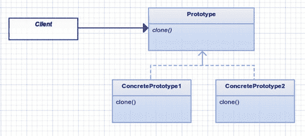

# 6.原型

```php
$> git checkout prototype

```

## 目的

使用原型实例指定要创建的对象种类，并通过复制该原型来创建新对象。 [<sup>1</sup>](#Fn1)

## 应用

当您想要派生和修改现有对象时，请使用原型模式。这种模式的一个很好的用途是，当您希望避免构建一个需要花费大量时间或者创建起来很复杂的类时。创建成本高的对象的一个例子是使用 web 服务获取数据的对象。但是，一旦有了数据，就不再需要从 web 服务获取数据；你只需克隆数据。还有另一种称为代理的模式，它也是这里描述的 web 服务示例的一个很好的候选。很快您就会看到，您也可以使用这种模式来克隆复杂的对象。

## 抽象结构

图 [6-1](#Fig1) 为结构示意图。

*   `Client`:使用`Prototype`类。这可以是一个类或脚本本身。在这个例子中，您甚至不用担心客户端。

*   这是一个抽象类，其他类可以扩展。但是，如果只有一个`ConcretePrototype`，它不一定是抽象的。`clone`方法用于复制类的内部结构，这样你就可以创建一个具有相同内部结构的新对象。

*   `ConcretePrototype` (1/2):这些类从`Prototype`类扩展而来，可以为原型的每个变体提供额外的方法。如果原型没有变化，你可以把它合并成`Prototype`。



图 6-1。

Clone, clone, everywhere a clone

## 例子

1996 年 7 月 5 日，世界永远地改变了，那一天，第一只由成年体细胞克隆而成的哺乳动物绵羊多利诞生了。新生的多莉之所以被命名为多莉，是因为她是用乳腺克隆的，而歌手多莉·帕顿在这方面尤其臭名昭著。多莉死于攻击其储存系统的逆转录病毒。肺部问题实际上在克隆体中很常见。这就是为什么你要在模拟器中跟踪每只羊的肺部。

## 示例结构

注意在图 [6-2](#Fig2) 中，你没有在这个例子中创建绵羊的变体；所以`ConcretePrototype1`变成了`Prototype`。


图 6-2。

Example prototype structure

## 履行

您将使用 PHP 的本机内置克隆机制来应用原型模式。这不是实现原型模式的必要条件，因为您可以创建自己的克隆方法；然而，以我的非专业观点来看，了解当地人要容易得多，也更酷。

假装你有羊…

app/Sheep.php

```php
namespace App;

{
        public $name = "Big Momma";
}

```

现在你已经证实了羊的存在，我感到非常兴奋，因为我有一些非常糟糕的关于羊的笑话要告诉你。 [<sup>2</sup>](#Fn2)

*   你怎么称呼一只裹着巧克力的羊？糖果咩。

*   如果你把一只愤怒的绵羊和一头喜怒无常的母牛杂交，你会得到什么？一只哞哞叫的动物。

*   墨西哥的羊怎么说圣诞快乐？抓绒纳维达！

*   织一件毛衣需要多少只羊？别傻了。羊不会织！

*   绵羊在哪里剪羊毛？在咩咩商店！

好吧，我希望我们喜欢这些笑话。现在我已经从我的系统中获得了这些，下一步是构建一个模拟器，为您创建和管理绵羊。

src/模拟器

```php
$sheep = new App\Sheep;
$dolly = $sheep;
$dolly->name = "Dolly Parton";
var_dump($sheep, $dolly);

```

你的模拟器应该会给你吐出`$sheep`和`$dolly`的名字。你知道`Dolly Parton`是`$dolly;`的名字，但是，在这种情况下，你认为出发`$sheep`的名字是什么？

模拟器输出

```php
class Sheep
#2 (2) {

  public $name =>
  string(5) "Dolly Parton"
 }

class Sheep
#2 (2) {

  public $name =>
  string(5) "Dolly Parton"
}

```

哦哦。看起来`$sheep->name`不再是`Big Momma.`了，如果你习惯于面向对象编程，并且知道内存指针是如何工作的，那么这可能对你来说并不奇怪。不过，在本例中，您不需要担心 sheep 对象中的数据是 baaaaaaa-ad。你可能已经注意到这两个对象都指向绵羊#2。这告诉你`$sheep`和`$dolly`都指向内存中完全相同的地址。在 PHP 中，当一个对象被设置为等于另一个对象时，那么两个对象都引用内存中的同一个地址空间。见图 [6-3](#Fig3) 。


图 6-3。

We are the same object, boss!

如果你想让它们有不同的内存地址，你应该克隆绵羊，这正是你要做的。

src/模拟器

```php
$dolly = clone $sheep;

```

这利用了另一个内存槽，并将`$name`变量复制到新的内存地址。现在当你更新`$dolly`的名字时，它不会影响`$sheep`的`$name`，因为它在内存中使用了一个完全不同的地址。见图 [6-4](#Fig4) 。


图 6-4。

Cloning at its finest

如果您再次运行模拟器，您可以看到输出正是您想要的。

模拟器输出

```php
class Sheep
#2 (2) {

  public $name =>
  string(5) "Big Momma"
 }

class Sheep
#4 (2) {

  public $name =>
  string(5) "Dolly Parton"
}

```

暂时一切都好；然而，这里您还没有真正实现原型模式。下一件要做的事情是修改 sheep 类，至少添加一个复合类。

app/simulator.php

```php
$sheep = new App\Sheep(new App\Lungs);

$dolly = clone $sheep;
$dolly->name = "Dolly Parton";
$dolly->applyVirus('JaagsiekteVirus');
var_dump($sheep, $dolly);

```

在你运行你的模拟器之前，你应该给 sheep `Lungs`(一个新的类)，并且给`Sheep`类添加`applyVirus`方法。这种方法会损害羊的肺部。就像真人快打角色的健康指示器一样，肺也有一个健康指示器。健康范围从 0 到 100 %;当一只新绵羊出生时，肺部是 100%健康的。使用`JaagsiekteVirus`后，肺部健康达到 20%。

app/Sheep.php

```php
namespace App;

{
        public function __construct(Lungs $lungs)
        {
                $this->name = "Big Momma";
                $this->lungs = $lungs;
        }

        public function appyVirus($virusType)
        {
                $this->lungs->health(20);
        }
}

```

现在，当您运行模拟器时，您会得到以下输出:

模拟器输出

```php
class Sheep
#2 (2) {

  public $name =>
  string(9) "Big Momma"
  public $lungs =>
  class Lungs
#4 (1) {

    protected  $health =>
    int(20)
  }
}

class Sheep
#3 (2) {

  public  $name =>
  string(12) "Dolly Parton"
  public  $lungs =>
  class Lungs
#4 (1) {

    protected  $health =>
    int(20)
  }
}

```

哦，又来了。你克隆了绵羊，但克隆的只是原始内部变量的肤浅拷贝。这意味着在您的模拟中，两只不同名称的绵羊共享同一套肺。这是不应该发生的，所以你需要强制进行深度克隆，并在你的羊被克隆的任何时候创造不同的肺。要解决这个问题，您可以使用神奇的`clone`方法。

app/Sheep.php

```php
public function __clone()
{
        $this->lungs = clone $this->lungs;
}

```

现在，只要一只羊被克隆，它们的肺也会被克隆。这使得羊和肺对象不能共享内存地址。克隆的缺点是使用了更多的内存地址空间，所以除非确实需要，否则不要克隆对象。再次运行模拟器会显示正确的输出。

模拟器输出

```php
class Sheep
#2 (2) {

  public $name =>
  string(9) "Big Momma"
  public $lungs =>
  class Lungs
#4 (1) {

    protected  $health =>
    int(100)
  }
}

class Sheep
#3 (2) {

  public  $name =>
  string(12) "Dolly Parton"
  public  $lungs =>
  class Lungs
#5 (1) {

    protected  $health =>
    int(20)
  }
}

```

这就完成了原型模式。该模式的重点是将任何对象引用复制到它们的外部内存地址空间，这样您就可以彼此独立地使用这些对象。在您的示例中，`Sheep`并不复杂，但是您可以添加许多变量来测量模拟器中动物的稳定性和健康状况。

这里为什么不用简单的工厂呢？这个原型模式看起来需要做很多额外的工作，不是吗？你可以用一个简单的工厂来创造第一只原羊。然而，如果你通过应用一些病毒对绵羊进行内部改造，你会得到一只看起来不同的绵羊。如果你想开始克隆那只经过改造的羊呢？这就是原型模式优于简单工厂的地方。

app/simulator.php

```php
$sickSheep1 = clone $sheep;
$sickSheep1->applyVirus();
$sickSheep2 = clone $sickSheep1;

$sickSheep1->applyMedicine('Medicine 1');
$sickSheep2->applyMedicine('Medicine 1');

// compare the health of two sick sheep...

```

## 结论

在本例中，您使用克隆技术轻松地复制了绵羊。在这个例子中，`Sheep`对象非常简单，但是在现实生活的模拟器中，`Sheep`对象可能有许多变量和数据与之相关联。创造新的绵羊不应该是乏味的，你实际上很少关心这一部分。你更关心改造一只羊，看看它抵抗病毒的能力有多强。你当然不希望 new sheep 的构造方面压倒了你模拟器中的逻辑。

原型模式的一个缺点是您很容易违反单一责任原则。一个已经存在的类有一个责任，克隆只是给那个类增加了另一个责任。这是次要的，考虑到你现在可以非常容易地克隆对象。

这里没有看到的另一个缺点是，当使用原型模式时，您可能会以不同的方法结束不同的`ConcretePrototypes`。这使得管理新克隆的对象变得困难。例如，想象一下，如果你有两只具体类型的羊，分别叫做`WoolySheep`和`MilkingSheep`。它们有不同的方法:`MilkingSheep`有一个方法叫`gotMilk()`，`WoolySheep`有一个方法叫`gotWool()`。现在客户必须知道你在和哪种类型的羊打交道。如果客户端没有跟上，那么方法`gotMilk()`可能会在`WoolySheep`上被调用，这将抛出一个错误。

Footnotes [1](#Fn1_source)

设计模式:可重用面向对象软件的元素，第 133 页

  [2](#Fn2_source)

[T2`http://jokes4us.com/animaljokes/sheepjokes.html`](http://jokes4us.com/animaljokes/sheepjokes.html)