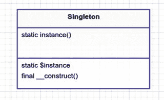

# 7.一个

```php
$> git checkout singleton

```

## 目的

确保一个类只有一个实例，并提供对它的全局访问点。 [<sup>1</sup>](#Fn1)

## 应用

简而言之:没有。老实说，我还没有发现 PHP 中单例模式的任何实际应用。最初的单例设计模式是为了确保一个类只能创建一个实例。它被用在后台打印程序的上下文中，在那里您只需要创建一个实例。开箱即用，PHP 是一个单线程环境，通常在 apache/nginx 线程中的生命周期很短。即使你使用了类似于[React PHP](http://reactphp.org/)[<sup>2</sup>](#Fn2)的东西，你也不能使用阻塞操作`(sleep, file_get_contents, global)`，所以在你的应用中，你不需要担心限制对某个类的单个实例的全局访问，因为即使在 React 中也会导致死锁。

因此，你将会学到一个变体，我称之为简化的单例。这些是您在 Laravel 服务容器中注册的单例，或者如果您没有使用 Laravel，您可以在某个 IoC 容器中注册它们。然而，如果你对如何实现单例模式感兴趣，让我们先看一下，然后通过展示用于单例模式的 Laravel 服务容器来结束这一章。

## 抽象结构

图 [7-1](#Fig1) 为结构示意图。

*   `Singleton`:注意对构造函数的`protected final`限制。构造函数只能从类本身内部调用。如果你还不存在，怎么可能调用一个方法来创造你自己？这是一个鸡和蛋的问题。不过，在这种情况下，通过使用静态方法`instance()`，您可以创建一个新的 singleton 实例，它存储在`protected $instance`变量中。



图 7-1。

The singleton pattern

## 例子

在本例中，您将制作一个计数器，它会在每次发出请求时递增。您将尝试两种方式:使用单例模式和简单单例模式。作为额外的奖励，您将创建具有 PHP 特性的 singleton 模式，称为 [trait](http://php.net/manual/en/language.oop5.traits.php) [<sup>3</sup>](#Fn3) 。为什么呢？因为你可以。

## 履行

首先:您需要创建一个对请求进行计数的类。

app/RequestCounter.php

```php
namespace App;

class RequestCounter

{
        private $numberOfRequestsMade = 0;

        public function numberOfRequestsMade()
        {
                return $this->numberOfRequestsMade;
        }
        public function makeRequest()
        {
                $this->numberOfRequestsMade++;
        }
}

```

接下来，我们来谈谈特质。什么是特质？如果你已经知道这一点，你可以跳过这一部分。当我第一次了解特质时，我非常努力，到处都在使用它们，不管是左还是右。我很疯狂。我花了几个星期才意识到我在滥用特质。在 PHP 中，我们使用特征作为混合功能的方式。在 PHP 中，我们不能扩展多个类(也称为多重继承)。特质是绕过这种限制的一种方式。然而，没有多重继承并不是一件坏事。如果不增加从多个类继承的能力，常规的经典继承已经足够困难了。有时我们有一小部分不属于任何特定类的功能，但是我们想添加到许多不同的类中；特征在这方面非常有用。不要像我一样对特质着迷。不要沉醉于特质力量，否则几周后你会发现自己患有严重的特质宿醉头痛。

您将创建一个名为`SingletonPattern`的特征，它可以被添加到任何类中，以便将它变成单例。我之前说过，你可能永远不会使用单例模式，所以你可以把它作为一个练习，看看特征的酷因素，并学习一个新的模式。

app/SingletonPattern.php

```php
namespace App;

trait SingletonPattern
{
        static protected $instance;

        final protected function __construct()
        {
                // no one but ourselves can create ourselves

        }

        static public function instance()
        {
                if (! static::$instance) {

                    static::$instance = new static;
                }
                return static::$instance;
        }
}

```

现在让我们利用这个特性。您将创建一个新类，它从`RequestCounter`扩展而来，并使用您的`SingletonPattern`特征。

app/requestcountersingleton . PHP

```php
namespace App;

class RequestCounterSingleton extends RequestCounter
{
        use SingletonPattern;
}

```

在这里等一下。为什么要创建这样一个新的类？原因很简单，而且是双重的。

1.  您希望能够对您的`RequestCounter`类进行单元测试。测试一个单体比一个普通的 ol' PHP 类更困难。

2.  稍后您将在 Laravel 服务容器中使用`RequestCounter`。服务容器会为你处理单例的东西，在这种情况下，你不需要这个`SingletonPattern`特征。

至此，您已经准备好使用您的 singleton 了。同样，这只是一个如何通过 traits 实现单例模式的例子。这样做实际上没有任何可行性；这纯粹是一种学习特质的教育尝试。

app/simulator.php

```php
App\RequestCounterSingleton::instance()->makeRequest();
App\RequestCounterSingleton::instance()->makeRequest();
App\RequestCounterSingleton::instance()->makeRequest();

// Singleton request hits: 3

print 'Singleton request hits: ' . RequestCounterSingleton::instance\
()->numberOfRequestsMade() . PHP_EOL;

```

现在让我们看看如何使用 Laravel 服务容器实现一个简单的 singleton。

app/simulator.php

```php
app()->instance('request.counter', new App\RequestCounter);
app()->make('request.counter')->makeRequest();
app()->make('request.counter')->makeRequest();
app()->make('request.counter')->makeRequest();
app()->make('request.counter')->makeRequest();
app()->make('request.counter')->makeRequest();

// Simple singleton request hits: 5

print 'Simple singleton request hits: ' . app('request.counter')
->numberOfRequestsMade() . PHP_EOL;

```

每次调用`app()->make()`，都是重用同一个`RequestCounter`类。它这样做只是因为您使用了`app()->instance()`，这使得 Laravel 将`'request.counter'`作为单例处理。您也可以使用服务容器，这样每次调用`app()->make()`时，它都会创建一个新的`RequestCounter`。如果你不想让`'request.counter'`成为单例，你可以创建一个绑定而不是一个实例，如下面的代码所示。

绑定示例(非单例)

```php
app()->bind('request.counter', function ($app) {
  return new RequestCounter;
});

```

在这一点上，你可能想知道为什么你要为一个单例使用服务容器而不是仅仅使用一个全局变量。事实上，服务容器是在`bootstrap/app.php`的第 14 行创建的一个全局变量。那么为什么不使用全局变量呢？为什么要做额外的工作？

引导程序. app

```php
$app = new Illuminate\Foundation\Application(
    realpath(__DIR__.'/../')
);

```

答案是，通过使用服务容器，您已经将所有客户端从`RequestCounter`类中分离出来。您可以在任何时候用具有相同接口的其他类替换掉`RequestCounter`,理论上您的应用的其余部分将继续运行。你可以通过替换掉`app()->instance('request.counter', new SomeOtherRequestCounter).`来做到这一点，这是你的框架库中一个非常灵活和强大的东西。

## 结论

您了解了单例模式和修改后的简单单例模式。您在 Laravel 和 traits 中介绍了服务容器。虽然您可能不会使用 singleton 模式，但您可能会在某个时候发现自己出于各种原因在 Laravel 服务容器中使用 singleton，包括性能增强或跨系统共享数据。

Footnotes [1](#Fn1_source)

设计模式:可重用面向对象软件的元素，第 144 页

  [2](#Fn2_source)

[T2`http://reactphp.org`](http://reactphp.org)

  [3](#Fn3_source)

[T2`http://php.net/manual/en/language.oop5.traits.php`](http://php.net/manual/en/language.oop5.traits.php)