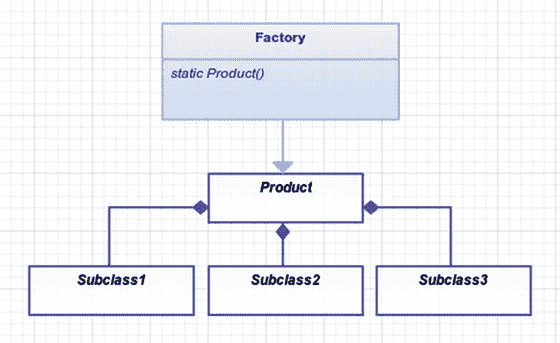

# 八、简单工厂方法

```php
$> git checkout simple_factory_method

```

简单工厂不是你在最初的 90 年代四人组设计模式书中找到的设计模式。然而，这是一种非常有用的创建对象的方法——非常有用，以至于我专门为它写了一章。

## 目的

简单工厂方法简化了创建新的具体对象的过程。

## 应用

使用一个简单的工厂可以使代码更干净，更容易处理。当您想要创建一个具有依赖关系的对象时，可以应用这种模式。这种模式可以用来重构代码中创建产品的地方。有人可能会说这就是我们之前讨论过的工厂方法模式。在某种程度上，这可能是真的。不同之处在于，我们不会为多种产品创建多个工厂。我们只创建一个可以生产各种产品的工厂。

## 抽象结构

*   `Factory`:这个类为你创建了`Product`(见图 [8-1](#Fig1) )。有时由于依赖关系，一个产品需要几行代码来创建；如果您在整个应用中都这样做，这就为 bug 潜入您的代码打开了大门。这也是一种将`Product`的创建与所有使用它的客户端分离的方法。你可以稍后在一个地方替换掉`Product`:??。

    

    图 8-1。

    Factory creates a shiny new product for you
*   `Product`:这个类可以由几个依赖项组成:`Subclass1`、`Subclass2`、`Subclass3`等…

## 示例场景

您将重构下面的代码以使用一个简单的工厂。

一些人为的例子

```php
$bar = new Bar('test', 123);
$baz = new Baz;
$foo = new Foo($bar, $baz);

```

## 履行

如果你发现自己一遍又一遍地做着同样的代码，那么把它抽象成一个工厂会使事情变得更容易。

另一个人为的例子

```php
$foo = Foo::factory();
  // or perhaps using Laravel's service container

$foo = app()->make('foo');

```

让我们看看如何用简单的 PHP 创建这个工厂方法。然后，您将把它工作到 Laravel 服务容器中。

app/Foo.php

```php
namespace App;

class Foo

{
        public function __construct(Bar $bar, Baz $baz)
        {
                $this->bar = $bar;
                $this->baz = $baz;
        }
        static public function factory(Bar $bar = null, Baz $baz = null)
        {
                $bar = $bar ?: new Bar('test', 123);
                $baz = $baz ?: new Baz;
                return new Foo($bar, $baz);
        }
}

```

这里发生了什么事？基本上，您已经将创建一个新的`Foo`对象的代码移动到这个工厂方法中。现在，如果您选择这样做，您可以覆盖依赖项，但是依赖项是默认硬连接的。

在工匠作坊里修修补补

```php
> Foo::factory()

// object(Foo)(

//   'bar' => object(Bar)(

//     'var1' => 'test',

//     'var2' => 123

//   ),

//   'baz' => object(Baz)(

//

//   )

// )

```

也许你不喜欢在你的`Foo`课堂上无所事事的`factory`方法。这是一个好迹象，表明您应该在其他地方重构代码。让我们专门为此创建一个`Factory`类。

app/Factory.php

```php
namespace App;

class Factory

{
        static public function foo(Bar $bar = null, Baz $baz = null)
        {
                $bar = $bar ?: new Bar('test', 123);
                $baz = $baz ?: new Baz;

                return new Foo($bar, $baz);
         }
}

```

用`App\Factory::foo();`运行 tinker 将产生与之前类似的结果。

您可能会注意到您一直在使用静态方法。许多工厂方法是静态的，因为这样调用它们更容易。你不会想先创建一个新工厂，然后调用`foo`方法。如果一步就能完成，为什么要分两步做呢？测试在这里也不是问题。你不会嘲笑或单元测试这个工厂方法；那样做你不会有太大收获。您想要测试的真正代码在工厂正在创建的类内部。

## 结论

简单的工厂方法清理了类，并将具有多个依赖关系的复杂对象的创建放在一个地方。

值得注意的是，Laravel 服务容器足够智能，可以自动为您注入依赖项，所以尽可能利用这一点。

服务容器自动依赖解析

```php
class First

{
}

class Second

{
  protected $first;
  public function __construct(First $first)
  {
    $this->first = $first;
  }
}

class Third

{
  protected $second;
  public function __construct(Second $second)
  {
    $this->second = $second;
  }
}

$third = app()->make('Third'); // this works!

```

在这个例子中，Laravel 服务容器会自动将一个`Second`对象注入到`Third`对象中，同样，它会将一个`First`对象解析为`Second`对象。这允许您创建干净且可测试的代码，因为您的所有依赖项都被注入到构造函数中。当你测试`Third`类时，如果你愿意，你可以注入一个模拟的`Second`类，这使得测试变得更加容易，因为你可以专注于`Third`的公共方法(它的接口)。

此时，您应该知道简单工厂模式和工厂方法模式之间的区别。不过，为了确保万无一失，我还是要再说一遍:工厂方法模式使用子类来创建产品类的不同变体。简单工厂模式是一个简单的助手函数，它取代了关键字`new`，并清理了具有多个依赖关系的更复杂对象的创建。