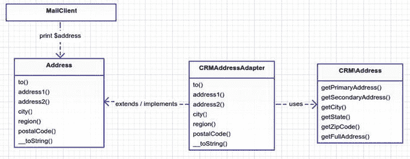

# 9.适配器

```php
$> git checkout adapter

```

## 目的

将一个类的接口转换成客户端期望的另一个接口。适配器允许类一起工作，否则由于不兼容的接口而无法工作。 [<sup>1</sup>](#Fn1)

## 应用程序

有时你想使用现有的代码，但接口并不符合你的需要。例如，您希望利用供应商/外部代码，而无需重写所有现有代码。这类似于在圆孔中安装一个方栓。只要钉子足够小，方形的钉子可以放入任何圆孔中。你应该注意去适应什么是需要的，因为你添加到你的适配器接口的方法越多，你的方钉在你的圆孔里就变得越大。

你可能已经注意到我在最后一段强调了存在。这是因为我想强调适配器模式的主要目的/意图:处理现有代码。想象一下，把欧洲所有的电源插座从 220 伏换成美国的 110 伏标准是多么的不可能。当然，如果你是从零开始给房子布线，你可能会用 110 伏的电压，但我们不是从零开始。欧洲有数百万套公寓、酒店和住宅，多得无法重构。这是适配器的亮点。使用适配器可以让我们将现有的(和经过验证的)系统保持在适当的位置。我们不改变系统；我们只需要担心适配器，这要容易得多，尤其是当两个系统相互兼容的时候。

您已经知道了适配器模式，因为您在现实生活中使用过适配器。你的智能手机插入一个 USB 适配器，该适配器插入一个 110 伏的墙上插座。您的电脑显示器插入 HDMI-to-DVI 适配器或 Thunderbolt for Mac 用户。电源适配器将汽车的点烟器转换成可以给手机充电的东西。

重申一下，在开始新代码时，您可能不会使用适配器模式。它的真正好处来自于修改已经确定的现有代码。好了，说说打聋马(图 [9-1](#Fig1) )。我现在就不说什么时候使用适配器模式了。


图 9-1。

Mr. Ed would be proud to call you his son… HORSE PRIDE!

## 抽象结构

*   `Client`:这些是期望一个`Target`类的类(图 [9-2](#Fig2) )。因为您在这里处理的是一个现有的系统，`Client`实际上可能不仅仅是一个类。

    

    图 9-2。

    Adapter pattern
*   `Target`:这是客户端希望看到的界面。理想情况下，这是一个抽象类或接口。但是，如果它是一个常规类，那么`Adapter`仍然可以扩展这个类并覆盖所有的公共方法。

*   `Adapter`:这个类将扩展或实现`Target`。它的方法与`Target`的方法相匹配，通常是`Adaptee`方法的包装。例如，在图 [9-2](#Fig2) ，`Adapter::someMethod()`调用`Adaptee::differentMethod.`

*   这是你试图用一个`Adapter`包装的类。这个类通常是您希望引入到现有应用程序中的供应商、包或遗留代码。也可能是你写的代码，但是你害怕接触它，因为它很旧，没有单元测试，但是已经被证明是有效的，因为它正在应用程序中使用。无论如何，我们的目标是把这个`Adaptee`代码和

## 示例场景

你有现有的系统，邮寄信件到一个地址。这个系统已经被证明是有用的，现在楼上的头面人物想把它集成到你公司的客户关系管理(CRM)数据库中，这个数据库里有很多很多的客户地址。您的工作是添加从公司 CRM 数据库向客户发送邮件的功能。

## 示例结构

图 [9-3](#Fig3) 为结构示意图。



图 9-3。

Mail system using the adapter pattern

## 履行

你可以跑进去，拿着枪，尝试重构你的`MailClient`或者甚至创建一个新的`MailClient`，但是`MailClient`只是这个难题的一小部分，让我们假设(虽然这个例子没有显示出来)许多事情都依赖于`MailClient`来工作，所以创建一个新的需要一段时间来构建。此外，您不希望接触 CRM 代码，在本例中，它应该被视为非常类似于您从软件包中获得的供应商代码。

让我们看看 CRM 代码，它已经由另一个团队为您提供了。

app/CRM/Address.php

```php
<?php namespace CRM;

class Address

{
        private $primaryAddress, $secondaryAddress, $city, $state, $zipCode;
        public function __construct($primaryAddress, $secondaryAddress, $ci\ ty, $state, $zipCode)
        {
                $this->primaryAddress = $primaryAddress;
                $this->secondaryAddress = $secondaryAddress;
                $this->city = $city;
                $this->state = $state;
                $this->zipCode = $zipCode;
        }
        public function getFullAddress()
        {
                return $this->primaryAddress . PHP_EOL
                        . ($this->secondaryAddress ? $this->secondaryAddress . PHP_'')
                        . $this->city . ', ' . $this->state . ' '
                        . $this->zipCode . PHP_EOL;
        }
        public function getPrimaryAddress()
        {
                return $this->primaryAddress;
        }
        public function getSecondaryAddress()
        {
                return $this->secondaryAddress;
        }
        public function getCity()
        {
                return $this->city;
        }
        public function getState()
        {
                return $this->state;
        }
        public function getZipCode()
        {
                return $this->zipCode;
        }
        public function setPrimaryAddress($primaryAddress)
        {
                $this->primaryAddress = $primaryAddress;
        }
        public function setSecondaryAddress($secondaryAddress)
        {
                $this->secondaryAddress = $secondaryAddress;
        }
        public function setCity($city)
        {
                $this->city = $city;
        }
        public function setState($state)
        {
                $this->state = $state;
        }
        public function setZipCode($zipCode)
        {
                $this->zipCode = $zipCode;
        }
}

```

这是一个非常简单的类。我把它说得很简单，但实际上你可能会有一些奇怪的代码被塞进一个巨大的类中，这个类有一些名为`doStuff`的超级大方法，没有注释。您甚至可能有多个需要适应的类。我们将在后面的`Facade`章节中讨论这个问题，但是现在让我们只关注这里的一个简单的`Address`。接下来，让我们看看你的`Address`类，并将其与`CRMAddress`进行比较。

app/Address.php

```php
namespace App;

interface Address
{
        public function to();
        public function address1();
        public function address2();
        public function city();
        public function region();
        public function postalCode();
        public function __toString();
}

```

所以你可能注意到的第一件事是你甚至没有一个`Address`类；它是一个接口。公共方法(接口)肯定和`CRM\Address`里面的方法不匹配。我可以给你看另一个类，它实际上实现了。然而，这无关紧要，因为您只打算使用这个接口。同样，您的适配器将实现`Address`接口。

app/CRMAddressAdapter.php

```php
namespace App;

class CRMAddressAdapter implements Address
{
        protected $to, $Address;
        public function __construct($name, App\CRM\Address)
        {
                $this->address = $address;
                $this->to = $name;
        }
        public function to()
        {
                return $this->to;
        }
        public function address1()
        {
                return $this->address->getPrimaryAddress();
        }
        public function address2()
        {
                return $this->address->getSecondaryAddress();
        }
        public function city()
        {
                return $this->address->getCity();
        }
        public function region()
        {
                return $this->address->getState();
        }
        public function postalCode()
        {
                return $this->address->getZipCode();
        }
        public function __toString()
        {
                return $this->to . PHP_EOL . $this->address->getFullAddress();
        }
}

```

下面是模拟器代码，它将所有这些拼图拼在了一起。这不是你在上面的 UML 模式中看到的`Client`类；这里的`Client`其实就是`MailClient`。模拟器只是运行所有不同的代码。请注意`MailClient`是如何依赖`Address`的。

app/simulator.php

```php
$crmAddress = with(new App\CRM\AddressLookup)->findByTelephone('555 867-\
5309');
$address = new App\CRMAddressAdapter('Jenny Call', $crmAddress);
$mailClient = new App\MailClient;
$mailClient->sendLetter($address, 'Hello there, this is the body of \
the letter');

```

我在这里不介绍`MailClient`，但基本上它向一个`Address`发送消息。我没有展示`MailClient`类，因为它确实与适配器模式没有任何关系。你可以在这个模拟器中看到，你将你的`CRMAddress`改编成了`Address`，并将其传递给了`MailClient`。如果您在这个例子中从头开始编写`MailClient`，那么跳过适配器模式，只编写依赖于`CRMAddress`的`MailClient`会更有意义。希望您现在理解了如何使用适配器模式。

## 结论

适配器模式也称为包装器模式，因为它将现有的接口包装在客户端期望的接口内。当您没有现有代码时，您可能会发现适配器模式的用途，但最有可能的是，这种模式将用于现有代码的情况。

一个缺点是，两个类可能真的很难适应这么多的方法。这可能会导致适配器部分损坏，如果客户端希望使用目标接口公开的所有方法，那么当客户端调用与适配器完全不兼容的方法时，这可能会导致问题。尽管目标和适配者有不兼容的接口，但这两者很可能是相关的。事实上，如果客户的适配器和目标没有任何共同之处，为什么还要为它们进行调整呢？

使用适配器模式，通过将`Ambulance`类包装在垃圾车适配器类中，可以使救护车看起来像垃圾车(图 [9-4](#Fig4) )。这是有用的还是最好的方法取决于具体情况。救护车是用来在紧急情况下把人送到医院的。垃圾车被用来运送垃圾到荒地。他们有完全不同的目的和目标。然而，适配器不必是完美的；他们只需要在客户期望的目标接口上实现所有公共方法调用。因此，如果在这种情况下，你的`Garbage`卡车等级的唯一方法是`pickupTrash`，那么尽管救护车将成为一辆可怕的垃圾车，但没有什么可以阻止你将垃圾倾倒在这辆医疗车内，并将其运往垃圾填埋场。


图 9-4。

Adapter pattern

将两个不相关的类用于不同的目的可能会很困难，但这并不是不可能的。当简单的重构可以工作，或者当您可以创建与解决您的问题更相关的新类时，请谨慎创建适配器。例如，在您的场景示例中，如果`MailClient`和`Address`只在整个应用程序中的一两个地方使用，那么重写一个新的`MailClient`来使用`CRMAddress`并丢弃`Address`会更容易。长话短说，编写适配器来避免大规模重构。

有些人混淆了适配器模式和策略模式。我还没有谈到策略模式，但是总的来说，这两种模式都使用了复合。事实上，很多模式都使用组合，因为当一个变化，比如一个新的特性请求，稍后出现时，组合更灵活，更容易处理。我在本书的前几章谈到了组合，使用组合比使用继承更好。策略模式是关于使用组合来切换算法，而适配器模式使用组合来变形/修改现有的接口。与适配器模式相混淆的还有桥接模式。我将在下一章介绍桥的模式。这两种模式看起来相似，但意图不同。一些模式在代码方面看起来非常相似，但是意图是不同的。我将在下一章的结尾介绍这些不同之处。

Footnotes [1](#Fn1_source)

设计模式:可重用面向对象软件的元素，第 157 页