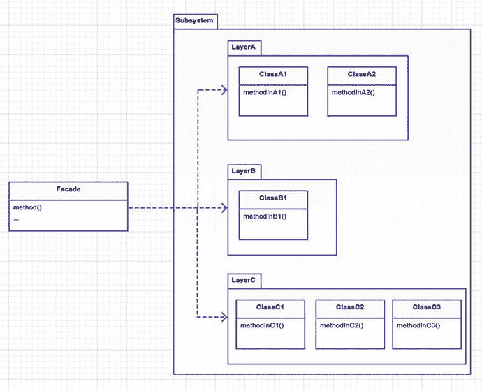
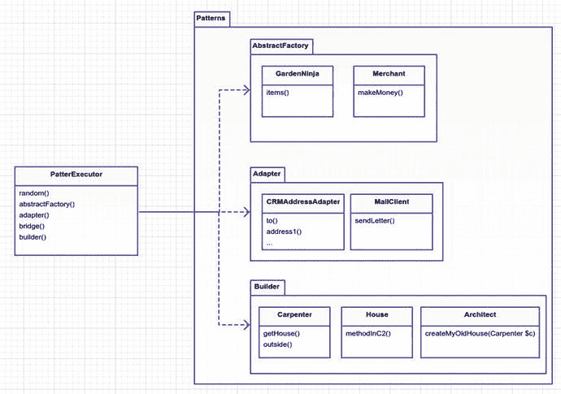
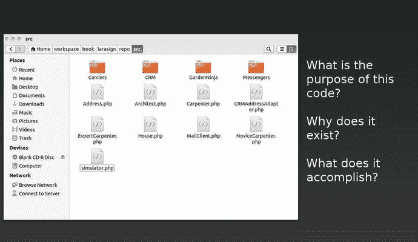

# 十三、外观

```php
$> git checkout facade

```

## 目的

为子系统中的一组接口提供统一的接口。Facade 定义了一个更高级的接口，使得子系统更容易使用。 [<sup>1</sup>](#Fn1)

## 应用

生活是艰难的。有时候事情就是很复杂。也许你写的代码是为了解决一个非常棘手的问题。当然，你通常试图把事情分解成最简单的形式(模型)，但是你的建模并不总是正确的。有时候代码并不需要复杂。当你第一次写东西时，你并不总是第一次就写对。有多少次你看着你的旧代码想要重构它？你学习新的东西。你可以尝试重构；然而，在某些情况下，这可能是非常昂贵的(时间和金钱)。重构的另一种方法是在现有代码的基础上创建另一层，使界面更容易理解和使用。在某种程度上，这种模式可以被认为是第二次机会模式。

然而，facade 模式并不完全是为了掩盖糟糕的代码。它可以用来创建一个简单的公共接口，该接口包含了以某种方式协同工作的各种类。也许您正在处理一个拥有数百个公共方法的大型子系统，但是您只需要其中的十个。您希望 facade 正确地构造子系统中的各种类，并向您提供这十个接口，以便您可以轻松地使用它们。使用这种模式可以让您分层考虑代码。facade 将包装一层较低级别的代码，这样当您想要使用该系统时，就不必处理子系统的复杂细节。

## Laravel 的脸

 fa-cade (fah-saud)

建筑物的正面。一种行为或表现方式，让别人对你的真实感受或处境产生错误的想法。

Laravel 有个东西叫[外观](https://laravel.com/docs/5.3/facades) [<sup>2</sup>](#Fn2) ，不要和外观图案混淆。Laravel 使用 facades 作为在服务容器中包装类或绑定的方式，然后静态地调用它。因此，如果你有一个名为`AwesomeImpl`的类，它有一个名为`someMethod`的非静态方法，你可以为`AwesomeImpl`创建一个名为`Awesome`的门面，然后静态地调用`Awesome::someMethod()`。不过，真的是这样。它只是为类提供一个静态接口。您不希望在`AwesomeImpl`中使用静态方法，因为静态方法很难在 PHPUnit 中测试。

如果你关注拉勒韦尔的戏剧，那么你可能知道每隔几个月就会有人在 reddit [<sup>3</sup>](#Fn3) 上抱怨拉勒韦尔的门面，声称它们不是真正的门面。每个人都喜欢好的戏剧。

*   谁在乎他们是否不同？门面的定义是一种行为方式，给人一种错误的情况。Laravel facades 确实给人一种拥有静态方法的类的感觉。-引人注目的猫科设计

当我们谈到 Laravel facade 辩论的主题时，有人提到 Laravel 也许应该将 facade 的名称改为 proxies。您将很快了解代理模式。“四人帮”最初打算用代理来解决性能、保护和并发性问题。拉勒维尔外观的意图是什么？

早些时候，当我说 Laravel facades 只是用来将方法转化为静态方法时，我有点撒谎了。不好意思。实际上我忽略了一个重要的细节。Laravel facade 的真正意图是让客户不必知道如何构造一个类。静态调用方法只是一个副产品。您静态调用这些方法的真正原因是因为这样做更容易。所以在上面的例子中，客户端从不构造一个`new AwesomeImpl`；客户使用 Laravel 外观，为他们处理施工。对某些人来说，静态调用方法比非静态调用方法更性感。使用 Laravel facade 允许您绕过构造类的细节。说出做到这一点的模式！(我会说简单工厂模式。)

在这本书的开始，我承诺了一些戏剧，所以你有它！除了戏剧性之外，这里的主要收获是您应该意识到 Laravel 中的术语 facade 与 facade 模式有着不同的含义。

## 抽象结构

图 [13-1](#Fig1) 为结构示意图。

*   `Facade`通常是一个单独的类。它深入到一个复杂的子系统中，构造不同的类并调用方法。在这个抽象的例子中，`method()`正在创建`ClassA1, ClassB1`和`ClassC1`，并从每个调用方法。这些类在同一个子系统中，所以它们可能以某种方式一起工作。facade 的创建者知道它们是如何协同工作的，并为您创建了一个名为`method()`的调用方法。谢谢，[代笔！](https://www.youtube.com/watch?v=HZJSccRDKZc) [<sup>4</sup>](#Fn4)

*   包含许多逻辑上属于一起的类。这些类可能在同一个域中。这些类可能有些耦合。它们可能彼此没有任何关系，但属于同一个名称空间，因为开发人员喜欢这样做。理解子系统对于创建外观抽象层以简化其他人的工作至关重要。



图 13-1。

The facade pattern

## 例子

我没有一个类的子系统供你使用。我们需要一些现有的代码，我们不太喜欢的界面。为了发明一个例子，我可以从 WordPress 或者其他一些头脑装瓶商那里获取一些代码。唉，不过！我们在这个蓝色的星球上只有一百多岁。如果我跳过 WordPress 的想法，我真的希望你不会太失望。我们有更重要的事情要做。

因此，在本例中，您将采用所有现有的模式模拟，并将它们合并到一个单独的类中。这样做是为了有一个地方可以运行所有的模式。你将称这个地方为`PatternExecutor`。您正在创建一个新层，允许您触发到目前为止您已经覆盖的任何模式的模拟。作为额外的奖励，有一个`random()`方法，它的职责是随机执行一个模式模拟。结果应该类似于下面的代码:

app/simulator.php

```php
$patternFacade = new App\PatternExectutor;
$patternFacade->random();

```

每次运行使用模式外观的模拟器时，您都会得到一个随机输出，因为一个模式是随机选择运行的。假设您运行它两次，那么您看到的输出可能(随机地)如下所示:

php 应用/模拟器

```php
ABSTRACTFACTORY PATTERN
======================================
Your merchant made $20
======================================

```

php 应用/模拟器

```php
BRIDGE PATTERN
=====================================================================
EMAIL: Hello world!
SNAIL MAIL: Hello world! sending to: PO Box 123, Somewhere, NY, 12345
TEXT: Helo world!
=====================================================================

```

## 示例结构

图 [13-2](#Fig2) 为结构示意图。



图 13-2。

The concrete example

## 履行

目前，每个模式模拟都在它自己的分支中。这意味着您需要检查每个 git 分支，并将代码复制到`/app`目录中。我指出这一点只是为了清楚起见，在现实生活中你不会用你的 facade 模式这样做，因为你的代码不会分散在你的存储库中不同的 git 分支。现在，来自各个分支的所有代码都已经被复制了，假设这些代码是您的子系统。图 [13-3](#Fig3) 是目录截图。正如您所看到的，对于不知道这段代码背后的原因的人来说，文件名并不能提供太多的信息。



图 13-3。

What is the purpose of the code in this directory?

你能通过查看目录中的文件名告诉我这个子系统的用途吗？结构和文件名可能会令人混淆。这里发生了很多事情，仅仅通过查看这些文件名并不清楚所有这些代码应该如何一起工作。因此，您将为新手开发人员创建一个名为`PickerExecutor`的门面，统一代码子系统。

创建代码的人通常知道代码背后的原因。他们知道为什么一个叫做`doSomethin` `g`的方法存在。他们创造了它。当然，总有时间和记忆丧失的因素，所以这些原因变得不那么清楚了。这就是为什么创建一个 facade 可能有助于减轻对整个子系统存在原因的任何混淆。

facade 模式用一个单一的目的统一了所有这些代码。那目的是什么？我碰巧知道所有这些类都是为了说明 GoF 模式，但那是因为我是整本书中创建这些类的工程师。外观是复杂子系统的简化，这里的复杂子系统有传播不同 GoF 模式的目的。因此，您的外观将为新用户提供一个有希望有明确目的和/或更易于使用的界面。你不希望人们仅仅为了利用子系统的目的而必须挖掘子系统的所有类。

app/PatternExecutor.php

```php
 5   public function random($params = [])
 6   {
 7           $methods = ['abstractFactory', 'adapter', 'bridge', 'builder'];
 8           $method = $methods[array_rand($methods)];
 9
10           print PHP_EOL . strtoupper("$method pattern") . PHP_EOL;
11           print "======================================" . PHP_EOL;
12           $this->$method($params);
13           print "======================================" . PHP_EOL;
14   }

```

这个`random`方法选择一个随机的方法名并调用它。因此，选择一些方法来看看，其中任何一个都可以随机选择。

app/PatternExecutor.php

```php
16   public function abstractFactory()
17   {
18           $ratings = array(
19                   'PG-13' => new App\RatedPG13\RiceFarmer,
20                   'R' => new App\RatedR\DrugDealer
21           );
22   
23           $merchant = $ratings[array_rand($ratings)];
24           $client = new App\Client($merchant);
25   
26           $client->run();
27   }

```

对于`abstractFactory`方法，我从抽象工厂模式分支复制了`simulator.php`代码。我没有将模拟器代码组织成类，所以我只是将所有代码复制到方法中。不过，这提出了一个很好的观点。为什么我复制了所有的代码？如果代码已经用`simulator.php`写好了，为什么我不需要那个文件？我可以将每个分支的`simulator.php`重命名为模式名，然后需要 PHP 脚本。我没有这样做，因为我认为在这种情况下，在 facade 的每个方法中复制代码会更干净。我说这些是为了把我们带到下一点。为了利用子系统，外观有时需要实现自己的代码。其他时候，它可能像调用现有方法的序列一样简单。在这种情况下，您必须在最终调用`PatternExecutor`之前设置一些东西。

app/PatternExecutor.php

```php
30   public function adapter()
31   {
32           $crmAddress = with(new App\CRM\AddressLookup)->findByTelephone('555 867-5309');
33           $address = new App\CRM\AddressAdapter('Jenny Call', $crmAddress);
34           $mailClient = new App\MailClient;
35           $mailClient->sendLetter($address, 'Hello there, this is the body of
36           the letter');
37   }

```

这里没有列出其余的方法。我想你现在大概明白这个门面是怎么实现的了。请随意查看 git 存储库，了解 facade 中的其他方法。如果你真的感到勇敢，试着自己实现一些吧！

### 外观和适配器一样吗？

那么，外观和适配器有什么不同呢？它们的结构相似。根本区别在于意图。facade 接口不像适配器接口那样是预先确定的。在适配器中，您不能随意命名您的方法，因为您有一个需要特定接口的客户端。facade 可以命名最有意义的方法，也可以命名对 facade 的客户来说最简单的方法。

此外，适配器并不意味着采用复杂的层和简化。它们是关于把一层转化成客户已经期望的另一层。适配器模式类似于 HDMI 转 DVI 适配器，外观模式更像是将 HDMI 输出连接到主板及其子电路。你不需要知道电路是如何一起工作的；您只需将电缆插入 HDMI 接口，让工程师们去担心底层部件。简而言之，适配器转换层，外观隐藏层。

## 结论

在本章中，你看到了当你想简化某层代码时，你可以使用 facades。这种模式的缺点是 facade 依赖于各种各样的类。如果底层系统发生变化，可能会给你的门面带来麻烦。每当对子系统进行底层更改时，您可能都必须重构外观。这也意味着你需要理解底层的类是如何一起工作的。必须有人来创建和管理门面。拥有 facade 的好处在于，团队中的所有开发人员都可以利用更简单、更易于使用的 API，而不必处理底层子系统的复杂性。

一个 facade 必须是一个单独的类吗？一般来说是的，一个 facade 通常是一个单独的类。你希望你的外观尽可能简单易用。如果你创建了多个类，你需要知道这些类是如何一起工作的。一个 facade 已经与子系统中的许多模块耦合在一起，但是您对使用 facade 的客户端开发人员隐藏了所有这些。这并不意味着你必须创建一个巨大的超级门面类。如果有必要的话，你可以创建多个 facade 类，然后在这些 facade 之上创建另一个层。建在其他外观上的外观。请记住，您希望尽可能保持简单，外观是您必须管理的更多代码。因此，当建立一个门面时，要确保收益大于建立和管理门面所花费的时间。

Footnotes [1](#Fn1_source)

设计模式:可重用面向对象软件的元素，第 208 页

  [2](#Fn2_source)

[`https://laravel.com/docs/5.3/facades`](https://laravel.com/docs/5.3/facades)

  [3](#Fn3_source)

[`www.reddit.com/r/PHP/comments/1zpm0y/laravel_lets_talk_about_facades`](http://www.reddit.com/r/PHP/comments/1zpm0y/laravel_lets_talk_about_facades)

  [4](#Fn4_source)

[`www.youtube.com/watch?v=HZJSccRDKZc`](http://www.youtube.com/watch?v=HZJSccRDKZc)