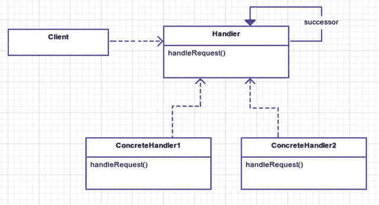
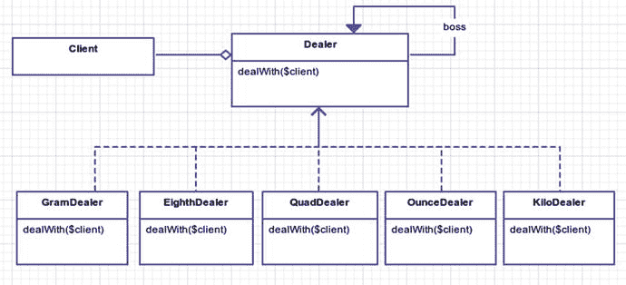

# 十六、责任链

```php
$> git checkout chain_of_responsibility

```

## 目的

通过给多个对象一个处理请求的机会，避免将请求的发送方耦合到接收方。链接接收对象，并沿着链传递请求，直到有对象处理它。 <sup>1</sup>

## 应用

生活中的许多事情都遵循责任链模式:军队、企业，甚至赌场老虎机。举个例子，打电话给你手机公司的客户支持。通常从自动语音系统开始。如果这还不能让你满意，那么你会被转到基本的第 1 级支持，从那里你可以一步步往上爬，直到你发现自己在和第 4 级工程师争论。在一场关于冰棍的激烈争论后，你要求和他的经理通话。

希望在这个指挥链的某一点上，你的要求得到满足。如果在这个过程中的任何一点，你的电话断线了，你必须用自动语音系统从零开始。

## 抽象结构

*   `Client`会在某个`Handler`的具体实例上调用`handleRequest`。在某个时刻，客户端的请求被满足，客户端接收到某个请求。见图 16-1 。

    

    图 16-1。

    Chain of responsibility pattern
*   `Handler`是一个抽象类或接口。所有具体的处理程序都是从处理程序扩展而来的。所有的处理程序可能有也可能没有后继者。如果具体的处理程序不能处理这个请求，那么这个请求就被传递给它的继任者。

*   `ConcreteHandler1/ConcreteHandler2`实际实现`handleRequest`方法。但是请记住，处理程序不一定处理请求。请求可以交给实现`Handler`接口的后继者。

## 例子

跳街 37 号的生活很艰难。大坏鸟垄断了方圆 20 个街区的毒品市场，得分就像拜访坏脾气的奥斯卡一样简单。我相信你熟悉杂草的不同测量方法；然而，为了清楚起见，让我们在这里列出它们。

*   克:基本单位

*   第八:3.5 克

*   四重:7 克

*   盎司:28 克

*   千克:1000 克

一个客户会要求一定数量的大麻。所有的请求都以不高兴的奥斯卡开始。如果客户的要求太高，爱发牢骚的奥斯卡会让他的老板帮你牵线搭桥。如果他的老板不能满足你的毒瘾，他会把你送上毒品交易链。这样一直持续到一个人都不剩。大坏鸟是头儿，所以如果你去见他，那么你要么是在开世界上最大的派对，要么你就有大麻烦了。为了到达大鸟，你必须通过一个关卡。这家伙是个直截了当的数字和商人，他也不怕开枪。所以要小心。

坏脾气的奥斯卡会和各种各样的客户打交道。一个客户甚至向他要一块饼干(猜猜是谁？).因为奥斯卡只是一个普通的街头流浪儿，他从来不给任何客户超过 3 克的毒品。为了得到 3 克以上，你必须对付奥斯卡的老板。他的老板嗤之以鼻，是个`EighthDealer`只会在你的要求小于 7 克的情况下为你服务；否则，你会见到斯尼菲的老板，他是一个`QuadDealer`。你的要求会不断上升，直到得到满足。

以下是您将为每个类定义的规则:

*   `GramDealers`:份量不超过 3 克

*   `EighthDealers`:份量不超过 7 克

*   `QuadDealers`:份量不超过 28 克

*   `OunceDealers`:不超过 1000 克，有麻醉保护

*   `KiloDealers`:缉毒保护

## 示例结构

图 16-2 为结构示意图。



图 16-2。

Lots of dealing going on this street

## 履行

`Dealer`类中有一些基本的助手方法。它是你的基础抽象类，所有的具体处理程序都将继承它。帮手的方法包括为客户服务，让老板处理，把计量换算成克，甚至拍客户。

app/Dealer.php

```php
namespace App;

abstract class Dealer;

{
        protected $boss;

        protected $name;

        abstract public function dealWith(Client $client);

        public function __construct($name)

        {
                $this->name = $name;
        }

        public function boss(Dealer $dealer)
        {
                $this->boss = $dealer;
        }

        protected function shoot(Client $client)
        {
                print "{$client->name} got shot" . PHP_EOL;
        }

        protected function serve(Client $client)
        {
                print "{$client->name} got {$client->request} from {$this->name}" . PHP_EOL;
        }
        protected function letTheBossDealWith(Client $client)
        {
                if ($this->boss) return $this->boss->dealWith($client);
        }
        protected function convertRequestToGrams(Client $client)
        {
                // returns requested amount in your basic grams unit

        }
}

```

当从`Dealer`类继承时，有一个抽象方法你必须实现，那就是`dealWith`。首先，你要弄清楚客户想要多少。接下来，你来处理。对于一个克经销商来说，当要求的数量在 1 到 3 克之间时，你就为客户服务了。你给客户的服务不能少于 1 克。任何超过 3 克的东西都需要你的老板来处理。

app/GramDealer.php

```php
namespace App;

class GramDealer extends Dealer
{
        public function dealWith(Client $client)
        {
                $amount = $this->convertRequestToGrams($client);

                if ($amount < 1) return;

                if ($amount > 3) return $this->letTheBossDealWith($client);

                return $this->serve($client);
        }
}

```

`GramDealer, EighthDealer, QuadDealer, OunceDealer`和`KiloDealer`都共享同一个接口`dealWith`，非常相似。当他们无法让客户满意时，他们也会依赖老板。在您的模拟中，红眼 Mos 将从 Oscar 获得 2 克，EarnEz 从 Kabby 获得 1 盎司，以此类推。

app/simulator.php

```php
// create the dealers

$grouchyOscar = new \App\GramDealer('Grouchy Oscar');
$dealer2 = new \App\EighthDealer('Sniffy');
$dealer3 = new \App\QuadDealer('Kabby');
$dealer4 = new \App\OunceDealer('AC Countant');
$dealer5 = new \App\KiloDealer('The Big Bad Bird');

// setup the chain of responsibility

$grouchyOscar->boss($dealer2);
$dealer2->boss($dealer3);
$dealer3->boss($dealer4);
$dealer4->boss($dealer5);

// all deals start with Grouchy

$grouchyOscar->dealWith(new \App\Client('Red Eye Mos', '2 grams'));
$grouchyOscar->dealWith(new \App\Client('EarnEz', 'ounce'));
$grouchyOscar->dealWith(new \App\Client('Tellme Fatz', 'quad'));
$grouchyOscar->dealWith(new \App\Client('Cookie Hipster', 'cookie'));
$grouchyOscar->dealWith(new \App\Client('Zo 2 Easy', '99 grams'));
$grouchyOscar->dealWith(new \App\Client('Bertie', '4 eighths', $narc = tr\
ue));

$grouchyOscar->dealWith(new \App\Client('Seth Rogen', '2 kilos'));

// Sniffy and Kabby are taken out of play

// because Bertie busted them

$grouchyOscar->boss($dealer4);

// Bertie the Narc gets greedy

// and gets shot

$grouchyOscar->dealWith(new Client('Bertie', 'kilo', $narc = true));

```

看到这有多灵活了吗？格鲁希甚至在执行过程中把他的老板换成了会计师。在这个特定的模拟中，您以线性方式组织了每个经销商，但是责任链允许您非常灵活地更换继任者，而无需更改子类。这个链条让斯尼菲的老板卡比与格鲁希脱钩。这很重要，因为在第 37 跳街，毒贩经常被逮捕或枪杀。能够在运行时动态替换经销商可以让您的程序继续运行。假设您已经将每个类耦合在一起。你会有一些非常不灵活的东西。见图 16-3 。


图 16-3。

Way too much inheritance, homie!

这种类型的链式继承将您锁定在一个固定的流程中。你不需要这种锁定，尤其是当你想让一个`GramDealer`跳过一个`EighthDealer`而一个`QuadDealer`直接到达一个`OunceDealer`的时候。

## 结论

我喜欢把责任链模式理解为“当你的客户令人讨厌时，给你的老板打电话”模式。你的老板比你赚得多是有原因的，所以让他去处理更大的问题。

使用这种模式时，应该警惕循环引用。除非您的应用处理它们，否则您可能会走向无限循环。基本上，在下面的代码中，你是在说奥斯卡的老板是 Sniffy，Sniffy 的老板是奥斯卡，这没有意义。下属不能当老板。这就是你陷入无限循环的原因:循环引用。这是这种模式的一个缺点。

危险的循环引用

```php
$grouchyOscar->boss($dealer2);
$dealer2->boss($grouchyOscar); // WAT?

$grouchyOscar->dealWith(new Client('Infinite Loop Man!', '2 grams');
 // Oscar handles this

$grouchyOscar->dealWith(new Client('Infinite Loop Man!', 'kilo');
// loopty loop forever!

```

这种模式的好处是它允许您解耦请求链。在这方面，它非常灵活。对于那些有计算机科学头脑的人来说，你可能会看到责任链模式和面向对象的有限状态机的相似之处，其中每个状态都是终结的。然而，从技术上讲，一个有限状态机可以有多个后继。责任链模式只有一个继任者。有多个怎么知道选哪个接班人？只有一个继任者意味着你不用担心挑选一个。这个限制使得链式模式比有限状态机更容易使用。如果你发现自己需要一个有限状态机，那么就去看看关于状态模式的那一章。

您已经看到了将请求解耦到单独的类如何帮助您灵活地连接和完成请求。这是一个可以使用的强大模式。不过要记住，伴随着巨大力量而来的是[邪恶的外星人](http://en.wikipedia.org/wiki/Venom_%28comics%29) <sup>2</sup> 和[大地精](http://en.wikipedia.org/wiki/Hobgoblin_%28comics%29) <sup>3</sup> 。

Footnotes 1

设计模式:可重用面向对象软件的元素，第 251 页

  2

[`http://en.wikipedia.org/wiki/Venom_%28comics%29`](http://en.wikipedia.org/wiki/Venom_%28comics%29)

  3

[`http://en.wikipedia.org/wiki/Hobgoblin_%28comics%29`](http://en.wikipedia.org/wiki/Hobgoblin_%28comics%29)