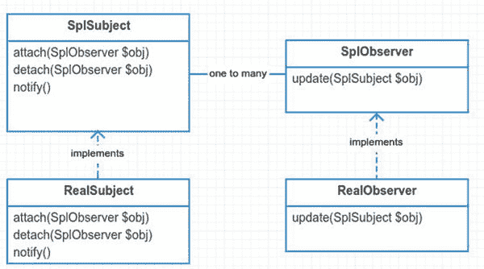
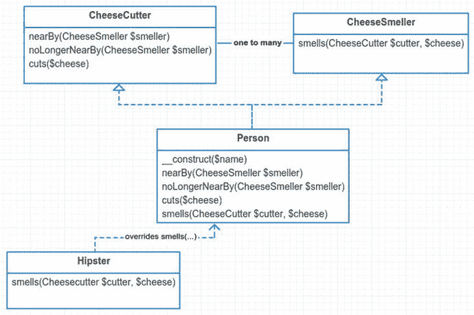

# 二十二、观察者

```php
$> git checkout observer

```

## 目的

定义对象之间的一对多依赖关系，这样当一个对象改变状态时，它的所有依赖对象都会得到通知并自动更新。 [<sup>1</sup>](#Fn1)

## 应用

当您希望对象对 subject 对象上的特定事件做出反应时，可以使用 observer 模式。当主题改变时，它通知观察者。这是我将要介绍的最流行的模式之一。事实上，PHP 已经内置了观察者模式的接口: [`SplSubject`](http://php.net/manual/en/class.splsubject.php) [<sup>2</sup>](#Fn2) 和[`SplObserver`](http://php.net/manual/en/class.splobserver.php)[<sup>3</sup>](#Fn3)。

## 抽象结构

*   `SplSubject`是一个抽象类或接口。当使用一个抽象类时，你可以在这里放置一个数组来跟踪附加的观察器。`SplSubject`包含三种方法。`attach`方法给这个主题增加了观察者。`detach`方法带走观察者。`notify`方法通常包含一个循环，该循环遍历所有附加的观察器并调用它们的`update`方法。

*   `SplObserver`是一个抽象类或接口。`SplObserver`接口包含一个名为`update`的方法，每当主题更新时由`SplSubject`触发。

*   `RealSubject`是`SplSubject`的一个实现。它将包含存储对象(数组/集合/等等。)需要挂在附加的观察器上。一些实现实际上创建了一个抽象类来代替`SplSubject`，并将存储对象放在抽象类中。既然`SplSubject`是接口，就不能这么做。但是，没有什么可以阻止你创建自己的抽象类，而不是使用接口。

*   `RealObserver`是`SplObserver`接口的一个实现。它的`update`方法将被传递给`SplSubject`的一个实例。这个类处理每当主题更新时需要执行的特定逻辑。



图 22-1。

Abstract structure

## 例子

在本例中，您将使用 PHP 内置的`SplObserver`和`SplSubject`展示一个相当通用的观察者模式。解决这个问题后，你将进入一个更复杂的场景，泰勒切奶酪，而附近的`observing`闻到了奶酪的味道。最后，你将在雄辩的模型上使用观察者来结束这一章。您还将探索 Laravel 雄辩模型的一些内部内容，以及它如何使用事件来处理附加的观察者。

## 示例结构

图 [22-2](#Fig2) 为结构示意图。



图 22-2。

Example structure

## 履行

### SPL 的一般观察员

您只需要创建两个类，因为您使用的是通用的 SPL 接口。

app/RealObserver.php

```php
namespace App;

class RealObserver implements \SplObserver
{
        public function __construct($name)
        {
                $this->name = $name;
        }

        public function update(\SplSubject $subject)
        {
                print "{$this->name} was notified by {$subject->name}" . PHP_EOL;
        }
}

```

如果你想知道 SPL 代表什么，它是标准 Php 库的缩写。SPL 有许多漂亮的东西。你可以在 [`http://php.net/manual/en/book.spl.php`](http://php.net/manual/en/book.spl.php) 看到它们。

app/RealSubject.php

```php
namespace App;

class RealSubject implements \SplSubject
{
    private $observers;

    public function __construct($name)
    {
        $this->name = $name;
        $this->observers = new \SplObjectStorage;
    }

    public function attach(\SplObserver $observer)
    {
        $this->observers->attach($observer);
    }

    public function detach(\SplObserver $observer)
{
        $this->observers->detach($observer);
}

    public function notify()
    {
        foreach ($this->observers as $observer) {
            $observer->update($this);
        }
    }
}

```

记下`SplObjectStorage`对象。注意，当你想分离一个观察者时，你只需要在`SplObjectStorage`对象上调用`detach`。如果你在这里使用数组会怎么样？您必须遍历 observers 数组并找到要删除的观察者。那你就必须取消设置。`SplObjectStorage`是一个整洁的助手类。我知道我已经说过了，但我还要再说一遍。我推荐你多看看[标准 PHP 库](http://php.net/manual/en/book.spl.php) [<sup>4</sup>](#Fn4) 。

这两个类，`RealSubject`和`RealObserver`，是最通用的。很难观察这两个类别并从中得出任何商业意义。这是使用`SplSubject`和`SplObserver`的缺点之一。您被泛型方法卡住了。除了对`update`方法输入`SplSubject`之外，你也不能输入任何提示。几乎不值得使用它们。我认为`SplSubject`和`SplObserver`有助于引导。然而，让我们运行您的模拟，看看一些测试输出。

app/simulator.php

```php
$subject1 = new \App\RealSubject('subject1');
$observer1 = new \App\RealObserver('observer1');
$observer2 = new \App\RealObserver('observer2');
$observer3 = new \App\RealObserver('observer3');

$subject1->attach($observer1);
$subject1->attach($observer2);
$subject1->attach($observer3);

$subject1->notify();

```

控制台输出

```php
> php app/simulator.php
observer1 was notified by subject1
observer2 was notified by subject1
observer3 was notified by subject1

```

这就是了。最后一点，我想在这里指出，你可能并不总是希望你的`notify`方法是公共的。您可能只想在内部流程发生时通知观察者。不幸的是，由于使用通用 SPL 接口的限制，您不能在这里更改它。让我们在下一部分获得更多的自定义。

### 泰勒切奶酪

你们都知道人是复杂的。他们可以观察和被观察。换句话说:人既是主体又是观察者。在下一个例子中，你将讲述一个故事。故事是这样的。

这是平静的一天。泰勒在#laravel irc 上和他的 Laravel 粉丝一起玩。突然，泰勒切开了奶酪。没有人真正注意到。除了杰弗瑞，马楚加，戴尔。哦，亚当，马特和格雷厄姆·坎贝尔。这些家伙碰巧注意到了并且就在附近。泰勒不喜欢分享他的蒙特雷杰克奶酪。他决定离开频道，独自享用他的奶酪。翻译成代码，是这样的:

app/cheese.php

```php
$taylor = new \App\Person("Taylor");
$dayle = new \App\Person("Dayle");
$jeffery = new \App\Person("Jeffery");
$machuga = new \App\Hipster("Machuga");
$campbell = new \App\Person('Graham');

$taylor->nearBy($dayle, $jeffery, $machuga, $campbell);
$taylor->cuts('cheedar');
$taylor->says('oops...');

$taylor->noLongerNearBy($dayle, $jeffery, $machuga);
$taylor->cuts('monterey jack');
$taylor->says('This monterey jack cheese is all mine! muhahaha!');

```

对于这段代码，您预期的输出如下:

控制台输出

```php
> php app/cheese.php
--- Taylor cuts cheedar ---
Dayle says:         "i smell cheedar"
Jeffery says:         "i smell cheedar"
Machuga says:         "i smell cheedarz, that you Taylor?"
Graham says:         "i smell cheedar"
Taylor says:         "oops..."
--- Taylor cuts monterey jack ---
Taylor says:         "This monterey jack cheese is all mine! muhahaha!"

```

不过，上面的代码还不能工作。您仍然需要创建底层类。让我们从你的基本界面开始:奶酪 smeller 和奶酪切割机。

app/CheeseSmeller.php

```php
namespace App;

interface CheeseSmeller
{
        public function smells(CheeseCutter $cutter, $cheese);
}

```

app/CheeseCutter.php

```php
namespace App;

interface CheeseCutter
{
        public function nearBy(CheeseSmeller $smeller);
        public function noLongerNearBy(CheeseSmeller $smeller);
        public function cuts($cheese);
}

```

一个人在你的故事里有名字。您需要在构造函数中提供名称。一个人也可以说话，所以你也需要一个方法。

app/Person.php

```php
class Person implements CheeseSmeller, CheeseCutter
{
        public function __construct($name)
        {
                $this->name = $name;
                $this->nearBy = new \SplObjectStorage;
        }

        public function says($phrase)
        {
                print "{$this->name} says: \t\"" . $phrase . "\"" . PHP_EOL;
        }

```

你需要实现`nearBy`。这种方法可以跟踪附近的嗅探器。

app/Person.php

```php
16   public function nearBy(CheeseSmeller $smeller)
17   {
18           $smellers = func_get_args();
19   
20           foreach ($smellers as $smeller) {
21           
22                   $this->nearBy->attach($smeller);
23           }
24   }

```

接下来，您实现`noLongerNearBy`。这将移除可能在此人附近的任何气味。

app/Person.php

```php
26   public function noLongerNearBy(CheeseSmeller $smeller)
27   {
28           $smellers = func_get_args();
29   
30           foreach ($smellers as $smeller) {
31           
32                   $this->nearBy->detach($smeller);
33           }
34   }

```

当一个人切奶酪时，附近的任何人都会闻到。

app/Person.php

```php
36   public function cuts($cheese)
37   {
38           print "--- {$this->name} cuts {$cheese} ---" . PHP_EOL;
39   
40           foreach ($this->nearBy as $nearBy) {
41           
42                   $nearBy->smells($this, $cheese);
43           }
44   }

```

最后，作为您的`CheeseSmeller`接口的一部分，您需要实现`smells`。每当一个人在另一个切奶酪的人附近时，就调用这个方法。

app/Person.php

```php
46   public function smells(CheeseCutter $cutter, $cheese)
47   {
48           $this->says("i smell {$cheese}");
49   }

```

这就是了。与您之前提到的通用 SPL 示例不同，这段代码散发着业务逻辑的味道。您可以查看这些方法名并发现发生了什么。SPL 的例子和切奶酪的例子都使用了观察者模式。接下来，您将检查嵌入在所有雄辩模型中的观察者模式。

### 雄辩的观察者:开箱即用的观察者

所有雄辩的模型都有观察者的模式。对于下一个例子，您将创建一个`Car`模型。一辆车有几个属性:`manufacturer`、`vin`、`description`、`year`。随意查看[播种机](https://github.com/kdocki/larasign/blob/observer/database/seeds/DatabaseSeeder.php) [<sup>5</sup>](#Fn5) 和[迁移](https://github.com/kdocki/larasign/blob/observer/database/migrations/2015_03_10_222303_create_cars_table.php) [<sup>6</sup>](#Fn6) 。您可能不需要运行种子和迁移，因为我也将 database.sqlite 数据库提交给了 GitHub 存储库。

app/Car.php

```php
namespace App;

use Illuminate\Database\Eloquent\Model;

class Car extends Model
{

}

```

现在你有了一个雄辩的模型。你如何在这个模型上设置观察者？你用`observe`的方法。

app/test1.php

```php
\App\Car::observe(new Observers\ObserveEverything);

```

下面我做了一个名为`ObserverEverything`的通用观察器，它包含了你可以在雄辩模型上观察到的所有开箱即用的方法。每个方法只是打印一条语句，这样您就可以知道它何时被调用。让我们来看看这个方法列表。

app/Observers/observe everything . PHP

```php
namespace App\Observers;

class ObserveEverything

{
        public function creating($model)
        {
                print "creating model" . PHP_EOL;
        }

        public function created($model)
        {
                print "created model" . PHP_EOL;
        }

        public function updating($model)
        {
                print "updating model" . PHP_EOL;
        }

        public function updated($model)
        {
                print "updated model" . PHP_EOL;
        }

        public function saving($model)
        {
                print "saving model" . PHP_EOL;

        }
        public function saved($model)
        {
                print "saved model" . PHP_EOL;
        }

        public function deleting($model)
        {
                print "deleting model" . PHP_EOL;
        }

        public function deleted($model)
        {
                print "deleted model" . PHP_EOL;
        }

        public function restoring($model)
        {
                print "restoring model" . PHP_EOL;
        }

        public function restored($model)
        {
                print "restored model" . PHP_EOL;
        }
}

```

您可以根据每个方法名进行猜测，并确定何时会调用它。然而，我在这里列出了每一个更深入的见解。

*   在数据库中首次创建模型之前调用`creating`。您可以通过在新构建的模型上调用`save`或者静态地使用`create`来触发它。请注意，当构造新模型或从数据库中检索新模型时，不会触发此方法。如果方法返回`false`，模型将不会被创建。

*   在数据库中创建模型后，调用`created`。

*   在数据库中保存现有模型之前，调用`updating`。如果该方法返回`false`，则不更新模型。

*   在数据库中保存现有模型后，调用`updated`。

*   在数据库中创建或更新模型之前调用`saving`。如果该方法返回`false`，则不保存模型。

*   在数据库中创建或更新模型后，调用`saved`。

*   从数据库中删除模型之前调用`deleting`。如果方法返回`false`，模型不会被删除。

*   从数据库中删除模型后，调用`deleted`。

*   在数据库中恢复模型之前调用`restoring`。恢复仅适用于使用 Laravel 软删除的型号。这将从数据库中该记录的`deleted_at`列中删除日期。如果方法返回`false`，模型不会被恢复。

*   在数据库中恢复模型后，调用`restored`。

下一步是将这个观察者附加到您的`Car`模型上。

app/test1.php

```php
7   Car::observe(new Observers\ObserveEverything);

```

您将通过修改`Car`模型来触发事件。下面进一步展示了调用了`ObserveEverything`观察器中的哪些方法。

app/test1.php

```php
10   $car1 = Car::find(1);
11   $car1->vin = str_random()(32);
12   print "\nSaving car #1 to database\n";
13   $car1->save();

Saving car #1 to database

saving model
updating model
updated model
saved model

```

app/test1.php

```php
17   $car2 = new Car;
18   $car2->description = "cool car description";
19   $car2->vin = str_random(32);
20   $car2->manufacturer = 'Honda';
21   $car2->year = '2012';
22   print "\nCreating new car\n";
23   $car2->save();

Creating new car
saving model
creating model
created model
saved model

```

app/test1.php

```php
26   print "\nDeleting that new car you just made\n";
27   $car2->delete();

Deleting that new car you just made
deleting model
deleted model

```

app/test1.php

```php
30   print "\nRestoring that car you just deleted\n";
31   $car2->restore();

Restoring that car you just deleted
restoring model
saving model
updating model
updated model
saved model
restored model

```

#### 阻止观察员更新

您可能已经注意到这些现成的观察器事件的重复出现模式。每一个都为观察者提供了在雄辩模型上捕捉事件前后的能力。提供的一个特性是，如果您对任何 before 类型的事件返回`false`,那么进一步的执行将停止。这意味着你可以阻止一个雄辩的模型使用观察者`saving, creating, updating, deleting`，或者`restoring`。让我们看一个例子。

假设一辆汽车的所有 VIN 号码都必须包含字母 h。使用观察器，当 VIN 不包含字母 h 时，您将阻止对数据库的更新。

app/test1.php

```php
 7   Car::observe(new Observers\VinObserver);
 8   $car1 = Car::find(1);
 9   
10   // attempt #1 with no h

11   $car1->vin = "asdfasdfasdf";
12   $car1->save() && print "attempt #1 saved\n";
13   
14   // attempt #2 contains h

15   $car1->vin = "hasdfasdfasdf";
16   $car1->save() && print "attempt #2 saved\n";

model vin does not contain letter 'h', canceling update...
attempt #2  saved

```

第一次尝试更新失败。只有第二次尝试保存到数据库。这里是执行 h 规则的`VinObserver`。

app/Observers/VinObserver.php

```php
namespace App\Observers;

class VinObserver

{
        public function updating($model)
        {
                $original = $model->getOriginal('vin');

                if ($model->vin === $original) {
                        return true;   // ignore unchanged vin

                }

                if (! str_contains($model->vin, 'h')) {

                        print "model vin does not contain letter 'h', canceling updating vi \n";

                        return false;
                }
        }

}

```

您会忽略任何没有更改 VIN 号的车型。没有字母 h 的 VINs 返回 false。这将阻止更新的发生。那么 Laravel 是如何在引擎盖下为你处理这件事的呢？让我们来看一下更新。

vendor/laravel/framework/src/Illuminate/Database/口才/模型. php

```php
1520   protected function performUpdate(Builder $query, array $options = [])
1521   {
1522           if ($this->fireModelEvent('updating') === false) {
1523               return false;
1524           }
1525           
1526           if ($this->timestamps && Arr::get($options, 'touch', true)) {
1527               $this->updateTimestamps();

1528           }
1529         
1530           $dirty = $this->getDirty();
1531         
1532           if (count($dirty) > 0) {
1533               $this->setKeysForSaveQuery($query)->update($dirty);
1534               $this->fireModelEvent('updated', false);
1535           }
1536         
1537           return true;

```

当您执行更新时，发生的一件事是检查脏字段。如果这个模型没有任何变化，那么你甚至不需要更新。接下来，你可以看到`fireModelEvent`。如果它返回 false，那么您不执行更新。让我们继续检查一下`fireModelEvent`方法。

vendor/laravel/framework/src/Illuminate/Database/口才/模型. php

```php
1651   protected function fireModelEvent($event, $halt = true)
1652   {
1653           if (! isset(static::$dispatcher)) {
1654              return true;
1655           }
1656   
1657           // You will append the names of the class to the event to distinguish it from

1658           // other model events that are fired, allowing you to listen on each\model

1659           // event set individually instead of catching event for all the models.

1660           $event = "eloquent.{$event}: ".static::class;
1661   
1662           $method = $halt ? 'until' : 'fire';
1663   
1664           return static::$dispatcher->$method($event, $this);
1665   }

```

此方法在调度程序上调用 until 或 fire 并返回结果。为什么在这个模型上看不到任何对观察者的引用？您附加到模型的所有观察器都放在 dispatcher 中。这就是为什么你在这个`fireModelEvent`方法中看不到任何关于观察者的东西。

那么这个静态调度程序是什么呢？雄辩模型使用共享调度程序，特别是`$app['events']`单例。事件调度程序是一个消息总线。是`Illuminate\Events\Dispatcher`的一个实例。当应用启动数据库服务提供者时，事件调度程序被注入到雄辩模型中。

vendor/laravel/framework/src/Illuminate/Database/databaseserviceprovider . PHP

```php
20   public function boot()
21   {
22           Model::setConnectionResolver($this->app['db']);
23   
24           Model::setEventDispatcher($this->app['events']);
25   }

```

您已经了解了模型事件是如何触发的。您已经看到了如何阻止对模型的更新。但是，你还是少了一块。您已经假设所有注册的观察者都被放置在事件调度器中，因为`fireModelEvent`正在使用调度器。不过，你不知道怎么做。因此，让我们追溯一下观察者是如何依附于一个雄辩的模型和潜在的调度员来揭开这个模糊的神秘面纱的。

vendor/laravel/framework/src/Illuminate/Database/口才/模型. php

```php
407   public static function observe($class)
408   {
409           $instance = new static;
410   
411           $className = is_string($class) ? $class : get_class($class);
412   
413           // When registering a model observer, you ...

414           // ... do moose stuff ... (not really)

415           // ... making it convenient to watch these.

416          foreach ($instance->getObservableEvents() as $event) {
417             if (method_exists($class, $event)) {
418                 static::registerModelEvent($event, $className.'@'.$event, $priority);
419             }
420          }
421   }

```

当您在模型上调用`observe`方法时，它会遍历可能的事件，然后用事件和类名调用`registerModelEvent`。`getObservableEvents`方法返回一个字符串数组。弦是您之前看到的事件(`updating`、`updated`、`creating`、`created`等等)。它还包括您使用`$observables`数组放在这个类上的任何额外的可观察事件。在下一个例子中，您将在您的汽车模型上附加更多可观察到的事件。使用替换，您可以在当前示例中推断出该方法具有以下参数:

```php
static::registerModelEvent('updating', 'Observers\VinObserver@updating');

```

那么`registerModelEvent`具体做什么呢？让我们来看看。

vendor/laravel/framework/src/Illuminate/Database/口才/模型. php

```php
1270   protected static function registerModelEvent($event, $callback)
1271   {
1272           if (isset(static::$dispatcher)) {
1273               $name = static::class;
1274               static::$dispatcher->listen("eloquent.{$event}: {$name}", $callback, $priority);
1275           }
1276   }

```

共享调度程序被告知监听一个`eloquent.updating: App\Cars`事件。每当在调度程序上触发该事件时，就会触发回调。这就是观察者如何依附于一个雄辩的模型。请注意，每个模型都没有自己的观察器数组。观察器都在一个调度程序中共享。这比在汽车模型的每个实例上附加一个观察器数组使用的内存要少。也意味着所有的车模都有相同的观察者，这是意料之中的。如果您想专门为汽车的一个实例而不是另一个实例创建一个观察者，那么您需要做一些不同的事情。我把这个留给你去思考。接下来，现在您已经了解了观察者是如何在雄辩模型中被附加和触发的，让我们制作您自己的客户观察者事件。

#### 添加自定义观察者

对于`finding`和`found`，没有现成的可观察事件。您将创建这些。每当您试图使用`Car::find($id)`通过 id 查找特定型号时，这些事件都会被调用。就像之前的对应物一样，如果`finding`返回 false，那么您将停止执行，防止模型被发现。

app/test3.php

```php
 7   \App\Car::observe(new \App\Observers\LookupObserver);
 8   
 9   $car0 = Car::find(0);
10   $car1 = Car::find(1);
finding id 1!
found model 1

```

没有 id 为零的车。您的查找观察器将防止获取任何无效的 id。你也可以在这里介绍其他东西。也许每次你查找一辆车，它就会更新一些分析数据库表。

app/Observers/lookup observer . PHP

```php
namespace App\Observers;

class LookupObserver

{
        public function finding($id)
        {
                if ($id < 1) return false;

                print "finding id {$id}!\n";
        }
        public function found($model)
        {
                print "found model {$model->id}\n";
        }
}

```

雄辩模型上没有`finding`或`found`事件。因此，为了让上面的代码工作，您还需要做更多的工作。剩下的工作在`Car`模型本身中完成。

app/Car.php

```php
class Car extends Model
{
        use SoftDeletes;

        protected $dates = ['deleted_at'];

        protected $observables = ['finding', 'found'];

```

您正在使用软删除，所以这就是前两行所做的。`$observables`数组允许您监听其他事件。它在雄辩的`getObservableEvents`方法中使用。该方法将自定义观察器事件与事实上的标准事件合并。

vendor/laravel/framework/src/Illuminate/Database/口才/模型. php

```php
1284   public function getObservableEvents()
1285   {
1286           return array_merge(
1287                   [
1288                           'creating', 'created', 'updating', 'updated',
1289                           'deleting', 'deleted', 'saving', 'saved',
1290                           'restoring', 'restored',
1291                   ],
1292                   $this->observables // <-- merge in custom events

1293           );
1294   }

```

回到您的汽车模型，您将覆盖`find`方法。这个方法将为您触发模型事件。

app/Car.php

```php
13   public static function find($id, $columns =  ['*'])
14   {
15           $shouldProceed = static::triggerModelEvent('finding', true, $id);
16   
17           if ($shouldProceed === false) return null;
18   
19           $results = parent::find($id, $columns);
20   
21           static::triggerModelEvent('found', $stop = false, $results);
22   
23           return $results;
24   }

```

这个方法内部是对父方法`find`的调用。结果被返回。不过，你已经用父`find`方法包装了`triggerModelEvent`。这允许您正确地执行事件。

请注意，您不能使用`fireModelEvent`，因为`find`方法是静态的。你甚至还没有你的模型的实例(因为你还没有找到它！).因此，您需要引入自己静态触发模型事件的方式。注意，如果您已经有了模型的实例，您将使用`fireModelEvent`而不是`triggerModelEvent`。

app/Car.php

```php
26   protected static function triggerModelEvent($event, $halt, $params =
27   null)
28   {
29           if (! isset(static::$dispatcher)) return true;
30   
31           $event = "eloquent.{$event}: ".get_called_class();
32   
33           $method = $halt ? 'until' : 'fire';
34   
35           return static::$dispatcher->$method($event, $params);
36   }

```

您镜像了`fireModelEvent`方法的功能。它调用调度程序的方式与`fireModelEvent`非常相似。然而，这更灵活一点。它允许您提供自定义参数，而不是假设您已经有一个雄辩模型的实例来处理。

## 结论

事件驱动架构(Event-driven architecture)[<sup>7</sup>](#Fn7)是一种软件架构模式，围绕着应用内的状态。观察者模式可以用在这种类型的软件架构中。还有其他类似的模式。我将在这里列出它们，因为它们都略有不同。

*   观察者模式将观察者对象附加到主题上。当主体状态改变时，它通知观察者。观察者模式似乎比中介者模式更受欢迎。事实上，观察者模式赢得了最流行设计模式奖。

*   中介模式使用一个对象来中介许多其他对象。与 observer 模式不同，中介对其聚集的从属对象了解得更多，因为它对每个从属对象调用特定的方法。

*   命令总线模式与命令模式相关。这也可以是事件驱动的。当一个对象的状态改变时，它可以向命令总线发送命令。命令总线将立即处理命令，或者将作业排队以备后用。

*   sub/pub 模式(subscribe/publish)使用消息总线来传递状态变化。Laravel 有一个内置的消息总线，叫做[事件](http://laravel.com/docs/4.2/events) [<sup>8</sup>](#Fn8) 。你可以这样使用`Event`:

```php
Event::listen('Illuminate\Auth\Events\Login', function($user) {
    $user->last_login = new DateTime;

    $user->save();
});

$response = Event::fire('Illuminate\Auth\Events\Login', [$user]);

```

观察者是本书中最流行的设计模式之一。和其他模式一样，它也有缺点。

### 缺点

第一个缺点是观察者与主体分离。这个主题有一系列的观察者。主体对其观察者知之甚少。当状态改变时它调用它们。虽然这提供了强大的灵活性，但这也是一个缺点。观察者必须在某个地方依附于主体。你在哪里注册是任意的。它可能存在于某个引导文件、服务提供者，甚至是您创建的某个自定义文件中。假设您有许多不同的观察者附加到一个主题上，这些附件都分散到许多不同的文件中。管理附属于主题的观察者变得很麻烦。

另一个缺点是状态变化变得更加复杂。当一个主题的状态改变时，观察者被调用。每个观察者都不知道对方。如果一个主题有 15 个观察者，那么每个观察者都不知道它的 14 个兄弟在做什么。这种类型的代码很难优化。例如，如果所有 15 个观察者都保存到数据库中会怎样？因此，任何时候对主题进行一次更改，都会导致 16 次数据库更改。如果有问题，这可能很难调试！你必须追踪每个观察者，找出哪个是罪魁祸首。

抛开缺点不谈，观察者模式仍然在许多架构和应用中使用。它是源中的一个强有力的盟友，并提供了监视主体内状态变化的灵活性。明智地使用它。

Footnotes [1](#Fn1_source)

设计模式:可重用面向对象软件的元素，第 326 页

  [2](#Fn2_source)

[`http://php.net/manual/en/class.splsubject.php`](http://php.net/manual/en/class.splsubject.php)

  [3](#Fn3_source)

[`http://php.net/manual/en/class.splobserver.php`](http://php.net/manual/en/class.splobserver.php)

  [4](#Fn4_source)

[`http://php.net/manual/en/book.spl.php`](http://php.net/manual/en/book.spl.php)

  [5](#Fn5_source)

[`https://github.com/kdocki/larasign/blob/observer/database/seeds/DatabaseSeeder.php`](https://github.com/kdocki/larasign/blob/observer/database/seeds/DatabaseSeeder.php)

  [6](#Fn6_source)

[`https://github.com/kdocki/larasign/blob/observer/database/migrations/2015_03_10_222303_create_cars_table.php`](https://github.com/kdocki/larasign/blob/observer/database/migrations/2015_03_10_222303_create_cars_table.php)

  [7](#Fn7_source)

[h`ttp://en.wikipedia.org/wiki/Event-driven_architecture`](http://en.wikipedia.org/wiki/Event-driven_architecture)

  [8](#Fn8_source)

[`http://laravel.com/docs/4.2/events`](http://laravel.com/docs/4.2/events)