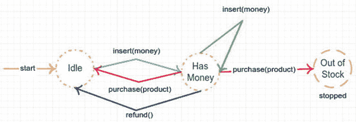
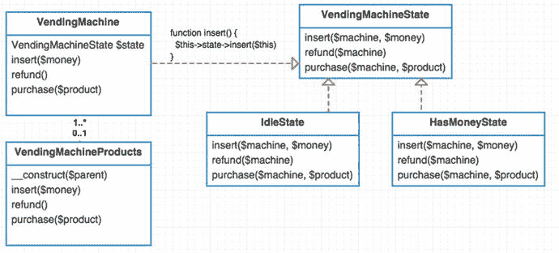

# 23.状态

```php
$> git checkout state
$> composer update

```

## 目的

允许对象在其内部状态改变时改变其行为。该对象看起来会改变它的类。 [<sup>1</sup>](#Fn1)

## 应用程序

状态模式是手套模式。当它合适的时候，它正好合适。换句话说，你会知道你什么时候需要它。您可以使用状态模式对在其生命周期中改变行为的事物进行建模。

有没有发现自己使用一些名为`$type`的字符串变量和一大串`switch/case/if/else`语句来决定调用哪些方法？国家模式将清理所有这些令人讨厌的情况。自动售货机和许多其他现实生活中的机器一样，使用状态模式。你看不到那些外在的状态。自动售货机的所有状态都发生在内部。外在，你体验不同的行为。例如，如果你在自动售货机上点击购买按钮而没有付款，会发生什么？你付款后呢？内部状态会改变该按钮的行为。按钮永远不会对您(客户端)改变。

## 抽象结构

*   `Client`是使用的主类。底层方法使用上下文和状态来改变运行时的行为。客户端通常不直接与状态对象交互。换句话说，用户永远不会知道一个`new SomeState`类。它只使用这个客户端上的公共方法。客户端的内部状态可以在用户完全不知道的情况下改变。当客户端调用`event()`时，它会转发给底层状态的处理程序。您不必将状态存储在上下文中。可以直接存储在这个类里面。如果您不需要存储状态之间的上下文数据，这一点尤其正确。为什么不把`$state`放在客户端对象里面？因为你将上下文传递给每个州的`handle`方法。因此，任何状态都能够使用上下文对象进行转换。如果你不这样做，你将不得不在你的客户端上公开暴露一个`setState()`。这意味着您可以在类之外控制状态，这可能不是一个好主意，因为它给这个客户端类增加了额外的复杂性(和责任)。

*   `Context`被传递到所有状态，这允许状态之间的通信。上下文被传递给每个状态的处理程序。一个上下文可以像数据存储(`StdClass`)一样简单，也可以包含帮助器方法(比如下图所示的`method`)。可以从任何状态类调用`method`。有时状态是“无状态”的，不需要与其他状态通信。在这种情况下，您不需要上下文对象。我在网上看到的一些 State 模式的实现实际上将`Context`和`Client`组合成了一个类。组合`Client`和`Context`的缺点是它暴露了你的内在。这给`client`类增加了额外的责任。你要把它们分开，避免公开上下文。

*   `State`是一个接口。所有具体的状态都将实现这个接口。它为一个状态定义了不同的处理方法。句柄方法应该以可能发生的事件命名。我很快会谈到这一点。现在，只要知道有一些术语会出现在你面前。

    *   状态:一些状态类

    *   事件:状态类上的可用方法

    *   转换:当状态和事件导致状态改变时

*   `ConcreteState1` / `ConcreteState2`各自代表不同的状态。里面的方法向上下文对象提供指令。换句话说，上下文对象应该为这个状态和事件做什么？这些类也可以使用上下文对象的`setState`方法来改变状态。每当你改变状态，这就是所谓的转变。


图 23-1。

Abstract structure

## 例子

让我们建立一个自动售货机的模型。你可以按自动售货机上的按钮。根据它的内部状态，它会做不同的事情。同样的按钮，不同的回应。您可以使用有限状态机的绘图来模拟自动售货机。见图 [23-2](#Fig2) 。



图 23-2。

Vending machine example

您可以将此图表转换为事件表。顶部是您需要创建的状态。左侧是每个状态的事件。表格内容描述了每个转换应该发生的情况(状态和事件对)。

<colgroup><col> <col> <col></colgroup> 
| 事件/状态 | 空闲状态 | HasMoneyState |
| --- | --- | --- |
| 插入 | 切换到有钱状态。 | 给机器多加点钱。 |
| 退还 | 告诉用户“不退款。” | 返还用户投入机器的所有钱。将机器恢复到空闲状态。 |
| 购买 | 告诉用户，他们需要插入钱，然后才能购买东西。 | 如果产品可用，并且用户已经输入足够的钱来购买，则调用机器上的存款并将状态设置为 IdleState。 |

## 示例结构

图 [23-3](#Fig3) 为结构示意图。



图 23-3。

Example structure

## 实现:示例 1 -状态模式

你从你的`VendingMachine`课开始。通过使用上面的状态/事件表，您可以看到自动售货机有三个事件:`insert, refund`和`purchase`。您为每个事件创建一个方法。每种方法是做什么的？它是底层状态事件的通道。您还必须用产品列表初始化您的上下文。这些产品将在不同的州之间共享。这种类型的上下文信息对于每个状态都很重要。自动售货机上下文与它可购买的产品数量保持一致。例如，您不能从这台机器上购买任何胡椒博士，因为金额为零。

app/example 1/vending machine . PHP

```php
namespace App\Example1;

class VendingMachine;

{
        protected $context;

        protected $products = [
                'Dr. Pepper' => ['amount' => 0, 'price' => 125],
                'Pepsi' => ['amount' => 1, 'price' => 125],
                'Mountain Dew' => ['amount' => 0, 'price' => 125],
        ];

        public function construct()
        {
                $this->context = new VendingMachineContext($this->products);
                $this->context->setState(new IdleState);
        }

        public function insert($money)
        {
                return $this->context->state()->insert($this->context, $money);
        }

        public function refund()
        {
                return $this->context->state()->refund($this->context);
        }

        public function purchase($product)
        {
                return $this->context->state()->purchase($this->context, $product
        }
}

```

现在我们来看看`VendingMachineContext`。这个类保存有价值的信息，比如当前状态、插入了多少钱、当前存入了多少钱，以及关于产品价格和库存的信息。

app/example 1/vending machine context . PHP

```php
namespace App\Example1;

class VendingMachineContext

{
        protected $state;
        public $insertedMoney;
        public $totalMoney;
        public $products;

        public function __construct($products, $totalMoney = 0, $insertedMoney = 0)

        {
                $this->products = $products;
                $this->totalMoney = 0;
                $this->insertedMoney = 0;
        }

        public function state()
        {
                return $this->state;
        }

        public function setState(VendingMachineState $state)
        {
                $this->state = $state;
        }
}

```

这个上下文类应该被传递给每个自动售货机状态。这里是你的起始状态，`IdleState`。

app/Example1/IdleState.php

```php
namespace App\Example1;

class IdleState implements VendingMachineState
{
        public function insert($machine, $money)
        {
                $hasMoney = new HasMoneyState;
                $machine->setState($hasMoney);
                $hasMoney->insert($machine, $money);
        }

        public function refund($machine)
        {
                print "no refund available in idle state\n";
        }

        public function purchase($machine, $product)
        {
                print "you'll need to enter money to purchase $product\n";
        }
}

```

插入实际上显示了向有钱状态的转变。请注意，当您试图在空闲状态下发布退款或购买事件时会发生什么。你仍然需要定义在这些事件中发生了什么。有时一个事件什么也不做(即使你让它打印出一些文本)。

如果你发现自己需要很多不同的事件，而这些事件对于一个特定的状态来说从来不会发生，那么你可以使用一个抽象类来代替`VendingMachineState`的接口。在`VendingMachineState`内部，您可以为每个事件方法实现空方法。然而，我喜欢指定每个事件，即使它是空的。即使更啰嗦，在我看来也更干净。

再来看看下一个状态，`HasMoney`。

app/Example1/HasMoneyState.php

```php
namespace App\Example1;

class HasMoneyState implements VendingMachineState
{
        public function insert($machine, $money)
        {

                if ($money < 0) throw new \Exception('You cannot insert negative money');

                print "you have inserted {$money} cents\n";

                $machine->insertedMoney += $money;
}

        public function refund($machine)
        {
                print "refunding {$machine->insertedMoney} cents\n";

                $machine->insertedMoney = 0;

                $machine->setState(new IdleState);
        }

```

当您处于“有钱”状态并插入更多的钱时，您只需继续添加到`$machine`的`insertedMoney`属性中。这就是为什么语境很重要。与其使用上下文，不如将`$insertedMoney`属性放在这个`HasMoneyState`中。那会有用的。然而，还有其他的属性，比如`$totalMoney`和`$products`，即使你转换到另一个状态也是需要的。上下文跨状态传递属性。您将在下一个事件方法中使用这些属性:`purchase`。

app/Example1/HasMoneyState.php

```php
23   public function purchase($machine, $productName)
24   {
25           if ($machine->products[$productName]['amount'] < 1) {
26           
27                   print "sorry, you are out of $productName, please choose another
28   product\n";
29                   return;
30           }
31   
32           if ($machine->products[$productName]['price'] > $machine->insertedMoney) {
33   
34           
35                   print "sorry, you need at least {$machine->products[$productName]
36   'price']}   to buy $productName\n";
37                   return;
38           }
39   
40           $machine->totalMoney += $machine->insertedMoney;
41           $machine->insertedMoney = 0;
42   
43           print "[vending machine now has {$machine->totalMoney} cents]\n";
44           print "[vending machine spits out $productName]\n";
45   
46           $machine->setState(new IdleState);
47   }

```

首先，你要确保你选择的产品有库存。接下来，您检查以确保用户插入了足够的钱。现在，您可以通过添加`insertedMoney`到`totalMoney`来继续购买。最后，您需要将状态重置回空闲。让我们来看看你的自动售货机在运行！

app/example1.php

```php
$machine = new \App\Example1\VendingMachine;

$machine->refund();

// no refund available in idle state

$machine->insert(50);

// you have inserted 50 cents

$machine->refund();

// refunding 50 cents

$machine->insert(100);

// you have inserted 100 cents

$machine->purchase('Mountain Dew');

// sorry, you are out of Mountain Dew, please choose another product

$machine->insert(25);

// you have inserted 25 cents

$machine->purchase('Dr. Pepper');

// sorry, you are out of Dr. Pepper, please choose another product

$machine->purchase('Pepsi');

// [vending machine now has 125 cents]

// [vending machine spits out Pepsi]

$machine->refund();     // because you  all hit

                        // that button after you

                        // buy a soda, right?

                        // no  refund  available  in  idle  state

```

## 示例 2 -输入状态机

在下一个例子中，您将看到一种不同类型的模式，它是从 state 模式发展而来的。你可以称之为状态机。状态机试图集成状态模式的一部分。你可以在 [`https://github.com/definitely246/state`](https://github.com/definitely246/state) [`machine`](https://github.com/definitely246/state-machine) 看到这个状态机。这个想法是你创建一个可重用的架构来切换你的客户对象的状态。有许多不同的方法可以做到这一点。一种方法是将状态模式抽象出来。上下文不再知道状态。上下文只提供关于它自己的信息和帮助器方法。让我们来看看您的新自动售货机(上下文)类。

app/example 2/vending machine . PHP

```php
namespace App\Example2;

class VendingMachine

{
        protected $insertedMoney;

        protected $totalMoney;

        protected $products = [
                'Dr. Pepper' => ['amount' => 0, 'price' => 125],
                'Pepsi'         => ['amount' => 1, 'price' => 125],
                'Mountain Dew' => ['amount' => 0, 'price' => 125],
        ];
        public function __construct($totalMoney = 0, $insertedMoney = 0)
        {
                $this->totalMoney = $totalMoney;
                $this->insertedMoney = $insertedMoney;
        }
        public function insertMoney($money)
        {
                $this->insertedMoney += $money;
        }
        public function insertedMoney()
        {
                return $this->insertedMoney;
        }

        public function refundMoney()
        {
                $refund = $this->insertedMoney;
                $this->insertedMoney = 0;

                return $refund;
        }

        public function products()
        {
                return $this->products;
        }

        public function numberOfRemaining($product)
        {
                return $this->products[$product]['amount'];
        }

        public function priceOf($product)
        {
                return $this->products[$product]['price'];
        }

        public function purchase($product)
        {
                $this->totalMoney = $this->insertedMoney;
                $this->insertedMoney = 0;
                print "[vending machine now has {$this->totalMoney} cents]\n";

                print "[vending machine spits out $product]\n";
        }
}

```

注意这里没有关于州的内容。您只提供方法来做非常具体的事情。如果您在这个类上调用 purchase 方法，它将购买一个产品，而不管这个自动售货机周围的条件如何。这为您的客户端提供了一个更简单、更干净的界面，因为您不再需要担心状态。这也意味着您可以在以后的任意时间向现有的类添加一个状态机。因此，如果这个`VendingMachine`类不再管理它的内部状态，那么在哪里做呢？目前，这段代码留在了`example2.php`中，但是它可以进一步封装在另一个(客户端)类中。

app/example2.php

```php
$transitions = [
        [
                 'event' => 'insert',       // inserting money

                 'from'  => 'idle',         // changes idle state

                 'to'    => 'has money',    // to has money state

                 'start' => true,           // this is starting state

        ],
        [
                 'event' => 'insert',       // inserting more

                 'from'  => 'has money',    // money is okay

                 'to'    => 'has money',    // state does not change

        ],
        [
                 'event' => 'refund',       // allow idle to refund

                 'from'  => 'idle',         // transition prints msg

                 'to'    => 'idle',         // and state stays the

        ],
        [
                 'event' => 'refund',       // refunding when in

                 'from'  => 'has money',    // has money state

                 'to'    => 'idle',         // sets you back

        ],
        [
                 'event' => 'purchase',     // stops the fsm because

                 'from'  => 'has money',    // all items have been

                 'to'    => 'out of stock', // purchased and there is

                 'stop'  => true,           // no more idle state

        ],
        [
                 'event' => 'purchase',     // when  you  make  it to this

                 'from'  => 'has money',    // transition, you purchase item.

                 'to'    => 'idle',         // order matters, see true above?

        ],
];
$vendingMachine = new \App\Example2\VendingMachine;

$machine = new \StateMachine\FSM($transitions, $vendingMachine, '\App\Example2\Transitions');

```

这种方法的好处是，您可以通过这个数组轻松地管理事件转换。状态机只需要两样东西:转换数组和上下文。第三个参数是一个完全限定的名称空间，状态机可以在其中找到转换类。过渡类处理从一个事件到另一个事件的过渡。您需要为数组中的每个过渡定义一个过渡类。那么如何定义一个过渡类呢？现在我们来看一下数组中的第一个转换。

```php
[
          'event' => 'insert',              // inserting money

          'from'  => 'idle',                // changes idle state

          'to'    => 'has money',           // to has money state

          'start' => true,                  // this is starting state

],

```

类名是根据该数组上的事件、from 和 to 属性自动生成的。因此，您需要创建的类名应该叫做`InsertChangesIdleToHasMoney`。读起来不错，对吧？这种命名约定可以改变。您可以访问状态机文档了解如何做到这一点。因此，让我们创建您的类。

app/example 2/insertchangesidletohasmoney . PHP

```php
namespace App\Example2;

class InsertChangesIdleToHasMoney

{
        public function allow($vendingMachine)
        {
                // always allow the user to insert money

                // when sitting around in the idle state

                return true;
        }

        public function handle($vendingMachine, $money)
        {
                print "inserting {$money} coins\n";

                return $vendingMachine->insertMoney($money);
        }
}

```

每个过渡类需要两个方法。第一个方法让你知道你是否被允许处理这个方法。这给了你询问状态机是否转换的能力。

```php
$machine->canInsert($money) // returns true because allow() returns

true

```

当您真正想要调用这个转换时，您调用事件名称。在这种情况下，事件名称为`insert`。

```php
$machine->insert($money) // invokes InsertChangesIdleToHasMoney::handle($vendingMachine,
$money);

```

在状态机调用了`handle`方法之后，状态机会自动从`IdleState`状态切换到`HasMoney`状态，因为您在`$transitions`数组中告诉它这样做。还定义了其他五个转换类。如果你想看得更详细，请查看源[<sup>2</sup>](#Fn2)[。你可以在这里跳过这些。让我们再来看看`example2.php`的用法。](https://github.com/kdocki/larasign/tree/state/src/Example2/Transitions)

app/example2.php

```php
$machine = new \StateMachine\FSM($transitions, $vendingMachine, '\App\Example2\Transitions');

print "machine state: [{$machine->state()}]\n";

$ourMoney = 300;

print "you have $ourMoney coins\n";

$ourMoney -= 125;

$machine->insert(125);

print "machine state: [{$machine->state()}]\n";

print "attempting to purchase Dr. Pepper\n";

// you can easily turn off exceptions

$machine->whiny = false;

if(! $machine->purchase('Dr.Pepper')) {
      print "asking machine for refund\n";

      $ourMoney += $machine->refund();
}

```

此代码产生以下输出:

```php
machine state: [idle]
you have 300 coins
inserting 125 coins
machine state: [has money]
attempting to purchase Dr. Pepper
you are out of Dr. Pepper, sorry...
asking machine for refund

```

您可能已经注意到了状态机上的`whiny`属性。它打开和关闭异常。如果 whiny mode 为真，那么每当状态机被要求进行无效转换时，就会抛出一个异常。当状态机处于空闲状态时，没有购买事件处理程序。如果没有关闭 whiny 模式，状态机就会抛出一个异常。当 whiny 模式关闭时，它只为无效的过渡返回 false。接下来，你在抱怨模式下购物(推荐)。

app/example2.php

```php
// put exception handling back on
$machine->whiny = true;

print "\nyou now have $ourMoney coins\n";

print "machine state: [{$machine->state()}]\n";

$ourMoney -= 100;

$machine->insert(100);

try {

    $machine->purchase('Pepsi');

} catch (\StateMachine\Exceptions\CannotTransitionForEvent $e) {
  ...
}
        print "---------------------------------------------\n";
        print "caught CannotTransitionForEvent exception\n";
        print "when whiny mode is active, you get exceptions\n";
        print "for invalid state transitions\n";
        print "---------------------------------------------\n";
}

if ($machine->canPurchase('Pepsi')) {
        $machine->purchase('Pepsi');
}

$ourMoney -= 25;

$machine->insert(25);

$machine->purchase('Pepsi');

```

产出 2

```php
you now have 300 coins
machine state: [idle]
inserting 100 coins

not enough money for Pepsi. machine needs 25 more coins.
---------------------------------------------
caught CannotTransitionForEvent exception
when whiny mode is active, you get exceptions

for invalid state transitions
---------------------------------------------

not enough money for Pepsi. machine needs 25 more coins.
inserting 25 coins
[vending machine now has 125 cents]
[vending machine spits out Pepsi]

```

现在你已经看到了购买，让我们看看机器如何处理用完的产品。这将调用`StateMachineIsStopped`异常，因为在你的转换数组中有`stop`。一旦您的状态机停止，它就不再处理任何进一步的转换。

example2.php

```php
print "\nyou now have $ourMoney coins\n";

print "machine state: [{$machine->state()}]\n";

print "inserting 25 coins\n";

try {

        $machine->insert(25);        // throws StateMachineIsStopped exception

                                     // probably should handle

                                     // though, since a user w

                                     // you should just spit the

                                     // out and message the you

                                     // you are out of stock br

} catch (\StateMachine\Exceptions\StateMachineIsStopped $e) {
        print "---------------------------------------------\n";
        print "Caught the StopMachineIsStopped exception...\n";
        print "This means that the insert you just tried failed...\n";
        print "---------------------------------------------\n";
}

```

产出 3

```php
you now have 175 coins
machine state: [out of stock]
inserting 25 coins
---------------------------------------------
Caught the StopMachineIsStopped exception...

This means that the insert you just tried failed...
---------------------------------------------

```

您可能已经注意到，与上一个示例相比，您添加了更多的过渡。这只是为了说明在使用状态机时创建新的转换是多么简单。这个例子不像你在第一个例子中的更传统的状态模式类。尽管目的是一样的。请记住，本例中您的客户机分布在`example2.php`上。您可以轻松地添加如下所示的客户端类:

示例 2 客户端

```php
class VendingMachineClient extends \StateMachine\FSM
{
        protected $transitions = [
                // transitions listed here ...

        ];

        public function __construct()
        {
                parent:: __construct($this->transitions, new VendingMachine, '\App\Example2\Transitions');
        }
}

```

这种状态机方法的问题在于它很神奇。在不知道有限状态机如何工作的情况下，你无法推断出`VendingMachineClient`上的公共方法。您知道您可以调用 transitions 数组中的事件。这是因为在`FSM`中有一个神奇的`call`方法让这一切发生。然而，对于任何新来者来说，这并不明显。第一次看到这个类的人可能会大吃一惊。这里有反射和神奇的方法调用。这并不意味着这是一个糟糕的设计；这只是意味着如果你喜欢一个不那么隐含的状态机，你可以用不同的方式来做。这就引出了下一个例子。

## 例 3

下一种方法利用特征。您将状态放回到`VendingMachine`类中。现在看起来是这样的:

app/example 3/vending machine . PHP

```php
namespace App\Example3;

class VendingMachine extends \StateMachine\DefaultContext
{
        use \StateMachine\Stateful;

        protected $state = '\App\Example3\IdleState';

        protected $context = 'this';

        // the rest of this class looks the same as it did

        // in example 2 protected and is omitted to keep it short

```

您的自动售货机仍然以与示例 2 相同的方式处理购买和产品。这里的区别在于您使用了一个名为`Stateful`的特性，它允许您自动地调用状态的底层方法。它没有前面的例子那么神奇，因为您可以查看每个 state 类中可用的特征和方法。让我们看看`IdleState`和`HasMoneyState`类。

app/Example3/IdleState.php

```php
namespace App\Example3;

class IdleState implements State
{
        public function __construct(VendingMachine $machine)
        {
                $this->machine = $machine;
        }

        public function insert($money)
        {
                $this->machine->insertMoney($money);
                $this->machine->setState('\App\Example3\HasMoneyState');
        }

        public function refund()
        {
                print "no refund available in idle state\n";
        }

        public function purchase($product)
        {
                print "you'll need to enter money to purchase $product\n";
        }

```

接下来是`HasMoney`状态。

app/Example3/HasMoneyState.php

```php
class HasMoneyState implements State
{
        public function __construct($machine)
        {
                $this->machine = $machine;
        }

        public function insert($money)
        {
                if ($money < 0) throw new \Exception('You cannot insert negative money');

                $this->machine->insertMoney($money);
        }

        public function refund()
        {
                $this->machine->setState('\App\Example\IdleState');

                return $this->machine->refundMoney();
        }

        public function purchase($product)
        {
                if (! $this->machine->canPurchase($product)) {
                          return;
        }

                $this->machine->setState('Example3\IdleState');
                $this->machine->makePurchase($product);
        }

```

您可能会注意到这看起来更像传统的状态模式。这种方法让你的自动售货机设计更加清晰。在我看来它是最干净的。我不太喜欢特质，因为它们经常被滥用。我认为在这种情况下是可行的。不过，每个人都有自己的偏好。我为状态模式提供了三种不同的方法。选择你的毒药。微笑。

## 结论

在本章开始时，我提到这是一个手套图案。除非合身，否则不要用。状态模式的一个缺点是它增加了要维护的类的数量。如果您的设计中只有几个状态和事件，那么这可能不值得。在客户端类中包含几个条件语句可能比拥有多个状态类更容易。

四人帮的书提到，如果你的状态不包含内部变量，你就不需要一遍又一遍地构造状态类。您可以重用相同的状态类。有些人会将这种方法视为 flyweight 模式，因为您可以重用状态对象。重用状态对象可能会更快，因为您不必一次又一次地重新构建它们。这并不意味着它是轻量级的。flyweight 是关于减少内存占用的。你可能没有几百万个不同的状态对象。重用几个状态类并不意味着更少的内存(正如你在 flyweight 一章中看到的)。不过，我能反驳谁呢？

还有另一个相关的模式，看起来与 state 模式相同。这就是所谓的战略模式。两种模式都使用合成来修改内部行为。主要区别在于策略是针对算法的，而不是内部状态。您可能不会对自动售货机使用策略模式，因为已知自动售货机在现实生活中处于不同的状态。尽管状态和策略模式之间的代码结构看起来基本相同，但意图不同。我还没有谈到策略模式，但那是下一章。我们开始吧！

Footnotes [1](#Fn1_source)

设计模式:可重用面向对象软件的元素，第 338 页

  [2](#Fn2_source)

[T2`https://github.com/kdocki/larasign/tree/state/app/Example2/Transitions`](https://github.com/kdocki/larasign/tree/state/app/Example2/Transitions)