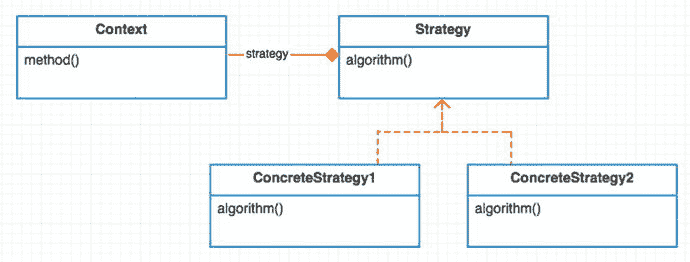
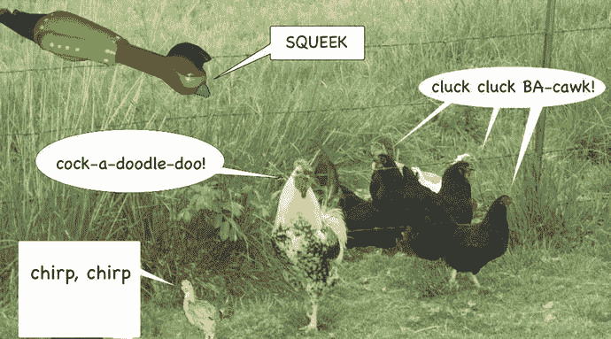
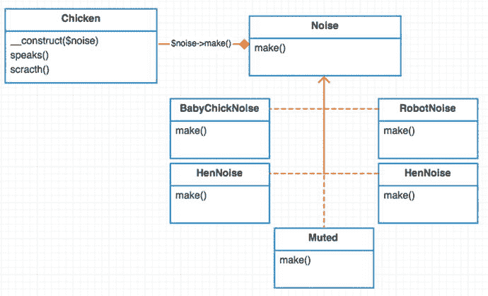

# 二十四、策略

```php
$> git checkout strategy

```

## 目的

定义一系列算法，封装每一个算法，并使它们可以互换。策略让算法独立于使用它的客户端而变化。 <sup>1</sup>

## 应用

当您的算法共享相同的公共接口，但在幕后以不同的方式工作时，策略模式是有用的。策略模式通常依靠组合来传递不同的算法。Laravel [加密](https://laravel.com/docs/master/encryption) <sup>2</sup> 组件使用相同的方法加密和解密消息。不过，基本的密码算法是可以改变的。这是策略模式的松散实现:

```php
$crypt = Illuminate\Encryption\Encrypter('secret key', $cipher)
$encrypted = $crypt->encrypt('secret');
$decrypted = $crypt->decrypt($encrypted);

```

注意`Crypt`如何保持了`encrypt`和`decrypt`相同的接口方法，然而当你改变密码时，底层的行为也改变了。这个例子体现了策略模式的概念。缺少的部分和我说的松散实现的原因是在这个例子中`$cipher`是一个`string,`而不是一个`class`。

## 抽象结构

*   `Context`是保存`strategy`对象的类。这是客户将与之交互的内容。当`method()`被调用时，它会调用`$strategy->algorithm()`。因为这个类使用了复合，你可以通过改变`$strategy`对象轻松地替换掉策略算法。见图 24-1 。

    

    图 24-1。

    Abstract structure
*   `Strategy`是一个抽象类或接口。它定义了所有算法的公共接口方法。

*   `ConcreteStrategy1/2`是一个策略的不同算法实现。

## 例子

在本例中，您将制作一只鸡。不是美味的烤鸡。会发出声音的鸡。鸡会发出不同的声音。公鸡打鸣。母鸡咯咯叫。一只小鸡唧唧喳喳。图 4-2 显示了鸡发出的不同声音。



图 24-2。

Chicken noises

让我们看看这个`Chicken`类会是什么样子，如果你为每种类型的鸡使用一个巨大的 switch 语句。

app/ChickenBeforePattern.php

```php
namespace App;

class Chicken

{
        public function construct($noisetype)
        {
                $this->noisetype = $noisetype;
        }

        public function speaks()
        {
                switch ($this->noisetype) {
                        case 'hen':     return 'cluck, cluck';
                        case 'chick':   return 'chirp, chirp';
                        case 'rubber':  return 'squeek!';
                        case 'muted':   return '';
                        case 'rooster': return 'cock-a-doodle-doo!';
                }

                return '';
        }

        public function scratch()
        {
                print 'scratches some dirt' . PHP_EOL;
        }

```

每只鸡说话的方式都不一样。这个简单的算法是为给定类型的鸡制造一个噪音。类似于 Laravel `Encrypter`类，您的噪声生成算法输出一个字符串。算法在产生的噪声方面有所不同，但是您的`Chicken`(上下文)类保持不变。注意所有的鸡都会抓痒。您将使用策略模式来删除在`speaks`方法中找到的 switch 语句。

## 示例结构

图 24-3 为结构示意图。



图 24-3。

Example structure

## 履行

你要做的第一件事是改变你的`Chicken`类来接受一个噪声制造者类。

app/Chicken.php

```php
namespace App;

class Chicken

{
        public function __construct(Noises\Noise $noise)
        {
                $this->noise = $noise;
        }

        public function speaks()

        {
                print $this->noise->make();
        }

        public function scratch()
        {
                print 'scratches some dirt' . PHP_EOL;
        }
}

```

现在，当鸡说话时，它依靠噪音策略发出声音。任何时候你需要创建一个新的噪音，就像添加一个新的类一样简单。你不再需要重新打开`Chicken`类。关门了。这就是我在书的开头讲的开/闭立体原理。

这将我们带回编程中的一个重要概念，一个你可能已经非常熟悉的概念。不要囊括所有的东西。您只封装应用中可能会发生变化的内容。假设您永远不会添加另一种类型的鸡噪声。在这种情况下，您之前看到的`switch`语句可能是更好的方法。不要努力去解决不存在的问题。

那么你怎么知道你是否应该抽象一些算法呢？这是一个提示。你有没有发现自己重新打开同一个文件来一遍又一遍地修改某些东西？该文件中的类很可能做得太多了。把文件分成几份。使用合成将文件分割成不同文件。如果你在这些文件中有一个算法，就使用策略模式。

如您所见，策略模式使用组合来拆分算法。然而，仅仅因为你在某个地方使用了组合并不意味着你在使用策略模式。很多模式使用构图。策略的目的是制造可互换的算法。在这个例子中，你的算法是关于如何制造噪音的。诚然，它并不复杂，但它仍然是一个算法。

app/Noises/BabyChickNoise.php

```php
namespace App\Noises;

class BabyChickNoise implements Noise
{
        public function make()
        {
                return "chirp, chrip\n";
        }
}

```

想看看另一个噪声实现吗？这里有一个`Hen`噪音。

app/Noises/HenNoise.php

```php
namespace App\Noises;

class HenNoise implements Noise
{
        public function make()
        {
                return "cluck, cluck, BA-cawk!\n";
        }
}

```

如果你想看其他的，请查看资源库 <sup>3</sup> 中的[噪音。现在让我们看看如何使用这个类。](https://github.com/kdocki/larasign/tree/strategy/app/Noises)

app/simulator.php

```php
$chicken = new \App\Chicken(new \App\Noises\BabyChickNoise);
$chicken->speaks();                // chirp, chirp

$chicken = new Chicken(new \App\Noises\HenNoise);
$chicken->speaks();                // cluck, cluck

$chicken = new Chicken(new \App\Noises\RoosterNoise);
$chicken->speaks();             // cock-a-doodle-doo!!!

$chicken = new Chicken(new \App\Noises\RubberChickenNoise);
$chicken->speaks();             // squeeek!

$chicken = new Chicken(new \App\Noises\Muted);
$chicken->speaks();             //

$chicken->scratch();            // scratches some  dirt

```

之前你的鸡类有一个`$noisetype`字符串和`switch`语句。现在，通过一个`Noise`算法，你有了更多的控制权。这也允许你在以后添加新的算法。

## 结论

您已经看到了策略模式如何将您从条件语句中解放出来。条件中的每条语句都表达了自己的行为。这通常会使代码更容易理解。策略模式允许您做的另一件事是选择您想要使用的算法。一种算法在 80%的情况下可能有更好的性能。你有 80%的机会可以选择它。另外 20%的时间你可能会选择另一个不常用的算法。

这种策略模式有几个缺点。客户必须知道不同的策略对象。这种额外的复杂性是最小的，并且可以通过服务容器自动解析依赖性来消除。这个缺点不应该阻止您使用 Laravel 中的策略模式。

下一个缺点是增加了应用中的类的数量。不过，这真的是个问题吗？越多越好，对吧？之前我们讨论了如何保留`switch`声明。当算法足够简单时，有时这是一个不错的选择。添加更多的类会增加复杂性。复杂性在于理解如何设计多个类一起工作。然而，选择不使用策略模式的后果是一个巨大的单块类，它违反了开放/封闭原则。

Footnotes 1

设计模式:可重用面向对象软件的元素，第 349 页

  2

[`https://laravel.com/docs/master/encryption`](https://laravel.com/docs/master/encryption)

  3

[`https://github.com/kdocki/larasign/tree/strategy/app/Noises`](https://github.com/kdocki/larasign/tree/strategy/app/Noises)