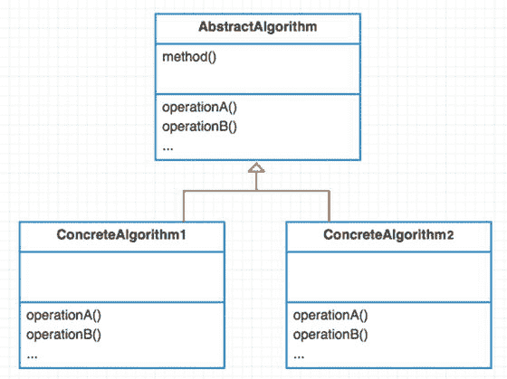

# 二十五、模板方法

```php
$> git checkout template_method

```

## 目的

在操作中定义算法的框架，将一些步骤推迟到子类。模板方法允许子类在不改变算法结构的情况下重新定义算法的某些步骤。 <sup>1</sup>

## 应用

当您有一个需要内部进一步指令才能正确运行的算法时，模板方法非常有用。当算法有步骤时，它非常适合，就像烹饪食谱一样。《头脑优先设计模式》一书举了一个制作不同含咖啡因饮料的例子。泡一杯茶很像泡一杯咖啡 <sup>2</sup> 。一些步骤有所不同，但在大多数情况下，您可以重用许多步骤。当同一算法的不同版本共享许多步骤时，模板模式很有帮助。算法的变化步骤在子类中定义。

## 抽象结构

*   `AbstractAlgorithm`包含算法变体之间的所有共享片段。可以重用的基本方法放在这里。见图 25-1 。

    

    图 25-1。

    Abstract structure
*   `ConcreteAlgorithm` `1/2`包含对抽象算法缺失步骤的覆盖。算法的变化在这里。

## 例子

在此示例中，您将遵循一般编写器创建文档的步骤。这些通用的步骤为任何作者提供了一个配方(或算法)。

*   打个草稿。

*   在文档未通过审查流程后对其进行修订。

有不同类型的作家。你是哪种类型的作家取决于你写的文件类型。在本例中，您将创建软件作者和杂志作者。

## 示例结构

图 25-2 为结构示意图。


图 25-2。

Example structure

## 履行

你从你的基础抽象算法`Writer`开始。所有作家都会写作。作家写作时通常遵循相同的食谱。一个作家会创作一个草稿，并不断修改草稿，直到它足够好。

app/Writer.php

```php
namespace App;

abstract class Writer

{
        abstract protected function draft();
        abstract protected function failsReview($document);
        abstract protected function revise($document);

        public function write()
        {
                $document = $this->draft();

                while ($this->failsReview($document)) {
                        $document = $this->revise($document);
                }

                return $document;
        }

```

注意有三个抽象方法。要求所有具体算法都实现这三个抽象方法。根据作者的类型，作者可能会以不同的方式审阅他们的文档。软件作者将使用单元测试来审查。一个杂志作者会使用一个评论团队。

app/SoftwareWriter.php

```php
namespace App;

class SoftwareWriter extends Writer
{
        public $testedCount = 0;

        protected function draft()
        {
                print "drafting software program\n";
                return "software";
        }
        protected function failsReview($document)
        {
                print "do unit tests pass for {$document}?\n";
                return $this->testedCount++ < 3;
        }

        protected function revise($document)
        {
                print "correcting mistakes for {$document} (revision #{$this->tesedCount})\n";

                return $document;
        }

```

这是一位杂志作家。同样，这种不同类型的作者可以有完全不同的起草，审查和修改步骤。

app/MagazineWriter.php

```php
namespace App;

class MagazineWriter extends Writer
{
        protected function draft()
        {
                $document = "magazine";
                print "drafting {$document} document\n";
                return $document;
        }

        protected function failsReview($document)
        {
                print "reviewing {$document} document\n";
                return false;
        }

        protected function revise($document)
        {
                print "revising {$document} document\n";
                return $document;
        }

```

运行模拟器会产生以下输出。

app/simulator.php

```php
$writer = new \App\MagazineWriter;
$writer->write();

// drafting magazine document

// reviewing magazine document

$writer = new \App\SoftwareWriter;
$writer->write();

// drafting software program

// do unit tests pass for software?

// correcting mistakes for software (revision #1)

// do unit tests pass for software?

// correcting mistakes for software (revision #2)

// do unit tests pass for software?

// correcting mistakes for software (revision #3)

// do unit tests pass for software?

```

## 结论

模板方法的一个主要缺点是随着时间的推移变得复杂。实际上，随着您添加更多具体的算法，该模式变得更加难以维护。如果您在上面添加了另一个版权发布步骤会怎么样？

```php
public function publish()
{
        $document = $this->draft();

        while ($this->failsReview($document)) {
                $document = $this->revise($document);
        }

        $this->copyright($document);
        return $document;
}

```

为软件程序或杂志申请版权可能是有意义的。然而，如果你有另一个叫做`HighschoolEssayWriter?`的具体算法呢？一个高中生不需要为他的论文文档申请版权。不过，这个具体的算法仍然需要覆盖`abstract copyright`方法。这是拥有一个通用模板来管理你的算法的一个缺点。在你的子算法类中进行非常特殊的定制会很麻烦。添加`copyright`方法会影响每个子类。你必须改变从`abstract Writer`类继承的每一个类。这意味着你的抽象算法会变得混乱。这可能是一个棘手的问题，许多人认为这是一个交易破坏者。

有些人抱怨测试基础抽象类。这可以通过创建一个继承抽象类的模拟子类来解决。

请阅读 [`http://tech.puredanger.com/2007/07/03/pattern-hate`](http://tech.puredanger.com/2007/07/03/pattern-hate) [`template/`](http://tech.puredanger.com/2007/07/03/pattern-hate-template/) 的博客文章，了解模板模式的更多缺点。这个人给出了一些不使用模板方法模式的很好的理由。

*   它没有很好地传达意图。

*   很难组合功能。

*   理解程序流程很难。

*   很难维持。

当你看一看模板方法模式的结构时，它使用继承而不是组合。我已经谈到了写作如何帮助你避免违反坚实的原则。长话短说，使用这种模式要非常小心。

Footnotes 1

设计模式:可重用面向对象软件的元素，第 360 页

  2

头先设计图案，第章第 8 ，第 276 页