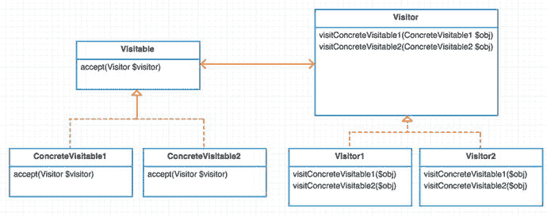
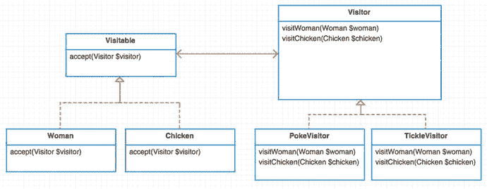

# 26.访问者

```php
$> git checkout visitor

```

## 目的

表示要在对象结构的元素上执行的操作。Visitor 允许您定义一个新的操作，而不改变它所操作的元素的类。 [<sup>1</sup>](#Fn1)

## 应用程序

这可能是我见过的最复杂的 GoF 模式之一。第一次盯着 UML 图看了一会儿我说:“嗯，[窟](https://www.destroyallsoftware.com/talks/wat) [<sup>2</sup>](#Fn2) ？”在其基本形式上，这种模式完全是关于从半相关或不相关的类中提取方法。当你这样做的时候，你不再需要改变或者重新访问(双关语)代码。在阅读了更多关于这种模式的内容后，我发现一些喜欢花言巧语的人喜欢称之为[双重调度](http://en.wikipedia.org/wiki/Double_dispatch) [<sup>3</sup>](#Fn3) 。

什么是双重派遣？基本上，当你调用一个方法时，那个方法会为你调用另一个方法。因此该方法进行了双倍的调用，因此得名。像 C++或 Java 这样的语言允许你[重载方法](http://en.wikipedia.org/wiki/Function_overloading) [<sup>4</sup>](#Fn4) 。在 PHP 中不需要方法重载。在 PHP 中，您需要在运行时使用反射进行双重调度。但是，您稍后会发现，访问者模式不需要双重分派。我之所以在这里列出它，是因为其他语言经常使用带有方法重载的双重分派来实现访问者模式。

双重派遣在行动

```php
$dispatch->method(new Car);  // calls $dispatch->carMethod($car)

$dispatch->method(new Dog); // calls $dispatch->dogMethod($dog)

```

访问者模式的一个类比是一个修理工访问一所房子。房子的主人可以选择接受或拒绝修理工。如果业主要求管道工，但电工出现了，他可以把电工赶走。假设修理工被主人接受了，他就能做好他的工作。房主不需要知道任何关于管道的细节。除了几个问题和账单之外，房主不再参与此事。修理工和房主的责任是分开的。与访客模式相反的是 DIY(自己动手)房主，他们可以修理自己的管道。问题是，没有其他人的帮助，一个自己动手的房主能做的事情就这么多了。

这个“什么都自己做”的问题也存在于软件中。你不想要一个什么都做的巨型类。然而，有时现实生活中的模型可以做很多事情。此外，现实生活中的模型将增加更多的功能和发展。通过使用 visitor 模式，您可以在以后添加到您的模型化类中，而不必一遍又一遍地重新打开该类，也不会违反打开/关闭原则。

## 抽象结构

图 [26-1](#Fig1) 为结构示意图。



图 26-1。

Abstract structure

## 例子

女人和鸡有什么共同点？你可以把你的笑话发到@kdocki [<sup>5</sup>](#Fn5) 上，这样我就可以告诉我的妻子了。在这个例子中，女人和鸡都可以被戳。您可以将`poke`方法放在每个类中。

```php
class Chicken {
   public function poke() {   ...   }
   // ... other methods related to Chicken

}

class Woman

{
   public function poke() {   ...   }
   // ... other methods related to Wife

}

```

这有时行得通。但是，如果您现在想添加更多的方法，该怎么办呢？怎么样`tickle, kiss`和`chase?`最终你不断地在你的类中增加操作，给一个巨大的整体类增加越来越多的责任。还有，问问自己，女人真的需要知道怎么戳自己吗？那不是应该放在别处的责任吗？在这个例子中，您学习了如何使用访问者模式向`Chicken`和`Woman`模型添加新的操作。

## 示例结构

图 [26-2](#Fig2) 为结构示意图。



图 26-2。

Example structure

## 履行

如图 [26-2](#Fig2) 所示，你将操作抽象成`Visitor`类。任何可以运行这些`Visitor`操作的类都应该实现`Visitable`。一个`Visitable`可以选择接受或拒绝一个新的访客。

app/visit table . PHP

```php
namespace App;

interface Visitable

{
        public function accept(Visitor $visitor);
}

```

本例中的`Visitables`是一个`Woman`和一个`Chicken`。

app/Woman.php

```php
namespace App;

class Woman implements Visitable
{
        public function __construct($name)
        {
                $this->name = $name;
        }

        public function accept(Visitor $visitor)
        {
                return $visitor->visitWoman($this);
        }
}

```

别忘了家禽！

app/Chicken.php

```php
namespace App;

class Chicken implements Visitable
{
        public function construct($type)
        {
                $this->type = $type;
        }

        public function accept(Visitor $visitor)
        {
                return $visitor->visitChicken($this);
        }
}

```

注意，这两个类都调用了 visitor 上的一个方法。我见过一些使用通用的`visit`方法而不是`visitWoman`的例子。这些例子里有一个巨大的`switch`语句和[`is_a`](http://php.net/manual/en/function.is-a.php)[<sup>6</sup>](#Fn6)里面的`visit`方法。双重调度将`visitable`类型中继到更具体的方法。我选择跳过这一步，因为没有必要。你已经知道了`visitable`的类型，可以直接调用。PHP 中没有方法重载，但是可以简单地命名每个方法`visit<VisitableType>`来绕过这个限制。

接下来看`Visitor`。

app/Visitor.php

```php
namespace App;

interface Visitor
{
        function visitWoman(Woman $woman);
        function visitChicken(Chicken $chicken);
}

```

每个`Visitor`都必须知道如何拜访一个`Woman`和`Chicken`。`poke`访客戳一个`Woman`和`Chicken`(图 [26-3](#Fig3) )。


图 26-3。

Poking a chicken

app/PokeVisitor.php

```php
namespace App;

class PokeVisitor implements Visitor
{
        public function visitWoman(Woman $woman)
        {
                print "the woman named {$woman->name} was poked\n";
        }

        public function visitChicken(Chicken $chicken)
        {
                print "the {$chicken->type} chicken was poked\n";
        }
}

```

后来你决定要添加一个`tickle`操作。这就像创建一个新的访问者一样简单。

app/TickleVisitor.php

```php
namespace App;

class TickleVisitor implements Visitor
{
        public function visitWoman(Woman $woman)
        {
                print "the woman named {$woman->name} was tickled\n";
        }

        public function visitChicken(Chicken $chicken)
        {
                print "the {$chicken->type} chicken was tickled\n";
        }
}

```

您可以用新的访问者类添加越来越多的操作。我将把`chase`和`kiss`访问者操作留给您来实现。现在让我们看看你将如何使用你的访问者和可访问者。

app/simulator.php

```php
$woman = new \App\Woman("Sally");
$woman->accept(new \App\PokeVisitor);
$woman->accept(new \App\TickleVisitor);

$chicken = new \App\Chicken('Dominecker');
$chicken->accept(new PokeVisitor);
$chicken->accept(new TickleVisitor);

```

运行此模拟输出

```php
the woman named Sally was poked
the woman named Sally was tickled
the Dominecker chicken was poked
the Dominecker chicken was tickled

```

最后要指出的是。因为`PokeVisitor`是类，不是方法，所以可以保存属性。这些属性可用于保存有状态信息。这意味着`PokeVisitor`比仅仅放在`Woman`类中的`poke`方法具有更大的灵活性。

## 结论

访问者模式的主要缺点是，每次你添加一个新的`Visitable`类型时，你必须在每个可用的`Visitor`类中创建一个新的`visit<NewType>`操作。这可以通过使用`Visitor`的抽象基类而不是接口来解决。基础抽象类可以实现该方法的默认值，直到一个`visitor`类需要覆盖该方法。我也看到过一些例子也用这样的方式来解决这个问题。不建议这样做，但我会告诉你如何做:

```php
public function visit(Visitable $visitable)
{
        $className = get_class($visitable);
        $methodName = "visit{$className}";

        if (method_exists($this, "visit{$className}")) {
                return call_user_func_array([$this, "visit{$className}"] [$visitable]);
        }
}

```

不推荐上述方法的原因是，当你并不真正需要它时，它会增加复杂性。因为它使用反射，所以排除故障也更加困难。使用反射的解决方案会使调试堆栈跟踪更具挑战性。

抛开缺点不谈，访问者模式使得添加新操作变得轻而易举。这是假设你没有添加任何新的`Visitable`类。然而，如果您频繁地添加新的`Visitable`类型，那么维护这种模式的成本会很高，并且会给您带来很多麻烦。

访问者模式的另一种选择是使用特征(混合)。将功能混合到现有的类中通常更容易。然而，特征仍然有缺点，会给类增加越来越多的功能。然而，对于一些开发人员来说，这种方法比实现访问者模式更容易混淆。拥有一个名为`accept`的通用双重分派方法，并向其传递一个 visitor 类，可能会让项目的新手望而生畏。这是因为`accept`方法可以根据它接收的访问者类型做许多不同的事情。`accept`的广泛性既是其最大的弱点，也是其最大的优势。

Footnotes [1](#Fn1_source)

设计模式:可重用面向对象软件的元素，第 366 页

  [2](#Fn2_source)

[T2`www.destroyallsoftware.com/talks/wat`](http://www.destroyallsoftware.com/talks/wat)

  [3](#Fn3_source)

[T2`http://en.wikipedia.org/wiki/Double_dispatch`](http://en.wikipedia.org/wiki/Double_dispatch)

  [4](#Fn4_source)

[T2`http://en.wikipedia.org/wiki/Function_overloading`](http://en.wikipedia.org/wiki/Function_overloading)

  [5](#Fn5_source)

[T2`https://twitter.com/kdocki`](https://twitter.com/kdocki)

  [6](#Fn6_source)

[T2`http://php.net/manual/en/function.is-a.php`](http://php.net/manual/en/function.is-a.php)