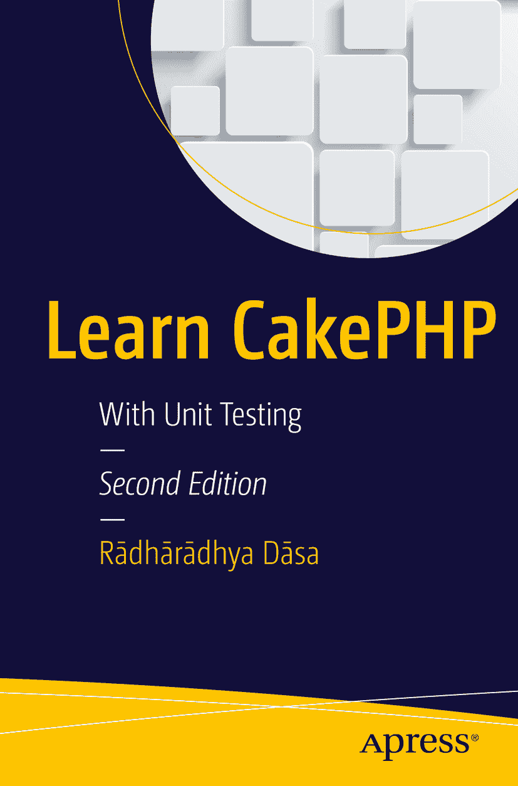

拉达拉迪亚·达萨《使用单元测试学习 CakePHP》第二版

作者在本书中引用的任何源代码或其他补充材料，读者可在 [`www.apress.com/9781484212134`](http://www.apress.com/9781484212134) 获取。有关如何查找本书源代码的详细信息，请访问 [`www.apress.com/source-code/`](http://www.apress.com/source-code/)。读者也可在 SpringerLink 各章节的“补充材料”部分获取源代码。

ISBN 978-1-4842-1213-4  
e-ISBN 978-1-4842-1212-7  
DOI 10.1007/978-1-4842-1212-7  
美国国会图书馆控制号：2016949500

© 2016 年，Sándor Gömöri 版权所有

《使用单元测试学习 CakePHP》第二版

常务董事：Welmoed Spahr  
首席编辑：Steve Anglin  
技术审校：Massimo Nardone  
编辑委员会：Steve Anglin, Pramila Balan, Louise Corrigan, Jonathan Gennick, Robert Hutchinson, Celestin Suresh John, James Markham, Susan McDermott, Matthew Moodie, Ben Renow-Clarke, Gwenan Spearing  
协调编辑：Mark Powers  
文字编辑：Michael G. Laraque  
排版：SPi Global  
索引制作：SPi Global  
美术设计：SPi Global

如需了解翻译相关信息，请发送电子邮件至 `rights@apress.com`，或访问 [`www.apress.com`](http://www.apress.com)。

Apress 和 friends of ED 系列图书可批量购买用于学术、企业或促销用途。大部分图书也提供电子版及相应许可。更多信息，请参阅我们的批量销售与电子书许可网页：[`www.apress.com/bulk-sales`](http://www.apress.com/bulk-sales)。

本作品受版权保护。出版者保留所有权利，无论全部或部分内容，具体包括翻译、重印、插图再利用、朗诵、广播、微缩胶卷复制或任何其他物理形式复制，以及电子改编、计算机软件，或通过目前已知或今后开发的类似或不同方法进行的信息传输、存储和检索。

本书中可能出现商标名称、标识及图像。我们仅在编辑性表述中使用这些名称、标识和图像，以维护商标所有者权益，无意侵犯其商标权。本书中使用商品名称、商标、服务标志及类似术语（即便未明确标识）亦不构成对相关权利归属的评判。

尽管本书中的建议和信息在出版时被认为是真实准确的，但作者、编辑及出版者不对任何可能出现的错误或疏漏承担法律责任。出版者对本书内容不作任何明示或暗示的担保。

印刷于无酸纸

本书通过纽约 Springer Science+Business Media 公司全球发行，地址：233 Spring Street, 6th Floor, New York, NY 10013。电话：1-800-SPRINGER，传真：(201) 348-4505，电子邮件：`orders-ny@springer-sbm.com`，或访问 `www.springeronline.com`。

Apress Media, LLC 是加州有限责任公司，其唯一成员（所有者）为 Springer Science + Business Media Finance Inc（SSBM Finance Inc）。SSBM Finance Inc 是特拉华州公司。

高喊 Gouranga，快乐永相随

## 引言

我热爱 Web 编程，但不喜欢查找自己制造的 Bug。而我讨厌——我是说真心讨厌——查找别人制造的 Bug。

大多数时候，我们的代码依赖于他人。我们使用由他人创建和维护的框架、工具和对象。所有第三方代码都可归入此类。作为 Web 开发者，我们都会升级代码以实现新功能、修复 Bug，或让作品兼容新服务器版本。任何升级都可能引入新行为、新接口，当然还有新 Bug。无论你是独立工作还是团队协作，我们都依赖于彼此的代码。

写代码不像给奶奶写信。实际上，写代码根本就不是“写”。如果我们花足够时间规划，并且需求明确且在开发过程中不变，写代码或许有点像写信。但现实中完全不同。当我们编写代码时，通常是先写一小部分，然后检查它、修改它、再次检查，再编写与第一部分相关的其他内容，也同样检查，再回头检查第一部分，当出错时再次修改，再次检查，如此循环往复。听起来很熟悉？

你是否只是因为写了两行代码，就反复按浏览器刷新按钮来检查输出？你是否厌倦了用不同输入值反复填写同一个表单，只为了检查服务器端如何处理？`var_dump` 和 `debug()` 是不是你最好的朋友？开发环境一切正常，但安装后却毫无反应？或者更糟——生产环境中只有少量功能无法运行，但你完全不知道原因？又或者，你只是想学习一种新方法，让代码更优秀、更简洁、更易维护。也许你在寻找能帮你定位 Bug 并节省时间的方法。如果是这样，请继续往下读。

## 关于本书

本书的读者对象包括：具备编程技能并希望提升代码质量的人；听说过单元测试但仍不清楚其概念或工作原理的人；热爱 CakePHP 并希望充分利用其优势的人；以及第三方的升级后花费大量时间查找 Bug 的人。

本书示例使用 CakePHP，但前半部分内容不局限于特定框架或语言。我希望单元测试以及本书介绍的理念能像帮助我一样，同样帮助到你。

### 我为何撰写本书

我在 CakePHP 1.1 版本时开始使用它。这个框架非常出色，而且不断完善，拥有开放且乐于助人的团队和社区。它帮助我成为了一名更优秀的程序员。

刚开始写代码时，我所有事情都从零开始。我对编程模式、实用工具或库一无所知。即便如此，我还是用这种方式构建了中等规模的系统。

过了一段时间，我认定将应用逻辑和表现逻辑混合在一起弊大于利，于是开始使用 [Smarty](http://smarty.net/) 模板引擎。Smarty 帮了大忙。随着时间的推移，它让我认识到，我自认为的最佳实践其实是最糟糕的实践。我知道我需要更强大的东西。

我意识到，在大多数 Web 应用中，我需要一些共通的特性。我开始思考自己的编码方式，一段时间后，竟然在完全不知道框架存在的情况下，自己捣鼓出了一个极其简单且乏味的“框架”。

就在那时，我听说了 MVC（模型-视图-控制器）模式。起初，这似乎给代码带来了不必要的复杂性，但我还是想尝试一下。在试图理解 MVC 时，我找到了一些关于框架的资料。我试用了 [CodeIgniter](http://ellislab.com/codeigniter)，然后又试用了 [CakePHP](http://cakephp.org/)。

第一次接触 CakePHP 感觉糟透了，尤其因为我过去（现在也）是 `bake` 自动代码生成功能的忠实粉丝。我深信整个框架能节省大量时间，并生成更清晰、更易于维护的代码。

但后来，我打算用 CakePHP 编写一个在线会计系统。这涉及金钱，所以代码必须始终按预期工作。我花了大量时间测试——点击链接、填写表单、一遍又一遍输入测试数据——试图理解代码失败的原因。但这没问题。这就是让事情运转起来的方法。

CakePHP 1.3 版本发布了，接着是 Cake 2。我想升级，但升级似乎非常麻烦。我很抗拒。我不知道升级要花多少时间，也不清楚代码中会隐藏多少 bug。当第三方代码的基础框架发生变化时，依赖错误信息来排查简直是场噩梦。

我曾听说过单元测试，但实际并不在意。用代码来测试我的代码？听起来很傻。但我还是试着去理解，并找到了许多支持单元测试的文章。你可以在第 2 章的“论据”部分自行阅读。最后，我尝试了单元测试，它们确实管用。而且帮了大忙。

我想很多读者都有过类似的经历。让我们试着缩短学习曲线。

我希望这本书能帮到你，也希望我的建议能为你节省一些时间。

### 我的开发环境

我尽量使用与环境无关的代码示例，但众所周知，这不可能。鉴于此，我列出了我使用的系统和软件：

-   Ubuntu 16.04
-   PHP 7.0.4
-   CakePHP 3.2.8
-   PHPUnit 5.3.2
-   MySQL 5.0.12
-   MySQL Workbench 6.3.4
-   PHPStorm 10
-   xdebug 2.4.0

### 本书读者对象

本书面向新手和中级程序员。假定你已经对 PHP 和面向对象编程（OOP）有了基本了解。

如果你熟悉 CakePHP，特别是阅读后续章节时，会很有帮助。但即使不熟悉，你可能也仍然能够理解大部分原则和代码。

### 致谢

感谢你花时间阅读本书。

我还想感谢 CakePHP 的核心团队以及每一位为这个优秀框架做出或大或小贡献的人。

最后，特别感谢意大利的披萨和匈牙利的 Túró Rudi——它们对 Web 开发来说都至关重要。

## 目录

- 第 1 章：什么是 CakePHP？ 3
    - 主要特性 3
    - 学习曲线短 4
    - 约定优于配置 4
    - 易于安装 4
    - MIT 许可 4
    - 自动代码生成 4
    - 内置验证 5
    - MVC 架构 5
    - 简洁的 URL 和路由 5
    - 灵活的缓存 5
    - 内置本地化 5
    - 集成单元测试 6
    - 更多功能 6
    - 小结 6
- 第 2 章：什么是单元测试？ 9
    - 从手动测试到单元测试 9
    - 争论 9
        - 论点 #1：不可能测试所有变体 10
        - 论点 #2：编写测试太耗时 10
        - 论点 #3：编写测试很困难 10
        - 论点 #4：我不需要测试，我了解自己的代码 10
        - 论点 #5：这纯粹是浪费时间 10
        - 论点 #6：测试本身可能含有 bug 11
        - 论点 #7：开发过程会破坏测试 11
    - 为什么我们应该编写测试？ 11
        - 测试功能 11
        - 重构 12
        - 获取快速反馈 12
        - 编写高质量代码 12
        - 充分利用你的大脑 12
        - 节省时间和金钱 13
    - 小结 13
- 第 3 章：整洁代码 15
    - 如何编写整洁代码 15
        - 注释 15
        - 命名 16
        - 方法 16
        - 代码格式 16
        - MVC 16
    - 测试如何帮助编写整洁代码 17
        - 规划 17
        - 重构 17
    - 小结 17
- 第 4 章：测试驱动开发 19
    - PHP 测试驱动开发工具 19
        - PHPUnit 19
        - Codeception 19
        - SimpleTest 19
        - Atoum 20
        - Selenium 20
    - 测试驱动开发周期 20
        - 步骤 #1：编写测试 20
        - 步骤 #2：编写代码 20
        - 步骤 #3：重构 20
        - 步骤 #4：再次测试 21
        - 步骤 #5：为新功能编写代码 21
    - 小结 21
- 第 5 章：开发周期 23
    - 敏捷 23
    - 敏捷宣言 23
    - 宣言背后的 12 条原则 24
    - CakePHP 如何支持敏捷开发 24
    - 敏捷价值路线图 25
        - 产品愿景 25
        - 产品路线图 25
        - 发布计划 25
        - 冲刺规划 25
        - 每日站会 25
        - 冲刺评审 26
        - 冲刺回顾 26
    - 小结 26
- 第 6 章：为测试做准备 29
    - 安装 29
        - 安装 Web 服务器 29
        - 安装 MySQL 30
        - 安装 PHP 30
        - 安装后配置 31
        - 安装 Composer 32
        - 安装 CakePHP 32
        - 安装 PHPUnit 33
        - 安装 phpMyAdmin 34
        - 检查测试设置 34
    - 准备 35
        - 设置调试级别 35
        - 设置测试数据库 35
        - 设置会话处理 42
        - 创建默认布局 42
        - CakePHP 模型 42
        - CakePHP 控制器 44
        - CakePHP 视图 44
        - 烘焙 44
        - 清理 46
        - 动手实践 46
    - 小结 47
- 第 7 章：Fixtures 49
    - 创建 Fixtures 49
        - 即时创建 49
        - 导入现有模型 schema 53
        - 将 Fixtures 加载到测试中 55
    - 小结 57
- 第 8 章：模型测试 59
    - 测试函数命名 61
    - 断言 61
        - 先失败 61
        - 通过测试 62
        - 测试与胖模型 63
        - 测试回调 63
    - 小结 64
- 第 9 章：控制器测试 1 67
    - 烘焙控制器的概览 67
    - Bake 背后的魔法 72
    - 创建控制器测试 72
    - 关于集成测试 76
    - 断言方法 76
    - 设置请求数据 77
    - 小结 78
- 第 10 章：模拟 81
    - 模拟会话 81
    - 模拟模型方法 82
        - 预期方法 83
        - 更复杂的模拟示例 84
        - 模拟核心 PHP 函数 85
    - 小结 87
- 第 11 章：控制器测试 2 89
    - 使用身份验证进行测试 89
    - 测试 JSON 响应 91
    - 小结 93
- 第 12 章：测试套件 95
    - 使用 TestSuite 95
    - 使用 phpunit.xml 96
    - 小结 96
- 第 13 章：从命令行进行测试 99
    - 调试消息 99
    - 运行所有测试 99
    - 运行测试套件 99
    - 运行文件中的所有测试 100
    - 过滤测试用例 100
    - 理解失败测试的输出 100
    - 中断测试 103
    - 小结 103
- 第 14 章：实用工具 105
    - 代码覆盖率 105
    - Fixtures 数据 107
    - 测试私有方法 107
    - 测试视图 108
    - 测试组件 108
    - 测试助手 109
    - 测试插件 110
    - 小结 110
- 附录 A：各章节参考文献 111
    - 什么是单元测试？ 111
    - 整洁代码 111
    - 测试驱动开发 111
    - 开发周期 112
    - 其他 112
    - 索引 113

## 内容一览

- 关于作者 xv
- 关于技术审校者 xvii
- 致谢 xix
- 引言 xxi
- 关于本书 xxiii
- 第 1 章：什么是 CakePHP？ 3
- 第 2 章：什么是单元测试？ 9
- 第 3 章：整洁代码 15
- 第 4 章：测试驱动开发 19
- 第 5 章：开发周期 23
- 第 6 章：为测试做准备 29
- 第 7 章：Fixtures 49
- 第 8 章：模型测试 59
- 第 9 章：控制器测试 1 67
- 第 10 章：模拟 81
- 第 11 章：控制器测试 2 89
- 第 12 章：测试套件 95
- 第 13 章：从命令行进行测试 99
- 第 14 章：实用工具 105
- 附录 A：各章节参考文献 111
- 索引 113

## 关于作者与关于技术审校者

### 关于作者

### 关于技术审校者

