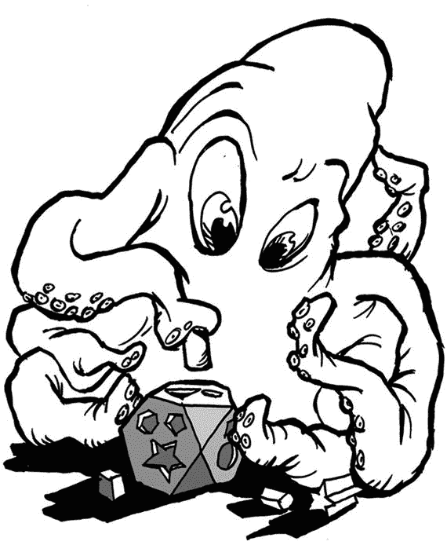

# 4. 测试驱动开发

让我们通过尝试和实践来开始吧。

严重依赖单元测试的开发人员使用一种称为“测试驱动开发”或 TDD 的技术。

TDD 是一个软件开发过程，你在实现代码之前先编写测试。因此，测试引导开发者编写代码本身。TDD 是一个循环过程，包含 4+1 个步骤：编写测试、编写代码、重构、再次测试，然后重复此过程。

## PHP TDD 工具

有许多工具对 PHP 中的 TDD 非常有帮助。

### PHPUnit

PHPUnit (`https://phpunit.de/`) 是 PHP 进行单元测试和 TDD 的事实标准工具。它已集成到 CakePHP 中，因此你很快就会熟悉它的使用。

然而，还有其他工具也拥有不断增长的社区并提供支持。

### Codeception

Codeception (`http://codeception.com/`) 支持编写单元测试、功能测试和验收测试。它已集成到几个 PHP 开发框架中，例如 Zend、Symfony、Laravel 等。

### SimpleTest

SimpleTest (`http://simpletest.org/`) 是一个易于使用的框架，支持 SSL、代理和认证。JUnit 的用户会熟悉其界面。

### Atoum

Atoum (`https://github.com/atoum`) 是一个相对较新的参与者，它使用了 PHP 5.3 版本中引入的新 PHP 特性。

### Selenium

Selenium (`http://www.seleniumhq.org/`) 实际上比前面提到的工具更全面，因为它是一个自动化浏览器的复杂、健壮的系统。使用它可以对整个 Web 应用进行测试。

## TDD 开发周期

TDD 需要一种不同的思维方式以及不同的编码风格。让我们看看它需要什么。对于手头的 CakePHP 来说，你无需从头开始。它的框架已经包含了许多优秀的功能。所以，现在我们只需专注于我们的应用开发。

