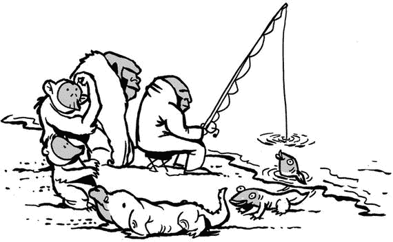

# 5. 开发周期

伟大的生命循环

开发模型有很多种。在我看来，选择合适的模型可能是开发过程中的重要一环，尤其是在习惯和实践方式确实存在差异的情况下。处理 Web 应用程序和桌面应用程序也有不同的方法。我们都有自己偏爱的实践方式。让我来分享一下我的做法：那就是敏捷软件开发。

## 敏捷

敏捷软件开发是一套[软件开发](https://en.wikipedia.org/wiki/Software_development)原则，其需求和解决方案源自团队协作。它提倡适应性规划、渐进式开发、早期交付和持续改进，并鼓励对变化做出快速而灵活的反应。

敏捷宣言（[`http://agilemanifesto.org/`](http://agilemanifesto.org/)）简短而明了。

### 敏捷宣言

“我们正在通过实践并帮助他人实践，揭示更好的软件开发方法。通过这项工作，我们开始重视：

1.  个体和互动 高于 流程和工具

2.  可工作的软件 高于 详尽的文档

3.  客户合作 高于 合同谈判

4.  响应变化 高于 遵循计划

也就是说，虽然右项也有其价值，但我们更重视左项的价值。”

### 宣言背后的 12 条原则

敏捷宣言背后有 12 条原则。

1.  我们的最高优先事项是通过尽早并持续地交付有价值的软件来满足客户。

2.  欢迎不断变化的需求，即使是在开发后期。敏捷流程利用变化为客户创造竞争优势。

3.  频繁地交付可工作的软件，交付间隔可以从几周到几个月，倾向于采用更短的时间尺度。

4.  业务人员和开发人员必须在项目期间每天一起工作。

5.  项目由有动力的个体构建。给予他们所需的环境和支持，并信任他们能够完成工作。

6.  向开发团队传达信息或在团队内部传达信息，最高效且最有效的方法是面对面的交谈。

7.  可工作的软件是衡量进度的首要标准。

8.  敏捷流程促进可持续的开发。赞助人、开发者和用户应该能够无限期地保持恒定的节奏。

9.  持续关注技术卓越和良好设计能增强敏捷性。

10.  简单性——最大化未完成工作的艺术——是至关重要的。

11.  最好的架构、需求和设计源自自组织团队。

12.  团队定期反思如何能变得更有效，然后相应地调整其行为。

### CakePHP 如何支持敏捷开发

正如你所见，上述某些原则需要特定的思维模式、思考方式，而有些原则实际上需要一些技术支持。

烘焙是在短时间内让某些东西可见的好方法。因此，它有助于遵循原则 1、4 和 7。

得益于 CakePHP 的 MVC 模式以及 CakePHP3 中引入的优秀新 ORM，至少在模型层面，后期更改变得很容易。即使在后期阶段，处理数据库表或字段的更改也很简单。因此，它符合原则 2 和 7。

定期交付（原则 3）与其说是一个技术问题，不如说是一个习惯或工作流程组织问题。尽管如此，由于前面提到的两点，CakePHP 为我们实现这一目标提供了一些帮助。

TDD 能帮助你遵循原则 9 和 10。

## 通往价值的敏捷路线图

任何项目都需要一些步骤或阶段。在敏捷中，“通往价值的路线图”提供了项目的高层概览。该路线图包含七个阶段。

### 产品愿景

在第 1 阶段，产品负责人概述产品愿景：项目的定义，它将如何服务于用户（或公司）的目标，以及目标用户是谁。

一个例子：对于想要一个简单易用博客的人来说，`cakeBlog` 是一个提供专注于博客的最小化功能的博客引擎。与其他功能过多的引擎不同，我们的软件是真正为小白设计的。

据我估计，有 90–95% 的情况，客户并不确切知道自己想要什么。他们有一些想法，但远非具体。这没问题，这不是问题——记住原则 2。

### 产品路线图

产品负责人在第 2 阶段创建产品路线图。这是产品需求的高层视图，并包含对这些需求何时开发的大致估算时间表。

### 发布计划

在第 3 阶段，产品负责人制定发布计划，这实际上是可工作软件发布的时间表。它会有多次发布，优先级最高的功能会最先推出。

### 冲刺规划

冲刺是创建软件的迭代周期。在第 4 阶段，团队规划冲刺。冲刺规划在每个冲刺开始时进行，团队在此决定本次冲刺应包含哪些需求。

### 每日站会

在每个冲刺周期中，团队都会召开每日站会。这是阶段 5。会议不超过 15 分钟，内容涉及昨天完成了什么、今天要做什么，以及任何潜在的障碍。

### 冲刺评审

在每个冲刺周期结束时，会展示冲刺过程中创建的可运行产品。这是阶段 6。

### 冲刺回顾

在每个冲刺回顾（即阶段 7）结束时，会召开一次会议，团队在会上讨论冲刺的进展以及下个冲刺的改进想法。

## 总结

在本章中，我介绍了敏捷软件开发的原则和阶段。你了解了 CakePHP 如何支持敏捷开发。即使你遵循其他开发方法，CakePHP 也为你提供了有用的工具。