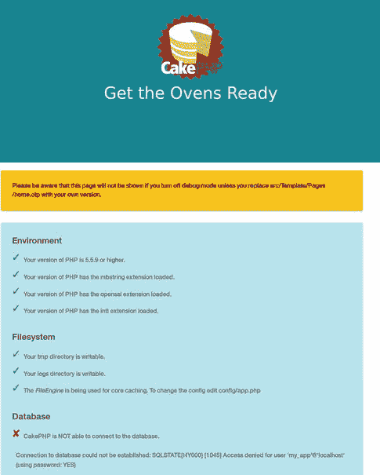
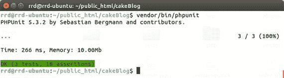
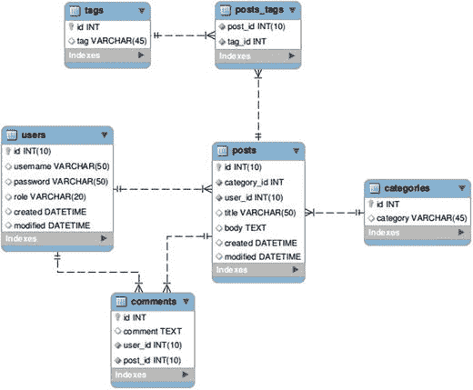
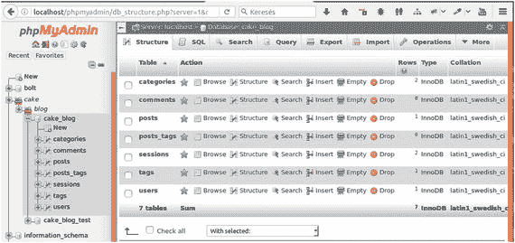
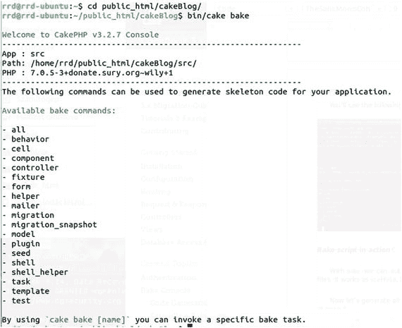
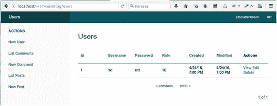
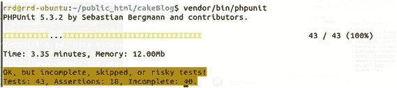

# 6. 准备测试


比尔觉得自己的训练还不够完整。

## 安装

为了让一切都能正常运行，你需要安装 Web 服务器、MySQL 服务器、PHP、CakePHP（`http://book.cakephp.org`）和 PHPUnit（`http://phpunit.de`）。我将以 Ubuntu 16.04 为例，逐一讲解这些步骤。其他系统，如 MacOS 或 Windows，甚至其他 Linux 系统，都有不同的安装方法。

我们将通过终端安装所有软件，为此你需要系统的 root 密码。

### 安装 Web 服务器

Web 服务器，或 HTTP 服务器，是一种处理浏览器请求的软件。它的主要功能是存储、交付和处理网页。最广泛使用的是 Apache（`https://httpd.apache.org/`）。

打开终端并执行以下命令。如果系统尚未安装，该命令将安装最新的 Apache Web 服务器。

```
$ sudo apt-get install apache2
```

结果会很长，但开头和结尾应该类似如下内容：

```
Reading package lists... Done
Building dependency tree
Reading state information... Done
The following package was automatically installed and is no longer required:
...
Processing triggers for libc-bin (2.23-0ubuntu3) ...
Processing triggers for systemd (229-4ubuntu6) ...
Processing triggers for ureadahead (0.100.0-19) ...
Processing triggers for ufw (0.35-0ubuntu2) ...
```

### 安装 MySQL

MySQL 是 Web 应用程序中最流行的开源关系型数据库系统。如果你需要一个数据库来存储应用程序数据，MySQL 是最简单的选择。

打开终端并执行以下命令来安装 MySQL 服务器：

```
$ sudo apt-get install mysql-server
```

结果也很长，所以我省略了中间部分。

```
Reading package lists...
Building dependency tree...
Reading state information...
The following package was automatically installed and is no longer required:
libnghttp2-14
...
Preparing to unpack .../mysql-server_5.7.12-0ubuntu1_all.deb ...
Unpacking mysql-server (5.7.12-0ubuntu1) ...
Setting up mysql-server (5.7.12-0ubuntu1) ...
```

### 安装 PHP

PHP 是一种主要针对 Web 开发而设计的服务器端脚本语言。它非常流行：超过 80% 的 Web 服务器都安装了 PHP。它易于学习、灵活且健壮，并且可能是 CakePHP 所使用的底层语言。

最新版本是 PHP 7，它代表了 PHP 5 之后的一次重大飞跃。PHP 7 引入了标量类型声明、返回类型声明、null 合并运算符、太空船运算符、匿名类以及许多其他特性。

为了确保一切正常工作，PHP 应与一些模块一起安装。我们将 PHP 作为 Apache 模块运行，并安装 MySQL、mbstring、intl 和 xml 模块。

```
$ sudo apt-get install php7.0 libapache2-mod-php7.0 php7.0-mysql php7.0-mbstring php7.0-intl php7.0-xml
```

输出结果同样做了删减。

```
Reading package lists...
Building dependency tree...
Reading state information...
The following packages were automatically installed and are no longer required:
libjs-excanvas mercurial mercurial-common php-cli-prompt php-composer-semver
...
Creating config file /etc/php/7.0/mods-available/xsl.ini with new version
Processing triggers for libapache2-mod-php7.0 (7.0.4-7ubuntu2.1) ...
```

### 安装后配置

为了充分利用 CakePHP 的路由功能，我们应该启用 `mod_rewrite`。由于是在开发服务器上，我们将 CakePHP 安装到用户目录，因此我们也需要启用并配置它。

首先，让我们启用 `userdir`。

```
$ sudo a2enmod userdir
```

编辑 `/etc/apache2/mods-enabled/userdir.conf` 并粘贴以下代码：

```
2     UserDir public_html
3     UserDir disabled root

6       AllowOverride FileInfo AuthConfig Limit Indexes
7       Options MultiViews Indexes SymLinksIfOwnerMatch IncludesNoExec

9         Require all granted

12       Require all denied
```

下一个要编辑的文件是 `/etc/apache2/mods-available/php7.0.conf`。在 Ubuntu 上，默认禁用了在用户目录中运行 PHP 脚本，因此我们应该启用它。注释掉该文件的最后五行。

```
21  #
22  #    
23  #        php_admin_flag engine Off
24  #    
25  #
```

让我们启用并配置 `mod_rewrite`。

```
$ sudo a2enmod rewrite
```

为了让所有功能加载并正常工作，我们应该重启 Apache。

```
$ sudo service apache2 restart
```

### 安装 Composer

Composer 是 PHP 的应用程序级包管理器，它提供了管理 PHP 软件及其所需库依赖关系的标准格式。它是任何 PHP 开发必不可少的工具。由于 Composer 是安装 CakePHP 的推荐方式，我们将首先安装它。

打开终端并执行以下命令，通过 `curl` 下载 Composer 并安装到当前目录。

```
$ curl -s https://getcomposer.org/installer | php
```

### 安装 CakePHP

作为示例，我们将使用一个博客来熟悉 CakePHP 单元测试。首先，使用 Composer 创建一个新的 CakePHP 项目。

```
$ cd ~/public_html
$ php composer.phar create-project --prefer-dist cakephp/app cakeBlog
```

这将在当前工作目录下创建一个 `cakeBlog` 文件夹，并下载最新版本的 `cakephp`（撰写本文时为 3.2.8）以及所有必需的包。

安装完成后，你应该为 Web 服务器用户设置 `/tmp` 和 `/logs` 文件夹的写入权限。

Composer 会在项目目录中创建 `composer.json` 和 `composer.lock` 文件。这些文件描述了项目的标识数据、依赖关系以及其他与依赖相关的设置。

由于我们通过 Apache 和 PHP 启用了用户目录，我将它放在了我的主目录（`/home/rrd`）下的 `public_html` 文件夹中，因此我将通过 `http://localhost/~rrd/cakeBlog/` 访问我的应用程序，并在示例中使用此 URL。

如果一切正常，你应该能够通过浏览器导航到你的安装路径。你将看到类似图 6-1 的内容。



**图 6-1.** 安装后的博客

暂时不必担心有关数据库连接的错误消息。我很快就会回到这个问题。

### 安装 PHPUnit

PHPUnit 是 PHP 单元测试的事实标准。PHPUnit 已集成到 CakePHP 中用于单元测试。得益于 Composer，安装它及其所有必需的包非常简单。我们不需要在生产服务器上安装 PHPUnit，因此我们将使用 `--dev` 选项。

```
$ cd ~/public_html/cakeBlog
$ php composer.phar require --dev phpunit/phpunit
```

如果你使用 `--dev` 选项，Composer 会将此依赖项放入 `composer.json` 的 `require-dev` 部分。然后，在生产服务器上，你可以通过使用以下命令跳过这些仅在开发时需要的依赖项的安装：

```
$ php composer.phar --no-dev install
```


### 安装 phpMyAdmin

`phpMyAdmin` 是一款免费开源的 PHP 工具，旨在通过 Web 浏览器管理 MySQL 数据库。它可以执行各种任务，例如创建、修改或删除数据库、表、字段或行；执行 SQL 语句；或者管理用户和权限。

打开您的终端并执行以下命令：

```
$ sudo apt-get install phpmyadmin
```

这将启动安装向导，指导您完成整个安装过程。当系统提示您在 Apache 和 Lighttpd 之间选择时，请选择 Apache。

安装成功后，您应该能够通过浏览器访问 `phpMyAdmin`，地址为 `http://localhost/phpmyadmin`。

### 检查测试配置

要检查一切是否顺利，请在您的应用程序根目录（在我的例子中，是 `public_html/cakeBlog`）下运行以下命令：

```
$ vendor/bin/phpunit
```

您应该会看到类似于图 6-2 的输出。



图 6-2.

PHPUnit 首次测试

 您可能会收到如下错误信息：

`Warning Error: SplFileInfo::openFile(/home/rrd/public_html/cakeBlog/tmp/cache/persistent/myapp_cake_core_translations_cake_en__u_s): failed to open stream: Permission denied in [/home/rrd/public_html/cakeBlog/vendor/cakephp/cakephp/src/Cache/Engine/FileEngine.php, line 395]`

这意味着您对位于 `cakeBlog/tmp` 的 cake `tmp` 目录中的不同文件没有写入权限。例如，在 Ubuntu 上，这些文件归 `www-data` 用户及其组所有。您应该将自己添加到这个组，或者递归地设置自己为 `tmp` 目录的所有者。如果任何时候遇到权限错误，请首先检查 `tmp` 文件夹，因为这里会创建许多新文件。

图 6-2 显示三项测试均成功运行，并进行了十八次断言。这三项测试是为 `PagesController` 自动生成的。相应的测试文件位于 `/tests/TestCase/Controller/PagesControllerTest.php`。如果您有兴趣，可以查看一下。稍后，我将描述该文件的内容。目前，只需知道绿色代表通过即可。测试结束时我们看到了绿色条，说明一切顺利。

## 准备

我们需要设置一些东西，以便开始单元测试。

### 设置调试级别

在 `/config/app.php` 中，您的调试级别默认设置为 `true`。

```
'debug' => filter_var(env('DEBUG', true), FILTER_VALIDATE_BOOLEAN),
```

暂时保持这个设置。这对于单元测试并非强制要求，但错误和调试信息在测试中与在编码中一样有用。

### 设置测试数据库

如果您的应用程序需要与数据库交互（大多数应用都会），那么您需要一个默认数据库和一个测试数据库。所有与数据库相关的测试都将使用测试数据库。

 CakePHP 会在测试运行结束时删除您数据库中的表。所以，**不要**为 `default` 和 `test` 使用同一个数据库；否则，您将丢失数据而不会收到任何警告。

在您的 `/config/app.php` 文件中找到 `Datasources` 定义，并至少更改您默认和测试数据源的用户名、密码和数据库的值。假设我的默认数据库是 `cake_blog`，用户名为 `rrd`，密码为 Gouranga。我的测试数据库是 `cake_blog_test`，使用相同的用户名和密码。

```
app.php
1  'Datasources' => [
2      'default' => [
3          'className' => 'Cake\Database\Connection',
4          'driver' => 'Cake\Database\Driver\Mysql',
5          'persistent' => false,
6          'host' => 'localhost',
7          //'port' => 'non_standard_port_number',
8          'username' => 'rrd',
9          'password' => 'Gouranga',
10          'database' => 'cake_blog',
11          'encoding' => 'utf8',
12          'timezone' => 'UTC',
13          'flags' => [],
14          'cacheMetadata' => true,
15          'log' => false,
16          'quoteIdentifiers' => false,

18          //'init' => ['SET GLOBAL innodb_stats_on_metadata = 0'],

20          'url' => env('DATABASE_URL', null),
21      ],

23      /**
24       * 测试连接用于测试套件。
25       */
26      'test' => [
27          'className' => 'Cake\Database\Connection',
28          'driver' => 'Cake\Database\Driver\Mysql',
29          'persistent' => false,
30          'host' => 'localhost',
31          //'port' => 'non_standard_port_number',
32          'username' => 'rrd',
33          'password' => 'Gouranga',
34          'database' => 'cake_blog_test',
35          'encoding' => 'utf8',
36          'timezone' => 'UTC',
37          'cacheMetadata' => true,
38          'quoteIdentifiers' => false,
39          'log' => false,
40          //'init' => ['SET GLOBAL innodb_stats_on_metadata = 0'],
41          'url' => env('DATABASE_TEST_URL', null),
42      ],
43  ],
```

对于我们的博客，我们希望管理用户，这些用户可以撰写文章并对自己和他人的文章进行评论。文章可以被标记和分类。经过一些规划后，我们得到了如图 6-3 所示的数据库模式。



图 6-3.

数据库模式

您的应用程序将使用[默认数据](http://book.cakephp.org/)源，而测试将使用测试数据源。这些键是自描述的。它们定义了用于访问数据库的类和驱动程序、连接类型、主机和端口、数据库名称、MySQL 用户和密码、字符编码等。

打开您的浏览器，访问 `localhost/phpmyadmin` ([`phpmyadmin.net`](http://phpmyadmin.net))，然后创建默认数据库和测试数据库。您可以通过从顶部标签页中选择“数据库”，然后使用创建数据库表单来完成。或者，从顶部标签页中选择“SQL”，然后复制并粘贴。

使用以下 SQL 语句创建两个数据库及其表：

```
1   SET @OLD_UNIQUE_CHECKS=@@UNIQUE_CHECKS, UNIQUE_CHECKS=0;
2   SET @OLD_FOREIGN_KEY_CHECKS=@@FOREIGN_KEY_CHECKS,
3     FOREIGN_KEY_CHECKS=0;
4   SET @OLD_SQL_MODE=@@SQL_MODE, SQL_MODE='TRADITIONAL';

6   CREATE SCHEMA IF NOT EXISTS `cake_blog`
7     DEFAULT CHARACTER SET latin1;
```

首先，我们创建默认数据库，即 `cake_blog`。

```
8   USE `cake_blog`;
```


10  -- -----------------------------------------------------
11  -- 表 `cake_blog`.`users`
12  -- -----------------------------------------------------
13  CREATE TABLE IF NOT EXISTS `cake_blog`.`users` (
14    `id` INT(10) UNSIGNED NOT NULL AUTO_INCREMENT ,
15    `username` VARCHAR(50) NULL DEFAULT NULL ,
16    `password` VARCHAR(50) NULL DEFAULT NULL ,
17    `role` VARCHAR(20) NULL DEFAULT NULL ,
18    `created` DATETIME NULL DEFAULT NULL ,
19    `modified` DATETIME NULL DEFAULT NULL ,
20    PRIMARY KEY (`id`) )
21  ENGINE = InnoDB
22  DEFAULT CHARACTER SET = latin1;

然后我们添加用户表，该表用于存储博客的用户。

```
25  -- -----------------------------------------------------
26  -- 表 `cake_blog`.`categories`
27  -- -----------------------------------------------------
28  CREATE TABLE IF NOT EXISTS `cake_blog`.`categories` (
29    `id` INT UNSIGNED NOT NULL AUTO_INCREMENT ,
30    `category` VARCHAR(45) NULL ,
31    PRIMARY KEY (`id`) )
32  ENGINE = InnoDB;
```

我们的博客文章可以与分类相关联，因此我们为分类创建了一个数据库表。

```
35  -- -----------------------------------------------------
36  -- 表 `cake_blog`.`posts`
37  -- -----------------------------------------------------
38  CREATE TABLE IF NOT EXISTS `cake_blog`.`posts` (
39    `id` INT(10) UNSIGNED NOT NULL AUTO_INCREMENT ,
40    `category_id` INT UNSIGNED NOT NULL ,
41    `user_id` INT(10) UNSIGNED NOT NULL ,
42    `title` VARCHAR(50) NULL DEFAULT NULL ,
43    `body` TEXT NULL DEFAULT NULL ,
44    `created` DATETIME NULL DEFAULT NULL ,
45    `modified` DATETIME NULL DEFAULT NULL ,
46    PRIMARY KEY (`id`) ,
47    INDEX `fk_posts_users` (`user_id` ASC) ,
48    INDEX `fk_posts_categories1` (`category_id` ASC) ,
49    CONSTRAINT `fk_posts_users`
50      FOREIGN KEY (`user_id` )
51      REFERENCES `cake_blog`.`users` (`id` )
52      ON DELETE RESTRICT
53      ON UPDATE RESTRICT,
54    CONSTRAINT `fk_posts_categories1`
55      FOREIGN KEY (`category_id` )
56      REFERENCES `cake_blog`.`categories` (`id` )
57      ON DELETE RESTRICT
58      ON UPDATE RESTRICT)
59  ENGINE = InnoDB
60  AUTO_INCREMENT = 4
61  DEFAULT CHARACTER SET = latin1;
```

博客文章同样需要存储在数据库表中。我们为 `user_id` 和 `category_id` 字段添加了索引以及外键约束。

```
64  -- -----------------------------------------------------
65  -- 表 `cake_blog`.`tags`
66  -- -----------------------------------------------------
67  CREATE TABLE IF NOT EXISTS `cake_blog`.`tags` (
68    `id` INT UNSIGNED NOT NULL AUTO_INCREMENT ,
69    `tag` VARCHAR(45) NULL ,
70    PRIMARY KEY (`id`) )
71  ENGINE = InnoDB;
```

我们希望在文章中使用标签功能，因此还需要一个用于存储标签的表。

```
74  -- -----------------------------------------------------
75  -- 表 `cake_blog`.`posts_tags`
76  -- -----------------------------------------------------
77  CREATE TABLE IF NOT EXISTS `cake_blog`.`posts_tags` (
78    `id` INT UNSIGNED NOT NULL AUTO_INCREMENT,
79    `post_id` INT(10) UNSIGNED NOT NULL ,
80    `tag_id` INT UNSIGNED NOT NULL ,
81    PRIMARY KEY (`id`),
82    INDEX `fk_posts_has_tags_tags1` (`tag_id` ASC) ,
83    INDEX `fk_posts_has_tags_posts1` (`post_id` ASC) ,
84    CONSTRAINT `fk_posts_has_tags_posts1`
85      FOREIGN KEY (`post_id` )
86      REFERENCES `cake_blog`.`posts` (`id` )
87      ON DELETE RESTRICT
88      ON UPDATE RESTRICT,
89    CONSTRAINT `fk_posts_has_tags_tags1`
90      FOREIGN KEY (`tag_id` )
91      REFERENCES `cake_blog`.`tags` (`id` )
92      ON DELETE RESTRICT
93      ON UPDATE RESTRICT)
94  ENGINE = InnoDB
95  DEFAULT CHARACTER SET = latin1;
```

接下来需要创建文章表和标签表之间的关联表。

```
98  -- -----------------------------------------------------
99  -- 表 `cake_blog`.`comments`
100  -- -----------------------------------------------------
101  CREATE TABLE IF NOT EXISTS `cake_blog`.`comments` (
102    `id` INT UNSIGNED NOT NULL AUTO_INCREMENT ,
103    `comment` TEXT NULL ,
104    `user_id` INT(10) UNSIGNED NOT NULL ,
105    `post_id` INT(10) UNSIGNED NOT NULL ,
106    PRIMARY KEY (`id`) ,
107    INDEX `fk_comments_users1` (`user_id` ASC) ,
108    INDEX `fk_comments_posts1` (`post_id` ASC) ,
109    CONSTRAINT `fk_comments_users1`
110      FOREIGN KEY (`user_id` )
111      REFERENCES `cake_blog`.`users` (`id` )
112      ON DELETE RESTRICT
113      ON UPDATE RESTRICT,
114    CONSTRAINT `fk_comments_posts1`
115      FOREIGN KEY (`post_id` )
116      REFERENCES `cake_blog`.`posts` (`id` )
117      ON DELETE RESTRICT
118      ON UPDATE RESTRICT)
119  ENGINE = InnoDB;
```

最后，我们创建评论表，评论将存储在该表中。

```
123  SET SQL_MODE=@OLD_SQL_MODE;
124  SET FOREIGN_KEY_CHECKS=@OLD_FOREIGN_KEY_CHECKS;
125  SET UNIQUE_CHECKS=@OLD_UNIQUE_CHECKS;
```

作为最后一步，我们还需要创建测试数据库。目前，`cake_blog_test` 可以没有任何数据库表。

```
127  CREATE SCHEMA IF NOT EXISTS `cake_blog_test`
128    DEFAULT CHARACTER SET latin1;
```

如果一切按计划进行，你应该会看到类似图 6-4 所示的内容。



图 6-4.

数据库创建后的 `phpMyAdmin`

### 设置会话处理

正如我们在真实的中型应用中所做的那样，我们将为此项目使用 CakePHP 的数据库会话处理。

CakePHP 提供了四种不同的现成会话处理机制。

默认选项是 `php`，此时会话处理由 PHP 按照 `php.ini` 定义的方式进行。我通常不选择此选项。

第二个选项是 `cake`，会话数据将存储在 `/tmp/sessions` 文件夹的文件中。当应用非常简单且不使用任何数据库时，我会使用此选项。

第三个选项是 `database`，会话数据存储在数据库的 `sessions` 表中。在大多数情况下，我会使用此选项。

最后一个选项是 `cache`，会话存储在诸如 APC、Memcached 或 XCache 这类缓存中。如果你计划开发一个高使用率的应用，推荐使用此选项。

Cake 使得随时更改会话处理变得极其简单。因此，随着你的应用受欢迎程度增长，你可以从 `database` 切换到 `cache`。

打开你的 `/config/app.php` 文件，将会话处理的默认值更改为 `database`。

```
1  'Session' => [
2       'defaults' => 'database',
3   ],
```

用于会话的数据库表的 SQL 脚本位于 `app/config/schema/sessions.sql`。你应该将此表添加到 `default` 数据库。

你无需向测试数据库添加任何数据库表。CakePHP 的测试套件会自动完成此操作。

### 创建默认布局

如果需要，可以更改 `/src/Template/Layout` 目录下的 `default.ctp` 文件。这不是必需的，但在某个时候，我们会想更改 CakePHP 的默认布局。为什么不现在就开始呢？


### CakePHP 模型（Models）

模型是 MVC 中的 M。作为我们 Web 应用的基础，它们负责数据的存储、访问和操作。CakePHP 的 `Model` 类文件分为 `Table` 和 `Entity` 对象。`Table` 对象提供对存储在特定数据表中的实体集合的访问。CakePHP 支持 MySQL、SQLite、PostgreSQL、SQLServer 和 Oracle。

模型继承自 CakePHP 的 `Model` 类，因此它们开箱即用就具备了许多功能。它们拥有诸如 `Model.beforeFind`、`Model.beforeSave`、`Model.afterSave` 等事件。它们还继承了如 `find()`、`get()`、`save()` 等方法。

#### 数据库查询

最常用的模型方法是 `find()`，它返回一个查询对象。

```
1  $query = $posts
2      ->find()
3      ->select(['id', 'title'])
4      ->where(['id  100])
5      ->order(['created' => 'DESC']);
```

如你所见，`find()` 可以与其他模型方法（如 `select()`、`where()` 等）链式调用。这是 CakePHP 3 新对象关系映射（ORM）特性的一部分，该特性非常方便且自解释性强。通过这个查询，我们可以选择 `id` 小于 100 的帖子的 `id` 和 `title`，并且结果集将按 `created` 字段排序。这个查询将生成类似于以下 SQL 语句的内容：

```
SELECT id, title FROM posts WHERE id < 100 ORDER BY created DESC;
```

查询对象可以在之后被修改，因为它们实际上是在我们调用 `execute()`、对查询进行迭代或调用 `all()` 时才执行的。

#### 模型关联

在 CakePHP 应用中，数据库表之间的关系由模型关联处理。共有四种关联类型。一对一关系由 `hasOne` 关联处理，一对多关系由 `hasMany` 处理，多对一关系由 `belongsTo` 处理，多对多关系由 `belongsToMany` 处理。

##### HasOne 关联

在我们的博客数据库中，没有 `hasOne` 关联。我们可以创建一个 profiles 数据表和模型，如果一个用户只有一个个人资料，那么他就与个人资料建立了 `hasOne` 关联。在这种情况下，个人资料表应该有一个 `user_id` 字段来描述它与用户之间的联系。

##### HasMany 关联

在我们的博客数据库分类中，`hasMany` 帖子意味着一个分类可以拥有多个帖子。

##### BelongsTo 关联

这是 `hasOne` 或 `hasMany` 关联的另一端。因此，在前面的例子中，个人资料 `belongsTo` 一个用户，而帖子 `belongsTo` 一个分类。

##### BelongsToMany 关联

在我们的博客数据库中，帖子与标签之间存在 `belongsToMany` 关联，这意味着一个帖子可以有多个标签，并且一个标签可以被分配给多个帖子。

### CakePHP 控制器（Controllers）

控制器是 MVC 中的 C。控制器是模型和视图之间的中间件。你的控制器应负责解释请求数据。通常，一个控制器用于管理一个模型的逻辑。

控制器应继承 Cake 的 `Controller` 类。控制器提供了许多方法，这些方法被称为动作（actions）。默认情况下，控制器中的每个公共方法都是一个动作，并且可以通过 URL 访问。动作负责解释请求、创建响应并为视图设置变量。

### CakePHP 视图（Views）

视图是 MVC 中的 V。视图用于呈现响应，主要是创建 HTML 文档。布局是视图的主容器。每个控制器动作都应在 `/src/Template/` 文件夹中有其对应的视图文件。

让我们了解如何自动创建模型、控制器和视图。

### 烘焙（Baking）

在我看来，CakePHP 最好的特性之一就是烘焙，它本身就值得写一本书。

我在此不深入细节，但 `bake` 是一个用于为你的博客自动生成基本代码的工具。使用 `bake`，你可以自动生成模型、控制器和模板文件，以及许多其他文件，例如 fixtures、shells 等。

打开终端，进入你的 `app` 文件夹，然后启动 CakePHP 的 `bake` 脚本。

```
1  $ cd ∼/public_html/cakeBlog/
2  $ bin/cake bake
```

如果看到关于文件权限的错误信息，请忽略它。因为 Web 服务器通常以与你不同的用户身份运行，所以它具有不同的文件权限。你可以通过手动清空 `app/tmp/cache` 文件夹的子文件夹或修复其权限来消除这些错误信息。

你将看到如图 6-5 所示的屏幕。



图 6-5.

`bake` 脚本运行中

现在让我们一次性生成所有模型的数据表和实体文件、对应的 fixtures 以及测试文件。为此，我们将为 `bake` 使用 `model all` 参数。这将在 `/src/Model/Entity`、`/src/Model/Table`、`/tests/Fixture` 和 `/tests/TestCase/Model/Table` 目录下创建文件。`Bake` 将为这些文件夹中的每个数据库表生成一个文件。

```
1  $ bin/cake bake model all
```

我们可以对控制器和视图使用相同的过程。通过以下命令，所有控制器和视图文件将由 `bake` 创建：

```
1  $ bin/cake controller all
2  $ bin/cake template all
```

如果你收到如 `Error: Cannot generate views for models with no primary key` 这样的错误信息，那是因为会话模型导致的。在这种情况下，请手动烘焙你的标签和用户模板。

```
1  $ bin/cake template tags
2  $ bin/cake template users
```

### 清理工作

一些文件是多余的，应该被删除。`Bake` 会为会话和连接表生成文件。由于我们的博客将非常简单，我们不希望连接表有任何多余的内容，因此我们不需要这些文件。

- `src/Controller/PostsTagsController.php`
- `src/Controller/SessionsController.php`
- `src/Model/Entity/Session.php`
- `src/Model/Table/SessionsTable.php`
- `tests/TestCase/Controller/SessionsControllerTest.php`
- `tests/TestCase/Controller/PostsTagsControllerTest.php`
- `tests/TestCase/Model/Table/SessionsTableTest.php`
- `tests/Fixture/SessionsFixture.php`

你可以在将会话表添加到数据库之前烘焙你的模型。在这种情况下，将不会生成与会话相关的文件，因此你无需删除它们。

你可以在不使用 `all` 参数的情况下烘焙模型、控制器和视图，然后逐一选择你的对象。你也可以跳过 `join` 模型，这样就不会为 `PostsTags` 生成任何内容。

我认为我的方法是这三个选项中速度最快的。

### 让我们来试试

浏览到 `http://localhost/~rrd/cakeBlog/users`。你应该会看到类似于图 6-6 的内容，并且能够添加一个用户。



图 6-6.

烘焙后的用户页面

你也可以添加、修改和删除分类、标签、帖子以及评论。所有这些代码都是由 `bake` 自动生成的。我们一行代码都还没写呢。很酷吧？

再次运行 `vendor/bin/phpunit`，检查一切是否顺利。在图 6-7 中，点表示成功的测试；I 表示不完整的测试。



图 6-7.

使用 `bake` 生成代码后的测试结果

暂时不用担心不完整的测试。所以，`bake` 生成了 43 个测试。其中，18 个是断言，40 个是不完整的测试。

现在是时候看看这里都是由什么组成的了。让我们从测试数据 fixtures 开始。

## 总结

在本章中，我们更深入地了解了测试。我们安装了所有必要的服务器、PHP 和 Composer，并通过 Composer 和我们的数据库创建了应用骨架。你学会了如何使用 `bake` 脚本自动生成代码。我们还为博客设置了一种会话处理方法。


