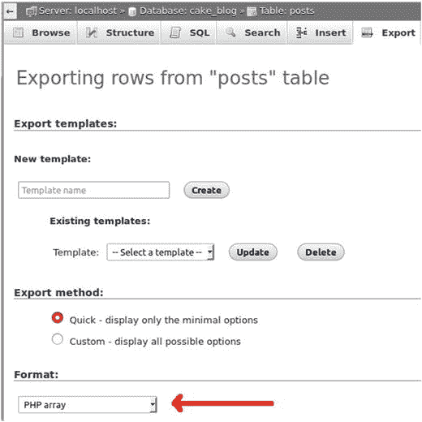

# 7. 测试夹具


菲利克斯总觉得自已有点与众不同

大多数情况下，应用程序都会处理数据。用户会添加新文章和评论或编辑它们，管理员会创建新标签和分类等。测试夹具是为测试用例生成的样本数据。为什么需要它们？操作应用程序数据是个坏主意。我们可能在开发过程中意外删除或修改数据，也可能破坏数据库关系。这可不是个好主意。测试夹具是另一层隔离。一个更小、更清晰的数据集有助于确保我们的代码返回预期结果并快速运行。这绝对是个好主意。

CakePHP 使用 `config/app.php` 配置文件中名为 `$test` 的连接。CakePHP 会为测试夹具创建表，向表中填充数据，并在（运行测试方法后）清空测试夹具表，并从测试数据库中移除测试夹具表。

## 创建测试夹具

有几种方法可以创建测试夹具。你应该在 `/app/Test/Fixture` 文件夹中创建你的测试夹具。

### 即时创建

由于我们已经烘焙了模型，所以我们在 `/tests/Fixture` 目录下已经有了测试夹具文件，例如 `UsersFixture.php`。让我们检查一下之前生成的文件。

```php
[
21              'type' => 'integer', 'length' => 10, 'unsigned' => true,
22              'null' => false, 'default' => null, 'comment' => '',
23              'autoIncrement' => true, 'precision' => null
24              ],
25          'username' => [
26              'type' => 'string', 'length' => 50, 'null' => true,
27              'default' => null, 'comment' => '', 'precision' => null,
28              'fixed' => null
29              ],
30          'password' => [
31              'type' => 'string', 'length' => 50, 'null' => true,
32              'default' => null, 'comment' => '', 'precision' => null,
33              'fixed' => null
34              ],
35          'role' => [
36              'type' => 'string', 'length' => 20, 'null' => true,
37              'default' => null, 'comment' => '', 'precision' => null,
38              'fixed' => null
39              ],
40          'created' => [
41              'type' => 'datetime', 'length' => null, 'null' => true,
42              'default' => null, 'comment' => '', 'precision' => null
43              ],
44          'modified' => [
45              'type' => 'datetime', 'length' => null, 'null' => true,
46              'default' => null, 'comment' => '', 'precision' => null
47              ],
48          '_constraints' => [
49              'primary' => [
50                'type' => 'primary', 'columns' => ['id'], 'length' => []
51                  ],
52          ],
53          '_options' => [
54              'engine' => 'InnoDB',
55              'collation' => 'latin1_swedish_ci'
56          ],
57      ];
58      // @codingStandardsIgnoreEnd

60      /**
61       * 记录
62       *
63       * @var array
64       */
65      public $records = [
66          [
67              'id' => 1,
68              'username' => 'Lorem ipsum dolor sit amet',
69              'password' => 'Lorem ipsum dolor sit amet',
70              'role' => 'Lorem ipsum dolor ',
71              'created' => '2016-04-24 18:39:32',
72              'modified' => '2016-04-24 18:39:32'
73          ],
74      ];
75  }
```

`$fields` 数组描述了模型 `Users` 的表模式。它描述了所有字段、它们的数据类型和长度、默认值以及其他一些值。它还包括了使用的索引。

`$records` 数组包含一条样本记录，但你可以根据需要添加任意多条。使用这种方法，你可以在应用程序数据库中还没有任何数据之前——甚至在你完全没有数据库之前——就开始编写单元测试。这在开发的早期阶段测试数据库结构变更时非常有用。

在数据库结构已确定的后期开发阶段，拥有不会改变的记录对于测试也至关重要。

当你运行一个导入了此测试夹具的测试时，CakePHP 会在测试数据库中创建一个 `Users` 表，其中包含此处描述的字段，并从 `$records` 数组中插入记录。模型测试将在测试期间使用这些数据。

你也可以在测试夹具中使用动态数据。为此，只需使用 `init()` 函数即可。

如你所见，文件的开头与上一个示例相同。但是在创建 `$fields` 数组之后，我们并没有创建 `$records` 数组，而是在 `init()` 方法中创建它。我们这样做是因为我们想要将动态数据插入到 `created` 和 `modified` 字段中。因此，这些数据在每次测试运行时都会基于当前系统时间而不同。

### 导入现有模型架构

如果你已经创建了数据库模型，可以将其导入到测试固件中，而无需包含任何现有数据记录。这在早期开发阶段（数据库结构频繁变化时）非常有用。如果不这样做，所有数据库更改都必须在固件中手动进行修改。这会增加一些开销，因此在后期开发阶段，前面的示例会更快。

```php
'Users'];
}
?>
```

如果你有数据表但没有模型，则应使用以下代码示例。这在创建插件或库时很有用。

```php
'users'];
}
?>
```

不要忘记手动向固件中添加记录。由于测试应尽可能快地运行，请尽量只添加足够的记录。请记住：插入和删除测试记录需要时间。记录越多，所需时间就越长，因此只需添加绝对必要的记录。假设在应用程序的某处，我们希望列出所有用户名以给定字母开头的用户。那么我们的模型中会有一个 `getUsersByName($ch)` 方法来处理此需求。

在这种场景下，我们的用户固件中应该至少有三条具有不同用户名的记录。

```php
public $records = [
    [
        'id' => 1,
        'username' => 'rrd',
        'password' => 'Lorem ipsum dolor sit amet',
        'role' => 'Lorem ipsum dolor ',
        'created' => '2016-04-24 18:39:32',
        'modified' => '2016-04-24 18:39:32'
    ],
    [
        'id' => 2,
        'username' => 'gauranga',
        'password' => 'Lorem ipsum dolor sit amet',
        'role' => 'Lorem ipsum dolor ',
        'created' => '2016-04-24 18:39:32',
        'modified' => '2016-04-24 18:39:32'
    ],
    [
        'id' => 3,
        'username' => 'r2d2',
        'password' => 'Lorem ipsum dolor sit amet',
        'role' => 'Lorem ipsum dolor ',
        'created' => '2016-04-24 18:39:32',
        'modified' => '2016-04-24 18:39:32'
    ],
];
```

有了这三条记录，我们就可以为 `getUsersByName($ch)` 编写测试了。如果 `$ch` 是“g”，我们应该得到记录 2；如果 `$ch` 是“r”，我们应该得到记录 1 和 3；其他情况则不应得到任何记录。

如果你不喜欢手动输入记录，可以通过 `phpMyAdmin` 从现有数据库表中导入。只需使用 `export` 功能，并选择 `PHP array` 作为导出格式，如图[7-1]所示。



图 7-1.

通过 `phpMyAdmin` 导出记录

这会为你生成一个数组，你可以将其复制粘贴作为你的`$records`数组。这可以轻松获得大量记录，但仍应尽量保持记录数量尽可能少。

## 将固件加载到测试中

让我们来看看`tests/TestCase/Model/Table/UsersTableTest.php`文件，该文件也是由`bake`生成的，正如上一章所述。

```php
1  <?php
2  namespace App\Test\TestCase\Model\Table;
```

命名空间是在 PHP 5.3 中引入的，也是 PHP 7 应用程序中推荐使用的语言特性。命名空间最简单的定义是它是一种封装项目的方式。

```php
4  use App\Model\Table\UsersTable;
5  use Cake\ORM\TableRegistry;
6  use Cake\TestSuite\TestCase;
```

通过`use`操作符，我们导入其他命名空间。

```php
8  /**
9   * App\Model\Table\UsersTable Test Case
10   */
11  class UsersTableTest extends TestCase
12  {
```

模型测试扩展了 CakePHP 的`TestCase`类。

```php
14      /**
15       * Test subject
16       *
17       * @var \App\Model\Table\UsersTable
18       */
19      public $Users;
21      /**
22       * Fixtures
23       *
24       * @var array
25       */
26      public $fixtures = [
27          'app.users',
28          'app.comments',
29          'app.posts',
30          'app.categories',
31          'app.tags',
32          'app.posts_tags'
33      ];
```

`$fixtures`数组定义了应该为测试加载哪些固件。如你所见，`bake`导入了与`User`模型相关的固件。现在，先删除相关模型，保持简单。将代码修改如下：

```php
26  public $fixtures = ['app.users'];
```

如果你的任何模型查询不会尝试检索相关的数据库表，这就足够了。由于只有这里添加的固件才会加载到测试数据库中，因此相关的数据库表将不存在，尝试查询它们会产生错误。

始终保持测试简单，只加载绝对必要的固件，这是一个好习惯。

## 总结

在本章中，你学习了固件的概念，并了解了如何编写、生成固件并将其加载到测试中。最重要的经验之一是尽量保持固件简短，并且只在测试中加载必要的固件。