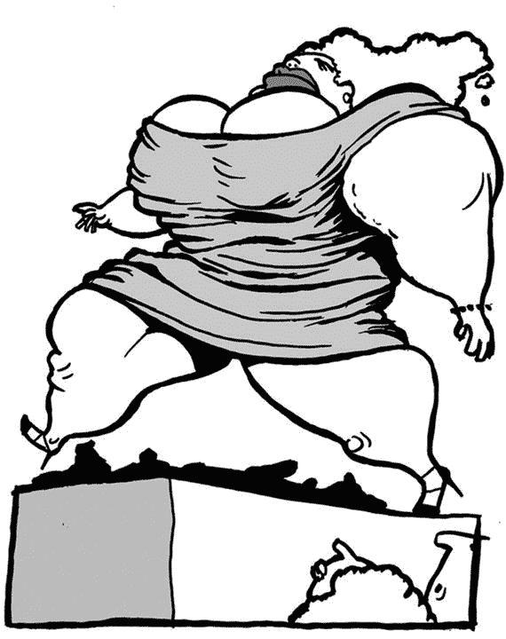
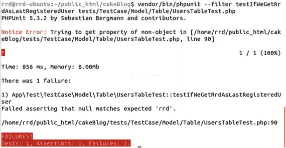

# 8. 模型测试



我们是重量级模型的忠实粉丝

好了。我不想再折磨你了。让我们编写第一个单元测试。

在你的`UserFixture.php`文件中使用以下示例代码。

```
1   'Users'];
11     public $records = [
12          [
13              'id' => 1,
14              'username' => 'rrd',
15              'password' => 'Gouranga',
16              'role' => 'admin',
17              'created' => '2016-05-01 12:00:00',
18              'modified' => '2016-05-01 12:00:00'
19          ],
20      ];
21  }
```

如你所见，这非常简单。我们导入`Users`模型，并只创建了一条记录，即一个用户。

假设我们想显示最后注册的用户是谁。由于我们采用测试驱动开发（TDD），首先我们创建测试。打开`/tests/TestCase/Model/Table/UsersTableTest.php`，并在文件末尾添加第一个测试函数。

```
1  public function testIfWeGetRrdAsLastRegisteredUser()
2  {
3      $actual = $this->Users->getLastRegistered();
4      $expected = 'rrd';
5      $this->assertEquals($expected, $actual->username);
6  }
```

我可能应该对此稍作解释。但在深入探讨之前，请先创建模型方法本身并运行测试。

因为我们是重量级模型的忠实粉丝，我们会将此功能放入`Users`模型中。打开`/src/Model/Table/UsersTable.php`，并在文件末尾添加一个新函数。

```
1  public function getLastRegistered(){
2      return true;
3  }
```

这很蠢，但正是我们目前所需要的。让我们运行它。结果应类似于图[8-1]所示。



图 8-1.

测试失败

```
$ cd ∼/public_html/cakeBlog
$ vendor/bin/phpunit --filter testIfWeGetRrdAsLastRegisteredUser tests/TestCase/Model/Table/UsersTableTest.php
```

恭喜！你刚刚编写了第一个单元测试。让我们探索一下这里发生了什么，以及为什么我们对测试失败感到高兴。


你可能会收到如下错误消息：

`Warning Error: SplFileInfo::openFile(/home/rrd/public_html/cakeBlog/tmp/cache/models/myapp_cake_model_default_users): failed to open stream: Permission denied in [/home/rrd/public_html/cakeBlog/vendor/cakephp/cakephp/src/Cache/Engine/FileEngine.php, line 395]`

这意味着你没有写入缓存文件的权限。请更改`/tmp`文件夹中所有文件的权限和所有权。


