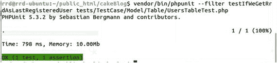

# 通过测试

好的。我们的测试失败了。现在将实际代码添加到用户模型。

```
1  public function getLastRegistered()
2  {
3      return $this->find()
4          ->order('created')
5          ->first();
6  }
```

我们通过调用`Users`模型的`find()`方法请求最后注册用户的数据，按`created`字段排序结果，并返回第一条结果。

重新运行测试应显示通过测试的报告，并带有绿色条（图 8-2）。



图 8-2. 通过测试

那么，我们的测试实际发生了什么？

```
1  public function testIfWeGetRrdAsLastRegisteredUser()
2  {
3      $actual = $this->Users->getLastRegistered();
```

该方法将返回一个从测试数据库填充的`User`对象。

```
4      $expected = 'rrd';
```

我们定义期望值。

```
5      $this->assertEquals($expected, $actual->username);
6  }
```

然后进行断言。如果一切正常，`$actual->username`应为`'rrd'`。

打开你的`UsersFixture.php`文件并添加一条新记录。如果第二个用户的创建时间早于`rrd`，你的测试将通过。如果创建时间晚于`rrd`，你的测试将失败。完成实验后，请确保代码能让测试通过。测试失败意味着出了问题。

我们的测试耗时 798 毫秒完成。测试应运行快速。始终关注执行时间。

