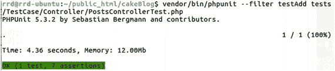
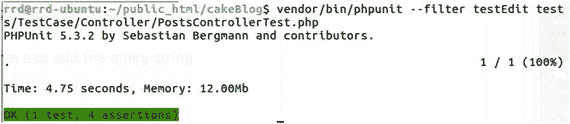

# 设置请求数据

大多数情况下，我们需要控制器中的数据来处理来自`get`、`post`、`cookie`或`session`的内容。

```
1  public function testAdd()
2  {
3      $data = [
4          'category_id' => 2,
5          'user_id' => 1,
6          'title' => 'Test Post Title',
7          'body' => 'Test post body with same sample text',
8          'created' => '2016-05-01 14:00:00',
9          'modified' => '2016-05-01 14:00:00',
10          'tags' => [
11              ['id' => 1],
12              ['id' => 2],
13          ]
14      ];
15      $this->post('/posts/add/', $data);
16
17      $this->assertResponseSuccess();
```

首先，我们创建一个数据数组以 POST 方式发送到控制器。然后发送数据并检查是否收到成功响应状态码。

```
19      $posts = TableRegistry::get('Posts');
20      $query = $posts->find()->where(['title' => $data['title']]);
21      $this->assertEquals(1, $query->count());
```

在上一章中，我们创建了帖子的固定数据集。因此，我们知道只有这个新帖子的标题与数据数组中的标题相同，所以计数应返回 1。

```
23      $result = $query->toArray();
24      $poststags = TableRegistry::get('PostsTags');
25      $query = $poststags->find()->where(['post_id' => $result[0]->id]);
26      $result = $query->toArray();
27      $this->assertEquals(1, $result[0]->tag_id);
28      $this->assertEquals(2, $result[1]->tag_id);
29  }
```

在最后一个断言中，我们检查这个新帖子是否包含两个标签：1 和 2。（见图 9-1。）



图 9-1. `testAdd` 的结果

测试 `GET` 数据非常简单。只需将查询字符串添加到 `get` 调用的第一个参数中即可。（见图 9-2。）



图 9-2. `testEdit` 的结果

```
1  public function testEdit()
2  {
3      $this->get('/posts/edit/1');
4      $this->assertResponseOk();
5  }
```

## 小节

本章概述了由 `bake` 生成的控制器。我们探讨了 `bake` 的工作原理及其局限性。随后创建了控制器测试，并引入了集成测试和控制器特定的断言方法。

